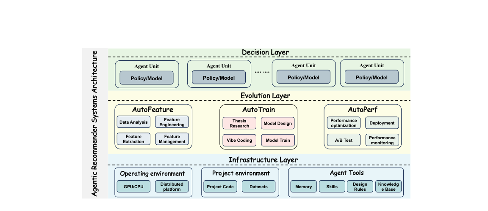
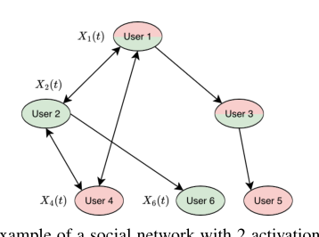
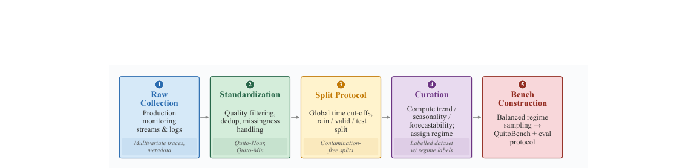

# cs.IR + cs.AI + cs.LG + cs.CL + cs.MA 计算广告论文日报

**日期：2026-03-27**
**生成时间：2026-03-31**
**数据来源：arXiv cs.IR + cs.AI + cs.LG + cs.CL + cs.MA**

---

## 一、今日结论

- 今天建议优先阅读：AgenticRS-Architecture: System Design for Agentic Recommender Systems、Adversarial Bandit Optimization with Globally Bounded Perturbations to Linear Losses、An LP-based Sampling Policy for Multi-Armed Bandits with Side-Observations and Stochastic Availability、QuitoBench: A High-Quality Open Time Series Forecasting Benchmark
- 共保留 4 篇相关候选，其中重点讲解 4 篇。
- 另有 0 篇补充关注论文，仅做简要提示。
- 趋势与创新观察优先基于全量抓取结果，尽量避免只从排序或广告单一视角下结论。

## 二、今日趋势与创新观察

### 1. 趋势概况

- 今天170篇论文中，强化学习与bandit决策类占比最高（81篇），涵盖对抗性bandit优化、侧信息MAB、策略评估等理论与应用工作，说明在线决策与序贯优化仍然是当前研究的绝对重心。
- LLM与语言理解类紧随其后（64篇），但焦点已明显从单纯的生成能力转向LLM的心智模型、鲁棒性、跨文化对齐以及与外部工具的深度整合，研究者开始更多关注LLM的可信赖性与真实场景适配。
- 表示学习与检索排序类（52篇）持续活跃，多模态缺失补全、扩散模型增强的表示、LLM增强GNN的鲁棒性等跨模态表示方案频繁出现，表示层正在成为各类系统改进的核心切入点。
- Agent与多智能体方向（25篇）虽然体量不算最大，但多篇工作将Agent框架从对话或游戏场景推向工业推荐、安全审计和企业自动化，标志着Agentic系统开始真正进入工程落地阶段。

### 2. 推荐系统 / 排序相关创新点

- AgenticRS-Architecture 提出用多个自演化Agent替代传统固定召回-排序pipeline，每个Agent拥有长期记忆和自我改进能力，把推荐系统的全生命周期（数据处理、特征工程、模型迭代）统一到一个可自动协调的Agent架构中，并明确可推广到广告系统。
- 对抗性Bandit优化（Adversarial Bandit with Globally Bounded Perturbations）在非凸非光滑损失下引入全局有界扰动的理论框架，为广告出价、预算分配等需要在对抗环境下做序贯决策的场景提供了新的regret bound保证。
- 带侧信息和随机可用性的MAB（LP-based Sampling Policy）用二部图建模动作与未知量的关联，并处理arm随机不可用的情况，这与广告库存可用性波动、展示位动态变化等场景天然同构。

### 3. 全局创新点

- MUST提出模态特异性表示感知Transformer结合扩散模型，在多模态数据缺失时通过条件扩散过程生成缺失模态的表示而非原始数据，这种'在表示空间做补全'的思路可迁移到任何存在特征缺失的工业场景。
- MemCam在视频生成中引入记忆增强的相机控制模块，用外部记忆存储已生成帧的场景上下文来保持长视频一致性，其核心的'压缩-存储-检索'记忆机制对长序列Agent和长会话推理都有启发。
- 多篇论文同时关注LLM增强系统的鲁棒性与安全性——包括LLM增强GNN的中毒攻击、开放Agentic系统的信任问题——表明随着LLM深度嵌入各类系统，针对性的对抗鲁棒研究正在快速成型为一个独立方向。

## 三、今日一个 AI 知识点

### 表示学习为什么是很多系统的隐形底座

表示学习的目标不是简单把输入压成一个向量，而是把真正影响任务的结构信息保留下来，同时把噪声和偶然因素压下去。后面的检索、排序、聚类、生成，很多时候都只是拿这个表示继续做计算。 很多论文表面看是在做召回、排序、生成，其实核心改进都发生在表示层。先理解表示学习，就更容易抓住论文真正的创新位置。 可以顺着一次具体运行过程来理解：你可以顺着一次前向这样理解：系统先把用户最近点击、搜索词、广告文案和商品属性分别编码，再通过共享空间把它们投到同一组向量坐标里；如果两个对象在任务上更相关，它们在这个空间里就应该更近；后续做召回时，只要比较向量距离，就能先快速找出更可能相关的一批候选。

## 四、今日论文总览

### 1. AgenticRS-Architecture: System Design for Agentic Recommender Systems
- 论文类型：强迁移论文
- 挑选理由：工业推荐系统全生命周期Agent架构，摘要末尾明确提到可推广到广告系统（advertising），涉及召回排序pipeline自动化
- 是否进入重点讲解：是
- 建议动作：进入重点讲解

### 2. Adversarial Bandit Optimization with Globally Bounded Perturbations to Linear Losses
- 论文类型：强迁移论文
- 挑选理由：对抗性bandit优化理论，bandit框架与广告出价/预算分配有同构性，但本文偏理论且未涉及广告场景
- 是否进入重点讲解：是
- 建议动作：进入重点讲解

### 3. An LP-based Sampling Policy for Multi-Armed Bandits with Side-Observations and Stochastic Availability
- 论文类型：强迁移论文
- 挑选理由：MAB带侧信息和随机可用性，与广告探索-利用场景有一定同构性（如广告展示中arm可用性变化），但论文本身未涉及广告场景
- 是否进入重点讲解：是
- 建议动作：进入重点讲解

### 4. QuitoBench: A High-Quality Open Time Series Forecasting Benchmark
- 论文类型：大公司优先论文
- 挑选理由：基于Alipay（蚂蚁/阿里巴巴）业务流量数据的时间序列预测基准，涉及Alibaba生态，但主要面向通用时间序列预测而非广告
- 是否进入重点讲解：是
- 建议动作：进入重点讲解

## 五、补充关注

今天没有需要额外提示的补充关注论文。

## 六、重点论文精读

### 1. AgenticRS-Architecture: System Design for Agentic Recommender Systems
- **背景：** 论文要解决的是：工业推荐系统虽然表面上有召回、粗排、精排、重排这些成熟流水线，但真正的模型迭代仍然高度依赖人工，人要在论文、代码、训练平台、监控面板之间来回切换，导致试错慢、经验难复用、局部优化也常常不能带来整体业务收益。作者因此提出一个面向全生命周期的Agent架构AutoModel，把特征、模型、资源与部署都当成可独立评估、可持续演化的决策单元来管理。它值得看，不是因为又发明了一个新排序模型，而是因为它试图回答工业系统里更难的问题：怎样让推荐系统自己更系统化地迭代，并且把这种能力迁移到广告系统。

*图示：该图直接展示了论文核心的AgenticRS总体架构：从Decision Layer、Evolution Layer到Infrastructure Layer的分层设计，以及AutoFeature、AutoTrain、AutoPerf三类核心Agent与底层环境/工具的关系，清晰体现系统结构、模块职责和协同方式，最符合主架构图/方法总览图的选择标准。其余候选基本是正文标题或页面区域，并未呈现方法结构。*

**核心技术点：**

#### 技术点 1：三类演化Agent
- 技术细节：论文把系统的长期演化拆成三个核心Agent。AutoFeature负责数据分析、特征候选生成与淘汰、特征流水线管理；AutoTrain负责方法抽取、模型配置生成、代码修改或合成、训练任务执行和离线结果分析；AutoPerf负责训练与推理性能、部署、灰度实验、监控和回滚。三者都遵循同一类闭环：感知当前状态，做决策，执行动作，再把结果写回共享知识层，形成可追踪的持续迭代过程。
- 通俗讲解：可以把它理解成把原来一个大而散的推荐研发团队，抽象成三个长期在线的'自动化岗位'。第一个岗位盯'给模型看什么信息'，第二个岗位盯'模型本身怎么改'，第三个岗位盯'模型能不能稳、快、省地上线'。一次系统迭代时，它们不是各自单干，而是前一个岗位的输出会成为后一个岗位的输入，最后线上表现再反过来影响下一轮特征和模型调整。
- 例子：比如某业务发现转化下降，AutoFeature先从日志里发现某类商品流量结构变了，于是提出增加新的上下文特征并删除高成本低收益特征；AutoTrain再基于这套特征计划生成一个新的排序模型配置并发起训练；AutoPerf根据延迟预算决定是否需要压缩模型、先拿5%流量做A/B。最终如果线上收益提升但延迟超标，这个结果会回写知识层，下一轮可能保留特征方案但要求AutoTrain换更轻的模型。

#### 技术点 2：协调与知识层
- 技术细节：论文强调，AutoModel不是把几个工具简单拼起来，而是增加了协调层和知识层。协调层维护跨Agent的任务图和状态机，决定先调谁、失败后怎么恢复、什么时候终止；知识层统一存储问题定义、数据分析结果、模型和特征配置、训练日志、离线评估、在线实验结论，以及跨Agent的奖励和归因记录。这样系统里的每次决策、每个版本、每次实验都有可查询的上下文，而不是散落在文档、脚本和面板里。
- 通俗讲解：直觉上，这一层像'总调度台+共享记忆库'。总调度台解决的是流程问题：这次是该先改特征还是先改模型，训练失败后要不要自动重试；共享记忆库解决的是经验问题：哪些方案以前试过、在哪些场景有效、为什么失败。没有这两层，Agent只会变成几个各自聪明但彼此失忆的自动脚本。
- 例子：假设团队想解决'新用户CTR高但下单差'的问题。协调层会把目标拆成一串任务，比如先让AutoFeature检查新用户特征覆盖，再让AutoTrain基于当前baseline生成一个强调转化的候选模型，最后让AutoPerf设置分桶实验和回滚规则。知识层则保存每一步的输入输出：用了哪些特征、训练时哪些超参、离线AUC和NDCG怎样、线上哪一类用户提升了还是变差了，后续再遇到相似问题就能直接复用。

#### 技术点 3：论文复现闭环
- 技术细节：论文给出的最具体落地案例是paper-auto-train，这是AutoTrain的一个子流程。它分四步跑通：第一步解析用户给的论文标题、链接或PDF，抽取任务、模型结构、输入输出需求、损失、训练策略和结果；第二步把这些方法描述映射到现有代码库，找到数据输入、模型定义、训练循环和评估脚本，生成或修改代码，并用静态检查和基础测试验证；第三步提交训练任务并监控日志、损失曲线、梯度稳定性和资源使用，发现异常时自动建议或执行配置修正并重提；第四步在相同验证集和回放数据上，对baseline与论文变体统一计算AUC、NDCG、recall等离线指标，输出结构化比较报告，并把正负案例都存入知识层。文中还给了一个具体执行轨迹，用GaTed Attention论文做示例，在注意力输出后增加一个由查询生成的sigmoid门控，并分别提交baseline和实验版本训练任务。由于摘录文本有限，论文中并未看到更细的奖励函数、统一总目标或多Agent联合优化打分公式，因此这些部分不能过度确定。
- 通俗讲解：这套流程的核心不是'让大模型写点代码'，而是把论文迁移做成一个完整的工业闭环。它先读懂论文，再对照公司现有工程找应该改哪几处，然后真的去训练，再拿统一评测去比较，最后把结论沉淀下来。这样以后团队看一篇新论文，不再是工程师手工读、手工改、手工测，而是把高层需求变成一个可审计、可复跑的自动任务链。
- 例子：用户说'复现GaTed Attention这篇论文'。系统先抓到论文内容，总结出关键改动是'在原注意力输出后乘一个由query算出来的门值'；接着扫描代码仓库，定位多头注意力模块，在不破坏原baseline的前提下新增一个实验版模型和配置；然后它先做语法检查，再提交两个训练任务，一个是原版，一个是带门控的版本，并记录任务ID。训练结束后，它会在同一套验证数据上比较两者的AUC、NDCG、recall和分场景表现，最后给出'是否值得继续工程化'的报告，而不是只告诉你代码跑通了。

#### 技术点 4：资源与风险决策
- 技术细节：AutoPerf处理的是资源和风险空间里的决策。论文明确说它会综合业务要求，比如算力预算、时延、可用性、风险容忍度，以及内部信号，比如模型复杂度、收敛情况、特征成本和历史实验结果，来决定训练和服务资源分配、并行方式、压缩策略、A/B流量划分和回滚策略。也就是说，模型是否上线不是只看离线分数，而是一个受资源约束和风险边界约束的综合决策过程。
- 通俗讲解：很多团队默认'离线更好就该上线'，但工业系统往往不是这样。一个模型即便点击率预估更准，如果推理太慢、特征太贵、线上波动太大，实际未必值得上。AutoPerf相当于专门看守这道门：它不关心模型是不是论文里最先进，而关心这个模型在真实流量下能不能以可接受成本稳定挣钱。
- 例子：比如AutoTrain产出两个候选模型，A离线指标提升明显但延迟增加30%，B提升较小但几乎不增加成本。AutoPerf会结合广告或推荐场景的时延阈值、机器预算、历史事故记录，可能先把B放到更大流量测试，把A只放到小流量灰度，甚至要求先做量化压缩后再试。最终输出的不只是'谁分高'，而是'谁在当前资源和风险约束下更适合上线'。

- **对广告的启发：** 最适合层级：AutoTrain加协调知识层；价值：对广告最容易直接迁移的是'方法迁移与实验闭环'这一层。广告系统同样有召回、粗排、精排、出价或重排模块，也同样面临新论文难落地、实验链路分散、失败经验不沉淀的问题。把广告模型迭代流程做成类似paper\_auto\_train的闭环，可以显著减少从论文阅读到代码改造、训练评估、灰度验证的人工切换成本，并把特征方案、模型版本、A/B结论统一沉淀成组织记忆。；风险：风险在于这篇论文更偏系统架构设计与案例展示，不是严格的广告优化论文，且摘录里没有给出多Agent协同的精确定义、统一奖励设计、在线收益提升数字或稳定性统计，因此落到广告时仍需自己补齐目标函数、约束优先级和归因机制。另一个风险是广告比推荐更受预算、竞价、归因延迟和合规约束影响，若直接照搬推荐侧Agent闭环，可能会把错误的离线信号自动放大到线上。

### 2. Adversarial Bandit Optimization with Globally Bounded Perturbations to Linear Losses
- **背景：** 论文研究的是一种更贴近真实系统的 bandit 优化：每轮真实损失不再是干净的线性函数，而是‘线性部分 + 选动作后才出现的对抗扰动’，而且这些扰动可以非凸、非光滑，但总量受一个全局预算 C 限制。传统 bandit linear optimization 通常假设反馈更规整，难直接处理这种事后扭曲；这篇文章值得看，在于它没有把问题完全放宽到无法分析，而是抓住‘大体线性、但允许有限总偏移’这个中间层，得到更现实又还能证明的结果。对广告同学来说，它对应的是：主趋势仍像线性收益或成本，但线上反馈会被偶发异常、策略干预、归因误差和竞价环境扰动扭曲，且这些扭曲在较长周期内有总预算约束。
**核心技术点：**

#### 技术点 1：扰动预算建模
- 技术细节：论文把每轮损失定义为线性项加扰动项，也就是 f 由一个线性向量决定的主损失，再叠加一个和动作有关的额外偏移。关键约束不是每轮扰动都小，而是所有轮次、对任意动作序列累积起来的扰动绝对值总和不超过 C；文中还把这类序列称为 C-approximately linear。环境先固定线性部分，再在 learner 选完动作后给出扰动，因此 learner 只看到一个标量总损失，看不到线性向量本身，也看不到完整损失函数。
- 通俗讲解：直觉上，这等于说世界的大方向还是线性的，比如你往某个方向多投一点预算，成本或收益会大体按比例变化；但每次真正落地时，系统都会再被临时扭一下。好处是这个扭曲不是无限大的，它像一个总预算受限的‘捣乱账户’，可以在少数轮次闹得很凶，但长期累计不能无限作恶，所以还能做稳健分析。
- 例子：比如你在一个二维动作空间里选出价和预算分配，线性主损失表示‘高出价增加成本、低预算减少曝光损失’，这部分由一个未知向量决定。某一轮你选了动作后，拍卖波动或归因延迟额外加了一段扭曲损失，这就是扰动项；论文假设这些扭曲在 1000 轮里加起来的总绝对值不超过 C。这样模型允许某几天反馈特别反常，但不允许天天无限异常。

#### 技术点 2：SCRiBLe改造
- 技术细节：算法基于标准 SCRiBLe，但做了一个关键改动：不是在原动作集合 K 上迭代，而是在收缩后的 Kδ 上维护中心点 x。每轮先根据 barrier 的局部几何，在 x 附近随机采样一个实际执行点 y，然后只观察标量损失 f(y)，再构造一个估计向量 g，用这个估计量做 FTRL 式更新得到下一轮 x。在线性无扰动时，这个 g 对线性向量是无偏的；有扰动时，g 会混入扰动误差，所以作者需要额外分析这部分偏差。
- 通俗讲解：可以把它想成：系统先选一个相对稳的中心方案 x，但真正上线时不会死板地执行 x，而是围绕它做一次带方向的随机试探 y，这样就能从一个标量反馈里反推出某个‘大致该往哪调’的方向。之所以把 x 限制在收缩后的内部区域，是因为靠边界太近时，局部几何会变得很极端，原本小小的一次随机试探会被放大，扰动也更难控。
- 例子：假设动作集合是一个球，x 是当前的稳态投放方案。算法先看 x 位置附近的局部形状，沿一个随机方向轻推得到 y，然后用观测到的 f(y) 乘上这个方向信息，拼出估计向量 g。接着它把历史所有 g 累积起来，选一个既照顾历史损失又不离谱偏移的下一个 x；如果 x 太靠近边缘，局部尺度会很大，轻推一下 y 就可能跑到非常敏感的位置，所以论文用 Kδ 来避免这种情况。

#### 技术点 3：三段式后悔分解
- 技术细节：论文的核心技术不是换了一个特别新的训练器，而是换了一种后悔分解方式。它把后悔拆成三部分：第一部分是中心点 x 相对某个比较基准 h 的主回归项；第二部分是实际执行点 y 和中心点 x 不一致带来的偏移项；第三部分是扰动项通过估计量 g 注入的误差项。关键难点在第三项，因为扰动会乘上局部几何变换后进入更新，作者用收缩域 Kδ 证明了 x 到比较点 h 的局部范数距离可控，从而把这个误差项压到和 d、C、δ 有关的显式上界里。
- 通俗讲解：这相当于把问题拆成三笔账：第一笔是‘算法主方向学得怎么样’，第二笔是‘为了探索，真正执行的 y 偏离了计划中的 x，代价有多大’，第三笔是‘反馈里混进来的脏东西会不会把方向带歪’。作者的聪明点在于不去硬追每个估计量的方差，而是直接把脏东西造成的额外代价单独拎出来，再用几何边界把它锁住。
- 例子：假设某轮中心点 x 对应的是保守出价，随机探索点 y 稍微更激进。若这轮损失突然异常升高，可能有三种来源：一是 x 本来就不是最优区域；二是从 x 试探到 y 多承担了一点探索代价；三是外部扰动把反馈故意拉高。论文的分析流程就是先算主方向累计会损失多少，再算所有探索偏移累计多少，最后再用总扰动预算 C 约束第三部分，避免它无限膨胀。

#### 技术点 4：界与下界结论
- 技术细节：在期望后悔上，论文给出的大致量级是主项随 d 和根号 T 增长，同时会额外出现与扰动预算 C 相关的两类代价，整体可概括为 d 乘根号 T，再加 d 乘根号 T 乘 C，再加 d 乘 C 的量级。高概率结果也成立，并且当 C 等于 0 时，问题退化为经典 bandit linear optimization，作者给出比先前 SCRiBLe 变体更好的高概率界。另一方面，论文还证明了期望后悔至少是 C 量级，说明只要允许这种全局预算扰动，就不可能完全把它抹掉。
- 通俗讲解：结论可以简单理解成：如果环境本身是线性的，算法就接近经典线性 bandit 的难度；如果额外多了一个总预算为 C 的捣乱者，后悔一定会随 C 变差，而且这不是分析松，是问题本身就这么难。也就是说，系统能承受有限异常，但异常总量越大，最优算法也得付出额外代价。
- 例子：如果把 C 看成一段周期内所有异常反馈的总强度，那么 C 为 0 时，相当于没有归因扭曲和异常波动，算法性能接近理想线性 bandit。若 C 增大，比如大促期间频繁出现策略切换、竞价拥挤和反馈延迟，理论上后悔会同步变差；而且下界说明，就算你换别的算法，也至少要吃掉和 C 同阶的一部分损失。

- **对广告的启发：** 最适合层级：问题建模层和鲁棒决策层；价值：对广告最有价值的不是直接照搬算法，而是建模思想：把投放收益或成本看成‘大体线性趋势 + 总量受限的异常扰动’，适合描述出价优化、预算分配、流量探索中的拍卖波动、归因偏差和系统性干预。工程上可以据此设计更稳健的 bandit 或在线学习器，把异常反馈单独记账，限制其对参数更新的累计影响；同时，论文强调的高概率保证也很适合广告场景，因为业务往往更关心坏情况下不要突然翻车，而不只是平均表现好。；风险：这篇论文偏理论，且没有直接给出广告特征、多臂结构、延迟转化、约束投放等工业细节，所以迁移时不能误以为可直接用于大规模广告系统。文中算法依赖凸动作集、self-concordant barrier 和 oblivious adversary 设定，而广告环境常有离散动作、非平稳流量、策略联动和自适应对手，这些都会削弱原结论。另一个不确定点是，PDF 摘录虽足够支撑主要定义、算法和界，但一些证明细节与实验设计较粗略，无法确认它在真实高维广告空间里的数值稳定性和实现成本。

### 3. An LP-based Sampling Policy for Multi-Armed Bandits with Side-Observations and Stochastic Availability
- **背景：** 论文研究的是一种更贴近真实系统的 bandit 问题：你每轮不一定能选到所有动作，而且选了一个动作后，还可能顺带观察到别的相关对象的信息。原有侧信息 bandit 方法大多默认所有动作始终可选，这在社交广告、推荐曝光、网络路由这类场景里都不现实；反过来，如果只考虑可用性而不利用侧信息，又会浪费大量探索成本。值得看的是，它没有停留在概念层面，而是明确建模了可用动作集合的随机出现、定义了 LP 采样分配、并设计了一个会在两种探索模式之间切换的 UCB-LP-A 策略。

*图示：这张图虽然不是完整的方法总览图，但它直接展示了论文核心建模对象：社交网络中的侧观测关系以及随机 activation sets。相比其余候选中的 regret 曲线和实验图，这张图更能体现论文方法所依赖的问题结构，是最接近“系统/模型示意图”的候选。page-3-block-13 主要是正文加公式与算法标题，不是可视化主架构图，不适合作为日报主图。*

**核心技术点：**

#### 技术点 1：问题建模
- 技术细节：论文把系统拆成 base-arm 和 action 两层。每个 action 连接一组 base-arm，选择 action j 会观察到它连接的所有 base-arm 集合 Cj，但 action 的真实奖励只由其中一部分 Fj 通过已知函数 fj 决定，所以存在‘观测到但不直接计入奖励’的纯侧信息。每一轮不是所有 action 都能选，而是从若干已知 activation set 里按概率抽出一个当前可行动作集合 Ka，策略只能在 Ka 里选；后悔定义也是相对于这个当前集合里最优动作，而不是全局最优动作。
- 通俗讲解：可以把它理解成：系统里有很多候选动作，但每次上线可用的只是其中一个子集；同时，选中某个动作后，你不仅知道它自己的反馈，还能顺带知道一些相关对象的反馈。这样学习就不再是‘谁被点了才知道谁’，而是变成‘投一个点位，可能连带知道周边几个点位或人群的信息’。论文的关键不是简单说有图结构，而是明确区分了‘谁能被观察到’和‘谁真正产生当前奖励’，因此能描述很一般的广告或推荐依赖结构。
- 例子：文中的社交网络例子里，用户就是 action，也可看作 base-arm。当前在线用户形成一个 activation set，比如这轮只有用户 1、2、4、6 在线；如果你选择用户 2 发优惠，不仅能看到用户 2 的反馈，还可能通过网络结构观察到用户 1、4、6 的反馈。若奖励只看用户 2 自己是否接受优惠，那 1、4、6 的反馈就是纯侧信息；这些侧信息会在后续帮助你更快判断其他在线集合里该选谁。

#### 技术点 2：LP采样分配
- 技术细节：论文先不直接优化真实后悔，因为各动作的奖励差距事先未知，而是先求一个‘最省采样成本但能保证所有 base-arm 都被充分观察’的 LP。决策变量是 zj,a，表示当 activation set Ka 出现时，对动作 j 分配多少采样权重；目标是最小化按出现概率 pa 加权后的总采样频率。核心约束有两个：第一，对每个 base-arm i，所有能观测到它的动作在各 activation set 下累积的加权观测量至少达到 1，保证全局可辨识；第二，每个 activation set 内分配总量至少有一个很小的正数，避免某些集合完全不探索。
- 通俗讲解：这个 LP 本质上是在做一件事：不是问‘谁回报最高’，而是问‘如果系统时常缺货、候选会消失，那我该把探索预算压在哪些当前可用动作上，才能最便宜地把整个网络都看清楚’。它会自动偏向那些‘一拉就能看见很多 base-arm’的高信息量动作，而且会考虑某个 activation set 出现得频不频繁。这样得到的不是简单的单臂采样次数，而是‘在不同可用集合出现时该怎么分配采样概率’。
- 例子：假设你想尽快了解 base-arm 4，但动作 4 自己不是每次都在线。若在集合 K1 出现时可以直接选 4，也可以选 1 顺带观察到 4；而在 K2 出现时 4 不在线，但选 2 也能观察到 4。LP 会综合 K1、K2 的出现概率，决定究竟是更多依赖 K1 里直接拉 4，还是依赖更常出现的 K2 里通过动作 2 间接补样本。最终得到的 zj,a 就像一张跨场景的采样配方。

#### 技术点 3：双阶段决策
- 技术细节：UCB-LP-A 继承了消除式 UCB 的轮次框架。每一轮 m 设一个样本门槛 n(m)，门槛随轮次增加而提高，同时把当前区分阈值逐轮减半；当某动作的上置信界已经低于当前集合里某个动作的下置信界时，就把它淘汰。真正的新点在于它有两种采样模式：一种是 forced-sync，同步模式下所有 activation set 共用 LP 给出的 z 星采样分布，靠跨集合侧信息一起攒样本；另一种是 independent，独立模式下每个 activation set 只在自己的剩余候选里均匀补样本，局部推进淘汰。算法会比较两种模式的预期代价，再决定当前走哪种。
- 通俗讲解：直觉上，同步模式像‘全局统筹探索’：虽然当前只出现某个可用集合，但你拉一个动作获得的样本，可能顺带帮助别的集合里的候选变清楚，所以所有集合最好一起推进。独立模式像‘各打各的补课’：当每个集合里剩下的候选已经不多时，再强行全局协调反而不划算，不如哪个集合先凑够样本就先淘汰。这个切换机制解决了一个实际问题：早期更适合借助网络侧信息广撒网，后期更适合就地收尾。
- 例子：设当前还有两个 activation set 都在学习。早期时，选 K2 里的动作 2 不但帮助 K2，还能通过侧信息补到 K1 里某些动作的观测，因此算法会把两边轮次锁在一起，同步推进。等到后期 K1 只剩 2 个候选、K2 只剩 1 个难分动作时，再坚持同步会拖慢已经快收敛的集合，于是算法切到独立模式，各自只补自己还缺的样本，哪个集合先满足门槛就先执行消除。

#### 技术点 4：样本拼接与消除
- 技术细节：论文不仅更新被直接拉取动作的统计量，还会把观测到的 base-arm 样本‘拼接’成其他动作可用的样本，只要这些 base-arm 足以构成该动作奖励函数所需的输入 Fj。然后用这些更新后的经验均值和观测次数做 UCB/LCB 比较。消除规则非常具体：在某轮结束时，对当前活跃动作集 B 中每个动作 j，若它的上界已经低于集合内某个动作的下界，就删掉 j；每完成一轮，阈值减半，进入下一轮。
- 通俗讲解：这里最容易误解的点是：不是只有‘真正被投放的动作’才能涨样本数。只要你这次观测到的 base-arm 足够还原另一个动作需要的输入，那另一个动作也能得到一次免费学习机会。这样一来，系统会把很多本来要单独试的动作，改成通过别的高信息动作顺带学到；等置信区间拉开后，就可以安全地淘汰明显差的动作。
- 例子：如果动作 A 的奖励只依赖 base-arm 1 和 4，而你这轮选择了动作 B，恰好 B 观测到了 1、2、4、6，那么虽然没有直接选 A，系统仍可把 1 和 4 拼成 A 的一次有效观测，并更新 A 的经验均值。多次这样累计后，若 A 的最好可能值仍低于集合里另一个候选的保守下界，A 就被删除，不再浪费后续探索。

#### 技术点 5：理论与实验
- 技术细节：论文给出了 UCB-LP-A 的后悔上界，并把收益来源拆得很清楚：有些次优动作只经历同步阶段，它们的后悔系数受 LP 解和 activation set 概率共同影响；另一些动作会经历同步再到独立阶段，后悔项中会额外出现类似普通 UCB 的部分。文中还定义了一个和 LP 解、集合概率相关的系数，用来刻画侧信息是否真的帮到了探索；作者指出当侧信息结构好时，这一项会降低后悔系数。实验在模拟社交网络、Facebook 子图和路由例子上都显示 UCB-LP-A 优于忽略可用性或忽略侧信息的基线。
- 通俗讲解：理论结论想表达的不是一个难记的上界形式，而是：收益大小取决于两件事，一是图结构是不是能让少数动作覆盖很多信息，二是这些有信息量的动作是否经常出现在可用集合里。实验结果也呼应了这一点：当方法能利用‘一跳带多跳’的信息扩散时，学习更快；而像某些改造过的邻居选择策略，在动作可用性受限时反而会退化。需要注意的是，摘录里只给了上界和曲线描述，没有提供更完整的实现细节与全部超参数，因此对实际常数收益应保持谨慎。
- 例子：在社交网络实验里，设置少数高均值用户，其余用户均值较低，且每轮只有部分用户在线。普通 UCB-E 只能主要靠直接试用户来排除次优者，而 UCB-LP-A 会更频繁地试那些能带来多邻居反馈的用户，于是更快缩小大量候选的置信区间。结果表现为累计后悔更早进入平台期，说明它更快锁定了各在线集合里的最优动作。

- **对广告的启发：** 最适合层级：探索策略层和候选可用性建模层；价值：对广告最有价值的迁移点，是把‘候选广告并非始终可投’和‘一次曝光能带来关联反馈’一起纳入探索策略。可直接对应到广告审核状态变化、预算耗尽、地域时段限制、用户在线波动、频道库存波动等造成的候选集变化；同时把相似创意、相似人群、社交关系或共享特征桶看成 side-observation 图。实操上可把 LP 产生的采样分布用于冷启动探索预算分配，再用同步到独立的切换逻辑控制早期全局探测与后期局部收敛。；风险：论文本身不是广告论文，且依赖几个较强前提：activation set 的取值集合与出现概率已知，图结构已知，奖励函数 fj 已知且可由观测到的 base-arm 拼接，还默认 base-arm 跨时间独立同分布。广告系统里这些条件往往不完全成立，尤其是库存可用性分布会漂移、竞价环境非平稳、侧信息不一定能无偏拼接成另一个广告的有效样本。因此更适合作为策略层启发，而不是直接原样落地。

### 4. QuitoBench: A High-Quality Open Time Series Forecasting Benchmark
- **背景：** 论文要解决的核心问题是：时间序列预测领域缺少一个真正大规模、分布均衡、泄漏风险低、还能评估长上下文能力的标准 benchmark，导致不同模型的比较常常不可信，也很难给工业界明确选型建议。作者认为现有基准主要按业务领域粗分类，但真正决定预测难度的往往不是‘电力、交通、天气’这种标签，而是序列自身有没有趋势、有没有周期、以及到底好不好预测。它值得看，是因为作者不是单纯又做了一个数据集，而是把‘如何定义难度、如何防止评测偏差、如何从评测中得出可执行的模型选型结论’这三件事连起来了，而且数据来自真实业务流量场景，对广告和商业系统的迁移价值很强。

*图示：这张图直接展示了Quito/QuitoBench的整体流程与核心方法框架，包含原始数据收集、清洗标准化、无泄漏时间切分、基于趋势/季节性/可预测性的regime标注，以及最终平衡基准构建与评测，最能代表论文的方法总览。其余候选主要是结果曲线、局部页面截图或非方法主图，不适合作为主架构图。*

**核心技术点：**

#### 技术点 1：按序列属性分层
- 技术细节：论文没有按行业标签来分组，而是给每条时间序列计算三个诊断值：趋势强度、季节性强度、可预测性。趋势和季节性来自 STL 分解，直观上看就是把原序列拆成长期变化、周期成分和残差，再看前两部分各自能解释多少波动；可预测性则由频谱熵改写而来，作者用‘1 减去归一化频谱熵’表示，值越大说明能量集中在少数频率上，也就是模式更稳定、更容易预测。然后用阈值 0.4 把三个值各自切成高和低，形成 8 个 TSF regime，也就是 8 种‘趋势 × 季节性 × 可预测性’组合；多变量序列时，先对 5 个通道分别算，再取平均后分桶。
- 通俗讲解：作者的核心想法是：别再用‘这是广告流量、那是电商流量’这种粗标签判断预测难度，而要直接看这条曲线本身长什么样。如果一条曲线每天都有稳定高峰，那它季节性高；如果整体一直往上走，那它趋势高；如果波动看起来像随机噪声，那它可预测性就低。模型在 benchmark 里不是和某个行业比，而是在这 8 种结构化场景里逐个比，这样更容易看出模型到底擅长什么。
- 例子：比如有一条广告请求量序列，工作日中午和晚上都有稳定峰值，近两周总体还在增长，且同样的波形反复出现。按作者的方法，先把这条序列拆成长期上升部分、日周期部分和噪声部分；如果前两部分解释的波动都很多，同时频谱比较集中，它就会被打到‘高趋势、高季节性、高可预测性’。反过来，如果另一条活动流量序列经常被临时运营动作打乱，没有稳定周期，噪声占比又大，就更可能落到‘高趋势、低季节性、低可预测性’这种困难格子里。

#### 技术点 2：平衡且防泄漏评测
- 技术细节：为了避免 benchmark 被某一类容易样本主导，作者在 8 个 TSF 格子里做分层抽样，每格大约抽 162 条测试序列，最终得到 1290 条测试序列，分布约在 10.5% 到 13.2% 之间，接近均匀。数据切分采用全局时间截断，2023-07-28 之前的数据再划成训练和验证，之后的数据统一作为测试，从而保证没有未来信息泄漏。作者还强调，这个语料来自单一工业来源且不与公共预训练语料重叠，因此既减少直接重合泄漏，也减少同源公共数据带来的间接泄漏；不过基于摘录文本，我们只能确认作者这样主张，无法从摘录里独立验证全部泄漏通道是否真的被完全消除。
- 通俗讲解：如果 benchmark 里 70% 都是一种很规律的序列，那一个只会做这种题的模型也可能拿很高总分，这会误导工业选型。作者的做法像是先把题库按难度和题型切成 8 个抽屉，再从每个抽屉里尽量等量抽题，这样最后总分更像‘综合能力’，而不是‘押中大头题型’。同时，训练和测试严格按时间先后切开，就像只能用昨天以前的数据预测明天，不能偷偷看到未来。
- 例子：假设自然数据里‘低趋势、低季节性、低可预测性’这种噪声型序列特别多，而‘高趋势、高季节性、高可预测性’这种规律型序列较少。若直接按原分布评测，模型只要在噪声型上不太差，总排名就可能很好。作者改成每个格子都抽近似相同数量后，一个模型如果只擅长噪声型、但一到强季节性序列就失手，总成绩就会明显掉下来，问题会被暴露。

#### 技术点 3：评测流程很密
- 技术细节：作者评测了 10 个模型，包括深度学习模型、时间序列基础模型和统计基线；设置了 18 个组合，也就是 3 个上下文长度、3 个预测步长、2 种预测模式。上下文长度是 96、576、1024，预测步长是 48、288、512；多变量模式下 5 个通道一起输入并联合预测，单变量模式下每个通道独立跑。测试时不是稀疏地抽几个窗口，而是用步长为 1 的密集 rolling window 在测试集上不断滑动，因此每个模型大约产生 1600 万次预测；深度学习模型按‘验证调参、从头训练、选最好 checkpoint 测试’流程走，并用 3 个随机种子取平均，基础模型则是 zero-shot 评测。
- 通俗讲解：很多 benchmark 只在测试集上隔很远截几个片段来测，这样一次运气好坏会放大。这里更像把一段长时间轴上的几乎每个可预测位置都拿来考一遍，让误差更稳定。这样得出的结论更接近‘模型长期跑在生产上会怎样’，而不是‘抽到几个窗口时刚好表现如何’。
- 例子：比如给模型 576 个历史点去预测后面 48 个点，传统做法可能隔 48 个点抽一个窗口，所以一条测试序列只考几十次。作者这里是窗口每次只往前滑 1 步，所以第一轮看 1 到 576 预测 577 到 624，第二轮看 2 到 577 预测 578 到 625，几乎把所有时刻都测到。这样一条序列上得到的 MAE 更稳，再把每条序列的 MAE 转成排名，最后做总体比较。

#### 技术点 4：模型选型结论明确
- 技术细节：论文最重要的实验结论有四个。第一，存在明显的上下文长度交叉点：短上下文 96 时，深度学习模型平均 MAE 明显优于基础模型；但到 576 和 1024 时，基础模型反超并拉开差距。第二，可预测性是最强的难度因素，高可预测性与低可预测性之间误差差距达到 1.81 倍，不同 regime 最容易和最困难之间达到 3.64 倍。第三，深度学习模型在参数量上极其高效，文中给出的代表结论是 CrossFormer 约 100 万参数就优于 Chronos-2 约 1 亿参数，平均看深度学习模型用约 58 到 59 倍更少参数也能达到或超过基础模型。第四，增大训练数据量带来的收益明显大于单纯增大模型尺寸，这个现象在两类模型上都成立。
- 通俗讲解：这篇论文真正能带回去用的，不是‘哪个模型第一’，而是‘什么时候该用哪类模型’。如果历史窗口短、部署资源紧，训练一个小而专的深度学习模型通常更划算；如果历史很长、序列季节性强、模式重复明显，那么预训练基础模型更有优势。再进一步，作者提醒大家别迷信大模型参数量，很多时候先补数据、补覆盖、补训练样本，比盲目上更大的模型更值。
- 例子：想象你要预测广告系统未来请求量：如果你只有最近一天的点位，窗口很短，那像 CrossFormer 这种任务型模型更可能直接抓住局部依赖，给出更低误差。若你能拿到更长历史，比如多周甚至更久，且序列有明显日周期和周周期，基础模型更容易利用长历史里重复出现的模式做出更好预测。再比如团队预算有限，与其把模型从 1 千万参数扩到 1 亿参数，不如优先把训练样本从 1 万 token 提到 1 亿 token，论文显示后者收益更大。

#### 技术点 5：病态场景被单独揭示
- 技术细节：作者发现最难的 regime 是‘高趋势、低季节性、低可预测性’，其平均 MAE 达到 0.749，比第二难的 regime 还高 56.7%，统计基线在这里几乎失效，MAE 超过 1.0。即便最强的 CrossFormer，在这个 regime 上也比在高可预测性序列上差很多。作者据此推断，当前模型在这类同时存在漂移、缺乏稳定周期、噪声又大的场景里已经接近能力上限，需要更显式的非平稳建模；但这里的‘需要什么新模型’是作者讨论性结论，不是摘录里有完整方法证明的定理。
- 通俗讲解：这类序列最像广告里那种‘总体还在增长，但每天峰值并不稳定，而且经常被活动、策略变更、突发事件打乱’的情况。它不是纯噪声，因为有长期趋势；也不是好预测信号，因为缺少稳定周期。作者把这种场景单独拉出来看，等于告诉你：总榜第一不代表在最危险的生产场景里也稳。
- 例子：比如某广告位流量最近两周持续上涨，但上涨速度天天变，昨天靠活动冲起来，今天又被限流打掉，明天还可能受新策略影响，几乎没有固定日周期。模型先看到的是‘有增长’，但想继续外推时又找不到稳定重复模式，残差和噪声占比很大，所以最后误差会明显放大。这个例子对应的就是作者说的高趋势、低季节性、低可预测性病态格子。

- **对广告的启发：** 最适合层级：离线评测与模型选型层；价值：对广告最有价值的不是直接拿来做 CTR/CVR，而是把它的 benchmark 设计思想迁移到广告流量预测、请求量预测、预算消耗节奏预测、库存与容量规划、出价系统峰值保护。尤其值得迁移的是三件事：第一，用‘趋势、周期、可预测性’给流量序列打标签，而不是只按广告位或业务线分组；第二，评测时做 regime balance，避免大盘结论被最常见流量形态绑架；第三，把上下文长度、预测步长、单变量/多变量模式作为正式选型维度，形成‘短历史用小模型，长历史且强周期用基础模型’的决策规则。；风险：这篇论文不是广告论文，且重点是 benchmark 而不是新预测模型，因此它对广告的启发主要在评测框架和选型方法，而不是可直接上线的算法。另一个风险是数据来自 Alipay 应用服务流量，虽然包含 advertising 垂类，但摘录无法确认广告相关样本在整体中的占比，也无法证明其统计特性与竞价流量、曝光流量、转化流量完全一致，所以迁移时要先做本域验证。最后，作者强调无泄漏和高质量，但开放摘录不足以支撑我们独立审计全部数据处理细节，应用到广告前仍需自己检查时间切分、同源相关性和训练测试污染问题。

## 七、候选但未完成深读的论文

当前重点论文都已完成可用分析。
