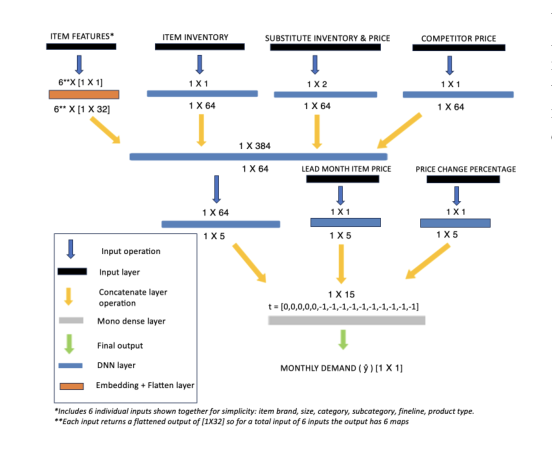
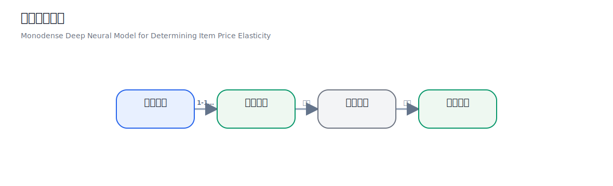
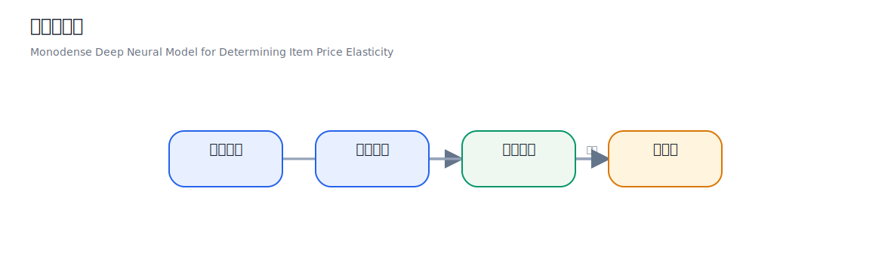
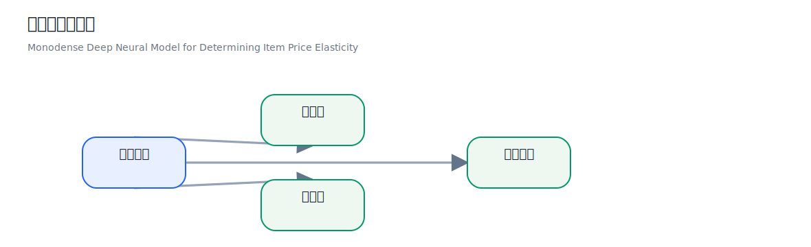
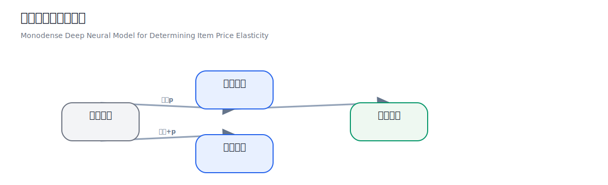
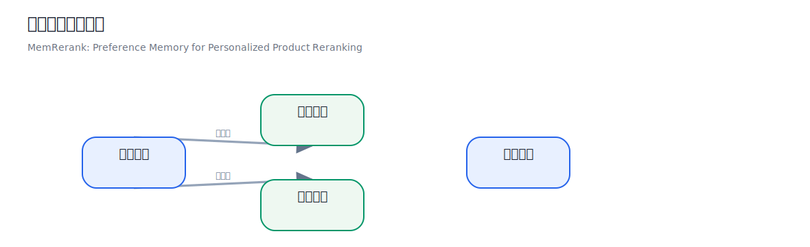
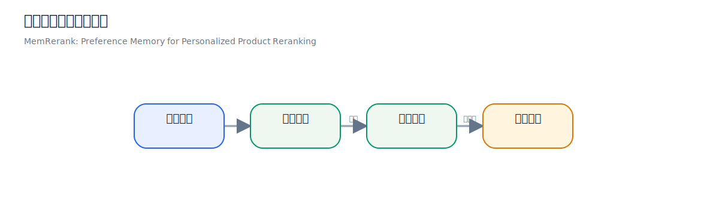
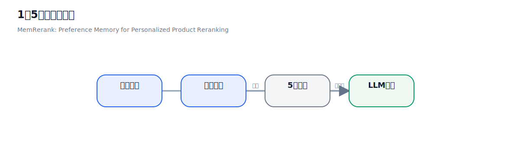
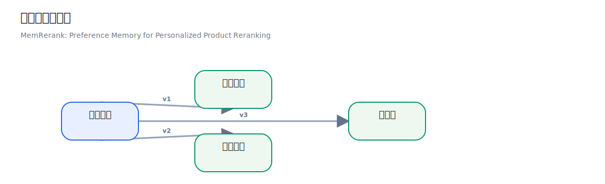
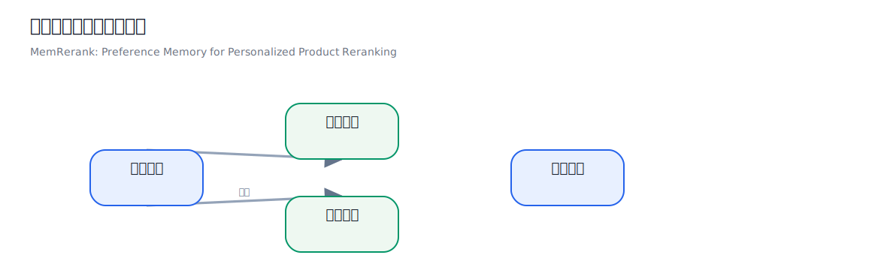

# 2026-04-01 论文日报

## 一、今日趋势与创新观察

### 1. 趋势概况

- 今日331篇论文中，LLM与语言理解仍是最大主题（59篇），研究重心从单纯的能力评测转向工具调用规划、知识图谱自动生成、长上下文压缩等更偏工程落地的方向。
- Agent与多智能体方向持续升温（36篇），出现了结构化经验回放、元认知度量、约束感知规划等新思路，说明社区正在从'让Agent能动'走向'让Agent可控且可解释'。
- 表示学习与检索排序（18篇）虽然体量不大，但质量信号密集：UniRank探索混合文本-图像候选的端到端重排，单向量嵌入的边界被系统性讨论，图-向量异构融合也被应用于多跳问答检索。
- 强化学习与bandit决策（21篇）中出现了NeuralUCB做在线LLM路由、自动驾驶轨迹规划引入常识世界模型等跨界尝试，bandit思路正在被更多非经典RL场景借用。

### 2. 推荐系统 / 排序相关创新点

- MemRerank提出用偏好记忆模块做个性化商品重排序：不再只依赖当次请求特征，而是维护一个用户级别的长期偏好memory，在重排阶段动态注入历史偏好信号——这个思路可以直接迁移到广告个性化排序，用低成本的memory读写替代大规模用户特征工程。
- Monodense深度神经模型把价格弹性建模从传统经济计量方法拉到端到端DNN框架下，用单调约束保证弹性曲线合理性——同样的建模范式可以服务于广告出价策略中的bid-response曲线估计和预算分配优化。
- Zero-shot Cross-domain Knowledge Distillation（YouTube Music案例）展示了如何在没有目标域标签的情况下，把源域排序模型的知识蒸馏到新域——这为广告冷启动场景（新广告主、新品类）提供了一条不依赖目标域点击数据的可行路径。

### 3. 全局创新点

- Reward-Based Online LLM Routing via NeuralUCB把bandit探索引入多LLM路由决策：面对多个候选LLM，系统用神经网络参数化的UCB策略在线学习每个请求该交给哪个模型，兼顾探索与利用——这是一个系统层面的效率创新，适用于任何需要在多模型间动态调度的场景。
- Multi-Layered Memory Architectures for LLM Agents系统评测了分层记忆结构对Agent长期上下文保持的影响，发现短期工作记忆+长期情景记忆的两层架构在多轮交互中显著优于单层缓存，为Agent系统设计提供了工程参考。
- Route-Induced Density and Stability（RIDE）从Meta的视角对routing风格的元提示词做了内部状态机制分析，揭示了不同prompt路由策略如何改变LLM中间层的表示密度和稳定性——这为理解和优化MoE及prompt routing提供了新的可解释性工具。

## 二、今日一个 AI 知识点

### 偏好记忆（Preference Memory）：为什么排序系统需要一个专门的'记忆模块'

传统的排序模型每次收到一个请求，都是'失忆'地重新算一遍：拿到用户ID，查特征表，过模型，出分数。用户过去几百次交互的偏好信号全靠特征工程提前压缩成几个统计量塞进去，信息损失很大。偏好记忆的思路是给排序系统额外装一个可读写的memory bank。整个流程大致是这样的：用户每次和系统交互时（比如点击、购买、跳过），系统把这次交互的关键信息——不是原始行为日志，而是经过编码器压缩后的一个向量——写入这个用户对应的memory slot里。写入时通常会做一个门控更新：新信息和旧记忆加权混合，避免一次偶然行为覆盖长期偏好。等到下一次需要排序时，排序模型在打分前先去memory bank里读取这个用户的偏好向量，读取过程一般用attention机制——当前候选item的表示作为query，memory里存的若干偏好向量作为key和value，attention算出一个加权融合的偏好表示。这个偏好表示再和候选item的特征拼在一起送进打分网络。这样做的好处是：第一，长期偏好不再需要人工设计统计特征，模型自己学着往memory里写什么、读什么；第二，memory的更新是增量的，每次交互只需要一次轻量写操作，不用重新跑整条特征管线；第三，memory天然支持遗忘——通过写入时的门控衰减系数，老旧偏好自然被淡化，最近的兴趣变化能更快反映出来。在广告场景里，这意味着系统能记住'这个用户上周连续三天看了露营装备但没买'这类中长期意图，在下一次出广告时把露营相关的广告排得更高或者更低（取决于是兴趣还是疲劳），而不是只靠最近一次点击来做判断。这个思路在今天的MemRerank论文里被用于商品重排序，但它的骨架——编码-写入-门控更新-attention读取-融合打分——是完全通用的，搜索广告、信息流推荐、甚至对话系统的个性化回复排序都可以复用。

## 三、今日论文总览

### 1. Monodense Deep Neural Model for Determining Item Price Elasticity
- 挑选理由：价格弹性模型与广告定价、出价策略有一定同构性，可用于广告商品定价优化

### 2. MemRerank: Preference Memory for Personalized Product Reranking
- 挑选理由：个性化商品重排序与广告排序有同构性，偏好记忆机制可迁移至广告排序场景

### 3. Zero-shot Cross-domain Knowledge Distillation: A Case study on YouTube Music
- 挑选理由：YouTube Music属于Google旗下，跨域知识蒸馏可能与商业化推荐有关，公司优先保留

### 4. Generative AI in Action: Field Experimental Evidence from Alibaba's Customer Service Operations
- 挑选理由：Alibaba论文，涉及客户服务运营中的生成式AI应用，虽非直接广告但来自重点公司的商业化实践

## 四、补充关注

今天没有需要额外提示的补充关注论文。

## 五、重点论文精读

### 1. Monodense Deep Neural Model for Determining Item Price Elasticity
- **背景：** 论文要解决的是大规模零售里单品价格弹性估计问题，也就是价格变动后需求会怎么变，而且要在没有传统实验对照组的情况下做出来。作者认为老的计量模型太依赖固定函数形状，难以吃下季节性、竞品价、缺货、替代品等复杂因素；而普通机器学习虽然更灵活，却常学出‘涨价反而销量更高’这类不符合经济逻辑的结果。它值得看，是因为作者把‘可扩展到海量商品’、‘不依赖昂贵实验’、‘输出保持经济一致性’这三件事放进了同一套框架里。

*图示：该图是论文的主方法架构图（Fig. 3: Architecture of our proposed DLM），直接展示了输入特征、各模块映射、拼接关系以及最终月需求输出，最能代表论文核心方法。相比带caption的block版本，这个embedded裁剪更聚焦图形主体、正文噪声更少、结构更完整清晰，适合作为日报主图。其他候选要么是训练损失曲线，要么是数据表示表格/页面截图，不能代表方法框架。*

**核心技术点：**

#### 技术点 1：无实验弹性框架
- 技术细节：论文先把月度交易数据做成 lead-lag 配对数据，也就是对每个商品构造‘过去某月到未来某月’的样本，并限制两个月份间隔在 1 到 12 个月之间，且两个时间点库存都必须大于 0。每条样本不只含未来月价格和销量，还带上库存、缺货天数、替代品可得性、商品属性、评分数、上架天数、竞品价格、节日季节等上下文信号。模型训练时用前 2 年数据，80% 训练、20% 验证，最后 3 个月做时间外测试；核心预测目标是未来月需求，而不是直接回归一个弹性标签。
- 通俗讲解：它的思路不是先找很多同商品不同价格的严格对照实验，而是把真实经营里已经发生过的价格变化和环境变化整理成大量‘如果从 lag 月走到 lead 月，需求会怎样’的训练样本。这样模型看到的不只是‘这次涨了 1 元’，还会同时看到‘那个月是否缺货、是否节庆、竞品是否降价’，所以它学的是更接近真实业务的需求响应。换句话说，作者先训练一个‘给定场景和价格，未来需求是多少’的机器，再通过改价格去观察这个机器输出怎么变，反推出弹性。
- 例子：比如某饮料 4 月是 lag 月，5 月是 lead 月，系统会取 4 月和 5 月的聚合交易，再补上 5 月定价、4 月到 5 月价格变化比例、库存是否充足、5 月是否临近节假日、同类替代品是否有货、竞品价格是否下降等特征。模型先学会在这些输入下预测 5 月销量；到了推断时，只改 5 月价格这一项，其它条件尽量保持一致，就能得到‘原价下的预测需求’和‘新价下的预测需求’，再算出价格弹性。

*图示：把历史月度经营数据配成前后月样本，先预测未来需求，再只改价格观察需求变化来反推弹性。*

#### 技术点 2：单调价格层
- 技术细节：作者提出的 Monodense-DLM 是一个混合网络：类别特征走 embedding，连续特征走普通 dense，融合后继续过多层 dense，但价格变量不是只在顶部出现，而是被专门送入较底部的 monodense layer。这个 monodense 层通过符号约束控制权重方向：若某特征应当随输入增大而让输出增大，就约束相关权重非负；若应当随输入增大而让输出减小，就约束相关权重非正；若无单调要求，则不约束。对价格而言，作者要求它对需求是单调递减的，因此网络结构层面就限制了‘价格越高，预测需求不能系统性升高’。
- 通俗讲解：普通神经网络像一个很会拟合但不太守规矩的学生，可能因为训练数据里夹杂节庆、断货、陈列变化，就误学成‘高价和高销量常一起出现’，最后给出正弹性。Monodense 的做法像先给学生立一条硬规则：价格这根旋钮往上拧，需求这个表盘不能往上走；其它复杂因素你可以自由学习，但这个方向不能错。把价格放在较低层接入，是为了让后面的表示从一开始就对价格敏感，而不是到最后一层才勉强修正。
- 例子：假设两个样本除了价格不同，其它条件都近似一样：商品、季节、库存、竞品价都相同，一个价格是 10 元，一个是 12 元。普通网络可能因为历史里 12 元那周刚好赶上节庆而输出更高销量；而单调层会限制价格这条路径对需求的影响方向，允许节庆等别的特征把销量抬高，但不会让‘单独提高价格’本身成为推高需求的原因。最终模型可以学到‘节庆会提升销量，但在同一节庆条件下，12 元的需求不会比 10 元更高’。

*图示：这张图帮助读者快速理解：价格被单独接入受约束的单调层，从结构上保证涨价不会被模型学成推高需求。*

#### 技术点 3：多形状单调激活
- 技术细节：作者没有只用一种单调激活，而是在 monodense 层里同时用三类激活子集：原始的单调凸激活、对应的单调凹变体，以及一个带上下饱和特性的有界变体。这样做是为了让价格到需求的响应不被硬塞成单一曲线形状，因为真实业务中有的商品涨一点就很敏感，有的先不敏感、超过阈值后才明显掉量，还有的会逐渐饱和。也就是说，论文不是只要求方向正确，还想让响应曲线的弯曲方式更贴近真实需求。
- 通俗讲解：直觉上，顾客对价格的反应并不总是一条笔直斜线。有些商品从 10 元涨到 10.5 元几乎没人管，但涨到 12 元时销量突然下滑；也有些刚开始很敏感，后面再涨影响反而没那么大。三类激活一起用，相当于在网络里准备了几种不同‘弯法’的单调曲线，模型可以把它们拼起来，既守住价格越高需求越低的大方向，又保留不同商品的细腻弹性形状。
- 例子：例如刚需纸巾和网红零食都要估弹性。纸巾可能在 1 到 2 元的微小涨价区间里变化不大，但涨到某个阈值后用户迅速转向替代品；网红零食可能一开始对价格更敏感，后面受品牌偏好影响又出现边际变缓。单一线性层很难同时拟合这两种模式，而多种单调激活能让网络在前向计算时给不同神经元分配不同形状，最后合成出各自更合理的需求曲线。

*图示：用三类单调激活并行建模价格到需求的不同弯曲方式，再合成既单调又更贴近真实商品弹性的响应。*

#### 技术点 4：反事实算弹性
- 技术细节：模型训练完成后，真正的弹性不是网络直接吐出的标签，而是通过两次需求预测算出来：一次输入价格 p，一次输入价格 p 加上价格改变量，分别得到两个未来需求预测，再把需求相对变化与价格相对变化组合成弹性。推断时，作者用最近一个 lag 月的数据作为基底，把 lead 月设成 lag 月加 1，再在这个固定场景里只改价格，从而构造反事实需求。评估上，作者同时看需求预测误差和弹性误差：时间外测试集上的 WMAPE，以及模型弹性和已知真实弹性的 MAE。
- 通俗讲解：这相当于先搭一个模拟器，再拿模拟器做‘如果我改价会怎样’的实验。你先问模型：在当前库存、季节、竞品价这些都不变时，卖 10 元能卖多少；再问一次：如果改成 11 元呢。两次输出一比较，就能知道需求对这次调价有多敏感，这比让模型直接记一个抽象弹性数字更贴近业务决策。
- 例子：比如某商品在当前场景下，模型预测 10 元时未来月能卖 100 件，11 元时能卖 92 件。系统就把这两次预测的相对需求变化和价格相对变化合起来，得到这次从 10 元到 11 元的弹性估计。作者报告说，按这种流程得到的模型在需求预测上 WMAPE 为 30.90%，优于 LGBM 的 35.9% 和 DML 的 36.1%；在弹性误差上 MAE 为 0.36，也优于 0.42 和 0.43，不过文中没有充分展开这些真实弹性标签是如何大规模获得的，因此这一部分仍有一定不确定性。

*图示：用同一场景下的两次需求预测做反事实比较，把价格变化转换成弹性估计。*

- **对广告的启发：** 最适合层级：出价响应建模与预算调控层；价值：最值得迁移的是‘把单调约束写进响应模型’这件事。广告里可把价格变量换成出价、补贴、曝光强度或频控阈值，要求在其它条件相近时，出价升高不应让赢标率或曝光机会系统性下降；也可以要求频控收紧不应让曝光上升。实际用法上，可先训练‘给定流量上下文、竞争强度、素材和出价时的点击或转化量预测器’，再通过改出价做两次反事实推断，估算局部出价弹性，用于自动出价、预算分配、保量和 ROI 平衡。；风险：风险主要有三类。第一，广告里的单调关系没有价格弹性那么绝对，例如出价对转化量常受排序机制、预算封顶、学习期、冷启动和高频疲劳影响，局部可能不单调，硬约束过强会带来偏差。第二，这篇论文的目标是商品需求，不是拍卖环境中的因果增量，直接迁移到广告时仍会遇到选择偏差和竞价反馈回路。第三，文中很多工程细节没完全展开，例如真实弹性标签的构造、不同商品组的稳健性、线上策略闭环效果，因此更适合先迁移其建模思想，而不是原样照搬。

### 2. MemRerank: Preference Memory for Personalized Product Reranking
- **背景：** 论文要解决的是：LLM做个性化商品重排时，用户历史虽然很多，但把原始购买记录整段塞进提示词里，往往会带来噪声、长度爆炸和相关性错配，结果不一定比不用历史更好。作者因此把问题改写成‘先提炼稳定偏好，再做重排’：从用户历史里抽出一份与当前查询无关、但可复用的偏好记忆，专门服务后续排序。之所以值得看，是因为它不仅给了一个端到端评测框架，还用下游重排准确率反过来训练记忆提取器，证明‘历史压缩质量’可以直接按排序效果来学，而不是只做好看的摘要。
**核心技术点：**

#### 技术点 1：偏好记忆建模
- 技术细节：MEMRERANK把用户历史分成两块：同类目历史和跨类目历史。前者用于提炼该类商品上的稳定偏好，比如常见品牌、功能取向、价格带、使用场景；后者用于提炼更泛化的购物风格，比如是否偏预算型、是否偏品牌型、是否更看重品质。记忆提取器输入的是历史购买商品的元数据，输出是带固定标签结构的文本记忆，分别放进\<within-memory\>和\<cross-memory\>，然后与查询和5个候选商品一起送给下游LLM重排序器。
- 通俗讲解：可以把它理解成先给用户做一张‘浓缩画像卡’，而不是让排序模型自己去翻几十条甚至上百条旧订单。之所以分成同类目和跨类目，是因为一个人买耳机时，既有‘耳机领域内喜欢什么’的细偏好，也有‘整体购物时是省钱还是追求品质’的粗偏好，这两层信息在最终决策里扮演的角色不一样。排序时，模型先看商品是否符合查询，再用同类目记忆判断哪件更像用户会买的，再用跨类目记忆打破相近候选之间的平手。
- 例子：比如用户当前搜索‘适合游戏的笔记本电脑’，候选里有5台电脑。系统先从历史里提炼出同类目记忆，如‘偏好高性能、重视散热、常买中高价位电子产品’，再提炼跨类目记忆，如‘整体上愿意为耐用和品牌付费，不太选最低价款’。重排时，若两台电脑都能满足‘游戏’这个查询，一台是高性能品牌机，另一台是低价入门机，那么记忆会把前者往前推。

*图示：这张图说明 MemRerank 如何先把用户历史压缩成两类偏好记忆，再与查询和候选商品一起用于个性化重排。*

#### 技术点 2：用重排结果训记忆
- 技术细节：这篇的关键不是只让模型把历史总结得像人话，而是把‘记忆是否真的有助于重排’变成训练信号。作者把记忆生成看成一个策略优化问题：给定购买历史，模型生成一段记忆；然后这段记忆被插入1选5重排提示中，由LLM重排器选出最相关商品。奖励由两部分组成，一部分是格式奖励，检查输出是否按要求生成了合法的记忆块；另一部分是重排奖励，如果下游选中了真实正样本就给正向反馈，否则给负向反馈，并通过采样多次结果做平均来让奖励更平滑。
- 通俗讲解：直觉上，这像是在训练一个‘会写简历的人’，但它不是按文采打分，而是按‘这份简历能不能帮招聘官选对人’打分。也就是说，记忆提取器写出来的内容不需要最全面，而需要最有助于最终排序。格式奖励保证这段记忆能被系统稳定读取，重排奖励保证这段记忆不是空泛总结，而是真能改变候选之间的相对顺序。
- 例子：假设某次训练里，历史被总结成‘喜欢电子产品，重视质量’，这种话虽然没错，但太泛，下游5选1时仍选错了商品，那奖励就不会高。另一次总结成‘在电子类商品中偏好中高端品牌、看重性能和耐用、较少选择低价基础款’，下游因此从5个候选里选中了真实目标商品，这次奖励就更高。反复训练后，提取器会逐渐学会写‘对排序有用的话’，而不是‘对人类看起来顺口的话’。

*图示：用下游5选1重排是否选对，反过来训练历史记忆提取器只保留对排序有用的信息。*

#### 技术点 3：1选5评测闭环
- 技术细节：作者围绕LLM集合式重排构建了一个端到端基准。数据来自Amazon-Review-2023和Amazon-C4：先拿用户历史购买记录，再配上一个查询、1个正样本商品和4个同类目难负样本商品，形成1选5任务。负样本不是随机抽的，而是先从同类目里检索相似商品，再保留最难区分的4个，因此这个任务更接近真实重排而不是简单分类。论文当前主要在Electronics类目上实验，训练、验证、测试分别为905、194、194条。
- 通俗讲解：这个评测设计的意思是，不直接问模型‘你会不会做推荐’，而是给它一个很具体的排序动作：在5个看起来都挺像的商品里挑出最对的那个。因为候选都来自同类目，还特意加入了难负样本，所以模型不能靠粗糙关键词匹配蒙对，必须真正利用用户偏好。这样一来，记忆模块好不好，不看摘要本身，而看它能不能让这个小型排序动作更准。
- 例子：比如查询是‘一台适合日常办公和轻度娱乐的显示器’，5个候选全是电子类显示器，其中4个负样本也很像。若没有记忆，模型可能只按查询表面词选一个普通款；若有记忆，知道该用户过去偏好高刷新率、品牌稳定、愿意接受中高价，那么它可能从多个都相关的候选里选出更符合用户长期倾向的那台。最终是否选中真实正样本，就成了记忆质量的直接反馈。

*图示：用“用户历史+查询+5个相似候选”的重排任务，直接检验偏好记忆是否真的提升个性化排序。*

#### 技术点 4：提示结构很关键
- 技术细节：论文还比较了不同记忆提取提示。v1是固定维度清单，要求按品牌、功能、风格、价格等预设方面总结；v2完全放开，让模型自由发现偏好；v3折中，给出常见方面作为参考，但允许模型自己发现新方面，同时要求输出简洁、可行动、不重复，并附带来自历史的证据片段。实验显示v3最好，说明既要有一定结构约束，也要保留发现任务相关偏好的自由度，尤其在同时提取同类目和跨类目记忆时更明显。
- 通俗讲解：这点的直觉是：如果模板写得太死，模型会被迫往固定槽位里填内容，哪怕有些槽位并不重要；如果完全不管，模型又可能写得很散、很虚，排序器难以使用。最好的是半结构化写法：先告诉模型大致应该抓什么类型的信息，再允许它根据历史自己决定哪些点最重要，并且要求给出证据。这样输出既规整，又不僵硬。
- 例子：假设用户买过多款电子产品。v1可能机械地写出‘品牌、价格、风格、场景’四五条，即使有些方面证据很弱；v2可能自由发挥成一段泛泛总结；v3则更可能提炼成‘偏好中高端品牌’‘重视性能与耐用’‘常用于办公和娱乐双场景’，并能从历史商品标题或描述里找到支撑。这样的记忆进入重排器后，更像可执行的排序线索。

*图示：用三种提示结构对比，说明“有参考框架但允许自由发现并附证据”的记忆提取最利于后续重排。*

#### 技术点 5：结果证明压缩优于堆历史
- 技术细节：主结果显示，直接加原始历史帮助有限，甚至可能变差；而RL训练后的偏好记忆提升明显。在Electronics上，GPT-4.1-mini重排器从无记忆的32.47提升到MEMRERANK的38.14，再到带think标签的39.07；o4-mini从31.86提升到40.72，再到42.47，最高绝对提升10.61点。未训练的基础提取器和外部记忆方法如MR.Rec、Mem0也有时能提升，但整体都弱于作者的RL对齐方案。
- 通俗讲解：这说明‘历史越多越好’并不成立，关键是把历史变成排序器能吃得下、用得上的信号。原始历史像一堆购物小票，信息很多但杂；偏好记忆像收银系统自动生成的用户画像摘要，短很多，但更直接影响决策。再配合think标签，排序器会更明确地把记忆拿来解释和比较候选，所以效果还能继续上升。
- 例子：同样给模型10条同类目商品和10条跨类目商品的原始历史，它可能被大量无关细节干扰。换成一段提炼后的记忆后，输入长度更短，重点却更集中，比如直接告诉模型‘该用户在电子产品上偏性能和品牌，不偏最低价’，于是模型在5个候选里能更快定位真正合适的那一个。论文里的结果正是在这种替换后显著提升。

*图示：这张图用对比流程说明：原始历史容易带来噪声，而压缩后的偏好记忆更利于LLM重排，并可继续被think提示放大效果。*

- **对广告的启发：** 最适合层级：广告精排和重排层，尤其适合接在LLM排序器、生成式广告助手或传统排序模型前面的用户长期偏好压缩层；价值：广告场景里，用户长期浏览、点击、加购、转化历史往往比单次请求上下文长得多，也更噪。本文启发是先把历史行为压成‘类目内偏好’和‘跨类目消费风格’两层记忆，再把它作为稳定特征输入广告重排器，可用于改善同质广告之间的个性化区分、预算敏感度判断、品牌偏好建模和多轮对话投放。更重要的是，它提供了一种训练思路：不要只优化画像抽取本身，而要用下游CTR、CVR、转化排序效果去反向训练画像压缩模块。；风险：这篇论文不是直接广告论文，实验也只在商品Electronics类目的离线1选5任务上做，离真实广告系统还有距离。几个不确定点要明确：第一，文中主要验证的是离线重排准确率，不是广告里的收益、点击率、转化率或约束下最优投放；第二，它当前依赖文本化商品元数据和LLM重排器，迁移到广告时要处理创意、多模态、实时竞价和毫秒级时延；第三，跨类目偏好在广告里可能混入更强的短期兴趣漂移和商业目标偏置，如果直接套用，可能带来过度个性化、探索不足或旧偏好固化。

## 六、候选但未完成深读的论文

当前重点论文都已完成可用分析。
