# 2026-04-02 论文日报

## 一、今日趋势与创新观察

### 1. 趋势概况

- 今日332篇论文中，LLM与语言理解依然是绝对主力（84篇），但Agent与多智能体方向紧随其后（51篇），说明研究重心正从'单模型能力提升'向'多模块协作与任务编排'迁移。
- 强化学习与bandit决策方向保持稳定产出（28篇），且出现了将RL用于LLM自我精炼（RefineRL）和LLM服务路由（ParetoBandit）等新应用场景，bandit方法正在从经典决策问题向系统资源调度扩展。
- 表示学习与检索排序（20篇）中出现了细粒度token级检索（FGR-ColBERT）、本体驱动的文档组织（Evidence Units）等结构性创新，信息检索正在从整文档粗排向更精细的语义单元级别演进。
- 迁移学习与跨域泛化虽然绝对数量不多（8篇），但涉及的领域跨度很大（从自动驾驶到医学影像到贝叶斯网络），反映出泛化技术正在成为各垂直领域落地的共性瓶颈。

### 2. 推荐系统 / 排序相关创新点

- UniMixer提出推荐系统的统一混合架构并系统性研究Scaling Law，尝试回答'推荐模型是否存在类似LLM的规模效应'这一关键问题，对广告排序模型的容量规划有直接参考价值。
- Learning Shared Representations for Multi-Task Linear Bandits探索了多任务bandit间共享表示学习，这一思路可直接映射到广告多目标出价场景中——不同广告目标（点击、转化、留存）共享底层表示以提升冷启动效率。
- FGR-ColBERT在ColBERT检索框架中引入细粒度相关性token识别机制，使检索阶段就能区分query中哪些token真正驱动了匹配，对广告召回阶段的可解释性和精度优化都有启发。

### 3. 全局创新点

- ParetoBandit将bandit方法用于LLM服务的预算感知自适应路由，在非平稳负载下动态分配请求到不同模型实例，这种'用决策理论优化系统调度'的范式正在成为AI基础设施的新方向。
- MOON3.0（阿里巴巴）在电商多模态表示学习中引入推理感知机制，让模型不仅编码视觉和文本特征，还学习商品属性间的因果与组合推理，这是多模态表示从'感知'走向'理解'的一个清晰信号。
- Universal YOCO（微软）探索了一种高效深度扩展架构，通过You Only Cache Once的设计减少推理时的KV缓存开销，为大模型在资源受限场景下的部署提供了新的结构选项。

## 二、今日一个 AI 知识点

### Multi-Task Bandit 中的共享表示学习：为什么多个决策任务可以共用一套特征底座

想象你在同时管理三个广告投放目标：一个优化点击率，一个优化转化率，一个优化用户留存。每个目标都是一个bandit问题——你需要从候选广告里选一个展示给用户，然后观察反馈。传统做法是给每个目标单独维护一套特征表示和决策策略，但问题是每个目标单独能拿到的反馈数据很有限，尤其新广告或新用户场景下几乎没有历史信号。共享表示的思路是这样工作的：首先，所有任务共用一个底层编码器，把用户和广告的原始特征映射到一个低维的共享向量空间里。这一步的关键假设是，不管你优化的是点击还是转化，用户偏好和广告质量的底层结构是共通的。然后，在这个共享表示之上，每个任务各自接一个轻量的线性决策头，负责把共享向量转成该任务专属的收益预估。当某个任务收到一条新反馈时，梯度会同时更新共享编码器和该任务的决策头；而共享编码器的更新又会间接帮助其他任务——这就是信息借用的核心机制。整个流程可以理解为：一条用户请求进来，先走共享编码器得到一个向量，然后这个向量同时被三个决策头读取，各自给出对候选广告的打分，最终每个目标根据自己的打分选出要展示的广告。关键的理论优势在于样本效率：如果三个任务的底层结构确实相似，那共享表示相当于把三份数据的信息压缩进了同一套特征里，相比独立学习，收敛速度可以快好几倍，在冷启动和稀疏反馈场景下尤其明显。但风险也很直观——如果某个任务的信号结构与其他任务差异很大，强行共享反而会互相干扰，所以实际系统中往往需要一个门控机制来控制共享程度，让模型自己学到哪些维度该共享、哪些该独立。今天全量论文中出现的Learning Shared Representations for Multi-Task Linear Bandits正是在理论层面分析了这个问题：在什么条件下共享表示的遗憾界比独立学习更紧，以及最优的共享维度该如何确定。

## 三、今日论文总览

### 1. UniMixer: A Unified Architecture for Scaling Laws in Recommendation Systems
- 挑选理由：推荐系统统一架构与Scaling Law研究，作者包含Kun Gai（快手/阿里广告技术团队常见作者），可能与广告排序模型同构

### 2. MOON3.0: Reasoning-aware Multimodal Representation Learning for E-commerce Product Understanding
- 挑选理由：电商产品理解的多模态表示学习，作者团队（Jian Xu, Bo Zheng等）来自阿里巴巴广告/搜索团队，与广告商品理解相关

## 四、补充关注

今天没有需要额外提示的补充关注论文。

## 五、重点论文精读

### 1. UniMixer: A Unified Architecture for Scaling Laws in Recommendation Systems
- **背景：** 推荐/广告排序模型近年来借鉴LLM的Scaling Law思路，试图通过堆叠更多层、更大参数来持续提升AUC。目前业界主流有三类scaling模块：基于异构Attention的(如HiFormer、FAT)、基于TokenMixer的(如RankMixer)、基于FM的(如Wukong)，三者设计哲学和结构差异很大，缺乏统一认识，导致研究者难以判断哪种结构scaling效率最优、也无法同时利用各方优势。UniMixer由快手广告团队提出，旨在建立一个统一理论框架将三类方法连接起来，并设计出兼具三方优点、参数效率和计算效率都更优的轻量模块UniMixing-Lite，在快手广告用户留存预估场景上线后30天累计活跃天数(CAD)平均提升超过15%。
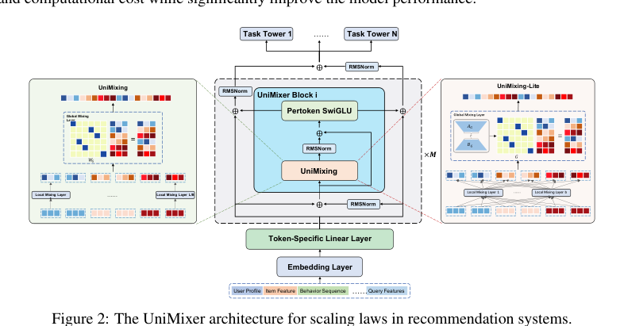
*图示：该图是完整且聚焦的主架构图，标题直接表明为“UniMixer architecture”，清楚展示了Embedding Layer、Token-Specific Linear Layer、UniMixer Block、UniMixing/PerToken SwiGLU、任务塔以及左右分支（UniMixing 与 UniMixing-Lite）之间的模块关系与信息流，最能代表论文核心方法。相比之下，Figure 1 和 Figure 4 都是 scaling law 结果曲线，不是方法总览；page-4-block-29 虽然也是同一图，但包含较多正文噪声，不如当前这个裁剪干净。*

**核心技术点：**

#### 技术点 1：TokenMixer的参数化等价发现
- 技术细节：论文发现，规则化的TokenMixer操作(把每个token按head切分再重组)本质上等价于一个大型置换矩阵W-perm乘以展平后的输入向量。更关键的是，这个置换矩阵可以分解为一个小矩阵G(控制token间/block间的全局交互)与一组小矩阵I(控制block内的局部交互)的Kronecker积，从而把参数量从L的四次方级别压缩到T的四次方加(D/T)的平方级别。这一发现使得原本不可学习的TokenMixer变成可学习、可优化的参数化模块。
- 通俗讲解：TokenMixer原来是一种固定的'洗牌'操作——把不同特征域的embedding按固定规则重新排列组合来实现特征交叉。论文发现这种洗牌其实可以写成一个巨大的0-1矩阵乘法，而这个矩阵又恰好能拆成两个小矩阵的Kronecker积，一个管'哪些block之间交换信息'(全局)，一个管'block内部怎么混合'(局部)。拆开之后就可以把这两个小矩阵变成可学习参数，让模型自己学最优的特征交叉模式。
- 例子：假设输入有16个token、每个token维度48，展平后是768维向量。原始TokenMixer需要一个768x768的置换矩阵。分解后变成一个16x16的全局矩阵G和若干6x6的局部矩阵。计算时先把768维向量切成128个长度为6的小块，每个小块分别乘各自的6x6局部矩阵完成块内混合，再用16x16的G矩阵做块间重排，计算量从768的平方降到了768x6+128x128的量级。

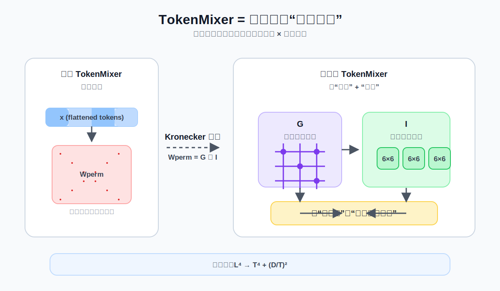
*图示：TokenMixer原来是一种固定的'洗牌'操作——把不同特征域的embedding按固定规则重新排列组合来实现特征交叉。论文发现这种洗牌其实可以写成一个巨大的0-1矩阵乘法，而这个矩阵又恰好能拆成两个小矩阵的Kronecker积，一个管'哪些block之间交换信息'(全局)，一个管'block内部怎么混合'(局部)。拆开之后就可以把这两个小矩阵变成可学习参数，让模型自己学最优的特征交叉模式。*

#### 技术点 2：统一理论框架连接三类方法
- 技术细节：论文将UniMixing模块表达为：输出 = reshape(G(X, W-G) \* 局部混合矩阵 \* 输入)，其中G是全局混合模式，局部混合矩阵是每个block各自的投影。在这个框架下：(1)异构Attention的局部混合对应Value投影、全局混合对应softmax(QK转置/根号d)；(2)TokenMixer的局部混合是恒等矩阵、全局混合是固定置换矩阵G；(3)FM/Wukong的全局混合对应XX转置(即输入自交叉)、Value矩阵不依赖X。三者只是在全局混合模式G和局部投影W-B上的不同选择。
- 通俗讲解：这三类方法表面上设计完全不同，但统一来看都在做同一件事：先对每个特征块做一次局部变换(类似Attention里的Value投影)，再用某种全局权重把不同块的信息混合起来(类似Attention权重矩阵)。Attention用QK内积算全局权重且权重依赖输入，TokenMixer用固定的洗牌规则，FM用输入自身的外积。UniMixer把全局权重做成可学习的参数矩阵，同时保留了每个block独立的局部投影，相当于同时拥有了Attention的可学习性和TokenMixer的低成本。
- 例子：对于同一组16个异构特征token的输入：Attention会为每个token算Q、K、V，然后用16x16的注意力分数矩阵加权V；TokenMixer直接用固定的16x16置换矩阵重排；FM用输入外积得到16x16交互矩阵。UniMixer则学习一个16x16的全局矩阵G(满足双随机、稀疏、对称约束)，同时每个block有独立的局部投影矩阵，训练时通过温度退火让G逐渐变稀疏。

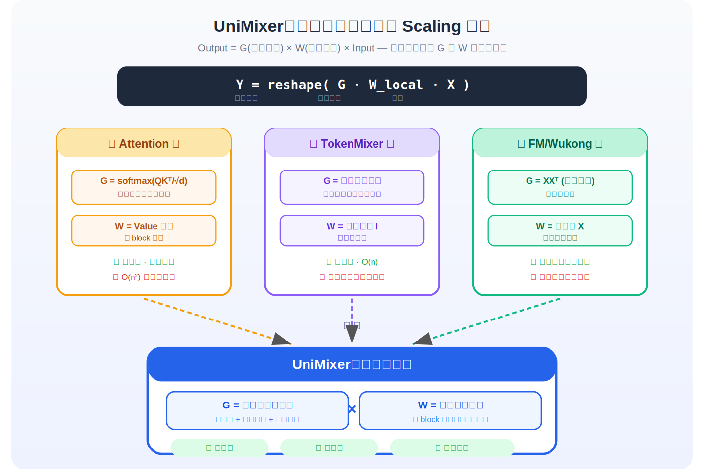
*图示：这三类方法表面上设计完全不同，但统一来看都在做同一件事：先对每个特征块做一次局部变换(类似Attention里的Value投影)，再用某种全局权重把不同块的信息混合起来(类似Attention权重矩阵)。Attention用QK内积算全局权重且权重依赖输入，TokenMixer用固定的洗牌规则，FM用输入自身的外积。UniMixer把全局权重做成可学习的参数矩阵，同时保留了每个block独立的局部投影，相当于同时拥有了Attention的可学习性和TokenMixer的低成本。*

#### 技术点 3：UniMixing-Lite的轻量化设计
- 技术细节：针对UniMixing中局部矩阵W-B数量多导致参数冗余、全局矩阵W-G尺寸大的问题，UniMixing-Lite做了两项压缩：(1)局部矩阵用基矩阵线性组合生成——定义b个基矩阵Z-1到Z-b，每个block的W-B由block特定的权重向量omega对这些基矩阵加权求和得到，大幅减少独立参数；(2)全局矩阵用低秩分解W-G=A-G\*B-G替代，A-G和B-G的秩r远小于block数。两者都通过Sinkhorn-Knopp迭代保证双随机性。实验显示Lite版本在参数仅38M时AUC超过了100M参数的RankMixer和普通UniMixer。
- 通俗讲解：原版UniMixer每个block都有自己的局部交互矩阵，block多了参数就冗余。Lite版本的做法类似于'调色板'——准备少量基础颜色(基矩阵)，每个block根据自己的配方(权重向量)混合出自己需要的颜色(局部矩阵)。全局矩阵则用低秩近似压缩，类似用两个瘦长矩阵相乘来代替一个大方阵。两个压缩叠加后参数量大幅下降，但因为Sinkhorn-Knopp操作仍能保证矩阵的稀疏性和归一化，性能反而更好。
- 例子：768维输入切成128个block，每个block大小6。原版需要128个独立的6x6矩阵(共128x36=4608个参数)。Lite版只定义4个基矩阵(4x36=144个参数)加128个4维权重向量(512个参数)，总共656个参数生成128个不同的6x6矩阵。全局128x128矩阵用秩16分解为128x16乘16x128，参数从16384降到4096。实验中4个基矩阵、秩128的Lite配置在4.97M参数下AUC达到0.7502，超过了6.57M参数的原版UniMixer的0.7485。

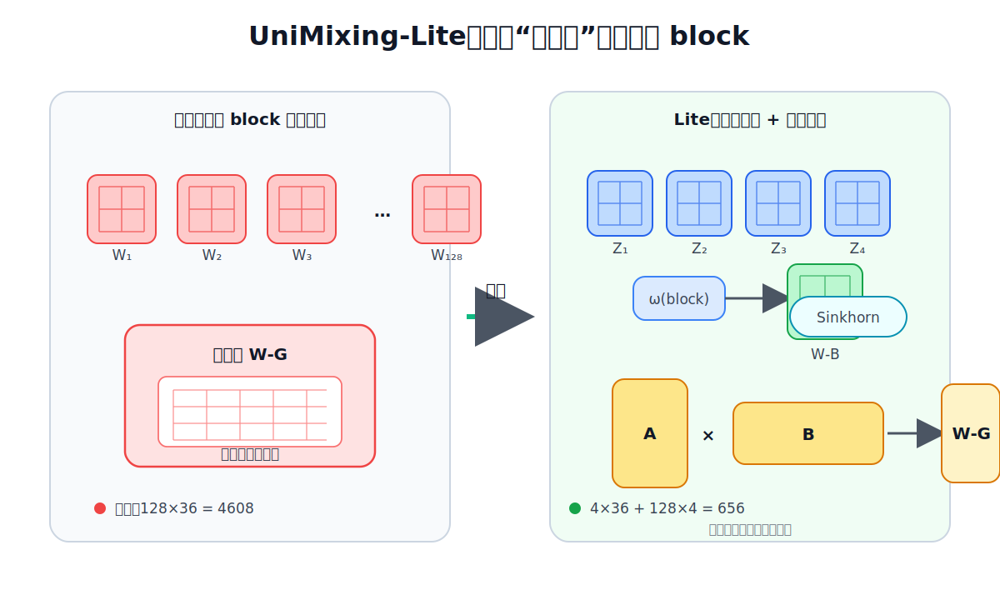
*图示：原版UniMixer每个block都有自己的局部交互矩阵，block多了参数就冗余。Lite版本的做法类似于'调色板'——准备少量基础颜色(基矩阵)，每个block根据自己的配方(权重向量)混合出自己需要的颜色(局部矩阵)。全局矩阵则用低秩近似压缩，类似用两个瘦长矩阵相乘来代替一个大方阵。两个压缩叠加后参数量大幅下降，但因为Sinkhorn-Knopp操作仍能保证矩阵的稀疏性和归一化，性能反而更好。*

#### 技术点 4：温度退火与稀疏性训练策略
- 技术细节：全局矩阵W-G和局部矩阵W-B通过Sinkhorn-Knopp迭代投影到双随机矩阵空间，投影前先除以温度系数tau。tau小则矩阵趋近于稀疏的置换矩阵(每行每列几乎只有一个非零元素)，tau大则矩阵接近均匀分布。训练时采用线性退火：tau从1.0线性降至0.05。当数据不足时，还可以先用高温训练到收敛，再用低温从高温模型权重初始化继续训练(类似warm-up)。消融实验显示去掉温度系数AUC下降0.16%，去掉warm-up下降0.086%，是影响最大的两个因素。
- 通俗讲解：稀疏性对模型效果至关重要——让每个block只跟少数其他block强交互，避免信息被平均化。但一开始就很稀疏会导致梯度不稳定。所以训练初期用高温让矩阵比较平滑、梯度好传播，随着训练推进逐渐降温让矩阵变稀疏。这就像先用软笔画草图找到大致方向，再用硬笔精确勾勒细节。
- 例子：训练初期tau=1.0时，128x128的全局矩阵每个元素大约是1/128=0.0078，信息几乎均匀流动。训练后期tau降到0.05时，矩阵变得非常尖锐，大部分元素接近0，每行只有1-2个位置有较大的值，形成了类似置换矩阵的稀疏模式。从可视化图中可以看到低温下的矩阵呈现出清晰的条纹状稀疏结构。

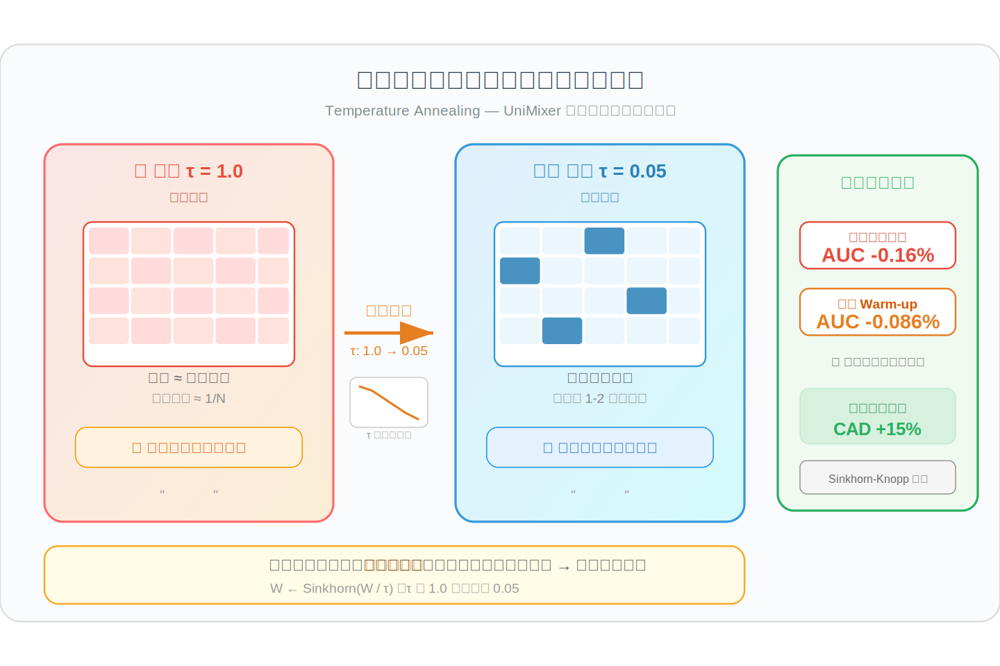
*图示：稀疏性对模型效果至关重要——让每个block只跟少数其他block强交互，避免信息被平均化。但一开始就很稀疏会导致梯度不稳定。所以训练初期用高温让矩阵比较平滑、梯度好传播，随着训练推进逐渐降温让矩阵变稀疏。这就像先用软笔画草图找到大致方向，再用硬笔精确勾勒细节。*

#### 技术点 5：SiameseNorm解决深度扩展问题
- 技术细节：此前RankMixer在增加层数时性能反而下降(4层比2层差0.1%)。UniMixer引入SiameseNorm，每层维护两条耦合流X和Y：Y流做RMSNorm后加到X流作为UniMixer的输入，UniMixer输出同时更新X流(加残差再Norm)和Y流(直接加残差)。最终将两条流融合输出。这种设计调和了Pre-Norm和Post-Norm的矛盾，使得4层UniMixer-Lite比2层进一步提升0.16%AUC，实现了深度方向的有效scaling。
- 通俗讲解：深层网络中Pre-Norm训练稳定但性能有天花板，Post-Norm性能好但训练不稳定。SiameseNorm同时跑两条路径：一条走Post-Norm风格保留梯度强度，一条走Pre-Norm风格保持训练稳定，两条路径每层交换信息。这样即使堆到4层、8层也不会退化，论文实验中4层Lite版本比所有2层方案都好，而同样堆到4层的RankMixer反而变差了。
- 例子：2层UniMixer-Lite(4.97M参数)AUC为0.7492，4层(9.72M参数)提升到0.7508，8层(19.2M参数)达到0.7509继续微涨。对比之下RankMixer从2层的0.7478掉到4层的0.7467。说明SiameseNorm确实解锁了深度方向的scaling能力。

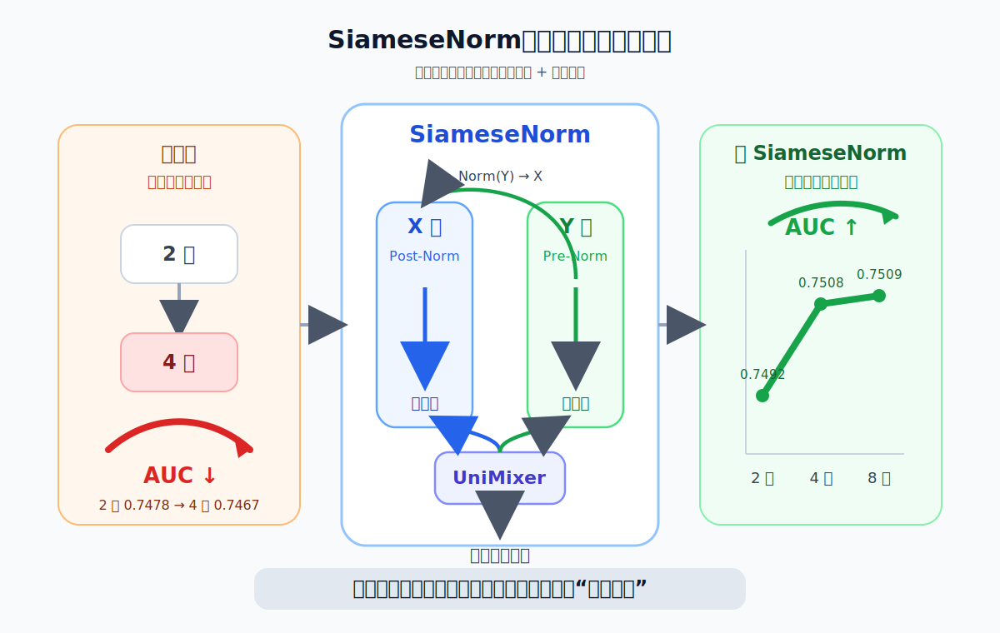
*图示：深层网络中Pre-Norm训练稳定但性能有天花板，Post-Norm性能好但训练不稳定。SiameseNorm同时跑两条路径：一条走Post-Norm风格保留梯度强度，一条走Pre-Norm风格保持训练稳定，两条路径每层交换信息。这样即使堆到4层、8层也不会退化，论文实验中4层Lite版本比所有2层方案都好，而同样堆到4层的RankMixer反而变差了。*

- **对广告的启发：** 最适合层级：广告CTR/CVR排序模型的特征交叉模块；价值：UniMixer直接来自快手广告投放场景的用户留存预估模型，其统一框架可直接用于替换广告排序中的Attention/TokenMixer/FM交叉层。核心价值在于：(1)在相同参数预算下AUC显著优于RankMixer、Wukong等SOTA方法，UniMixer-Lite仅38M参数超过100M+参数的基线；(2)Scaling指数更高(0.142 vs 0.116)，意味着加参数的边际收益更大；(3)在线A/B测试中30天累计活跃天数提升超15%，已验证广告场景实际收益。对于正在做排序模型scaling的广告团队，UniMixing-Lite的基矩阵+低秩全局矩阵设计是很实用的参数效率优化方案。；风险：(1)论文实验场景为用户留存预估(二分类)，与典型的CTR/CVR预估目标一致但具体特征分布可能不同；(2)UniMixer依赖Sinkhorn-Knopp迭代和温度退火策略，工程实现复杂度高于简单的Attention或TokenMixer，训练pipeline需要额外适配；(3)FLOPs并未减少(部分配置下FLOPs反而更高)，在线推理延迟需要评估；(4)温度退火和warm-up策略对训练数据量敏感，小数据场景可能需要额外调参。

### 2. MOON3.0: Reasoning-aware Multimodal Representation Learning for E-commerce Product Understanding
- **背景：** 电商场景中商品以图文多模态呈现，现有方法多把多模态大模型（MLLM）当作静态特征提取器，用最后一个token或均值池化生成全局embedding，导致细粒度属性（如领型、纽扣设计）被忽略——一件有蕾丝领和蝴蝶结的红色毛衣，模型可能和一件普通红色毛衣打出更高相似度。MOON3.0首次将'先推理再嵌入'范式引入电商表示学习：让MLLM先自回归地将商品拆解为结构化属性（类目、材质、设计元素等），再基于这些属性生成embedding，从而捕获细粒度差异。论文同时发布了大规模电商CoT推理基准MBE3.0，在多个下游任务上取得SOTA零样本表现，值得关注。
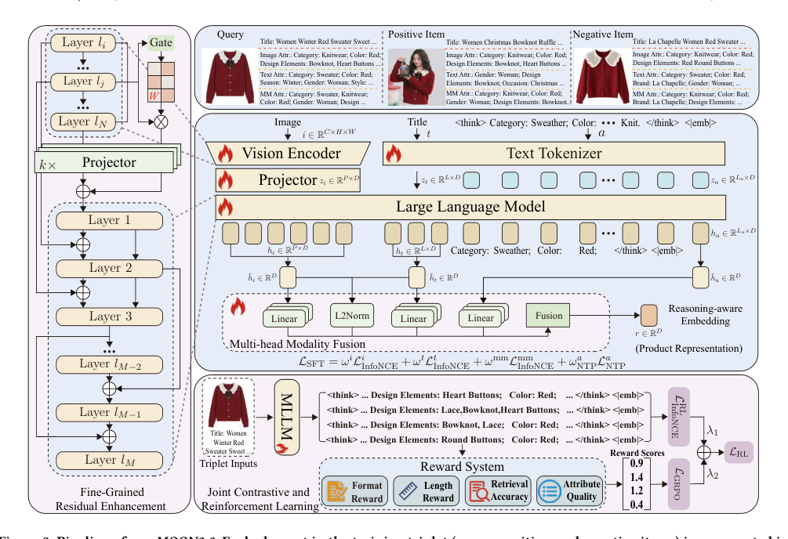
*图示：该候选是明确的主方法图，caption直接标注为“Pipeline of our MOON3.0”，图中完整展示了输入三元组、多模态编码、LLM、融合、reasoning-aware embedding、奖励系统与联合对比学习/强化学习等核心模块及信息流，最能代表论文方法全貌。虽然文字较多、面积较大，但图主体完整且模块关系清晰。其余候选均为Figure 2的属性对比示意，只展示案例/现象，不是模型架构总览。*

**核心技术点：**

#### 技术点 1：推理感知的嵌入生成
- 技术细节：给定商品图文输入(i,t)，模型先在\<think\>标签内自回归生成结构化属性序列a（如'类目:毛衣; 颜色:红色; 设计元素:蝴蝶结,心形纽扣'），再在\</think\>后输出一个特殊embedding token \<\|emb\|\>，取该token在MLLM最后一层的隐状态作为初步表示。这意味着embedding是在'看完'属性推理结果之后才生成的，从而把细粒度属性信息编码进表示中。训练分两阶段：SFT阶段联合优化下一个token预测损失（让模型学会生成属性序列）和InfoNCE对比损失（让embedding具有区分性）；RL阶段进一步用GRPO强化学习让模型自主探索更优的推理策略。
- 通俗讲解：传统做法是把图片和文字丢进大模型，直接取最后一个token当商品向量——这就像只看了一眼就下结论。MOON3.0让模型先'想一想'：把商品拆解成结构化属性（类目、颜色、材质、设计细节等），然后基于这些分析结果再生成向量。这样向量里就包含了蝴蝶结、蕾丝领这类细节，而不仅仅是'红色毛衣'这样的粗粒度信息。
- 例子：输入一件红色毛衣的图片和标题'女士冬季红色甜美毛衣'，模型先在\<think\>内输出'类目:针织衫; 颜色:红色; 设计元素:蝴蝶结,心形纽扣,蕾丝领; 风格:甜美'，然后生成\<\|emb\|\> token的隐状态作为256维embedding。对比之下，一件同样红色但纽扣为圆形的毛衣，其推理输出会写'设计元素:圆形纽扣'，两者embedding就能拉开距离。

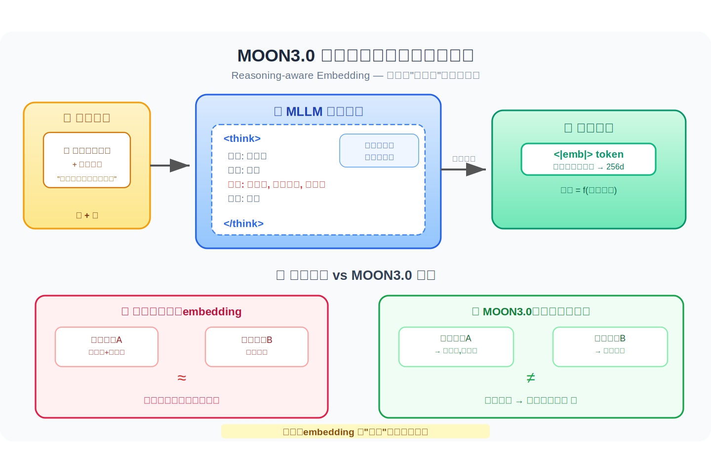
*图示：传统做法是把图片和文字丢进大模型，直接取最后一个token当商品向量——这就像只看了一眼就下结论。MOON3.0让模型先'想一想'：把商品拆解成结构化属性（类目、颜色、材质、设计细节等），然后基于这些分析结果再生成向量。这样向量里就包含了蝴蝶结、蕾丝领这类细节，而不仅仅是'红色毛衣'这样的粗粒度信息。*

#### 技术点 2：多头模态融合缓解注意力稀释
- 技术细节：自回归推理过程中，随着生成token增多，模型对原始图文输入的注意力会衰减，导致last token丢失关键细节。该模块以last token隐状态作为基础表示，同时对原始图像token和文本token分别做均值池化得到视觉和文本嵌入。首先通过L2范数的sigmoid计算模态存在分数（处理缺少某模态的情况），然后计算基础表示与各模态嵌入的余弦相似度作为一致性门控。接着将所有特征投影到H个子空间，在每个子空间内通过线性门控网络生成头特定的融合权重，分别对视觉、文本和交互特征（Hadamard积）加权。最终表示 r = 基础表示 + 一致性门控乘以权重乘以各模态特征。
- 通俗讲解：推理链越长，模型对原始图文的关注度越低，就像你写了很长的分析笔记后反而忘了原始材料的细节。这个模块的做法是：把推理后的embedding当'主干'，然后回头从原始图像和文本特征中'补课'。它不是全局粗暴地加一个权重，而是把特征拆成多个子空间，在每个子空间里分别决定该补多少图像信息、多少文本信息、以及图文交叉信息。
- 例子：假设推理过程中模型生成了30个属性token后，last token已经'忘了'图片里蝴蝶结的纹理细节。模块先检测到图片存在（存在分数接近1），计算last token与视觉均值池化向量的余弦相似度得到一致性门控值比如0.7，然后在8个子空间中分别生成权重，某个子空间可能给视觉特征高权重以补回纹理信息，另一个子空间给图文Hadamard积高权重以补回颜色与材质的交叉语义。最终融合后的256维向量既保留推理语义又恢复了细粒度视觉细节。

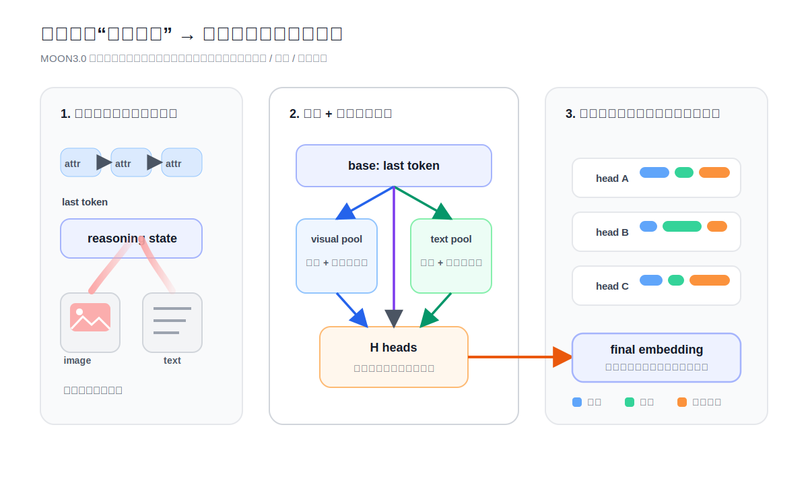
*图示：推理链越长，模型对原始图文的关注度越低，就像你写了很长的分析笔记后反而忘了原始材料的细节。这个模块的做法是：把推理后的embedding当'主干'，然后回头从原始图像和文本特征中'补课'。它不是全局粗暴地加一个权重，而是把特征拆成多个子空间，在每个子空间里分别决定该补多少图像信息、多少文本信息、以及图文交叉信息。*

#### 技术点 3：对比+强化联合学习框架
- 技术细节：RL阶段，模型作为策略网络，对每个输入采样G=8条推理轨迹，每条轨迹生成一组属性序列和对应embedding。奖励由四部分组成：格式奖励（是否遵循预定义结构，0/1）、长度奖励（token数是否在阈值内，0/1）、检索准确度奖励（用embedding在全局item池中检索正样本的排名，取1减去log(rank)/log(池大小)，rank为1时奖励为1，排名越低奖励越接近0）、属性质量奖励（用蒸馏MLLM评估属性的事实一致性得分加上额外属性数量的有界奖励）。四项奖励加权求和后做组内归一化得到advantage，用GRPO的PPO-clip目标优化策略。同时在G条轨迹上继续计算InfoNCE对比损失，最终RL损失=对比损失乘以0.1加GRPO损失乘以1。
- 通俗讲解：SFT阶段是'照着标准答案学'，但标准答案质量有限，模型也没机会探索更好的属性拆解方式。RL阶段让模型自己采样8种不同的推理方式，然后用一套综合打分系统评判：格式对不对、是否太啰嗦、生成的向量能否检索到正确商品、属性是否准确且有信息增量。得分高的推理路径被强化，差的被抑制。同时对比损失确保探索过程中embedding的区分性不会退化。
- 例子：对同一件红色毛衣查询，模型采样8条轨迹：第1条只写了'颜色:红色'（长度奖励1但检索排名差，检索奖励低）；第3条写了'类目:针织衫; 颜色:红色; 设计元素:蝴蝶结,心形纽扣,蕾丝领'（检索排名第1得满分，属性质量MLLM评分0.9，额外属性数得到0.2\*min(2,4)=0.4的奖励）；第5条写了200个token的冗长描述（长度奖励0）。归一化后第3条advantage最高，策略向这类简洁准确的推理模式倾斜。

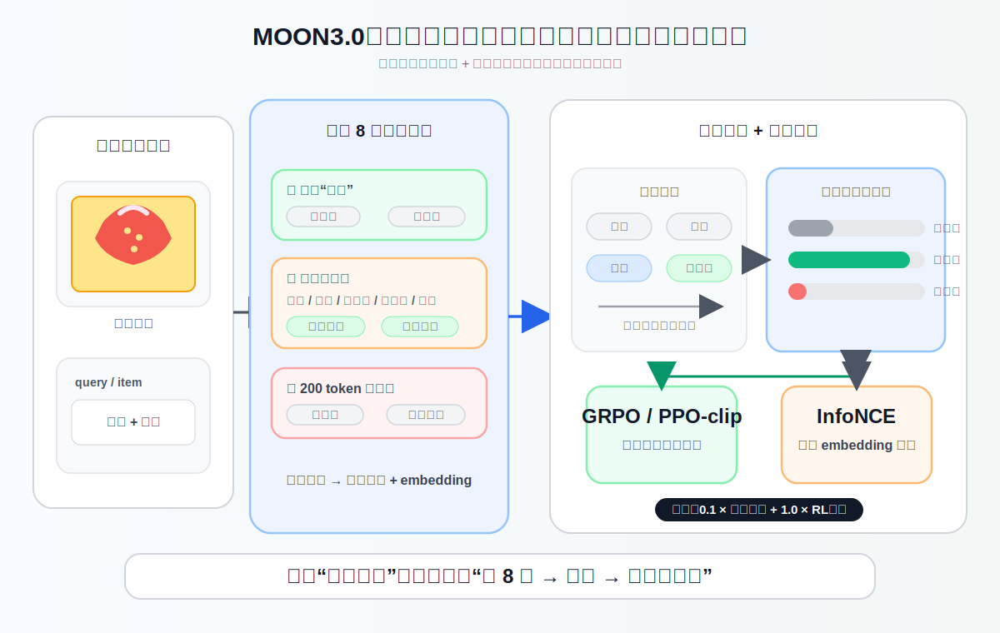
*图示：SFT阶段是'照着标准答案学'，但标准答案质量有限，模型也没机会探索更好的属性拆解方式。RL阶段让模型自己采样8种不同的推理方式，然后用一套综合打分系统评判：格式对不对、是否太啰嗦、生成的向量能否检索到正确商品、属性是否准确且有信息增量。得分高的推理路径被强化，差的被抑制。同时对比损失确保探索过程中embedding的区分性不会退化。*

#### 技术点 4：细粒度残差增强FIRE模块
- 技术细节：FIRE在三个阶段注入细粒度信号：(1)视觉编码阶段，对视觉编码器中间层的patch特征与最终层特征拼接后通过轻量MLP+sigmoid生成空间门控系数，对各层patch特征加权后残差叠加到最终层embedding上再做LayerNorm；(2)跨模态融合阶段，从视觉编码器多个中间层抽取特征，各自通过独立跨模态投影器注入到LLM的早期层，提供多粒度视觉表示；(3)语言解码阶段，将LLM初始融合后的浅层隐状态通过线性投影乘以可学习缩放系数后残差加回到深层隐状态，防止细粒度信号在深层衰减。
- 通俗讲解：电商图片往往有很多无关背景，而且关键的设计细节（纽扣形状、Logo位置）可能只占几个patch。FIRE的思路是：在视觉编码时就用门控筛选出重要patch、抑制背景噪声；在图文融合时注入多层级视觉特征让LLM从细节到整体都能看到；在LLM深层还把浅层的多模态线索再注入一次，防止信息在几十层传播后被稀释。
- 例子：一张毛衣商品图有100个patch，其中背景白墙占40个、模特占30个、毛衣细节占30个。视觉编码阶段，FIRE对每个patch算出门控值：背景patch门控接近0，蝴蝶结区域门控接近1，这样最终视觉embedding就更多保留了设计元素信息。到LLM第30层时，蝴蝶结的视觉信号可能已经衰减，语言解码阶段的残差连接把第3层（刚融合完图文的浅层）的隐状态再投影加回第30层，恢复这些细节。

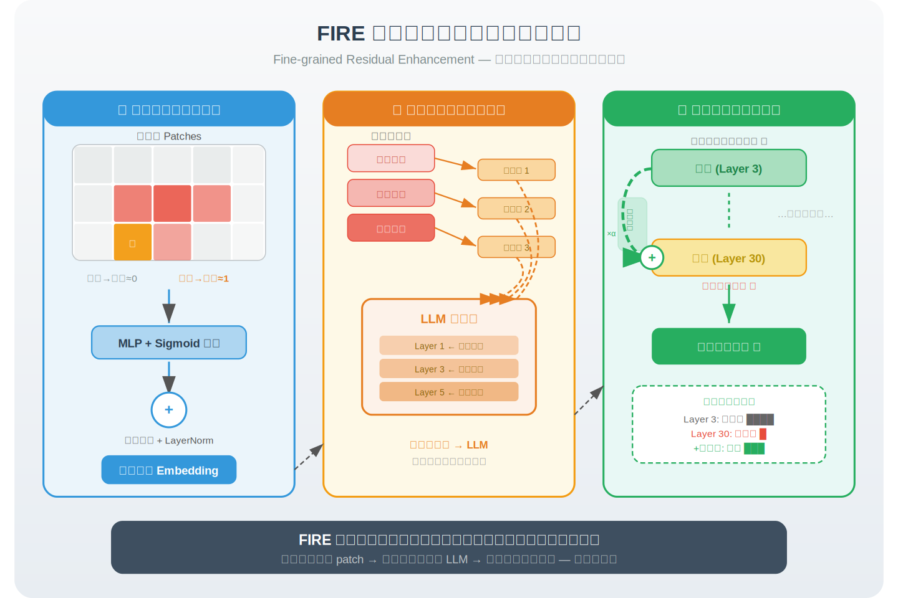
*图示：电商图片往往有很多无关背景，而且关键的设计细节（纽扣形状、Logo位置）可能只占几个patch。FIRE的思路是：在视觉编码时就用门控筛选出重要patch、抑制背景噪声；在图文融合时注入多层级视觉特征让LLM从细节到整体都能看到；在LLM深层还把浅层的多模态线索再注入一次，防止信息在几十层传播后被稀释。*

- **对广告的启发：** 最适合层级：广告商品理解与检索；价值：广告系统中商品向量的质量直接影响广告召回和相关性。MOON3.0的'先推理再嵌入'范式可以让商品embedding包含品牌、材质、设计元素等细粒度属性信息，提升广告商品匹配精度，尤其在用户搜索意图涉及具体属性（如'蕾丝领毛衣'）时效果显著。多头模态融合和FIRE模块可直接复用到广告创意理解、商品图文匹配等场景。强化学习框架中的检索排名奖励设计思路可迁移到广告点击率预估或出价策略优化中。此外，256维低维embedding在线上部署时存储和检索成本更低。；风险：模型基于Qwen3-VL-2B，推理时需要先自回归生成属性序列再产出embedding，推理延迟显著高于直接编码方案，在线广告的实时性要求下可能难以直接部署为检索模型，更适合离线索引构建。训练依赖大规模电商CoT标注数据（770万条），标注管线成本高，且标注质量受MLLM幻觉影响。RL阶段每个样本采样8条轨迹，训练成本较大。跨域泛化性在非电商广告场景（如本地生活、旅游广告）未经验证。

## 六、候选但未完成深读的论文

当前重点论文都已完成可用分析。
