# 2026-04-06 论文日报

## 一、今日趋势与创新观察

### 1. 趋势概况

- 今日 288 篇论文中，LLM 与语言理解方向占比最高（约 74 篇），研究重心集中在 Prompt 压缩、语义聚类、上下文增强（RAG 及因果 RAG）等推理效率与质量优化方向，而非单纯的模型规模扩展。
- Agent 与多智能体方向热度显著（约 37 篇），涌现出围绕结构化记忆、可验证动作轨迹、长程规划和安全对抗（Agent 投毒攻击）的多条研究子线，显示社区正从'能不能用 Agent'转向'Agent 怎么可靠地用'。
- 表示学习与检索排序方向虽然论文数量不大（约 16 篇），但质量密度较高，出现了多业务生成式推荐（美团 MBGR）、双向意图对比学习序列推荐、以及结构化文档检索等直接面向工业场景的工作。
- 迁移学习与跨域泛化方向论文较少，但出现了图领域自适应（DSBD）和协变量偏移下的迁移元分析等方法论更新；商业化决策与资源优化信号偏弱，仅个别论文涉及 token 预算分配的决策视角。

### 2. 推荐系统 / 排序相关创新点

- 美团 MBGR 提出多业务生成式推荐框架，将多个业务目标（如外卖、到店、酒旅）统一到一个生成式序列模型里做联合预测和排序，为工业级多目标推荐提供了一种不靠多塔拼接的新范式。
- Bilateral Intent-Enhanced Sequential Recommendation 在序列推荐里引入'双向意图'建模并用嵌入扰动做对比学习，相当于同时刻画用户侧的探索意图与商品侧的吸引意图，让序列模型的表示更鲁棒。
- VALOR 提出 Treatment-Gated Representation 做收入提升建模，核心是在表示层用一个门控结构区分'干预组'和'对照组'的特征流，使 uplift 估计更精准——这一思路可以直接迁移到广告增量转化价值估计场景。

### 3. 全局创新点

- 多篇 Agent 安全论文揭示了'环境注入式记忆投毒'攻击路径：攻击者不改模型参数，只在 Agent 会检索到的外部环境（网页、工具返回）中注入恶意片段，就能永久污染 Agent 长期记忆，对所有带检索增强的系统都值得警惕。
- Neuro-Symbolic Dual Memory 框架将长程 Agent 任务拆成'进度记忆'和'可行性记忆'两条线，前者记录离目标还有多远，后者记录哪些子计划现在能做、哪些受限，为 Agent 规划提供了一种可解释且可回溯的双轨结构。
- 一项对比实验表明，在等量 thinking token 预算下，单 Agent LLM 在多跳推理任务上反而优于多 Agent 系统——提示社区在设计 Agent 协作架构时，应先评估单体推理能力是否已被充分利用，避免为拆而拆。

## 二、今日一个 AI 知识点

### 表示学习为什么是很多系统的隐形底座

表示学习的目标不是简单把输入压成一个向量，而是把真正影响任务的结构信息保留下来，同时把噪声和偶然因素压下去。后面的检索、排序、聚类、生成，很多时候都只是拿这个表示继续做计算。 很多论文表面看是在做召回、排序、生成，其实核心改进都发生在表示层。先理解表示学习，就更容易抓住论文真正的创新位置。 可以顺着一次具体运行过程来理解：你可以顺着一次前向这样理解：系统先把用户最近点击、搜索词、广告文案和商品属性分别编码，再通过共享空间把它们投到同一组向量坐标里；如果两个对象在任务上更相关，它们在这个空间里就应该更近；后续做召回时，只要比较向量距离，就能先快速找出更可能相关的一批候选。

## 三、今日论文总览

### 1. VALOR: Value-Aware Revenue Uplift Modeling with Treatment-Gated Representation for B2B Sales
- 挑选理由：收入提升建模(Revenue Uplift)与B2B销售相关，涉及商业化价值估计，与广告转化价值建模有一定同构性

### 2. MBGR: Multi-Business Prediction for Generative Recommendation at Meituan
- 挑选理由：美团工业级多业务生成式推荐系统，涉及商业化流量分发，与广告排序/推荐高度同构

## 四、补充关注

今天没有需要额外提示的补充关注论文。

## 五、重点论文精读

### 1. VALOR: Value-Aware Revenue Uplift Modeling with Treatment-Gated Representation for B2B Sales
- **背景：** B2B销售需要将昂贵的人力销售资源分配给最有可能被'说服'产生增量收入的客户，而非本来就会购买的客户或永远不会购买的客户。传统倾向性模型只能预测谁会买，无法区分'干预带来的增量效果'；而标准的uplift建模方法在B2B场景下面临两大困难：一是收入数据严重零膨胀（超过80%客户收入为零）导致梯度被零样本淹没、模型预测坍缩为零；二是高维特征中强预后信号压制了微弱的treatment因果信号，使模型退化为倾向性估计器。VALOR框架针对这两个问题提出了一套端到端的因果收入排序方案，在线上A/B测试中实现了单账户增量收入2.7倍提升，预计年化增量收入3000万美元，值得广告和推荐领域关注。
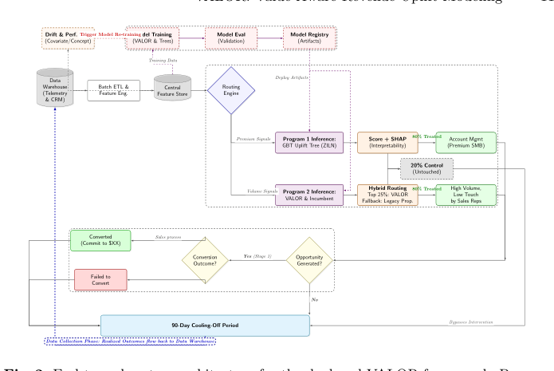
*图示：当前 provider 未启用视觉评审，回退到启发式最高分候选。*

**核心技术点：**

#### 技术点 1：Treatment门控表示学习
- 技术细节：传统做法将treatment标志T与特征X简单拼接后送入网络，但深度网络会主要学习与购买高度相关的预后主效应，忽略微弱的treatment交互信号。VALOR用一个双线性门控机制替代拼接：先分别对X和T做线性变换，再对T变换结果过sigmoid生成一个0到1的门控向量，与X变换结果逐元素相乘。这样treatment嵌入可以在特征维度上选择性地'关闭'与当前干预无关的特征子空间，将梯度集中到驱动异质性提升的特征上。
- 通俗讲解：想象你有100个描述客户的特征，其中只有少数几个（比如'计算产品用量'）会因为销售干预而影响购买决策，其余的（比如'存储用量'）只是反映客户固有属性。简单拼接treatment标志后，网络很容易被那些强预后特征带偏，把treatment信号当噪声忽略。门控机制相当于让treatment嵌入充当一个'开关阵列'：对每个特征维度输出一个接近0或1的权重，把与当前干预无关的维度直接压制为零，只留下真正跟treatment交互有关的信号进入后续网络。
- 例子：假设一个云计算客户有'计算用量高、存储用量高、AI用量低'三个关键特征，当前销售干预针对的是计算产品优惠。treatment嵌入经过sigmoid后，在'计算用量'维度输出接近1的门控值，在'存储用量'维度输出接近0的门控值。逐元素相乘后，存储特征被抑制，计算特征被保留，后续的ZILN回归头只在计算维度上学习treatment带来的增量收入信号，避免了存储特征的高方差噪声干扰收敛。

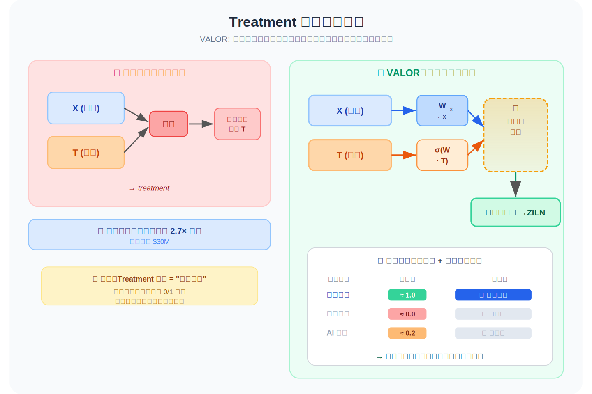
*图示：想象你有100个描述客户的特征，其中只有少数几个（比如'计算产品用量'）会因为销售干预而影响购买决策，其余的（比如'存储用量'）只是反映客户固有属性。简单拼接treatment标志后，网络很容易被那些强预后特征带偏，把treatment信号当噪声忽略。门控机制相当于让treatment嵌入充当一个'开关阵列'：对每个特征维度输出一个接近0或1的权重，把与当前干预无关的维度直接压制为零，只留下真正跟treatment交互有关的信号进入后续网络。*

#### 技术点 2：Focal-ZILN混合损失
- 技术细节：收入Y被建模为零膨胀对数正态混合分布：以概率1-rho为零（不转化），以概率rho服从对数正态分布（转化后的收入金额）。网络输出三个头：转化概率pi、条件均值mu、条件标准差sigma，期望收入为pi乘以exp(mu+sigma平方/2)。训练损失分两部分：转化概率头用Focal Loss，给'容易判断的零样本'降低梯度权重（通过(1-p)的gamma次方实现聚焦），防止80%以上的零样本主导梯度；正样本的收入头用标准对数正态负对数似然。两部分相加构成Focal-ZILN损失。
- 通俗讲解：B2B数据中绝大多数客户收入为零，如果用普通损失函数，模型会发现'全部预测为零'就能获得很低的损失，从而丧失识别少数高价值客户的能力。Focal机制借鉴了目标检测中处理正负样本极端不平衡的思路：对于那些模型已经很确信是零收入的样本，大幅缩小它们的梯度贡献；对于那些模型不确定的样本（特别是真正有收入的少数客户），保持甚至放大梯度。这样训练资源就集中在了最难也最有价值的样本上。
- 例子：假设一批1000个客户中只有50个有正收入。不加Focal时，950个零收入样本每个都贡献一份梯度，淹没了50个正收入样本的信号。加了Focal（gamma=2）后，对于一个模型已经给出p=0.05（很确信不会转化）的零收入样本，其梯度被乘以(0.05)的2次方=0.0025，几乎忽略不计；而对于一个真正有收入但模型预测p=0.3的样本，梯度乘以(0.7)的2次方=0.49，保持了有效学习。这使得ZILN的mu和sigma头能在稀疏正样本上正常收敛。

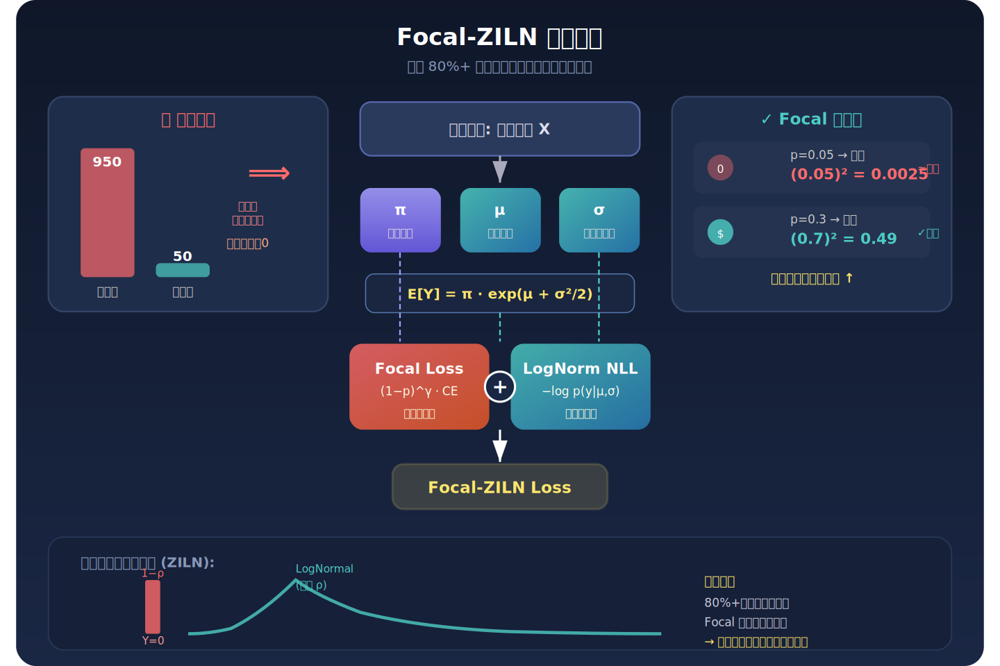
*图示：B2B数据中绝大多数客户收入为零，如果用普通损失函数，模型会发现'全部预测为零'就能获得很低的损失，从而丧失识别少数高价值客户的能力。Focal机制借鉴了目标检测中处理正负样本极端不平衡的思路：对于那些模型已经很确信是零收入的样本，大幅缩小它们的梯度贡献；对于那些模型不确定的样本（特别是真正有收入的少数客户），保持甚至放大梯度。这样训练资源就集中在了最难也最有价值的样本上。*

#### 技术点 3：价值加权排序损失
- 技术细节：在ZILN损失之外，VALOR额外叠加一个成对排序损失。对于任意两个样本i和j，用它们变换后收入的差值绝对值取log作为对权重wij=log(1+\|zi-zj\|)，再用logistic pairwise loss惩罚预测uplift排序与真实排序不一致的样本对。权重设计使得'高价值客户被错误排在低价值客户下面'这种灾难性反转获得远大于普通反转的惩罚梯度，直接优化了在有限销售资源约束下的收入捕获率。
- 通俗讲解：标准回归损失（如MSE）关心的是预测值与真实值的数值差距，但在B2B销售中，真正重要的是排序：你只有有限的销售人员，能服务排名前30%的客户，所以排对比估准更重要。而且错排一个年收入百万的'鲸鱼客户'到低优先级，损失远大于错排两个小客户。价值加权排序损失正是用收入差值的对数作为权重，让优化器容忍小客户之间的排序小错误，但对大客户的排序错误'零容忍'。
- 例子：假设客户A的真实增量收入是10万美元，客户B是100美元，客户C是0。如果模型把B排在A前面，wij=log(1+99900)约等于11.5，产生很大的惩罚梯度迫使模型纠正；如果模型把C排在B前面，wij=log(1+100)约等于4.6，惩罚小得多。这样训练出的模型在top-30%排序位置上优先放置高价值可说服客户，实验中Lift@30指标从baseline的43.5提升到51.2，多捕获约18%的增量收入。

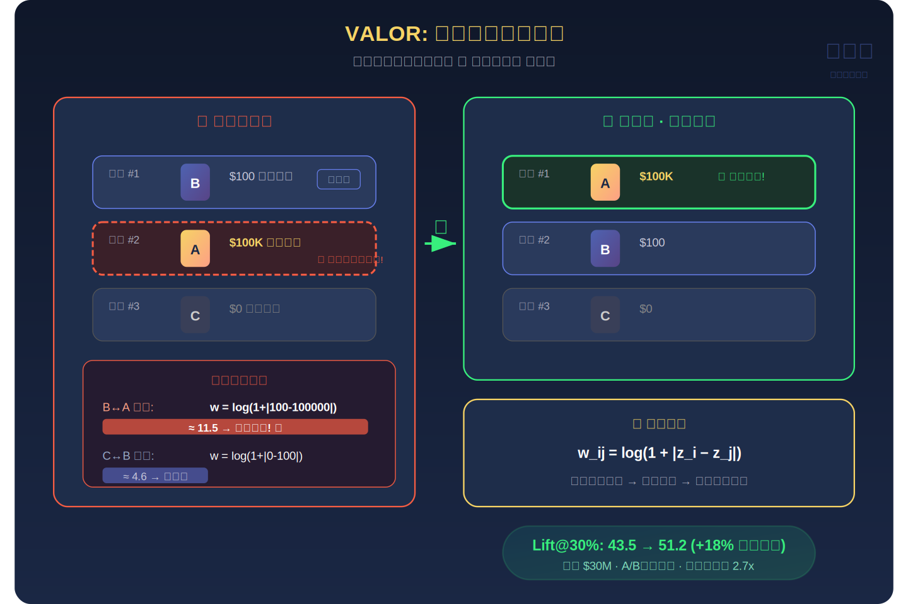
*图示：标准回归损失（如MSE）关心的是预测值与真实值的数值差距，但在B2B销售中，真正重要的是排序：你只有有限的销售人员，能服务排名前30%的客户，所以排对比估准更重要。而且错排一个年收入百万的'鲸鱼客户'到低优先级，损失远大于错排两个小客户。价值加权排序损失正是用收入差值的对数作为权重，让优化器容忍小客户之间的排序小错误，但对大客户的排序错误'零容忍'。*

#### 技术点 4：可解释ZILN-GBDT变体
- 技术细节：为满足高端客户经理对透明决策的需求，VALOR还推导了一个树模型变体。其核心是自定义分裂准则：每次分裂不是最大化子节点内同质性，而是最大化左右子节点之间uplift的欧氏距离，即(NL\*NR/(NL+NR)的平方)乘以(左节点uplift减右节点uplift)的平方。每个叶节点的uplift用与深度网络一致的ZILN参数计算。为防止稀疏叶节点的方差爆炸，引入自适应贝叶斯平滑：用全局先验对转化概率和收入均值做收缩，并对sigma做截断限制在0.1到4.0之间。
- 通俗讲解：深度网络虽然效果最好，但销售人员需要知道'为什么这个客户值得我花三周去跟进'。树模型天然可以输出SHAP值或决策路径来解释。但普通决策树的分裂标准（如MSE）不适合uplift场景，所以这里改成让每次分裂去寻找'左边子群干预有效、右边子群干预无效'的最大对比，确保树的每一层都在发现treatment效果的异质性。贝叶斯平滑则防止叶节点只有几个样本时参数估计不稳定。
- 例子：在某个树节点上，候选分裂条件是'AI产品月用量是否超过100小时'。左子节点（超过100小时）中treatment组期望收入2000美元、control组500美元，uplift=1500；右子节点中treatment组800美元、control组700美元，uplift=100。两个子节点uplift差距(1500-100)的平方很大，该分裂被选中。最终销售人员看到的解释是：'该客户AI用量超过100小时且计算增长快，属于高增量价值群体'。

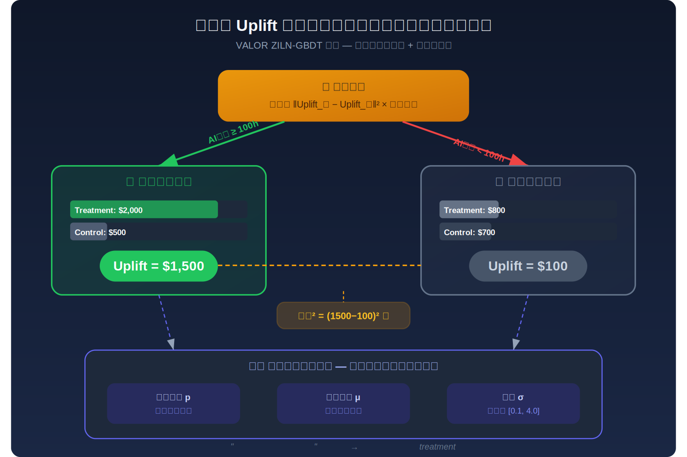
*图示：深度网络虽然效果最好，但销售人员需要知道'为什么这个客户值得我花三周去跟进'。树模型天然可以输出SHAP值或决策路径来解释。但普通决策树的分裂标准（如MSE）不适合uplift场景，所以这里改成让每次分裂去寻找'左边子群干预有效、右边子群干预无效'的最大对比，确保树的每一层都在发现treatment效果的异质性。贝叶斯平滑则防止叶节点只有几个样本时参数估计不稳定。*

#### 技术点 5：线上A/B验证与部署架构
- 技术细节：在全球云服务商的长尾销售项目中进行了4个月的RCT实验，treatment组用VALOR打分排序分配销售资源，control组用现有T-Learner。VALOR组的机会创建率17.6%对比对照组9.3%（绝对提升8.3个百分点），单账户增量收入1185美元对比445美元（2.7倍）。部署架构采用双模型混合路由：前25%高分账户由VALOR排序分配，剩余由传统倾向性模型补充，避免季度中期高价值线索耗尽。所有账户在干预后进入强制90天冷却期，确保ARR因果反馈干净。
- 通俗讲解：线上实验不仅验证了VALOR找到了更多机会，更关键的是收入提升倍数（2.7倍）远大于机会数提升倍数（1.89倍），说明VALOR确实在找更高价值的可说服客户，而不只是找更多客户。混合路由策略是一个很实用的工程妥协：纯VALOR会在季度初把最好的线索全部分完，导致后半段销售人员无线索可跟；用传统模型做后备可以平滑线索供给。90天冷却期则是B2B特有的因果归因需求，防止反复干预同一客户导致效果无法测量。
- 例子：假设一个季度有1万个待分配账户，VALOR对每个账户计算uplift分数并排序。前2500个（top 25%）由VALOR直接分配给BDR，这些账户平均增量收入最高；当这批线索在第一个月被消化完后，系统自动切换到传统倾向性模型继续为BDR提供中等质量的线索，保证整个季度销售人员都有事做。每个被联系的账户进入90天观察窗口，90天后的ARR变化数据回流训练集，形成闭环。

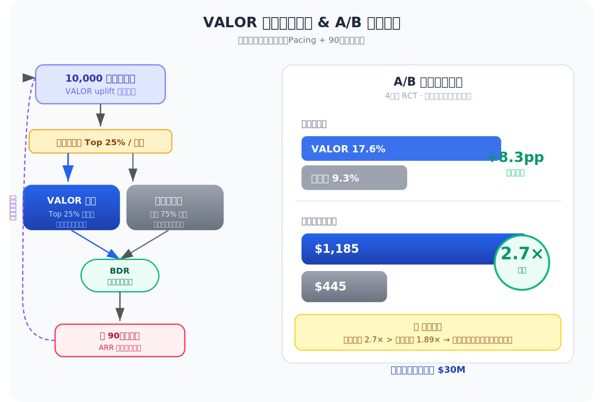
*图示：线上实验不仅验证了VALOR找到了更多机会，更关键的是收入提升倍数（2.7倍）远大于机会数提升倍数（1.89倍），说明VALOR确实在找更高价值的可说服客户，而不只是找更多客户。混合路由策略是一个很实用的工程妥协：纯VALOR会在季度初把最好的线索全部分完，导致后半段销售人员无线索可跟；用传统模型做后备可以平滑线索供给。90天冷却期则是B2B特有的因果归因需求，防止反复干预同一客户导致效果无法测量。*

- **对广告的启发：** 最适合层级：价值感知排序损失与零膨胀分布建模可直接迁移到广告场景的转化价值预估与出价优化；价值：广告系统中同样存在大量零转化、少量高价值转化的零膨胀分布问题，Focal-ZILN损失可用于pCVR和pLTV模型训练；价值加权排序损失可迁移到oCPC/oCPX出价中，让模型优先排对高ROI广告主的出价，而非追求整体MSE最小；Treatment门控机制可迁移到广告增量效果（incrementality）建模中，解决'广告曝光信号被用户固有购买意图淹没'的问题。；风险：论文聚焦B2B场景，样本量仅数万级，与广告系统亿级样本规模差异大；价值加权排序损失的成对计算在大规模广告数据上训练开销较高，需要采样或近似；B2B的90天反馈周期与广告实时反馈差异显著，冷却期机制不可直接复用。

### 2. MBGR: Multi-Business Prediction for Generative Recommendation at Meituan
- **背景：** 生成式推荐(GR)通过语义ID(SID)压缩物品表示、用自回归Next Token Prediction生成候选，在工业界越来越受重视。但现有GR方案只面向单一业务场景：当美团把外卖、娱乐、医疗等多业务塞进同一模型时，出现两个问题——一是NTP无法处理跨业务行为的复杂模式，各业务指标此消彼长(跷跷板现象)；二是所有业务共享同一套语义ID码本，导致不同业务的语义信息混淆、梯度耦合。MBGR是首个专为多业务场景设计的生成式推荐框架，已在美团外卖RTB广告系统上线，线上CTCVR提升3.98%，尤其对小业务提升显著(B业务+7.5%)。
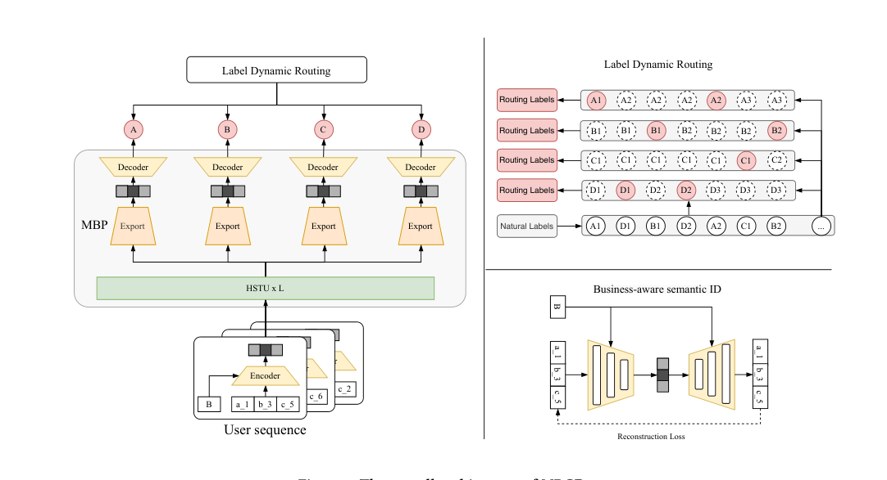
*图示：当前 provider 未启用视觉评审，回退到启发式最高分候选。*

**核心技术点：**

#### 技术点 1：业务感知语义ID(BID)
- 技术细节：BID模块采用编码器-解码器双路径结构。编码器将物品的多个token embedding拼接上业务类型embedding，经FFN得到中间表示，再通过一个门控网络(以sigmoid激活)生成逐元素的门控权重，门控权重与中间表示做逐元素乘法，得到业务感知的物品表示。解码器结构对称：把物品表示拼接业务embedding，经FFN再经ReLU门控，重建原始token embedding。训练时通过重建损失(原始token embedding与重建token embedding的L2距离)保证编码过程的语义信息不丢失。编码器输出作为序列模型的输入表示，解码器同时用于重建和预测。
- 通俗讲解：核心问题是：外卖店和娱乐商户共享一套语义码本，编码后的向量混在一起分不清谁是谁。BID的做法相当于在语义ID上'盖一个业务章'——编码时把业务类型信息融进去并用门控决定哪些维度对该业务重要，解码时再把业务章拆掉还原回原始码。重建损失保证盖章-拆章过程不丢信息。
- 例子：假设一个外卖商户的语义ID由3个token组成（a-2, b-4, c-6），token embedding拼接上'外卖'业务embedding后送入编码器FFN得到中间向量，门控网络根据'外卖'上下文输出一个0到1的权重向量(比如在价格维度权重高、在娱乐属性维度权重低)，两者逐元素相乘得到最终的业务感知表示。解码器再从这个表示+业务embedding重建出（a-2, b-4, c-6）的embedding，重建L2损失很小说明语义没丢。PCA可视化显示BID编码后不同业务的embedding簇明显分开，而简单求和池化则混在一起。

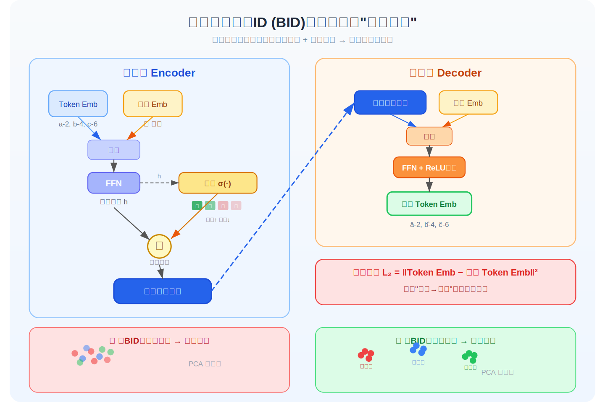
*图示：核心问题是：外卖店和娱乐商户共享一套语义码本，编码后的向量混在一起分不清谁是谁。BID的做法相当于在语义ID上'盖一个业务章'——编码时把业务类型信息融进去并用门控决定哪些维度对该业务重要，解码时再把业务章拆掉还原回原始码。重建损失保证盖章-拆章过程不丢信息。*

#### 技术点 2：多业务预测头(MBP)
- 技术细节：MBP在Transformer(或HSTU)序列编码器之上，为每个业务生成独立的物品表示。具体做法是：将通用物品表示拼接业务embedding得到融合向量z，z送入共享的门控网络(SiLU激活)产生K维注意力权重，同时z分别送入K个共享的专家FFN得到K个变换结果，最后用注意力权重对K个专家输出做加权求和，得到该业务的专属物品表示。每个业务都走一遍这个流程，但专家网络和门控网络参数是所有业务共享的，通过业务embedding的不同来路由不同的专家组合。最终各业务表示分别送入BID解码器生成对应业务的语义ID token序列。
- 通俗讲解：可以理解为：一个用户的行为序列经过序列模型后得到一个通用的'接下来想干嘛'的表示，但外卖和娱乐的'下一步'完全不同。MBP就像一组共享的专家顾问，每个业务根据自身特点选择不同的顾问组合(通过门控权重)来给出业务专属的推荐建议。参数共享让小业务也能借助大业务的知识。
- 例子：假设有8个专家网络。对于'外卖'业务，门控网络可能给专家1和专家3较高权重(比如0.3和0.25)，因为它们擅长捕捉餐饮偏好；对于'娱乐'业务，专家5和专家7权重更高。最终外卖的表示=0.3\*专家1(z)+0.25\*专家3(z)+...，送入解码器生成外卖商户的语义ID token序列。实验显示专家数K=8最优，K=32反而因参数碎片化效果下降。

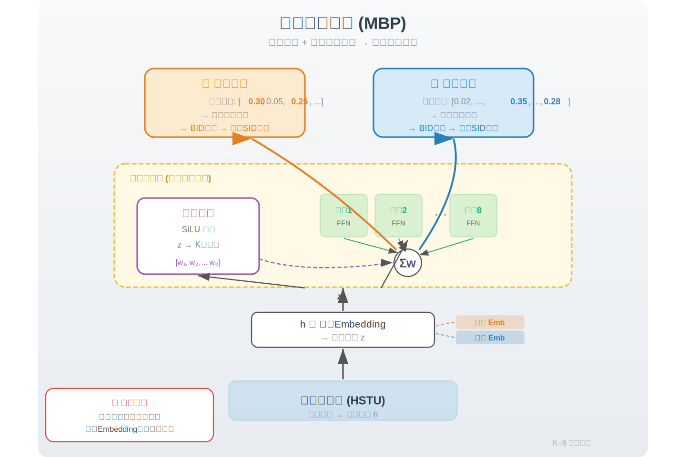
*图示：可以理解为：一个用户的行为序列经过序列模型后得到一个通用的'接下来想干嘛'的表示，但外卖和娱乐的'下一步'完全不同。MBP就像一组共享的专家顾问，每个业务根据自身特点选择不同的顾问组合(通过门控权重)来给出业务专属的推荐建议。参数共享让小业务也能借助大业务的知识。*

#### 技术点 3：标签动态路由(LDR)
- 技术细节：在多业务混合序列中，对每个位置t和每个业务类型b-k，LDR不再简单取序列中的下一个物品作为预测目标，而是向后搜索找到同一业务类型b-k的最近一次未来交互作为该业务的预测标签。即对位置t，业务k的标签是满足'时间戳大于t且业务类型等于b-k'的最早那个物品。如果找不到(该业务此后没有交互)，则对该业务mask掉损失，不做无效预测。这样原本稀疏的多业务标签变成了密集标签——每个序列位置都能为每个活跃业务提供有效的训练信号。
- 通俗讲解：原来的做法是：序列里下一个交互是什么就预测什么，如果下一个是外卖，那娱乐和医疗的预测头就没有标签可学，浪费了大量训练信号。LDR的思路是'各找各的老师'——外卖预测头去找序列后面最近的外卖交互，娱乐预测头去找最近的娱乐交互。这样每个位置每个业务都有标签，训练信号从稀疏变密集。
- 例子：用户序列为（外卖A, 娱乐B, 外卖C, 医疗D）。在位置1(外卖A)处：外卖预测头的标签是外卖C(跳过了娱乐B)，娱乐预测头的标签是娱乐B，医疗预测头的标签是医疗D。在位置3(外卖C)处：外卖预测头后面没有外卖了，mask掉损失；医疗预测头标签仍是医疗D。消融实验显示去掉LDR后整体Hit@10从0.0410降到0.0268，是三个模块中影响最大的。

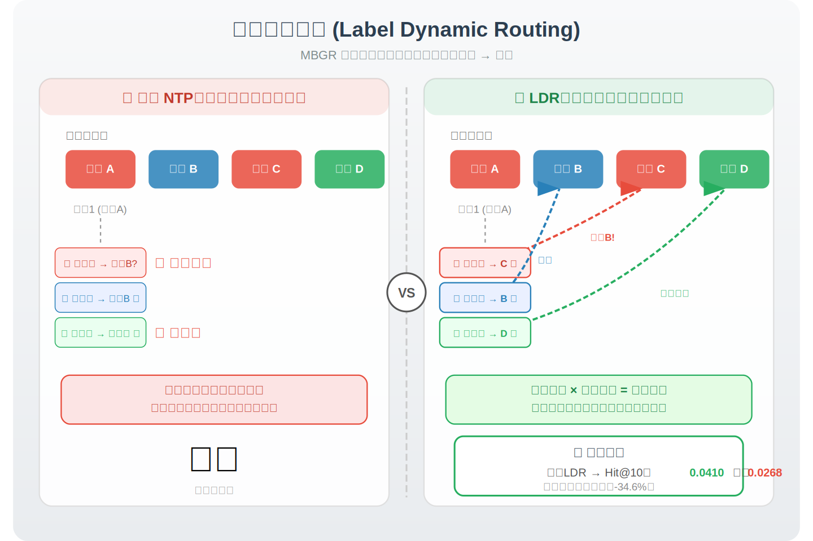
*图示：原来的做法是：序列里下一个交互是什么就预测什么，如果下一个是外卖，那娱乐和医疗的预测头就没有标签可学，浪费了大量训练信号。LDR的思路是'各找各的老师'——外卖预测头去找序列后面最近的外卖交互，娱乐预测头去找最近的娱乐交互。这样每个位置每个业务都有标签，训练信号从稀疏变密集。*

#### 技术点 4：损失函数与时间衰减
- 技术细节：总损失=InfoNCE损失+lambda\*重建损失。InfoNCE损失在所有业务、所有token位置上求和，每个位置计算预测token embedding与正样本的余弦相似度除以温度参数tau，分母是该token位置整个词表的相似度之和(对数softmax)。关键设计：(1)业务权重w-b，小业务给更高权重(如B业务1.5，A业务0.9)，反向补偿大业务在梯度中的天然主导；(2)时间衰减w-t=exp(-alpha\*(序列末时间戳-标签时间戳))，离当前越远的标签权重越低，alpha=0.05最优。重建损失是BID编码器-解码器的L2重建误差，保证语义不丢失。
- 通俗讲解：训练同时优化两个目标：一是让模型对各业务的下一次交互预测准(InfoNCE)，二是让BID编解码不丢信息(重建损失)。InfoNCE里的两个加权技巧很实用：业务权重防止大业务(61%的A)压倒小业务；时间衰减让模型更关注最近的行为，因为用户兴趣会变。
- 例子：假设用户最后一次交互在第30天，LDR找到的B业务标签在第25天(5天前)和A业务标签在第10天(20天前)。alpha=0.05时，B业务的时间权重=exp(-0.05\*5)=0.78，A业务的=exp(-0.05\*20)=0.37。再乘上业务权重(B=1.5, A=0.9)，最终B业务这条样本的损失权重为1.17，A为0.33，模型会更关注近期的小业务交互。

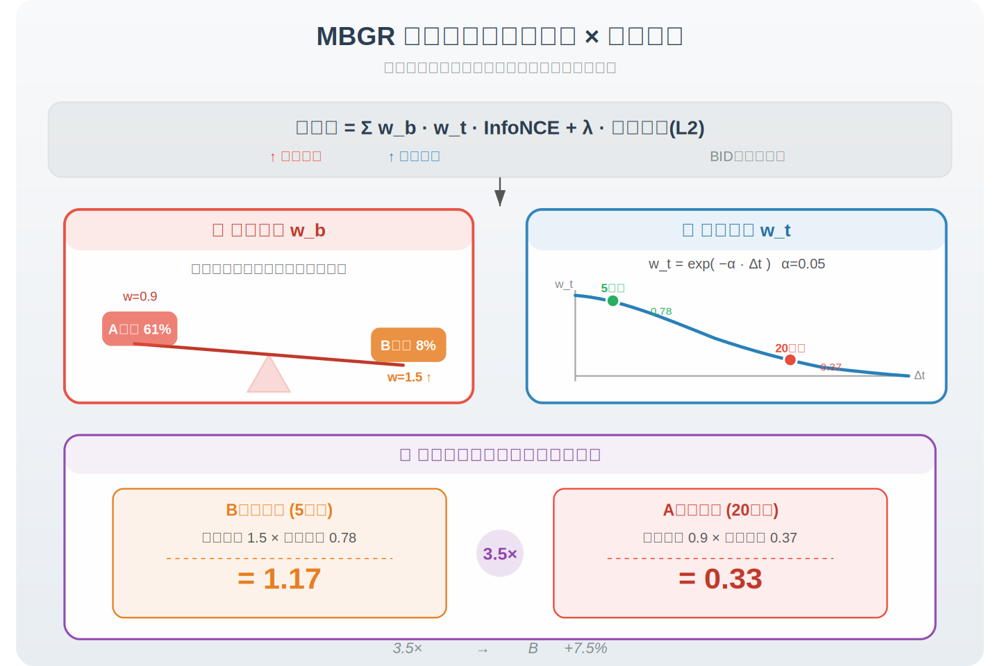
*图示：训练同时优化两个目标：一是让模型对各业务的下一次交互预测准(InfoNCE)，二是让BID编解码不丢信息(重建损失)。InfoNCE里的两个加权技巧很实用：业务权重防止大业务(61%的A)压倒小业务；时间衰减让模型更关注最近的行为，因为用户兴趣会变。*

#### 技术点 5：线上部署与增量集成
- 技术细节：MBGR没有采用端到端替换整个推荐管线的方式(如OneRec)，而是增量集成到美团RTB广告系统。用户embedding预计算后存入分布式缓存供在线检索；物品embedding通过token级查表+BID编码器在线生成。生成的embedding用于两处：作为额外召回通道、作为排序模型的增强特征。线上A/B测试覆盖30%流量一周，CTCVR整体提升3.98%(B业务+7.5%，D业务+5.2%，C业务+4.5%，A业务+3.0%)。
- 通俗讲解：在RTB广告这种对延迟和稳定性极敏感的系统中，直接用一个生成模型替掉整个管线风险太大。MBGR选择把自己训好的用户和物品表示'嫁接'到现有系统：用户表示预算好直接查缓存，物品表示在线轻量编码。这些表示既做向量召回的新通道，也当排序模型的额外特征，实现渐进式收益。
- 例子：一个用户请求到来时，推荐服务器先从缓存中取出该用户的MBGR多业务embedding(包含外卖、娱乐等维度)，匹配服务器用这些embedding做ANN召回，同时排序服务器把这些embedding作为额外特征与原有特征拼接后预测CTCVR。相比不用MBGR的对照组，小业务B的CTCVR线上提升了7.5%。

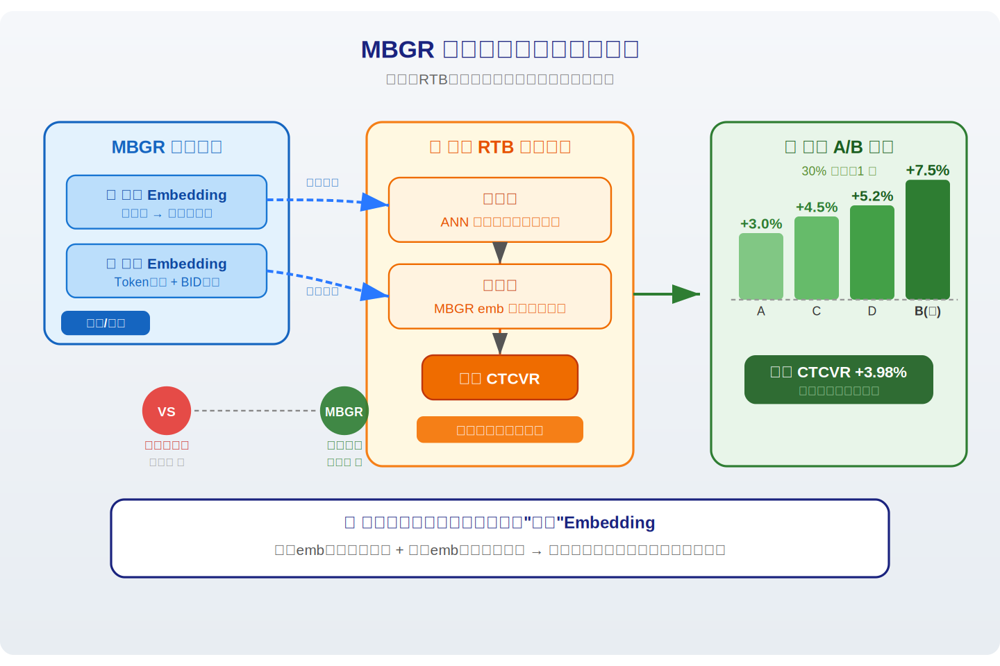
*图示：在RTB广告这种对延迟和稳定性极敏感的系统中，直接用一个生成模型替掉整个管线风险太大。MBGR选择把自己训好的用户和物品表示'嫁接'到现有系统：用户表示预算好直接查缓存，物品表示在线轻量编码。这些表示既做向量召回的新通道，也当排序模型的额外特征，实现渐进式收益。*

- **对广告的启发：** 最适合层级：多业务信号分离(BID+MBP+LDR)的整套方案可直接迁移到广告多场景建模；价值：广告系统常面临类似的多场景问题：搜索广告、信息流广告、开屏广告共用一个模型时大场景压制小场景。MBGR的三个核心设计——业务感知编码(BID)解决不同广告场景特征空间混淆、MoE多头预测(MBP)提供场景专属排序能力、标签动态路由(LDR)将稀疏的场景标签变稠密——与广告多场景CTCVR预估完全对口。特别是LDR思路：在用户混合行为序列中为每个广告场景找到最近的同场景转化事件作为标签，可大幅缓解小场景样本不足的问题。线上3.98%的CTCVR提升也说明实际收益可观。；风险：该方案基于生成式推荐(语义ID+自回归生成)的底层范式，如果广告系统仍以传统embedding+精排为主，需要先引入语义ID体系才能完整复用。BID和LDR可以较独立地迁移，但MBP的MoE专家数需要根据实际业务数和数据量重新调参。此外论文的重建损失和InfoNCE损失的lambda权衡、时间衰减alpha等超参对效果敏感，需要离线充分调优。

## 六、候选但未完成深读的论文

当前重点论文都已完成可用分析。
