# 2026-04-07 论文日报

## 一、今日趋势与创新观察

### 1. 趋势概况

- 当天 551 篇论文中，cs.AI 占比近六成（322 篇），LLM 与语言理解仍是绝对主力主题（122 篇），涵盖推理、对齐、长上下文建模、语义污染检测等多个子方向，研究密度远超其他类别。
- Agent 与多智能体方向继续高产（73 篇），研究重心从单纯的任务编排转向记忆系统设计（多篇涉及 memory、forgetting、persistent runtime）和工具使用的有效性反思（如 Tool Illusion），Agent 基础设施的可审计性和可持续性成为新关注点。
- 表示学习与检索排序方向虽然绝对数量不算多（33 篇），但工业落地信号集中：Snapchat 的 Semantic ID 设计、知识蒸馏改进 dense retrieval、对话推荐中的 RL 增强检索等，工业界在 ID 表示、负样本策略和长短期兴趣融合上持续投入。
- 广告与商业化场景的直接论文数偏少（ad_signal 仅 15 篇），但 AI 对话中的商业说服（Commercial Persuasion）和用户兴趣建模（SLSREC）表明，商业化研究正从传统竞价机制向对话化、个性化说服和精细化用户画像延伸。

### 2. 推荐系统 / 排序相关创新点

- Snapchat 的 Semantic ID 工作展示了工业推荐系统如何将传统 hash ID 升级为语义化向量标识：通过对 item 内容特征做层次化编码生成可泛化的 ID 表示，同时服务于召回和排序，解决了冷启动和跨场景迁移两大痛点。
- SLSREC 提出用自监督对比学习同时建模用户长期偏好和短期意图，再通过自适应门控融合两路信号，这对广告场景下既要捕捉用户稳定兴趣又要响应即时需求的排序模型有直接借鉴意义。
- dense retrieval 的知识蒸馏研究（Beyond Hard Negatives）指出不应只关注 hard negative 的质量，教师模型的完整打分分布对学生模型的泛化更关键，这对广告召回中基于蒸馏训练小模型的实践有直接启示。

### 3. 全局创新点

- Tool Illusion 这篇工作对 Web Agent 中工具调用的有效性提出反思，发现很多场景下 Agent 使用工具并不比直接推理更好，提示社区重新审视 tool use 的收益边界，对所有依赖外部 API 调用的 Agent 系统都有警示意义。
- DARE 将扩散模型的去噪思路引入 LLM 的对齐和强化训练，用逐步去噪的方式替代传统 RLHF 的一次性打分优化，为 LLM 对齐提供了一条新的训练范式。
- 多篇 Agent 记忆系统论文（SuperLocalMemory、Springdrift、LPC-SM）不约而同地引入生物启发的遗忘机制和稀疏记忆结构，表明 Agent 长期记忆的工程化正从"记住一切"转向"有选择地遗忘"，这对降低推理成本和提升个性化质量都有价值。

## 二、今日一个 AI 知识点

### Semantic ID：推荐系统里的 item 怎样从一串哈希变成一段「有意义的编码」

传统推荐系统给每个 item 分配一个随机整数 ID，这个 ID 本身不携带任何语义——两个内容高度相似的视频，ID 可能差了几百万。模型要从头学习每个 ID 对应什么，冷启动时新 item 没有交互历史就几乎无法被推荐。Semantic ID 的思路是把这个过程反过来：先用 item 的内容特征（标题文本、封面图、标签、甚至用户行为统计）喂给一个编码器，输出一个连续向量；然后通过一种层次化的量化过程——比如 RQ-VAE（残差量化变分自编码器）——把这个连续向量逐层离散化成一串短码。你可以想象成给每个 item 生成一个类似邮政编码的东西：第一位代表大类（比如"搞笑短视频"），第二位代表子类（"宠物搞笑"），第三位进一步细分（"猫咪翻车"），每一层都是在语义空间里做一次更精细的切分。这样生成的 ID 天然具备语义结构：编码前缀相同的 item 在内容上就是相似的。当一个全新 item 上线时，只要跑一遍编码器就能拿到它的 Semantic ID，模型可以立刻利用它和已有 item 的前缀共享关系来推断用户是否会喜欢，冷启动问题大幅缓解。在下游使用时，这串离散码可以直接替换传统 ID 嵌入表，喂进召回塔或排序模型的 embedding 层；也可以用类似自回归的方式逐码生成，实现端到端的生成式检索。Snapchat 这篇工作的核心经验是：量化层数、码本大小、编码器用什么特征、以及如何在离线语义质量和在线推荐效果之间做 trade-off，都需要在工业规模上反复调优，光有理论框架远远不够。理解了 Semantic ID，你就抓住了当下推荐系统从'查表'走向'理解'的关键一步。

## 三、今日论文总览

### 1. Semantic IDs for Recommender Systems at Snapchat: Use Cases, Technical Challenges, and Design Choices
- 挑选理由：Snapchat工业推荐系统中Semantic ID的设计，属于大规模工业推荐架构论文，与广告推荐的ID表示和召回排序高度相关

### 2. SLSREC: Self-Supervised Contrastive Learning for Adaptive Fusion of Long- and Short-Term User Interests
- 挑选理由：作者包含Xing Tang和Xiuqiang He，大概率来自华为/腾讯等工业界团队，长短期用户兴趣融合与广告排序中的用户建模高度相关

## 四、补充关注

今天没有需要额外提示的补充关注论文。

## 五、重点论文精读

### 1. Semantic IDs for Recommender Systems at Snapchat: Use Cases, Technical Challenges, and Design Choices
- **背景：** 推荐系统中传统的原子ID（每个用户/物品一个唯一编号）面临三大痛点：嵌入表参数爆炸、冷启动无法泛化、长尾物品训练不足。Semantic ID（SID）通过RQ-VAE等量化器把基础模型的语义向量压缩为一串短离散码，语义相近的物品共享前缀，从而大幅缩小ID空间并天然支持泛化。Snapchat在广告排序、动态商品广告、好友推荐、短视频召回等多个线上系统部署了SID，论文详细披露了工业落地中遇到的codebook坍塌和SID到物品的碰撞消歧两大挑战及其解法，并给出线上A/B实验数据，是目前少有的多场景SID工业实践报告。
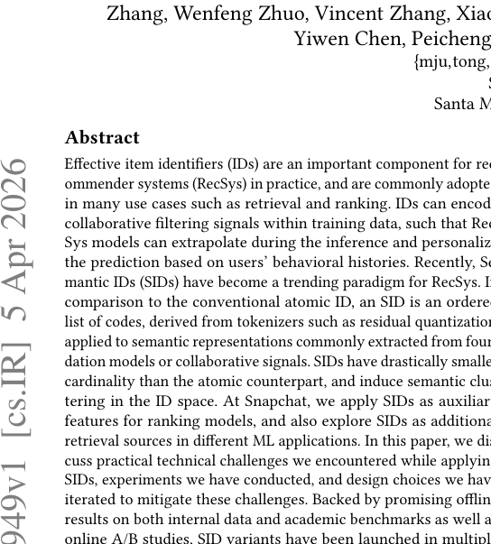
*图示：当前 provider 未启用视觉评审，回退到启发式最高分候选。*

**核心技术点：**

#### 技术点 1：STE缓解Codebook坍塌
- 技术细节：标准RQ-VAE中选择分数最高的方案选码是离散操作，反向传播只更新被选中的码本行，导致大量'死码'永远不被更新。论文用直通估计器（STE）修改解码器输入：在选中码本向量之外，额外加一个残差项——用当前层残差与整个码本的余弦相似度加权求和，再用stop-gradient把该加权项的前向值减掉，使前向计算不变但梯度能流过整张码本。这样每次反向传播所有码本行都会收到梯度，显著提升码本利用率，在内部数据上唯一性提升83.4%。
- 通俗讲解：可以把codebook想象成一排抽屉，标准训练只往被选中的那一个抽屉放东西，其余抽屉永远空着。STE的做法是：前向时仍然只打开一个抽屉取东西，但反向算梯度时让所有抽屉都'感受到'这一次更新的信号，于是空抽屉也能逐步调整位置、吸引新的物品映射过来。
- 例子：假设codebook有1024个码，训练初期只有200个码被选中。没有STE时，剩余824个码梯度为零永远不动；加了STE后，每一步反向传播会把当前残差与全部1024个码做余弦相似度，梯度通过这个相似度矩阵传到所有码上，几轮迭代后原本死掉的码也被拉到数据密集区域，最终活跃码数从200跳到接近900以上。

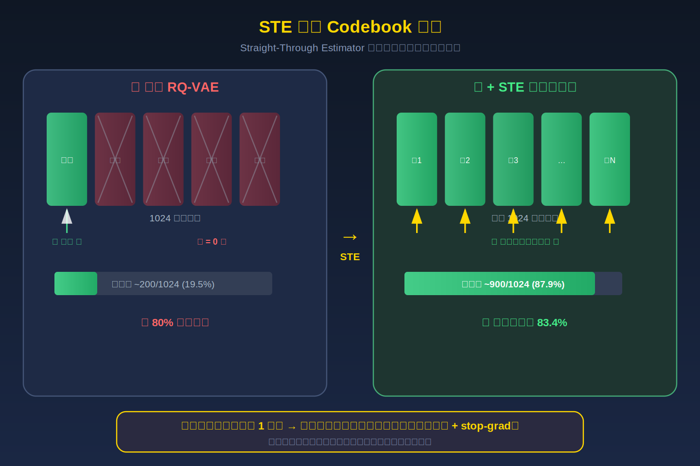
*图示：可以把codebook想象成一排抽屉，标准训练只往被选中的那一个抽屉放东西，其余抽屉永远空着。STE的做法是：前向时仍然只打开一个抽屉取东西，但反向算梯度时让所有抽屉都'感受到'这一次更新的信号，于是空抽屉也能逐步调整位置、吸引新的物品映射过来。*

#### 技术点 2：多模态融合扩大输入方差
- 技术细节：论文发现仅用单一模态（如文本）嵌入做RQ-VAE输入，向量分布过于集中，码本用很少的码就能完成重建，加剧坍塌。解法是把多个预训练模型（CLIP视觉、音频、转录文本等）的嵌入经各自独立编码器映射到同维度后直接求和，作为RQ-VAE的输入；解码端也对每个模态分别重建。多模态叠加使输入流形的拓扑更复杂、方差更大，迫使量化过程使用更多码本条目。实验显示在STE基础上再加视觉+音频+转录，唯一性还能再累计提升约40%。
- 通俗讲解：如果所有物品只用文字描述，很多视频的文字embedding其实很像，码本用几个码就够表达了。把画面、声音、字幕三路信号加在一起，信息量变丰富，向量散得更开，量化时就必须动用更多码才能精确重建，自然减少碰撞。
- 例子：一条美食短视频：文本embedding捕获'烹饪教程'语义，CLIP视觉embedding捕获'厨房场景+食材颜色'，音频embedding捕获'油炸声'。三者求和后的向量相比纯文本多了视觉和听觉维度的差异，RQ-VAE就需要更多不同的码来逼近这个更高维、更分散的输入分布。

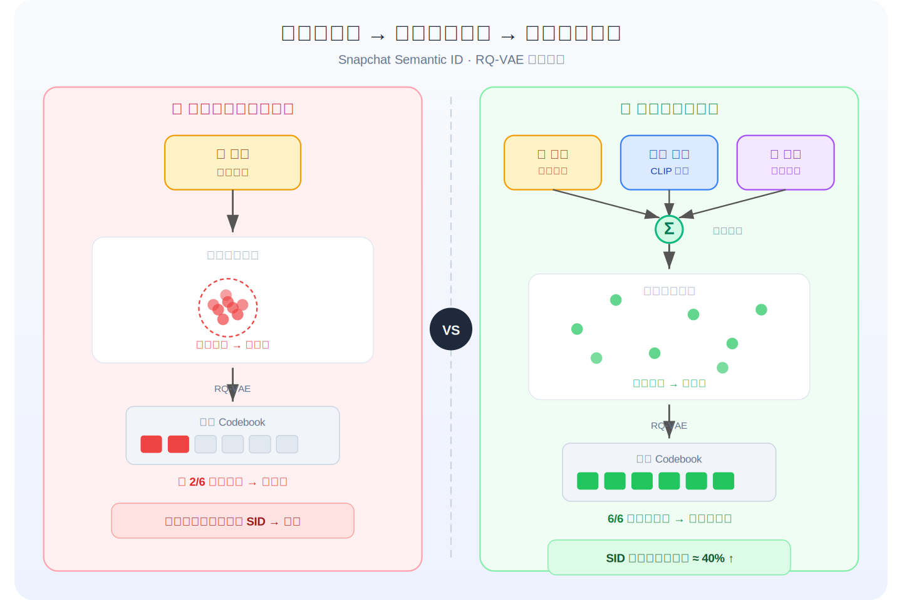
*图示：如果所有物品只用文字描述，很多视频的文字embedding其实很像，码本用几个码就够表达了。把画面、声音、字幕三路信号加在一起，信息量变丰富，向量散得更开，量化时就必须动用更多码才能精确重建，自然减少碰撞。*

#### 技术点 3：SID作为排序辅助特征
- 技术细节：在广告排序场景，用Qwen-Embedding对广告文本元数据编码后通过RQ-VAE生成SID码序列，将每层码作为类别特征拼入排序模型。Ads Ranking的Swipe Up AUC提升0.028%、Landing Page View AUC提升0.035%；动态商品广告（DPA）场景因物品ID高速更替，SID带来的泛化收益更大，Add to Cart AUC提升0.67%，所有预测头平均提升0.24%。好友推荐场景则用GraphHash把9亿用户ID通过图聚类压缩为SID，线上相关性指标提升1.77%~4.90%，负向操作下降3%~5%。
- 通俗讲解：SID本质上是把高维语义向量'哈希'成几个离散层级标签，像给物品打上一组由粗到细的语义类目。排序模型把这些标签当普通类别特征学embedding，就能用极少参数捕获物品间的语义相似结构，尤其对新品和长尾广告效果明显，因为新广告虽然没有历史ID embedding，但它的SID码已经在其他相似广告上被充分训练过。
- 例子：一条新上架的运动鞋DPA广告，原子ID从未出现过，embedding随机初始化。但其SID码序列可能是（体育-鞋类-跑步），这三层码在历史数据中已有大量同类商品贡献梯度，排序模型立刻就能给出合理的CTR预估，无需等待该广告积累足够曝光。

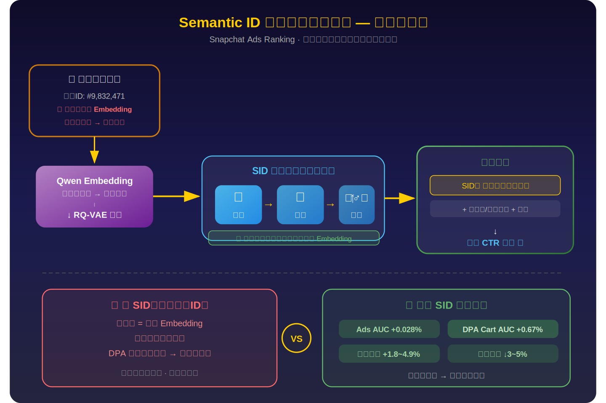
*图示：SID本质上是把高维语义向量'哈希'成几个离散层级标签，像给物品打上一组由粗到细的语义类目。排序模型把这些标签当普通类别特征学embedding，就能用极少参数捕获物品间的语义相似结构，尤其对新品和长尾广告效果明显，因为新广告虽然没有历史ID embedding，但它的SID码已经在其他相似广告上被充分训练过。*

#### 技术点 4：生成式召回中的碰撞消歧
- 技术细节：因SID码空间远小于物品总数，多个物品会映射到同一SID（碰撞）。论文提出两个策略：一是桶内启发式消歧——当生成模型输出一个SID后，用物品级元信号（如累计观看时长、内容新鲜度）对桶内物品做二次排序，选出最相关的物品；二是优先深度而非广度——在固定召回预算下，从少数top SID中取更多物品（深度），比从大量SID中各取少量物品（广度）效果好。线上实验表明，用相关性引导的深度策略（top 10 SID各取100个物品）相比随机映射的广度策略（top 100 SID各取10个），短视频观看+0.57%、分享+4.39%、转发+3.55%。
- 通俗讲解：生成模型输出的SID就像一个'语义桶'，桶里可能有几十个视频。随机从桶里挑一个效果一般，但如果按播放热度或时效性排个序再挑，就能把最优质的视频捞出来。同时，与其打开100个桶每个挑1个，不如只打开排名最靠前的10个桶、每个挑10个，因为模型对前几个桶的置信度最高。
- 例子：beam search输出排名第一的SID对应50个短视频。随机取1个命中用户兴趣的概率不高；但如果用24小时内的累计完播率排序，取前10个，大概率包含当前最受欢迎且语义匹配的视频。线上A/B显示这种'深度优先+相关性排序'组合带来分享量提升4.39%。

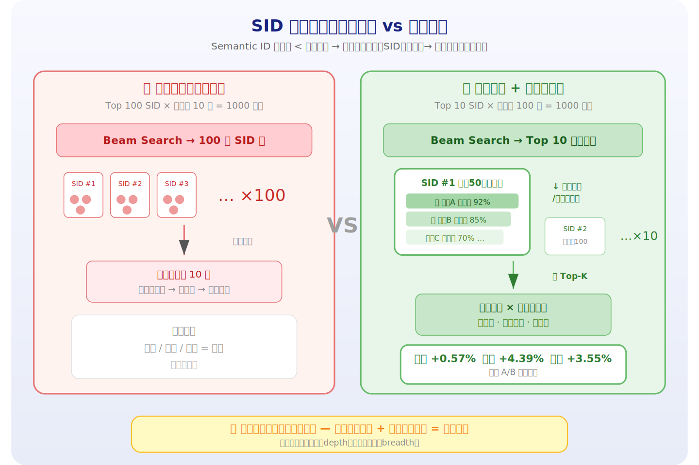
*图示：生成模型输出的SID就像一个'语义桶'，桶里可能有几十个视频。随机从桶里挑一个效果一般，但如果按播放热度或时效性排个序再挑，就能把最优质的视频捞出来。同时，与其打开100个桶每个挑1个，不如只打开排名最靠前的10个桶、每个挑10个，因为模型对前几个桶的置信度最高。*

#### 技术点 5：唯一性并非黄金标准
- 技术细节：业界普遍用SID唯一性（唯一SID数/物品总数）作为离线质量指标。论文在Amazon Beauty数据集上用不同codebook大小（64 3到1024 3）生成SID，发现唯一性从65%提高到93%，但Recall@10在唯一性超过约70%后基本不再提升（6.0 vs 6.1 vs 6.2，差异极小）。结论是唯一性是防止坍塌的必要门槛，但盲目追求100%唯一性收益递减，应开发更能反映语义丰富度与物品区分度平衡的离线指标。
- 通俗讲解：唯一性好比考试及格线，低于70%说明码本严重坍塌、很多物品无法区分，必须修复；但一旦过了及格线，再刷高分数对下游推荐帮助很小。这提醒实践者不要在codebook大小上无限堆参数，而应关注SID是否真正捕获了有用的语义层次结构。
- 例子：codebook从64x64x64扩大到1024x1024x1024，唯一性从65%升到93%，但GR的Recall@10只从5.8微升到6.1。如果团队为追求93%唯一性付出了十倍存储和训练成本，性价比很低；选一个中等大小的256 3（唯一性82%、Recall 6.1）可能是更务实的工程选择。

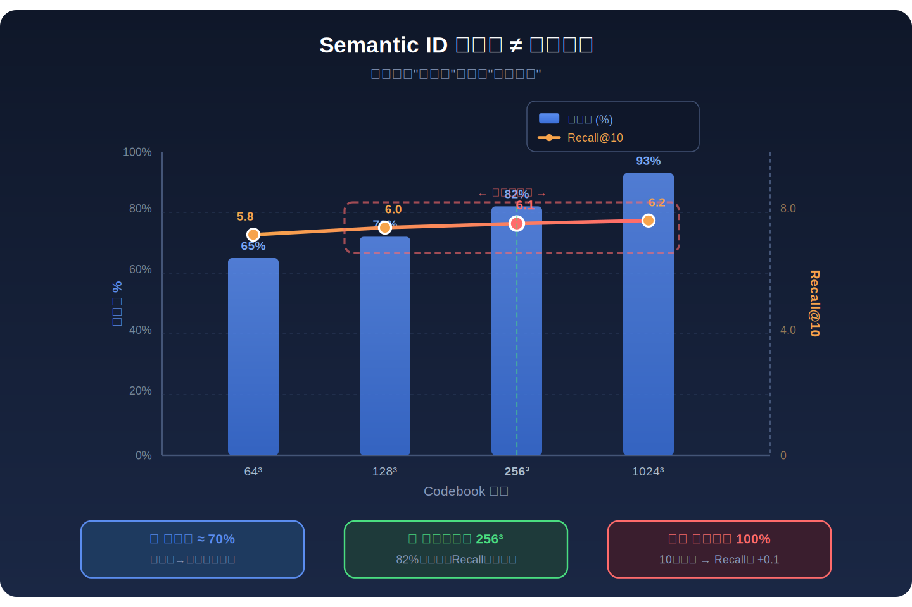
*图示：唯一性好比考试及格线，低于70%说明码本严重坍塌、很多物品无法区分，必须修复；但一旦过了及格线，再刷高分数对下游推荐帮助很小。这提醒实践者不要在codebook大小上无限堆参数，而应关注SID是否真正捕获了有用的语义层次结构。*

- **对广告的启发：** 最适合层级：广告排序特征层与召回层；价值：论文直接在Snapchat Ads Ranking和DPA Ranking上验证了SID作为辅助特征的效果，对广告冷启动、商品目录高频更新场景（DPA AUC+0.67%）收益显著。STE+多模态融合的RQ-VAE优化方案可直接复用于广告创意/商品的语义ID生成；碰撞消歧策略对广告召回中相似素材的去重和优选也有参考价值。GraphHash对用户ID压缩的思路可迁移到广告主/受众画像的稀疏ID表示。；风险：SID本质是有损压缩，碰撞不可避免，在广告场景中如果不同广告主的创意映射到同一SID，可能引发竞价公平性和归因问题。此外，唯一性与下游效果的非线性关系意味着离线调优缺乏可靠代理指标，需要频繁A/B验证。RQ-VAE训练依赖高质量基础模型embedding，embedding质量不足时SID增益可能有限。

### 2. SLSREC: Self-Supervised Contrastive Learning for Adaptive Fusion of Long- and Short-Term User Interests
- **背景：** 推荐系统中用户兴趣天然包含稳定的长期偏好（如长期喜欢数码产品）和动态的短期意图（如出差前临时买行李箱），准确区分并融合二者对推荐精度至关重要。现有方法要么将整段行为编码成单一表示导致长短期信号混杂，要么虽然分别建模但缺乏显式监督信号来校准长短期表示的语义边界，尤其在短期兴趣快速变化时捕捉不准。SLSRec提出基于会话分割的长短期兴趣解耦框架，并引入自监督对比学习来显式校准两种兴趣表示，在Taobao、Tmall、Cosmetics三个电商数据集上全面超过SOTA，值得关注其对广告用户建模的借鉴价值。
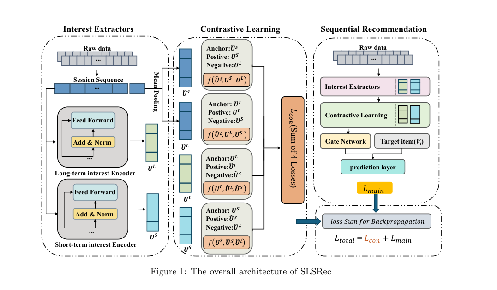
*图示：当前 provider 未启用视觉评审，回退到启发式最高分候选。*

**核心技术点：**

#### 技术点 1：时间感知的会话分割
- 技术细节：模型首先根据用户行为序列中相邻交互的时间间隔，用一个阈值omega来切分会话：如果两次交互间隔小于omega则归入同一会话，否则切开。切分后得到k个会话，前k-1个用于长期兴趣建模，第k个（最近的）用于短期兴趣建模。omega在Taobao设为90分钟，Tmall设为1天，Cosmetics设为30分钟，反映不同场景下用户活跃粒度不同。
- 通俗讲解：这一步的直觉是：用户在一段集中时间内的浏览行为高度相关（比如一次购物Session），而两次购物之间的长间隔意味着兴趣可能发生了切换。按时间间隔把行为切成多个Session后，最近的Session代表当前短期意图，历史Session代表长期偏好积累，为后续分别编码奠定基础。
- 例子：假设用户在12月1日上午连续浏览了5个手机壳（间隔都在几分钟内），下午3点又浏览了3个充电宝（与上午间隔超过90分钟），12月2日浏览了2个耳机。按omega=90分钟切分，得到3个Session：手机壳Session、充电宝Session、耳机Session。前两个Session送入长期编码器，耳机Session送入短期编码器。

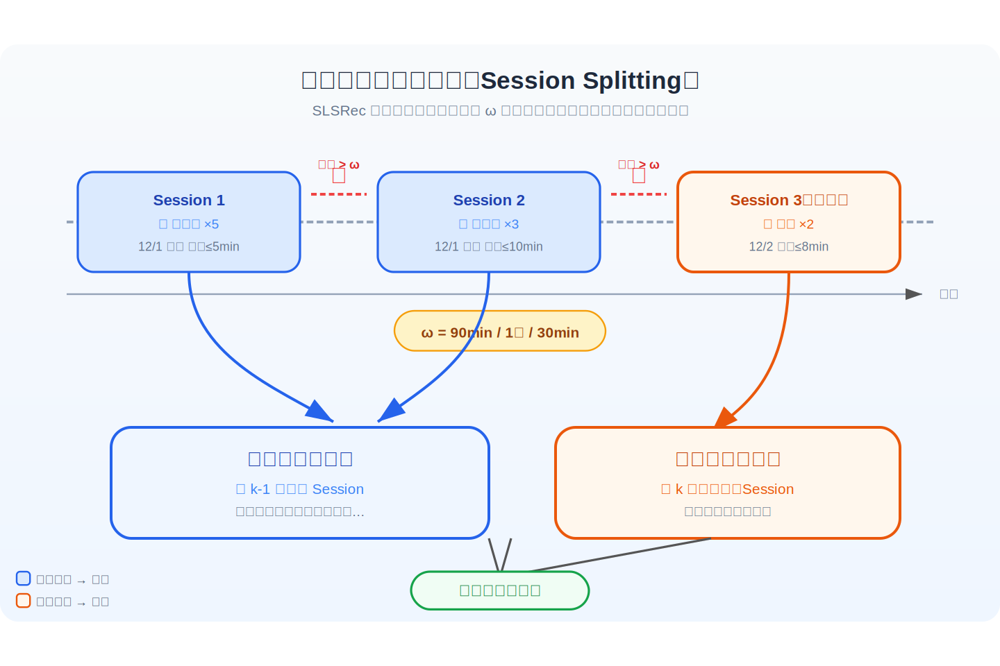
*图示：这一步的直觉是：用户在一段集中时间内的浏览行为高度相关（比如一次购物Session），而两次购物之间的长间隔意味着兴趣可能发生了切换。按时间间隔把行为切成多个Session后，最近的Session代表当前短期意图，历史Session代表长期偏好积累，为后续分别编码奠定基础。*

#### 技术点 2：长短期兴趣双编码器
- 技术细节：短期编码器对第k个Session用自注意力得到短期表示us，再引入类别掩码矩阵M——取当前Session中出现次数最多的商品类别，将属于该类别的位置标1、其余标0，构造对角矩阵与us相乘得到类别加权表示uc，最终短期兴趣uS是us和uc的拼接。长期编码器对前k-1个Session分别用自注意力提取每个Session的表示h1到h(k-1)，再送入GRU捕捉跨Session的兴趣演化，最后用目标物品vT做注意力加权聚合，得到两路长期表示uh和uh'（分别来自注意力输出和GRU输出），拼接为uL。
- 通俗讲解：短期编码器的关键创新是类别掩码：在当前Session内，通过统计哪个商品类别出现最多，把注意力集中到该类别相关的物品上，过滤掉偶然噪声。长期编码器则先独立理解每个历史Session的主题，再用GRU串联起来捕捉用户兴趣随时间的漂移趋势，最后根据当前候选物品自适应地加权历史Session的贡献。
- 例子：继续上例，短期编码器处理耳机Session（2个耳机），自注意力输出us后，因为类别'耳机'出现最多，掩码矩阵将两个位置都标1，uc与us基本一致。长期编码器分别编码手机壳Session和充电宝Session各得h1、h2，GRU处理后得到h1'、h2'，然后用候选物品（比如一个蓝牙耳机）做注意力打分，发现充电宝Session与蓝牙耳机更相关（都是电子配件），给h2更高权重，最终聚合为uL。

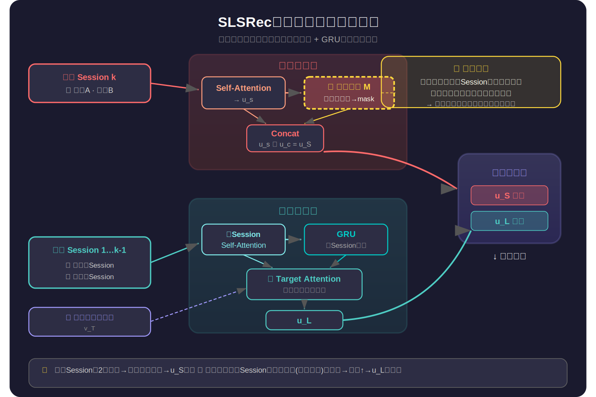
*图示：短期编码器的关键创新是类别掩码：在当前Session内，通过统计哪个商品类别出现最多，把注意力集中到该类别相关的物品上，过滤掉偶然噪声。长期编码器则先独立理解每个历史Session的主题，再用GRU串联起来捕捉用户兴趣随时间的漂移趋势，最后根据当前候选物品自适应地加权历史Session的贡献。*

#### 技术点 3：四组三元组对比学习
- 技术细节：模型构造两个监督锚点：长期监督表示UL-hat是前k-1个Session所有物品embedding的均值，短期监督表示US-hat是第k个Session物品embedding的均值。然后设计四组三元组损失：(1)锚点US-hat、正例uS、负例uL；(2)锚点UL-hat、正例uL、负例uS；(3)锚点uL、正例UL-hat、负例US-hat；(4)锚点uS、正例US-hat、负例UL-hat。每组用Triplet Loss（基于欧氏距离加margin alpha），要求正例对距离比负例对距离至少小alpha。四组损失求和得到对比损失Lcon，与主任务交叉熵损失Lmain加权求和（权重lambda）作为总损失。
- 通俗讲解：核心思想是：编码器输出的长期表示应该离长期行为的均值embedding近、离短期的远，反之亦然。四组三元组从不同方向反复拉近同类、推远异类，形成双向对称的校准信号。这解决了没有显式标签时长短期表示容易纠缠的问题——通过自监督方式强制两种表示在语义空间上分开。
- 例子：假设UL-hat（历史Session的均值embedding）在语义空间中偏向'手机壳+充电宝'方向，US-hat偏向'耳机'方向。第一组损失要求短期编码器输出uS更靠近US-hat（耳机方向）而远离uL（历史方向）；第二组要求长期编码器输出uL更靠近UL-hat而远离uS。训练几轮后，uL和uS在embedding空间中被有效分离，各自聚焦于应该捕捉的信号。

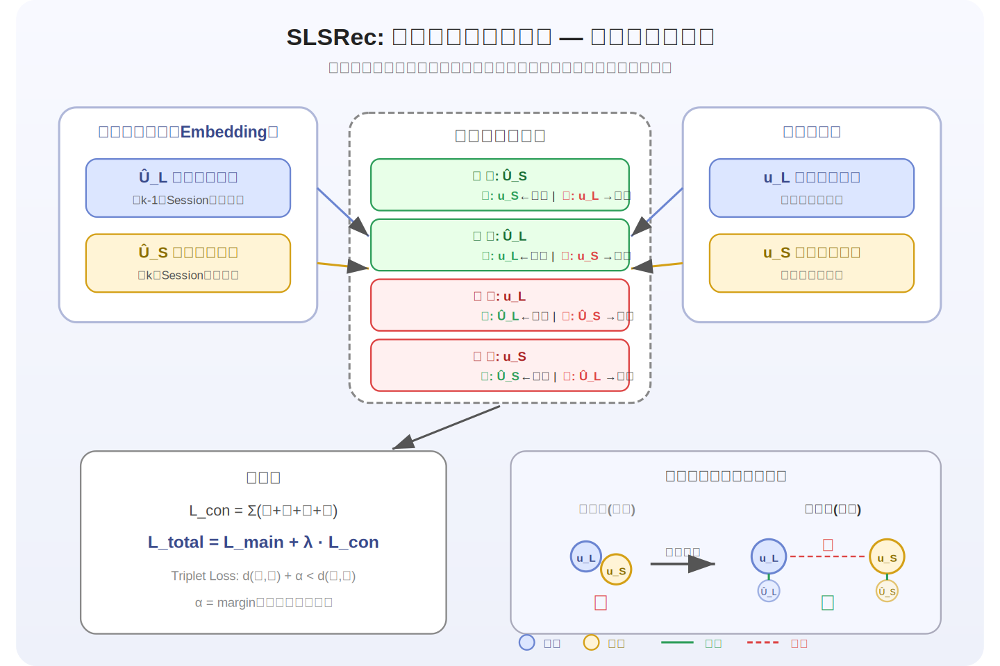
*图示：核心思想是：编码器输出的长期表示应该离长期行为的均值embedding近、离短期的远，反之亦然。四组三元组从不同方向反复拉近同类、推远异类，形成双向对称的校准信号。这解决了没有显式标签时长短期表示容易纠缠的问题——通过自监督方式强制两种表示在语义空间上分开。*

#### 技术点 4：目标物品自适应门控融合
- 技术细节：将长期表示uL、短期表示uS和候选物品embedding vT拼接后，通过一个带sigmoid的线性层输出融合权重alpha（0到1之间），最终用户表示uLS = alpha \* uL + (1-alpha) \* uS，再送入两层MLP与vT一起预测交互概率。alpha的大小取决于候选物品与两种兴趣的匹配程度。
- 通俗讲解：不同候选物品应该依赖不同的兴趣源：如果候选物品是用户一直喜欢的品类，长期权重alpha应较大；如果是用户刚刚在浏览的新品类，短期权重(1-alpha)应较大。这个门控机制让模型根据具体候选物品动态调整融合比例，而不是用固定权重简单相加。
- 例子：当候选物品是一款新耳机时，门控网络发现它与短期表示uS（耳机Session）更匹配，输出alpha=0.3，即70%权重给短期兴趣。当候选物品是手机壳时，alpha=0.7，70%权重给长期兴趣。最终uLS送入MLP输出点击概率。

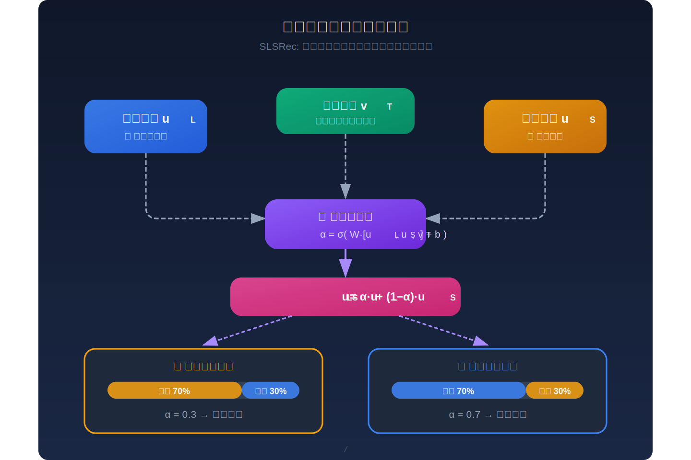
*图示：不同候选物品应该依赖不同的兴趣源：如果候选物品是用户一直喜欢的品类，长期权重alpha应较大；如果是用户刚刚在浏览的新品类，短期权重(1-alpha)应较大。这个门控机制让模型根据具体候选物品动态调整融合比例，而不是用固定权重简单相加。*

#### 技术点 5：消融实验关键发现
- 技术细节：去掉短期编码器后AUC在三个数据集上分别暴跌27.73%、36.98%、39.90%，NDCG@2下降超70%，说明短期兴趣是推荐精度的主要驱动力。去掉长期编码器AUC下降约3-5%，去掉类别掩码NDCG@2在Taobao下降7.81%，去掉对比学习模块影响相对最小但仍可观测，说明各组件都有贡献且短期建模最关键。
- 通俗讲解：这组实验的核心信息是：在电商场景下，用户的即时意图（短期兴趣）对下一次点击的预测力远大于长期偏好，但长期偏好提供了不可替代的补充信息。类别掩码在Session内做了有效的噪声过滤，对比学习则帮助优化表示质量，二者都是锦上添花但不可忽视。
- 例子：在Taobao数据集上，完整模型AUC=0.9076，去掉短期编码器直接降到0.6559（接近随机），去掉长期编码器降到0.8639（仍可用但明显变差），这说明仅靠长期兴趣无法应对用户即时需求的快速变化。

*图示：这组实验的核心信息是：在电商场景下，用户的即时意图（短期兴趣）对下一次点击的预测力远大于长期偏好，但长期偏好提供了不可替代的补充信息。类别掩码在Session内做了有效的噪声过滤，对比学习则帮助优化表示质量，二者都是锦上添花但不可忽视。*

- **对广告的启发：** 最适合层级：用户兴趣建模层；价值：广告CTR预估中同样面临长短期兴趣融合问题：用户的长期品牌偏好与当前搜索/浏览意图需要动态平衡。SLSRec的三个思路可直接迁移：(1)按时间间隔切分行为序列为会话，在广告场景中对应按Session切分用户浏览/点击流；(2)用对比学习显式校准长短期表示，避免在无标签场景下两种信号混杂；(3)基于候选广告的门控融合机制，让不同广告自动获得不同的长短期兴趣权重，这对广告多样性和精准投放都有实际价值。；风险：论文仅在三个电商推荐数据集上验证，未涉及真实广告点击/转化场景；会话分割阈值omega对效果影响较大且需人工调参，在广告流量模式更复杂的场景下可能不稳定；对比学习的四组三元组损失增加了训练复杂度，在大规模广告系统的在线训练中需要评估额外开销；类别掩码依赖商品类别信息，在广告场景中类别体系可能不一致或缺失。

## 六、候选但未完成深读的论文

当前重点论文都已完成可用分析。
