# 2026-04-08 论文日报

## 一、今日趋势与创新观察

### 1. 趋势概况

- 当天 389 篇论文中，LLM 与语言理解类占比最高（约 95 篇），研究重心集中在 LLM 生成内容对检索系统评测基准的污染效应、RAG 链路中各环节的偏差溯源，以及 LLM 在垂直领域（金融、法律、医疗）的落地质量问题。
- Agent 与多智能体方向是第二大热区（约 45 篇），焦点已从单纯的 Agent 能力展示转向可信评估框架、轨迹级检索与经验迁移，显示社区正在补齐 Agent 的可度量性短板。
- 表示学习与检索排序仍然保持稳定出量（约 34 篇），其中跨语言对齐、生成式检索与稠密检索的对比实验、以及面向特定法域的 benchmark 构建是主要方向，方法上更多使用对比学习和语义对齐技巧。
- 直接面向商业化决策的论文数量虽少（仅 2 篇），但质量突出——京东的联合出价定价框架和腾讯广告全模态生成式推荐竞赛方案，均为工业级系统，反映大厂在广告链路中正积极引入生成式建模范式。

### 2. 推荐系统 / 排序相关创新点

- JD-BP 提出将自动出价和定价放进同一个生成式框架做联合决策，而非传统两阶段串行优化；这意味着出价策略可以直接感知定价空间，减少两个模块之间的信息损失和博弈冲突。
- 美团的 Next-Scale Generative Reranking 用树结构把重排建模为逐层生成过程——先决定大粒度排列骨架，再逐级细化——在工业级流量上验证了生成式重排的可行性，为广告列表排序提供了新的结构化范式。
- 营销 Uplift Modeling 领域出现了一篇大规模实证对比，系统测试了 Meta-Learner 家族（S/T/X-learner）与 Causal Forest 在异质处理效应估计上的差异，为广告定向和增量归因选模型提供了实操参考。

### 3. 全局创新点

- 腾讯广告算法大赛的全模态生成式推荐方案展示了一种将图文、视频等多模态信号统一编码后直接用生成模型输出推荐结果的端到端路径，模糊了传统「特征工程→召回→排序」的流水线边界。
- 多篇论文（如 LLM Effect on IR Benchmarks）开始用 meta-analysis 方法量化 LLM 生成数据对检索评测基准的系统性污染程度，这为所有依赖公开 benchmark 做离线评估的团队敲响警钟。
- Agent 方向出现了「从轨迹中检索」的新思路（Learning to Retrieve from Agent Trajectories），将历史执行路径当作可检索的知识库，让新任务能复用过去的多步推理经验，本质上把 RAG 的 retrieval 粒度从文档级提升到了决策序列级。

## 二、今日一个 AI 知识点

### 表示学习为什么是很多系统的隐形底座

表示学习的目标不是简单把输入压成一个向量，而是把真正影响任务的结构信息保留下来，同时把噪声和偶然因素压下去。后面的检索、排序、聚类、生成，很多时候都只是拿这个表示继续做计算。 很多论文表面看是在做召回、排序、生成，其实核心改进都发生在表示层。先理解表示学习，就更容易抓住论文真正的创新位置。 可以顺着一次具体运行过程来理解：你可以顺着一次前向这样理解：系统先把用户最近点击、搜索词、广告文案和商品属性分别编码，再通过共享空间把它们投到同一组向量坐标里；如果两个对象在任务上更相关，它们在这个空间里就应该更近；后续做召回时，只要比较向量距离，就能先快速找出更可能相关的一批候选。

## 三、今日论文总览

### 1. JD-BP: A Joint-Decision Generative Framework for Auto-Bidding and Pricing
- 挑选理由：自动出价与定价的联合决策框架，直接命中广告竞价核心场景（Auto-Bidding and Pricing）

### 2. Tencent Advertising Algorithm Challenge 2025: All-Modality Generative Recommendation
- 挑选理由：腾讯广告算法大赛2025，直接涉及广告场景的全模态生成式推荐，核心广告论文

### 3. Next-Scale Generative Reranking: A Tree-based Generative Rerank Method at Meituan
- 挑选理由：美团工业级重排方法，与广告排序高度同构，树结构生成式重排可迁移至广告场景

### 4. A Large-Scale Empirical Comparison of Meta-Learners and Causal Forests for Heterogeneous Treatment Effect Estimation in Marketing Uplift Modeling
- 挑选理由：营销增益建模(Uplift Modeling)中的异质处理效应估计，直接涉及营销/广告投放中的因果效应评估与用户定向优化

## 四、补充关注

今天没有需要额外提示的补充关注论文。

## 五、重点论文精读

### 1. JD-BP: A Joint-Decision Generative Framework for Auto-Bidding and Pricing
- **背景：** 自动出价系统需要在预算和ROI等KPI约束下最大化广告价值，但CTR/CVR预估误差和转化延迟会导致实时ROI偏离目标。传统方法在发现ROI违约后会压低未来出价来补偿历史亏损，这让广告主错失高价值流量，并降低整体分配效率。JD-BP的核心洞察是：与其让出价同时承担'争取价值'和'补偿历史违约'两个目标，不如把它们拆成两个独立但协同的动作——出价专注于价值最大化，定价修正项专门处理历史KPI缺口。论文在AuctionNet离线数据集上大幅领先已有方法，并在京东线上实验验证了实际效果，值得关注。
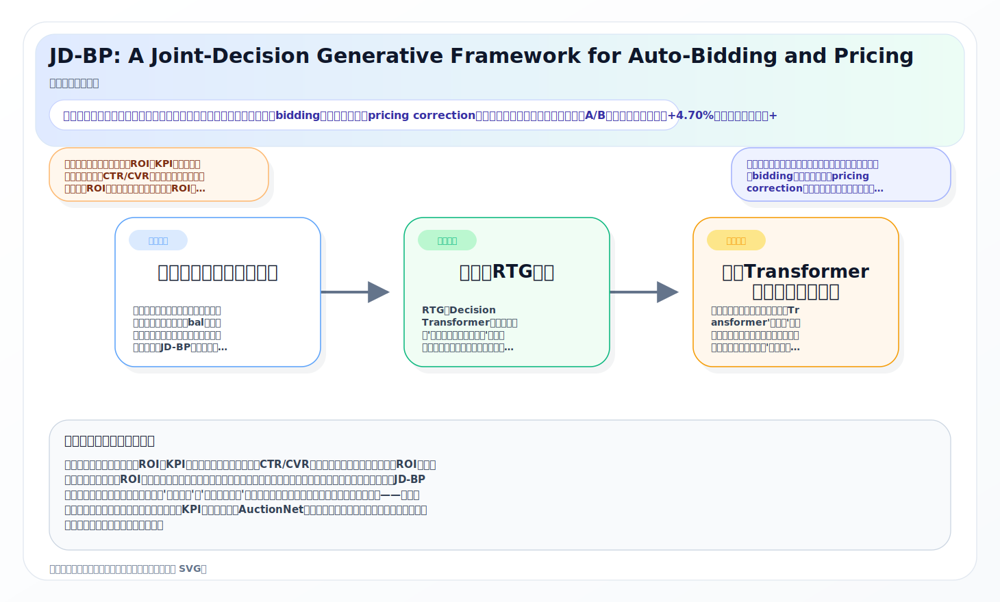
*图示：候选主图不可靠，已回退为论文核心机制总览 SVG。*

**核心技术点：**

#### 技术点 1：出价与定价修正解耦框架
- 技术细节：论文在GSP等拍卖机制的结算阶段引入一个定价修正项y-t，使最终支付变为p-t = c-t + y-t（c-t是原始出价成本）。整体优化问题要求：1）未来总支付（含修正）不超过剩余预算；2）未来ROI满足目标；3）所有y-t之和恰好等于负的历史亏损bal，即修正项总额刚好弥补历史ROI违约造成的超额花费。论文证明在完全信息下，该联合问题的最优出价公式与原始单纯出价问题结构完全一致，唯一区别是预算上界从B-tm放宽到B-tm + bal，因此出价可以更积极地争取价值，而亏损由定价修正均摊。
- 通俗讲解：想象你在竞拍中因为预估偏差已经多花了一笔钱（历史亏损bal），传统方法会让你之后出价变得保守来省钱补回来。JD-BP的做法不同：它让你继续按真实价值正常出价，但在每次竞拍胜出后的结算环节，从账单里扣回一小笔钱（定价修正），用这些小额扣回慢慢弥补历史亏损。这样出价不被扭曲，高价值流量不会错过。
- 例子：假设广告主目标ROI=10，但过去时段因转化延迟导致实际ROI=6，累积亏损bal=100元。传统方法会大幅降低后续出价。JD-BP则保持出价不变，但假设未来还会赢50次展示，则每次展示结算时扣回y-t = -100/50 = -2元。广告主总支付减少100元，恰好补平历史亏损，同时出价仍然反映真实价值，不会错过高价值用户。

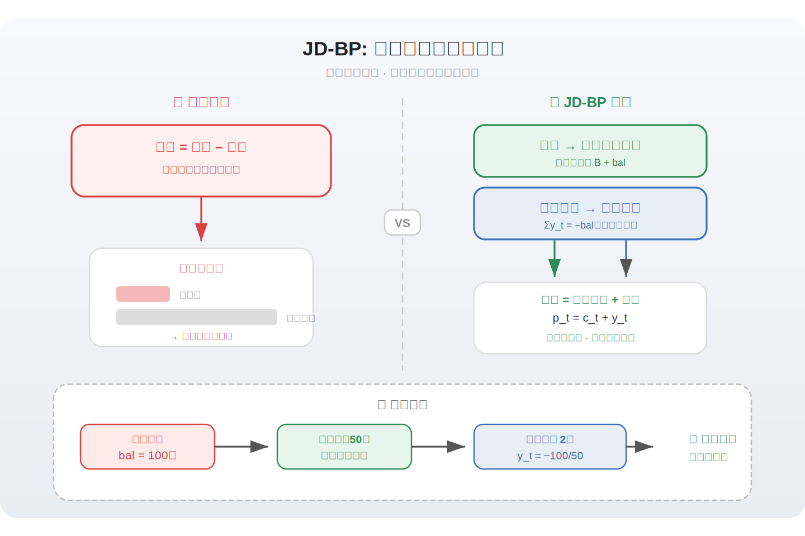
*图示：想象你在竞拍中因为预估偏差已经多花了一笔钱（历史亏损bal），传统方法会让你之后出价变得保守来省钱补回来。JD-BP的做法不同：它让你继续按真实价值正常出价，但在每次竞拍胜出后的结算环节，从账单里扣回一小笔钱（定价修正），用这些小额扣回慢慢弥补历史亏损。这样出价不被扭曲，高价值流量不会错过。*

#### 技术点 2：无记忆RTG设计
- 技术细节：传统Decision Transformer的Return-to-Go（RTG）会把从开头到当前的全部历史累积进来，导致模型看到历史ROI违约后倾向于压低未来出价。JD-BP为出价流设计了无记忆RTG：R-b-t = min((未来总价值/未来总成本)的平方, 1) 乘以 未来总价值。这个RTG只关注从时刻t到结束的未来约束满足度和价值，完全不包含历史违约信息。定价流则有自己的RTG R-p-t，它包含全局（含历史）的修正后成本与价值的比率信息，以及对剩余修正空间的评估。两个RTG各自引导对应的动作流。
- 通俗讲解：RTG是Decision Transformer用来告诉模型'你还期望获得多少回报'的信号。如果把历史违约信息也放进出价的RTG里，模型就会变得保守。JD-BP把出价的RTG设计成'失忆'的——它只看未来还能挣多少价值、未来成本是否合理，对过去的亏损一无所知。而定价修正的RTG则保留了全局记忆，负责知道还有多少亏损需要补回来。这样出价不被历史拖累，定价修正专门善后。
- 例子：假设当前时刻t=50，历史ROI=6远低于目标10，但未来时段t=50到T的流量价值/成本比很高。无记忆RTG只看到未来比例很好，给出价模型一个较高的目标回报信号，模型会继续积极出价。如果用带历史的RTG，模型会看到全局ROI很差，给出一个很低的目标回报，出价会被大幅压低，白白浪费优质流量。

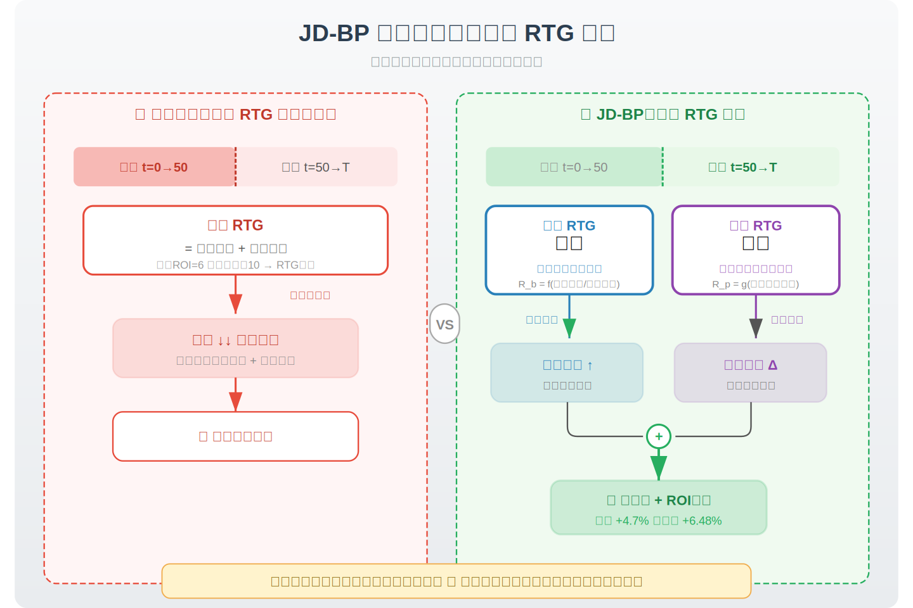
*图示：RTG是Decision Transformer用来告诉模型'你还期望获得多少回报'的信号。如果把历史违约信息也放进出价的RTG里，模型就会变得保守。JD-BP把出价的RTG设计成'失忆'的——它只看未来还能挣多少价值、未来成本是否合理，对过去的亏损一无所知。而定价修正的RTG则保留了全局记忆，负责知道还有多少亏损需要补回来。这样出价不被历史拖累，定价修正专门善后。*

#### 技术点 3：双流Transformer与门控交叉注意力
- 技术细节：模型采用双流架构：出价流是一个标准因果Transformer，输入(s-t, R-b-t, a-b-t)序列，输出出价动作；定价流也是一个因果Transformer，但在输出前加入了一个Gate-Selected Cross-Attention（GCA）模块。GCA的工作方式是：先对出价流的全部隐状态施加sigmoid门控，得到门控后的出价上下文；然后将定价流隐状态与门控出价上下文拼接作为Query，定价流隐状态作为Key和Value做交叉注意力；结果加回定价流的embedding后再过定价Transformer最后一层输出定价动作。这保证了因果方向是'先出价后定价'，定价能感知出价策略但出价不受定价干扰。
- 通俗讲解：出价模型和定价模型各自有一条Transformer'流水线'。出价模型先独立做出决策；定价模型在做决策之前，通过一个'门控窗口'去看出价模型在想什么——比如出价是否激进、预算用了多少、竞争位置如何。门控机制让定价模型有选择地关注出价信息中有用的部分。这样定价修正能根据出价结果做出恰当的补偿，但出价本身不会被定价逻辑'污染'。
- 例子：假设出价流在时刻t输出了一个较高的出价（隐状态显示竞争激烈、该用户价值高），GCA门控对这个信号给出较高权重，定价流因此知道这次可能花费较多，于是输出一个较大的负修正值来多退一些钱。反之，如果出价流显示本次竞争不激烈、出价较低，门控权重低，定价流就只做小幅修正或不修正。

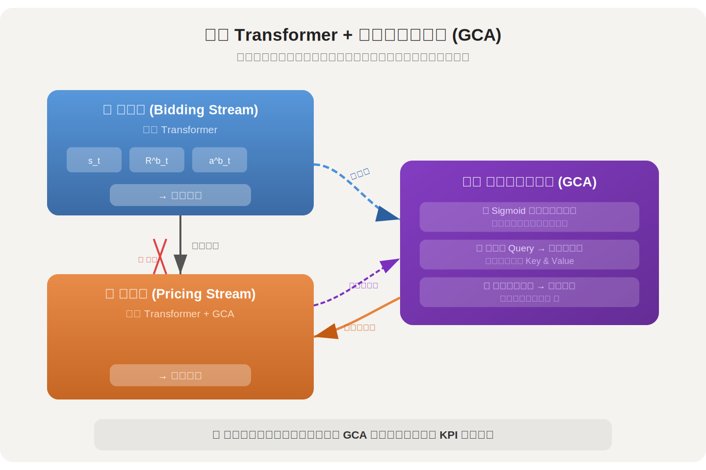
*图示：出价模型和定价模型各自有一条Transformer'流水线'。出价模型先独立做出决策；定价模型在做决策之前，通过一个'门控窗口'去看出价模型在想什么——比如出价是否激进、预算用了多少、竞争位置如何。门控机制让定价模型有选择地关注出价信息中有用的部分。这样定价修正能根据出价结果做出恰当的补偿，但出价本身不会被定价逻辑'污染'。*

#### 技术点 4：基于能量的连续DPO微调
- 技术细节：标准DPO是为离散token分布设计的，但出价/定价是连续标量输出。论文将DPO重新推导为能量函数框架：定义能量E(a, y-target) = \|a - y-target\|（L1距离），在Boltzmann分布下得到隐式偏好概率。策略与参考模型的对数比率被转化为'相对能量增益'：参考模型预测与目标的距离减去当前模型预测与目标的距离。正样本a+是引入定价修正后RTG提升的动作，负样本a-是RTG未提升的动作。最终DPO损失要求模型在正样本上的能量降低幅度显著大于在负样本上的能量降低幅度，从而将连续策略对齐到高回报轨迹区域。
- 通俗讲解：DPO本来是让大语言模型'偏好'好回答、远离差回答的方法，但它依赖离散概率分布。出价和定价是实数值，没有概率分布。论文用能量的概念绕过这个问题：把模型预测值与目标值的距离看作'能量'，距离越小能量越低，说明预测越好。训练时拿一对正负样本——正样本是加了定价修正后效果变好的动作，负样本是效果没变好的动作——要求模型在正样本方向上比参考模型进步更多，在负样本方向上进步更少，从而学会偏好有效的动作组合。
- 例子：在某个状态下，参考模型预测出价a-ref=5.0。正样本目标a+=4.2（引入定价修正后RTG提升），负样本目标a-=6.5（RTG未提升）。当前模型输出a=4.5。正样本能量增益 = \|5.0-4.2\| - \|4.5-4.2\| = 0.8 - 0.3 = 0.5；负样本能量增益 = \|5.0-6.5\| - \|4.5-6.5\| = 1.5 - 2.0 = -0.5。损失函数鼓励正样本增益远大于负样本增益，梯度推动模型向4.2方向靠拢。

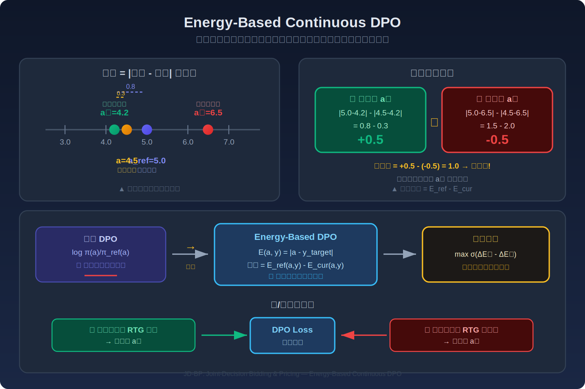
*图示：DPO本来是让大语言模型'偏好'好回答、远离差回答的方法，但它依赖离散概率分布。出价和定价是实数值，没有概率分布。论文用能量的概念绕过这个问题：把模型预测值与目标值的距离看作'能量'，距离越小能量越低，说明预测越好。训练时拿一对正负样本——正样本是加了定价修正后效果变好的动作，负样本是效果没变好的动作——要求模型在正样本方向上比参考模型进步更多，在负样本方向上进步更少，从而学会偏好有效的动作组合。*

#### 技术点 5：即插即用轨迹增强
- 技术细节：初始部署时没有定价修正数据。论文设计了离线轨迹生成算法：从任意已有出价策略（基线模型）产出的轨迹出发，在每个时刻用PID控制器计算定价修正值（目标是让真实CPA逼近目标TCPA），然后基于修正后的状态再调用基线出价策略生成下一步出价。同时，每步还额外生成一条不带定价修正的对照轨迹，用于计算优势值A-t = R-p-t - R-b-t(无修正状态)，即有修正vs无修正的回报差异，作为DPO正负样本的标签依据。
- 通俗讲解：新系统上线前没有'出价+定价修正'的历史数据怎么办？论文的方法是：拿已有的任何出价模型跑一遍，在每步额外加一个PID控制器自动计算应该退多少钱或加多少钱。同时跑一条不加修正的对照线。这样就凑出了大量带定价修正的训练轨迹，而且通过对比有修正和无修正的回报差异，自动标注哪些修正是好的（正样本）、哪些没帮助（负样本），供后续DPO微调使用。
- 例子：假设基线出价模型在第10步产出bid=3.0，PID控制器发现当前CPA偏高于TCPA，计算出y-10=-0.5（退0.5元），更新状态后第11步基线模型产出bid=3.2。同时另一条轨迹不加修正，第11步状态不同，基线产出bid=2.8（因为状态中成本更高，隐含保守调整）。最终比较两条轨迹的总回报，有修正的更高，则标注为正样本。

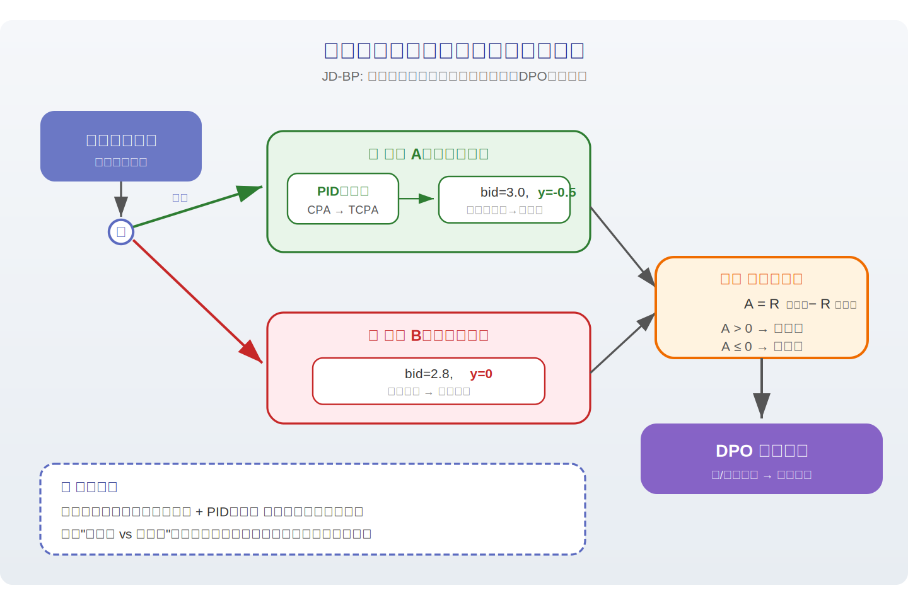
*图示：新系统上线前没有'出价+定价修正'的历史数据怎么办？论文的方法是：拿已有的任何出价模型跑一遍，在每步额外加一个PID控制器自动计算应该退多少钱或加多少钱。同时跑一条不加修正的对照线。这样就凑出了大量带定价修正的训练轨迹，而且通过对比有修正和无修正的回报差异，自动标注哪些修正是好的（正样本）、哪些没帮助（负样本），供后续DPO微调使用。*

- **对广告的启发：** 最适合层级：竞价与结算层；价值：该框架提供了一个全新的思路：在结算阶段引入可学习的定价修正项，将约束补偿从出价中解耦出来。这对所有存在ROI/CPA约束的广告系统都有直接参考价值——无需修改拍卖机制本身，只需在结算环节加一个修正模块。轨迹增强算法使其可以即插即用地部署到任何已有出价系统上。京东线上实验验证了广告收入+4.70%和目标成本达成+6.48%的实际收益。；风险：定价修正本质上是在结算时改变广告主实际支付，可能影响拍卖机制的激励相容性（truthfulness），长期可能改变广告主出价行为。论文的理论分析基于完全信息假设，实际中修正项的分配策略（如均匀分摊）是否在动态竞争环境中仍然最优尚不确定。此外，线上部署需要平台侧有权调整结算价格，并非所有广告系统都具备这一能力。

### 2. Tencent Advertising Algorithm Challenge 2025: All-Modality Generative Recommendation
- **背景：** 生成式推荐（Generative Recommendation）正在从判别式范式（对固定候选集打分）转向自回归生成范式（直接生成用户下一个可能交互的物品），但目前缺乏大规模、包含完整多模态信息（协同ID+文本+视觉）且面向广告场景（含点击和转化信号）的公开基准数据集。本文发布了Tencent GR-1M和Tencent GR-10M两个数据集，来源于真实脱敏的腾讯广告日志，包含百万到千万用户的行为序列，每条交互附带稀疏ID、类目属性、行为类型（曝光/点击/转化）以及多个预训练模型提取的文本和视觉embedding，并以此为基础举办了全球竞赛，吸引8440名参赛者，冠军奖金200万元，具有很强的产业标杆意义。
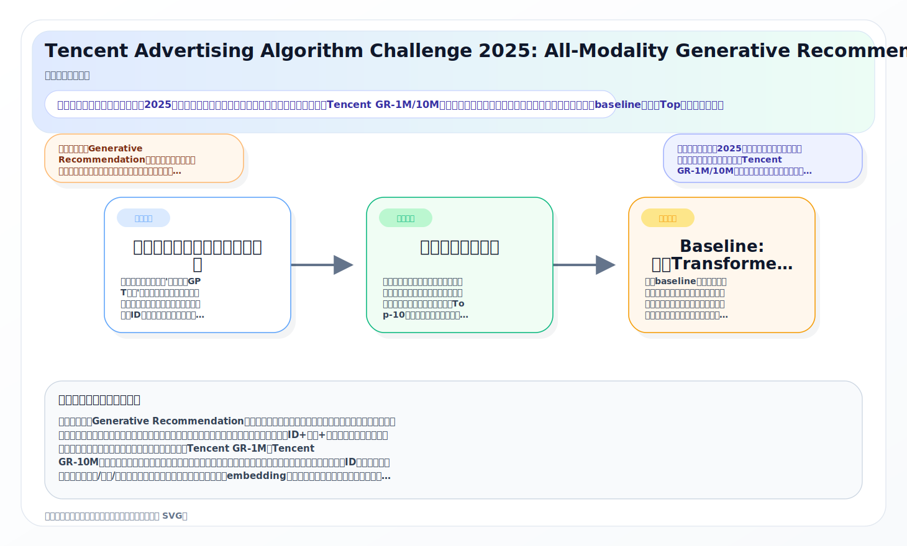
*图示：候选主图不可靠，已回退为论文核心机制总览 SVG。*

**核心技术点：**

#### 技术点 1：全模态序列生成式推荐任务定义
- 技术细节：每个用户的输入序列由一个用户画像token和最多100个物品交互token组成。用户token包含年龄、性别等画像字段；物品token包含稀疏类目属性（广告ID、广告主、品类等）、行为类型（曝光/点击/转化）和最多6个预训练多模态embedding（来自BERT微调、Conan、GTE-Qwen2-7B、HunYuan多模态微调、QQMM-embed、UniME-LLaVA等模型，维度从32到4096不等）。任务目标是给定用户历史序列前缀，从66万（1M赛道）或363万（10M赛道）候选广告池中，生成用户最可能点击或转化的下一个广告。
- 通俗讲解：可以把它想象成一个'广告版的GPT补全'：输入是用户过去看过、点过、转化过的广告序列，每个广告不仅有ID还有图片和文案的向量表示，模型要像续写句子一样预测用户接下来最想点击或购买的那个广告。与传统推荐不同，这里不是给定候选打分，而是先生成一个用户兴趣向量，再通过近邻检索从几百万候选中找出最匹配的广告。
- 例子：例如一个用户序列有80个交互token，其中75个是曝光、4个是点击、1个是转化。每个token的输入包括广告ID的embedding、品类embedding、行为类型编码，以及由Qwen2-7B和LLaVA提取的文本/图片向量。模型读完这80个token后，在最后一个位置输出一个用户向量，再用Faiss在363万候选广告的向量索引中做ANN检索，返回Top-10广告作为推荐结果。

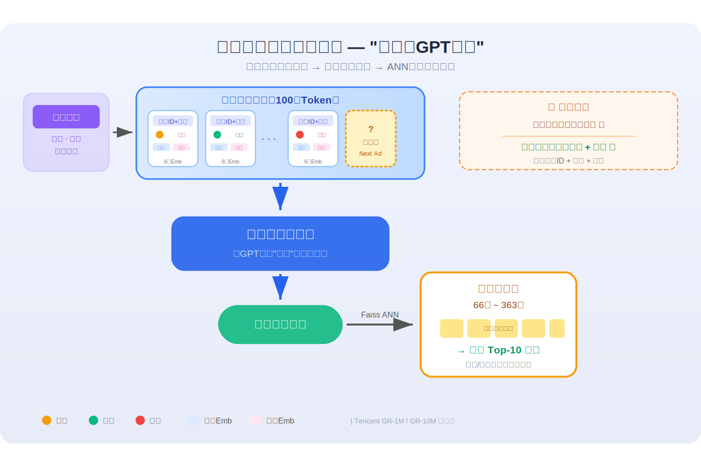
*图示：可以把它想象成一个'广告版的GPT补全'：输入是用户过去看过、点过、转化过的广告序列，每个广告不仅有ID还有图片和文案的向量表示，模型要像续写句子一样预测用户接下来最想点击或购买的那个广告。与传统推荐不同，这里不是给定候选打分，而是先生成一个用户兴趣向量，再通过近邻检索从几百万候选中找出最匹配的广告。*

#### 技术点 2：转化加权评估协议
- 技术细节：初赛使用标准Hit Rate@10和NDCG@10，排行榜分数为0.31乘Hit Rate@10加0.69乘NDCG@10（系数经内部基线校准使两项贡献均衡）。决赛引入行为类型加权：曝光权重0、点击权重1、转化权重2.5。加权Hit Rate和加权NDCG分别按每个用户的Top-K预测中命中项的权重之和除以该用户所有正样本权重之和来计算。这意味着正确预测一个转化广告的得分是正确预测一个点击广告的2.5倍。
- 通俗讲解：广告场景中转化（如下单、付费）的价值远高于点击，所以评估指标给转化事件更高的权重。如果模型在Top-10中命中了一个转化广告，得2.5分；命中一个点击广告只得1分。这迫使模型不能只优化点击率预测，还必须学会识别高转化意图。
- 例子：假设某用户的真实标签包含1个转化广告和1个点击广告，权重分别为2.5和1，总权重3.5。如果模型Top-10命中了转化广告但没命中点击广告，加权Hit Rate为2.5/3.5约0.71；如果只命中了点击广告，加权Hit Rate为1/3.5约0.29。可见命中转化项的收益远大于命中点击项。

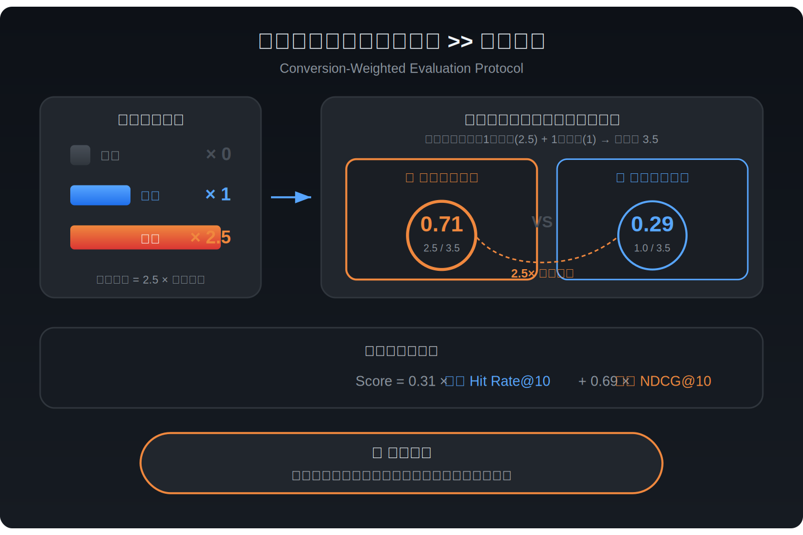
*图示：广告场景中转化（如下单、付费）的价值远高于点击，所以评估指标给转化事件更高的权重。如果模型在Top-10中命中了一个转化广告，得2.5分；命中一个点击广告只得1分。这迫使模型不能只优化点击率预测，还必须学会识别高转化意图。*

#### 技术点 3：Baseline: 因果Transformer加InfoNCE
- 技术细节：Baseline采用单层因果Transformer，隐藏维度32，单头注意力。每个token的稀疏特征经各自embedding表查表后拼接，再与多模态连续向量一起通过MLP投射到统一维度空间。序列前置用户token并加可学习位置编码，经因果mask的Transformer编码后，取最后位置的隐状态作为用户向量。训练目标是InfoNCE对比损失：正样本为下一个曝光对应的广告，负样本从全局候选池均匀采样。决赛baseline在损失中增加行为类型权重，对转化样本赋予更高的loss权重。推理时用Faiss对候选广告embedding建ANN索引，用用户向量做Top-K检索。
- 通俗讲解：这个baseline本质上是把用户历史编码成一个向量，然后和所有候选广告的向量做内积排序。训练时用对比学习让正确的下一个广告的得分高于随机负样本。模型非常轻量（单层、32维），目的是给参赛者提供一个容易跑通的起点。
- 例子：一个用户有50个历史交互token，每个token先查各字段embedding表得到若干小向量，拼上多模态embedding，过MLP压缩到32维。50个32维向量加上1个用户画像向量送入单层因果Transformer，最后位置输出一个32维用户向量。训练时该向量与正样本广告向量做内积得正分数，与1个随机负样本广告向量做内积得负分数，用InfoNCE损失拉大正负差距。推理时对66万候选广告各算一个32维向量，建Faiss索引，用户向量查询返回Top-10。

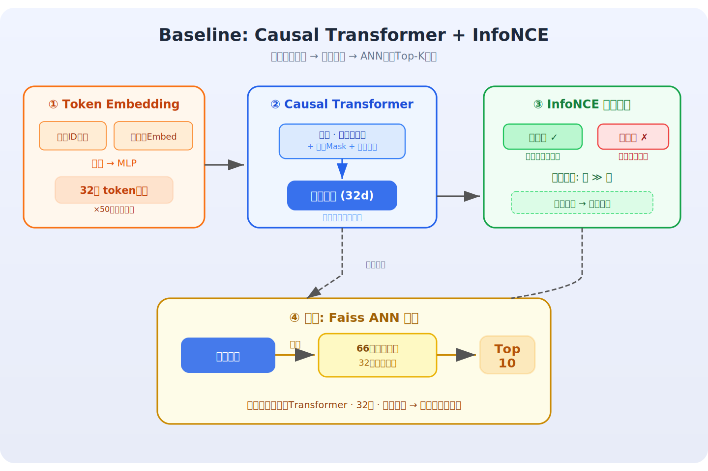
*图示：这个baseline本质上是把用户历史编码成一个向量，然后和所有候选广告的向量做内积排序。训练时用对比学习让正确的下一个广告的得分高于随机负样本。模型非常轻量（单层、32维），目的是给参赛者提供一个容易跑通的起点。*

#### 技术点 4：冠军方案：动作条件生成与语义ID
- 技术细节：冠军队基于稠密Qwen骨干构建多模态自回归模型。核心创新包括：（1）逐位置行为条件机制，用门控融合、FiLM层和注意力偏置根据行为类型（曝光/点击/转化）调制token表示，使模型能区分不同行为语义；（2）多层次时间特征，包括绝对时间戳、相对间隔、请求/会话/跨天会话结构，并用多频率傅里叶特征编码周期性；（3）对多模态embedding做残差量化K-Means（RQ-KMeans）生成语义ID，配合random-k策略正则化训练；（4）使用Muon加AdamW混合优化器，配合静态shape的GPU友好InfoNCE损失和大规模负样本库训练。推理时端到端生成用户向量后做ANN检索。
- 通俗讲解：冠军的关键洞察是：同一个广告被曝光、被点击、被转化，代表的用户意图完全不同，不能用同一种方式编码。FiLM层的做法是根据行为类型生成一组缩放和偏移参数，对token向量做仿射变换——相当于给'点击'和'曝光'各装一副不同的'滤镜'来处理同一个广告向量。语义ID则是把高维多模态向量用层级聚类压缩成离散编码，让模型可以像生成文字一样生成广告标识。
- 例子：假设用户序列中第30个位置是广告A被曝光（行为类型=0），第45个位置是广告A被点击（行为类型=1）。在逐位置行为条件机制下，位置30的token表示会被FiLM层用曝光对应的缩放/偏移参数调制，而位置45会被点击对应的参数调制，虽然广告特征相同但产生不同的隐状态，模型因此能学到'点击广告A'比'看过广告A'代表更强的兴趣信号。同时广告A的多模态embedding经过RQ-KMeans被映射为例如(簇12, 子簇7, 子子簇3)这样的三级语义ID，供模型在生成阶段使用。

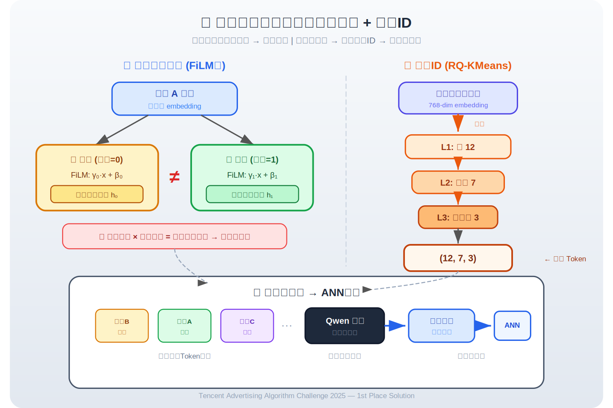
*图示：冠军的关键洞察是：同一个广告被曝光、被点击、被转化，代表的用户意图完全不同，不能用同一种方式编码。FiLM层的做法是根据行为类型生成一组缩放和偏移参数，对token向量做仿射变换——相当于给'点击'和'曝光'各装一副不同的'滤镜'来处理同一个广告向量。语义ID则是把高维多模态向量用层级聚类压缩成离散编码，让模型可以像生成文字一样生成广告标识。*

#### 技术点 5：亚军与季军的差异化设计
- 技术细节：亚军采用编码器-解码器架构：编码器用多个门控MLP学习用户/物品/序列表示，并在用户-物品交互图上运行图神经网络丰富上下文；解码器是改进的SASRec风格Transformer（2048维、8层、8头），输出代表未来兴趣的向量做ANN检索。训练分两阶段：先在曝光交互上预训练，再在点击和转化事件上微调。季军采用纯decoder-only Transformer，核心贡献是系统研究了生成式推荐的scaling law：将对比损失中每batch负样本数量扩展到38万，并探索了模型深度/宽度和物品ID embedding维度的扩展效果，结论是性能主要由规模而非精巧设计驱动。两者都采用PinRec的下一行为类型条件生成策略。
- 通俗讲解：亚军的特色是用图网络把用户的社交或共现关系编码进去，相当于在序列建模之外额外'问了一圈邻居的意见'。季军则走极简路线，不做复杂架构创新，而是把负样本数量推到38万这种极端规模，验证了'大力出奇迹'在生成式推荐中同样成立——负样本越多，模型越能区分正确的下一个广告和干扰项。
- 例子：季军的scaling实验：将负样本从1K扩展到10K、100K、380K，观察到NDCG@10持续显著提升。这意味着在363万候选池中，每个batch看到380K个负样本（约10%候选池），模型对候选空间的覆盖率大幅提高，类似于语言模型增大词表采样覆盖率带来的效果。

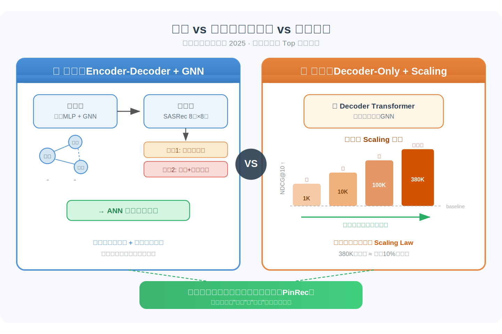
*图示：亚军的特色是用图网络把用户的社交或共现关系编码进去，相当于在序列建模之外额外'问了一圈邻居的意见'。季军则走极简路线，不做复杂架构创新，而是把负样本数量推到38万这种极端规模，验证了'大力出奇迹'在生成式推荐中同样成立——负样本越多，模型越能区分正确的下一个广告和干扰项。*

#### 技术点 6：技术创新奖：统一生成检索与排序
- 技术细节：该方案用单个decoder-only模型同时生成下一个物品的语义ID序列和预测用户对该物品的行为类型，训练目标将语义ID生成损失和行为预测损失统一。语义ID构建引入两个创新：（1）用单独的decoder-only Transformer加InfoNCE损失提取物品的协同embedding；（2）对二级语义码引入碰撞消解机制，当多个物品映射到同一编码时自动搜索次近聚类中心。模型架构集成FlashAttention、SwiGLU、RMSNorm、RoPE位置编码和DeepSeek-V3风格的混合专家层（MoE），并利用多时间窗口的物品热度统计作为额外特征。
- 通俗讲解：传统流程是先用一个模型检索候选再用另一个模型精排，这个方案尝试用一个模型同时完成两件事：生成'你接下来会看哪个广告'的ID编码，同时预测'你会点击还是转化'。碰撞消解解决的是多个广告被映射到同一个语义码的问题——如果广告A和B都被聚类到编码(5,3)，系统会自动把B重分配到(5,4)这个次近的码，保证编码的唯一性。MoE结构则让模型在不等比例增加计算量的情况下扩大参数量，不同专家可以专注处理不同类型的广告。
- 例子：模型输入用户序列后，解码器逐步生成三个token：第一个token是一级语义码（如编码23），第二个是二级语义码（如编码7，经碰撞消解确保唯一），第三个是行为预测token（输出点击概率0.8、转化概率0.3）。(23,7)对应的物品即为推荐结果，行为预测分数可用于在多个候选之间做最终排序，实现检索和排序的统一。

*图示：传统流程是先用一个模型检索候选再用另一个模型精排，这个方案尝试用一个模型同时完成两件事：生成'你接下来会看哪个广告'的ID编码，同时预测'你会点击还是转化'。碰撞消解解决的是多个广告被映射到同一个语义码的问题——如果广告A和B都被聚类到编码(5,3)，系统会自动把B重分配到(5,4)这个次近的码，保证编码的唯一性。MoE结构则让模型在不等比例增加计算量的情况下扩大参数量，不同专家可以专注处理不同类型的广告。*

- **对广告的启发：** 最适合层级：全链路可迁移：数据集构建范式、生成式推荐baseline、行为条件建模、转化加权评估；价值：这是目前最大规模的公开广告场景生成式推荐基准，直接提供了从数据构建、多模态特征提取、序列建模到ANN检索的完整工业pipeline参考。行为类型条件生成（区分曝光/点击/转化对同一广告的不同编码）和转化加权评估是广告系统可直接落地的设计。冠军方案中的FiLM行为调制、RQ-KMeans语义ID、大规模负采样等技术均可迁移至广告召回和粗排模块。数据集本身可作为广告推荐算法的标准benchmark长期使用。；风险：数据集经过脱敏处理，不含原始素材，多模态embedding的质量依赖于腾讯内部预训练模型，外部复现可能存在embedding分布差异。竞赛禁止模型集成，但工业场景通常需要多路召回融合，竞赛结论可能高估单模型能力。生成式推荐在在线服务中的延迟和索引更新成本尚未在本文讨论，实际部署需额外评估。

## 六、候选但未完成深读的论文

当前重点论文都已完成可用分析。
