# 2026-04-09 论文日报

## 一、今日趋势与创新观察

### 1. 趋势概况

- 今日 407 篇论文中，LLM 与语言理解方向占比最高（约 94 篇），涵盖多模态推理检索、知识图谱增强推荐、schema 引导信息抽取等多样化场景，显示 LLM 作为基础能力正在向各类下游任务全面渗透。
- Agent 与多智能体方向热度显著（41 篇），从 Web 搜索 Agent、多步协作框架到 Multi-LoRA 服务架构，研究重心正从单纯的 Agent 能力提升转向工程化部署和多 Agent 协作编排。
- 表示学习与检索排序领域（28 篇）出现多篇多模态检索工作（HIVE、BRIDGE、MARVEL），强调用强化学习或推理链来对齐查询与文档的语义表示，多模态 RAG 成为检索方向的新焦点。
- 直接涉及广告的论文数量有限（约 11 篇含广告信号），但出现了一篇质量极高的 LLM 生成式广告优化论文，将激励机制设计与多保真度优化相结合，代表广告创意生成与机制设计的交叉前沿。

### 2. 推荐系统 / 排序相关创新点

- 《Incentive-Aware Multi-Fidelity Optimization for Generative Advertising in Large Language Models》：主题：LLM 与语言理解；候选属性：直接广告论文
- 《Robustness Risk of Conversational Retrieval: Identifying and Mitigating Noise Sensitivity in Qwen3-Embedding Model》：亮点信号：embedding, robust；主题：表示学习与检索排序；来自全量抓取的补充观察
- 《Appear2Meaning: A Cross-Cultural Benchmark for Structured Cultural Metadata Inference from Images》：公司线索：Meta；候选属性：大公司优先论文

### 3. 全局创新点

- ForkKV 提出基于 Copy-on-Write 机制的 KV Cache 解耦架构，让多个 LoRA Agent 共享同一份基座 KV Cache、仅在差异处分叉，大幅降低多 Agent 并发服务时的显存开销，是 LLM 服务化的实用系统创新。
- Loss Trajectory Alignment 提出用训练过程中 loss 曲线的形态（而非单点 loss 值）来指导动态剪枝，让剪枝决策更鲁棒、不容易被个别 batch 的噪声误导，思路可迁移到推荐模型的稀疏化与蒸馏场景。
- Conversational Retrieval 的鲁棒性研究系统性揭示了 Qwen3-Embedding 等最新 embedding 模型对对话噪声（改写、省略、口语化）的敏感性，并提出缓解方案，对所有依赖 embedding 做召回的工业系统都有参考意义。

## 二、今日一个 AI 知识点

### Off-Policy Evaluation 为什么能离线估计新策略

Off-Policy Evaluation 的难点在于：你手里只有旧策略下产生的日志，但你想知道一个新策略如果当时上线，效果会怎样。它本质上是在做‘带偏差采样下的反事实估计’，核心不是直接平均，而是先校正旧策略和新策略看到样本的概率差。 广告排序、预算控制和出价优化都不可能天天线上试错，所以很多工业系统都依赖离线评估。先理解 OPE，才能看懂为什么一篇论文总在强调 propensity、reweighting 或 doubly robust。 可以顺着一次具体运行过程来理解：顺着一次计算过程看：日志里某次曝光原本是旧策略把广告A推上去的，旧策略给A的概率是0.8，而新策略只会在类似场景下以0.2的概率展示A；那这条样本在评估新策略时就不能按原权重直接算，而要乘一个和两者概率比相关的修正系数。把很多样本都这样校正后，才更接近‘如果新策略当时上线会发生什么’。

## 三、今日论文总览

### 1. Incentive-Aware Multi-Fidelity Optimization for Generative Advertising in Large Language Models
- 挑选理由：标题直接涉及生成式广告（Generative Advertising），结合激励感知优化和LLM，是核心计算广告论文

### 2. NestPipe: Large-Scale Recommendation Training on 1,500+ Accelerators via Nested Pipelining
- 挑选理由：大规模推荐模型训练系统，1500+加速器上的嵌套流水线训练，与工业推荐/广告排序模型的大规模训练高度同构，属于工业推荐系统重要基础设施论文

## 四、补充关注

今天没有需要额外提示的补充关注论文。

## 五、重点论文精读

### 1. Incentive-Aware Multi-Fidelity Optimization for Generative Advertising in Large Language Models
- **背景：** 随着LLM被用于对话推荐等场景，多个广告主竞争影响同一条LLM生成内容，平台需要选择一个'影响力配置向量'（每个广告主的推广强度）来最大化社会福利（广告主价值+用户满意度）。但存在三大难题：广告主会策略性地谎报自己的价值以操纵结果；评估每个配置需要大量LLM生成开销，穷举不可行；且过度推广会导致'语义崩溃'——生成内容变得像推销话术甚至出现品牌融合乱象，反而损害用户体验。现有工作要么不考虑激励兼容，要么没有解决LLM评估的高成本问题，这篇论文首次将VCG拍卖机制与多保真度优化统一起来处理生成式广告场景。
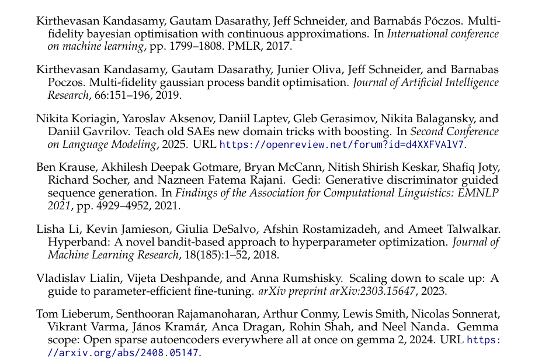
*图示：当前 provider 未启用视觉评审，回退到启发式最高分候选。*

**核心技术点：**

#### 技术点 1：多保真度搜索框架
- 技术细节：论文将广告影响力配置建模为多保真度多臂赌博机问题。每个配置是一个臂，其价值是该配置下LLM完整响应的期望社会福利。关键设计：定义F个保真度等级，低保真度只生成短前缀（如前30个token），高保真度生成完整回复（如240个token），成本递增。利用全期望律，任何前缀处的福利评估值都是完整回复福利的无偏估计，只是方差更大。这构造出成本-方差的权衡：先用便宜的低保真度信号筛选大量候选配置，再对有希望的配置投入高保真度精确评估。
- 通俗讲解：想象你要从25种广告配置中选最优的，但每次完整评估要花很多token成本。多保真度的思路是：先让LLM只生成30个token的开头，用专门训练的评估代理快速打分，淘汰明显差的配置；然后对剩余的生成60个token再评估，继续淘汰；最终只对少数候选做完整240个token的精确评估。因为前缀的评估是完整回复评估的无偏估计，所以这种逐步筛选在统计上是合理的。
- 例子：假设有25个(sA,sB)配置，总预算16000个token。第一轮以30token/次成本对25个配置各评估几次，花费约3000token，淘汰掉12个明显差的；第二轮以60token/次对剩余13个再评估，花费约5000token，淘汰到6个；第三轮以120token/次评估6个，花费约4000token，留3个；最后以240token/次精确评估3个候选，选出最优配置。整个过程在预算内完成了从粗到精的搜索。

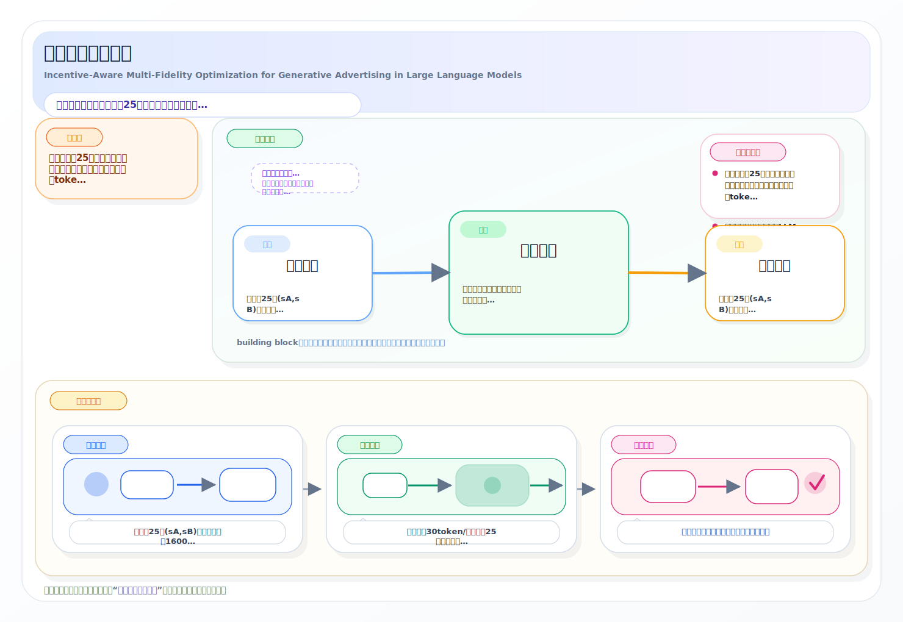
*图示：想象你要从25种广告配置中选最优的，但每次完整评估要花很多token成本。多保真度的思路是：先让LLM只生成30个token的开头，用专门训练的评估代理快速打分，淘汰明显差的配置；然后对剩余的生成60个token再评估，继续淘汰；最终只对少数候选做完整240个token的精确评估。因为前缀的评估是完整回复评估的无偏估计，所以这种逐步筛选在统计上是合理的。*

#### 技术点 2：VCG激励兼容层
- 技术细节：为防止广告主谎报价值，论文在多保真度优化之上叠加VCG支付规则。设最优配置为s\*，广告主i的支付等于'排除i后的最大社会福利估计'减去'在s\*下除i外所有人的福利之和'。这使得每个广告主的净效用等于'全局社会福利减去一个与自身报价无关的常数'，因此真实报价是占优策略。由于优化只能找到近似解（误差为epsilon），论文证明了近似策略防护性：任何广告主通过谎报获得的额外效用最多为epsilon，同时保证近似个体理性（参与者净效用不低于负epsilon）和近似无补贴（平台赤字最多nε）。
- 通俗讲解：VCG的核心逻辑是：你的支付等于你加入后对别人造成的'机会成本'。具体来说，平台先算出有你参与时的最优配置s\*下大家的总福利，再算一个假设你完全退出（强度设为0）时的最优总福利。两者之差就是你的支付。这样设计后，你报高了对自己没好处（因为支付也跟着涨），报低了可能导致你的最优配置被替换，唯一最优策略就是如实报告。
- 例子：食品城场景：泰餐厅和川菜馆竞争。平台找到最优配置s\*=(3,1)，全局福利190。现在计算泰餐厅的支付：假设泰餐厅退出（强度设为0），平台重新优化得到最优福利185，而在s\*下川菜馆+用户的福利合计为170。那么泰餐厅支付185-170=15。泰餐厅的净效用就是190-185=5，正好等于它的加入带来的社会福利增量，无法通过谎报获得更多。

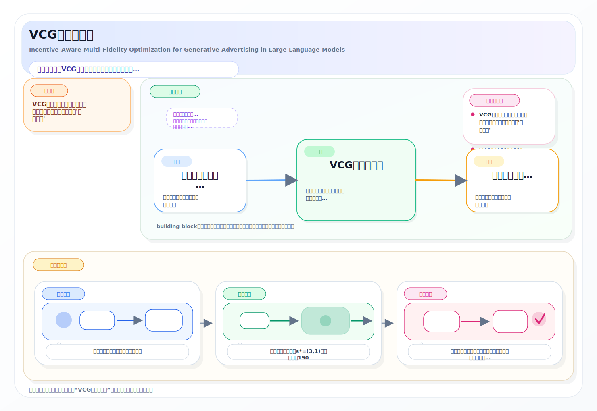
*图示：VCG的核心逻辑是：你的支付等于你加入后对别人造成的'机会成本'。具体来说，平台先算出有你参与时的最优配置s\*下大家的总福利，再算一个假设你完全退出（强度设为0）时的最优总福利。两者之差就是你的支付。这样设计后，你报高了对自己没好处（因为支付也跟着涨），报低了可能导致你的最优配置被替换，唯一最优策略就是如实报告。*

#### 技术点 3：主动反事实优化ACO
- 技术细节：VCG支付需要为每个广告主i单独求解一个'排除i后的最优配置'反事实优化问题，计算成本是主优化的N倍。论文提出ACO来解决这个瓶颈：对于MFBO版本，直接复用主优化阶段训练好的高斯过程全局代理模型作为先验，在约束si=0的子空间上做后验推断，几乎不需要额外采样即可得到反事实最优值，VCG计算开销降低超过99%。对于ASH版本，复用主锦标赛中对相关臂的采样历史作为热启动，但由于信息是局部的，效果不如MFBO版本显著。
- 通俗讲解：VCG最大的实际障碍是计算量：有N个广告主就要额外做N次优化。ACO的核心思想是'不要从头算'。在MFBO方案中，主优化已经训练了一个高斯过程模型，该模型学到了整个配置空间的福利地形。计算反事实时只需要在这个已有模型上查询'某个广告主强度为0'的子空间的最大值，模型已经掌握了足够信息，几乎零成本就能给出答案。
- 例子：主优化阶段MFBO花了50次采样训练了GP模型，覆盖了25个配置在不同保真度下的福利估计。现在要计算泰餐厅退出后的反事实最优值，只需在GP模型上查询所有sA=0的配置（即(0,0),(0,1),...,(0,4)这5个点）在最高保真度下的后验均值，取最大值即可，不需要任何新的LLM生成调用。

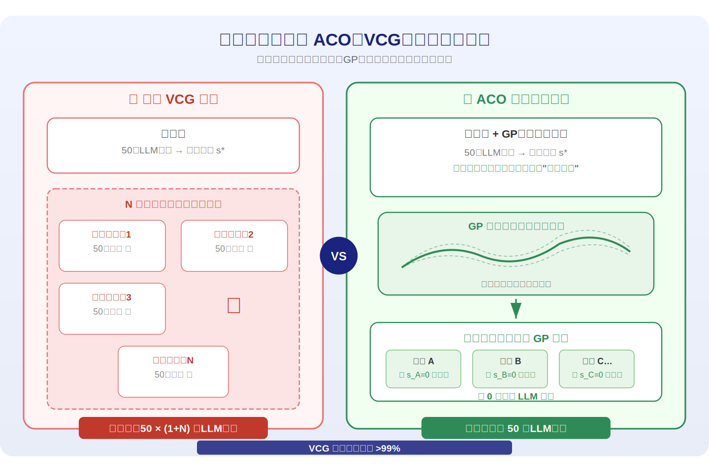
*图示：VCG最大的实际障碍是计算量：有N个广告主就要额外做N次优化。ACO的核心思想是'不要从头算'。在MFBO方案中，主优化已经训练了一个高斯过程模型，该模型学到了整个配置空间的福利地形。计算反事实时只需要在这个已有模型上查询'某个广告主强度为0'的子空间的最大值，模型已经掌握了足够信息，几乎零成本就能给出答案。*

#### 技术点 4：两种实例化的互补性
- 技术细节：论文提供了淘汰制和模型制两族算法。淘汰制（IAMFM-ASH）在每个保真度阶段内用UCB自适应采样替代均匀分配，然后按均值淘汰末位臂。模型制（IAMFM-MFBO）用高斯过程建立配置-保真度联合空间的全局代理模型，用成本感知的UCB采集函数在每步选择最有信息价值的(配置,保真度)对进行评估。实验表明：预算小于等于16k token时ASH与MFBO表现相当（p=0.38），因为此时数据稀缺、粗粒度淘汰足够；预算大于等于32k token时MFBO统计显著优于ASH（p=0.036），因为GP代理的全局建模能力此时发挥出精确定位最优的优势。MFBO的方差也最低（标准差5.0-5.5 vs SH的10.1-11.7）。
- 通俗讲解：淘汰制像锦标赛选拔：每轮用更高精度的测试淘汰一半选手，简单高效但可能因一次噪声失误永久淘汰最优候选。模型制像画一张全局地形图：虽然前期投入大，但积累足够数据后能精确找到峰值。预算紧时锦标赛够用，预算充裕时地形图更准。
- 例子：在16k token预算下，ASH用4轮淘汰从25个配置中选出最优，均值福利187.3；MFBO同样预算下福利186.3，差异不显著。但在128k token预算下，MFBO利用充分数据把GP模型训练得很精确，福利达到190.7，而ASH仍停留在187.4，差距拉开。

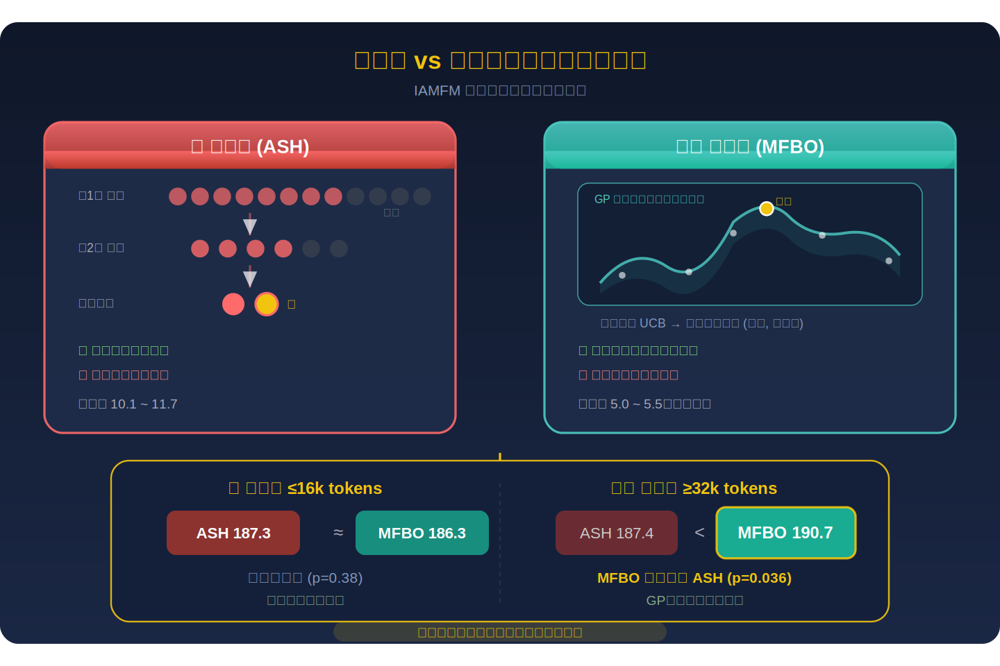
*图示：淘汰制像锦标赛选拔：每轮用更高精度的测试淘汰一半选手，简单高效但可能因一次噪声失误永久淘汰最优候选。模型制像画一张全局地形图：虽然前期投入大，但积累足够数据后能精确找到峰值。预算紧时锦标赛够用，预算充裕时地形图更准。*

#### 技术点 5：语义过饱和与福利权衡
- 技术细节：论文明确建模了广告强度与社会福利的非单调关系：每个广告主的强度si从0到k，si=0表示完全排除，si=k触发高度促销语言。过高的强度不仅降低用户满意度，还可能导致LLM生成'语义崩溃'——在文本场景中产生不连贯的推销话术，在图像场景中品牌标志融合成不可辨识的混合体。因此最优配置往往不在边界上而在中间某处，这使得精确搜索成为必要。
- 通俗讲解：广告太弱没有商业价值，太强会让用户反感甚至让AI产出变质。比如同时把两个品牌的推广强度都拉满，LLM可能把两个品牌名混在一起生成胡话，图像生成模型可能把两个logo融合成一个怪异的混合标志。最优点藏在中间地带，需要仔细搜索。
- 例子：食品城场景中，用户问'我想吃辣的'。泰餐厅低强度时回复自然提及泰式和川菜两个选项；高强度时回复变成'绝对要选Thai Spice Garden，他们的咖喱是你的命中注定——错过你绝对后悔'，用户感到被强推而不满。图像广告中两品牌同时拉满，Alpha运动夹克和Beta奶茶的logo被融合成一个无意义的AB混合logo，结构彻底崩溃。

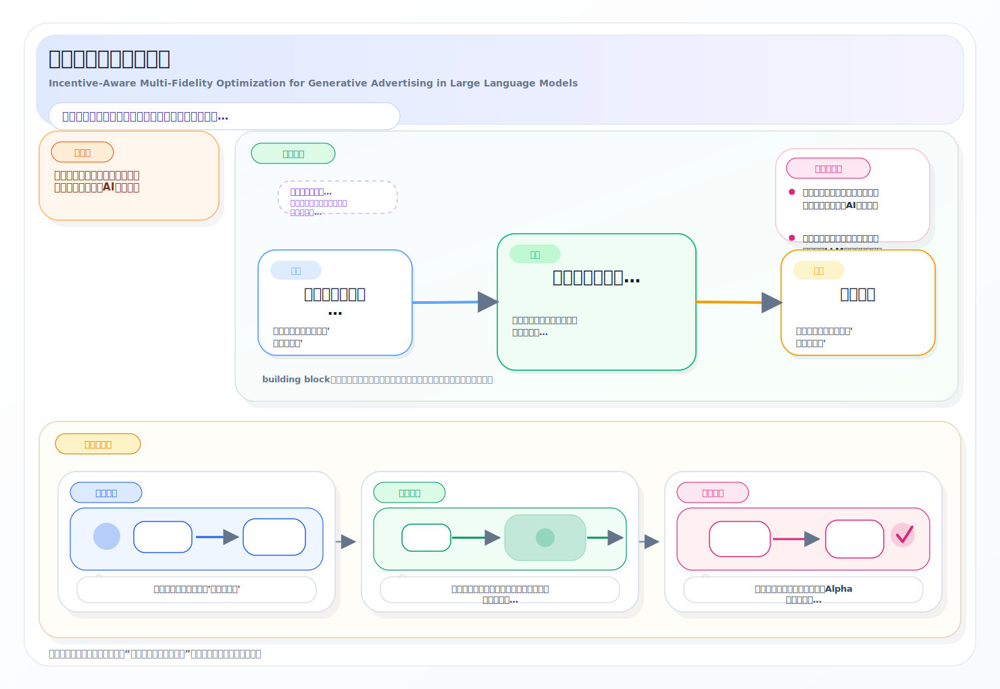
*图示：广告太弱没有商业价值，太强会让用户反感甚至让AI产出变质。比如同时把两个品牌的推广强度都拉满，LLM可能把两个品牌名混在一起生成胡话，图像生成模型可能把两个logo融合成一个怪异的混合标志。最优点藏在中间地带，需要仔细搜索。*

- **对广告的启发：** 最适合层级：广告机制设计层与广告投放优化层；价值：该框架为LLM时代的生成式广告提供了完整的机制设计范式：多保真度优化可直接迁移到任何需要在大量广告配置中搜索最优组合的场景（如信息流广告的创意组合优化、搜索广告的多广告主排列优化），VCG激励层确保广告主如实报价，ACO使VCG在实际系统中计算可行。特别是'广告强度过饱和导致体验崩溃'的建模，对当前LLM驱动的对话式推荐、AI购物助手等新兴广告形态具有直接指导意义。；风险：实验仅在2个广告主、25个离散配置的小规模模拟环境中验证，广告主数量增多和连续配置空间下的可扩展性尚不明确；VCG机制在近似条件下的激励兼容性依赖于优化误差epsilon的大小，实际系统中epsilon可能难以控制；LLM评估代理（fine-tuned proxy agent）的偏差可能系统性地影响福利估计和支付计算的准确性。

### 2. NestPipe: Large-Scale Recommendation Training on 1,500+ Accelerators via Nested Pipelining
- **背景：** 现代推荐/广告模型的embedding参数已达万亿级别，需要上千张加速卡进行分布式训练。当集群规模扩展到O(1k)时，训练瓶颈从计算和内存转向数据搬运——尤其是embedding的lookup（预处理、key路由、检索、主机到设备传输）和All2All通信延迟超线性增长。现有方案要么只优化其中一个瓶颈，要么通过异步训练牺牲参数一致性来换取吞吐量，在生产环境中不可接受。NestPipe提出嵌套流水线框架，同时解决两个瓶颈且保持严格同步训练语义，在1536卡上实现3.06倍加速和94%的扩展效率。
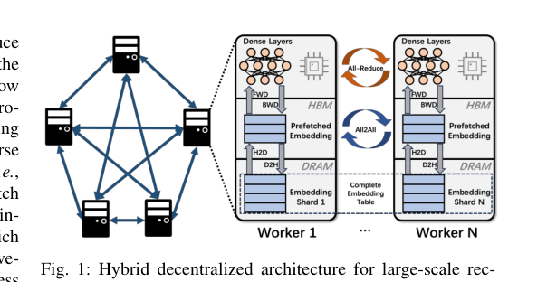
*图示：当前 provider 未启用视觉评审，回退到启发式最高分候选。*

**核心技术点：**

#### 技术点 1：双缓冲流水线消除lookup延迟
- 技术细节：DBP策略将embedding lookup工作流拆分为五个阶段：数据预取到锁页内存、数据H2D传输、key路由（先去重再按分片规则分桶后All2All发送轻量key）、embedding检索（目标worker从DRAM取向量再H2D到HBM）、前向/反向计算。五个阶段分别占用CPU、主机内存总线、网络、存储IO、加速器等不同硬件资源，因此可跨连续batch并行执行。核心难点是流水线导致的embedding过期问题：batch B+1预取的embedding可能在batch B更新前就已加载。DBP通过维护两个HBM缓冲区（active buffer服务当前batch计算，prefetch buffer为下一batch预加载）并在batch B计算完毕后、batch B+1开始前向前，对两个缓冲区的key交集执行device-to-device内存拷贝同步，将active buffer中最新梯度更新传播到prefetch buffer，整个同步开销低于2ms且可被其他阶段重叠隐藏。
- 通俗讲解：想象一条工厂流水线：工人A准备原料、工人B搬运、工人C加工。如果每个产品都等前一个做完才开始，流水线大部分时间在空转。DBP让连续的训练batch像流水线上的不同产品一样错开执行——当前batch在GPU上算，下一个batch同时在CPU上做数据预处理和key路由，再下一个在做数据搬运。关键问题是：下一个batch预取的embedding可能已经被当前batch更新了。DBP的解法是设两块显存缓冲区交替使用，在下一个batch正式开算前，把当前batch刚更新过的那些embedding快速拷贝过去，保证用到的参数永远是最新的。
- 例子：假设batch 4正在GPU上做前向反向计算，同时batch 5的embedding正在从主机内存预取到prefetch buffer。batch 4和batch 5有1000个共同的热门item embedding。batch 4计算完毕后产生梯度并更新了active buffer中这1000个embedding。在batch 5开始前向计算之前，DBP对两个缓冲区取key交集找到这1000个key，然后把active buffer中已更新的值拷贝到prefetch buffer中对应位置。拷贝完成后两个缓冲区角色互换：原prefetch变成新active供batch 5使用，原active变成新prefetch供batch 6预加载。整个同步不到2ms，完全被batch 3的key路由等阶段掩盖。

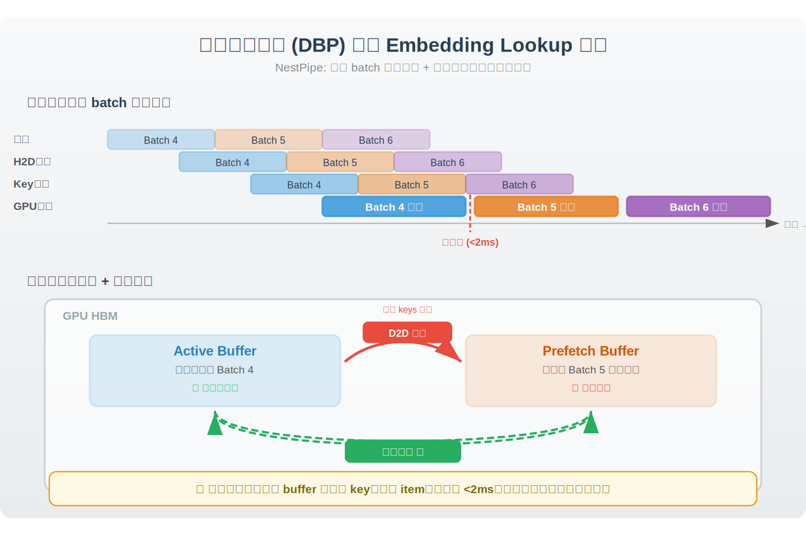
*图示：想象一条工厂流水线：工人A准备原料、工人B搬运、工人C加工。如果每个产品都等前一个做完才开始，流水线大部分时间在空转。DBP让连续的训练batch像流水线上的不同产品一样错开执行——当前batch在GPU上算，下一个batch同时在CPU上做数据预处理和key路由，再下一个在做数据搬运。关键问题是：下一个batch预取的embedding可能已经被当前batch更新了。DBP的解法是设两块显存缓冲区交替使用，在下一个batch正式开算前，把当前batch刚更新过的那些embedding快速拷贝过去，保证用到的参数永远是最新的。*

#### 技术点 2：冻结窗口流水线隐藏All2All通信
- 技术细节：FWP策略基于一个关键观察——参数冻结现象：在micro-batch训练中，单个micro-batch的前向反向只计算梯度而不实际更新embedding参数，梯度要等所有micro-batch算完才一次性应用。这意味着在一个batch内部存在一个天然的'冻结窗口'，期间embedding参数不变。FWP将一个batch拆分为N个micro-batch，启用两条独立的执行流：计算流负责dense前向反向，通信流负责All2All。当micro-batch i的embedding到达本地HBM后计算流立即启动dense计算，同时通信流提前发起micro-batch i+1的All2All。理论上2N次All2All通信中只有首尾两次暴露在关键路径上，暴露比例为1/N。
- 通俗讲解：把一个大batch想象成一本书的N个章节。读每一章时你只做笔记（计算梯度），读完整本书才统一整理笔记修改原文（更新参数）。在读书过程中原文不会变，所以你可以一边读第i章一边让助手去图书馆借第i+1章的参考资料（做All2All通信），不用担心资料过期，因为在整本书读完之前参数是冻结的。这样网络传输几乎完全被计算时间遮盖住了。
- 例子：假设batch分成4个micro-batch。通信流先发起micro-batch 1的All2All，完成后计算流开始算micro-batch 1的dense部分，同时通信流已经在传micro-batch 2的embedding。依次类推，到micro-batch 4时计算流算完micro-batch 3、通信流送完micro-batch 4。整个过程中只有最开头micro-batch 1的通信和最末尾micro-batch 4的梯度回传通信无法被重叠，暴露比例约1/4。在1536卡实验中，原本1185ms的通信只暴露了154ms。

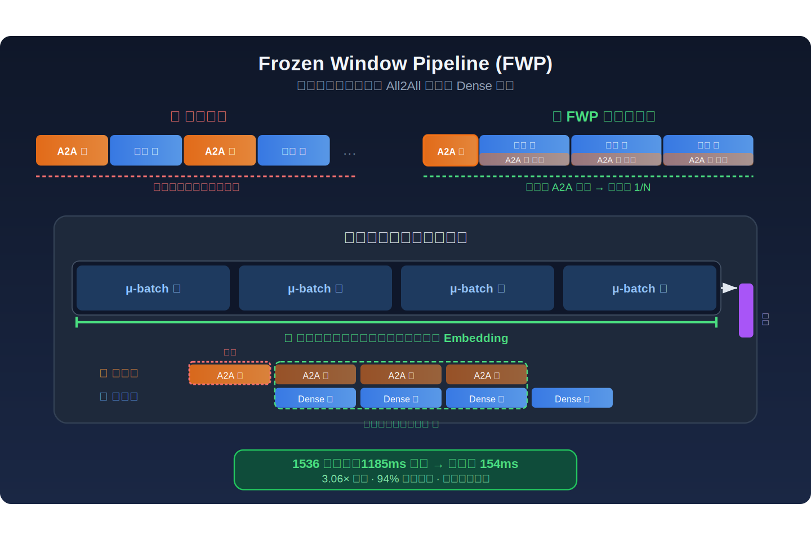
*图示：把一个大batch想象成一本书的N个章节。读每一章时你只做笔记（计算梯度），读完整本书才统一整理笔记修改原文（更新参数）。在读书过程中原文不会变，所以你可以一边读第i章一边让助手去图书馆借第i+1章的参考资料（做All2All通信），不用担心资料过期，因为在整本书读完之前参数是冻结的。这样网络传输几乎完全被计算时间遮盖住了。*

#### 技术点 3：Key中心样本聚类优化去重
- 技术细节：当micro-batch数量N增大时，每个micro-batch内部的key去重效率下降——相同的热门key被分散到不同micro-batch中导致重复传输，2N次All2All的总通信量膨胀。FWP引入轻量级key-centric sample clustering：在数据预处理阶段，将共享更多sparse key的样本聚到同一个micro-batch中，最大化micro-batch内部的key重复率从而提升去重效率。聚类只改变样本在micro-batch间的分配顺序，不改变任何embedding值或最终梯度求和结果，因此不影响模型收敛。聚类操作在CPU上异步执行或离线预计算，被DBP流水线的数据预处理阶段完全掩盖。
- 通俗讲解：如果你把同一个作者的书分散到不同箱子里，每个箱子都要单独去图书馆借一次该作者的参考书，总借书次数就很多。把同一作者的书放到同一个箱子里，每个箱子只借一次就够了。sample clustering就是把访问相似embedding key的样本聚在一起，让每个micro-batch内部的key重叠最大化，去重后实际要传输的embedding数量大幅减少。
- 例子：假设有用户A和用户B都点击了商品X、Y、Z，用户C点击了商品P、Q。朴素切分可能把A分到micro-batch 1、B分到micro-batch 2，导致商品X、Y、Z的embedding在两个micro-batch中各传一次。sample clustering会把A和B聚到同一个micro-batch，去重后X、Y、Z只传一次。实验显示micro-batch size为16时，不做聚类的通信膨胀到1331ms，做了聚类后暴露通信降到27.71ms。

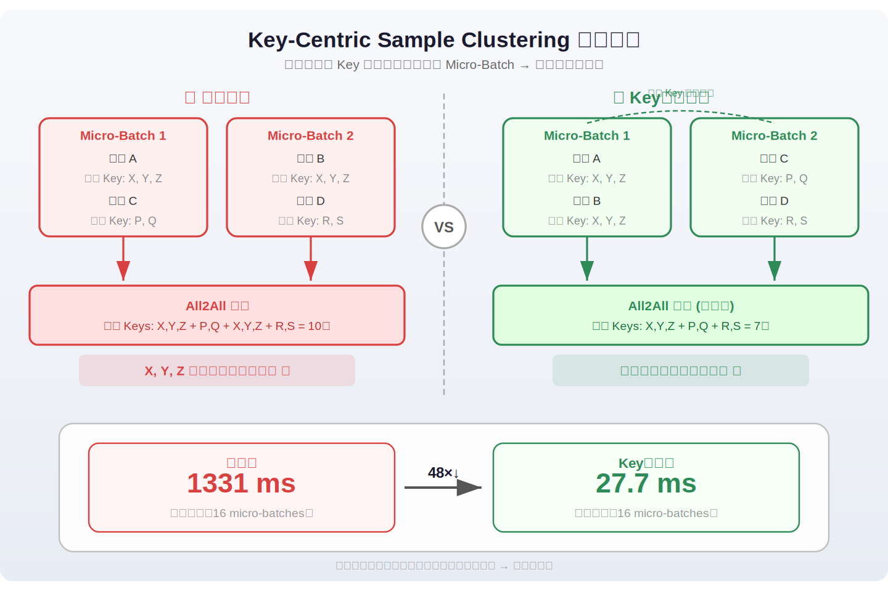
*图示：如果你把同一个作者的书分散到不同箱子里，每个箱子都要单独去图书馆借一次该作者的参考书，总借书次数就很多。把同一作者的书放到同一个箱子里，每个箱子只借一次就够了。sample clustering就是把访问相似embedding key的样本聚在一起，让每个micro-batch内部的key重叠最大化，去重后实际要传输的embedding数量大幅减少。*

#### 技术点 4：理论一致性保证
- 技术细节：论文形式化证明NestPipe等价于标准同步训练。DBP一致性：对于batch B+1中的每个key，若它不在batch B的key集合中则其embedding本身就是最新的；若它同时出现在B和B+1中，dual-buffer同步会用active buffer中B更新后的值覆盖prefetch buffer中的旧值，因此B+1看到的参数严格等于标准同步更新后的参数。FWP一致性：所有micro-batch使用同一份冻结的参数计算梯度，sample clustering只是对同一集合的不同划分，梯度求和不变，最终更新公式与标准同步训练完全一致。两者嵌套组合后每一步更新仍满足标准同步更新公式。
- 通俗讲解：NestPipe虽然做了大量并行重叠，但数学上每一步训练和老老实实串行执行完全一样。DBP保证每个batch开算前参数是最新的，FWP保证batch内部micro-batch之间参数不变所以不存在过期问题。实验验证了NestPipe的训练loss曲线和排名指标与标准同步baseline几乎重合，HR@10差异小于0.0003。
- 例子：对比实验中UniEmb因为异步预取导致embedding过期，HR@10下降了0.0021；2D-SP因修改通信拓扑和梯度聚合逻辑，HR@10下降了0.001。NestPipe在所有四个排名指标上与同步baseline的差异均小于0.0003，验证了理论一致性在实际中成立。

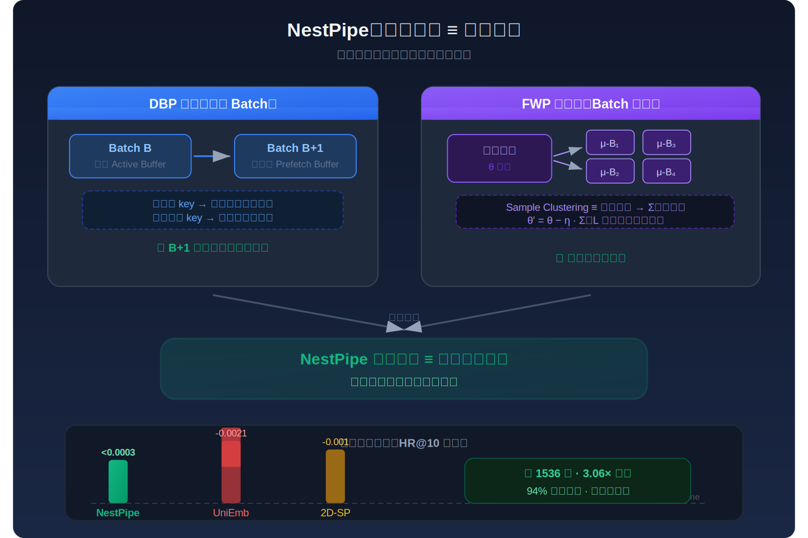
*图示：NestPipe虽然做了大量并行重叠，但数学上每一步训练和老老实实串行执行完全一样。DBP保证每个batch开算前参数是最新的，FWP保证batch内部micro-batch之间参数不变所以不存在过期问题。实验验证了NestPipe的训练loss曲线和排名指标与标准同步baseline几乎重合，HR@10差异小于0.0003。*

#### 技术点 5：大规模实验与正交可组合性
- 技术细节：在1536张NPU上，NestPipe实现3.06倍加速，扩展效率94.07%，硬件利用率始终保持90%以上。对比TorchRec扩展效率44.34%、2D-SP 49.32%、UniEmb 67.62%。NestPipe与2D-SP正交组合后，2D-SP先将物理All2All通信从1185ms压缩到452ms，FWP再以1/N暴露比将其降到55.64ms，最终吞吐提升到4.32倍，扩展效率97.17%。在不同embedding维度(512-1024)、dense层数(2-8)、序列长度(512-2048)下均表现稳健。
- 通俗讲解：NestPipe优化的是通信暴露比例而非绝对通信量，所以它天然能和各种减少通信绝对量的方法叠加使用。2D-SP把通信总量砍掉一大半，NestPipe再把剩余通信藏到计算后面，两者叠加效果比单独使用任何一个都好。类似的，embedding压缩、sharding优化等方法也都可以和NestPipe组合。
- 例子：单独用2D-SP在1536卡上扩展效率只有49.32%，单独用NestPipe是94.07%。两者组合后：2D-SP把All2All从1185ms压到452ms，NestPipe的FWP再把452ms中只暴露55.64ms在关键路径上，最终扩展效率达到97.17%，几乎线性扩展。

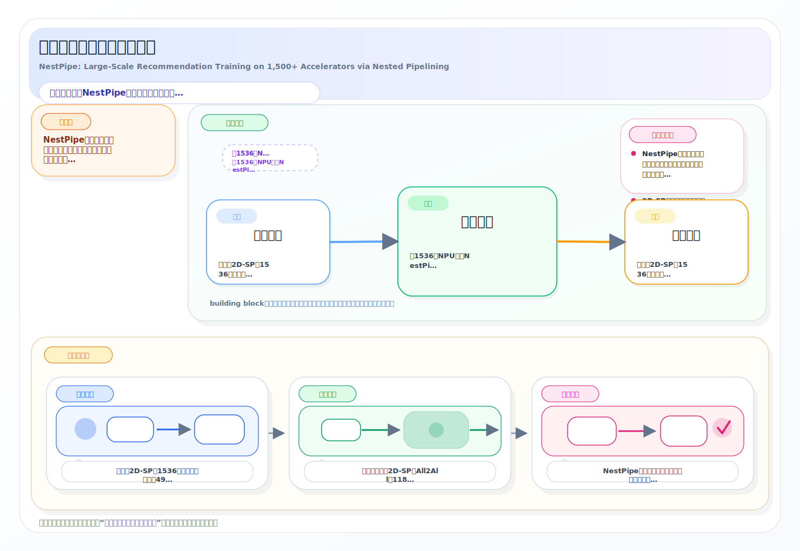
*图示：NestPipe优化的是通信暴露比例而非绝对通信量，所以它天然能和各种减少通信绝对量的方法叠加使用。2D-SP把通信总量砍掉一大半，NestPipe再把剩余通信藏到计算后面，两者叠加效果比单独使用任何一个都好。类似的，embedding压缩、sharding优化等方法也都可以和NestPipe组合。*

- **对广告的启发：** 最适合层级：广告排序模型的大规模embedding分布式训练；价值：广告CTR/CVR模型同样具有万亿级embedding参数、数千卡分布式训练需求，面临完全相同的lookup和All2All通信瓶颈。NestPipe的双缓冲流水线和冻结窗口流水线可直接应用于广告模型训练，在保持同步训练精度的前提下实现近线性扩展，潜在节省50%-70%的训练时间和GPU/NPU资源成本。其与2D-SP等方法的正交可组合性意味着可以逐步集成到现有广告训练基础设施中。；风险：该方案需要对训练框架进行较深层次的改造（五阶段流水线、双缓冲管理、stream调度、sample clustering），工程实现复杂度较高。micro-batch划分和sample clustering策略需要根据具体广告模型的embedding访问模式调优。此外，论文实验主要基于HSTU和FUXI两个推荐backbone，广告模型若有显著不同的dense/sparse计算比例，冻结窗口的遮盖效果可能需要重新评估。

## 六、候选但未完成深读的论文

当前重点论文都已完成可用分析。
