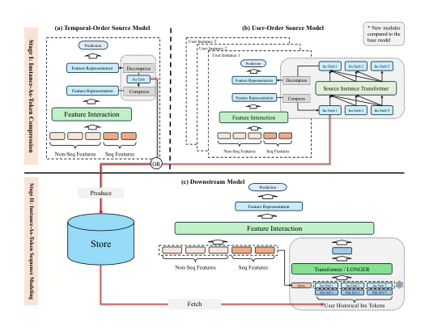
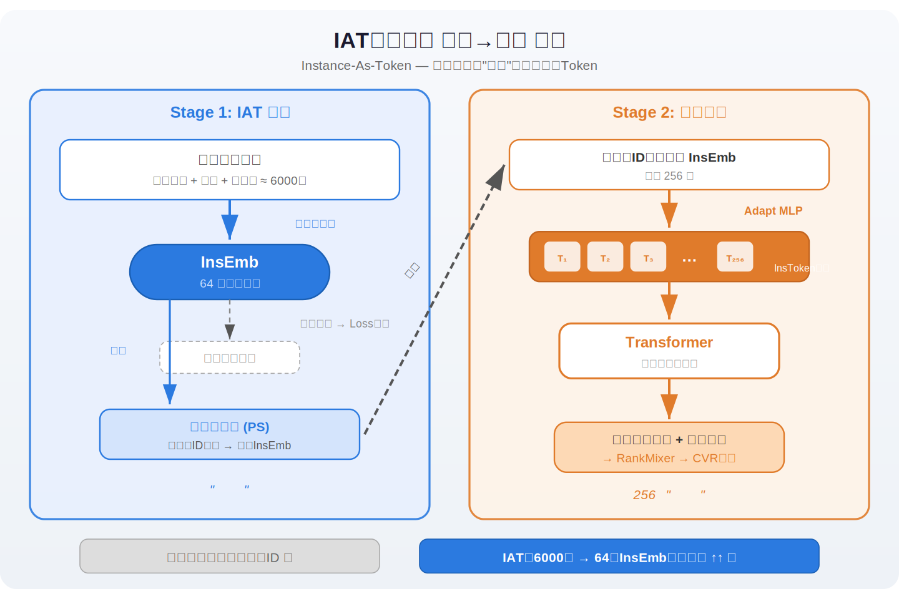
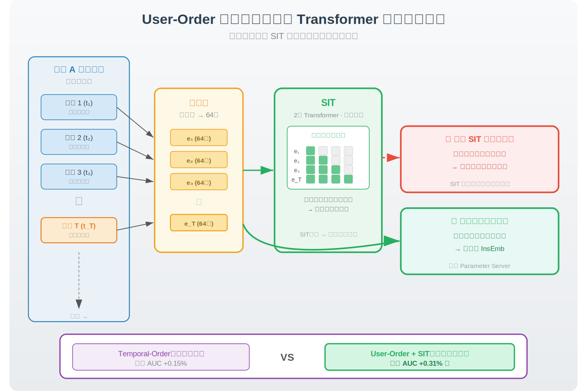
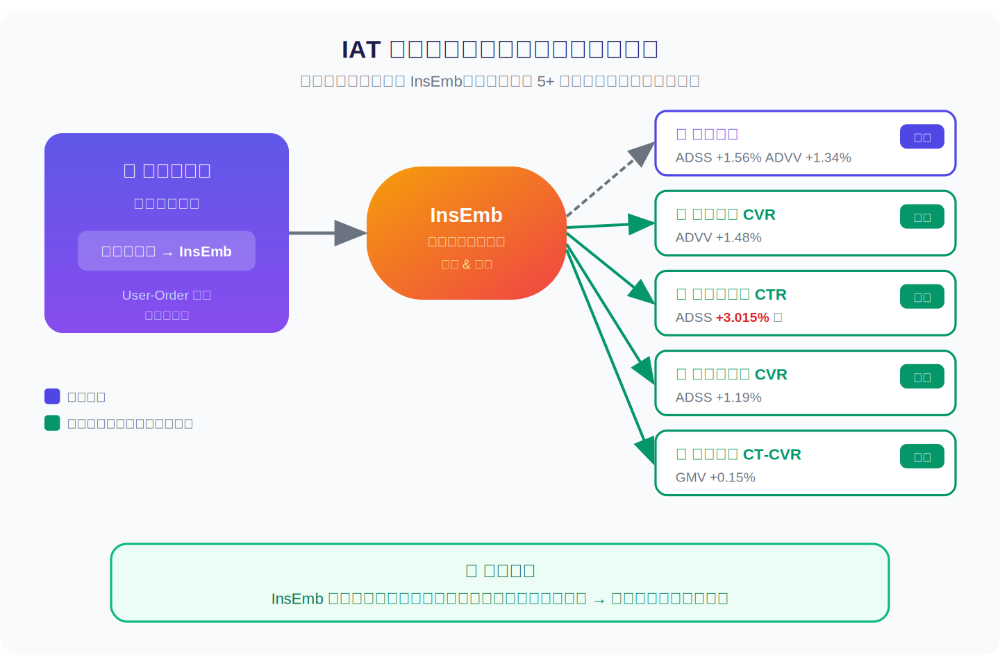
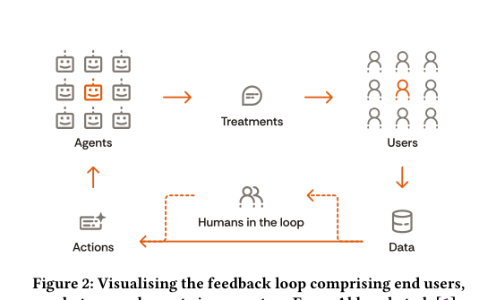
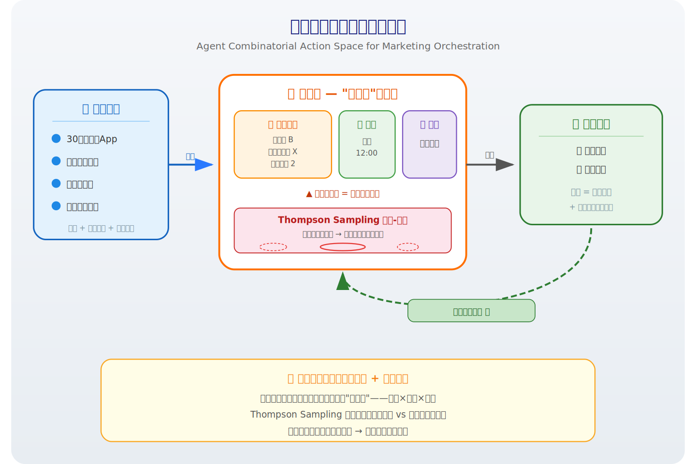
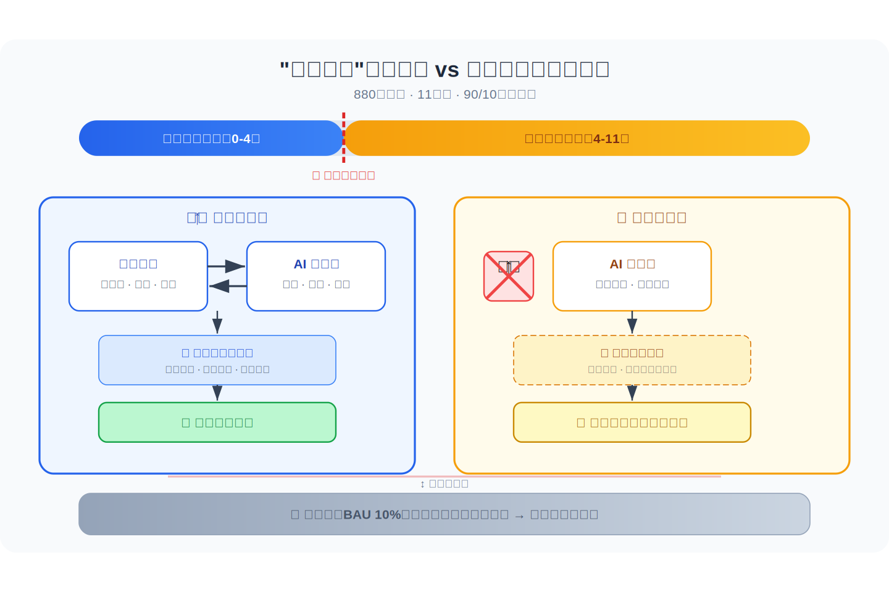
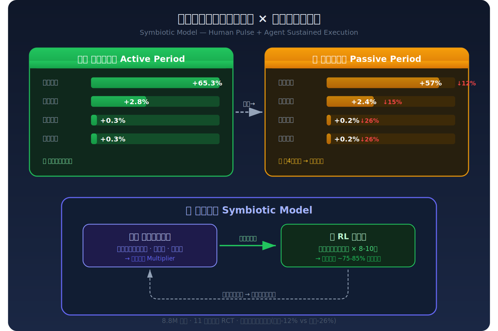
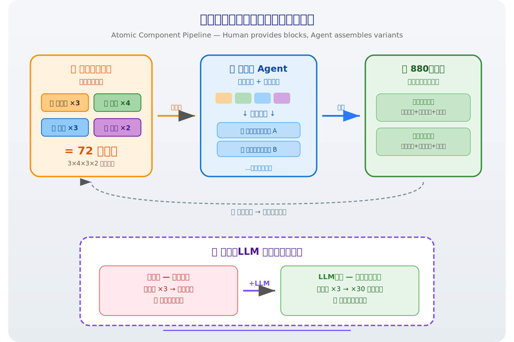

# 2026-04-13 论文日报

## 一、今日趋势与创新观察

### 1. 趋势概况

- 今日 336 篇论文中，LLM 与语言理解方向占比最高（约 65 篇），研究重心集中在 LLM 驱动的文档排序（如 BracketRank 竞争淘汰式排序、动态截断重排序）和 LLM 时代的检索范式重新思考（如从相关性到效用的检索目标转变）。
- Agent 与多智能体方向活跃度紧随其后（约 40 篇），涵盖技能自进化、过程奖励引导推理、人机协作判断等，Agent 正在从通用对话向垂直领域技能编排和主动求助判断演进。
- 表示学习与检索排序方向（约 24 篇）出现了若干具体的工业优化工作，包括量子启发式高维文档嵌入、双意图空间推荐表示优化、以及面向工业推荐的用户序列压缩建模，方法层面偏向在表示层做结构性创新。
- 迁移学习与跨域泛化方向虽然论文数量不多（约 9 篇），但出现了 MoE 缩放律分析和弹性权重迁移等基础设施级工作，反映出社区对大模型高效复用和泛化机制的持续关注。

### 2. 推荐系统 / 排序相关创新点

- IAT（Instance-As-Token）提出将用户历史行为序列中的每条交互压缩为单个 token 级表示，再送入 Transformer 建模，显著降低工业推荐系统中超长用户序列的计算开销，同时保留行为粒度的语义信息——这个思路对广告侧用户画像压缩和实时排序推理都有直接启发。
- BracketRank 用 LLM 做锦标赛式文档淘汰排序，把传统 pointwise/listwise 打分替换成两两对比+推理链消除，为 LLM 驱动的重排序提供了一种控制推理成本的新编排范式。
- Sustained Impact of Agentic Personalisation 以纵向案例研究验证了 Agent 驱动的营销个性化在长期投放中的持续效果，为广告个性化从单次触发到持续自适应提供了实证依据。

### 3. 全局创新点

- Meta 的量化元认知几何研究（Quantisation Reshapes the Metacognitive Geometry）揭示了模型量化不仅影响精度，还会系统性地改变模型对自身置信度的内部表征结构——这对理解压缩部署后模型行为漂移和校准失真有方法论价值。
- RecaLLM 提出在 LLM 推理过程中显式植入上下文检索步骤，缓解 Lost-in-Thought 现象（模型在长链推理中遗忘早期上下文），为长上下文场景下的检索增强生成提供了一种轻量级的注意力回溯机制。
- Regime-Conditional Retrieval 为多跳问答设计了条件路由器，根据查询所属的「体制」动态选择检索策略并提供可迁移的路由能力，这种按查询难度/类型分流的思路对任何需要多路召回融合的系统都有借鉴意义。

## 二、今日一个 AI 知识点

### Instance-As-Token：用户序列压缩建模背后的表示学习思路

在工业推荐或广告系统中，一个活跃用户可能有成百上千条历史行为，如果把每条行为当成一个独立的输入 token 送进 Transformer，序列长度很快就会爆炸，导致注意力计算的平方级开销吃不消。Instance-As-Token 的核心思路是：先把每条行为（比如一次点击、一次购买）的所有特征——商品ID、类目、价格、时间戳——喂进一个小型编码器，把它们揉成一个固定维度的向量，这个向量就充当这条行为的「一个 token」。这一步的关键在于，原本一条行为可能需要好几个 token 才能描述清楚（比如商品 embedding + 类目 embedding + 价格分桶 + 时间编码各占一个位置），现在全部压进同一个位置，序列长度直接按特征数的倍数缩短。压缩完之后，这些 instance-level token 排成一个时间序列，送进标准的 Transformer encoder。因为每个 token 已经是一条完整行为的浓缩表示，Transformer 的注意力机制此时关注的是行为与行为之间的关系——比如用户先看了运动鞋再看了跑步手表，这种跨行为的兴趣演化模式——而不是在特征内部反复做冗余的交叉。最后 Transformer 的输出表示就是这个用户的兴趣画像，可以直接和候选广告或商品的 embedding 做点积打分。整个过程的精髓在于：压缩发生在表示层而不是采样层。传统做法是截断用户序列（只保留最近 50 条），信息直接丢了；而 Instance-As-Token 保留了全部行为，只是每条行为的表示更紧凑。这就像把一本厚书的每一章压缩成一句摘要，再让 Transformer 读摘要序列——章节数没减少，但每章的阅读成本大幅降低。这个思路对广告系统尤其实用：用户的长期兴趣和短期意图往往藏在不同时间跨度的行为里，截断会丢失长期信号，而压缩表示则能在可控算力下同时捕捉两种信号。

## 三、今日论文总览

### 1. IAT: Instance-As-Token Compression for Historical User Sequence Modeling in Industrial Recommender Systems
- 挑选理由：工业推荐系统中的用户序列建模压缩方法，标题明确提到Industrial Recommender Systems，与广告排序用户建模高度同构

### 2. Sustained Impact of Agentic Personalisation in Marketing: A Longitudinal Case Study
- 挑选理由：Marketing个性化纵向案例研究，直接涉及营销/广告领域的个性化投放与效果评估

## 四、补充关注

今天没有需要额外提示的补充关注论文。

## 五、重点论文精读

### 1. IAT: Instance-As-Token Compression for Historical User Sequence Modeling in Industrial Recommender Systems
- **背景：** 现代广告排序模型的用户行为序列特征通常由人工设计的稀疏特征（如商品ID、类目、交互类型等少量字段）构成，信息密度低，难以充分表达用户历史交互的丰富上下文；同时人工特征工程周期长、扩展成本高，制约了序列建模架构的进一步Scaling。IAT提出将用户每次历史训练实例（包含数千维特征）整体压缩为一个低维稠密向量作为Token，再用标准序列建模架构学习长程偏好，从'特征工程'层面打破信息瓶颈。论文来自字节跳动，已在电商广告、商城广告、信息流广告、直播电商等多个线上场景全量部署，广告收入指标提升显著，工业落地成熟度高。

*图示：该图是Figure 2，直接展示IAT的overall two-stage framework，完整包含压缩阶段、存储/检索以及下游序列建模阶段，模块关系和信息流最清楚，最能代表论文核心方法。相比其他候选，它主体更完整且更聚焦于方法图本身；Figure 1更偏动机示意，不如Figure 2适合作为主架构图；其余候选要么裁剪不完整，要么带有更多页面正文噪声。*

**核心技术点：**

#### 技术点 1：两阶段压缩-建模框架
- 技术细节：第一阶段（IAT Compression）：在源模型中，对每条训练实例的完整特征表示（约6000维）通过一个压缩线性层映射到64维InsEmb，再用解压层还原回原维度参与损失优化，确保压缩向量保留高价值信息。InsEmb以实例ID为键存入参数服务器。第二阶段（IAT Sequence Modeling）：下游模型按用户ID和请求时间戳检索该用户历史InsEmb序列（最长256），经一个Adaptation MLP投影到下游特征空间，拼接标签类型等侧信息组成InsToken序列，再用Transformer或LONGER进行序列建模，输出作为一个Token送入上层特征交互模块（如RankMixer）。
- 通俗讲解：可以把它想象成：源模型像一台'照相机'，把每次用户交互时的数千维完整场景快照压缩成一张64维的'缩略图'存起来；下游模型在做预测时，把这个用户过去最多256张缩略图按时间排好队，用Transformer读一遍就能学到比传统几个稀疏ID特征丰富得多的历史偏好。
- 例子：某用户在广告系统中有200条历史转化记录。源模型对每条记录的完整特征（用户画像+广告创意特征+上下文+交互特征共约6000维）做前向传播，经特征交互层得到6000维表示h，再用64x6000的压缩矩阵映射到64维InsEmb存入PS。当新广告请求到来时，下游模型用用户ID取出这200个InsEmb，经Adaptation MLP投影后拼接行为标签embedding，形成200长的InsToken序列，Transformer处理后输出一个聚合向量，与候选广告特征一起进入RankMixer做最终CVR预测。

*图示：可以把它想象成：源模型像一台'照相机'，把每次用户交互时的数千维完整场景快照压缩成一张64维的'缩略图'存起来；下游模型在做预测时，把这个用户过去最多256张缩略图按时间排好队，用Transformer读一遍就能学到比传统几个稀疏ID特征丰富得多的历史偏好。*

#### 技术点 2：用户序源模型与SIT模块
- 技术细节：除了按时间顺序逐条压缩的Temporal-Order源模型，论文提出User-Order源模型：将同一用户的训练实例按时间排序组成一个batch，每条实例压缩到64维后，拼成一个长度为T的序列送入Source Instance Transformer（SIT，2层Transformer，维度64，FFN中间层128），使用因果掩码保证每条实例只能看到更早的实例信息。关键设计是存储SIT之前的压缩向量作为InsEmb，而不是SIT之后的，因为SIT后的表示由于注意力机制变得彼此相似、丢失了基础特征信息。流式训练阶段，当前batch来自不同用户，则对每条实例从PS中取回该用户前T-1条旧InsEmb（stop gradient），拼接后送入SIT，只更新当前实例的InsEmb。
- 通俗讲解：Temporal-Order源模型是各拍各的照片，彼此独立；User-Order源模型则让同一用户的所有照片排好队，用一个带因果掩码的Transformer让后面的照片能'参考'前面的照片来优化自己的压缩质量。这样源模型本身就隐式地学到了序列建模能力，生成的InsEmb质量更高。但存储时只存压缩层的原始输出而不是Transformer处理后的输出，因为后者信息被平滑掉了。
- 例子：用户A有300条历史实例。User-Order源模型把这300条按时间排好，每条压缩到64维后拼成300长序列送入SIT。第200条实例可以通过因果注意力看到前199条的压缩表示，从而在优化损失时这条实例的压缩向量获得了上下文增强。但最终存入PS的是压缩层直接输出的64维向量，而非SIT输出。实验显示User-Order源模型自身AUC提升0.6%，其InsEmb带给下游模型的AUC提升（最高+0.31%）也远超Temporal-Order的+0.15%。

*图示：Temporal-Order源模型是各拍各的照片，彼此独立；User-Order源模型则让同一用户的所有照片排好队，用一个带因果掩码的Transformer让后面的照片能'参考'前面的照片来优化自己的压缩质量。这样源模型本身就隐式地学到了序列建模能力，生成的InsEmb质量更高。但存储时只存压缩层的原始输出而不是Transformer处理后的输出，因为后者信息被平滑掉了。*

#### 技术点 3：下游模型的Scaling Law
- 技术细节：论文对下游IAT序列建模的Transformer层数（1/2/4层）和最大InsToken序列长度（32到512）做了全面实验，发现AUC增益与FLOPs之间符合幂律关系（拟合形式为y=a\*x b，其中指数约0.31）。层数越多，Scaling曲线越陡。同时源模型SIT的维度从64扩到256、层数从2扩到4时，源模型AUC增益从0.52%提升到0.80%，下游模型从0.35%提升到0.47%。即使基座模型从50M扩到1B参数，IAT仍能带来显著增益。
- 通俗讲解：这说明IAT不是一个在小模型上有效、大模型上就饱和的技巧，而是一个可以跟着模型规模一起Scaling的基础设施。InsToken序列越长、Transformer越深、源模型SIT越大，收益越高且符合可预测的幂律曲线，这对工业系统的资源规划非常有价值。
- 例子：将下游IAT序列长度从32扩到256、Transformer从1层扩到4层，AUC增益从约0.1%增长到约0.4%。在基座模型已经是1B参数的情况下，加入User-Order IAT仍带来+0.33%的AUC增益，说明IAT提供的信息与模型自身容量提升是互补的。

*图示：这说明IAT不是一个在小模型上有效、大模型上就饱和的技巧，而是一个可以跟着模型规模一起Scaling的基础设施。InsToken序列越长、Transformer越深、源模型SIT越大，收益越高且符合可预测的幂律曲线，这对工业系统的资源规划非常有价值。*

#### 技术点 4：多场景线上效果与迁移性
- 技术细节：在广告域内场景，User-Order IAT带来ADSS+1.557%、ADVV+1.340%的收入提升，远超Temporal-Order IAT的+0.685%/+0.653%。跨域迁移方面，用广告场景训练的源模型生成的InsEmb直接应用到商城广告CVR（ADVV+1.482%）、信息流广告CTR（ADSS+3.015%）和CVR（ADSS+0.5%）、非闭环广告CVR（ADSS+1.19%）、直播电商CT-CVR（GMV+0.151%）均取得显著正向效果。
- 通俗讲解：一个广告场景训练出的用户历史压缩向量，不仅在自己的场景有效，还能直接搬到商城、信息流、直播等完全不同的推荐场景里当序列特征用，说明InsEmb捕获的是用户通用的交互偏好模式，而非场景特定的窄信号。
- 例子：在电商广告场景训练源模型后，将生成的InsEmb直接接入信息流广告的CTR排序模型做序列建模，无需重新训练源模型，信息流广告的ADSS指标提升了3.015%，这是非常显著的跨域迁移效果。

*图示：一个广告场景训练出的用户历史压缩向量，不仅在自己的场景有效，还能直接搬到商城、信息流、直播等完全不同的推荐场景里当序列特征用，说明InsEmb捕获的是用户通用的交互偏好模式，而非场景特定的窄信号。*

- **对广告的启发：** 最适合层级：广告排序模型的用户行为序列特征层，替换或增强传统手工序列特征；价值：论文本身就是广告系统论文，已在字节跳动电商广告、信息流广告、商城广告等多个广告场景全量上线。核心价值在于用低维压缩向量替代稀疏手工序列特征，突破序列信息密度瓶颈，且跨域迁移能力强，一套源模型可服务多个广告业务线。线上广告收入指标提升1-3%，Scaling Law可预测。；风险：需要额外的参数服务器存储InsEmb（论文估算数十TB级别），以及源模型与下游模型的两阶段训练和流式同步管线，工程复杂度较高；InsEmb质量依赖源模型质量，源模型退化会传导到所有下游场景；压缩维度选择需在存储成本和信息保留之间权衡。

### 2. Sustained Impact of Agentic Personalisation in Marketing: A Longitudinal Case Study
- **背景：** 消费类应用的CRM营销传统上依赖人工定义的静态规则和分群策略，但随着用户规模和内容库膨胀，人工编排消息的方式遇到可扩展性瓶颈，导致大量'广播式'推送效果递减。业界已广泛采用强化学习和自主智能体来实现个性化消息编排，但一个关键运营问题悬而未决：人类营销人员的持续介入到底是必须的，还是智能体可以在初始设置后独立维持效果？本文通过一个覆盖880万用户、持续11个月的纵向随机对照实验，首次系统量化了'主动管理期'与'被动自主期'的效果差异，为广告和营销实践提供了'人机协同'运营模型的实证依据。

*图示：该候选最完整且最聚焦地展示了论文核心的人机协同反馈回路：agents生成treatments作用于users，users反馈形成data，经由humans in the loop与actions再回到agents，清楚表达系统结构、角色关系与信息流。相比其他候选，它正文噪声更少、图主体更完整，也避免了整页截图和结果图的干扰，最适合作为论文主方法/系统总览图。*

**核心技术点：**

#### 技术点 1：组合动作空间的智能体决策框架
- 技术细节：系统将营销编排建模为序贯决策问题。对每个用户u在时刻t，智能体观察一个状态向量(包含用户画像、历史交互、应用使用记录)，然后从一个组合动作空间中选择动作，该动作是一个三元组：内容组装(从原子组件库中选取价值主张、问候语、视觉素材拼装消息)、发送时机(确定一天中的具体时段、星期几和频率)、渠道选择(推送通知、邮件或短信)。奖励信号是对多种可配置事件(应用打开、意向事件、转化事件)的学习加权标量化，并叠加了双重差分设计来度量增量因果效应。探索-利用平衡通过Thompson Sampling实现，为每个潜在动作维护一个期望效用的概率分布。
- 通俗讲解：可以把智能体想象成一个自动化的营销编辑：它看到一个用户'最近7天没打开App、偏好晚间下单、常用推送渠道'这样的状态，然后要同时做三个决策——用哪几块内容拼出一条消息、什么时候发、通过什么渠道发。它不是从预写好的完整模板里选一条，而是像搭积木一样从'问候语A/B/C'、'优惠信息X/Y/Z'、'配图风格1/2/3'中各选一块组合出来。选择时，它会对每种组合的预期回报维护一个概率分布，每次按分布采样来决定发什么，这样既能尝试新组合，又不会浪费太多流量在差组合上。
- 例子：假设一个用户已经30天没打开外卖App。智能体观察到该用户历史偏好午餐时段、常点亚洲菜、过去对推送通知有较高点击率。它从组件库中选出'亲切问候语B'+'亚洲菜新店推荐X'+'限时折扣视觉素材2'，决定在周二中午12点通过推送通知发送。Thompson Sampling的概率分布显示这个组合的预期打开率置信区间较宽(尚未充分探索)，因此被优先采样尝试。如果用户点击并下单，奖励信号更新该组合的分布，使其在后续决策中被选中的概率更高。

*图示：可以把智能体想象成一个自动化的营销编辑：它看到一个用户'最近7天没打开App、偏好晚间下单、常用推送渠道'这样的状态，然后要同时做三个决策——用哪几块内容拼出一条消息、什么时候发、通过什么渠道发。它不是从预写好的完整模板里选一条，而是像搭积木一样从'问候语A/B/C'、'优惠信息X/Y/Z'、'配图风格1/2/3'中各选一块组合出来。选择时，它会对每种组合的预期回报维护一个概率分布，每次按分布采样来决定发什么，这样既能尝试新组合，又不会浪费太多流量在差组合上。*

#### 技术点 2：主动期vs被动期的纵向实验设计
- 技术细节：实验覆盖880万不活跃用户(再激活场景)，采用90/10的随机分流(智能体组 vs BAU业务常规组)，持续11个月。前4个月为'主动管理期'：营销人员持续提供新文案、进行语义标注、调整受众定义，智能体在此基础上学习和优化。后7个月为'被动跟进期'：不再有任何人工干预，智能体仅基于已有的固定组件库继续自主学习和投放。使用ML-RATE方法降低消费者行为数据中稀疏转化事件带来的高方差，同时保持平均处理效应估计的无偏性；用Delta方法为相对提升量提供渐近方差估计。
- 通俗讲解：这个实验的精妙之处在于它不是简单的AB测试，而是一个有时间维度的'断药实验'：先让营销团队全力配合智能体跑4个月，建立一套丰富的消息组件库，然后突然停止所有人工输入，看智能体在没有新弹药的情况下还能撑多久。对照组始终接受平台原有的常规消息策略，且对照组持续存在了整个11个月，这样可以排除季节性、节假日等外部因素的干扰——因为这些因素同时影响了实验组和对照组。
- 例子：具体来说，在第0-4个月，营销团队可能每周新增3-5条文案变体、调整某类用户的重新激活门槛从30天改为21天、为新推出的杂货品类添加专属视觉素材。到第4个月末'交接'后，智能体手里的组件库就被冻结了，但它仍然可以根据用户反馈数据持续调整'选哪个组件组合给哪个用户'的策略。7个月后观察到效果虽有下降但仍显著为正，说明智能体的个性化匹配能力本身就有持续价值。

*图示：这个实验的精妙之处在于它不是简单的AB测试，而是一个有时间维度的'断药实验'：先让营销团队全力配合智能体跑4个月，建立一套丰富的消息组件库，然后突然停止所有人工输入，看智能体在没有新弹药的情况下还能撑多久。对照组始终接受平台原有的常规消息策略，且对照组持续存在了整个11个月，这样可以排除季节性、节假日等外部因素的干扰——因为这些因素同时影响了实验组和对照组。*

#### 技术点 3：效果衰减量化与共生运营模型
- 技术细节：主动期的核心指标提升：推送直接打开天数+65.3%(标准误1.31)，参与天数+2.8%(标准误0.19)，意向天数+0.3%(标准误0.23)，转化天数+0.3%(标准误0.24)，重点品类转化+1.2%(标准误0.62)。被动期指标：推送点击仍保持+57%(标准误0.11)，参与天数+2.4%(标准误0.21)，意向和转化各+0.2%(标准误0.27)。从主动到被动的相对衰减幅度：整体参与约-15%，推送打开约-12%，意向和转化约-26%。时间趋势显示：主动期效果持续上升，被动期前4个月效果持平，后期开始下滑。论文据此提出'共生模型'：人类负责战略初始化和组件库刷新(乘数效应)，智能体负责规模化执行和效果保持(基线保障)。
- 通俗讲解：可以这样理解：智能体像一个非常称职的执行者，你给它一套工具包，它能持续高效地用7个月。但它不会自己发明新工具——没有人刷新文案和策略，效果会慢慢打折扣，尤其是在漏斗下端(意向和转化)衰减更明显(约-26%)，而上端的点击和参与相对稳固(约-12%到-15%)。这说明用户对内容的新鲜感需求在转化环节更敏感。论文的核心建议不是'全自动'也不是'全手动'，而是人做'阶段性脉冲式输入'、智能体做'持续优化执行'的协作模式。
- 例子：比如一个外卖平台的营销团队，可以在每个季度初集中投入2-4周进行新文案创作、新品类素材制作、受众策略调整，然后交给智能体自主运行剩余的8-10周。从本实验数据推算，这样每个季度末智能体仍能维持主动期约75-85%的参与提升和约74%的转化提升，同时大幅释放营销团队的人力去做下一季度的创意准备。

*图示：可以这样理解：智能体像一个非常称职的执行者，你给它一套工具包，它能持续高效地用7个月。但它不会自己发明新工具——没有人刷新文案和策略，效果会慢慢打折扣，尤其是在漏斗下端(意向和转化)衰减更明显(约-26%)，而上端的点击和参与相对稳固(约-12%到-15%)。这说明用户对内容的新鲜感需求在转化环节更敏感。论文的核心建议不是'全自动'也不是'全手动'，而是人做'阶段性脉冲式输入'、智能体做'持续优化执行'的协作模式。*

#### 技术点 4：原子组件化的人机协作内容管线
- 技术细节：系统的关键设计是将营销内容拆解为'原子组件'——不同的语调风格、优惠类型、问候方式、视觉素材等。人类营销人员不需要编写成千上万条完整消息变体，只需提供这些原子组件，智能体自动进行排列组合生成个性化消息变体并投放测试。论文指出当前瓶颈在于原子组件的人工生产，未来可通过大语言模型(LLM)自动生成组件来弥合主动期与被动期的效果差距。
- 通俗讲解：这就像乐高积木的思路：营销人员不用搭好每一个完整的城堡，只需要设计不同形状和颜色的积木块，智能体会根据每个用户的偏好自动拼出最适合的城堡。这种模块化设计既降低了人工成本(几十个组件就能组合出数百种消息)，又给了智能体足够大的探索空间来发现意想不到的高效组合。
- 例子：假设营销团队提供了3种问候语、4种优惠表述、3种配图风格、2种行动号召按钮文案，智能体就有3x4x3x2=72种消息变体可以测试。对偏好折扣的用户可能收敛到'随意问候+大额折扣+美食配图+立即下单按钮'，而对品质敏感的用户可能是'正式问候+新品推荐+精致配图+查看详情按钮'。论文认为如果用LLM自动扩充组件库(例如自动生成10种问候语变体)，就能在被动期也保持内容新鲜感，减少效果衰减。

*图示：这就像乐高积木的思路：营销人员不用搭好每一个完整的城堡，只需要设计不同形状和颜色的积木块，智能体会根据每个用户的偏好自动拼出最适合的城堡。这种模块化设计既降低了人工成本(几十个组件就能组合出数百种消息)，又给了智能体足够大的探索空间来发现意想不到的高效组合。*

- **对广告的启发：** 最适合层级：广告投放的自动化运营与人机协作策略；价值：本文的核心发现直接适用于计算广告：(1)广告创意素材可以采用原子组件化设计，由算法自动组合测试，大幅降低素材制作成本；(2)Thompson Sampling驱动的组合动作空间决策框架可迁移到广告的'创意x出价x定向x时段'联合优化；(3)实验量化了'人工停止介入后效果衰减约15-26%'的规律，为广告运营团队规划素材刷新节奏提供了数据参考——大约4个月后智能体自主效果开始明显下滑，建议至少每季度进行一次人工素材和策略刷新；(4)'共生模型'可指导广告团队的组织架构设计，将人力集中在创意发现和策略创新上，日常投放优化交给算法。；风险：论文基于单一消费类外卖平台的再激活场景，用户行为模式(低频、高价值转化)可能与高频广告场景(如信息流广告)存在差异。实验仅分析了一次'主动到被动'的切换，缺乏多次切换的验证。另外，90/10的分流比例意味着对照组较小，长尾指标的统计功效可能不足。组件库冻结后效果下滑的速率可能因行业、品类、竞争环境不同而差异很大，不宜直接套用'7个月仍有效'的结论。

## 六、候选但未完成深读的论文

当前重点论文都已完成可用分析。
