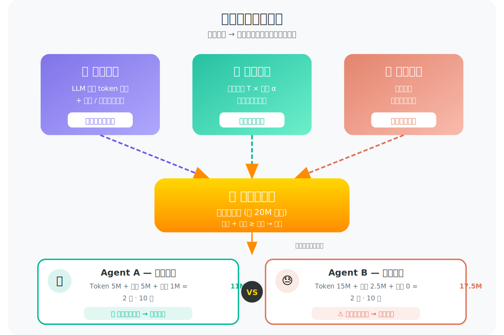
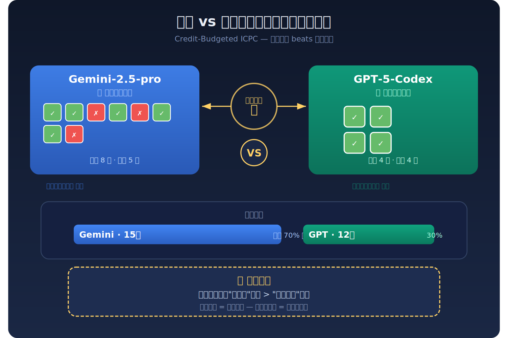
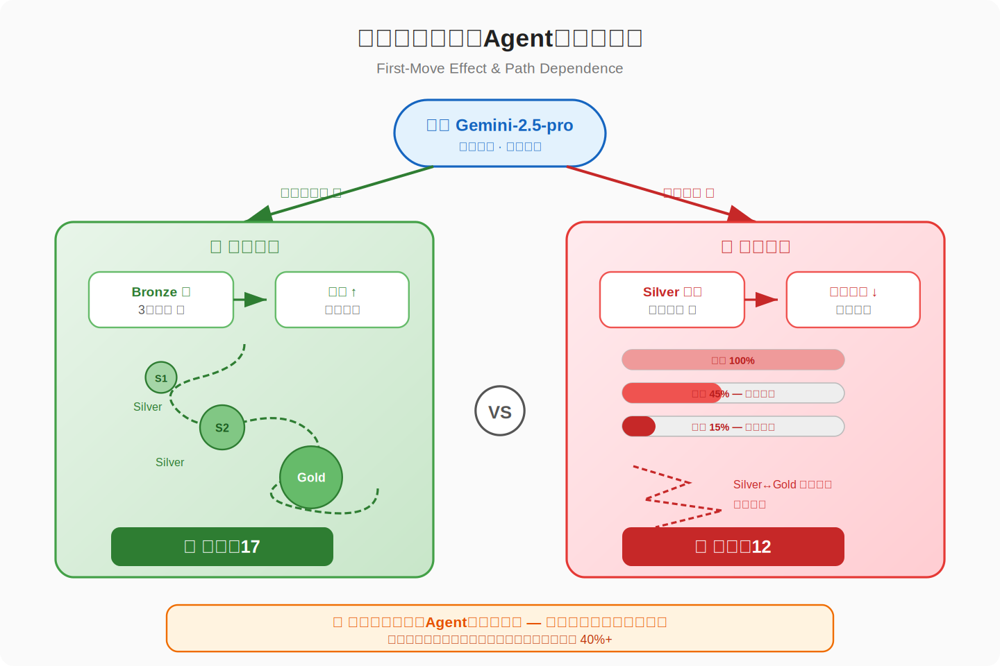
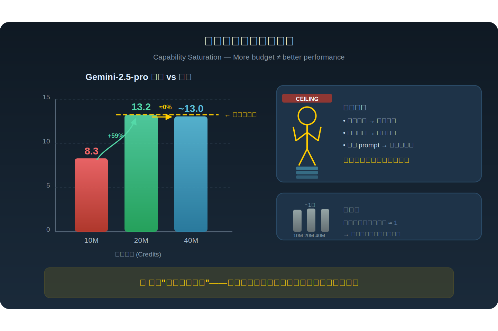
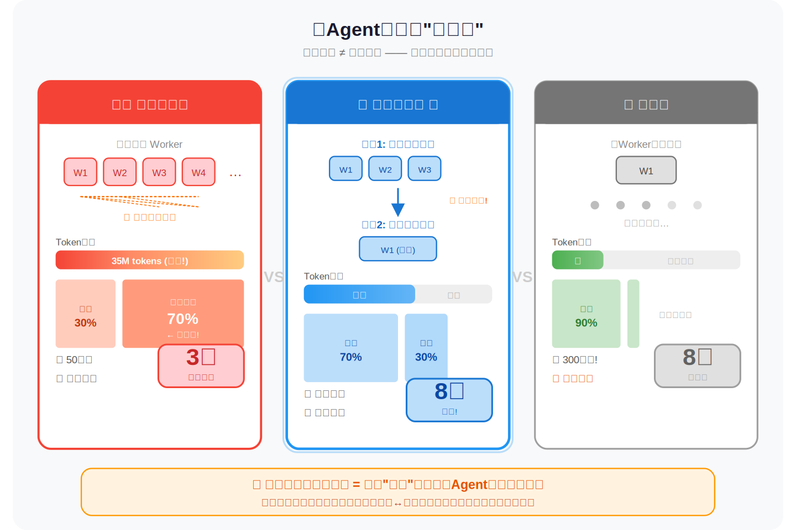
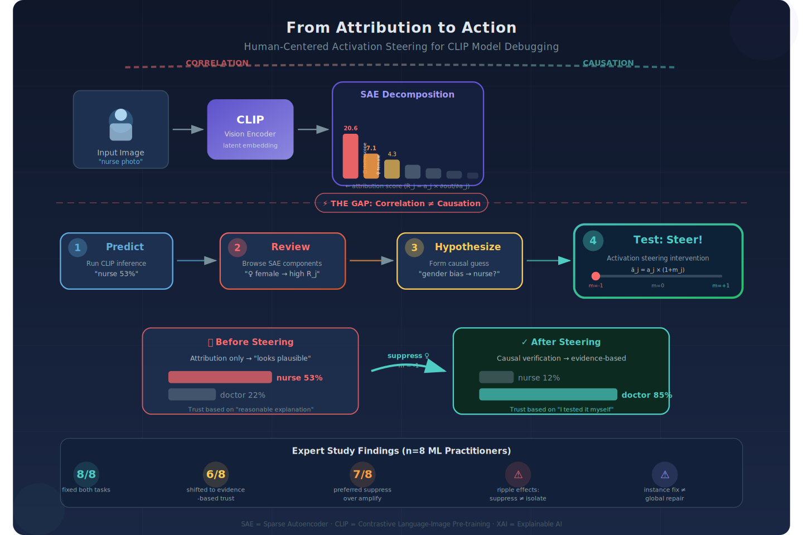
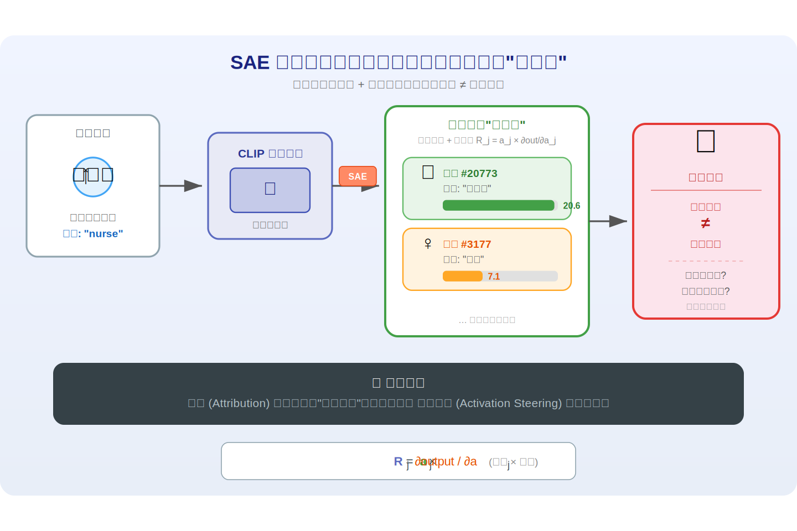
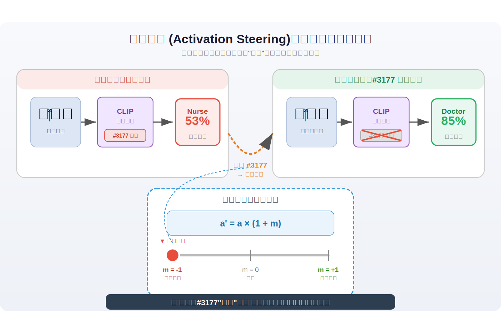
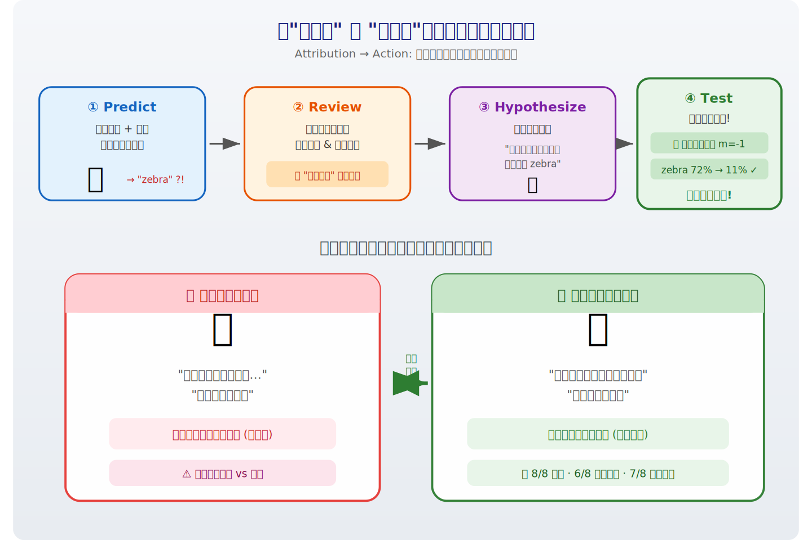
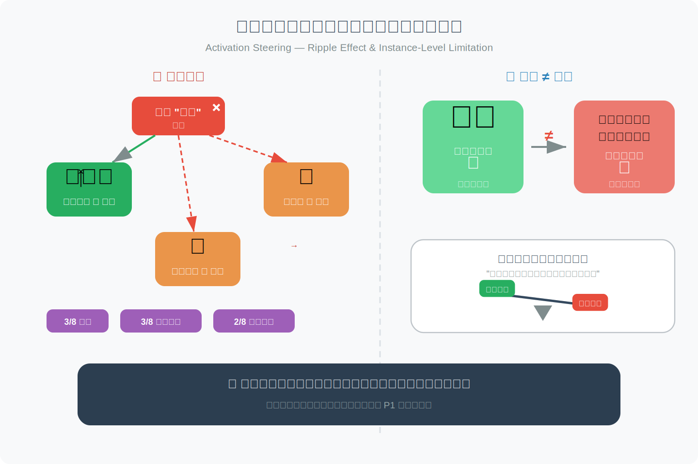

# 2026-04-14 论文日报

## 一、今日趋势与创新观察

### 1. 趋势概况

- 今天 767 篇论文中，cs.AI 占比超过 60%，其中 LLM 与语言理解（163 篇）和 Agent 与多智能体（107 篇）两大主题合计占全量近 35%，说明大模型能力延伸和智能体编排仍是当前最密集的研究方向。
- 表示学习与检索排序方向约 50 篇，研究重心从单纯的向量召回转向语义 ID 协调（如 SID-Coord）、跨模态对齐以及持续学习场景下的知识图谱嵌入更新，方法层面更强调结构化表示与增量适配。
- Agent 类论文不再局限于简单的工具调用，而是向分层推理（HARPO）、自蒸馏强化学习（Self-Distilled RL）、虚拟内存管理（ClawVM）等系统级能力演进，试图解决长程状态维护和资源约束下的多步决策问题。
- 跨域泛化和迁移学习虽然论文数量不大（约 12 篇），但出现了 LLM 驱动的跨域序列推荐（SemaCDR）、零样本跨模态迁移等新范式，显示出用大模型语义桥接不同业务域的趋势正在加速。

### 2. 推荐系统 / 排序相关创新点

- SID-Coord 提出在短视频搜索中对语义 ID 进行跨粒度协调，让基于 ID 的排序模型既保留离散 ID 的高效检索特性，又能通过语义对齐提升长尾 query 的排序质量，是 semantic ID 在工业排序链路落地的一个新方案。
- SemaCDR 用 LLM 将不同业务域的用户行为序列统一映射为可迁移的语义表示，再注入跨域序列推荐模型，相当于把大模型当作域间的语义翻译层，解决了传统 CDR 中 ID 体系不互通的老问题。
- AbLWR 虽然场景是生物学（抗体-抗原亲和力预测），但其核心框架——上下文感知的 Listwise 排序 + Positive-Unlabeled 学习——对推荐系统中只有正样本、大量未标注样本的排序场景有直接借鉴价值。

### 3. 全局创新点

- Token-Budget-Aware Pool Routing 把 LLM 推理看作一个受预算约束的路由问题，在多个模型池之间根据 token 消耗动态分配请求，实现推理成本与质量的帕累托最优，思路可以迁移到广告系统中多模型混合打分的成本控制。
- ClawVM 为有状态工具调用的 LLM Agent 引入了类似操作系统的虚拟内存管理，通过页表和换入换出机制让 Agent 在有限上下文窗口内维护超长状态，是 Agent 系统工程化的一个有意思的方向。
- Meta 的 AHC 提出在微控制器级别的内存约束下做持续目标检测的自适应压缩，通过元学习动态选择压缩策略，在极端资源受限场景下平衡遗忘与精度，对端侧推荐模型的持续更新有参考意义。

## 二、今日一个 AI 知识点

### 表示学习为什么是很多系统的隐形底座

表示学习的目标不是简单把输入压成一个向量，而是把真正影响任务的结构信息保留下来，同时把噪声和偶然因素压下去。后面的检索、排序、聚类、生成，很多时候都只是拿这个表示继续做计算。 很多论文表面看是在做召回、排序、生成，其实核心改进都发生在表示层。先理解表示学习，就更容易抓住论文真正的创新位置。 可以顺着一次具体运行过程来理解：你可以顺着一次前向这样理解：系统先把用户最近点击、搜索词、广告文案和商品属性分别编码，再通过共享空间把它们投到同一组向量坐标里；如果两个对象在任务上更相关，它们在这个空间里就应该更近；后续做召回时，只要比较向量距离，就能先快速找出更可能相关的一批候选。

## 三、今日论文总览

### 1. Credit-Budgeted ICPC-Style Coding: When Agents Must Pay for Every Decision
- 挑选理由：命中广告核心词：cpc, budget。

### 2. From Attribution to Action: A Human-Centered Application of Activation Steering
- 挑选理由：命中广告核心词：attribution。

### 3. Budget-Aware Uncertainty for Radiotherapy Segmentation QA Using nnU-Net
- 挑选理由：命中广告核心词：budget。

### 4. Toward Accountable AI-Generated Content on Social Platforms: Steganographic Attribution and Multimodal Harm Detection
- 挑选理由：命中广告核心词：attribution。

### 5. Wolkowicz-Styan Upper Bound on the Hessian Eigenspectrum for Cross-Entropy Loss in Nonlinear Smooth Neural Networks
- 挑选理由：命中广告核心词：ctr。

### 6. Deliberative Alignment is Deep, but Uncertainty Remains: Inference time safety improvement in reasoning via attribution of unsafe behavior to base model
- 挑选理由：命中广告核心词：attribution。

### 7. Token-Budget-Aware Pool Routing for Cost-Efficient LLM Inference
- 挑选理由：命中广告核心词：budget。

### 8. SpectralLoRA: Is Low-Frequency Structure Sufficient for LoRA Adaptation? A Spectral Analysis of Weight Updates
- 挑选理由：命中广告核心词：ctr。

### 9. Exact Finite-Sample Variance Decomposition of Subagging: A Spectral Filtering Perspective
- 挑选理由：命中广告核心词：ctr。

### 10. Descriptor-Injected Cross-Modal Learning: A Systematic Exploration of Audio-MIDI Alignment via Spectral and Melodic Features
- 挑选理由：命中广告核心词：ctr。

### 11. Global monitoring of methane point sources using deep learning on hyperspectral radiance measurements from EMIT
- 挑选理由：命中广告核心词：ctr。

### 12. Spectral Kernel Dynamics via Maximum Caliber: Fixed Points, Geodesics, and Phase Transitions
- 挑选理由：命中广告核心词：ctr。

### 13. CArtBench: Evaluating Vision-Language Models on Chinese Art Understanding, Interpretation, and Authenticity
- 挑选理由：命中广告核心词：rtb。

### 14. PatchRecall: Patch-Driven Retrieval for Automated Program Repair
- 挑选理由：命中强迁移信号：retrieval, recall。

### 15. Retrieval as Generation: A Unified Framework with Self-Triggered Information Planning
- 挑选理由：命中强迁移信号：retrieval, framework, unified。

### 16. Bottleneck Tokens for Unified Multimodal Retrieval
- 挑选理由：命中强迁移信号：retrieval, unified, multimodal。

### 17. MCERF: Advancing Multimodal LLM Evaluation of Engineering Documentation with Enhanced Retrieval
- 挑选理由：命中强迁移信号：retrieval, multimodal。

### 18. AbLWR:A Context-Aware Listwise Ranking Framework for Antibody-Antigen Binding Affinity Prediction via Positive-Unlabeled Learning
- 挑选理由：命中强迁移信号：ranking, framework。

## 四、补充关注

1. **R3-VAE: Reference Vector-Guided Rating Residual Quantization VAE for Generative Recommendation**
   - 理由：有一定相关信号，但不足以进入正式候选：recommendation。
2. **ARHN: Answer-Centric Relabeling of Hard Negatives with Open-Source LLMs for Dense Retrieval**
   - 理由：有一定相关信号，但不足以进入正式候选：retrieval。
3. **CMedTEB & CARE: Benchmarking and Enabling Efficient Chinese Medical Retrieval via Asymmetric Encoders**
   - 理由：有一定相关信号，但不足以进入正式候选：retrieval。
4. **BDIViz in Action: Interactive Curation and Benchmarking for Schema Matching Methods**
   - 理由：有一定相关信号，但不足以进入正式候选：matching。
5. **From Query to Conscience: The Importance of Information Retrieval in Empowering Socially Responsible Consumerism**
   - 理由：有一定相关信号，但不足以进入正式候选：retrieval。
6. **SID-Coord: Coordinating Semantic IDs for ID-based Ranking in Short-Video Search**
   - 理由：有一定相关信号，但不足以进入正式候选：ranking。
7. **MOSAIC: Multi-Domain Orthogonal Session Adaptive Intent Capture for Prescient Recommendations**
   - 理由：有一定相关信号，但不足以进入正式候选：recommendation。
8. **A Mathematical Theory of Ranking**
   - 理由：有一定相关信号，但不足以进入正式候选：ranking。
9. **Evaluating Scene-based In-Situ Item Labeling for Immersive Conversational Recommendation**
   - 理由：有一定相关信号，但不足以进入正式候选：recommendation。
10. **Decoding Ancient Oracle Bone Script via Generative Dictionary Retrieval**
   - 理由：有一定相关信号，但不足以进入正式候选：retrieval。

## 五、重点论文精读

### 1. Credit-Budgeted ICPC-Style Coding: When Agents Must Pay for Every Decision
- **背景：** 当前对自主编程代理(如Claude Code、Codex)的评测几乎都假设无限资源环境，只关注代码正确率，忽略了token消耗、推理时间、测试开销等经济成本。随着多代理协作(swarm)规模扩大，不计成本的策略将导致预算灾难性耗尽。本文提出USACOArena，一个以ACM-ICPC竞赛编程为原型、由严格'信用'经济驱动的交互式评测环境：每次生成token、本地测试、经过的每一秒都消耗固定预算池中的信用，迫使代理在速度、成本和准确性之间做出战略权衡。该框架发表于ICLR 2026，通过对Gemini-2.5-pro和GPT-5-Codex等前沿模型的全面实验，揭示了当前模型在资源管理上的深层缺陷。

*图示：该论文虽然标题含'Credit-Budgeted'和'ICPC-Style Coding'，初筛命中了CPC/budget等广告核心词，但实际研究内容是面向自主编程代理(coding agents)的资源预算管理评估框架，与计算广告无直接关系。然而其核心思想——在固定预算下将token消耗、时间、测试开销统一为'信用'经济体系，并迫使agent在探索与利用之间做出成本感知的权衡——与广告系统中的预算分配、出价策略、ROI优化高度可迁移。属于强迁移论文。*

**核心技术点：**

#### 技术点 1：统一信用经济模型
- 技术细节：USACOArena将三类成本统一为一个信用池：(1)动作成本，包括LLM推理token费用(按API价格归一化)和提示/测试费用；(2)交付时间成本，将墙钟时间T乘以可调时间系数alpha转换为信用；(3)惩罚成本，错误提交会扣除额外信用。终止条件是动作成本加时间成本超过预算上限，但最终排名的平局打破使用的是'已消耗总信用'，即动作成本+时间成本+惩罚成本之和。目标函数是在总信用不超限的约束下最大化得分。
- 通俗讲解：把它想象成一场比赛：你有一个固定的'钱包'。你每调用一次大模型、每运行一次本地测试、每多等一秒钟，钱包都在减少。提交了错误答案还要额外罚款。钱花完了比赛就结束。得分一样的情况下，花钱少的排名更高。所以你不能只追求做对题，还得考虑花多少钱、花多快。
- 例子：假设总预算20M信用。一个agent花了5M token信用解题，墙钟时间100分钟且alpha=0.05M/分钟即5M时间信用，一次错误提交罚1M，总消耗11M，解出2题得10分。另一个agent花了15M token信用、50分钟时间2.5M信用，没有罚分，总消耗17.5M，也解出2题得10分。平局时前者因总消耗少而排名更高。

*图示：把它想象成一场比赛：你有一个固定的'钱包'。你每调用一次大模型、每运行一次本地测试、每多等一秒钟，钱包都在减少。提交了错误答案还要额外罚款。钱花完了比赛就结束。得分一样的情况下，花钱少的排名更高。所以你不能只追求做对题，还得考虑花多少钱、花多快。*

#### 技术点 2：探索vs利用的策略分化
- 技术细节：实验发现Gemini-2.5-pro采用激进探索策略：尝试更多题目、提交次数多、首次提交准确率较低，但通过广覆盖积累更高总分。GPT-5-Codex采用保守利用策略：只尝试高置信度题目、首次提交准确率极高，但覆盖面窄导致总分偏低。Gemini-2.5-pro胜率70%，GPT-5-Codex胜率30%，尽管后者最高单次得分可达29分(远超前者的19分)。这说明在资源约束竞争环境中，广度优先的探索策略优于精度优先的利用策略。
- 通俗讲解：这就像两个考生参加限时考试：考生A快速浏览所有题，能做就做，错了就换下一题；考生B只挑有把握的题，反复打磨确保不出错。在总分为王的规则下，A的广撒网策略比B的精耕细作更容易赢。GPT-5-Codex的'完美主义'反而成了战略负担——它放弃了太多本可以得分的机会。
- 例子：在一场12题比赛中，Gemini-2.5-pro尝试了8题、解出5题(含一些简单题)得15分；GPT-5-Codex只尝试4题、全部解出但都是中等难度得12分。尽管GPT-5-Codex的精度更高，Gemini-2.5-pro因为尝试更多而总分更高。这个'性能反转'在四个不同难度的赛季中稳定复现。

*图示：这就像两个考生参加限时考试：考生A快速浏览所有题，能做就做，错了就换下一题；考生B只挑有把握的题，反复打磨确保不出错。在总分为王的规则下，A的广撒网策略比B的精耕细作更容易赢。GPT-5-Codex的'完美主义'反而成了战略负担——它放弃了太多本可以得分的机会。*

#### 技术点 3：首步效应与路径依赖
- 技术细节：自我对弈实验中，两个完全相同的Gemini-2.5-pro实例在相同环境下产生高度不同的结果，几乎不出现平局。轨迹分析揭示了'首步效应'：如果agent第一道题碰巧选到可解的题并成功，它进入'成功循环'，积累信心后敢于挑战更难题目；如果第一道题碰到难题失败，则进入'恐慌循环'，快速耗尽预算后被迫采取过度保守策略，导致性能崩塌。这种丰富的路径依赖行为为未来用强化学习训练提供了充足的奖励梯度。
- 通俗讲解：同一个模型跑两遍，仅仅因为第一道题选得不同，最终分数可以差一倍。开头做对一题就像滚雪球，越做越顺；开头卡住就像陷入泥潭，越挣扎资源消耗越快，最后只能躺平。这说明当前agent缺乏元认知能力——不知道什么时候该放弃一道题去做别的。
- 例子：竞赛者A第一步选了一道简单Bronze题，3步内解决，然后信心十足连续攻克2道Silver题和2道Gold题，最终17分。竞赛者B(同一模型)第一步选了一道Silver难题，反复失败消耗大量信用，之后在Silver和Gold之间频繁切换无法专注，最终只得12分。

*图示：同一个模型跑两遍，仅仅因为第一道题选得不同，最终分数可以差一倍。开头做对一题就像滚雪球，越做越顺；开头卡住就像陷入泥潭，越挣扎资源消耗越快，最后只能躺平。这说明当前agent缺乏元认知能力——不知道什么时候该放弃一道题去做别的。*

#### 技术点 4：能力饱和而非预算受限
- 技术细节：消融实验显示，将信用上限从20M降到10M会显著降低顶级模型(Gemini-2.5-pro)的成绩(13.2降至8.3)，但将预算翻倍到40M则不再带来提升(仍约13.0)。弱模型无论给多少预算都只能得约1分。此外，不同prompt策略(强制思维链、激进指令等)最多只带来边际改善(13.2到14.7)，过于冗长的few-shot prompt反而因消耗过多token信用而降低表现。这证明当前agent瓶颈在推理能力而非资源量。
- 通俗讲解：就像给一个高中生再多的草稿纸也做不出博士级数学题一样，当前最强模型在预算充裕时也会撞上'推理天花板'。但预算太少确实会影响表现，说明存在一个最优预算区间。同时，靠改写提示词也无法根本改变模型的战略风格——保守还是激进是模型内在的特性。
- 例子：给Gemini-2.5-pro 10M预算，它只能解出约8分的题；给20M预算得13分；给40M预算仍然是13分左右。多出来的20M预算根本用不掉——模型在推理能力耗尽之前就已经不知道该怎么继续了。

*图示：就像给一个高中生再多的草稿纸也做不出博士级数学题一样，当前最强模型在预算充裕时也会撞上'推理天花板'。但预算太少确实会影响表现，说明存在一个最优预算区间。同时，靠改写提示词也无法根本改变模型的战略风格——保守还是激进是模型内在的特性。*

#### 技术点 5：多agent协调的成本税
- 技术细节：使用Codex agent swarm测试了三种策略：(1)速度优先型，最大化并行worker数以压缩交付时间；(2)节俭型，顺序执行以最小化token消耗；(3)成本感知型，根据剩余预算动态平衡并行与顺序。速度优先型虽然时间最短但触发了巨大的通信开销(communication overhead)，预算过早耗尽只得3分。节俭型得8分但耗时300分钟不切实际。成本感知型同样得8分但时间合理，因为它能根据经济反馈动态调整资源分配。
- 通俗讲解：多个agent并行工作时，它们之间的协调沟通本身就要消耗大量token——这就是'协调税'。盲目加人反而把预算浪费在沟通上而非解题上。最优策略是根据剩余预算动态决定何时并行、何时串行，像一个精明的项目经理那样分配资源。
- 例子：速度优先型部署了大量并行Codex worker，50分钟内完成但消耗了35M token(其中大部分是通信开销的橙色区域)，预算超限只解出3分。成本感知型先用少量并行worker快速筛选容易题，发现预算紧张后切换为顺序执行，最终以适中的token消耗和合理时间拿到8分最高分。

*图示：多个agent并行工作时，它们之间的协调沟通本身就要消耗大量token——这就是'协调税'。盲目加人反而把预算浪费在沟通上而非解题上。最优策略是根据剩余预算动态决定何时并行、何时串行，像一个精明的项目经理那样分配资源。*

- **对广告的启发：** 最适合层级：预算分配与出价策略优化；价值：该论文的统一信用经济模型与广告系统中的预算约束出价(budget-constrained bidding)高度同构：广告主也面临在固定预算下最大化转化/收入的问题，每次竞价(类似每次token消耗)、每次展示延迟(类似时间成本)、无效点击(类似错误提交惩罚)都消耗预算。论文揭示的'探索vs利用'策略分化直接映射到广告中的explore-exploit问题——是广撒网投放多个广告位还是集中投放高置信度广告位。'首步效应'和路径依赖提示广告系统中早期投放结果对后续策略调整的级联影响。'协调税'发现对多渠道/多DSP协同投放的预算分配有直接参考价值。此外，'能力饱和'发现提示加大广告预算未必能线性提升效果，存在策略瓶颈。；风险：该论文是编程竞赛评测框架，非广告领域研究，直接迁移需要大量适配。竞赛编程的离散全对全错评分与广告的连续收益函数差异很大。论文的信用模型参数(alpha时间系数等)是为编程场景设计的，广告场景中的成本结构(CPC/CPM/CPA)更复杂。此外论文未提供任何优化算法，仅是评测框架和实证分析，对广告系统的实际算法改进启发有限。

### 2. From Attribution to Action: A Human-Centered Application of Activation Steering
- **背景：** 深度模型的可解释AI(XAI)方法能告诉你'哪些特征对预测贡献大'，但无法让你动手验证这些高归因特征是否真的因果性地驱动了预测结果。现有工具停留在'相关性检视'阶段，缺少'可行动的因果干预'能力。本文提出一个四步交互式工作流：预测-归因审查-假设形成-激活引导测试，并在CLIP视觉-语言模型上通过8位专家的半结构化访谈，研究实践者在获得激活引导能力后如何推理、信任和调试模型。值得注意的是，这里的attribution指模型内部组件的特征归因，而非广告归因。

*图示：该论文的核心关键词attribution在此处指的是可解释AI(XAI)中的'归因/特征归因'，即识别模型内部哪些组件对预测结果有贡献，而非计算广告中的'广告归因'(attribution)。论文研究的是如何通过稀疏自编码器分解CLIP视觉模型的内部表示，并结合激活引导(activation steering)让实践者能从'观察归因'过渡到'因果干预'来调试模型。这是一篇XAI/可解释AI方向的人机交互研究论文，与计算广告无直接关系。初筛命中'attribution'为误匹配。但其中的归因分析、组件级因果干预思路对广告模型的可解释性调试有一般性参考价值，属于一般重要论文的弱迁移。*

**核心技术点：**

#### 技术点 1：SAE分解与组件归因打分
- 技术细节：论文用稀疏自编码器(SAE)将CLIP的潜在嵌入分解为可解释的单义组件。每个组件j有一个激活值a-j和特征方向v-j。组件的语义标签通过计算其top-k激活样本的平均视觉嵌入与文本标签的余弦相似度(减去空提示基线)得到。组件对某次预测的贡献通过'激活乘梯度'(类似Input×Gradient)计算：R-j = a-j 乘以模型输出对a-j的偏导，同时得到语义含义和预测相关性两个维度的信息。
- 通俗讲解：把模型内部一个大向量拆成几千个小'积木块'，每个积木块有自己的名字(比如'女性'、'听诊器')和对当前预测的贡献分。贡献分越高说明这个积木块跟当前预测越相关。但高贡献不等于因果性地驱动了预测，可能只是巧合相关。
- 例子：输入一张女性护士照片，模型预测为'nurse'。SAE分解后发现组件#20773(语义为'听诊器')归因分20.6，组件#3177(语义为'女性')归因分7.1。两个组件都对'nurse'预测有高贡献，但仅看归因分无法判断模型是因为看到了医疗器具还是因为性别偏见才预测为nurse。

*图示：把模型内部一个大向量拆成几千个小'积木块'，每个积木块有自己的名字(比如'女性'、'听诊器')和对当前预测的贡献分。贡献分越高说明这个积木块跟当前预测越相关。但高贡献不等于因果性地驱动了预测，可能只是巧合相关。*

#### 技术点 2：激活引导的因果干预机制
- 技术细节：对选定组件j，用连续控制参数m-j(范围负1到正1)对其激活值做乘法缩放：修改后激活 = a-j × (1 + m-j)。m-j=-1时完全抑制该组件(激活归零)，m-j=0不变，m-j=1时激活翻倍。用户根据归因分和语义描述选择一组组件进行干预，重新推理后观察预测变化。与之前基于数据集级统计选择特征的方法不同，本文基于实例级归因分选择干预目标。
- 通俗讲解：相当于给模型内部每个积木块装了一个滑块。把某个积木块的滑块拉到最左(完全关掉)，如果预测从错变对，说明这个积木块确实因果性地导致了错误预测。这比单纯看归因分多了一层'做实验验证'的能力。
- 例子：在性别偏见任务中，将#3177('女性')组件的m值设为-1(完全抑制)，模型对同一张图片的预测从'nurse 53%'变为'doctor 85%'。预测概率的大幅变化说明'女性'组件因果性地将预测推向了'nurse'，证实了性别偏见假设。

*图示：相当于给模型内部每个积木块装了一个滑块。把某个积木块的滑块拉到最左(完全关掉)，如果预测从错变对，说明这个积木块确实因果性地导致了错误预测。这比单纯看归因分多了一层'做实验验证'的能力。*

#### 技术点 3：四步工作流与专家实验发现
- 技术细节：工作流分四步：Predict(推理并计算所有组件归因)-\>Review(按归因排序浏览组件语义和激活样例)-\>Hypothesize(基于归因和语义形成因果假设)-\>Test(通过激活引导验证)。8位ML专家在两个CLIP调试任务(字体攻击和性别偏见)上完成访谈。关键发现：8/8成功通过引导修复两个任务；引入引导后6/8从'看起来合理就信'转变为'看到模型实际响应才信'的证据基础信任；7/8主要采用抑制策略(关掉可疑组件)而非放大策略；5/8自发承认因果结论的局限性。
- 通俗讲解：先看预测结果，再看哪些内部组件贡献大，猜一个假设(比如'模型因为识别了文字才判错')，最后通过关掉或调大某个组件来验证。专家们普遍倾向于'关掉可疑组件看预测会不会变好'这种排除法，而不是'放大正确组件'。有意思的是，引导能力让专家的信任基础从'解释看起来合理'变成了'我亲手做实验验证过'。
- 例子：在字体攻击任务中，香蕉图片被叠加文字后被误分类为zebra。专家P5先观察到文本相关组件归因最高(Phase 1仅能猜测)，然后在Phase 2将文本组件抑制(m=-1)，zebra概率从72%降到11%，再放大banana组件，banana概率升到80%。整个过程像做对照实验一样逐步验证假设。

*图示：先看预测结果，再看哪些内部组件贡献大，猜一个假设(比如'模型因为识别了文字才判错')，最后通过关掉或调大某个组件来验证。专家们普遍倾向于'关掉可疑组件看预测会不会变好'这种排除法，而不是'放大正确组件'。有意思的是，引导能力让专家的信任基础从'解释看起来合理'变成了'我亲手做实验验证过'。*

#### 技术点 4：风险：涟漪效应与实例级局限
- 技术细节：3/8专家指出组件之间可能不正交，抑制一个组件会连带影响其他组件(涟漪效应)。3/8专家强调实例级修复不等于全局泛化，单个样本上的修复不能保证在测试集上有效。2/8指出过度引导可能降低整体模型性能。一位有引导经验的专家P1提出最强标准：引导方向必须跨数据集泛化。
- 通俗讲解：关掉一个积木块可能会牵连其他积木块一起变化，导致意想不到的副作用。而且在一张图上修好了不代表所有类似图片都能修好。这些局限性说明激活引导更适合作为诊断工具而非直接的模型修复方案。
- 例子：假设关掉'女性'组件修复了护士图片的预测，但同时可能导致其他正常的女性相关分类(如'裙子'、'化妆品')也出现偏差。专家P8建议应该有一个全局评分来衡量'局部修复的收益是否值得全局性能的损失'。

*图示：关掉一个积木块可能会牵连其他积木块一起变化，导致意想不到的副作用。而且在一张图上修好了不代表所有类似图片都能修好。这些局限性说明激活引导更适合作为诊断工具而非直接的模型修复方案。*

- **对广告的启发：** 最适合层级：广告模型可解释性调试；价值：该论文的'归因+因果干预'工作流可迁移到广告CTR/CVR模型调试场景：当模型在某个人群或创意上预测异常时，可用类似方法分解模型内部表示、定位高归因组件、通过激活引导验证该组件是否因果性地导致预测偏差(如性别/年龄偏见导致的广告投放不公平)。抑制策略可用于快速定位广告模型中的虚假特征(如模型依赖背景色而非产品特征来预测点击率)。；风险：本文并非广告论文，attribution指模型特征归因而非广告归因。论文样本量仅8人、任务设计较简单(失败模式视觉上明显)，对复杂广告场景的适用性未验证。激活引导仅在实例级有效，无法直接用于线上模型修复。涟漪效应在广告模型高维特征交互中可能更严重。

## 六、候选但未完成深读的论文

当前重点论文都已完成可用分析。
