# 2026-04-15 论文日报

## 一、今日趋势与创新观察

### 1. 趋势概况

- 今天 349 篇论文中，LLM 与语言理解类占比最高（约 98 篇），研究重心集中在 LLM 的记忆增强、推理安全和对话生成，而非单纯的模型规模竞赛，说明社区已从'让 LLM 更大'转向'让 LLM 更可靠、更可控'。
- Agent 与多智能体方向紧随其后（46 篇），大量工作聚焦在 Agent 的记忆检索、元认知自监控和跨会话状态持久化，试图让 Agent 不再是一次性对话，而是能持续积累经验的系统。
- 表示学习与检索排序相关论文虽然只有 18 篇，但质量信号集中——包括 Meta 等大厂的层次化索引、稀疏对比学习等工作，工业界在大规模召回架构上仍在持续投入。
- 直接涉及商业化决策（竞价、预算）的论文仅 2 篇，但恰好覆盖了广告自动出价机制设计和 LLM 增强的预算分配两个实用方向，信号虽弱但靶心精准。

### 2. 推荐系统 / 排序相关创新点

- LLM-HYPER 提出用 LLM 作为超网络（Hypernetwork）为冷启动广告直接生成 embedding，绕过了传统冷启动依赖 side-information 浅层映射的瓶颈——LLM 理解广告文本语义后，直接输出一套 CTR 模型可用的参数或向量，把'理解'和'打分'一步到位地连起来。
- Deep Situation-Aware Interaction Network 在 CTR 预估中引入情境感知的交互建模，试图捕捉用户当前场景（时间、设备、上下文序列）与候选 item 之间的动态耦合，而不是把场景特征当作静态的拼接输入。
- Efficient Retrieval Scaling 通过层次化索引结构解决大规模推荐的召回可扩展性问题，思路是先粗粒度聚类缩小候选空间，再在子索引里精细检索，兼顾了检索质量和线上延迟，可直接迁移到广告召回场景。

### 3. 全局创新点

- Proportional Mechanisms 论文从机制设计角度分析自动出价广告中'按比例分配'机制的效率界，这种理论视角在实际平台调参和规则迭代时能提供可证明的效率保证，不完全依赖 A/B 测试。
- Memory as Metabolism（Meta）把 Agent 的记忆系统类比为生物体的新陈代谢，提出知识应该被主动代谢——吸收、整合、遗忘——而不是无限累积，这对设计长期运行的推荐或对话 Agent 的状态管理有启发。
- Thought-Retriever 提出在 Agent 记忆库中检索的不是原始数据，而是过去的'思考过程'，把推理链本身作为可检索对象，这种思路可以迁移到任何需要经验复用的多步决策系统。

## 二、今日一个 AI 知识点

### Hypernetwork（超网络）：一个网络生成另一个网络的参数

今天最亮眼的广告论文 LLM-HYPER 核心就用了 Hypernetwork，这个概念听起来很绕但其实很直觉。我们顺着一次冷启动广告的打分过程把它讲清楚。假设一个全新的广告进来了，系统里没有任何点击数据，传统做法是用广告的文本、类别等特征通过一个浅层映射网络得到一个向量，然后送进 CTR 模型打分。问题在于这个映射网络是固定的，它对所有广告用同一套映射逻辑，很难针对每条广告的语义做精细适配。Hypernetwork 的思路是：不直接训练那个打分网络的参数，而是训练一个'上级网络'，让它根据输入条件动态生成'下级网络'的参数。具体流程是这样的——第一步，把新广告的文本描述喂给一个 LLM，LLM 输出一个语义丰富的隐向量；第二步，这个隐向量不是直接当作广告 embedding 用，而是送进一个超网络模块，这个模块的输出是一组权重矩阵和偏置；第三步，这组权重矩阵被'装载'到下游 CTR 预估网络中某些关键层上，相当于为这条广告临时定制了一套打分网络；第四步，用户特征正常流过这个被定制过的网络，输出点击率预估。你可以把它想象成：普通网络是一把万能钥匙试图开所有锁，而超网络是一台钥匙打磨机，看到锁的形状后现场磨出一把专用钥匙。这种'以网络生网络'的范式特别适合冷启动场景，因为它把语义理解能力（LLM 那端）和参数化打分能力（CTR 模型那端）解耦了，LLM 负责'读懂'，超网络负责'翻译成参数'，CTR 模型负责'用参数打分'。训练时三者端到端联合优化，推理时对每条新广告只多了一次超网络的前向传播，成本可控。这也是为什么 Hypernetwork 在元学习、少样本学习和个性化建模中反复出现——它本质上是一种条件化的参数生成机制，让模型能根据上下文'临场发挥'而不是死记硬背。

## 三、今日论文总览

### 1. LLM-HYPER: Generative CTR Modeling for Cold-Start Ad Personalization via LLM-Based Hypernetworks
- 挑选理由：直接针对广告CTR建模，解决冷启动广告个性化问题，使用LLM超网络生成广告嵌入，核心广告技术论文

### 2. Efficiency of Proportional Mechanisms in Online Auto-Bidding Advertising
- 挑选理由：标题直接涉及在线自动出价广告中的比例机制效率，属于广告竞价核心问题

### 3. Deep Situation-Aware Interaction Network for Click-Through Rate Prediction
- 挑选理由：CTR预估是广告核心任务，标题直接涉及点击率预测

### 4. Efficient Retrieval Scaling with Hierarchical Indexing for Large Scale Recommendation
- 挑选理由：大规模推荐系统的层次化检索索引，与广告召回架构高度同构，作者团队疑似来自工业界（Meta/LinkedIn风格作者阵容）

### 5. BayMOTH: Bayesian optiMizatiOn with meTa-lookahead -- a simple approacH
- 挑选理由：贝叶斯优化方法论文，无广告业务上下文

## 四、补充关注

今天没有需要额外提示的补充关注论文。

## 五、重点论文精读

### 1. LLM-HYPER: Generative CTR Modeling for Cold-Start Ad Personalization via LLM-Based Hypernetworks
- **背景：** 电商广告平台上新推广告（如圣诞转新年促销）缺少用户反馈数据，CTR排序模型无法训练，这就是冷启动问题。现有方案要么靠文本相似度匹配（语义与实际点击行为之间有gap），要么让LLM直接做排序（延迟太高、容易幻觉），要么用历史广告的中位数权重兜底（太粗糙）。LLM-HYPER提出一种新思路：把LLM当成超网络，在广告上线前离线生成一个线性CTR模型的权重向量，上线时只需做一次向量内积即可完成实时打分，兼顾了LLM的推理能力和工业级低延迟需求。论文来自Walmart，已在生产环境部署。
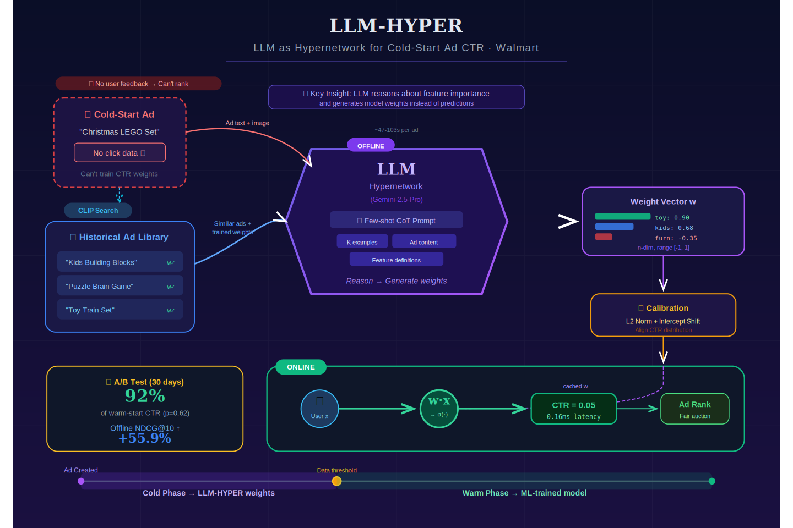
*图示：Walmart直接针对广告冷启动CTR建模的生产级论文，用LLM作为超网络为新广告生成线性CTR模型权重，已在美国头部电商平台上线部署，30天A/B实验达到暖启动模型92%的CTR表现，离线NDCG@10提升55.9%。*

**核心技术点：**

#### 技术点 1：LLM作为超网络生成线性权重
- 技术细节：对于每个冷启动广告r，系统构造一个prompt输入多模态LLM（如Gemini-2.5-Pro），LLM直接输出一个n维权重向量。CTR预测公式为：将该权重向量与用户特征向量做内积后过sigmoid得到点击率。关键点在于权重不是通过梯度训练得到的，而是LLM基于广告内容和用户特征定义一次性推理生成的。prompt包含三部分：少样本示例（相似历史广告及其已训练好的权重）、任务输入（用户特征定义和新广告的文本+图像描述）、生成准则（指导LLM推理用户意图、特征影响力，输出范围-1到1）。
- 通俗讲解：传统做法是收集用户点击数据后训练CTR模型权重，但冷启动广告没有数据。LLM-HYPER的做法是：告诉LLM这个广告长什么样、卖什么东西，同时告诉它用户特征的含义（比如'用户对玩具品类的参与度'），让LLM推理每个用户特征对这个广告的重要程度，直接输出一组数字作为模型权重。这些权重在广告上线前就生成好了，上线时直接拿来和用户特征做内积算分，延迟跟普通线性模型一样低。
- 例子：假设新广告是'儿童积木玩具套装'，用户特征有20维，其中一维是'玩具游戏品类参与度'。LLM看到广告标题和图片后，推理出这个特征和广告高度相关，给出权重0.95；而'户外家具偏好'这个特征与广告无关，给出权重-0.35。最终20维权重向量与每个用户的特征向量做内积、过sigmoid，就得到该用户对这个广告的预测CTR。整个线性推理耗时约0.16毫秒。

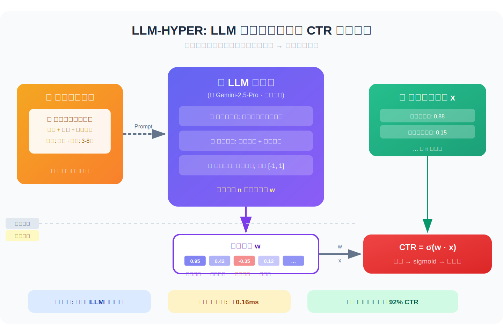
*图示：传统做法是收集用户点击数据后训练CTR模型权重，但冷启动广告没有数据。LLM-HYPER的做法是：告诉LLM这个广告长什么样、卖什么东西，同时告诉它用户特征的含义（比如'用户对玩具品类的参与度'），让LLM推理每个用户特征对这个广告的重要程度，直接输出一组数字作为模型权重。这些权重在广告上线前就生成好了，上线时直接拿来和用户特征做内积算分，延迟跟普通线性模型一样低。*

#### 技术点 2：多模态检索驱动的少样本CoT
- 技术细节：系统用CLIP将冷启动广告的文本和图片编码成向量，然后在历史已退役广告库中做最近邻检索（用Faiss），找到K个语义最相似的历史广告。这些历史广告已有通过传统监督学习训练好的线性模型权重。系统把这些历史广告的文本、图片、与新广告的相似度分数、以及它们的已训练权重一并放入prompt作为few-shot CoT示例。LLM据此进行类比推理：参考相似广告的权重分布，结合新广告内容差异，生成新广告的权重。实验表明5-shot效果最好，NDCG@10达0.0792，相比zero-shot的0.0677有明显提升。
- 通俗讲解：核心逻辑是'以旧带新'：找到过去跟新广告最像的几个老广告，这些老广告因为已经跑了一段时间有真实的训练好的权重。把这些老广告的信息和权重作为'参考答案'告诉LLM，让LLM照着这些例子来推断新广告的权重。相似度越高的老广告对新广告的参考价值越大，prompt里也把相似度分数告诉了LLM。
- 例子：新广告是'圣诞限定乐高套装'。CLIP检索出5个历史相似广告：'儿童积木玩具'（相似度0.92，玩具特征权重0.95）、'拼图益智游戏'（相似度0.87，玩具特征权重0.80）等。这些示例连同各自的完整权重向量一起放入prompt。LLM看到这些相似广告的玩具特征权重普遍在0.8-0.95，加上新广告本身也是玩具类，于是给出0.90的权重。如果去掉这些few-shot示例（zero-shot），LLM只能靠通用常识推断，准确度显著下降。

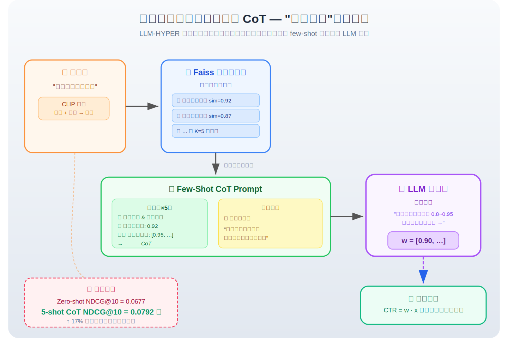
*图示：核心逻辑是'以旧带新'：找到过去跟新广告最像的几个老广告，这些老广告因为已经跑了一段时间有真实的训练好的权重。把这些老广告的信息和权重作为'参考答案'告诉LLM，让LLM照着这些例子来推断新广告的权重。相似度越高的老广告对新广告的参考价值越大，prompt里也把相似度分数告诉了LLM。*

#### 技术点 3：权重归一化与校准对齐
- 技术细节：LLM生成的原始权重向量先做L2归一化，将权重向量除以其范数，防止数值过大导致sigmoid饱和。然后做截距偏移校准：通过采样用户数据计算归一化权重与用户特征内积的分布，求一个偏移量delta，使得对所有用户的平均预测CTR等于alpha（alpha取自检索到的相似历史广告的平均预测概率）。这个偏移量通过数值方法求解。校准确保LLM生成的模型输出的CTR分布与线上已有暖启动模型的CTR分布对齐，可以无缝接入在线排序系统。
- 通俗讲解：LLM输出的权重数值范围不稳定，直接用会出问题：可能所有用户的预测CTR都接近1或者都接近0。归一化先把权重拉到统一尺度。校准则是找到一个全局偏移量，让这个冷启动模型的平均预测点击率和线上正常运转的暖启动模型保持一致。这样冷启动广告和暖启动广告的CTR分数可以在同一个排序池里公平比较，不会出现冷启动广告因为分数偏高或偏低而被异常排序。
- 例子：假设LLM为新广告生成的原始权重向量范数很大，导致内积值为5.0，sigmoid后预测CTR约0.99，明显偏高。L2归一化后内积值降到0.8。然后系统采样20万用户计算平均预测CTR为0.12，但相似历史广告的平均CTR是0.05，于是计算出一个负的偏移量delta=-1.2，加到内积上后平均预测CTR降到0.05，与线上分布对齐。

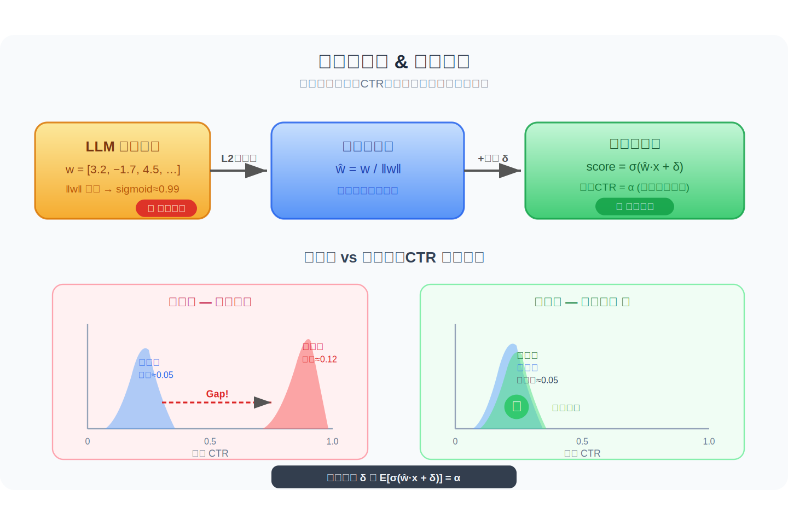
*图示：LLM输出的权重数值范围不稳定，直接用会出问题：可能所有用户的预测CTR都接近1或者都接近0。归一化先把权重拉到统一尺度。校准则是找到一个全局偏移量，让这个冷启动模型的平均预测点击率和线上正常运转的暖启动模型保持一致。这样冷启动广告和暖启动广告的CTR分数可以在同一个排序池里公平比较，不会出现冷启动广告因为分数偏高或偏低而被异常排序。*

#### 技术点 4：离线生成与在线解耦部署
- 技术细节：LLM推理在广告上线前离线完成，每个广告生成权重的平均耗时约47-103秒（取决于LLM选型）。生成好的权重向量存入缓存，在线排序时只做线性内积计算，平均延迟0.14-0.17毫秒，与传统线性模型完全一致。广告上线后逐渐积累用户反馈，达到暖启动条件后切换到传统ML训练的CTR模型。30天A/B测试中，LLM-HYPER的CTR为暖启动模型的92%，p值0.62（无统计显著差异）。
- 通俗讲解：这个设计把LLM的高延迟问题彻底解决了：LLM只在广告上线前跑一次，生成好权重就存起来。线上每次用户请求只做一个简单的向量点乘，跟没有LLM一样快。等广告积累了足够的点击数据，就切换回传统训练的模型。这相当于LLM只负责'冷启动过渡期'的权重初始化。
- 例子：某零售商的新年促销广告计划1月1日上线。12月30日，系统自动用Gemini-2.5-Pro为这批广告生成权重，每个广告约100秒，全部完成后推入缓存。1月1日广告上线后，用户请求到达时直接从缓存读权重、做内积打分，延迟0.16ms。1月3日起，这些广告已收集到足够点击数据，系统切换到传统ML模型。

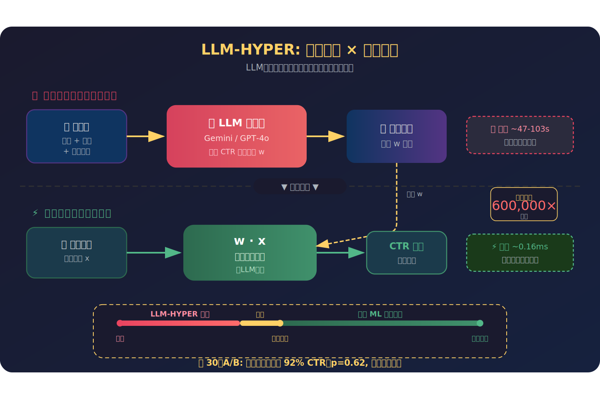
*图示：这个设计把LLM的高延迟问题彻底解决了：LLM只在广告上线前跑一次，生成好权重就存起来。线上每次用户请求只做一个简单的向量点乘，跟没有LLM一样快。等广告积累了足够的点击数据，就切换回传统训练的模型。这相当于LLM只负责'冷启动过渡期'的权重初始化。*

#### 技术点 5：可解释性与鲁棒性验证
- 技术细节：可解释性方面，营销专家为测试集广告标注了最重要的用户特征作为ground truth。评估指标包括：HR@5（ground truth特征是否出现在LLM生成的权重最大的前5个特征中，5-shot下达0.81）、Coverage@5（前5预测特征与ground truth的Jaccard重合度，5-shot下0.351）、一致性率（LLM文字推理的情感方向与数值权重的符号是否一致，所有配置下\>0.95）。鲁棒性方面，通过反事实实验修改广告标题（增强、削弱、中立化目标特征），验证LLM-HYPER是否相应调整权重方向。GPT-5.1在削弱场景下准确率达0.88。
- 通俗讲解：可解释性测试回答的是：LLM觉得重要的特征和人类专家觉得重要的是否一致。结果显示，LLM给出的权重排名前5的特征中，81%的情况包含了专家标注的关键特征。而且LLM文字推理说'这个特征很重要'时，给出的数值权重确实也大，两者高度一致。鲁棒性测试则验证：如果把'户外家具'的广告标题改成'户外烧烤派对装备'（增强运动特征），对应特征的权重确实会升高；改成无关内容则降低。这说明LLM不是随便猜数字，而是真正在做语义推理。
- 例子：原始广告是'庭院花园家具'，目标特征是'户外运动偏好'，原始权重0.192。增强版改为'比赛日升级：庭院烧烤派对'，权重升至0.735（+0.543）。削弱版改为'秋季排水沟与屋顶维护'，权重从3.750降至1.150（-2.600）。中立版改为'日常必需品'，权重从1.055微降至0.975。三种方向的权重变化都与语义修改方向一致。

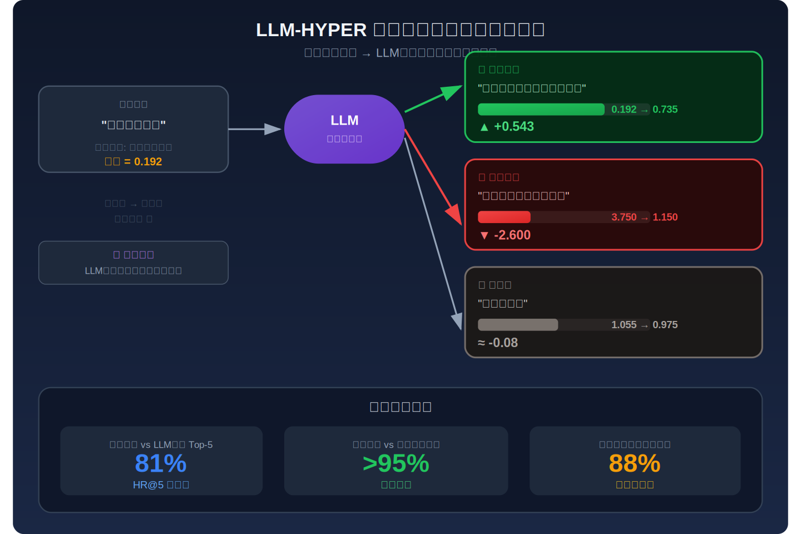
*图示：可解释性测试回答的是：LLM觉得重要的特征和人类专家觉得重要的是否一致。结果显示，LLM给出的权重排名前5的特征中，81%的情况包含了专家标注的关键特征。而且LLM文字推理说'这个特征很重要'时，给出的数值权重确实也大，两者高度一致。鲁棒性测试则验证：如果把'户外家具'的广告标题改成'户外烧烤派对装备'（增强运动特征），对应特征的权重确实会升高；改成无关内容则降低。这说明LLM不是随便猜数字，而是真正在做语义推理。*

- **对广告的启发：** 最适合层级：冷启动广告CTR排序的权重初始化层；价值：这是一个直接的广告冷启动解决方案，核心价值在于：(1)利用LLM的多模态推理能力为新广告快速生成CTR模型参数，将冷启动期从数天缩短到上线前即就绪；(2)生成的是线性模型权重，完全兼容现有工业排序系统的低延迟要求（0.16ms）和可解释性审计需求；(3)架构设计上将LLM推理与在线serving完全解耦，不增加线上计算成本；(4)已在Walmart首页广告排序中部署验证，30天A/B测试CTR达暖启动模型的92%。该方案可直接迁移到任何有冷启动问题的广告排序场景，特别适合促销节奏快、广告素材频繁更换的电商和零售平台。；风险：主要风险包括：(1)LLM生成权重的质量高度依赖于历史相似广告库的覆盖度和CLIP检索质量，如果新广告类型完全无历史对标，效果可能退化；(2)权重校准依赖相似广告的平均CTR作为锚点，如果分布漂移严重，校准可能失效；(3)当前仅验证了线性CTR模型的权重生成，扩展到深度模型的复杂层权重生成是否可行尚未验证；(4)不同LLM后端（如GPT-4o vs Gemini-2.5-Pro）的权重生成质量差异明显，对LLM选型有依赖；(5)论文报告的数据集规模相对较小（675个广告），泛化性还需更大规模验证。

### 2. Efficiency of Proportional Mechanisms in Online Auto-Bidding Advertising
- **背景：** 在线广告平台中，自动出价代理替广告主完成复杂的竞价决策，但多个优化目标各异的代理同时博弈会导致系统均衡效率下降。衡量这种效率损失的核心指标是'无政府代价'(PoA)——最优社会福利与均衡福利之比。此前在多种拍卖格式（首价、次价等）中，PoA=2一直是难以突破的壁垒，且已有不可能性结果表明在一类自然性质的随机机制下不可能做得更好。本文在比例机制框架下，首先证明了标准比例机制PoA恰好为2的紧界，然后通过设计新的支付方案将PoA降到1+O(1/(n-1))，当广告主数量增多时趋近于完全效率，这是第一个在一般凹值函数和混合代理类型设定下突破PoA=2壁垒的机制。
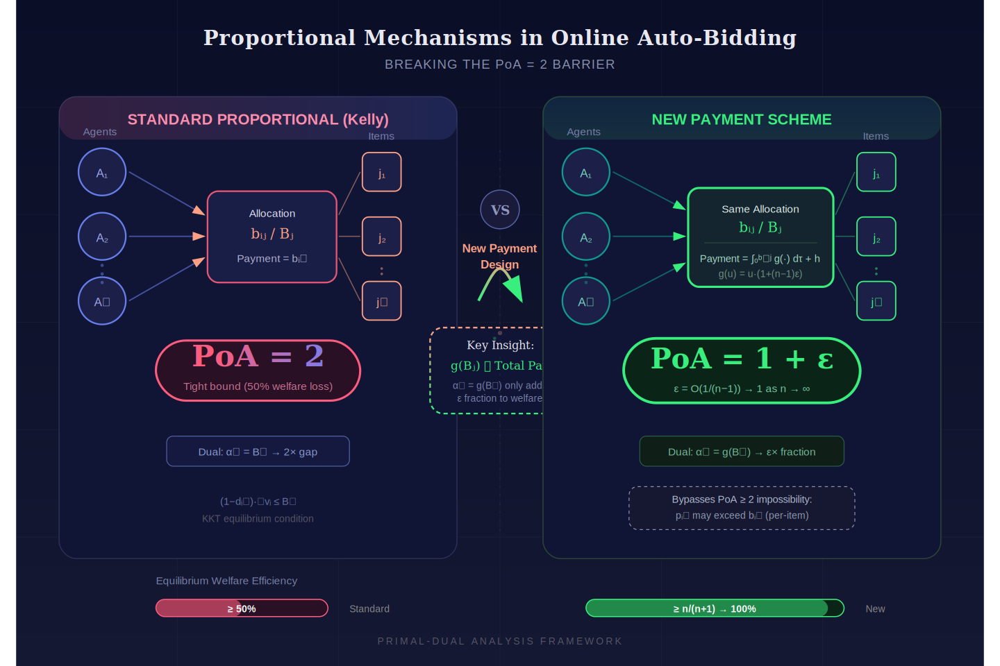
*图示：本文直接研究在线自动出价广告中比例机制的均衡效率，证明了标准比例机制的PoA紧界为2，并提出一种新支付方案使PoA降至1+O(1/(n-1))，突破了自动出价领域长期存在的PoA=2的效率壁垒，是广告竞价机制设计的核心理论贡献。*

**核心技术点：**

#### 技术点 1：标准比例机制PoA紧界为2
- 技术细节：论文考虑n个代理、m个可分物品的比例分配机制（Kelly机制），每个代理i对物品j出价bij，获得bij/(b1j+...+bnj)的份额，支付等于出价。代理目标可以是效用最大化（价值减支付）、价值最大化、或混合目标，并受预算约束和花费回报率(RoS)约束。论文的目标函数是液态福利——每个代理价值与其预算取较小者之和。作者利用KKT条件刻画均衡结构，得到关键不等式：(1-dij)\*偏导vi \<= Bj（即物品j的总出价）。然后构造配置整数规划的对偶LP，为每个物品j设对偶变量alphaJ=Bj，为每个代理i设betaI（价值最大化代理取min(Wi,vi)，效用最大化代理取一个与均衡分配和梯度相关的表达式）。通过验证对偶可行性和对偶目标不超过均衡液态福利的2倍，证明PoA上界为2，结合已知下界得紧界。
- 通俗讲解：比例机制下，你出价越高，拿到的物品份额越大，但你也花得越多。在均衡时，每个代理都不想单方面偏离。作者找到了一种记账方式（对偶变量），把'理论最优配置能带来多少福利'用均衡时的出价总额来上界，发现无论怎么分配，均衡福利最差只会是最优的一半。也就是说标准Kelly机制的效率损失最多50%。
- 例子：假设两个广告主竞争一个广告位，广告主A出价60、B出价40，A得到60%的展示份额。在均衡中，A的边际价值乘以(1-0.6)不超过总出价100。对偶变量alpha设为100，再加上每个代理的beta项（与各自价值和预算有关），最终对偶目标（最优福利的上界）不超过均衡液态福利的2倍，所以PoA\<=2。

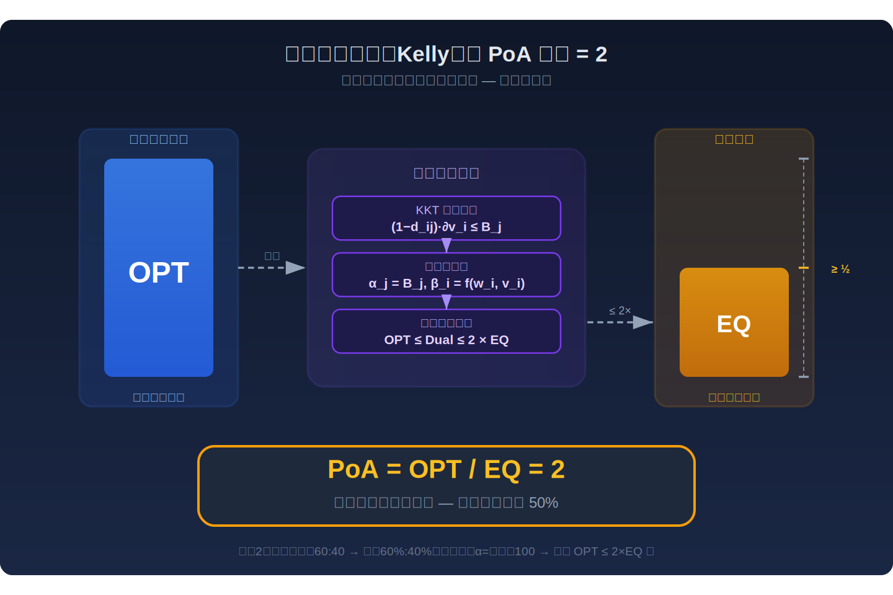
*图示：比例机制下，你出价越高，拿到的物品份额越大，但你也花得越多。在均衡时，每个代理都不想单方面偏离。作者找到了一种记账方式（对偶变量），把'理论最优配置能带来多少福利'用均衡时的出价总额来上界，发现无论怎么分配，均衡福利最差只会是最优的一半。也就是说标准Kelly机制的效率损失最多50%。*

#### 技术点 2：新支付方案突破PoA=2壁垒
- 技术细节：核心创新在于重新设计支付函数。新支付pij由一个积分项和一个附加项组成，其中关键函数g(u)=u (1+(n-1)\*epsilon)，epsilon\>=1/(n-1)。积分项是对出价bij从0积分到bij，被积函数涉及g在总出价处的值除以总出价的平方；附加项h等于g(除i外出价之和)/((n-1)\*epsilon\*除i外出价之和)。这个设计的关键性质是：所有代理在物品j上的总支付恰好等于g(Bj)/epsilon（Lemma 2）。对偶变量alphaJ设为g(Bj)而非Bj，betaI对所有代理统一为max(Wi, vi-梯度修正项)。对偶目标 = sum(g(Bj)) + sum(betaI) \<= epsilon\*sum(总支付) + sum(min(Wi,vi)) \<= (1+epsilon)\*均衡液态福利。因此PoA \<= 1+epsilon = 1+O(1/(n-1))。
- 通俗讲解：标准机制中支付等于出价，对偶变量alpha等于总出价Bj，导致2倍损失。新方案的精妙之处在于：通过把支付函数设计成一个幂函数积分形式，使得'用于对偶上界的量g(Bj)'只占实际总支付的一个小比例epsilon。这样对偶目标里的'物品贡献'部分就变得很小，只增加了epsilon倍的均衡福利，整体PoA就从2降到了1+epsilon。当代理数n很大时，epsilon可以取1/(n-1)，PoA趋近于1。
- 例子：10个广告主竞争，取epsilon=1/9。对某物品总出价Bj=90，g(Bj)=90 (1+1)=8100，而该物品总支付=g(Bj)/epsilon=8100\*9=72900——看起来很大，但关键是g(Bj)只是总支付的1/9。对偶目标中物品j贡献8100，而均衡福利中对应的支付贡献72900被RoS和预算约束保证不超过代理价值。最终对偶目标不超过(1+1/9)\*均衡液态福利，PoA约1.11。

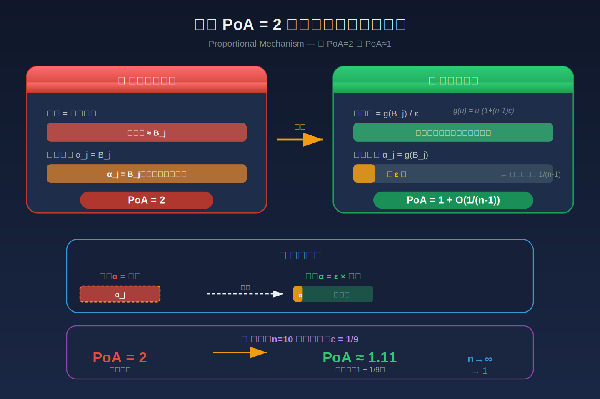
*图示：标准机制中支付等于出价，对偶变量alpha等于总出价Bj，导致2倍损失。新方案的精妙之处在于：通过把支付函数设计成一个幂函数积分形式，使得'用于对偶上界的量g(Bj)'只占实际总支付的一个小比例epsilon。这样对偶目标里的'物品贡献'部分就变得很小，只增加了epsilon倍的均衡福利，整体PoA就从2降到了1+epsilon。当代理数n很大时，epsilon可以取1/(n-1)，PoA趋近于1。*

#### 技术点 3：绕过不可能性结果的关键
- 技术细节：此前Liaw等人证明了一类满足'支付不超过出价'性质的随机机制PoA下界为2，Caragiannis和Voudouris证明了一般凹值函数下资源分配机制PoA不可能好于2。本文新支付方案中pij可以超过bij（虽然总支付仍受预算和RoS约束），从而不属于上述不可能性结果的适用范围。论文还进一步提出一个修正机制：将原始出价减去一个阈值1/((n-1)\*epsilon)后缩放，使得修正后的支付确实不超过原始出价（Lemma 4），同时仍保持PoA=1+epsilon的效率保证。
- 通俗讲解：之前的不可能性定理说'如果每次支付不能超过你的出价，那PoA至少是2'。本文的新支付方案允许单次支付超过出价（但总花费仍在预算和价值范围内），从而跳出了这个限制。同时作者也给出了一个实用的修正版本：先把出价做一个截断和缩放处理（类似设定一个最低出价门槛），处理后的机制既满足支付不超过出价，又能保持接近完全效率。
- 例子：广告主出价bij=5，但新支付方案算出pij=6——单次支付超过了出价，这在传统机制中不允许。修正版本中，平台先把出价减去一个小阈值（比如1），再缩放：修正出价=(5-1)/(n\*W)，在修正出价上运行新支付方案，此时支付不超过原始出价5，且PoA仍为1+O(1/(n-1))。

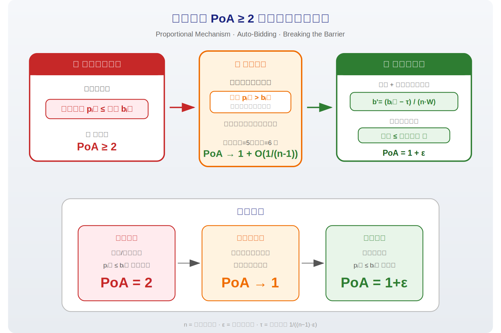
*图示：之前的不可能性定理说'如果每次支付不能超过你的出价，那PoA至少是2'。本文的新支付方案允许单次支付超过出价（但总花费仍在预算和价值范围内），从而跳出了这个限制。同时作者也给出了一个实用的修正版本：先把出价做一个截断和缩放处理（类似设定一个最低出价门槛），处理后的机制既满足支付不超过出价，又能保持接近完全效率。*

#### 技术点 4：原始-对偶分析方法论
- 技术细节：论文将拍卖师的最优分配问题建模为一个配置整数规划：决策变量zS表示是否选择分配方案S，目标最大化液态福利。放松整数约束后取对偶LP，对偶变量alphaJ对应每个物品的分配约束，beta对应方案选择约束。对偶目标sum(alphaJ)+beta是最优液态福利的上界（弱对偶）。在给定均衡下，利用KKT条件推导的均衡性质来构造可行对偶解，再证明对偶目标与均衡福利的比值不超过目标PoA，从而完成上界证明。
- 通俗讲解：这个方法的思路是：先写出'如果上帝知道所有信息，最优分配能获得多少福利'的数学规划，再用对偶理论找到一个上界。然后在均衡解的基础上，利用'没有代理想偏离'所隐含的数学条件（KKT条件），反向构造出满足对偶约束的变量值。最后比较这个上界和均衡福利，就得到了PoA的界。整个方法只需要凸优化的基本工具，概念上简洁但效果很强。
- 例子：在均衡中，广告主A对物品1的KKT条件告诉我们：A的边际价值乘以(1-份额)不超过g(总出价)。这个不等式恰好就是对偶约束所需的条件——把alphaJ设为g(总出价)、betaI设为价值减梯度修正项，就自动满足了'任意分配方案的福利不超过对偶目标'这个要求。

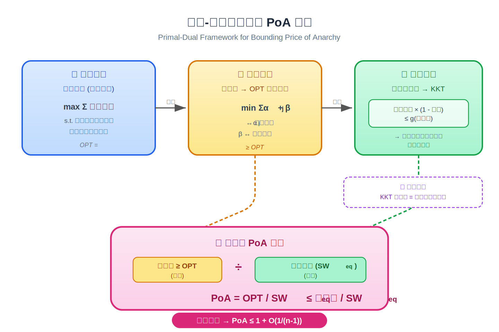
*图示：这个方法的思路是：先写出'如果上帝知道所有信息，最优分配能获得多少福利'的数学规划，再用对偶理论找到一个上界。然后在均衡解的基础上，利用'没有代理想偏离'所隐含的数学条件（KKT条件），反向构造出满足对偶约束的变量值。最后比较这个上界和均衡福利，就得到了PoA的界。整个方法只需要凸优化的基本工具，概念上简洁但效果很强。*

- **对广告的启发：** 最适合层级：广告竞价机制设计层；价值：本文为广告平台设计自动出价拍卖机制提供了直接的理论指导。核心启示是：通过精心设计支付函数（而非仅调整分配规则），可以在比例机制框架下将系统效率损失从50%降低到几乎为零。这对大规模广告平台（广告主数量n很大）尤其有价值，因为PoA=1+O(1/(n-1))意味着参与者越多效率越高。修正机制还提供了一种实用的'出价门槛+缩放'方案，可作为实际平台竞价规则设计的理论参考。；风险：论文结果基于纯Nash均衡分析，实际广告市场中均衡可能不存在或不唯一，且代理可能使用非均衡策略。新支付方案的计算复杂度和对广告主的可解释性需要进一步评估。此外，论文假设值函数连续可微凹，而实际广告场景中的值估计噪声、离散性等问题未被考虑。修正机制中的参数W需要公开已知，这在实际中可能难以精确确定。

## 六、候选但未完成深读的论文

当前重点论文都已完成可用分析。
