# 2026-04-16 论文日报

## 一、今日趋势与创新观察

### 1. 趋势概况

- 今天 320 篇论文中，LLM 与语言理解仍然是最大主题（66 篇），但重心已从单纯的语言能力评测转向 LLM 在具体业务场景中的落地，比如本地生活推荐的 Agentic Reasoning、业务流程建模等。
- Agent 与多智能体方向（37 篇）是第二大主题，涵盖多智能体辩论对齐、Agent 驱动的自动化微调探索等，说明社区正在从 Agent 概念验证走向可控性和协作机制的工程化。
- 表示学习与检索排序（19 篇）虽然数量不算最多，但质量密度较高：序列推荐里出现了多种新的 Embedding 时间编码和多视图融合方案，检索侧出现了混合检索融合与多样性重排的系统化比较，以及生成式检索中语义 ID 过时问题的专项研究。
- 跨域泛化与联邦推荐出现了值得注意的信号——联邦框架用于跨市场序列推荐、编码 Agent 的跨域记忆迁移等，反映出'在隐私约束下复用跨域知识'正在成为推荐系统的一个稳定研究方向。

### 2. 推荐系统 / 排序相关创新点

- Hybrid Retrieval 这篇把 Rank Fusion 和 Projection Fusion 两条混合检索路线在同一评测协议下做了正面对比，并叠加 Diversity Reranking，为工业检索系统选择融合策略提供了直接参考。
- TokenFormer 尝试将多域特征建模和序列推荐统一到同一个 Token 化框架下，让传统 CTR 模型的 field-level 交叉和序列模型的 item-level 建模共享同一套注意力骨架，思路清晰且对工业多场景统一模型有启发。
- RoTE 提出了多级旋转时间嵌入（Coarse-to-Fine Rotary Time Embedding），把 RoPE 思想从 NLP 迁移到序列推荐的时间维度，用不同频率层级捕捉长短期兴趣，是时间位置编码在推荐场景的一次有趣变体。

### 3. 全局创新点

- Dual-Enhancement Product Bundling 将交互图上的协同信号和 LLM 的语义推理能力双向增强，用图结构给 LLM 提供结构化证据、用 LLM 给图补充语义边，是图+LLM 双通道融合的一个干净范例。
- Lossless Prompt Compression 通过字典编码对重复数据做无损压缩再送入 LLM，在保持输出一致的前提下大幅降低 token 开销，对任何需要大批量调用 LLM 的系统（包括广告创意批量生成）都有直接的成本意义。
- Mitigating Collaborative Semantic ID Staleness 专门研究生成式检索中语义 ID 随时间腐化的问题，提出了在线增量更新 ID 体系的思路，把'检索系统的实时性'从索引层面拉到了 ID 表示层面，视角新颖。

## 二、今日一个 AI 知识点

### 表示学习（Representation Learning）为什么是推荐、检索、广告系统的隐形底座

今天的候选论文里，不管是序列推荐里的多视图对比学习、旋转时间嵌入，还是混合检索中的 Projection Fusion，甚至生成式检索中语义 ID 的更新问题，它们表面上各做各的，但核心战场都在同一层：怎么把用户、物品、查询这些原始信息编码成一个好用的向量。这就是表示学习。整个过程可以这样一步一步理解：首先，系统收到一条原始输入——可能是用户最近点击的 20 个商品序列、一个搜索 query、或者一个广告的多域特征（类目、出价、标题等）。第二步，一个编码器（可以是 Transformer、图网络、甚至就是一张 Embedding 查找表）把这些离散、异构的原始信号压缩成一根固定长度的向量，这根向量就是这个对象在'表示空间'里的坐标。第三步也是最关键的一步：训练目标决定了这个空间长什么样。如果你用对比学习，比如把同一个用户点过的两个商品拉近、没点过的推远，那空间就会按兴趣聚类；如果你用下一个点击预测，空间就会按行为序列的因果关系组织。不同训练信号雕刻出不同形状的空间，而下游的召回、排序、重排其实都是在这个空间里做距离计算或打分。这就是为什么今天一篇论文换了时间编码方式（RoTE）、另一篇换了融合策略（Projection Fusion vs Rank Fusion），效果就能差出好几个点——它们改的不是排序公式本身，而是排序公式赖以运行的那张地图。理解了这一点，你再看任何推荐或检索论文，第一件事就可以问：它到底改了表示空间的哪一层？是改了输入编码、改了训练目标、还是改了空间的更新频率？抓住这条线，大部分论文的创新定位就能一眼看清。

## 三、今日论文总览

### 1. Hybrid Retrieval for COVID-19 Literature: Comparing Rank Fusion and Projection Fusion with Diversity Reranking
- 挑选理由：命中强迁移信号：ranking, reranking, retrieval。

### 2. DUET: Joint Exploration of User Item Profiles in Recommendation System
- 挑选理由：命中强迁移信号：recommendation, system。

### 3. From Transfer to Collaboration: A Federated Framework for Cross-Market Sequential Recommendation
- 挑选理由：命中强迁移信号：recommendation, framework。

### 4. Dual-Enhancement Product Bundling: Bridging Interactive Graph and Large Language Model
- 挑选理由：商品捆绑推荐与电商广告商品组合有一定迁移性，但无直接广告语义

### 5. A Comparative Study of Dynamic Programming and Reinforcement Learning in Finite Horizon Dynamic Pricing
- 挑选理由：动态定价与广告出价/预算控制存在一定同构性，RL用于有限时间段定价优化

## 四、补充关注

1. **ID and Graph View Contrastive Learning with Multi-View Attention Fusion for Sequential Recommendation**
   - 理由：有一定相关信号，但不足以进入正式候选：recommendation。
2. **Driving Engagement in Daily Fantasy Sports with a Scalable and Urgency-Aware Ranking Engine**
   - 理由：有一定相关信号，但不足以进入正式候选：ranking。
3. **TokenFormer: Unify the Multi-Field and Sequential Recommendation Worlds**
   - 理由：有一定相关信号，但不足以进入正式候选：recommendation。
4. **RecNextEval: A Reference Implementation for Temporal Next-Batch Recommendation Evaluation**
   - 理由：有一定相关信号，但不足以进入正式候选：recommendation。
5. **From Relevance to Authority: Authority-aware Generative Retrieval in Web Search Engines**
   - 理由：有一定相关信号，但不足以进入正式候选：retrieval。
6. **RoTE: Coarse-to-Fine Multi-Level Rotary Time Embedding for Sequential Recommendation**
   - 理由：有一定相关信号，但不足以进入正式候选：recommendation。
7. **Mitigating Collaborative Semantic ID Staleness in Generative Retrieval**
   - 理由：有一定相关信号，但不足以进入正式候选：retrieval。

## 五、重点论文精读

### 1. Hybrid Retrieval for COVID-19 Literature: Comparing Rank Fusion and Projection Fusion with Diversity Reranking
- **背景：** COVID-19大流行产生了海量科学文献，单纯关键词检索会漏掉语义相关论文，而语义检索的top结果又常出现近似重复，缺乏多样性。论文在TREC-COVID基准(17万篇论文、50条专家查询)上构建了六种检索配置，系统对比了稀疏检索(SPLADE)、稠密检索(BGE)、排名级融合(RRF)和一种基于随机投影的向量级融合(B5)方法，并用MMR做多样性重排。这套'召回-融合-重排'实验框架与广告系统的多路召回、融合排序、多样性打散高度同构，其中投影融合以单次查询实现33%加速和2.2倍多样性提升的结论尤其值得关注。
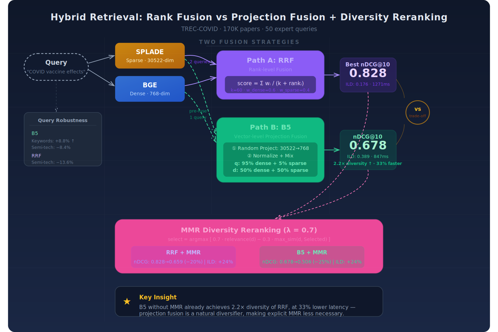
*图示：论文系统比较了混合检索中排名融合(RRF)与投影融合(B5)两种策略，并引入MMR多样性重排，对广告系统中召回-融合-重排全链路有直接迁移价值，特别是投影融合的低延迟高多样性特性适用于广告候选集召回场景。*

**核心技术点：**

#### 技术点 1：RRF两路融合效果最优
- 技术细节：RRF融合(B4)先用SPLADE和BGE分别检索各50个候选，再用RRF公式合并：每个文档的融合分等于各路权重除以(60加上该文档在该路的排名)之和，dense路权重0.6、sparse路权重0.4。在专家查询上nDCG@10达到0.828，比纯稠密高6.1%，比纯稀疏高14.9%。在全部四组使用分级相关性标注的查询集上，RRF均为最优。
- 通俗讲解：RRF的核心思路是：不去校准两路的原始分数(因为SPLADE和BGE的分数量纲完全不同)，而是只看排名。排名越靠前的文档获得越高的融合分。常数k=60起到一个平滑作用，防止第一名和第二名的差距被放大过度。两路各取50个候选再合并，既能捕捉精确词匹配，又能捕捉语义近义，因此效果最好。
- 例子：假设查询'新冠疫苗副作用'，SPLADE因精确匹配把文档A排第2、文档B排第8；BGE因语义理解把文档C排第1、文档A排第5。RRF对文档A的得分=0.4/(60+2)+0.6/(60+5)=0.00645+0.00923=0.01568，对文档C的得分=0.6/(60+1)+0(不在稀疏top50)=0.00984。文档A因为在两路都出现而排到融合列表更前面。

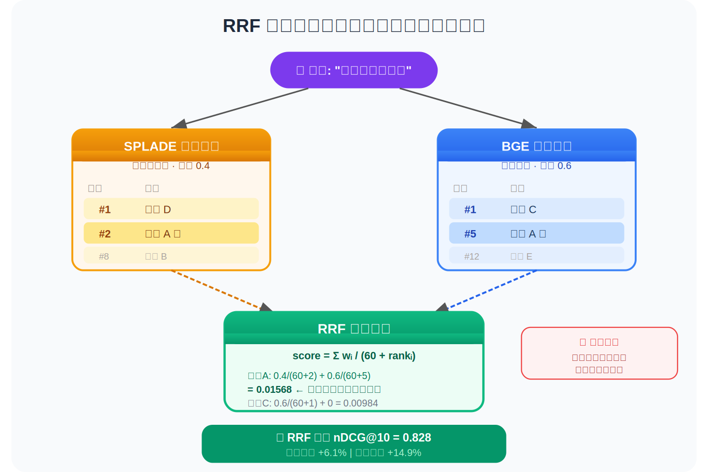
*图示：RRF的核心思路是：不去校准两路的原始分数(因为SPLADE和BGE的分数量纲完全不同)，而是只看排名。排名越靠前的文档获得越高的融合分。常数k=60起到一个平滑作用，防止第一名和第二名的差距被放大过度。两路各取50个候选再合并，既能捕捉精确词匹配，又能捕捉语义近义，因此效果最好。*

#### 技术点 2：投影融合B5：单次查询换速度与多样性
- 技术细节：B5在检索前就把稀疏和稠密向量融合成一个768维向量。具体流程：先用BGE编码得到768维稠密向量d，再用SPLADE编码得到30522维稀疏向量s；用Achlioptas稀疏随机投影矩阵(768x30522，三分之二元素为零，非零元素为正负根号3)将s投影到768维得到p，L2归一化后与归一化的d按权重混合(查询端alpha=0.95即95%稠密+5%投影，文档端alpha=0.50即各半)，再L2归一化，最后对预构建的B5索引做单次点积查询。
- 通俗讲解：RRF需要对Pinecone发两次查询再做排名合并，B5则把两种信号在向量空间里预先拌在一起，只需一次查询。关键在于SPLADE输出的稀疏向量有30522维(对应BERT词表)，没法直接和768维的BGE向量相加，所以用一个随机矩阵把它'压'到768维。Johnson-Lindenstrauss理论保证这种随机投影大致保持文档间的距离关系。压完之后两个同维向量加权平均就行了。
- 例子：同一条查询，BGE编码耗时约X毫秒得到768维向量d，SPLADE编码得到稀疏向量s(假设只有200个非零维度)。用稀疏矩阵乘法把s映射到768维向量p(因矩阵三分之二为零所以很快)，归一化后按0.95\*d+0.05\*p混合，归一化得到最终查询向量q。对B5索引做一次点积检索返回top50，总耗时847ms vs RRF的1271ms，同时ILD@10从0.176跳到0.389。

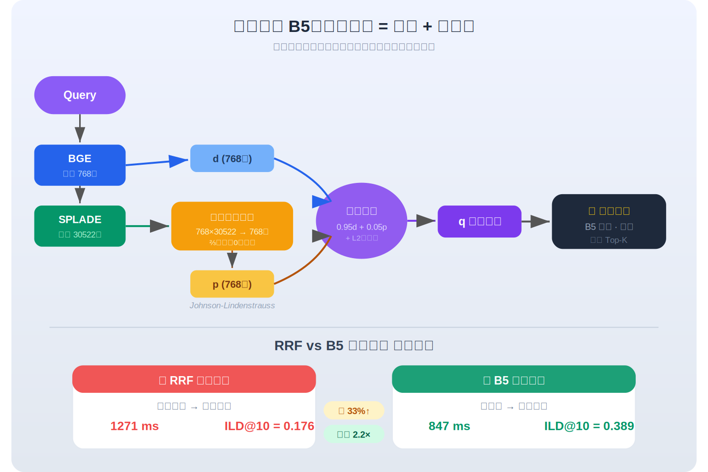
*图示：RRF需要对Pinecone发两次查询再做排名合并，B5则把两种信号在向量空间里预先拌在一起，只需一次查询。关键在于SPLADE输出的稀疏向量有30522维(对应BERT词表)，没法直接和768维的BGE向量相加，所以用一个随机矩阵把它'压'到768维。Johnson-Lindenstrauss理论保证这种随机投影大致保持文档间的距离关系。压完之后两个同维向量加权平均就行了。*

#### 技术点 3：MMR多样性重排的代价量化
- 技术细节：MMR以lambda=0.7迭代选文档：每步选使得(0.7\*与查询相关度 - 0.3\*与已选集合中最相似文档的相似度)最大的文档。在RRF上加MMR，ILD@10从0.176升至0.219(+24.5%)，但nDCG@10从0.828降至0.659(-20.4%)。在B5上加MMR，ILD@10从0.389升至0.481(+23.8%)，nDCG@10从0.678降至0.506(-25.4%)。
- 通俗讲解：MMR每次不是直接选最相关的文档，而是在相关性和'与已选文档不同'之间做权衡。lambda=0.7意味着七分看相关、三分看差异。有趣的是B5不加MMR时多样性已经是RRF的2.2倍，说明投影融合本身就天然把结果'打散'了。而MMR无论加在哪条管线上，都会付出约20-25%的相关性代价。
- 例子：假设RRF返回top50候选，MMR第一步选最相关的文档D1；第二步对剩余49篇，计算0.7\*relevance(Di) - 0.3\*max-sim(Di, (D1))，选出D2——它可能相关性排第3但与D1内容差异大；依此迭代选够10篇。最终列表中近似重复被抑制，但一些高度相关但彼此相似的论文被换掉了。

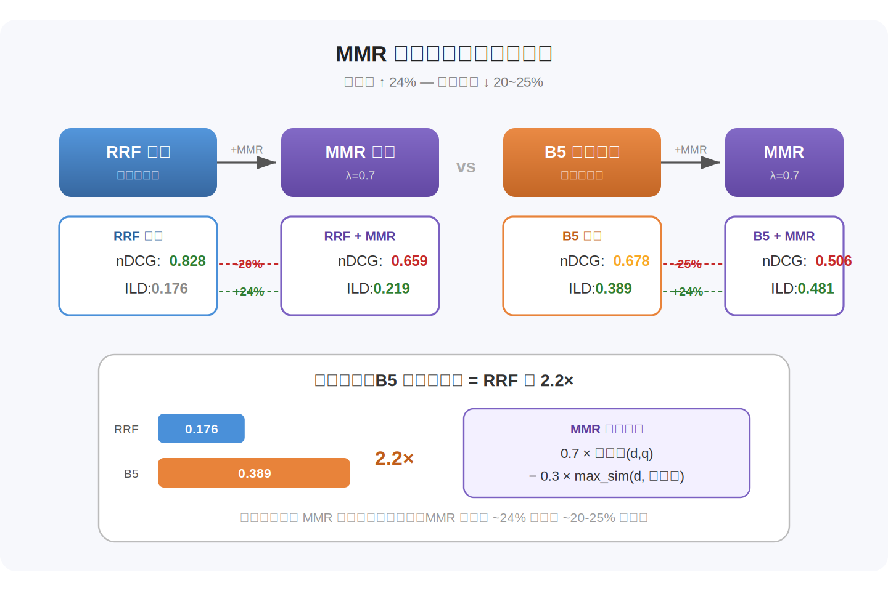
*图示：MMR每次不是直接选最相关的文档，而是在相关性和'与已选文档不同'之间做权衡。lambda=0.7意味着七分看相关、三分看差异。有趣的是B5不加MMR时多样性已经是RRF的2.2倍，说明投影融合本身就天然把结果'打散'了。而MMR无论加在哪条管线上，都会付出约20-25%的相关性代价。*

#### 技术点 4：查询改写鲁棒性：B5在关键词风格上最稳
- 技术细节：论文用Claude生成三种风格的查询改写(对话式A、半技术B、关键词式C)并继承原始相关性标注。关键发现：在关键词式改写上B5相对原始查询nDCG@10反而提升了8.8%(从0.678到0.737)，是所有系统中相对增益最大的；在半技术改写上B5仅下降8.4%，也是最稳定的。RRF在绝对值上仍最优但在半技术改写上下降了13.6%。
- 通俗讲解：不同用户的查询风格差异很大，有人写长句，有人只敲关键词。B5因为融合了SPLADE的精确匹配信号和BGE的语义信号到同一个向量里，在关键词式查询中两种信号协同更好。而RRF的两路是独立检索后再合并，如果某一路对某种查询风格表现不佳，融合也会被拖累。
- 例子：原始专家查询'coronavirus origin'改写为关键词式'coronavirus origin bat transmission zoonotic'。B5的SPLADE分量能精确匹配bat、zoonotic等术语，BGE分量捕捉整体语义，投影融合后的向量同时包含这两种信息，单次查询就能检索到更多相关文档，nDCG@10从0.678升至0.737。

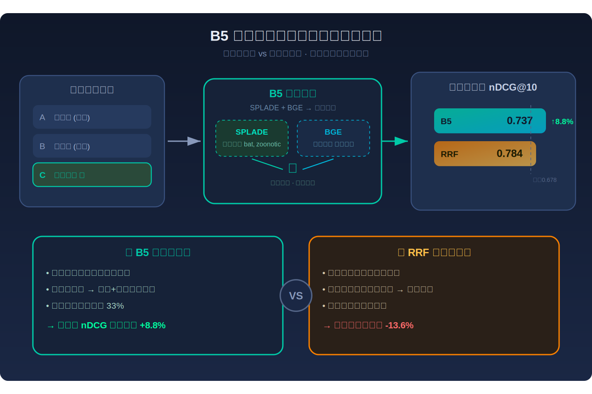
*图示：不同用户的查询风格差异很大，有人写长句，有人只敲关键词。B5因为融合了SPLADE的精确匹配信号和BGE的语义信号到同一个向量里，在关键词式查询中两种信号协同更好。而RRF的两路是独立检索后再合并，如果某一路对某种查询风格表现不佳，融合也会被拖累。*

#### 技术点 5：查询端与文档端混合权重的非对称调优
- 技术细节：B5的文档端固定alpha-doc=0.50(稠密和投影各半)索引一次，查询端alpha-query独立调节无需重新索引。消融实验显示alpha-query从0.50到0.95，nDCG@10从0.475升至0.678；alpha-query=0.95略优于1.00(+0.19%)，说明保留极少量投影分量仍有帮助。作者强调这并非证明投影融合优于纯稠密基线，因为文档端始终是混合的。
- 通俗讲解：这个设计的巧妙之处在于：文档向量只需编码索引一次(成本高)，而查询向量每次在线计算(成本低)，所以把可调参数放在查询端。文档用一半一半的平衡配比保证索引中同时蕴含词汇和语义信息；查询端则大幅偏向稠密(95%)，只留5%的投影分量做微调补充。这种非对称策略兼顾了索引效率和检索质量。
- 例子：索引17万文档时用alpha-doc=0.50，每篇文档的向量=0.5\*BGE向量+0.5\*投影后SPLADE向量。上线后发现某类查询效果不好，只需调整alpha-query从0.80改到0.95，无需重建索引，就能把nDCG@10从0.627提升到0.678。

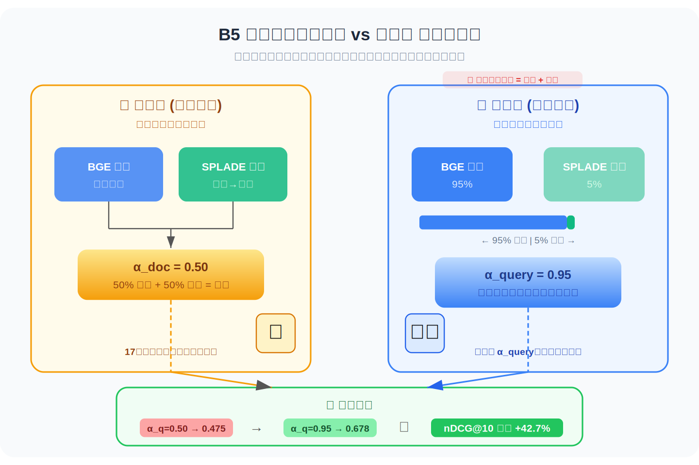
*图示：这个设计的巧妙之处在于：文档向量只需编码索引一次(成本高)，而查询向量每次在线计算(成本低)，所以把可调参数放在查询端。文档用一半一半的平衡配比保证索引中同时蕴含词汇和语义信息；查询端则大幅偏向稠密(95%)，只留5%的投影分量做微调补充。这种非对称策略兼顾了索引效率和检索质量。*

- **对广告的启发：** 最适合层级：多路召回融合与候选集多样性打散；价值：广告系统的召回层通常也有稠密向量召回(如双塔模型)和稀疏召回(如倒排索引匹配)两路，本文的RRF和B5投影融合提供了两种可落地的融合范式。RRF适合效果优先场景(如品牌广告精准召回)，B5投影融合适合延迟敏感且需要候选多样性的场景(如信息流广告需要品类打散)。投影融合将两路信号压缩到同一向量空间用单次ANN查询替代两次，可直接降低在线召回延迟约27-33%。MMR的多样性-相关性trade-off量化(约24%多样性提升换20-25%相关性损失)也为广告混排中的多样性策略提供了定量参考。非对称alpha调优思路(文档端固定、查询端灵活)可迁移至广告双塔模型的在线serving。；风险：B5投影融合在绝对相关性上比RRF低约18%，在广告场景中可能影响CTR/CVR等核心指标。随机投影矩阵未经学习，用于广告商品向量时效果无保证，需用有监督方式训练投影矩阵。此外实验仅在TREC-COVID单一基准上验证，向广告商品检索的泛化性存在不确定性。MMR的relevance损失在广告场景中直接对应收入损失，需要更精细的lambda调参。

### 2. DUET: Joint Exploration of User Item Profiles in Recommendation System
- **背景：** 传统推荐系统用稠密向量表示用户和物品，缺乏可解释性；近年LLM-based推荐系统尝试用自然语言画像替代向量，但存在两个关键问题：一是画像通常依赖人工设计的固定模板，难以自适应优化；二是用户画像和物品画像独立生成，容易出现语义不匹配（例如同一用户被概括为'重金属粉丝'而物品被概括为'流行摇滚'，掩盖了两者在funk风格上的真实关联）。DUET提出联合生成用户-物品画像并用下游推荐效果作为RL奖励来优化画像生成策略，在三个公开数据集上显著超越现有方法，值得关注。
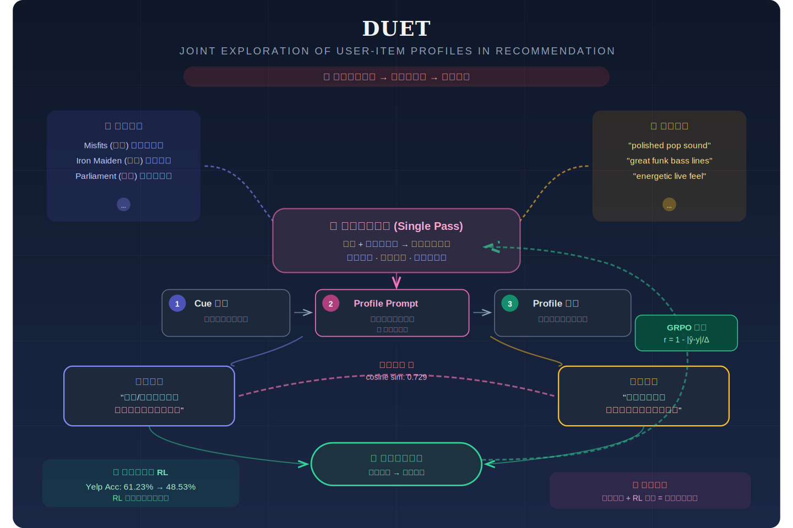
*图示：该论文提出DUET框架，通过联合生成用户和物品的文本画像并用强化学习对齐，解决推荐系统中画像语义不匹配问题。其核心思想——用RL驱动的联合画像生成取代固定模板、在共享语义空间对齐用户与物品表示——可直接迁移到广告系统中的用户理解、广告创意匹配和CTR预估等场景。*

**核心技术点：**

#### 技术点 1：联合画像生成取代独立生成
- 技术细节：DUET将用户历史和物品历史作为联合输入，在单次序列生成中同时产出用户画像和物品画像。具体地，模型的状态定义为用户交互历史和物品交互历史的组合，动作是一次性生成的六元组：用户线索、用户profile prompt、用户画像、物品线索、物品profile prompt、物品画像。这种联合条件生成使得两侧画像能互相感知——物品画像知道用户偏好什么，用户画像知道物品有什么特征，从而在共享语义空间中实现对齐。
- 通俗讲解：独立生成画像就像两个翻译各自翻译一段话却不互相对照，容易各说各话。DUET让模型同时看到用户听过什么歌、物品被怎么评价，然后一次性输出两份互相呼应的画像。比如用户听了朋克、金属、放克三种风格，物品评论里既有'精致流行'也有'很棒的放克贝斯'，联合生成时模型会把两边都往'放克'方向靠拢，而非各自强调不同侧面。
- 例子：输入：用户历史包含Misfits(朋克)、Iron Maiden(金属)、Parliament(放克)，物品评论包含'polished pop'和'great funk bass'。独立生成时，用户画像可能聚焦'重金属/朋克'，物品画像聚焦'流行摇滚'，语义不匹配。DUET联合生成时，模型识别到两边共有的放克信号，输出用户画像为'放克/灵魂乐爱好者'、物品画像为'放克摇滚专辑'，两者在语义空间中对齐，下游推荐模型就能正确判断高相关性。

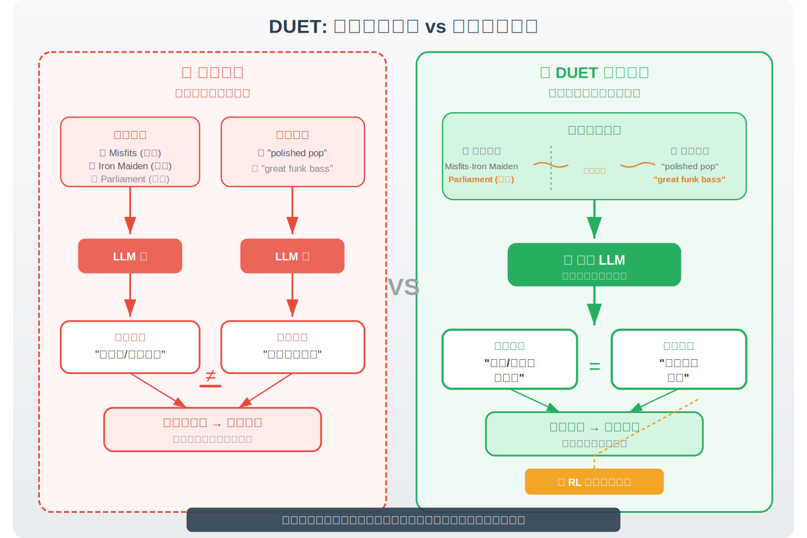
*图示：独立生成画像就像两个翻译各自翻译一段话却不互相对照，容易各说各话。DUET让模型同时看到用户听过什么歌、物品被怎么评价，然后一次性输出两份互相呼应的画像。比如用户听了朋克、金属、放克三种风格，物品评论里既有'精致流行'也有'很棒的放克贝斯'，联合生成时模型会把两边都往'放克'方向靠拢，而非各自强调不同侧面。*

#### 技术点 2：三阶段单pass生成流程
- 技术细节：DUET在推理时通过一次前向传播完成三个阶段：第一阶段Cue提取——从原始历史中蒸馏出简洁的线索假设（如'偏好复古解谜游戏'），刻意保持不完整以留出探索空间；第二阶段Profile Prompt发现——模型生成一段自然语言指令（如'描述用户的怀旧审美和策略深度偏好'），这段指令定义了画像的格式、抽象层次和属性选择逻辑；第三阶段Profile生成——以profile prompt为条件，生成最终的用户和物品文本画像。三个阶段串联在同一个sequence-to-sequence输出序列中，推理时不引入额外延迟。
- 通俗讲解：可以把这个过程想象成写文章：先列提纲要点（Cue），再决定用什么写作风格和结构来写（Profile Prompt），最后按照这个风格正式写出来（Profile）。关键创新在第二步——模型不是用固定模板，而是自己'发明'描述策略。训练时模型会尝试不同的描述策略，比如有时聚焦'游戏类型偏好'，有时聚焦'视觉风格偏好'，然后看哪种策略让下游推荐更准，就强化哪种策略。
- 例子：输入一个用户玩过Baba Is You(5星)、The Witness(5星)、Fez(4星)，候选物品是一款独立解谜游戏。Cue阶段输出：用户线索'偏好复古解谜游戏'，物品线索'复古风独立解谜高难度'。Profile Prompt阶段输出：用户侧'聚焦1990年代视觉审美和策略深度'，物品侧'描述像素画风和智力难度以匹配逻辑偏好'。最终Profile：用户'追求复古视觉魅力与深度策略推理的玩家'，物品'像素怀旧风的2D体验，要求逻辑推演的高难度机制'。三阶段一次pass完成。

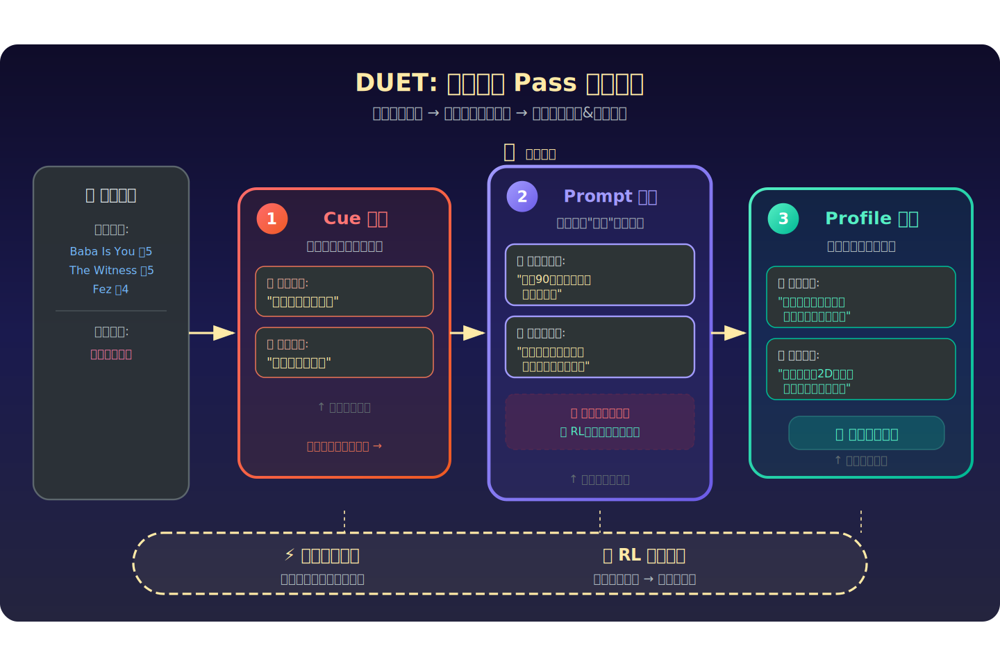
*图示：可以把这个过程想象成写文章：先列提纲要点（Cue），再决定用什么写作风格和结构来写（Profile Prompt），最后按照这个风格正式写出来（Profile）。关键创新在第二步——模型不是用固定模板，而是自己'发明'描述策略。训练时模型会尝试不同的描述策略，比如有时聚焦'游戏类型偏好'，有时聚焦'视觉风格偏好'，然后看哪种策略让下游推荐更准，就强化哪种策略。*

#### 技术点 3：RL驱动的画像优化
- 技术细节：DUET用GRPO（Group Relative Policy Optimization）作为RL算法，下游推荐模型全程冻结作为环境。奖励函数定义为连续分数：奖励等于1减去预测评分与真实评分之差的绝对值除以最大评分差（如1-5分制下最大差为4）。这种连续奖励避免了离散整数评分带来的稀疏反馈问题——预测4分vs真实5分会得到0.75的奖励而非0。训练时，对每个用户-物品对采样多组画像，计算各自奖励后做组内相对优势估计，强化高奖励画像的生成概率。消融实验显示去掉RL后Yelp准确率从61.23%降至48.53%，证明RL优化是性能提升的核心。
- 通俗讲解：画像写得好不好，没有标准答案，所以不能用监督学习。DUET的做法是：让模型写出画像后，交给一个冻结的推荐模型去打分预测，预测越接近真实评分，奖励越高。比如真实评分是5分，模型A的画像让推荐器预测出4.5分，奖励为0.875；模型B的画像让推荐器预测出3分，奖励只有0.5。通过反复采样和强化，模型学会生成那些能让推荐器'看懂'用户-物品关系的画像。
- 例子：训练时对同一个用户-物品对，DUET采样比如8组不同画像（因为profile prompt的随机采样导致不同的描述策略）。假设第3组画像聚焦'放克风格'让推荐器预测4.8（真实5.0，奖励0.95），第7组聚焦'金属风格'让推荐器预测3.0（奖励0.5），GRPO计算组内相对优势后，大幅提升第3组对应生成策略的概率，抑制第7组。多轮迭代后，模型收敛到能持续产出高质量对齐画像的策略。

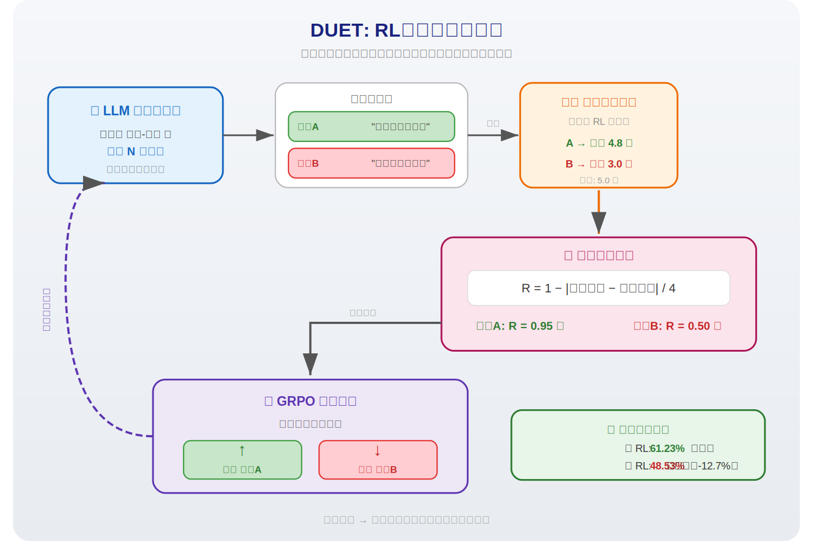
*图示：画像写得好不好，没有标准答案，所以不能用监督学习。DUET的做法是：让模型写出画像后，交给一个冻结的推荐模型去打分预测，预测越接近真实评分，奖励越高。比如真实评分是5分，模型A的画像让推荐器预测出4.5分，奖励为0.875；模型B的画像让推荐器预测出3分，奖励只有0.5。通过反复采样和强化，模型学会生成那些能让推荐器'看懂'用户-物品关系的画像。*

#### 技术点 4：语义对齐与忠实度双指标验证
- 技术细节：论文设计了两个互补指标：语义对齐度（用sentence-transformers计算用户画像和物品画像embedding的余弦相似度）和覆盖率（画像中token与历史文本的重叠比例，衡量画像是否有事实依据）。DUET在三个数据集上语义对齐度均最高（Yelp 0.638、Music 0.595、Book 0.729），同时保持中高水平的覆盖率，说明画像既语义对齐又有事实根据，不是凭空编造。对比方法如KAR覆盖率低但对齐一般，RLMRec覆盖率高但对齐差。
- 通俗讲解：语义对齐度衡量的是用户画像和物品画像在语义空间中是否'说的是一回事'——如果用户画像说'喜欢放克'，物品画像说'放克摇滚专辑'，两者embedding就会很接近。覆盖率衡量画像是否'有据可查'——画像里的词有多少来自用户的真实历史记录。DUET两个指标都好，说明联合生成加RL优化确实让画像既互相匹配又忠于原始数据。
- 例子：在Amazon Books数据集上，DUET的语义对齐度达到0.729，远高于第二名LG的0.551。这意味着DUET生成的用户画像和物品画像在embedding空间中更接近。同时用户覆盖率0.346、物品覆盖率0.313，虽不是最高但处于中上水平，说明画像内容大部分能在历史交互中找到对应证据。

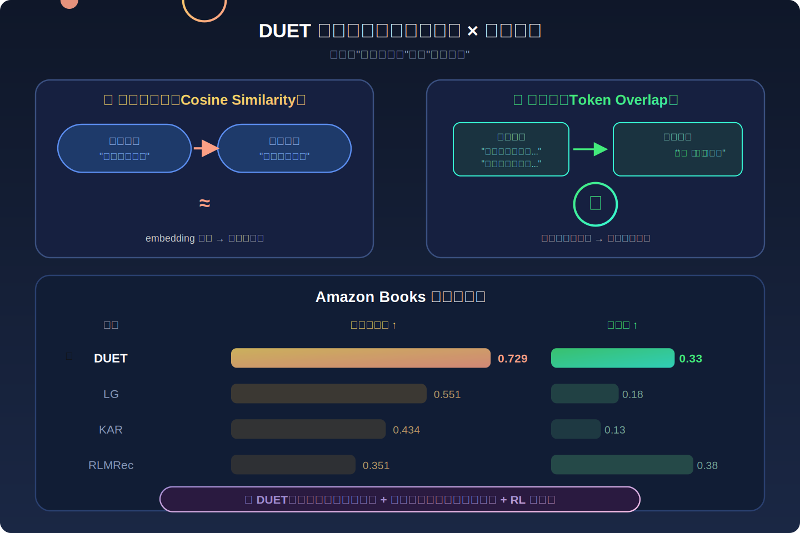
*图示：语义对齐度衡量的是用户画像和物品画像在语义空间中是否'说的是一回事'——如果用户画像说'喜欢放克'，物品画像说'放克摇滚专辑'，两者embedding就会很接近。覆盖率衡量画像是否'有据可查'——画像里的词有多少来自用户的真实历史记录。DUET两个指标都好，说明联合生成加RL优化确实让画像既互相匹配又忠于原始数据。*

- **对广告的启发：** 最适合层级：用户理解与广告创意匹配层；价值：DUET的联合画像生成思路可直接应用于广告场景：将用户画像和广告画像联合生成，使得用户兴趣描述与广告卖点描述在语义空间中对齐。例如在信息流广告中，针对同一用户-广告对，联合生成'用户关注性价比和户外运动'与'该广告主打户外跑鞋折扣'的对齐画像，再喂入CTR预估模型。其RL优化机制也适用于广告场景——以点击率或转化率作为奖励信号优化画像生成策略，无需人工设计画像模板。此外，profile prompt的自动探索机制可帮助广告系统发现最有效的用户-广告特征匹配维度。；风险：主要风险有三：一是该方法依赖LLM做画像生成和下游推理，在广告系统的毫秒级延迟要求下可能需要离线预计算或蒸馏；二是广告场景中用户历史文本（如搜索query、点击标题）远比电商评论短且稀疏，画像质量可能下降；三是RL训练需要大量采样和下游模型评估，在广告系统的高频更新场景下训练成本较高。

## 六、候选但未完成深读的论文

当前重点论文都已完成可用分析。
