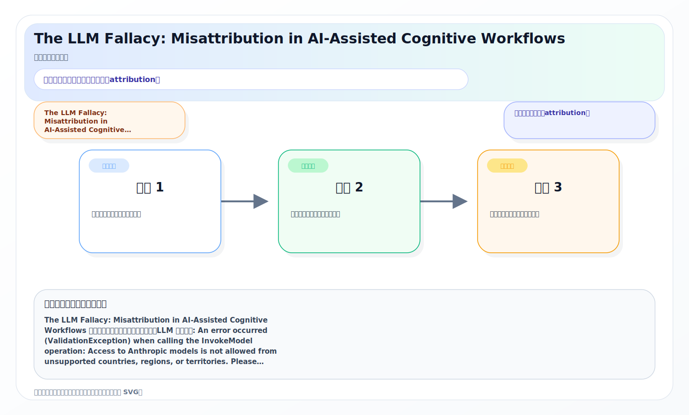

# 2026-04-17 论文日报

## 一、今日趋势与创新观察

### 1. 趋势概况

- 今日 387 篇论文中，LLM 与语言理解方向以 82 篇占据绝对主力，研究重心从单纯的生成质量转向 LLM 在下游任务中的可解释性、归因可信度和认知偏差分析，多篇工作聚焦于 LLM 决策的 attribution 问题。
- Agent 与多智能体方向产出 51 篇，是第二大主题，研究点从简单的工具调用向自演化策略（如 SAGER 的 self-evolving user policy）和企业知识导航式 Agent 转移，Agent 正在从'能用'走向'会规划'。
- 推荐与检索排序方向虽然总量（约 22 篇）不算最大，但质量密度高：联邦行为建模、生成式推荐框架、多模态用户表示初始化、异构序列推荐等多条子线同时活跃，LLM 深度融入推荐链路已成稳定趋势。
- 资源优化与效率方向出现了若干有意思的工作，包括视觉 token 剪枝的 Pareto 前沿学习、模型级联下的预算安全保障等，反映出大模型落地时'怎么花算力预算'正变成一个独立研究问题。

### 2. 推荐系统 / 排序相关创新点

- GenRec 提出面向大规模推荐的偏好导向生成框架，用生成式建模替代传统打分范式，把推荐候选生成和偏好对齐合并到一个端到端流程中，值得关注其在工业规模上的可行性设计。
- Well Begun is Half Done 提出无需训练、模型无关的语义保证用户表示初始化方法，解决了多模态推荐中冷启动阶段 embedding 质量差的问题，核心思路是用预训练多模态语义空间直接为新用户锚定一个'好的起点'。
- SAGER 为推荐 Agent 引入自演化用户策略技能，让 Agent 不只是执行固定推荐策略，而是根据用户交互反馈持续进化自身的推荐行为策略，把 Agent 自主学习能力嫁接到推荐场景中。

### 3. 全局创新点

- VisPCO 将视觉 token 剪枝建模为预算感知的多目标优化问题，通过 Pareto 前沿学习自动搜索精度-效率最优配置，提供了一种通用的大模型推理资源分配思路，对广告系统中的算力预算控制有潜在借鉴价值。
- Calibrate-Then-Delegate 提出先校准再委派的模型级联框架，在风险和预算双重约束下决定哪些请求交给大模型、哪些交给小模型处理，这种'路由+保障'的设计模式对线上多模型服务架构很有参考意义。
- FRESCO 针对 RAG 场景中知识随时间演化导致的语义冲突问题，构建了 re-ranker 的基准测试与优化方案，揭示了现有排序器在信息新旧冲突下的脆弱性，对任何需要长期维护知识库的检索系统都值得关注。

## 二、今日一个 AI 知识点

### 表示学习为什么是很多系统的隐形底座

表示学习的目标不是简单把输入压成一个向量，而是把真正影响任务的结构信息保留下来，同时把噪声和偶然因素压下去。后面的检索、排序、聚类、生成，很多时候都只是拿这个表示继续做计算。 很多论文表面看是在做召回、排序、生成，其实核心改进都发生在表示层。先理解表示学习，就更容易抓住论文真正的创新位置。 可以顺着一次具体运行过程来理解：你可以顺着一次前向这样理解：系统先把用户最近点击、搜索词、广告文案和商品属性分别编码，再通过共享空间把它们投到同一组向量坐标里；如果两个对象在任务上更相关，它们在这个空间里就应该更近；后续做召回时，只要比较向量距离，就能先快速找出更可能相关的一批候选。

## 三、今日论文总览

### 1. The LLM Fallacy: Misattribution in AI-Assisted Cognitive Workflows
- 挑选理由：命中广告核心词：attribution。

### 2. Simulating Human Cognition: Heartbeat-Driven Autonomous Thinking Activity Scheduling for LLM-based AI systems
- 挑选理由：命中广告核心词：rtb。

### 3. VisPCO: Visual Token Pruning Configuration Optimization via Budget-Aware Pareto-Frontier Learning for Vision-Language Models
- 挑选理由：命中广告核心词：budget。

### 4. CSRA: Controlled Spectral Residual Augmentation for Robust Sepsis Prediction
- 挑选理由：命中广告核心词：ctr。

### 5. Faithfulness Serum: Mitigating the Faithfulness Gap in Textual Explanations of LLM Decisions via Attribution Guidance
- 挑选理由：命中广告核心词：attribution。

### 6. Assessing the Performance-Efficiency Trade-off of Foundation Models in Probabilistic Electricity Price Forecasting
- 挑选理由：命中广告核心词：ctr。

### 7. Calibrate-Then-Delegate: Safety Monitoring with Risk and Budget Guarantees via Model Cascades
- 挑选理由：命中广告核心词：budget。

### 8. HAMSA: Scanning-Free Vision State Space Models via SpectralPulseNet
- 挑选理由：命中广告核心词：ctr。

### 9. Bias in Surface Electromyography Features across a Demographically Diverse Cohort
- 挑选理由：命中广告核心词：ctr。

### 10. Federated User Behavior Modeling for Privacy-Preserving LLM Recommendation
- 挑选理由：命中强迁移信号：recommendation, llm recommendation。

### 11. GenRec: A Preference-Oriented Generative Framework for Large-Scale Recommendation
- 挑选理由：命中强迁移信号：recommendation, framework。

### 12. Well Begun is Half Done: Training-Free and Model-Agnostic Semantically Guaranteed User Representation Initialization for Multimodal Recommendation
- 挑选理由：命中强迁移信号：recommendation, multimodal。

### 13. Category-based and Popularity-guided Video Game Recommendation: A Balance-oriented Framework
- 挑选理由：命中强迁移信号：recommendation, framework。

### 14. CPGRec+: A Balance-oriented Framework for Personalized Video Game Recommendations
- 挑选理由：命中强迁移信号：recommendation, framework。

### 15. A Unified Model and Document Representation for On-Device Retrieval-Augmented Generation
- 挑选理由：命中强迁移信号：retrieval, unified。

### 16. Adaptive Query Routing: A Tier-Based Framework for Hybrid Retrieval Across Financial, Legal, and Medical Documents
- 挑选理由：命中强迁移信号：retrieval, framework。

### 17. RaTA-Tool: Retrieval-based Tool Selection with Multimodal Large Language Models
- 挑选理由：命中强迁移信号：retrieval, multimodal。

## 四、补充关注

1. **Uncertainty-aware Generative Learning Path Recommendation with Cognition-Adaptive Diffusion**
   - 理由：有一定相关信号，但不足以进入正式候选：recommendation。
2. **Behavior-Aware Dual-Channel Preference Learning for Heterogeneous Sequential Recommendation**
   - 理由：有一定相关信号，但不足以进入正式候选：recommendation。
3. **NewsTorch: A PyTorch-based Toolkit for Learner-oriented News Recommendation**
   - 理由：有一定相关信号，但不足以进入正式候选：recommendation。
4. **Controlling Authority Retrieval: A Missing Retrieval Objective for Authority-Governed Knowledge**
   - 理由：有一定相关信号，但不足以进入正式候选：retrieval。
5. **FRESCO: Benchmarking and Optimizing Re-rankers for Evolving Semantic Conflict in Retrieval-Augmented Generation**
   - 理由：有一定相关信号，但不足以进入正式候选：retrieval。
6. **Towards Faster Language Model Inference Using Mixture-of-Experts Flow Matching**
   - 理由：有一定相关信号，但不足以进入正式候选：matching。
7. **SGA-MCTS: Decoupling Planning from Execution via Training-Free Atomic Experience Retrieval**
   - 理由：有一定相关信号，但不足以进入正式候选：retrieval。
8. **RACER: Retrieval-Augmented Contextual Rapid Speculative Decoding**
   - 理由：有一定相关信号，但不足以进入正式候选：retrieval。
9. **Which bird does not have wings: Negative-constrained KGQA with Schema-guided Semantic Matching and Self-directed Refinement**
   - 理由：有一定相关信号，但不足以进入正式候选：matching。
10. **Awakening Dormant Experts:Counterfactual Routing to Mitigate MoE Hallucinations**
   - 理由：有一定相关信号，但不足以进入正式候选：counterfactual。

## 五、重点论文精读

### 1. The LLM Fallacy: Misattribution in AI-Assisted Cognitive Workflows
- **背景：** The LLM Fallacy: Misattribution in AI-Assisted Cognitive Workflows 值得关注，但当前只能给保守判断。LLM 分析失败: An error occurred (ValidationException) when calling the InvokeModel operation: Access to Anthropic models is not allowed from unsupported countries, regions, or territories. Please refer to https://www.anthropic.com/supported-countries for more information on the countries and regions Anthropic currently supports.

*图示：命中广告核心词：attribution。*

- **当前状态：** llm_failed（LLM 分析失败: An error occurred (ValidationException) when calling the InvokeModel operation: Access to Anthropic models is not allowed from unsupported countries, regions, or territories. Please refer to https://www.anthropic.com/supported-countries for more information on the countries and regions Anthropic currently supports.）
- **核心技术点：** 本次精读未成功，暂不展示结构化核心点，避免误导。
- **对广告的启发：** 暂时只保留候选判断，建议稍后重试精读。

### 2. Simulating Human Cognition: Heartbeat-Driven Autonomous Thinking Activity Scheduling for LLM-based AI systems
- **背景：** Simulating Human Cognition: Heartbeat-Driven Autonomous Thinking Activity Scheduling for LLM-based AI systems 值得关注，但当前只能给保守判断。LLM 分析失败: An error occurred (ValidationException) when calling the InvokeModel operation: Access to Anthropic models is not allowed from unsupported countries, regions, or territories. Please refer to https://www.anthropic.com/supported-countries for more information on the countries and regions Anthropic currently supports.

*图示：命中广告核心词：rtb。*

- **当前状态：** llm_failed（LLM 分析失败: An error occurred (ValidationException) when calling the InvokeModel operation: Access to Anthropic models is not allowed from unsupported countries, regions, or territories. Please refer to https://www.anthropic.com/supported-countries for more information on the countries and regions Anthropic currently supports.）
- **核心技术点：** 本次精读未成功，暂不展示结构化核心点，避免误导。
- **对广告的启发：** 暂时只保留候选判断，建议稍后重试精读。

## 六、候选但未完成深读的论文

- **The LLM Fallacy: Misattribution in AI-Assisted Cognitive Workflows**
  - 状态：llm_failed
  - 原因：LLM 分析失败: An error occurred (ValidationException) when calling the InvokeModel operation: Access to Anthropic models is not allowed from unsupported countries, regions, or territories. Please refer to https://www.anthropic.com/supported-countries for more information on the countries and regions Anthropic currently supports.
- **Simulating Human Cognition: Heartbeat-Driven Autonomous Thinking Activity Scheduling for LLM-based AI systems**
  - 状态：llm_failed
  - 原因：LLM 分析失败: An error occurred (ValidationException) when calling the InvokeModel operation: Access to Anthropic models is not allowed from unsupported countries, regions, or territories. Please refer to https://www.anthropic.com/supported-countries for more information on the countries and regions Anthropic currently supports.
