# 2026-04-21 论文日报

## 一、今日趋势与创新观察

### 1. 趋势概况

- 今天 888 篇论文中，LLM 与语言理解仍然是绝对主力（约 234 篇），但研究重心明显从「让 LLM 更聪明」转向「让 LLM 更高效可用」，大量工作集中在推理加速、表征压缩、长上下文优化和端侧部署等工程化议题上。
- Agent 与多智能体方向持续升温（约 106 篇），不少论文将 Agent 架构嵌入 RAG、搜索和推荐流程中，把单次模型调用扩展为多步规划-检索-反思闭环，Agentic RAG 正在成为一个独立子赛道。
- 表示学习与检索排序方向（约 73 篇）出现两条清晰支线：一是 Embedding 表的压缩与高效化（如 Co-Clustering 压缩、模块化表征压缩），二是向量检索中语义纠缠与鲁棒性问题（如 Semantic Entanglement 形式化框架、Token Erasure 下的鲁棒检索），说明研究者开始关注向量空间本身的质量，而不仅仅追求更大模型。
- 直接涉及广告场景的论文虽然量不大（约 25 篇信号），但出现了两个非常聚焦工业痛点的工作——广告推荐系统的高秩表征学习（RankUp）和 Reach & Frequency 广告库存估算数据集，说明广告侧研究正在从泛化方法回到精细化、场景化的阶段。

### 2. 推荐系统 / 排序相关创新点

- RankUp 提出在大规模广告推荐系统中提升 Embedding 表征矩阵的秩，直接对抗工业模型中普遍存在的表征坍缩（representation collapse）问题，这是一个从线性代数视角重新审视排序模型表达力的新切入点。
- R&F-Inventory 发布了一个面向 Reach & Frequency 广告投放的大规模库存估算数据集，并要求估算函数满足单调性约束，这在广告预算分配和频控优化中是一个长期缺乏公开基准的关键子问题。
- Balanced Co-Clustering 通过对用户和物品同时做平衡聚类来压缩 Embedding 表，将压缩率和推荐效果解耦，为大规模广告排序模型的在线部署提供了一种结构化的参数瘦身方案。

### 3. 全局创新点

- Modular Representation Compression 提出将 LLM 的长序列表征模块化分组后做压缩再对接推荐模型，思路是「先压再传」而非「端到端微调」，为 LLM 适配下游轻量任务提供了一种即插即用的中间件范式。
- Semantic Entanglement 框架尝试形式化向量检索中不同语义维度相互纠缠的问题，并提出基于上下文条件的解纠缠流水线，这对所有依赖稠密向量的系统（搜索、推荐、RAG）都有方法论层面的启发。
- Linear-Time Constant-Memory Text Embeddings 用循环语言模型替代 Transformer 来生成文本向量，实现线性时间和常量内存，为超长文档检索和资源受限部署场景指出了一个与主流 Transformer Embedding 完全不同的路线。

## 二、今日一个 AI 知识点

### Off-Policy Evaluation 为什么能离线估计新策略

Off-Policy Evaluation 的难点在于：你手里只有旧策略下产生的日志，但你想知道一个新策略如果当时上线，效果会怎样。它本质上是在做‘带偏差采样下的反事实估计’，核心不是直接平均，而是先校正旧策略和新策略看到样本的概率差。 广告排序、预算控制和出价优化都不可能天天线上试错，所以很多工业系统都依赖离线评估。先理解 OPE，才能看懂为什么一篇论文总在强调 propensity、reweighting 或 doubly robust。 可以顺着一次具体运行过程来理解：顺着一次计算过程看：日志里某次曝光原本是旧策略把广告A推上去的，旧策略给A的概率是0.8，而新策略只会在类似场景下以0.2的概率展示A；那这条样本在评估新策略时就不能按原权重直接算，而要乘一个和两者概率比相关的修正系数。把很多样本都这样校正后，才更接近‘如果新策略当时上线会发生什么’。

## 三、今日论文总览

### 1. RankUp: Towards High-rank Representations for Large Scale Advertising Recommender Systems
- 挑选理由：标题明确提到Large Scale Advertising Recommender Systems，直接针对广告推荐系统的排序表征优化

### 2. R&F-Inventory: A Large-Scale Dataset for Monotonic Inventory Estimation in Reach and Frequency Advertising
- 挑选理由：直接涉及广告Reach and Frequency库存估算，是广告投放中核心的触达与频控问题

### 3. Balanced Co-Clustering of Users and Items for Embedding Table Compression in Recommender Systems
- 挑选理由：Embedding表压缩是广告推荐系统工业部署的关键技术，与大规模广告排序模型高度同构

### 4. Modular Representation Compression: Adapting LLMs for Efficient and Effective Recommendations
- 挑选理由：作者包含Ruiming Tang（华为诺亚方舟），LLM适配推荐系统的表征压缩，与广告排序模型有一定同构性

## 四、补充关注

今天没有需要额外提示的补充关注论文。

## 五、重点论文精读

### 1. RankUp: Towards High-rank Representations for Large Scale Advertising Recommender Systems
- **背景：** 现代广告推荐系统普遍采用MetaFormer架构（Token Mixer + FFN堆叠），并通过加深模型、扩大隐藏维度来提升效果，但参数规模的增长并不一定带来表征能力的等比例提升。先前对RankMixer的分析发现，随着模型层数增加，token表征的有效秩呈现阻尼振荡轨迹——在深层甚至出现下降，即'表征坍缩'现象：学到的表征集中在低维子空间里，无法充分区分不同用户和广告。RankUp正是针对这一结构性瓶颈，通过五个互补机制从根源上增加隐空间的多样性，使得深层模型的参数真正被利用起来，在微信三大广告场景全量上线后带来了显著的GMV增长。
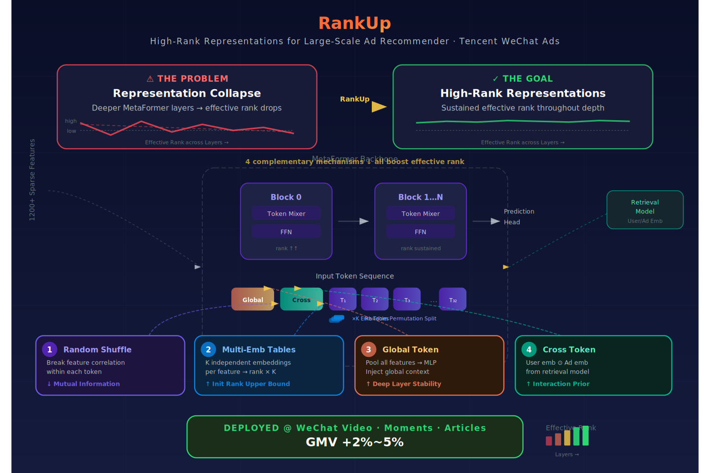
*图示：腾讯微信广告团队提出的RankUp架构，直接针对大规模广告推荐系统中深层模型的表征坍缩问题，已在微信视频号、公众号、朋友圈全量部署，GMV提升2-5%，属于直接广告系统论文。*

**核心技术点：**

#### 技术点 1：随机置换分割降低token相关性
- 技术细节：传统做法按语义分组（如用户侧特征一组、物品侧一组）或等距切分将上千个稀疏特征拼成若干token，但高度相关的特征聚在同一token内会导致该token的embedding有效秩很低。RankUp用一个随机置换算子先打乱所有稀疏特征的顺序，再均匀切分成token。论文用基于K-means聚类的互信息矩阵来度量：随机分割后，32个稀疏token之间的两两互信息普遍低于语义分组，且跨组（稀疏与非稀疏token之间）的互信息也大幅下降。每个token的embedding有效秩从语义分组下部分token低于20提升到随机分割下全部稳定在较高水平。
- 通俗讲解：想象你有1200个特征，语义分组会把'用户年龄、用户性别、用户城市'这类高度相关的特征塞进同一个token，结果这个token的表征几乎只在一两个方向上有信息。随机打乱后，年龄可能和广告类目分到一组，性别和出价方式分到另一组，每个token内部的特征天然不太相关，信息覆盖的维度更广。
- 例子：假设有32个稀疏token，语义分组下Token-12汇聚了一批长尾低基数特征，有效秩仅约15；随机分割后这些长尾特征被分散到不同token，Token-12的有效秩提升到35以上。整体32个token的有效秩分布也更均匀，不再出现个别token秩极低拖累全局表征的情况。

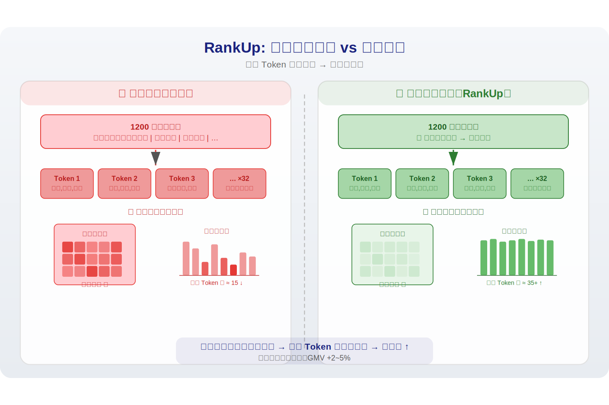
*图示：想象你有1200个特征，语义分组会把'用户年龄、用户性别、用户城市'这类高度相关的特征塞进同一个token，结果这个token的表征几乎只在一两个方向上有信息。随机打乱后，年龄可能和广告类目分到一组，性别和出价方式分到另一组，每个token内部的特征天然不太相关，信息覆盖的维度更广。*

#### 技术点 2：多Embedding表扩展表征自由度
- 技术细节：传统做法用单一embedding表将每个稀疏特征映射到一个d维向量，RankUp为同一特征分配K个独立的embedding表，每个特征的表征变为K个不同embedding的组合。这些embedding来自不同的几何子空间，使初始表征矩阵H0的秩上界从d提升到K乘以d。消融实验显示，多embedding主要在模型早期阶段（Block 0）大幅提高有效秩，缓解了单embedding系统中常见的初始化瓶颈。
- 通俗讲解：单embedding相当于每个特征只有一张'照片'，模型只能从这一个角度理解它；多embedding相当于同一个特征从K个不同角度各拍一张照片，初始表征空间天然更丰富。这好比给画家更多颜料——即使后续的混色（token mixing）能力没变，起点的颜色种类多了，最终画面也更丰富。
- 例子：对于一个广告类目ID，单embedding给出一个64维向量；三张embedding表分别给出三个64维向量，拼接或分组后形成更高维的初始token。消融实验中，去掉多embedding后Block-0的FFN输出有效秩从约46降到约40，说明初始信息量确实减少了。

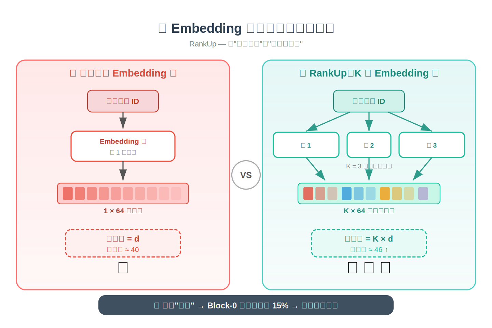
*图示：单embedding相当于每个特征只有一张'照片'，模型只能从这一个角度理解它；多embedding相当于同一个特征从K个不同角度各拍一张照片，初始表征空间天然更丰富。这好比给画家更多颜料——即使后续的混色（token mixing）能力没变，起点的颜色种类多了，最终画面也更丰富。*

#### 技术点 3：全局Token注入全局上下文
- 技术细节：RankUp在所有局部token之外额外构造一个Global Token g，它通过对全部M个稀疏特征的embedding做池化后再过MLP（或FM、DCNv2等交叉模块）得到，然后拼接到token序列最前面参与后续所有层的Token Mixing。消融实验表明，去掉Global Token后深层的有效秩从约42降到38左右，说明它在深层起到稳定表征多样性的作用。
- 通俗讲解：局部token只看自己分到的那一小撮特征，缺少全局视野。Global Token好比一个'班主任'，它见过所有特征，参与每一轮token交互时能把全局信息带给每个局部token，防止深层网络因为信息丢失而表征退化。
- 例子：在一个2层MetaFormer中，Block-2的Token Mixer阶段，Global Token和32个稀疏token一起参与mixing；由于Global Token携带了全部1200+特征的聚合信息，即使某个局部token只包含少量长尾特征，它也能通过与Global Token的交互获得丰富的上下文，从而在FFN阶段保持较高的有效秩。

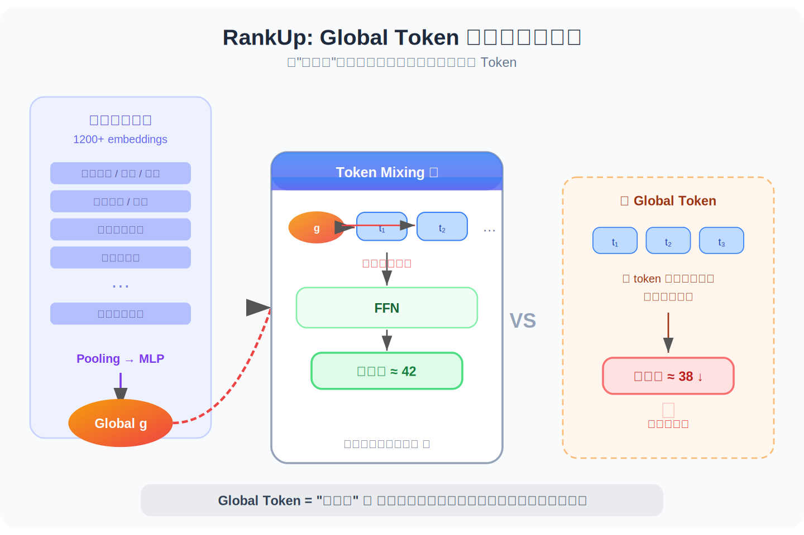
*图示：局部token只看自己分到的那一小撮特征，缺少全局视野。Global Token好比一个'班主任'，它见过所有特征，参与每一轮token交互时能把全局信息带给每个局部token，防止深层网络因为信息丢失而表征退化。*

#### 技术点 4：预训练Embedding交叉注入
- 技术细节：广告系统中通常有双塔检索模型产出的用户embedding和广告embedding，它们在距离度量意义下编码了粗粒度匹配信息。RankUp将用户embedding与广告embedding做逐元素乘积后投影为一个新token，拼入输入序列。这相当于在token级别显式注入了'用户-广告'的交互先验。消融显示去掉这个token后Block-0有效秩有明显下降，说明外部先验对初始表征空间的丰富度有直接贡献。
- 通俗讲解：检索模型学到的embedding蕴含了'这个用户和这个广告整体匹不匹配'的信息，但如果只是简单拼接进特征，排序模型很难深入利用。做逐元素乘积相当于提前做了一次'用户偏好乘以广告属性'的软交叉，产出的向量直接作为一个token参与后续深层交互，把检索阶段的知识以交互感知的方式注入排序模型。
- 例子：用户embedding是128维，广告embedding也是128维，逐元素相乘后得到128维的交叉向量，再经过线性投影到模型隐藏维度D，成为一个Cross Token。它和Global Token、32个稀疏token一起进入MetaFormer，在每一层都参与Token Mixing。

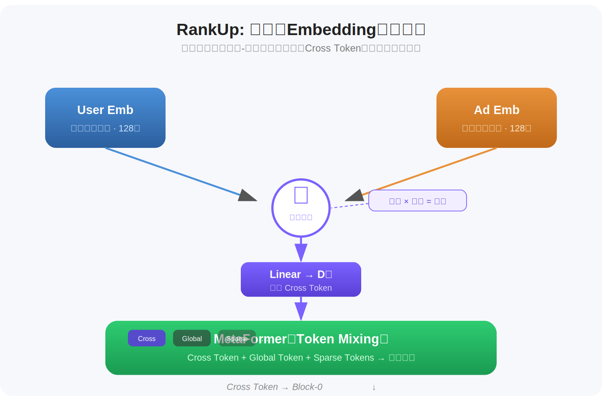
*图示：检索模型学到的embedding蕴含了'这个用户和这个广告整体匹不匹配'的信息，但如果只是简单拼接进特征，排序模型很难深入利用。做逐元素乘积相当于提前做了一次'用户偏好乘以广告属性'的软交叉，产出的向量直接作为一个token参与后续深层交互，把检索阶段的知识以交互感知的方式注入排序模型。*

#### 技术点 5：任务专属Token解耦多目标
- 技术细节：微信广告系统同时优化32个预测任务（如下单、加书、添加服务等），共享backbone会导致不同任务的梯度在同一表征空间竞争。RankUp为每个任务引入一个可学习的任务token，这些token和共享token一起通过所有MetaFormer层，但在最终预测时，每个任务tower的输入是对应的任务token加上共享token的池化结果。论文用互信息度量表明，加入任务token后，隐层表征与各任务标签的对齐度一致提高，且在更细粒度的聚类下差距更大，说明任务token帮助模型在隐空间中形成了任务感知的结构。
- 通俗讲解：32个任务共用一套表征，就像32个部门共用一间办公室，难免互相干扰。给每个任务一个专属token，相当于每个部门有了自己的'联络员'，它在backbone里和所有人交流，但最后只把对自己部门有用的信息带回去。这样既保留了共享信息的好处，又减少了任务间的梯度冲突。
- 例子：对于'下单'任务，其任务token在Block-1的Token Mixing中与Global Token和稀疏token交互，获取购买意图信号；对于'加书'任务，另一个任务token在同一次mixing中获取阅读偏好信号。最终'下单'tower接收下单任务token拼接共享池化向量作为输入，'加书'tower同理。互信息实验中，在64个聚类中心下，有任务token比无任务token的表征-标签MI高出约50%。

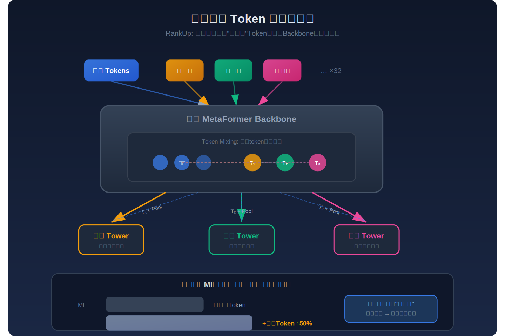
*图示：32个任务共用一套表征，就像32个部门共用一间办公室，难免互相干扰。给每个任务一个专属token，相当于每个部门有了自己的'联络员'，它在backbone里和所有人交流，但最后只把对自己部门有用的信息带回去。这样既保留了共享信息的好处，又减少了任务间的梯度冲突。*

#### 技术点 6：大规模在线效果验证
- 技术细节：RankUp在微信视频号、公众号、朋友圈三大广告场景全量部署，模型从约10M参数扩展到100M参数级别，backbone为2层MetaFormer，batch size 300，约70 GFLOPs/batch，MFU达23%。14天A/B测试结果：视频号AUC+0.367%、GMV+3.41%；公众号AUC+0.331%、GMV+4.81%；朋友圈AUC+0.269%、GMV+2.12%。对新广告冷启动场景，公众号首日GMV提升9.67%。论文估计年化收入增量达数亿美元量级。
- 通俗讲解：在工业广告系统中，AUC提升0.3个百分点已经是非常显著的改进。更关键的是GMV（广告总消耗）的实际增长——视频号3.41%、公众号4.81%，这意味着广告主在同样预算下获得了更好的转化，平台也获得了更多收入。新广告冷启动场景的提升尤其突出（公众号+9.67%），说明更丰富的表征能力在数据稀疏时价值更大。
- 例子：以公众号场景为例，原有RankMixer作为排序子模块，替换为RankUp后，在20%流量的A/B期间AUC提升0.331%，CTCVR提升0.21%，GMV提升4.81%；全量上线后，新广告首日GMV提升9.67%，这主要归因于多embedding和交叉预训练embedding在数据极少时仍能提供丰富的初始表征。

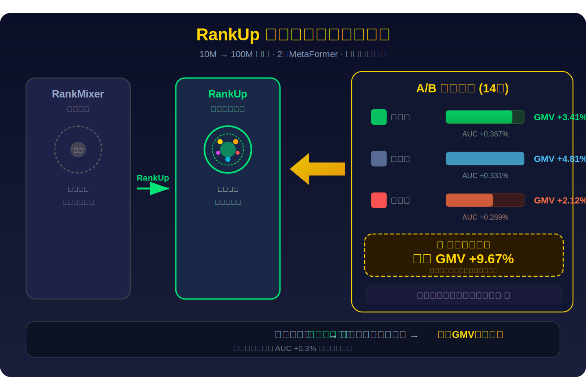
*图示：在工业广告系统中，AUC提升0.3个百分点已经是非常显著的改进。更关键的是GMV（广告总消耗）的实际增长——视频号3.41%、公众号4.81%，这意味着广告主在同样预算下获得了更好的转化，平台也获得了更多收入。新广告冷启动场景的提升尤其突出（公众号+9.67%），说明更丰富的表征能力在数据稀疏时价值更大。*

- **对广告的启发：** 最适合层级：排序模型的特征分组与表征层；价值：RankUp提出的五个机制（随机分割、多embedding表、全局token、预训练交叉embedding、任务token解耦）均为通用的广告排序模型增强手段，特别适合采用MetaFormer/Transformer架构的CVR/CTR预估模型。其核心洞察——'参数增长不等于表征能力增长，需要从隐空间多样性角度优化'——对所有正在做模型scaling的广告系统都有直接参考价值。随机分割和多embedding的实现成本极低，可以快速验证。；风险：随机置换分割打破了领域专家精心设计的特征分组先验，在某些特征交叉本身就很重要的场景下可能损失有价值的归纳偏置；多embedding表会线性增加embedding参数量和内存占用，对embedding规模已经很大的系统需要权衡；全局token和任务token增加了序列长度，对Token Mixer的计算量有一定影响；论文实验均基于腾讯微信广告场景的2层MetaFormer，对于更深的模型或其他架构（如传统DNN）的适用性需要额外验证。

### 2. R&F-Inventory: A Large-Scale Dataset for Monotonic Inventory Estimation in Reach and Frequency Advertising
- **背景：** Reach and Frequency（R&F）合约广告是品牌广告的核心形式，广告主在创建合约时需要实时查看不同预算水平下的UV（独立触达人数）和PV（曝光量）变化曲线，以决定出价和预算。然而现有公开广告数据集（如Criteo、Avazu）都是以单条曝光/点击为独立样本，缺少预算维度、排期维度和频控规则，无法支撑R&F场景下的'预算-效果曲线'建模；而工业系统（如Facebook/Google Reach Planner）的模型和数据均不公开，导致学术界在这一方向上缺乏可复现的基准。本文由快手团队提出并发布了首个大规模R&F合约库存估算数据集，包含完整的定向-排期-频控上下文以及多预算点的UV/PV观测值，同时定义了两个标准化任务和评估协议。
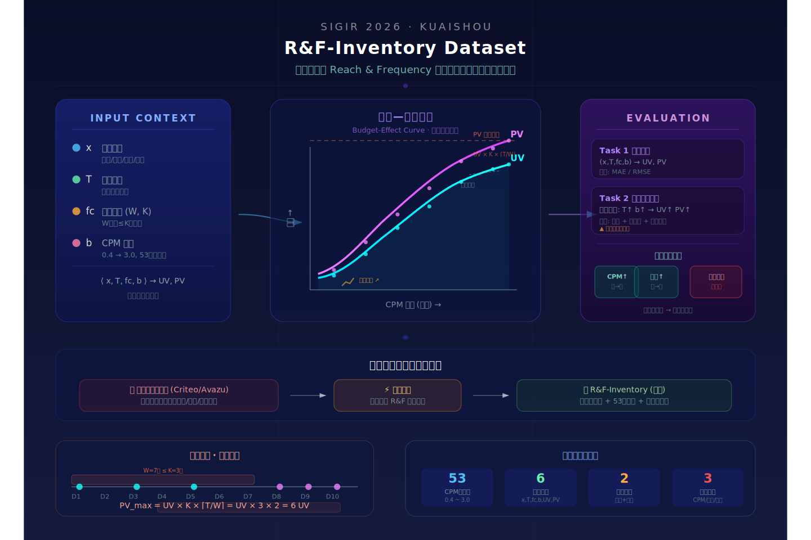
*图示：这是快手团队发表在SIGIR 2026的直接广告论文，首次公开发布面向Reach and Frequency合约广告库存估算的大规模数据集，填补了R&F合约广告中预算-效果曲线建模缺乏公开基准的空白，对品牌广告投放的库存预估和预算规划有直接价值。*

**核心技术点：**

#### 技术点 1：数据集的核心结构设计
- 技术细节：数据集的基本记录是一个六元组：\<定向特征x, 排期天数T, 频控规则fc=(W,K), 预算b, UV R, PV I\>。其中频控规则表示'任意连续W天内单用户曝光不超过K次'。将相同(x, T, fc)组合下的所有记录按预算排序，就形成一条完整的预算-效果曲线。CPM阈值从0.4到3.0以0.05等间距取53个点。数据通过用户采样和离线模拟生成：对每个用户构建时间线上的广告曝光序列，给定一个CPM阈值后判断能否用R&F广告替换掉出价更低的非R&F广告且满足频控约束，若可行则计入一次PV和UV。
- 通俗讲解：传统广告数据集每条记录是一次独立曝光，彼此没有结构联系。本数据集的关键创新是：同一个广告投放配置下，把53个不同出价水平对应的UV和PV都收集起来，形成一条曲线。这条曲线天然满足单调递增和边际递减——出价越高能抢到的曝光越多，但增速会放缓。
- 例子：假设定向为'北京、18-30岁女性'，排期10天，频控'7天内不超过3次'。在CPM阈值=0.4时，系统只能替换极少量低价广告，UV=1000、PV=1500；CPM阈值提高到1.0时，能替换更多广告位，UV=5000、PV=12000；到CPM=3.0时曲线趋于饱和，UV=8000、PV=22000。这53个点串起来就是一条完整的预算-效果曲线。

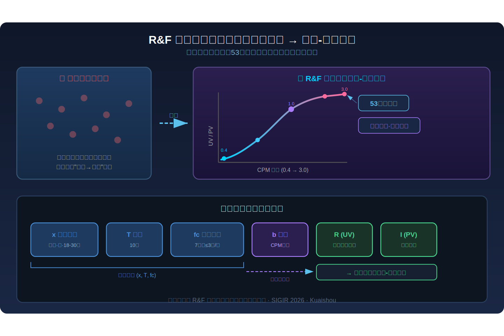
*图示：传统广告数据集每条记录是一次独立曝光，彼此没有结构联系。本数据集的关键创新是：同一个广告投放配置下，把53个不同出价水平对应的UV和PV都收集起来，形成一条曲线。这条曲线天然满足单调递增和边际递减——出价越高能抢到的曝光越多，但增速会放缓。*

#### 技术点 2：理论最大曝光上界与一致性校验
- 技术细节：论文推导了给定排期T和频控(W,K)下单用户最大曝光次数为K乘以T除以W的上取整，即每个频控窗口最多K次、整个排期共有ceil(T/W)个窗口。整个合约的PV理论上界等于UV乘以该单用户上界。这个上界用于两方面：一是对数据集样本做质量检查，确保所有观测PV不超过此上界；二是作为模型预测的可行域约束，防止预测值超出物理可行范围。
- 通俗讲解：频控规则决定了一个用户在整个投放周期内最多能看到多少次广告。比如'7天内不超过3次'，投放14天的话最多就是6次。把所有触达用户的上限加在一起，就得到了整个合约PV的天花板。任何模型预测如果超过这个天花板就是不合理的，可以直接判定为错误。
- 例子：排期T=10天，频控W=7、K=3，则单用户最大曝光为3乘以ceil(10/7)=3乘以2=6次。如果UV预测为5000人，则PV预测不应超过30000。若模型输出PV=35000，即可判定违反物理约束，需要裁剪或重新训练。

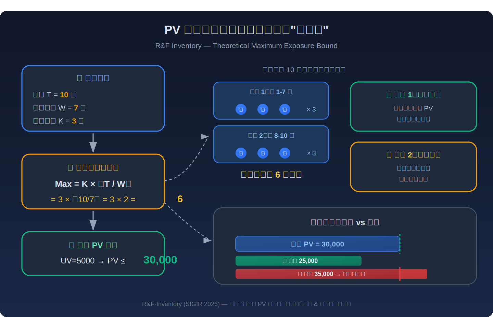
*图示：频控规则决定了一个用户在整个投放周期内最多能看到多少次广告。比如'7天内不超过3次'，投放14天的话最多就是6次。把所有触达用户的上限加在一起，就得到了整个合约PV的天花板。任何模型预测如果超过这个天花板就是不合理的，可以直接判定为错误。*

#### 技术点 3：两个标准化任务定义
- 技术细节：任务1是单点预测：给定(定向, 排期, 频控, CPM阈值)，预测对应的UV和PV，用MAE和RMSE衡量。任务2是多维单调曲线估计：模型需要在同一上下文下对不同(T, CPM)组合给出预测，且必须满足偏序单调性——当排期和CPM都不减小时，UV和PV的预测也不能减小。评估包括两个维度：点级误差和单调一致性（违反率和违反幅度）。
- 通俗讲解：任务1就是广告主输入一个预算，系统告诉他能触达多少人、产生多少曝光。任务2更难，要求模型输出的整条曲线是结构合理的：预算涨了效果不能降，排期长了触达不能少。评估时不仅看每个点预测准不准，还要检查点和点之间是否存在逻辑矛盾。
- 例子：比如模型对CPM=1.0预测PV=12000，对CPM=1.5预测PV=11500，这就产生了一次单调违反。评估时会统计所有满足偏序关系的点对中有多少对违反了单调性（违反率），以及违反时PV下降了多少（违反幅度）。

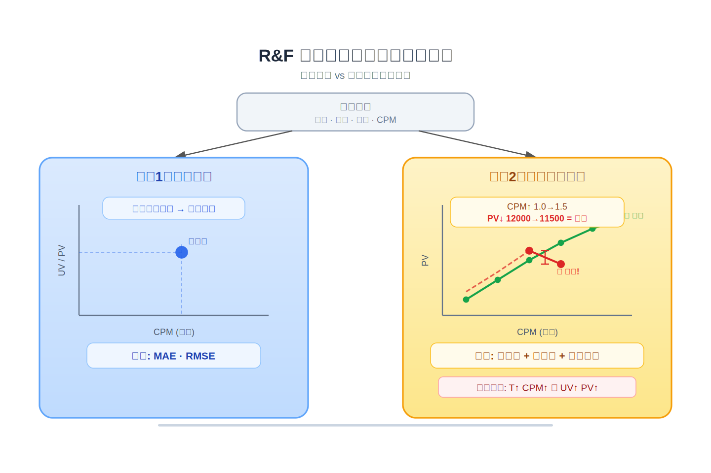
*图示：任务1就是广告主输入一个预算，系统告诉他能触达多少人、产生多少曝光。任务2更难，要求模型输出的整条曲线是结构合理的：预算涨了效果不能降，排期长了触达不能少。评估时不仅看每个点预测准不准，还要检查点和点之间是否存在逻辑矛盾。*

#### 技术点 4：三种数据集划分与外推评估
- 技术细节：论文设计了三种划分方式，都在固定定向和频控的前提下操作：方法1按CPM阈值划分，低CPM训练、高CPM测试，评估从保守出价外推到激进出价的能力；方法2按排期划分，短排期训练、长排期测试，评估从短期数据外推长期效果的能力；方法3取两者交集——高CPM且长排期的样本作为测试集，是最困难的联合外推场景。
- 通俗讲解：这三种划分模拟了实际业务中最常见的困境：广告主往往只有低预算或短期投放的历史数据，却需要预估高预算、长周期的效果。方法3最严苛，模型在训练时只见过'小额短投'的数据，测试时要预测'大额长投'的结果。
- 例子：以方法3为例，假设CPM阈值2.4和排期20天为分界，训练集包含CPM\<2.4或排期\<20天的所有样本，测试集只包含CPM\>=2.4且排期\>=20天的样本。模型需要从低强度投放经验中推断出高强度长周期投放的UV和PV。

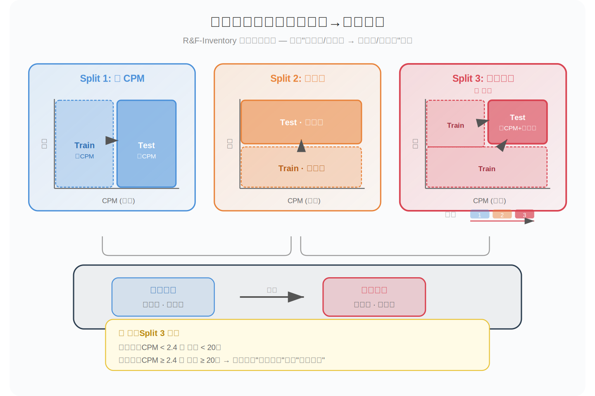
*图示：这三种划分模拟了实际业务中最常见的困境：广告主往往只有低预算或短期投放的历史数据，却需要预估高预算、长周期的效果。方法3最严苛，模型在训练时只见过'小额短投'的数据，测试时要预测'大额长投'的结果。*

#### 技术点 5：基线实验与单调约束模型优势
- 技术细节：在最难的联合外推划分（方法3）下，对比了GBDT和五种显式单调约束模型（POSNN、SMM、MN、PWL、Hint）。结果显示：GBDT的PV MAE高达44万且单调违反率超过60%；而PWL取得最低PV MAE（约1万）且违反率为0；SMM和MN在UV MAE上分别为344和260，也都实现零违反。Hint模型虽有单调引导但未硬约束，仍存在31%的PV违反率。
- 通俗讲解：不加单调约束的树模型在外推场景下表现很差，不仅预测误差大，而且预测曲线经常出现'预算涨了但效果反而降了'的逻辑矛盾。而显式嵌入单调约束的深度模型（如分段线性网络PWL）既能保证曲线形状合理，又能显著降低预测误差，说明结构约束本身就是一种有效的归纳偏置。
- 例子：GBDT对某上下文预测CPM=2.0时PV=80000，CPM=2.5时PV=75000，产生单调违反且偏差达5000。PWL网络由于架构本身保证输出对输入单调，同样场景下输出CPM=2.0时PV=78000、CPM=2.5时PV=82000，既合理又更准确。

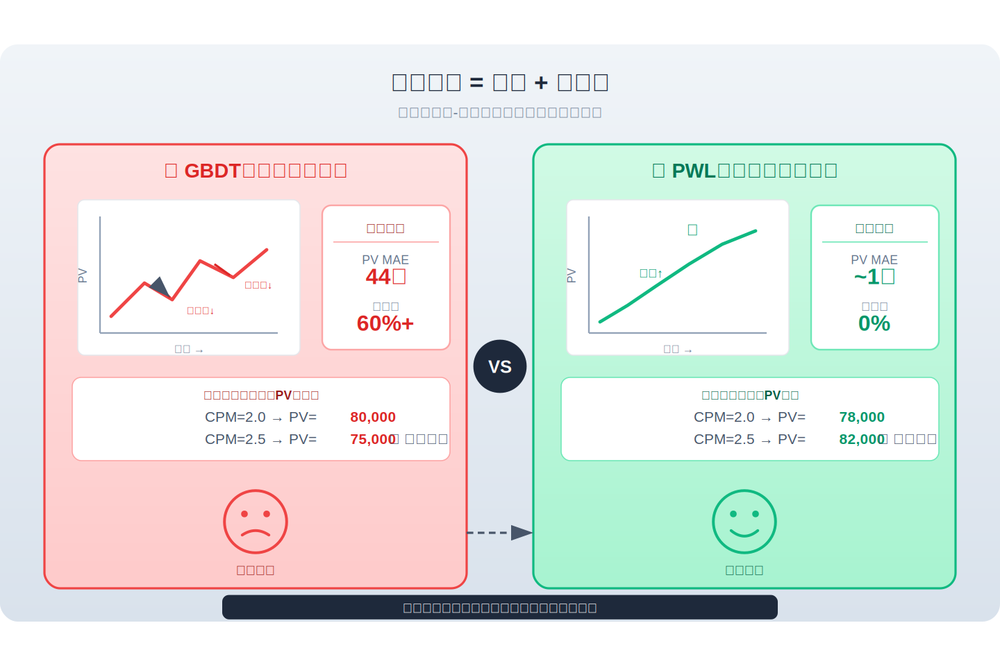
*图示：不加单调约束的树模型在外推场景下表现很差，不仅预测误差大，而且预测曲线经常出现'预算涨了但效果反而降了'的逻辑矛盾。而显式嵌入单调约束的深度模型（如分段线性网络PWL）既能保证曲线形状合理，又能显著降低预测误差，说明结构约束本身就是一种有效的归纳偏置。*

- **对广告的启发：** 最适合层级：品牌广告库存预估与预算规划；价值：这是首个公开的R&F合约广告库存估算基准数据集，可直接用于训练和评估品牌广告中的'预算-触达-曝光'预测模型。论文提出的理论曝光上界、单调约束评估框架、以及外推划分策略，对任何做GD/PDB/合约广告库存预估的团队都有直接参考价值。数据集中频控机制的显式建模也为频控策略优化研究提供了基础。；风险：数据集基于快手平台离线模拟生成，可能与其他平台的流量分布和竞价生态存在差异；论文承认UV和PV目前是独立预测的，未建模二者之间的内在联系（如平均频次=PV/UV），也未探索频控窗口参数W本身的单调关系，实际应用时需要补充这些约束。

## 六、候选但未完成深读的论文

当前重点论文都已完成可用分析。
