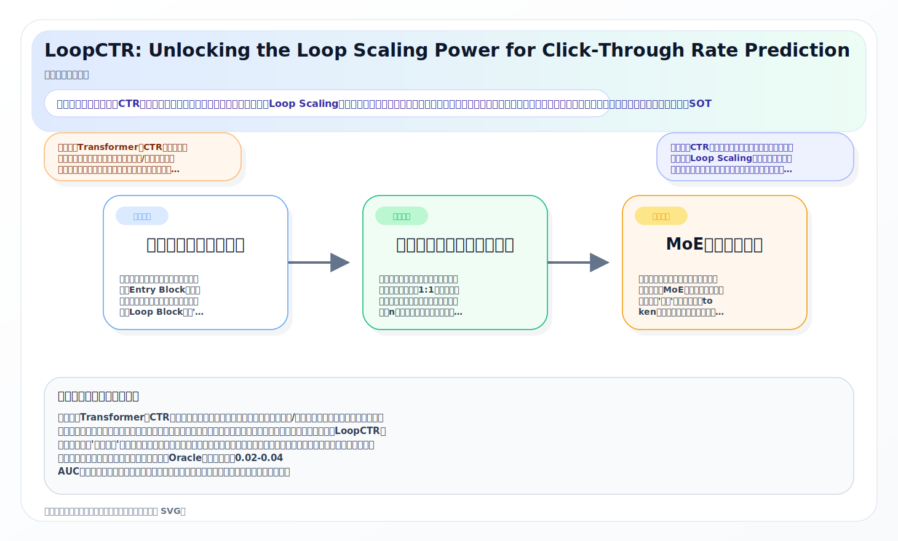
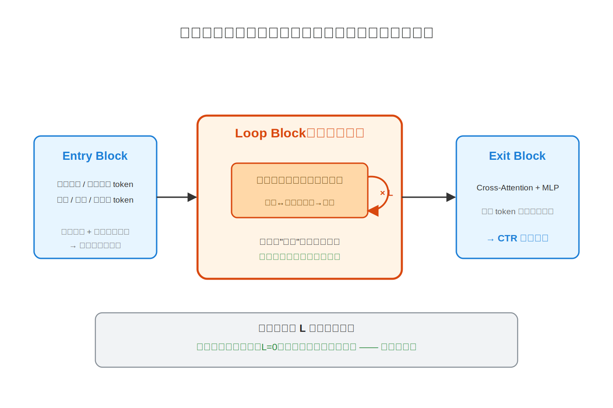
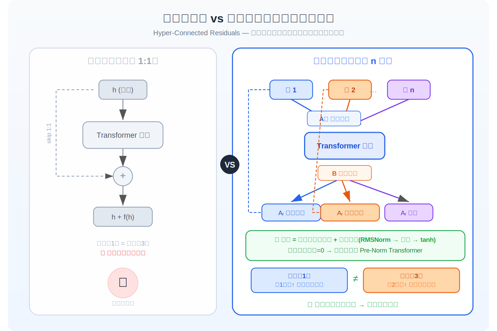
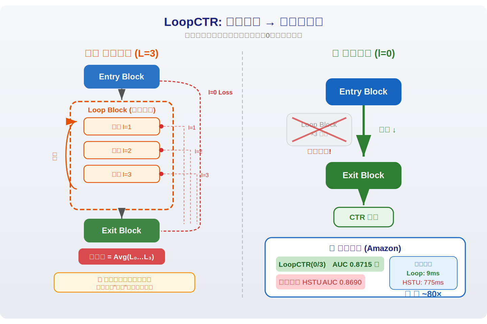
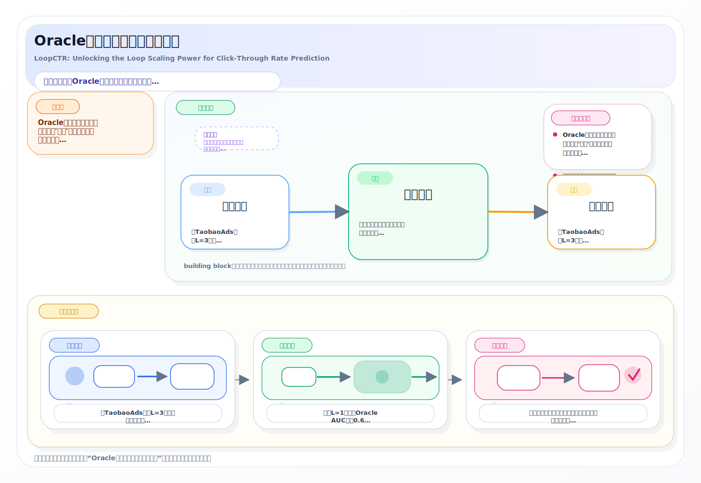
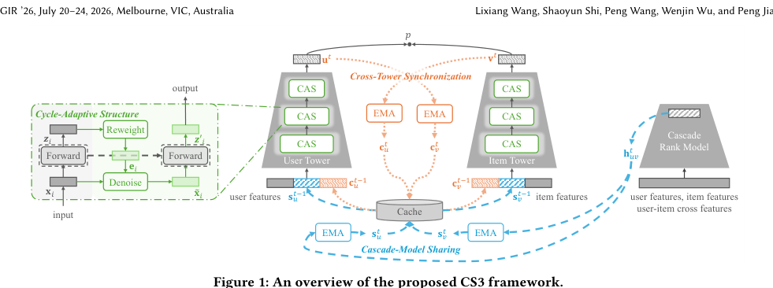
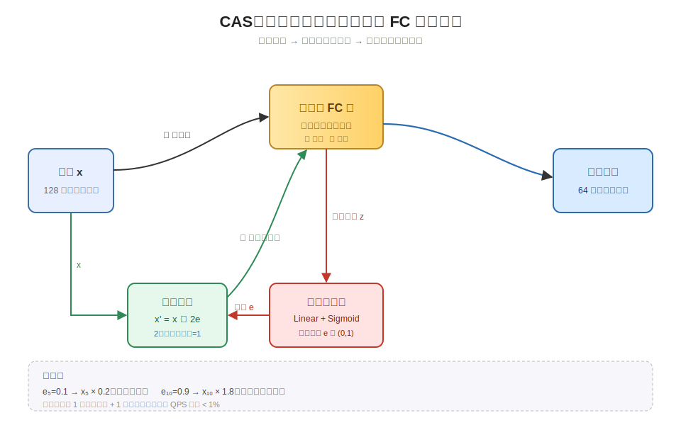
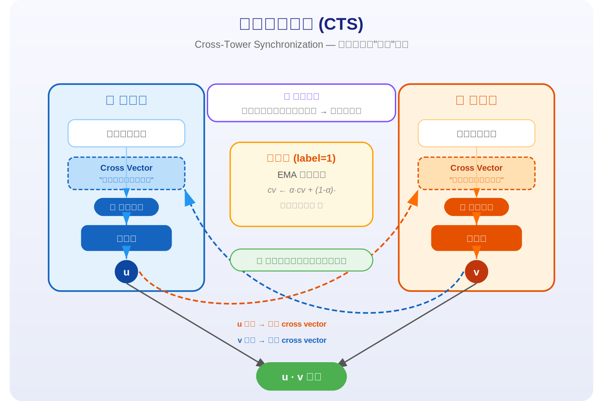
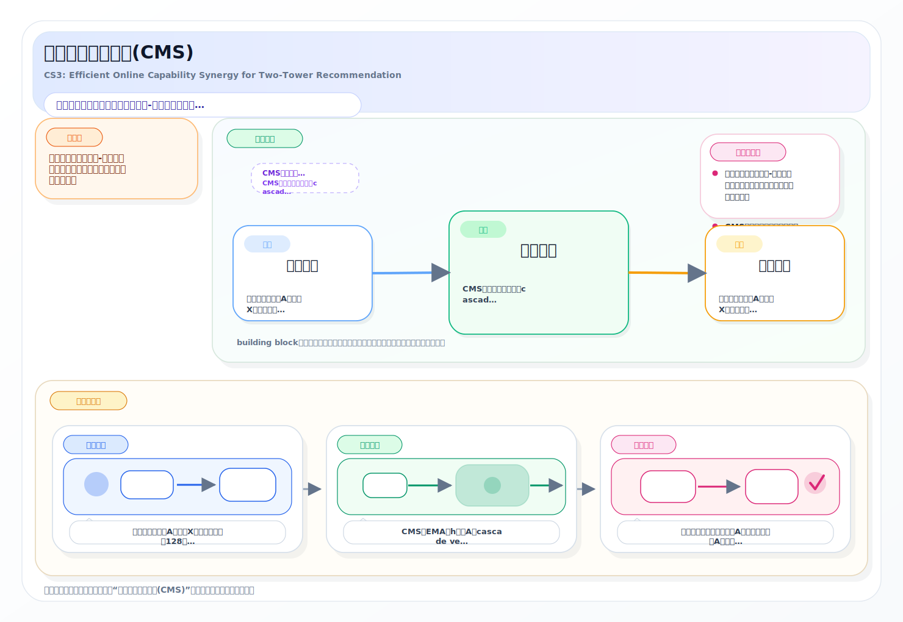
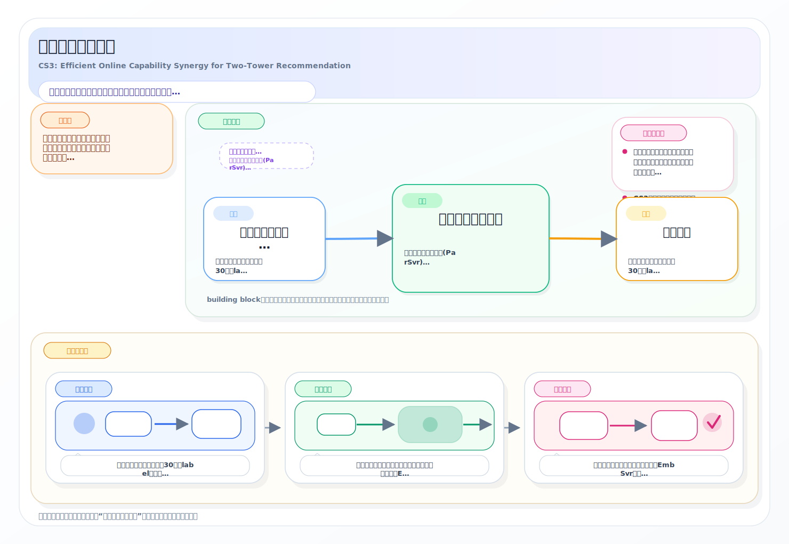

# 2026-04-22 论文日报

## 一、今日趋势与创新观察

### 1. 趋势概况

- 今天 cs.AI + cs.LG + cs.CL + cs.IR …
- 表示学习与检索排序主题共 85 篇，围绕 embedding 几何…
- Agent 与多智能体论文 50 篇，话题从能力扩展转向企业决策对…

展开趋势详细版

- 今天 cs.AI + cs.LG + cs.CL + cs.IR 共抓取 331 篇，其中 cs.AI 184 篇占绝对大头，LLM 与语言理解相关工作 168 篇，继续主导当日研究重心。
- 表示学习与检索排序主题共 85 篇，围绕 embedding 几何结构、late-interaction 检索诊断、表格/图的语义-结构联合建模展开，说明'把什么压进向量、压得好不好'仍是主流关心的问题。
- Agent 与多智能体论文 50 篇，话题从能力扩展转向企业决策对齐、长程记忆压缩以及 owner-harm 这类安全威胁建模，反映 Agent 正在从 demo 走向落地评估。
- 商业化决策与资源优化仅 16 篇，但集中在预算约束影响力最大化、结构化剪枝、KV-cache 量化这类'算力/预算有限下怎么办'的工程化方向。

### 2. 推荐系统 / 排序相关创新点

- LoopCTR 提出循环缩放范式，让 Transformer CT…
- CS3 针对经典双塔召回的'两塔隔离'痛点，设计在线能力协同框架补…
- CAST 把互补关系从共同购买统计升级到语义级跳转建模，用以缓解序…

展开创新点详细版

- LoopCTR 提出循环缩放范式，让 Transformer CTR 模型通过重复调用同一组参数来扩容，而不是堆更多层，从而在工业部署约束下解耦算力与参数量。
- CS3 针对经典双塔召回的'两塔隔离'痛点，设计在线能力协同框架补齐表达力和交叉特征，并已在大规模广告系统落地带来 8.36% 收入提升。
- CAST 把互补关系从共同购买统计升级到语义级跳转建模，用以缓解序列推荐中因促销、季节等引起的虚假共现相关性。

### 3. 全局创新点

- Owner-Harm 补齐了一个此前被忽视的 Agent 安全维度…
- Characterizing AlphaEarth Embeddi…
- Budgeted Online Influence Maximiz…

展开全局创新详细版

- Owner-Harm 补齐了一个此前被忽视的 Agent 安全维度：不是攻击外部用户，而是 Agent 直接伤害自己的部署方（如 Slack AI 凭证泄露类事件），并给出对应评测框架。
- Characterizing AlphaEarth Embedding Geometry 把地球观测基础模型的 64 维向量流形结构显式刻画出来，供 Agent 做环境推理使用，是'先理解表示几何，再谈下游推理'的有趣范例。
- Budgeted Online Influence Maximization 把传统以'选几个 KOL'为约束的影响力最大化，改成以真实广告总花费为预算，更贴近广告主实际投放决策。

## 二、今日一个 AI 知识点

### Off-Policy Evaluation 为什么能离线估计新策略

- **快速理解：** Off-Policy Evaluation 的难点在于：你手里只有旧策略下产生…

展开知识点详细版

Off-Policy Evaluation 的难点在于：你手里只有旧策略下产生的日志，但你想知道一个新策略如果当时上线，效果会怎样。它本质上是在做‘带偏差采样下的反事实估计’，核心不是直接平均，而是先校正旧策略和新策略看到样本的概率差。 广告排序、预算控制和出价优化都不可能天天线上试错，所以很多工业系统都依赖离线评估。先理解 OPE，才能看懂为什么一篇论文总在强调 propensity、reweighting 或 doubly robust。 可以顺着一次具体运行过程来理解：顺着一次计算过程看：日志里某次曝光原本是旧策略把广告A推上去的，旧策略给A的概率是0.8，而新策略只会在类似场景下以0.2的概率展示A；那这条样本在评估新策略时就不能按原权重直接算，而要乘一个和两者概率比相关的修正系数。把很多样本都这样校正后，才更接近‘如果新策略当时上线会发生什么’。

## 三、今日论文总览

### 1. LoopCTR: Unlocking the Loop Scaling Power for Click-Through Rate Prediction
- 挑选理由：直接针对CTR预估的模型架构创新，提出循环缩放范式解耦计算与参数增长，在工业数据集上验证，属于广告排序核心建模。

### 2. CS3: Efficient Online Capability Synergy for Two-Tower Recommendation
- 挑选理由：针对双塔召回模型的在线学习增强框架，已部署在大规模广告系统中并取得8.36%收入提升，直接涉及广告召回与在线排序。

### 3. Budgeted Online Influence Maximization
- 挑选理由：涉及广告预算约束下的影响力最大化，与社交广告投放预算控制有明确同构性，但本质偏bandit/regret理论，广告场景是背景而非核心贡献

### 4. Reasoning-Aware AIGC Detection via Alignment and Reinforcement
- 挑选理由：AI生成内容检测，与广告业务链路无关

### 5. Multimodal Transformer for Sample-Aware Prediction of Metal-Organic Framework Properties
- 挑选理由：材料科学中金属有机框架属性预测，与广告完全无关

### 6. Owner-Harm: A Missing Threat Model for AI Agent Safety
- 挑选理由：AI agent安全威胁模型，虽提到Meta/Microsoft但聚焦安全而非广告

### 7. Unlocking the Edge deployment and ondevice acceleration of multi-LoRA enabled one-for-all foundational LLM
- 挑选理由：Samsung边缘设备LLM部署优化，虽涉及商业移动平台但不涉及广告决策链路

### 8. FOCAL-Attention for Heterogeneous Multi-Label Prediction
- 挑选理由：异构图多标签分类方法，虽涉及注意力机制，但无广告或商业化场景。

### 9. Task Switching Without Forgetting via Proximal Decoupling
- 挑选理由：持续学习方法，与广告决策链路无关

### 10. Efficient Mixture-of-Experts LLM Inference with Apple Silicon NPUs
- 挑选理由：MoE推理加速在Apple NPU上的工程优化，虽涉及Apple但属于硬件推理效率，与广告业务无关

### 11. Model-Agnostic Meta Learning for Class Imbalance Adaptation
- 挑选理由：类别不平衡元学习框架，虽可迁移但论文面向NLP通用任务，无广告/推荐业务上下文

## 四、补充关注

今天没有需要额外提示的补充关注论文。

## 五、重点论文精读

### 1. LoopCTR: Unlocking the Loop Scaling Power for Click-Through Rate Prediction
- **为什么值得看：** 直接针对CTR预估的模型架构创新论文
- **快速背景：** 当前基于Transformer的CTR模型通过堆叠更多层来提升效果，但参数量和计算/存储开销同步增长，与工业界低延迟部署约束之间的矛盾日益严重

*图示：直接针对CTR预估的模型架构创新论文，提出循环缩放范式（Loop Scaling），通过递归复用共享参数层来解耦计算量与参数量增长，实现训练时多循环、推理时零循环的策略，在公开与工业数据集上达到SOTA，对广告排序模型的效率与效果权衡具有重要参考价值。*

展开论文背景详细版

- **详细背景：** 当前基于Transformer的CTR模型通过堆叠更多层来提升效果，但参数量和计算/存储开销同步增长，与工业界低延迟部署约束之间的矛盾日益严重。已有的深度缩放、宽度缩放、输入缩放方法都把额外参数与额外计算绑定在一起。LoopCTR提出一种全新的'循环缩放'维度：让同一组共享参数层被递归复用多次，训练时增加计算深度但不增加参数，推理时甚至可以跳过循环层只做一次前向传播就超越所有基线，同时Oracle分析表明还有0.02-0.04 AUC的未挖掘空间，这对广告系统在不增加线上延迟的前提下提升模型效果具有直接意义。

**核心技术点速览：**

#### 技术点 1：三明治架构与循环复用
- 快速理解：最后Exit Block从打磨好的表征里提取信息输出预测

*图示：可以把这个架构想象成一条流水线：先在Entry Block把各种不同格式的输入特征统一编码，然后进入Loop Block反复'打磨'表征——用的是同一把刷子（共享参数），刷多少遍由训练时设定。最后Exit Block从打磨好的表征里提取信息输出预测。关键在于Loop Block用同一组参数重复跑，参数量不变但计算深度增加。*

展开技术点 1 详细版

- 技术细节：模型分为Entry Block、Loop Block和Exit Block三部分。Entry Block对异构特征做分组投影和组内自注意力，将不同来源的token（短期行为序列、长期行为压缩token、用户/物品/上下文全局token）对齐到统一空间。Loop Block是核心：同一组共享参数的前缀注意力层被递归调用L次，每次输入上一轮的输出；其中序列token只互相注意，全局token可注意所有token（前缀注意力掩码）。Exit Block通过交叉注意力让全局token聚合序列信息后经MLP输出点击概率。序列token全程不看全局token，因此序列侧KV可以跨候选物品缓存复用。
- 通俗讲解：可以把这个架构想象成一条流水线：先在Entry Block把各种不同格式的输入特征统一编码，然后进入Loop Block反复'打磨'表征——用的是同一把刷子（共享参数），刷多少遍由训练时设定。最后Exit Block从打磨好的表征里提取信息输出预测。关键在于Loop Block用同一组参数重复跑，参数量不变但计算深度增加。
- 例子：假设用户有50个短期行为token、8个长期压缩query token和33个全局特征token。Entry Block先按组各自做self-attention，然后进入Loop Block：第1轮，序列token之间互相attend，全局token attend所有91个token，输出更新后的表征；第2轮，用完全相同的参数再跑一遍，全局token在上轮已融合序列信息基础上进一步精炼。跑完L轮后，Exit Block用cross-attention把全局token的最终表征拼接送入MLP，输出点击概率。

#### 技术点 2：超连接残差增强循环表达力
- 快速理解：标准残差连接像一条固定比例的水管，每次循环只能按1:1混合旧信息和新信息

*图示：标准残差连接像一条固定比例的水管，每次循环只能按1:1混合旧信息和新信息。超连接残差相当于把水管扩成n条并行管道，每条管道的流量由当前数据动态决定。这样同一层在第1轮循环和第3轮循环时，可以自适应地调整信息如何流过——第1轮可能更多保留原始输入，第3轮可能更多利用精炼后的表征，突破了共享参数在不同循环深度下表达力不足的瓶颈。*

展开技术点 2 详细版

- 技术细节：标准Transformer残差是固定的h+f(h)单流1:1混合。LoopCTR用Hyper-Connected Residuals将隐状态扩展为n条并行流，通过三组系数矩阵控制：Am把n流融合成一条送入子层，B把子层输出分发回n流，Ar控制n流之间的残差混合。这三组系数都包含可学习的静态部分加上依赖当前输入的动态扰动（通过对隐状态做RMSNorm后投影再过tanh门控）。初始化时动态部分为零，退化为标准Pre-Norm Transformer行为。
- 通俗讲解：标准残差连接像一条固定比例的水管，每次循环只能按1:1混合旧信息和新信息。超连接残差相当于把水管扩成n条并行管道，每条管道的流量由当前数据动态决定。这样同一层在第1轮循环和第3轮循环时，可以自适应地调整信息如何流过——第1轮可能更多保留原始输入，第3轮可能更多利用精炼后的表征，突破了共享参数在不同循环深度下表达力不足的瓶颈。
- 例子：设n=2即双流。第1轮循环时，输入隐状态被复制成两份，Am系数可能让第1流权重0.9、第2流权重0.1融合后送入注意力层；注意力输出通过B系数分发回两流并通过Ar与原始两流做残差混合。到第3轮循环时，因为隐状态已经变化，动态扰动产生不同的Am/Ar/B值，可能第2流权重变大——等效于同一层在不同循环深度执行了不同的计算路径。

#### 技术点 3：MoE扩展参数容量
- 快速理解：共享参数循环复用的问题是单层容量可能不够

*图示：共享参数循环复用的问题是单层容量可能不够。MoE相当于给这一层准备了多个'专家'子网络，每个token根据自身特征只选几个专家来处理，而非所有参数都激活。这样参数总量增大了，但每个token的计算量没怎么增加，兼顾了表达力和延迟要求。在注意力层把Value和Output投影做成MoE，相当于不同类型的用户行为可以被不同专家以不同方式编码。*

展开技术点 3 详细版

- 技术细节：在所有Block的注意力层和FFN层都集成MoE。注意力MoE将Value投影WV和输出投影WO替换为MoE层，两者共享同一个路由器以减少开销，Query和Key投影保持共享以维持一致的相似度计算。FFN MoE用门控网络将每个token路由到top-k个专家，并加入负载均衡辅助损失防止专家坍缩。每个token只激活稀疏子集的专家参数，因此总参数池大幅扩大但单次推理计算量可控。
- 通俗讲解：共享参数循环复用的问题是单层容量可能不够。MoE相当于给这一层准备了多个'专家'子网络，每个token根据自身特征只选几个专家来处理，而非所有参数都激活。这样参数总量增大了，但每个token的计算量没怎么增加，兼顾了表达力和延迟要求。在注意力层把Value和Output投影做成MoE，相当于不同类型的用户行为可以被不同专家以不同方式编码。
- 例子：假设FFN有8个专家、top-k=2。一个'电子产品重度用户'的全局token经路由器打分后被分配到专家3和专家7，而一个'服饰偶尔浏览'用户的token被分配到专家1和专家5。两者各自只用了8个专家中的2个，计算量是原来的1/4，但模型整体参数是单FFN的8倍。这在消融实验中被验证：在KuaiVideo数据集上移除MoE导致AUC下降0.006。

#### 技术点 4：过程监督实现零循环推理
- 快速理解：关键洞察是：如果只在最后一轮循环算损失，模型可能把有用信息'藏'在中间轮，第0轮输出很差

*图示：关键洞察是：如果只在最后一轮循环算损失，模型可能把有用信息'藏'在中间轮，第0轮输出很差。过程监督要求每一轮都要给出好的预测，就像要求学生每做一步都写出中间答案而不只交最终答案。这样训练完后，即使推理时只看第0步（不做任何循环），模型已经把多轮迭代的好处'内化'到共享参数里了。在InHouse数据集上，零循环推理只需13.38M FLOPs和9.26ms延迟，而HSTU需要2150M FLOPs和775ms。*

展开技术点 4 详细版

- 技术细节：训练时在每个循环深度l（从0到L）都将当前表征送入Exit Block计算预测，对所有深度的BCE损失取平均作为总损失。l=0对应Entry Block输出直接接Exit Block、不经过任何Loop Block循环。这意味着共享参数在训练时被迫学到在每个深度都能产出有意义预测的表征。推理时只需做l=0的单次前向传播（Entry+Exit），完全跳过Loop Block，就能获得比所有基线更好的结果。
- 通俗讲解：关键洞察是：如果只在最后一轮循环算损失，模型可能把有用信息'藏'在中间轮，第0轮输出很差。过程监督要求每一轮都要给出好的预测，就像要求学生每做一步都写出中间答案而不只交最终答案。这样训练完后，即使推理时只看第0步（不做任何循环），模型已经把多轮迭代的好处'内化'到共享参数里了。在InHouse数据集上，零循环推理只需13.38M FLOPs和9.26ms延迟，而HSTU需要2150M FLOPs和775ms。
- 例子：训练时L=3：样本经Entry Block后立即接Exit Block算一次BCE损失（l=0）；再经Loop Block第1轮后再算一次（l=1）；第2轮后再算（l=2）；第3轮后再算（l=3）。四次损失平均即总损失。推理时直接走l=0路径：Entry Block编码后跳过Loop Block直接Exit Block出分。在Amazon数据集上，LoopCTR(0/3)的AUC=0.8715已超过所有基线的最高值0.8690。

#### 技术点 5：Oracle分析揭示自适应推理空间
- 快速理解：Oracle分析就是假设有一个完美的'裁判'能为每个样本选最适合的循环深度

*图示：Oracle分析就是假设有一个完美的'裁判'能为每个样本选最适合的循环深度。结果发现如果能做到逐样本自适应选择循环次数，性能还能大幅提升。这说明不同样本确实需要不同的'思考深度'——简单样本不循环就够了，复杂样本需要多循环。而且训练循环少的模型虽然实际表现稍差，但各深度之间的表征多样性更大，理论上限更高，暗示未来如果能设计好自适应路由策略，可能用更少的训练循环反而能获得更好的效果。*

展开技术点 5 详细版

- 技术细节：对每个样本在不同循环深度的预测中选取使损失最小的深度作为Oracle结果。Oracle分析显示在LoopCTR(3/3)上还有0.013-0.023 AUC的未实现增益（如TaobaoAds上Oracle达0.6672 vs 实际最优0.6441）。更反直觉的发现是：训练循环数越少，Oracle上限越高。L=1时Amazon的Oracle AUC为0.8885，而L=3为0.8858。损失景观可视化表明训练循环多的模型收敛到更宽更平的极小值（泛化好但各深度表征趋同），循环少的模型极小值更尖但各深度表征差异大，给自适应选择留出更多空间。
- 通俗讲解：Oracle分析就是假设有一个完美的'裁判'能为每个样本选最适合的循环深度。结果发现如果能做到逐样本自适应选择循环次数，性能还能大幅提升。这说明不同样本确实需要不同的'思考深度'——简单样本不循环就够了，复杂样本需要多循环。而且训练循环少的模型虽然实际表现稍差，但各深度之间的表征多样性更大，理论上限更高，暗示未来如果能设计好自适应路由策略，可能用更少的训练循环反而能获得更好的效果。
- 例子：在TaobaoAds上，L=3训练的模型实际最优AUC为0.6441（i=1），但Oracle逐样本选深度可达0.6672，差距0.023——在CTR场景这是巨大的空间。同时L=1训练的Oracle AUC高达0.6744，比L=3的Oracle还高0.007。这意味着如果未来能训练一个路由器为每个样本动态决定跑0轮还是1轮，可能比固定跑3轮效果更好且更快。

- **对广告的启发：** （2）共享参数+过程监督的训练方式是一种新型正则化，对广告场景常见的数据稀疏和过拟合问题有天然缓解作用

展开广告启发详细版

- **详细启发：** 最适合层级：广告排序/精排模型；价值：LoopCTR的循环缩放范式直接适用于广告CTR精排场景：（1）零循环推理策略在不增加线上延迟的前提下获得多循环训练带来的精度提升，解决广告系统严格的延迟约束与模型效果之间的矛盾；（2）共享参数+过程监督的训练方式是一种新型正则化，对广告场景常见的数据稀疏和过拟合问题有天然缓解作用；（3）序列token不attend全局token的设计使KV缓存可跨候选广告复用，大幅减少用户行为序列的重复计算，直接降低广告打分服务的计算成本；（4）Oracle分析揭示的自适应推理空间为未来广告系统根据请求复杂度动态分配计算资源提供了理论依据。；风险：（1）MoE的路由和负载均衡在大规模分布式广告服务中增加了工程复杂度，专家坍缩问题在生产环境可能更严重；（2）超连接残差引入的额外参数和动态计算虽然量不大，但在超低延迟场景（如粗排）仍需评估实际overhead；（3）论文的工业数据集规模（600万样本）相对实际广告系统偏小，在十亿级样本上的效果和训练稳定性有待验证；（4）Oracle分析表明当前方法距离理论上限还有较大差距，自适应推理路由的实现方案尚未给出。

### 2. CS3: Efficient Online Capability Synergy for Two-Tower Recommendation
- **为什么值得看：** 直接面向广告场景的双塔召回增强框架，已在快手大规模广告系统上线并取得最高8.36%收入提升，对广告召回模型的在线学习优化有很强的实践参考价值。
- **快速背景：** 已有方法（如late interaction、知识蒸馏）往往只解决其中一个问题，且容易增加延迟或难以适配在线学习场景

*图示：Figure 1 is the best main method overview because it directly presents the proposed CS3 framework itself, including the three core modules CAS, Cross-Tower Synchronization, and Cascade-Model Sharing, with clear module relationships and information flow. It is more representative of the paper’s core contribution than Figure 2, which mainly shows the production training/serving deployment workflow. This candidate is also a relatively clean, complete crop focused on the figure body rather than a partial page screenshot.*

展开论文背景详细版

- **详细背景：** 工业推荐系统普遍采用双塔模型做大规模召回，但双塔结构天然存在三个短板：单塔表达能力受限、用户和物品嵌入空间缺乏对齐、与下游精排模型之间存在能力断层。已有方法（如late interaction、知识蒸馏）往往只解决其中一个问题，且容易增加延迟或难以适配在线学习场景。CS3在快手广告系统中提出了一套同时补齐这三个短板的轻量框架，三个模块即插即用、兼容在线学习，并在三个线上广告场景取得了显著收入和DAC提升，值得关注。

**核心技术点速览：**

#### 技术点 1：塔内自适应去噪(CAS)
- 快速理解：这是一种极轻量的'循环自修正'机制，核心开销只是多了一次同参数的前向和一个小打分网络

*图示：可以把CAS理解为：每层先快速'看一眼'输出长什么样，然后回头给输入的每个特征维度打一个重要性分数——不重要的维度被压低（相当于去噪），重要的维度被保留甚至增强，然后用去噪后的输入重新过同一层得到更干净的表示。这是一种极轻量的'循环自修正'机制，核心开销只是多了一次同参数的前向和一个小打分网络。*

展开技术点 1 详细版

- 技术细节：CAS替换双塔中每个FC层，流程分三步：先做一次标准前向得到中间输出z，再用z通过一个额外线性层+Sigmoid生成与输入等维的重要性权重e（取值0到1），将输入逐元素乘以2e得到去噪后的输入（2倍缩放使权重范围为0到2、期望为1，避免梯度消失），最后用相同FC参数对去噪输入再做一次前向得到最终输出。整个过程只增加一个与FC反向维度的小线性层，参数开销和计算开销很小。在线部署中，由于item侧embedding可以预计算缓存，CAS主要增加user塔的实时计算量，实测QPS下降不到1%。
- 通俗讲解：可以把CAS理解为：每层先快速'看一眼'输出长什么样，然后回头给输入的每个特征维度打一个重要性分数——不重要的维度被压低（相当于去噪），重要的维度被保留甚至增强，然后用去噪后的输入重新过同一层得到更干净的表示。这是一种极轻量的'循环自修正'机制，核心开销只是多了一次同参数的前向和一个小打分网络。
- 例子：假设user塔某一FC层输入是128维向量x，先前向得到64维的z；z经过一个64到128的线性层+Sigmoid输出128维权重e，比如第5维e5=0.1说明该维度是噪声，第10维e10=0.9说明该维度重要。将x逐元素乘以2e后，第5维几乎被置零（0.2倍），第10维略有放大（1.8倍）。然后用修正后的输入重新经过同一FC层得到更干净的64维输出，作为下一层输入。

#### 技术点 2：跨塔同步对齐(CTS)
- 快速理解：双塔的核心痛点是用户塔和物品塔在打分前完全不'看'对方

*图示：双塔的核心痛点是用户塔和物品塔在打分前完全不'看'对方。CTS的做法是给每个用户缓存一个'我喜欢过的物品长什么样'的摘要向量，给每个物品缓存一个'喜欢我的用户长什么样'的摘要向量。这样用户塔在编码时就能感知到对方塔的信息，实现了一种轻量但显式的跨塔信息交换，且在在线学习中能随交互实时更新。*

展开技术点 2 详细版

- 技术细节：CTS为每个用户和物品维护一个'跨塔向量'（cross vector），用来缓存来自对方塔的正样本表示。具体来说，当用户u和物品v发生正交互（label=1）时，用EMA更新：用户的cross vector吸收当前物品塔输出v-t，物品的cross vector吸收当前用户塔输出u-t，平滑系数为alpha。负样本不更新。在下一次前向时，用户塔的输入除了原始特征外，还拼接了该用户的cross vector（即历史正交互物品表示的滑动平均）和来自CMS的cascade vector。cross vector存储在参数服务器中，通过自定义梯度实现EMA更新（因为EMA本身不需要梯度回传），在线serving时本地缓存。
- 通俗讲解：双塔的核心痛点是用户塔和物品塔在打分前完全不'看'对方。CTS的做法是给每个用户缓存一个'我喜欢过的物品长什么样'的摘要向量，给每个物品缓存一个'喜欢我的用户长什么样'的摘要向量。这样用户塔在编码时就能感知到对方塔的信息，实现了一种轻量但显式的跨塔信息交换，且在在线学习中能随交互实时更新。
- 例子：用户A先后正向交互了物品X、Y、Z，每次交互后用EMA将物品塔输出融入A的cross vector。当A的下一次请求到来时，用户塔的输入不仅包含A的原始特征，还拼接了这个cross vector——它本质上是A近期偏好物品的表示均值。这让用户塔在编码时就'知道'A喜欢的物品在嵌入空间的位置，从而产出更对齐的用户嵌入。

#### 技术点 3：级联模型知识共享(CMS)
- 快速理解：精排模型能利用用户-物品交叉特征和复杂序列建模，表达能力远强于双塔

*图示：精排模型能利用用户-物品交叉特征和复杂序列建模，表达能力远强于双塔。CMS的思路不是蒸馏损失函数，而是直接把精排模型的中间层输出缓存下来，当作双塔模型的额外输入特征。这样双塔就能间接'看到'交叉特征和序列信号的信息，弥补了结构性能力差距。线上实验表明CMS是三个模块中收益最大的。*

展开技术点 3 详细版

- 技术细节：CMS从下游精排模型（cascade rank model）中提取中间层表示（如倒数第二个FC层输出h-uv），对每个用户和物品分别维护cascade vector，用EMA更新：s-u和s-v都吸收h-uv，平滑系数为beta。与CTS不同，CMS对正负样本都更新，因为精排模型的中间表示对正负样本都包含有价值的知识。cascade vector存储在独立的Embedding Server（高QPS分布式KV服务）中，p99延迟低于5ms，与其他特征获取并行执行，端到端几乎无额外延迟。这些向量在训练和serving时都被拼接进双塔输入。
- 通俗讲解：精排模型能利用用户-物品交叉特征和复杂序列建模，表达能力远强于双塔。CMS的思路不是蒸馏损失函数，而是直接把精排模型的中间层输出缓存下来，当作双塔模型的额外输入特征。这样双塔就能间接'看到'交叉特征和序列信号的信息，弥补了结构性能力差距。线上实验表明CMS是三个模块中收益最大的。
- 例子：精排模型对用户A和物品X的交互产出一个128维中间表示h，其中编码了A的历史行为序列与X的特征交叉信息。CMS用EMA将h融入A的cascade vector和X的cascade vector。之后双塔召回模型在编码A时，输入变成（A的原始特征, cross vector, cascade vector），cascade vector相当于带来了精排模型对'A最近与各种物品交互时的知识摘要'，让轻量双塔也能利用这些丰富信号。

#### 技术点 4：在线学习部署架构
- 快速理解：在线学习的关键难点是：双塔和精排往往不在同一个训练管线里，怎么让它们的知识实时互通

*图示：在线学习的关键难点是：双塔和精排往往不在同一个训练管线里，怎么让它们的知识实时互通？CS3的方案是用两套缓存服务分别解决塔间和跨阶段的信息传递。ParSvr管自家模型参数和cross vector，EmbSvr则作为跨模型的'信息中转站'，精排模型往里写cascade向量，双塔模型从里面读，延迟可控在5ms以内。*

展开技术点 4 详细版

- 技术细节：系统分为参数服务器(ParSvr)和嵌入服务器(EmbSvr)两层存储。CTS的cross vector作为稀疏参数存储在ParSvr中，与模型其他embedding一起同步更新和导出。CMS的cascade vector由于双塔和精排模型可能使用不同数据流和采样策略而无法共享同一训练任务，因此存储在独立的EmbSvr中。EmbSvr是高QPS分布式KV服务，cascade模型写入、双塔模型读取。整个在线学习循环从展示到模型更新约30分钟，CS3的三个模块在此流程中均能实时生效。
- 通俗讲解：在线学习的关键难点是：双塔和精排往往不在同一个训练管线里，怎么让它们的知识实时互通？CS3的方案是用两套缓存服务分别解决塔间和跨阶段的信息传递。ParSvr管自家模型参数和cross vector，EmbSvr则作为跨模型的'信息中转站'，精排模型往里写cascade向量，双塔模型从里面读，延迟可控在5ms以内。
- 例子：一条用户交互日志经过约30分钟label等待和数据处理后，同时进入双塔和精排的训练流。精排模型训练后将该用户和物品的中间层输出写入EmbSvr。双塔模型在训练同一条样本时，从EmbSvr读取上一轮该用户和物品的cascade vector作为输入，同时从ParSvr读取cross vector。训练完成后，更新后的模型参数和cross vector被推送到线上服务节点，EmbSvr中的cascade vector也已就绪，下一次线上请求即可使用最新信息。

- **对广告的启发：** CS3直接部署于快手广告系统，三个场景分别获得8.36%、1.37%、2.18%的广告收入提升，同时DAC也有正向增长

展开广告启发详细版

- **详细启发：** 最适合层级：广告召回阶段的双塔模型增强；价值：CS3直接部署于快手广告系统，三个场景分别获得8.36%、1.37%、2.18%的广告收入提升，同时DAC也有正向增长。三个模块即插即用，兼容DSSM、InTower等主流双塔架构，且QPS下降不到1%。CMS利用精排知识回补召回模型的思路尤其实用，适合所有存在召回-精排级联结构的广告系统。；风险：CMS依赖独立的Embedding Server基础设施，需要额外运维成本；cross vector和cascade vector的EMA更新依赖交互频次，对长尾用户和冷启动物品的缓存向量可能不够新鲜，论文中未深入讨论这一问题；此外CTS只用正样本更新cross vector，在正样本极度稀疏的广告场景下信号可能不足。

## 六、候选但未完成深读的论文

当前重点论文都已完成可用分析。
