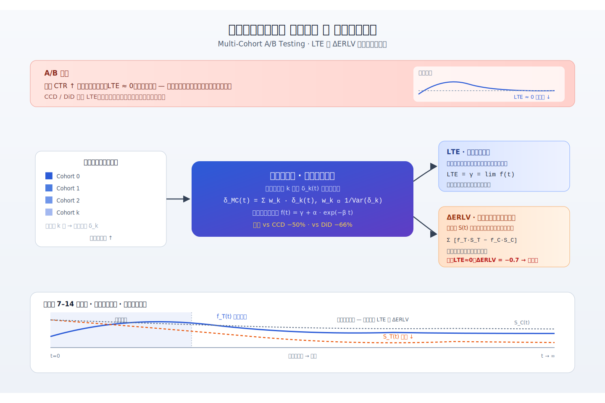
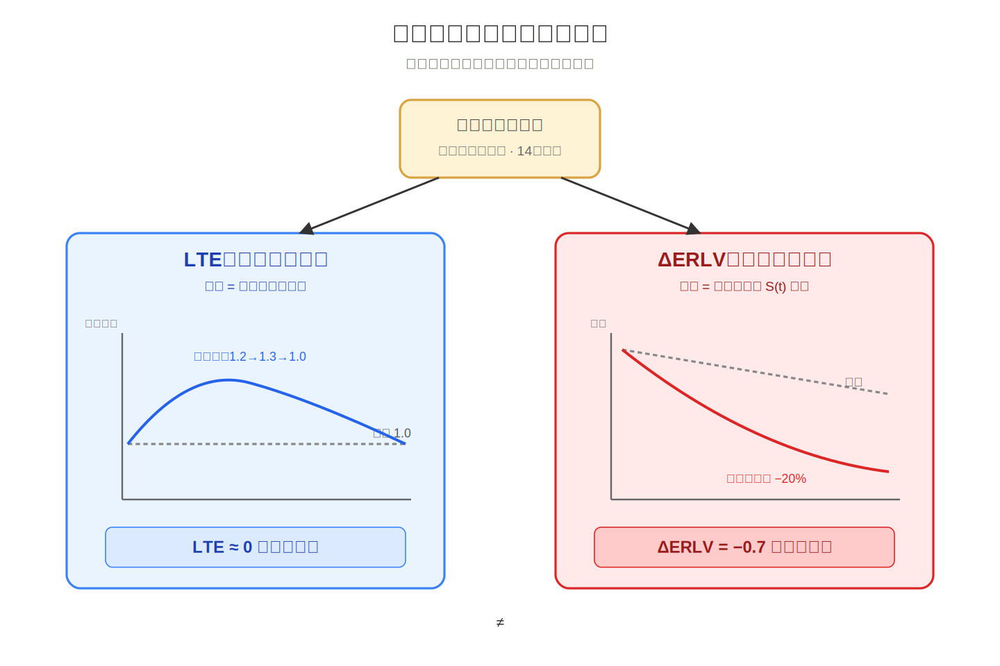
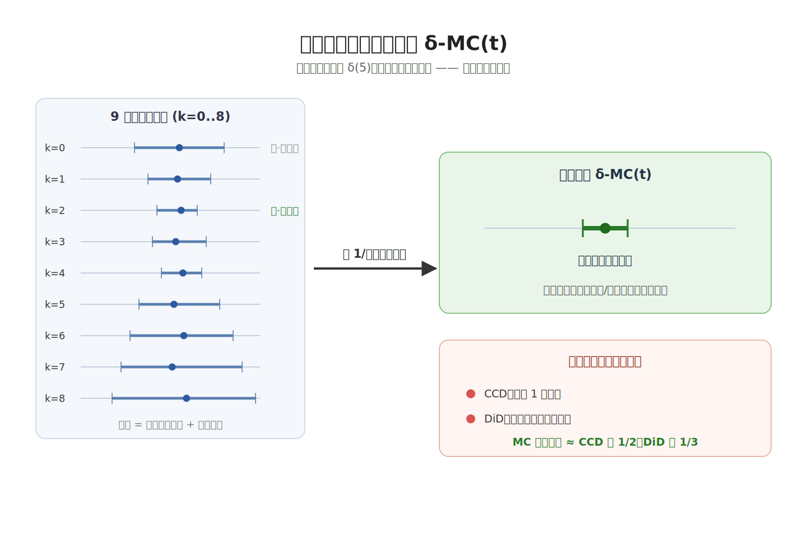
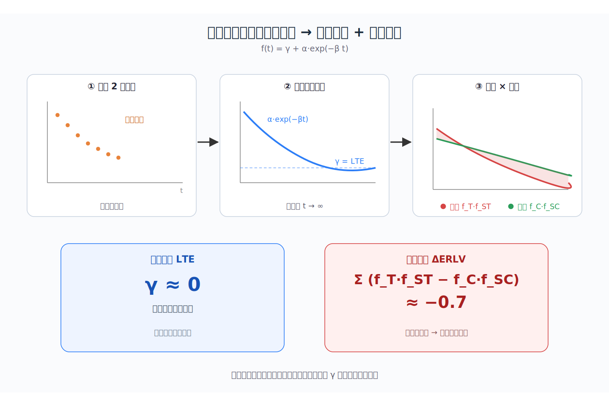
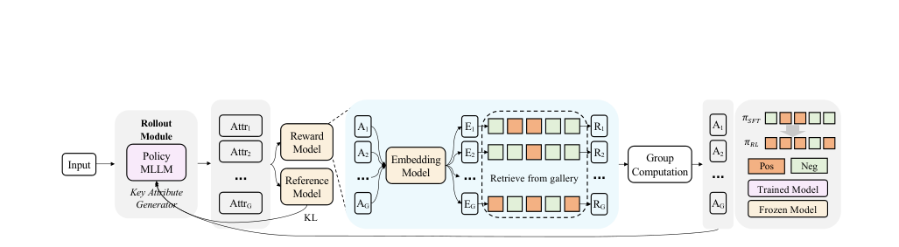
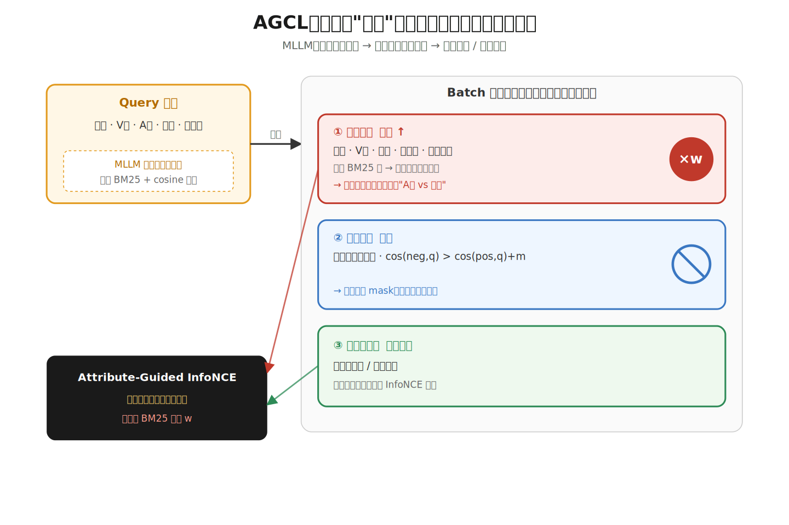
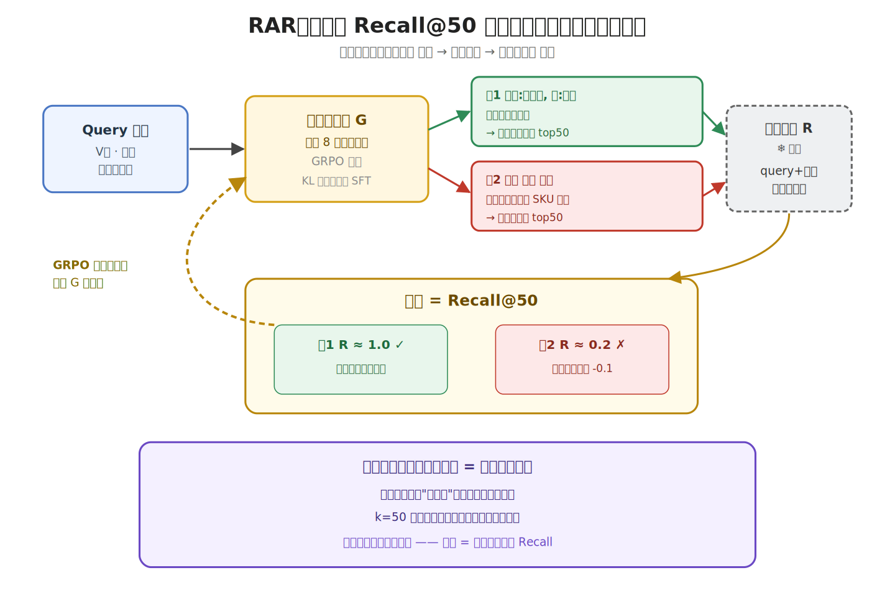
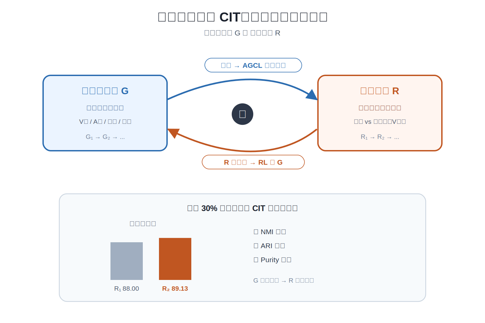

# 2026-04-23 论文日报

## 一、今日趋势与创新观察

### 1. 趋势概况

- 今天全量 333 篇中，LLM 与语言理解方向占到 168 篇，A…
- 表示学习与检索排序聚了 93 篇，RAG 评估、语义分层覆盖度、带…
- 推荐和电商侧出现 LLM 增强推荐的优化理论分析、电商多模态细粒度…

展开趋势详细版

- 今天全量 333 篇中，LLM 与语言理解方向占到 168 篇，Agent 与多智能体有 82 篇，语言模型与智能体仍是绝对主线。
- 表示学习与检索排序聚了 93 篇，RAG 评估、语义分层覆盖度、带时间与置信度的向量嵌入等方向尤其活跃，检索不再只看平均指标。
- 推荐和电商侧出现 LLM 增强推荐的优化理论分析、电商多模态细粒度商品表征、微视频流行度预测等工作，偏向把 LLM 表征真正塞回骨干模型。
- 因果评估、长期价值与 A/B 实验方法、鲁棒随机优化、云查询成本预测等零散但扎实的系统/方法论工作也在冒头。

### 2. 推荐系统 / 排序相关创新点

- 《Break the Optimization Barrier o…
- 阿里的 AFMRL 把属性信息作为细粒度锚点引入电商多模态表征，专…
- 流媒体场景下的多队列 A/B 推断工作，把用户学习效应和长期 LT…

展开创新点详细版

- 《Break the Optimization Barrier of LLM-Enhanced Recommenders》指出把 LLM 表征注入骨干推荐模型会阻碍其自身优化，并从理论上分析了训练损失居高不下的原因，给出一套可落地的缓解框架。
- 阿里的 AFMRL 把属性信息作为细粒度锚点引入电商多模态表征，专门解决 VLM2Vec 这类通用大模型在相似商品上分辨力不足的问题，对召回和同款识别有直接价值。
- 流媒体场景下的多队列 A/B 推断工作，把用户学习效应和长期 LTV 纳入统一估计框架，对广告和订阅类业务的长期实验评估方法论是很好的迁移参考。

### 3. 全局创新点

- 《Self-Aware Vector Embeddings for…
- 《Stateless Decision Memory for En…
- 《Automatic Ontology Construction …

展开全局创新详细版

- 《Self-Aware Vector Embeddings for RAG》提出给向量嵌入加上时间、置信度和关系依赖等元信息，让 RAG 知道一段知识是什么时候存的、来源多可信，摆脱把嵌入当成静态无上下文产物的做法。
- 《Stateless Decision Memory for Enterprise AI Agents》反其道而行，为受监管行业（核保、理赔、税务）设计无状态但可追溯的决策记忆，把合规需求直接做进 Agent 架构，而不是事后补日志。
- 《Automatic Ontology Construction Using LLMs》把 LLM 外挂一层结构化本体图作为记忆和规划底座，替代纯 RAG 的向量召回，让知识可验证、可推理、可维护。

## 二、今日一个 AI 知识点

### Off-Policy Evaluation 为什么能离线估计新策略

- **快速理解：** Off-Policy Evaluation 的难点在于：你手里只有旧策略下产生…

展开知识点详细版

Off-Policy Evaluation 的难点在于：你手里只有旧策略下产生的日志，但你想知道一个新策略如果当时上线，效果会怎样。它本质上是在做‘带偏差采样下的反事实估计’，核心不是直接平均，而是先校正旧策略和新策略看到样本的概率差。 广告排序、预算控制和出价优化都不可能天天线上试错，所以很多工业系统都依赖离线评估。先理解 OPE，才能看懂为什么一篇论文总在强调 propensity、reweighting 或 doubly robust。 可以顺着一次具体运行过程来理解：顺着一次计算过程看：日志里某次曝光原本是旧策略把广告A推上去的，旧策略给A的概率是0.8，而新策略只会在类似场景下以0.2的概率展示A；那这条样本在评估新策略时就不能按原权重直接算，而要乘一个和两者概率比相关的修正系数。把很多样本都这样校正后，才更接近‘如果新策略当时上线会发生什么’。

## 三、今日论文总览

### 1. Efficient Multi-Cohort Inference for Long-Term Effects and Lifetime Value in A/B Testing with User Learning
- 挑选理由：A/B实验中长期效应与LTV估计，方法论对广告实验评估与长期价值建模高度同构。

### 2. AFMRL: Attribute-Enhanced Fine-Grained Multi-Modal Representation Learning in E-commerce
- 挑选理由：电商场景商品多模态表征学习，对商品检索/召回有直接应用价值，作者来自阿里（Bo Zheng）

### 3. Learning to Evolve: A Self-Improving Framework for Multi-Agent Systems via Textual Parameter Graph Optimization
- 挑选理由：多agent系统自优化框架，与广告商业化链路无关

### 4. EvoAgent: An Evolvable Agent Framework with Skill Learning and Multi-Agent Delegation
- 挑选理由：通用Agent框架，与广告商业化无关

### 5. A Field Guide to Decision Making
- 挑选理由：通用决策指南，与广告分发无关。

### 6. Unlocking the Forecasting Economy: A Suite of Datasets for the Full Lifecycle of Prediction Market: [Experiments \& Analysis]
- 挑选理由：预测市场数据集，非广告分发

### 7. Robust Out-of-Distribution Stochastic Optimization
- 挑选理由：通用鲁棒优化理论，应用于报童和投资组合，与广告链路无明确联系

### 8. Pre-Execution Query Slot-Time Prediction in Cloud Data Warehouses: A Feature-Scoped Machine Learning Approach
- 挑选理由：BigQuery查询成本预测，与广告分发无关

### 9. Accelerating PayPal's Commerce Agent with Speculative Decoding: An Empirical Study on EAGLE3 with Fine-Tuned Nemotron Models
- 挑选理由：PayPal商业agent推理优化，涉及商业化场景但主要是推理加速而非广告决策链路，工业参考意义。

## 四、补充关注

1. **Break the Optimization Barrier of LLM-Enhanced Recommenders: A Theoretical Analysis and Practical Framework**
   - 理由：LLM增强推荐的优化问题，对排序模型有一定参考价值但未触达广告核心
2. **Seeing Further and Wider: Joint Spatio-Temporal Enlargement for Micro-Video Popularity Prediction**
   - 理由：短视频流行度预测涉及内容推荐与流量分配，对商业化分发有一定参考价值，但非直接广告链路

## 五、重点论文精读

### 1. Efficient Multi-Cohort Inference for Long-Term Effects and Lifetime Value in A/B Testing with User Learning
- **为什么值得看：** 给A/B实验加上用户留存视角，LTE和LTV一次测清楚
- **快速背景：** 短期A/B实验看涨的广告功能，可能因用户流失导致总价值下降；作者想一次实验同时估LTE和LTV。

*图示：这篇论文解决了广告A/B实验里一个常见陷阱：短期指标涨、长期指标中性，但用户其实在悄悄流失。它用多队列估计器同时估长期效应LTE和增量剩余生命周期价值ΔERLV，方法论对广告实验评估和LTV建模有直接迁移价值。*

展开论文背景详细版

- **详细背景：** 流媒体/广告产品里常遇到一个问题：在流间插广告，短期点击上升，长期人均点击回归正常（LTE≈0），但用户已经因广告疲劳悄悄流失，累计业务价值其实是负的。已有方法像CCD和DiD只估LTE，忽略了留存变化，而且只用了部分队列数据，方差大。论文把LTE和增量剩余生命周期价值ΔERLV统一在同一多队列估计框架里，一次短实验同时给出稳态效应和累计价值，对广告实验评估很有启发。

**核心技术点速览：**

#### 技术点 1：LTE与ΔERLV统一框架
- 快速理解：同一份分队列数据，通过是否计入流失用户，分别得到LTE和ΔERLV两个指标。

*图示：可以把它理解为：LTE只问'还留下来的用户人均表现怎样'，ΔERLV问'把留下来的人数也算进去，总蛋糕变大了还是变小了'。同一份实验数据，改一下有没有把流失用户计入分母，就能得到这两个互补的视角。*

展开技术点 1 详细版

- 技术细节：论文指出LTE和ΔERLV本质都是基于按进入时间分队列的数据，差别只在对缺失值(用户流失)的处理：LTE只看仍活跃用户的稳态人均差异，把流失当随机缺失；ΔERLV则把流失看作有信息事件，用生存函数S(t)加权累计，对处理组和对照组分别拟合指标轨迹和留存曲线，再按时间求和得到累计价值差。
- 通俗讲解：可以把它理解为：LTE只问'还留下来的用户人均表现怎样'，ΔERLV问'把留下来的人数也算进去，总蛋糕变大了还是变小了'。同一份实验数据，改一下有没有把流失用户计入分母，就能得到这两个互补的视角。
- 例子：比如插播广告实验：14天里处理组人均点击从1.2涨到1.3又回落到1.0，对照组稳定1.0，LTE算出来≈0；但处理组每天活跃用户比对照组少20%，把人数乘进去累加，ΔERLV=-0.7，明显为负，于是决策从'上线'变成'不上'。

#### 技术点 2：逆方差加权多队列估计
- 快速理解：把所有错峰进入的队列都用上，按方差倒数加权合并，显著降低估计方差。

*图示：CCD只用'最早一批处理用户 vs 刚进来的处理用户'这一种对比，DiD又只用最早进入的那批人，大量错峰进入的用户被浪费了。这里的做法是：任何两个进入时点差k天的队列对都能给一个δ估计，把它们按'谁更准谁权重大'加权平均，信息利用率就上来了。*

展开技术点 2 详细版

- 技术细节：对于用户学习曲线δ(t)，论文发现它可以用多种队列对照来估：δ-k(t) = T (t+k)-k − T (t+k)-(t+k)，其中k是不同进入时点。每个k给一个无偏估计但方差不同。论文用逆方差加权（权重=1/方差，归一化）把这些估计合成δ-MC(t)，合成后方差比任何单个估计都低。同一套加权方式也用到处理/对照组的指标序列和留存曲线估计上，再拟合指数衰减模型外推到无穷。
- 通俗讲解：CCD只用'最早一批处理用户 vs 刚进来的处理用户'这一种对比，DiD又只用最早进入的那批人，大量错峰进入的用户被浪费了。这里的做法是：任何两个进入时点差k天的队列对都能给一个δ估计，把它们按'谁更准谁权重大'加权平均，信息利用率就上来了。
- 例子：假设实验14天，想估t=5天时的学习效应。CCD只会用'day0进入的人在day5的表现 − day5刚进入的人在day5的表现'一个值；多队列法会同时算k=0,1,2,...,9对应的9个δ-5估计，每个算出自己的方差，方差小的权重高，加权平均后置信区间宽度比CCD窄50%、比DiD窄近3倍。

#### 技术点 3：参数化衰减外推
- 快速理解：用指数衰减模型拟合短期轨迹，外推得到稳态效应和累计价值。

*图示：短实验看不到长期稳态，就假设效应按指数衰减，用前两周数据把曲线参数拟出来，再往未来延伸积分。这样即使只跑7-14天，也能给出长期效应和累计价值的估计。*

展开技术点 3 详细版

- 技术细节：拿到多队列加权后的处理效应时间序列后，论文拟合f(t)=γ+α·exp(−βt)：γ就是t变成∞的渐近值，也就是LTE。对ΔERLV，则分别拟合处理组和对照组的指标曲线f-T、f-C以及留存曲线f-ST、f-SC，然后按t求和求和（f-T(t)·f-ST(t) − f-C(t)·f-SC(t)）得到累计价值差。
- 通俗讲解：短实验看不到长期稳态，就假设效应按指数衰减，用前两周数据把曲线参数拟出来，再往未来延伸积分。这样即使只跑7-14天，也能给出长期效应和累计价值的估计。
- 例子：处理组点击曲线拟合出f-T(t)=1.0+0.2·exp(-t/3)，留存f-ST(t)=exp(-0.05t)；对照组f-C(t)=1.0，f-SC(t)=exp(-0.02t)。把两组每天的'人均指标×留存率'相减，从t=0累加到T\*，得到ΔERLV≈-0.7，说明虽然稳态人均差不多，但留存差距让累计值为负。

- **对广告的启发：** 广告实验评估要同时看LTE和留存加权的累计价值，别被短期CTR骗了。

展开广告启发详细版

- **详细启发：** 最适合层级：广告实验平台与长期价值评估；价值：广告策略上线评估常只看短期CTR/eCPM或预估LTV，这套方法提示：同一份A/B数据可以用多队列逆方差加权同时估长期效应和累计价值，尤其适合评估插播广告、广告频控、激励广告等可能加速用户流失的策略；多队列估计也能直接用在广告侧短周期实验上，显著缩小置信区间。；风险：方法依赖指数衰减假设和生存曲线外推，若真实效应非单调衰减或存在季节性则会有偏；只在14天A/A数据上模拟验证，广告场景下用户异质性和长尾流失更复杂，迁移时需校准衰减模型形式，并配合单位经济学把指标换算成收入。

### 2. AFMRL: Attribute-Enhanced Fine-Grained Multi-Modal Representation Learning in E-commerce
- **为什么值得看：** 电商同款商品检索，属性生成+对比学习+强化学习三段式，对广告商品召回有直接借鉴
- **快速背景：** 电商里区分'红色V领真丝连衣裙'和'普通红裙'需要细粒度理解，但现有多模态大模型只做全局池化抓不住细节

*图示：该图明确标注为“overall framework”，直接展示了论文核心的 Retrieval-aware Attribute Reinforcement 训练流程，包含属性生成器、奖励模型、表征模型、检索与分组计算等关键模块及其信息流，最能代表论文方法主线。相比 Figure 3，它更接近整体框架图而非局部机制示意；同时该候选图主体完整、正文噪声较少，明显优于后面的案例图。*

展开论文背景详细版

- **详细背景：** 电商检索里，区分'V领A字真丝深红色连衣裙'和普通红裙这种细粒度差异非常关键，但像VLM2Vec这类多模态大表征模型用的是全局平均池化或最后token的隐状态，无法做区域级对齐，在细粒度任务上容易把视觉相似但语义不同的硬负样本搞混。论文把'细粒度理解'重新定义为'关键属性生成任务'，用MLLM显式生成属性来辅助表征学习，这套思路对电商同款检索、广告商品召回都有实际意义。

**核心技术点速览：**

#### 技术点 1：属性引导的对比学习AGCL
- 快速理解：用MLLM生成的关键属性算BM25，重新加权硬负样本并过滤假负样本

*图示：传统对比学习把batch里除正样本外的所有商品都当负样本硬拉开，但电商里经常有'同款不同图'、'同品牌不同SKU'这种情况，硬拉反而学坏。AGCL相当于给每个商品先写一份'属性小抄'，用小抄的文本相似度判断谁是真正该学的难题（词面接近但不是同款），谁是冤枉的（其实是同款只是写法不同），训练时重点磨前者、放过后者。*

展开技术点 1 详细版

- 技术细节：先用MLLM（从Qwen2.5-VL-72B蒸馏出的3B生成器）为每个商品生成一组关键属性，比如'麂皮材质、系带、橡胶底'。训练时对query和候选商品的属性文本算BM25分数，分数越高说明词面越像、越是难负样本，用一个有界激活函数把BM25变成权重去放大这些硬负样本的贡献；同时如果batch里某个负样本和query的cosine相似度比正样本还高出一个边界值，就判定它其实是假负样本，直接从分母里剔除掉。最终InfoNCE损失变成：分母只对筛选后的有效负样本求和，并对每个负样本乘上BM25权重。
- 通俗讲解：传统对比学习把batch里除正样本外的所有商品都当负样本硬拉开，但电商里经常有'同款不同图'、'同品牌不同SKU'这种情况，硬拉反而学坏。AGCL相当于给每个商品先写一份'属性小抄'，用小抄的文本相似度判断谁是真正该学的难题（词面接近但不是同款），谁是冤枉的（其实是同款只是写法不同），训练时重点磨前者、放过后者。
- 例子：query是一款'深红V领A字真丝连衣裙'，batch里有另一款'深红V领真丝连衣裙但是直筒版型'——属性BM25很高，判定为硬负样本，权重被放大，模型被强迫学会盯住'A字vs直筒'这个细节；而batch里另一张同款的不同角度图，cosine相似度比正样本还高，就会被mask掉不计入loss，避免被错误地推远。

#### 技术点 2：检索奖励驱动属性生成RAR
- 快速理解：把冻结表征模型的Recall@k直接当奖励，用GRPO微调属性生成器

*图示：监督学出来的属性生成器只是'看起来像'，不一定真的帮检索。RAR的思路是：让生成器自己试着生成几组属性，每组拿去真跑一次检索，哪组让正样本排进top50多就奖励哪组，像让学生自己做题看对错来学习，而不是只背标准答案。*

展开技术点 2 详细版

- 技术细节：AGCL阶段训出的属性生成器是监督蒸馏来的，目标和下游检索其实是脱节的。RAR阶段把表征模型冻住，让属性生成器对query采样一组属性，把属性拼到query输入里重新过表征模型做检索，把Recall@k（论文里选k=50最优，k太小信号太稀疏，k太大信号饱和）当作奖励；如果生成格式非法则给-0.1惩罚。优化用GRPO，优势函数按组内奖励均值方差归一化，并用KL项约束不要偏离SFT策略太远。
- 通俗讲解：监督学出来的属性生成器只是'看起来像'，不一定真的帮检索。RAR的思路是：让生成器自己试着生成几组属性，每组拿去真跑一次检索，哪组让正样本排进top50多就奖励哪组，像让学生自己做题看对错来学习，而不是只背标准答案。
- 例子：对query商品采样8组候选属性，第1组生成'(series:赤霞珠, color:深红)'跑检索发现ground-truth正样本都进了top50，奖励接近1；第2组生成的属性太泛、检索结果里挤进来一堆同品牌不同SKU，奖励只有0.2。GRPO根据这8组的奖励差异更新生成器，让它下次更倾向生成第1组那种有区分度的属性。训练中还观察到一个有趣现象：生成的属性长度会自发变短，因为冗余属性反而是噪声会拉低Recall。

#### 技术点 3：循环迭代训练CIT
- 快速理解：RL训好的生成器再回去喂AGCL，表征和生成器互相迭代提升

*图示：就是让'写属性的人'和'比对商品的人'轮流进步：属性写得更准变成对比学习挑硬负样本更准变成表征更强变成作为奖励模型再调出更好的属性生成器，如此循环。*

展开技术点 3 详细版

- 技术细节：因为属性生成器和表征模型是解耦的两个模型，RL阶段得到的更强生成器可以反过来再给AGCL产新的属性、重跑对比学习阶段；论文只用30%的训练样本做了一轮CIT，分类准确率从88.00涨到89.13，NMI、ARI、Purity也都有提升。
- 通俗讲解：就是让'写属性的人'和'比对商品的人'轮流进步：属性写得更准变成对比学习挑硬负样本更准变成表征更强变成作为奖励模型再调出更好的属性生成器，如此循环。
- 例子：第一轮：原始生成器给AGCL用，训出表征模型R1；R1当奖励模型，RL训出更强生成器G2；第二轮：用G2重新为样本生成属性，再跑一次AGCL训出R2，R2在下游分类、聚类任务上全面优于R1。

- **对广告的启发：** 广告商品召回可以借鉴'属性生成+硬负样本加权+检索指标当RL奖励'这套组合拳

展开广告启发详细版

- **详细启发：** 最适合层级：召回/向量检索层，尤其是商品广告的同款/相似商品召回和图文匹配；价值：一是假负样本mask思路可以直接用于广告召回——同一广告主、同一SKU的不同素材不该被当负样本互推；二是BM25属性加权可以增强对硬负样本（同类目不同卖点的商品）的判别力；三是'把线上检索/排序指标直接当RL奖励去微调表征相关的生成模型'这个范式，对广告里用LLM生成query改写、类目标签、卖点标签等都有直接迁移价值。；风险：论文自己也提到'对齐税'——RL策略过度对齐Recall@k后，在分类聚类等通用下游任务上收益变小，广告里如果一个表征要同时服务召回、粗排、精排多个目标，直接拿单一指标当奖励可能损害通用性；另外属性生成依赖一个72B oracle做冷启动蒸馏，工程成本不低，小团队复现要掂量。

## 六、候选但未完成深读的论文

当前重点论文都已完成可用分析。
