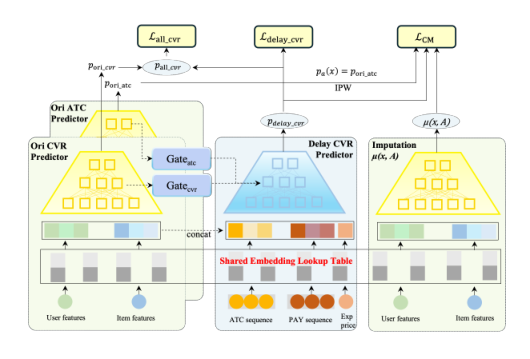
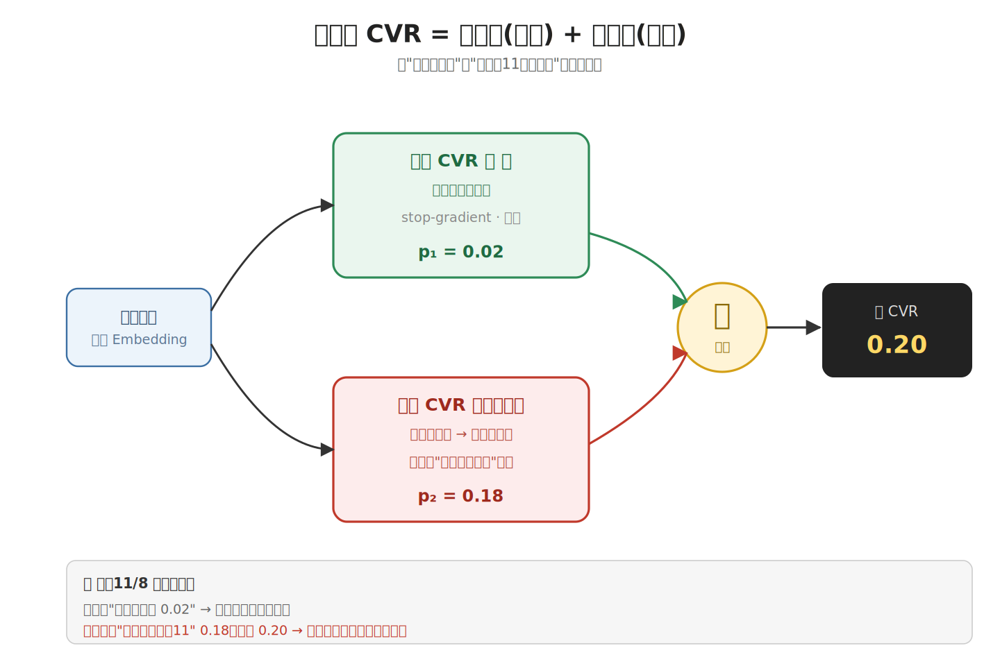
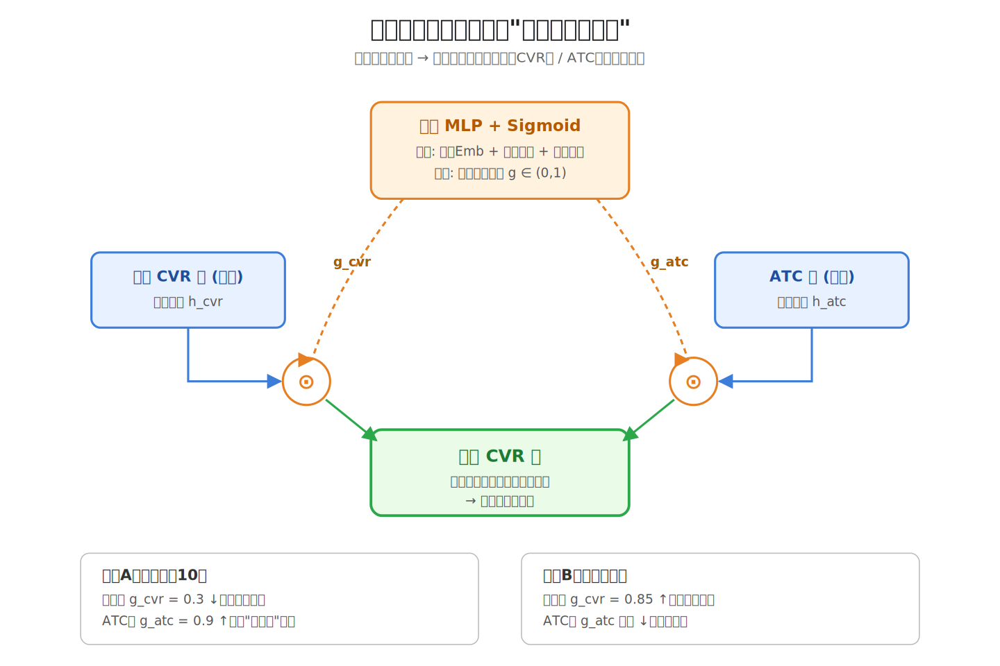
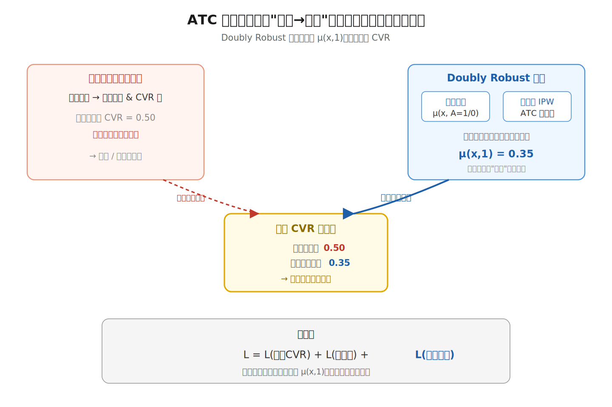
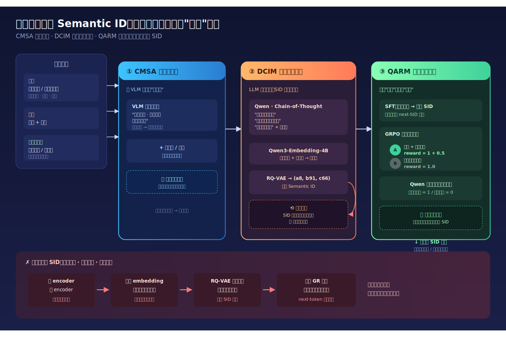
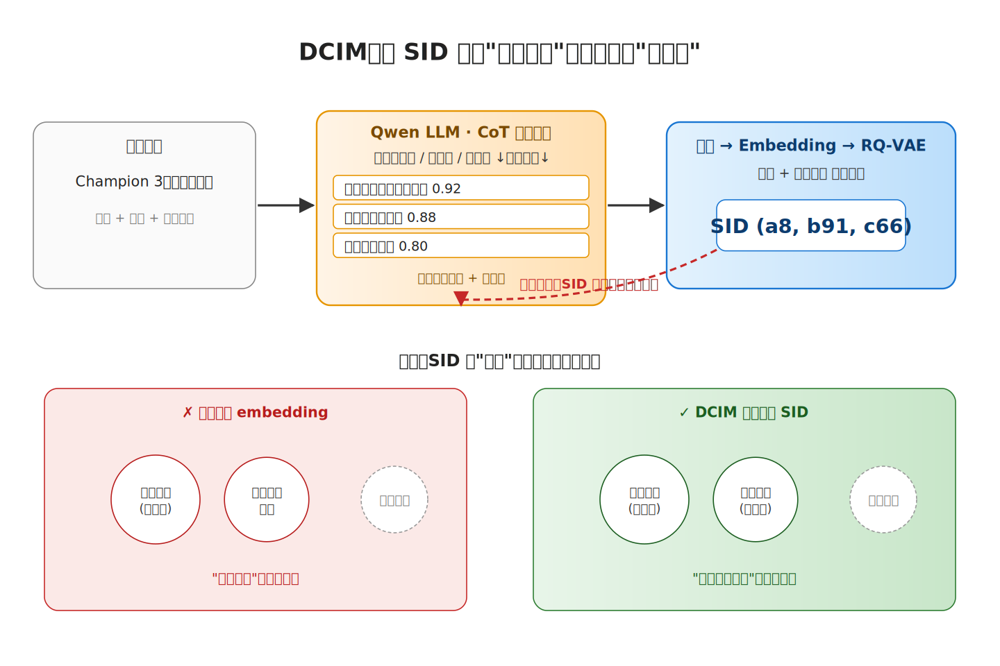
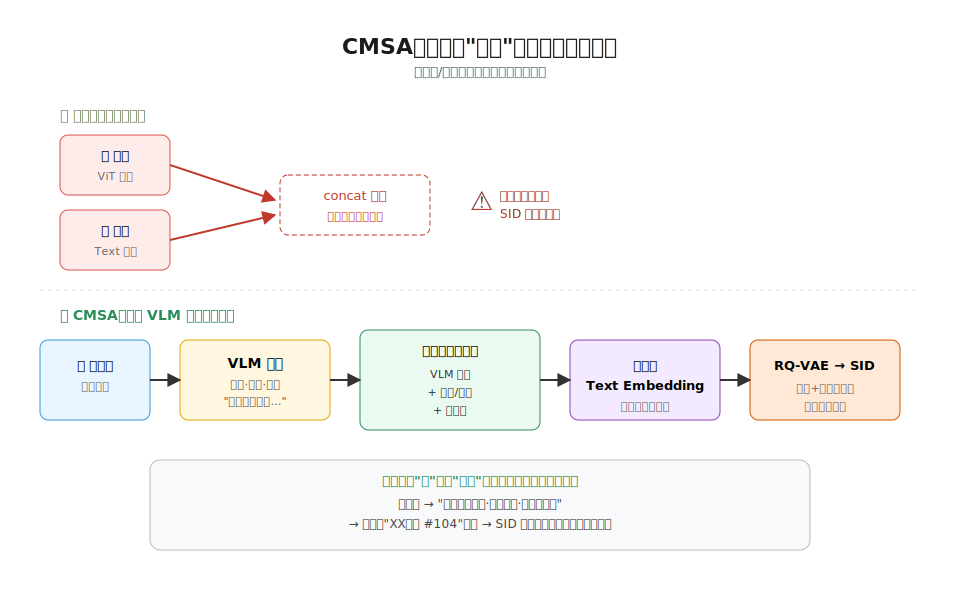
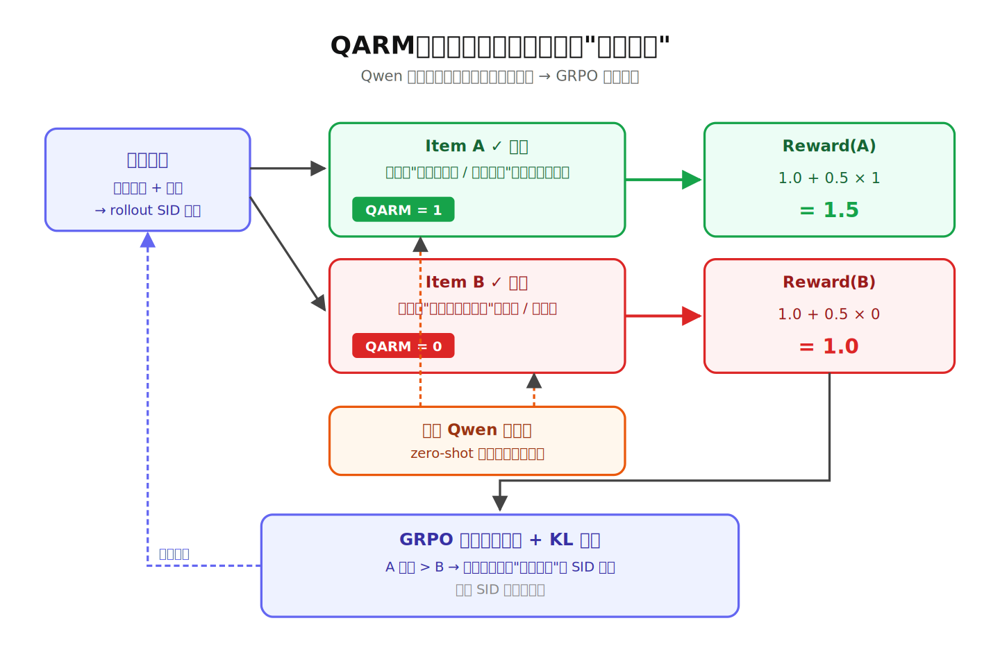

# 2026-04-24 论文日报

## 一、今日趋势与创新观察

### 1. 趋势概况

- 全量 341 篇里 cs.AI 占 180 篇，LLM 与语言理解…
- Agent 与多智能体方向有 57 篇，今日明显集中在 MCP/工…
- 表示学习与检索排序有 115 篇，重点话题落在生成式推荐 Sema…

展开趋势详细版

- 全量 341 篇里 cs.AI 占 180 篇，LLM 与语言理解主题高达 155 篇，语言模型相关工作依然是当天论文最主要的研究重心。
- Agent 与多智能体方向有 57 篇，今日明显集中在 MCP/工具调用开销、跨会话攻击、函数劫持等系统级和安全问题上，而非单纯能力展示。
- 表示学习与检索排序有 115 篇，重点话题落在生成式推荐 Semantic ID、长序列兴趣建模、多模态检索对齐以及点击行为假设的重新审视。
- 商业化与资源优化只有 14 篇，真正贴业务的工作集中在电商促销期延迟转化、在线招聘匹配等具体落地场景。

### 2. 推荐系统 / 排序相关创新点

- Counterfactual Multi-task Learnin…
- Deep Interest Mining with Cross-M…
- Mixture of Sequence 用主题感知的 MoE 结构…

展开创新点详细版

- Counterfactual Multi-task Learning 针对电商促销前期流量，把 CVR 预估拆成反事实多任务来处理延迟转化和分布漂移，并在线 A/B 验证了广告收入提升。
- Deep Interest Mining with Cross-Modal Alignment 指出现有 Semantic ID 生成存在两阶段信息退化问题，通过跨模态对齐直接端到端学 SID，提升生成式推荐的词表质量。
- Mixture of Sequence 用主题感知的 MoE 结构切分长用户序列，让不同专家只处理相关兴趣片段，缓解长序列里兴趣漂移带来的噪声问题。

### 3. 全局创新点

- Tool Attention Is All You Need 把 …
- DenoiseRank 把 Learning to Rank 从判…
- Cross-Session Threats in AI Agent…

展开全局创新详细版

- Tool Attention Is All You Need 把 MCP 里每轮都注入全量工具 schema 的做法换成动态工具门控加懒加载，实测能消掉每轮 1–6 万 token 的隐藏开销，是 Agent 系统工程层的一次实际优化。
- DenoiseRank 把 Learning to Rank 从判别式范式切到扩散生成范式，通过逐步去噪来产出排序分布，给传统 LTR 提供了一个完全不同的建模视角。
- Cross-Session Threats in AI Agents 指出当前 Agent 守护模块基本是无状态的，提出跨会话威胁基准 CSTM-Bench，把攻击面从单轮对话扩到多会话聚合，补上了 Agent 安全研究的一个盲区。

## 二、今日一个 AI 知识点

### Off-Policy Evaluation 为什么能离线估计新策略

- **快速理解：** Off-Policy Evaluation 的难点在于：你手里只有旧策略下产生…

展开知识点详细版

Off-Policy Evaluation 的难点在于：你手里只有旧策略下产生的日志，但你想知道一个新策略如果当时上线，效果会怎样。它本质上是在做‘带偏差采样下的反事实估计’，核心不是直接平均，而是先校正旧策略和新策略看到样本的概率差。 广告排序、预算控制和出价优化都不可能天天线上试错，所以很多工业系统都依赖离线评估。先理解 OPE，才能看懂为什么一篇论文总在强调 propensity、reweighting 或 doubly robust。 可以顺着一次具体运行过程来理解：顺着一次计算过程看：日志里某次曝光原本是旧策略把广告A推上去的，旧策略给A的概率是0.8，而新策略只会在类似场景下以0.2的概率展示A；那这条样本在评估新策略时就不能按原权重直接算，而要乘一个和两者概率比相关的修正系数。把很多样本都这样校正后，才更接近‘如果新策略当时上线会发生什么’。

## 三、今日论文总览

### 1. Counterfactual Multi-task Learning for Delayed Conversion Modeling in E-commerce Sales Pre-Promotion
- 挑选理由：电商促销期的CVR预估与延迟转化建模，含广告收入A/B测试，直接作用于商业化转化链路。

### 2. Deep Interest Mining with Cross-Modal Alignment for SemanticID Generation in Generative Recommendation
- 挑选理由：生成式推荐的Semantic ID生成，摘要明确提及广告上下文，适用于商业化推荐排序。

### 3. Mixture of Sequence: Theme-Aware Mixture-of-Experts for Long-Sequence Recommendation
- 挑选理由：针对CTR预估中的长序列用户兴趣建模，MoE架构与广告排序链路高度同构

### 4. Enhancing Online Recruitment with Category-Aware MoE and LLM-based Data Augmentation
- 挑选理由：在线招聘平台Person-Job Fit匹配，有LLM数据增强、类别感知MoE处理相似候选对，并有在线A/B测试与CTCVR提升，与广告排序/匹配场景高度同构，疑似阿里团队。

### 5. CRED-1: An Open Multi-Signal Domain Credibility Dataset for Automated Pre-Bunking of Online Misinformation
- 挑选理由：虚假信息识别数据集，与广告业务无关

### 6. The Last Harness You'll Ever Build
- 挑选理由：通用agent框架，与广告链路无关

### 7. TRAVELFRAUDBENCH: A Configurable Evaluation Framework for GNN Fraud Ring Detection in Travel Networks
- 挑选理由：旅行平台反欺诈图检测，与广告分发链路无关

### 8. Decoupled DiLoCo for Resilient Distributed Pre-training
- 挑选理由：Google分布式预训练框架，与广告分发链路无关。

## 四、补充关注

今天没有需要额外提示的补充关注论文。

## 五、重点论文精读

### 1. Counterfactual Multi-task Learning for Delayed Conversion Modeling in E-commerce Sales Pre-Promotion
- **为什么值得看：** 电商大促前CVR塌陷，用因果+多任务救延迟转化，直接拉广告收入
- **快速背景：** 大促前用户只加购不下单导致CVR暴跌，但45%订单来自这阶段的点击

*图示：这是论文的核心方法架构图（Figure 2, architecture of CM-DCM），直接展示了多任务结构、门控模块、共享 embedding、延迟 CVR predictor、插补模块以及损失/信息流关系，最能代表论文方法本身。相比带 caption 的 block 版本，这个候选更聚焦图形主体、正文噪声更少、图本体更完整，适合作为日报主图。*

展开论文背景详细版

- **详细背景：** 电商大促（双11、黑五）前的几天，用户大量浏览和加购却故意拖到促销日才下单，导致预热期CVR骤降，但约45%的促销日订单其实来源于这段预热期的点击。传统日常CVR模型在这里严重低估；标准延迟反馈建模又假设转化是连续延迟分布，而这里的延迟几乎全部集中在促销那一天，完全不符合假设，所以现有方法都失灵。论文第一次专门针对预热期这个窗口做延迟转化建模，而且是在真实电商广告平台上线跑通的。

**核心技术点速览：**

#### 技术点 1：直接+延迟转化双塔拆分
- 快速理解：把当天转化和促销日延迟转化拆成两个独立打分头，叠加得到总CVR

*图示：直觉上，预热期的用户转化其实是两种人：少数当天就买的（走老CVR塔），大多数是加购党、促销日才下单的（走新Delay塔）。论文没有让一个塔硬学两种分布，而是让老塔继续负责它擅长的当天转化，新塔专门补'延迟到促销日'这部分残差概率，加起来就是真实CVR。*

展开技术点 1 详细版

- 技术细节：模型保留一个在日常数据上预训练好的CVR塔（预测当天转化概率）和ATC塔（预测加购概率），并在其之上新加一个Delay CVR塔专门预测'点击发生在预热期、但转化发生在促销日'的概率。最终总CVR = 冻结的日常CVR分数 + 延迟CVR分数，日常塔在fine-tune阶段被stop-gradient冻结，避免被预热期稀疏数据带坏。训练时同时监督两个标签：全部转化标签y-all和只在促销日转化的y-delay，用两个交叉熵加权求和。
- 通俗讲解：直觉上，预热期的用户转化其实是两种人：少数当天就买的（走老CVR塔），大多数是加购党、促销日才下单的（走新Delay塔）。论文没有让一个塔硬学两种分布，而是让老塔继续负责它擅长的当天转化，新塔专门补'延迟到促销日'这部分残差概率，加起来就是真实CVR。
- 例子：比如一个用户11月8日点击了一件羽绒服，老CVR塔基于日常经验给出当天购买概率0.02，Delay塔额外看到她刚加购、价格敏感、历史大促爱囤货，输出延迟到11月11日下单的概率0.18，总CVR就是0.20。如果只用老塔，系统会以为这个点击几乎不转化，从而压低广告出价；拆开后广告系统知道它是一个高价值点击，该抢。

#### 技术点 2：个性化门控迁移
- 快速理解：用用户实时加购/购买行为生成门控，动态筛选日常CVR塔的表示供延迟塔使用

*图示：因为预热期只有几天、数据很稀，直接训延迟塔容易过拟合。日常CVR塔里其实藏了很多用户-商品偏好，但日常知识不能全搬过来——比如日常不怎么加购的人，迁移日常信号帮助大；而一个正在疯狂加购的用户，他的预热期信号比日常信号更可信，这时门就得把日常信号关小一点。*

展开技术点 2 详细版

- 技术细节：借鉴PEPNet思路，从预训练日常CVR塔和ATC塔的每一层隐藏表示中抽取特征，但不是直接拼接，而是先用一个小MLP基于（用户Embedding, 实时加购行为序列, 实时购买行为序列）算出sigmoid门控向量，再与对应层表示做逐元素相乘，最后拼进延迟塔。门控会根据当前用户的预热期行为强度自适应决定要迁移多少日常知识。
- 通俗讲解：因为预热期只有几天、数据很稀，直接训延迟塔容易过拟合。日常CVR塔里其实藏了很多用户-商品偏好，但日常知识不能全搬过来——比如日常不怎么加购的人，迁移日常信号帮助大；而一个正在疯狂加购的用户，他的预热期信号比日常信号更可信，这时门就得把日常信号关小一点。
- 例子：用户A预热期加购了10件商品，门控读到这个强信号后把日常CVR塔的某些通用偏好特征关小（门值0.3），而把ATC塔相关表示放大（门值0.9），延迟塔因此更多依赖'她是囤货型'这个证据；用户B几乎没加购，门控则几乎全开日常CVR表示（门值0.85），让日常塔的常规兴趣特征主导预测。

#### 技术点 3：ATC因果正则
- 快速理解：用Doubly Robust估计器约束延迟CVR要体现加购到转化的真实因果效应

*图示：相关性会被混淆：热门商品本来加购率就高、转化率也高，但这不代表加购本身推动了转化。Doubly Robust的作用是通过倾向分（预测用户加购概率）和结果模型互相纠偏，即便一个错了另一个还能兜底，估出来的加购变成转化效应更干净。把这个干净的因果效应当成监督信号，强制延迟塔的输出不偏离真实因果关系。*

展开技术点 3 详细版

- 技术细节：论文认为'预热期加购'对'促销日转化'不只是相关，而是有因果作用。用Doubly Robust估计器估计加购对延迟转化的个体因果效应：结合了一个结果回归模型μ(x, A=1/0)和以预训练ATC模型输出作为倾向分的IPW纠偏项。然后加一个正则损失，让延迟CVR预测去对齐反事实结果μ(x,1)，鼓励模型预测与'加购条件下应得的转化概率'一致，总损失 = 延迟CVR损失 + 全转化损失 + 因果正则损失。
- 通俗讲解：相关性会被混淆：热门商品本来加购率就高、转化率也高，但这不代表加购本身推动了转化。Doubly Robust的作用是通过倾向分（预测用户加购概率）和结果模型互相纠偏，即便一个错了另一个还能兜底，估出来的加购变成转化效应更干净。把这个干净的因果效应当成监督信号，强制延迟塔的输出不偏离真实因果关系。
- 例子：假设用户C点击了一件商品并加购，观测标签显示她促销日买了。μ(x,1)估出'她加购情况下应转化概率0.35'，μ(x,0)估'不加购时0.05'，因果效应0.30。延迟塔原本预测0.5（被热门度带偏），正则项把它往0.35拉，避免把商品本身火爆误当成用户真实转化意愿，线上出价和排序就不会被虚高CVR误导。

- **对广告的启发：** 广告大促预热期必须单独建延迟转化塔，且加购信号要做因果去偏

展开广告启发详细版

- **详细启发：** 最适合层级：转化率预估 / 延迟反馈建模 / 大促期出价；价值：对广告投放最直接的启发是：大促预热期的CVR不能复用日常模型，也不能套用连续延迟反馈方案，应该单独学一个'延迟到促销日'的残差概率头，并把加购行为作为核心因果信号纳入。实践上可以做成：日常CVR塔冻结 + 大促专属延迟塔 + 门控迁移 + ATC因果正则，线上验证能直接提升广告收入和GMV。对于出价系统，这种拆分还能避免预热期严重低估CVR导致的出价塌陷。；风险：一是该方案重度依赖有多期历史大促数据，对新业务或新市场冷启动不友好；二是延迟标签的定义（'促销日转化算延迟'）强依赖大促日历，预热窗口长度要人工根据campaign设定，自动化程度有限；三是Doubly Robust对倾向分模型质量敏感，如果ATC预估塔本身有偏，因果正则反而可能引入新的偏差；四是论文文本中未详细披露μ(x,A)结果模型的具体训练方式，落地时需要自己补这块细节。

### 2. Deep Interest Mining with Cross-Modal Alignment for SemanticID Generation in Generative Recommendation
- **为什么值得看：** 生成式广告推荐中Semantic ID生成的质量增强方案
- **快速背景：** 生成式推荐用Semantic ID压缩物料，但两阶段量化会丢语义、模态错位且好坏难辨。

*图示：论文针对生成式推荐核心组件Semantic ID的三大缺陷（信息退化、语义退化、模态失配）提出系统解法，且明确提到广告上下文，对商业化GR落地有参考价值。*

展开论文背景详细版

- **详细背景：** 生成式推荐（GR）把物料压成离散的Semantic ID（SID）序列，用next-token方式预测下一个item，已在电商、广告、视频等场景上线。但现有SID生成是两阶段：先学embedding，再做残差量化（RQ），这会带来三个问题——embedding和量化器目标不一致导致信息退化、量化阶段拿不到原始多模态特征导致语义退化、文本和图像被分别编码后在量化环节又错开导致模态失配。论文想在一个框架里同时修这三点，对做广告召回/生成的团队比较实用。

**核心技术点速览：**

#### 技术点 1：DCIM深度兴趣挖掘
- 快速理解：用LLM从物料元数据里挖出隐含用户动机，再和原文本拼起来做SID量化。

*图示：直觉上，一个'儿童3号足球'光看标题只能知道是足球，但LLM能补出'家长给孩子买训练用球''入门团队装备'这种动机标签。把这些动机文本和原标题一起喂给embedding模型，SID自然就会把'动机相似的商品'聚到一起，而不是只按字面属性聚。*

展开技术点 1 详细版

- 技术细节：对每个item的标题、描述（以及CMSA转成文本的图像描述），用Qwen系列LLM按Chain-of-Thought模板输出若干条'深层兴趣标签+置信度'，然后把这些兴趣标签和原始文本拼接，过Qwen3-Embedding-4B得到增强embedding，再送入RQ-VAE量化成多级SID。训练时SID要能重构这些兴趣文本，相当于给SID加了一路重构监督，迫使它保留上下文语义。
- 通俗讲解：直觉上，一个'儿童3号足球'光看标题只能知道是足球，但LLM能补出'家长给孩子买训练用球''入门团队装备'这种动机标签。把这些动机文本和原标题一起喂给embedding模型，SID自然就会把'动机相似的商品'聚到一起，而不是只按字面属性聚。
- 例子：输入一个Champion 3号青少年足球：LLM先分析表面属性（橡胶、青少年、训练级），再推理上下文意图得到'青少年体育发展训练''家长为孩子购买娱乐足球''入门团队装备'等兴趣标签；把这些标签拼到原始标题描述后面，过文本embedding得到一个富含动机的向量，再被RQ-VAE量化成类似(a8, b91, c66)的多层SID，这样它会和'家长买的儿童篮球'靠得更近，而不是和'职业比赛足球'靠得近。

#### 技术点 2：CMSA跨模态对齐
- 快速理解：用VLM先把图像翻成描述文本，让量化器只在统一文本空间里工作。

*图示：常规做法是图走一个CNN/ViT、文走一个文本encoder，再concat；但这两个向量空间本来就没对齐，量化器只按文本语义训过，图那边就会被扭曲。CMSA的思路是干脆让VLM把图'讲出来'，全部变成文字，量化器就只需要处理一种模态。*

展开技术点 2 详细版

- 技术细节：对每个item的图片，用Vision-Language Model按对齐提示词生成一段描述视觉属性（风格、配色、使用场景、生活方式）的文本，然后和原有标题、描述拼成统一的多模态文本，再过同一个文本embedding模型得到对齐embedding，交给RQ-VAE量化。这样绕开了'图像编码器+文本编码器分别编码再拼接'带来的空间不一致问题。
- 通俗讲解：常规做法是图走一个CNN/ViT、文走一个文本encoder，再concat；但这两个向量空间本来就没对齐，量化器只按文本语义训过，图那边就会被扭曲。CMSA的思路是干脆让VLM把图'讲出来'，全部变成文字，量化器就只需要处理一种模态。
- 例子：对一张口红图片，VLM输出'哑光质地、复古红棕、适合秋冬通勤、氛围感妆容'；这段文字和原标题'XX品牌唇膏 #104'拼起来，再加上DCIM挖的'职场通勤妆''秋冬换季补货'等兴趣，一起送去embedding和量化，最终的SID里就同时编码了视觉风格和使用场景，而不会出现'图embedding指向一种语义、SID却落到另一种'的偏移。

#### 技术点 3：QARM质量感知强化
- 快速理解：用LLM给挖出的兴趣打0/1质量标签，作为RL额外奖励压制低质SID。

*图示：只按'有没有猜中下一个item'给奖励太稀疏，而且猜中的item可能SID本身就烂。QARM的做法是：先让LLM审一遍每个item的兴趣标签质量，质量好的item在命中时多给一点奖励，等于告诉策略'不仅要猜对，还要倾向于猜那些语义清晰的商品'，反过来低质SID就慢慢被冷落。*

展开技术点 3 详细版

- 技术细节：训练分两步：先SFT让生成模型学会根据用户历史+兴趑描述预测目标SID序列；然后用一个轻量Qwen分类器对每条DCIM兴趣做zero-shot二分类（1=具体可执行、0=空泛或幻觉）。RL阶段的奖励由两部分组成：基础奖励是生成SID是否命中真实目标item（0/1），质量奖励是被命中item对应的兴趣质量标签是否为1，总奖励是基础+0.5×质量奖励，用GRPO做组内相对优势优化，并加KL正则防止偏离SFT策略。
- 通俗讲解：只按'有没有猜中下一个item'给奖励太稀疏，而且猜中的item可能SID本身就烂。QARM的做法是：先让LLM审一遍每个item的兴趣标签质量，质量好的item在命中时多给一点奖励，等于告诉策略'不仅要猜对，还要倾向于猜那些语义清晰的商品'，反过来低质SID就慢慢被冷落。
- 例子：某次rollout模型生成SID序列解码回item A和item B，都命中了候选目标：A的兴趣是'职场通勤妆、秋冬换季'（QARM=1），B的兴趣是'价格便宜的买家'（QARM=0，太空泛）。两者base reward都是1，但A额外拿到0.5的质量奖励，总分1.5 vs 1.0；GRPO在组内归一化后，A的优势明显高于B，策略更新会让模型今后更倾向生成类似A这种'兴趣清晰'的SID路径。

- **对广告的启发：** 给广告生成式召回的物料Token化提供了可落地的三件套改造方案。

展开广告启发详细版

- **详细启发：** 最适合层级：广告召回/生成式推荐的物料侧Semantic ID构建；价值：广告物料天然是多模态（创意图+标题+落地页文案），而且存在大量'字面相似但投放意图不同'的商品。把LLM挖兴趣+VLM转文本+质量感知RL这套流程搬到广告SID生成上，可以让同一类投放意图的creative聚到相近SID，缓解长尾广告冷启，也能让生成式排序更容易学到'用户意图→广告簇'的映射。QARM那套用LLM打质量标签做RL奖励的思路，对广告里常见的'命中但低质创意'问题也有直接借鉴意义。；风险：一是整条pipeline重度依赖LLM/VLM推理（DCIM挖兴趣、CMSA图转文、QARM打标），在亿级广告库上离线成本和更新频率是个挑战；二是论文实验只在Amazon三个公开数据集（Beauty/Sports/Instruments）上做，没有真实广告流量验证，迁移到CTR/CVR目标时质量奖励的α=0.5是否合适、LLM打标是否会引入偏见都需要重新调；三是用LLM生成的兴趣标签可能有幻觉，即便有QARM过滤，残留噪声仍可能污染SID语义。

## 六、候选但未完成深读的论文

当前重点论文都已完成可用分析。
