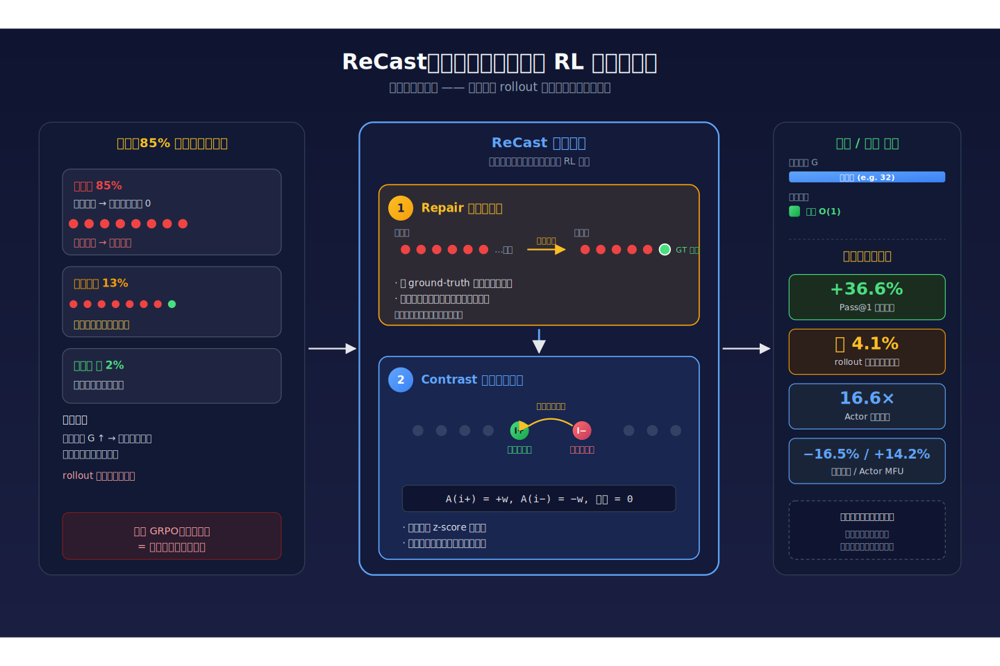
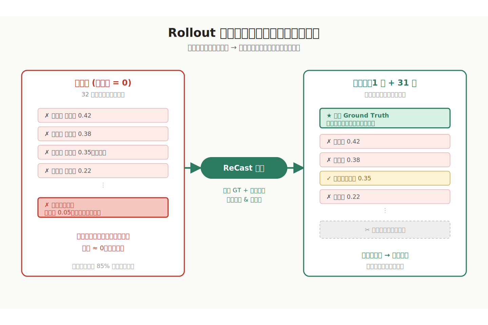
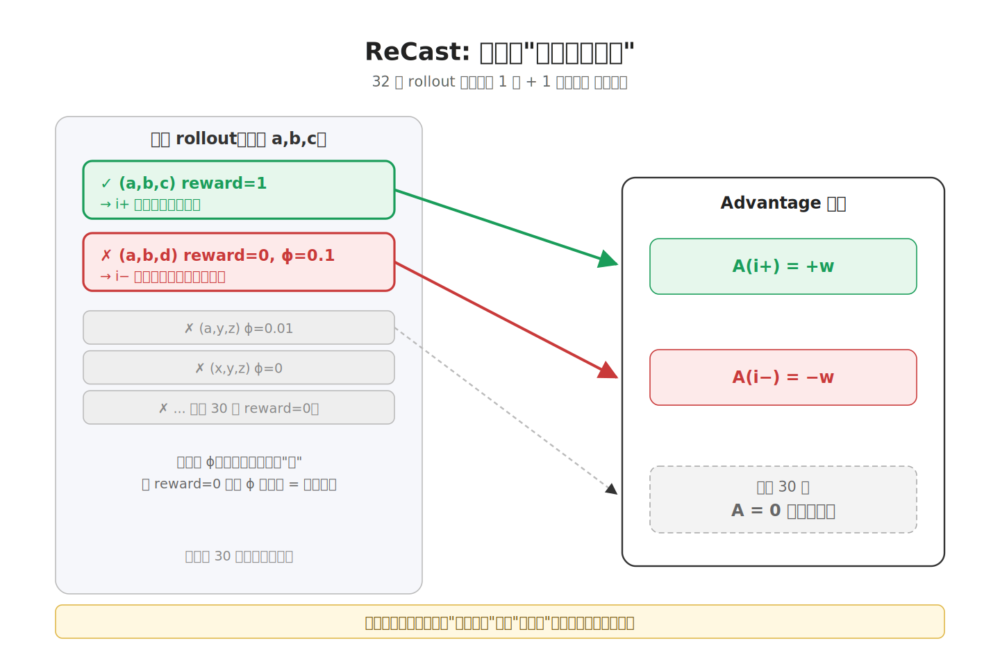
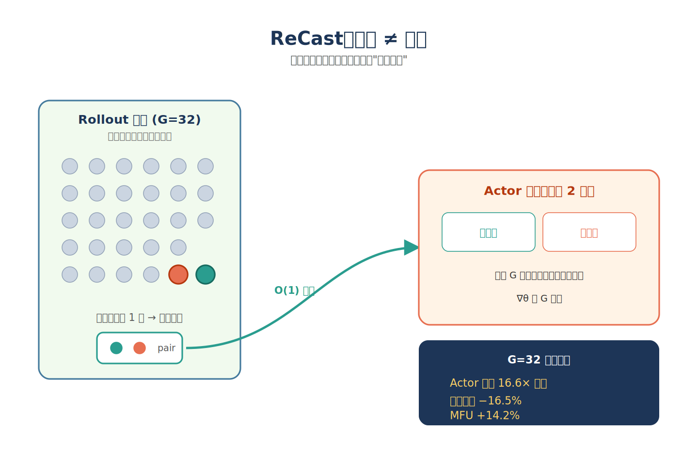
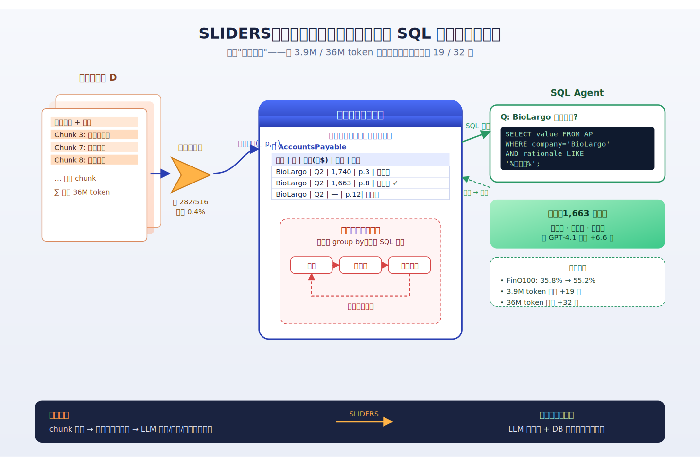
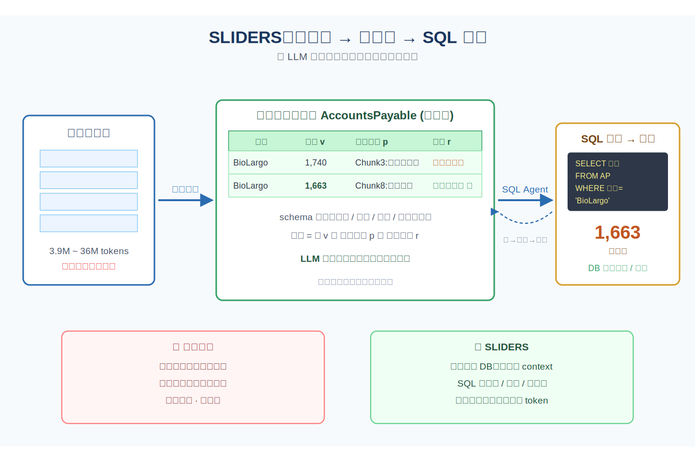
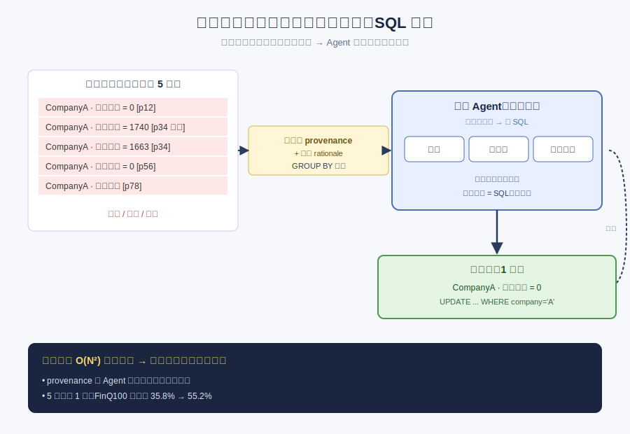
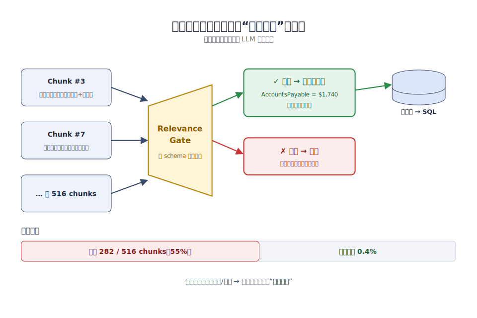

# 2026-04-27 论文日报

## 一、今日趋势与创新观察

### 1. 趋势概况

- 全量 205 篇论文中，cs.AI 与 cs.LG 占据主体，LL…
- 表示学习与检索排序紧随其后(56 篇)，多篇工作围绕 LLM 语义…
- Agent 与多智能体方向出现 28 篇，涵盖搜索 Agent 基…

展开趋势详细版

- 全量 205 篇论文中，cs.AI 与 cs.LG 占据主体，LLM 与语言理解主题高达 83 篇，是当天最突出的研究重心。
- 表示学习与检索排序紧随其后(56 篇)，多篇工作围绕 LLM 语义嵌入与协同信号融合、listwise 重排、稠密检索蒸馏展开。
- Agent 与多智能体方向出现 28 篇，涵盖搜索 Agent 基准、Agentic World Modeling 等更系统化的尝试，而非单点 prompt 工程。
- 商业化与资源优化类论文较少但开始出现生成式推荐 RL、客户 LTV 预测等偏落地的工作，整体还未形成强广告变现主线。

### 2. 推荐系统 / 排序相关创新点

- ReCast 针对生成式推荐中 rollout 组常因稀疏命中而无…
- ResRank 通过残差段落压缩把稠密检索与 LLM listwi…
- 'Rethinking Semantic Collaborativ…

展开创新点详细版

- ReCast 针对生成式推荐中 rollout 组常因稀疏命中而无法形成有效对比的问题，提出'先修复再对比'的学习信号重塑框架，解决 group-based RL 在推荐场景的塌陷。
- ResRank 通过残差段落压缩把稠密检索与 LLM listwise 重排放进一个端到端训练流程，同时缓解长上下文下的'lost in the middle'与排序效果衰减。
- 'Rethinking Semantic Collaborative Integration' 质疑当前主流的 LLM 语义向量与协同向量简单对齐范式，指出两者并非共享潜在实体，提出更深层的融合视角。

### 3. 全局创新点

- Sharpness-Aware Poisoning 把 sharp…
- CLVAE 用变分自编码器建模稀疏且不规则的交易序列，兼顾概率型客…
- 'Agentic World Modeling' 把世界模型从机器…

展开全局创新详细版

- Sharpness-Aware Poisoning 把 sharpness-aware minimization 的思路迁移到推荐系统投毒攻击，使注入的假用户画像在未知受害模型上也保持迁移性，拓展了鲁棒性攻防的方法论。
- CLVAE 用变分自编码器建模稀疏且不规则的交易序列，兼顾概率型客户基模型的长周期稳健性与深度模型的灵活性，为 LTV 预测提供新的生成式路径。
- 'Agentic World Modeling' 把世界模型从机器人/视频生成推进到 Agent 的基础能力层，系统性讨论其能力边界与规律，是全局层面值得跟踪的方向。

## 二、今日一个 AI 知识点

### 表示学习为什么是很多系统的隐形底座

- **快速理解：** 表示学习的目标不是简单把输入压成一个向量，而是把真正影响任务的结构信息保留下来…

展开知识点详细版

表示学习的目标不是简单把输入压成一个向量，而是把真正影响任务的结构信息保留下来，同时把噪声和偶然因素压下去。后面的检索、排序、聚类、生成，很多时候都只是拿这个表示继续做计算。 很多论文表面看是在做召回、排序、生成，其实核心改进都发生在表示层。先理解表示学习，就更容易抓住论文真正的创新位置。 可以顺着一次具体运行过程来理解：你可以顺着一次前向这样理解：系统先把用户最近点击、搜索词、广告文案和商品属性分别编码，再通过共享空间把它们投到同一组向量坐标里；如果两个对象在任务上更相关，它们在这个空间里就应该更近；后续做召回时，只要比较向量距离，就能先快速找出更可能相关的一批候选。

## 三、今日论文总览

### 1. ReCast: Recasting Learning Signals for Reinforcement Learning in Generative Recommendation
- 挑选理由：生成式推荐RL中稀疏奖励信号重构，对广告生成式排序训练有借鉴意义。

### 2. Contexts are Never Long Enough: Structured Reasoning for Scalable Question Answering over Long Document Sets
- 挑选理由：长文档QA，与广告商业化链路无关。

### 3. Navigating Large-Scale Document Collections: MuDABench for Multi-Document Analytical QA
- 挑选理由：多文档分析QA基准，与广告商业化无关。

### 4. PrivSTRUCT: Untangling Data Purpose Compliance of Privacy Policies in Google Play Store
- 挑选理由：隐私政策合规分析，虽涉及Google Play但不涉及广告决策链路。

## 四、补充关注

1. **Objective Shaping with Hard Negatives: Windowed Partial AUC Optimization for RL-based LLM Recommenders**
   - 理由：面向Top-K的partial AUC优化，对排序指标对齐有参考，但未直接涉及广告。
2. **CLVAE: A Variational Autoencoder for Long-Term Customer Revenue Forecasting**
   - 理由：客户长期收入/LTV预测，对营销资源分配和广告投放定向有一定参考价值，但未直接涉及广告链路

## 五、重点论文精读

### 1. ReCast: Recasting Learning Signals for Reinforcement Learning in Generative Recommendation
- **为什么值得看：** 生成式推荐RL奖励稀疏，ReCast修复信号对广告生成式排序直接可借鉴
- **快速背景：** 生成式推荐RL中85%采样组全零无法学习，论文提出修复+边界对比改造训练信号。

*图示：广告生成式排序也面临奖励稀疏、正样本难采到的问题，论文提出的'先修复再对比'信号构造思路可直接迁移到广告GRPO训练中，降低训练成本并稳定收敛。*

展开论文背景详细版

- **详细背景：** 生成式推荐用LLM直接生成目标商品，并用GRPO等组内归一化RL来优化Pass@K指标，但在单目标稀疏命中场景下作者观察到约85%采样组全零奖励、13%只有一条命中，只有2%有有意义结构，导致大量rollout算力被浪费在根本没法学的组里。现有工作多在奖励塑形和优化稳定性上做改进，但没人追问'这个组到底学得动吗'，这正是论文切入的核心问题。

**核心技术点速览：**

#### 技术点 1：Rollout修复全零组
- 快速理解：全零奖励组里塞进一个真实正样本当锚点，保证至少有正负边界可学。

*图示：相当于学生做题全错时老师直接给一个标准答案塞进卷子，让模型至少有一个'对'的参照物可以和错的比较，否则整组都是错的，梯度无从下手。注意这个注入只替换掉最没用的那条负样本，避免破坏有结构价值的'近似答案'。*

展开技术点 1 详细版

- 技术细节：当采样组中所有响应奖励都为0时，论文从ground-truth构造一个'锚点正样本'注入组内，同时把组里结构分最低（即最不像目标）的那条响应剔除掉，保留信息量更大的负样本。修复后重新计算奖励和结构分再进入后续更新；若组内已有正样本则不修复。
- 通俗讲解：相当于学生做题全错时老师直接给一个标准答案塞进卷子，让模型至少有一个'对'的参照物可以和错的比较，否则整组都是错的，梯度无从下手。注意这个注入只替换掉最没用的那条负样本，避免破坏有结构价值的'近似答案'。
- 例子：比如给定用户历史，模型采样32个商品ID响应全都猜错，奖励全0。ReCast找出32条中结构分最低的那条（比如商品类目都不沾边）删掉，把真实目标商品作为第33条插进来，于是这组就有了1个正、31个负，可以继续走对比更新。

#### 技术点 2：边界对比更新
- 快速理解：只对组内最强正样本和最难负样本做对比更新，其他样本梯度置零。

*图示：与其把整组32个样本的奖励做z-score归一化再分配梯度，不如只盯着决策边界上最关键的一对——一个正确答案和一个几乎蒙对的错误答案——让模型把概率质量从后者搬到前者，这样梯度方向更干净，不会被一堆无关噪声样本稀释。*

展开技术点 2 详细版

- 技术细节：从可训练组中选两条：正样本取任务奖励最高的那条（i+），负样本取奖励为0但结构分最高、也就是最像目标的那条（i-）。优势值只给这两条分配+w和-w（默认w=1），其他所有响应优势值为0，再套上标准KL正则的策略梯度目标。用一个结构分函数ϕ把'前两位ID匹配但第三位错'打0.1、'只匹配第一位'打0.01，用来排序负样本的'难度'。
- 通俗讲解：与其把整组32个样本的奖励做z-score归一化再分配梯度，不如只盯着决策边界上最关键的一对——一个正确答案和一个几乎蒙对的错误答案——让模型把概率质量从后者搬到前者，这样梯度方向更干净，不会被一堆无关噪声样本稀释。
- 例子：比如正样本是目标商品ID (a,b,c)本身，组里还有一条错误响应(a,b,d)结构分0.1、和一条(x,y,z)结构分0。ReCast会选(a,b,c)作正、(a,b,d)作负（它最像但不对，最容易混淆），只对这两条算log概率梯度，其余30条不更新。

#### 技术点 3：搜索-更新解耦
- 快速理解：rollout仍采G条广撒网，但actor反向传播只走2条，显著降训练成本。

*图示：原来想多撒网找正样本就得连带承担多倍的梯度计算，现在把'搜索'和'学习'拆开：要多采可以多采，但真正回传梯度的永远只有边界那两条，硬件利用率和训练速度都上去了。*

展开技术点 3 详细版

- 技术细节：传统GRPO里组大小G既决定采样宽度也决定反向传播的样本数，成本随G线性增长。ReCast把更新宽度固定为O(1)（就那对正负），rollout宽度G保持不变，因此增大G只增加采样成本而不增加actor侧前向反向成本，论文在G=32时实测actor更新快16.6×、峰值显存降16.5%、MFU提升14.2%。
- 通俗讲解：原来想多撒网找正样本就得连带承担多倍的梯度计算，现在把'搜索'和'学习'拆开：要多采可以多采，但真正回传梯度的永远只有边界那两条，硬件利用率和训练速度都上去了。
- 例子：G=32时，基线actor每步处理6.93M有效token、耗时211秒；ReCast在采样同样32条的前提下，真正送进actor更新的只有~0.47M token，单步actor更新时间降到12.7秒，用4.1%的rollout预算就追上基线20K步的效果。

- **对广告的启发：** 广告生成式召回/排序的RL训练可用同款'修复+边界对比'降本增效。

展开广告启发详细版

- **详细启发：** 最适合层级：生成式广告召回和排序的RL后训练阶段（奖励为是否命中转化/点击目标广告）；价值：广告场景下正样本（点击/转化）天然稀疏，GRPO式训练极易出现全零组。借鉴rollout修复可以把真实转化广告注入保证组可学；边界对比只更新'最像目标的误召回'和'真实目标'这对，能让模型学会区分相似创意/相似商品，同时大幅降低RL训练的GPU成本，特别在大模型化趋势下收益会放大。；风险：论文自己也指出强backbone场景下强行注入锚点可能引入bias、侵蚀SFT已学到的结构；广告里创意多样性和长尾覆盖要求更高，若只盯边界一对可能牺牲探索广度，需要评估是否影响召回多样性和冷启动表现。结构分ϕ的设计也高度依赖任务ID结构，广告里需要重新设计可比的'结构相似度'度量。

### 2. Contexts are Never Long Enough: Structured Reasoning for Scalable Question Answering over Long Document Sets
- **为什么值得看：** 用关系数据库+SQL做超长文档QA，对广告离线大规模信息整合有借鉴意义
- **快速背景：** LLM长上下文窗口放不下真实文档集，分块聚合又会复现长上下文问题

*图示：这篇论文不是广告方向论文，属于强迁移的长文档问答工作。它提出把海量长文档先抽成结构化关系表再用SQL推理的范式，对广告里做素材库理解、商家资质审核、行业知识沉淀、召回候选画像构建等'把非结构化大语料落到结构化状态'的场景有直接启发。*

展开论文背景详细版

- **详细背景：** 金融、医疗等场景的分析师常需要跨上百份文档、上千万token去综合证据，而再大的LLM上下文窗口也装不下真实语料。常见做法是把文档切块、各块抽取后拼起来让模型再读一遍，但当块数变多时，这堆中间证据本身又变成了一个新的长上下文，论文称之为'聚合瓶颈'。SLIDERS的价值在于换了一条路：不把证据塞回上下文，而是抽进关系数据库用SQL来算，并在3.9M、36M token的新基准上大幅超过现有方法。

**核心技术点速览：**

#### 技术点 1：文档转关系数据库
- 快速理解：不让LLM再读大段文本，而是把证据落到表里用SQL回答问题

*图示：核心直觉是：LLM不擅长在一大段拼起来的证据上做聚合、去重、比大小这类操作，但数据库天生就擅长。所以先让LLM做它擅长的'读一小段抽事实'，再让数据库做它擅长的'把一堆事实拼起来算'。一次问答就变成：schema变成逐块抽行变成SQL查询变成答案。*

展开技术点 1 详细版

- 技术细节：给定问题q和文档集D，系统先按问题和文档元信息归纳出一个schema，每张表每个字段都带有语义描述、类型、单位、量级（如千美元）和归一化规则。然后分块抽取，每条记录除了取值v外，还存原文引用p和抽取理由r，形成带溯源的关系表。回答阶段由一个SQL Agent反复写查询、执行、看结果再改写，直到拿到答案。
- 通俗讲解：核心直觉是：LLM不擅长在一大段拼起来的证据上做聚合、去重、比大小这类操作，但数据库天生就擅长。所以先让LLM做它擅长的'读一小段抽事实'，再让数据库做它擅长的'把一堆事实拼起来算'。一次问答就变成：schema变成逐块抽行变成SQL查询变成答案。
- 例子：比如问'BioLargo公司的应付账款是多少'。系统先建表AccountsPayable(公司名, 报告期, 应付账款(千美元), 币种)；Chunk 3在资产负债表里抽出'应付账款及应计费用 1,740'，Chunk 8在附注里抽出明细合计1,663；都以带原文引用的行写入表；最后SQL按公司名聚合，配合理由字段判断哪一个才是纯应付账款，返回1663千美元。

#### 技术点 2：带溯源的数据对账
- 快速理解：用主键分组+溯源证据让Agent写SQL去重、解冲突、合并互补记录

*图示：关键点是：为什么Agent敢改数据？因为每一行都带着原文引用和抽取理由，Agent能看见'这个1740来自合并的应付+应计，那个1663才是纯应付账款'，于是可以有据地选值、合并或丢弃，而不是凭空猜。整个改动又都是SQL，可审计。*

展开技术点 2 详细版

- 技术细节：抽出的表里同一实体常有重复、冲突、互补记录。论文把对账拆成两阶段：先让LLM投票选主键，做文档内和跨文档的实体归一（如'J. Smith'和'John Smith'对齐），再按主键group by把问题切成小分区；每个分区里Agent从去重、冲突解决、合并互补三种操作中选一种，基于provenance和rationale写SQL去修改该分区，迭代直到不再需要操作。这样把原本随记录数平方增长的两两比较降成按键分区的局部推理。
- 通俗讲解：关键点是：为什么Agent敢改数据？因为每一行都带着原文引用和抽取理由，Agent能看见'这个1740来自合并的应付+应计，那个1663才是纯应付账款'，于是可以有据地选值、合并或丢弃，而不是凭空猜。整个改动又都是SQL，可审计。
- 例子：FinQ100里一个公司会被抽出5条长期借款行，有的写0有的写具体值有的是子项明细。对账Agent按公司名group，看provenance发现多数是'未披露长期借款'的互补证据，于是写UPDATE把该公司合成一行'长期借款=0'；平均每组从5行压到约1行，FinQ100从35.8%直接涨到55.2%。

#### 技术点 3：上下文化分块+相关性门控
- 快速理解：抽取前先给每块补文档级上下文，再用门控判断是否值得抽，压住幻觉

*图示：直觉是：严格schema会逼模型在没证据时也硬填一个值，幻觉很多；先问一句'这块跟我们要抽的东西有关吗'，没关的直接跳过，既省钱又减少脏数据。分块时保留章节头也很重要，否则抽出一个孤立数字不知道它属于哪张报表。*

展开技术点 3 详细版

- 技术细节：每个文档先生成标题和简介作为全局元信息，再保留章节标题、表格、图注等结构信号做局部元信息，按这些边界切chunk，避免把表头和表体切散。抽取时先跑一个relevance gate，让模型判断这块是否包含schema相关证据，不相关直接跳过，只有通过门控的块才真正调用结构化抽取。作者实测门控拒掉了282/516个chunk，误杀率只有0.4%。
- 通俗讲解：直觉是：严格schema会逼模型在没证据时也硬填一个值，幻觉很多；先问一句'这块跟我们要抽的东西有关吗'，没关的直接跳过，既省钱又减少脏数据。分块时保留章节头也很重要，否则抽出一个孤立数字不知道它属于哪张报表。
- 例子：比如一份10-Q里第7块只是风险提示文字，没有任何财务数字。门控判断与AccountsPayable schema无关，直接返回空集，不进抽取；第3块是合并资产负债表，门控通过，再做结构化抽取，得到带'应付账款及应计费用$1,740'原文引用的一行。这样脏数据不会污染后续SQL聚合。

- **对广告的启发：** 广告里可把素材/商家/行业知识先离线抽成结构化库，线上用SQL或检索做一次性复用

展开广告启发详细版

- **详细启发：** 最适合层级：离线素材与商家知识库构建、行业/品类理解、合规审核；价值：广告里有大量类似长文档QA的场景：商家资质和行业文档审核、品牌素材合规、长尾类目知识沉淀、竞品财报/政策解读等。可以借鉴SLIDERS的范式，把这些非结构化语料一次性抽成带溯源的关系表（如商家-资质-有效期-来源句），之后的多种下游问题（风控、定向、创意生成prompt）都可复用同一份库，用SQL/特征查询代替每次重新塞进LLM上下文，显著降本并提升可审计性。对账思想也能用来合并多渠道抽出的商家/商品属性冲突。；风险：广告场景对时效性和吞吐要求高，而SLIDERS端到端一次问答要几分钟、成本每题~0.76美元，更适合离线批处理，不适合实时竞价链路；schema归纳对问题类型敏感，开放式广告需求可能难以事先定义schema；抽取+对账中任一步骤出错都会被后续SQL放大，需要人工抽检和provenance兜底。

## 六、候选但未完成深读的论文

当前重点论文都已完成可用分析。
