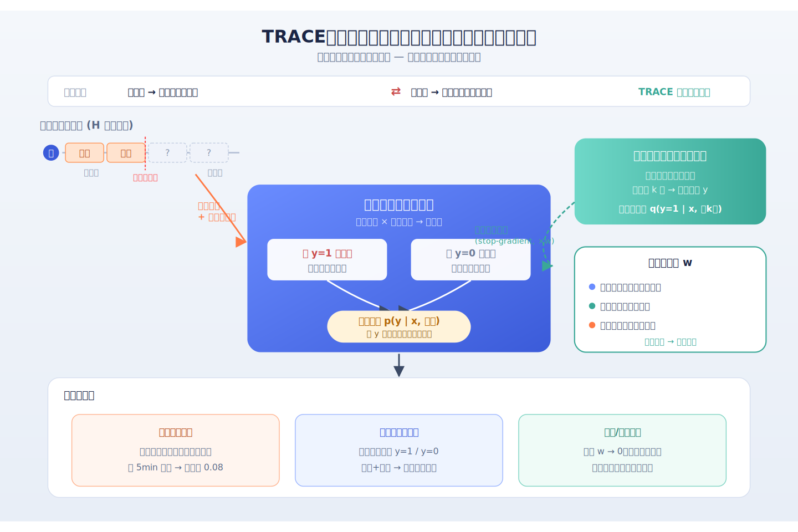
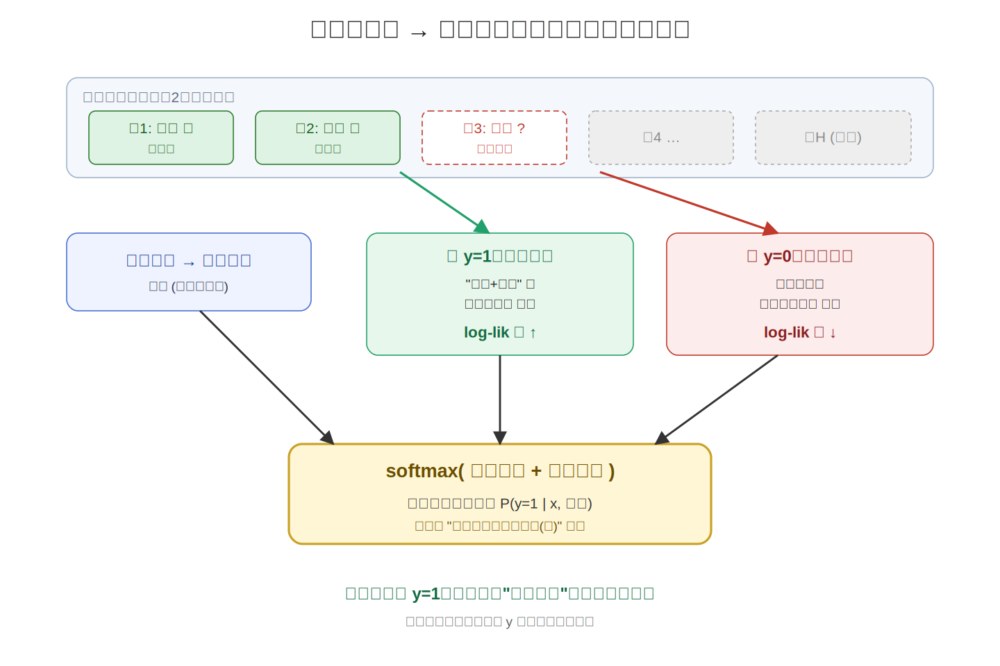
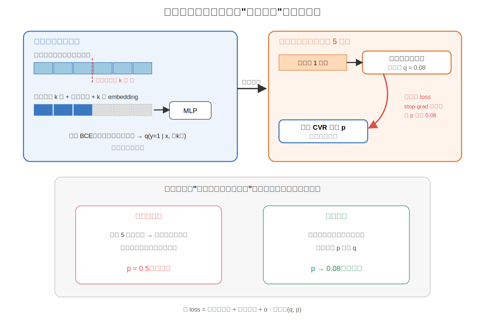
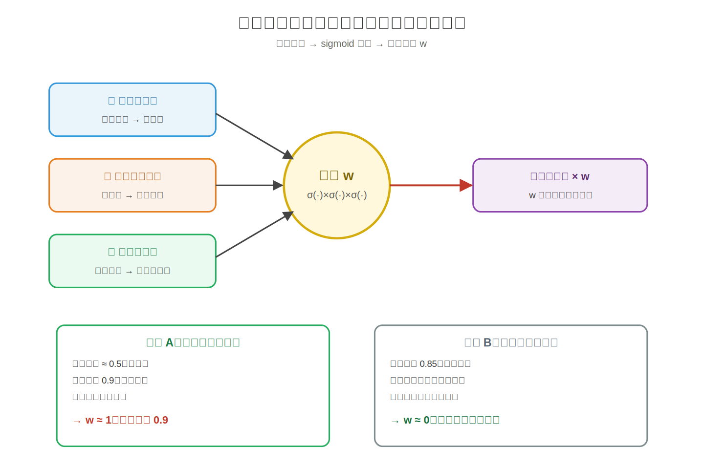
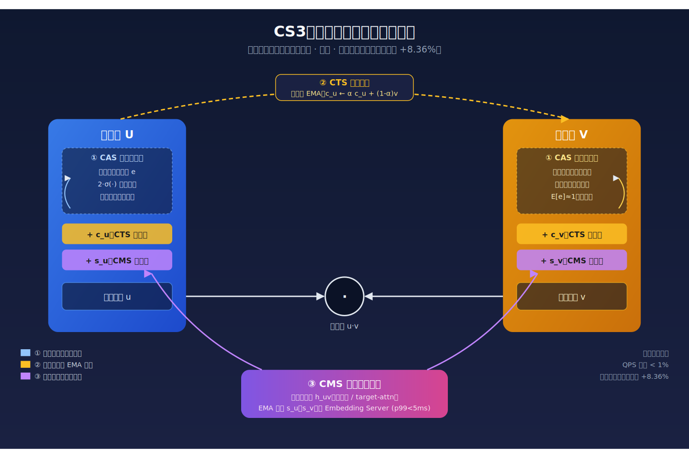
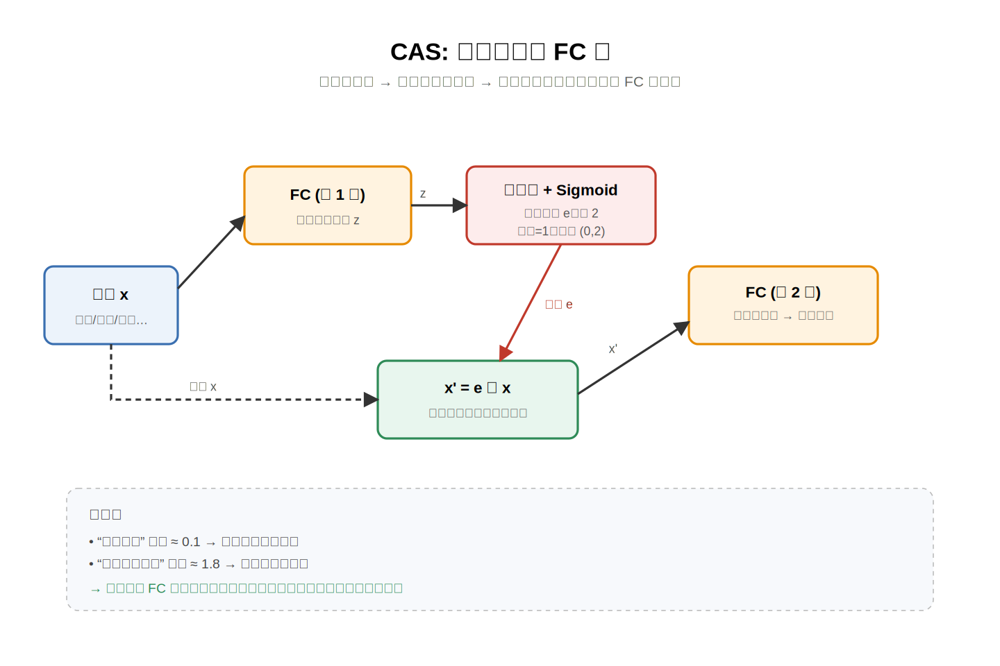
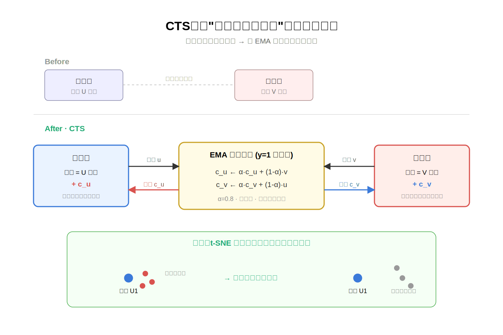
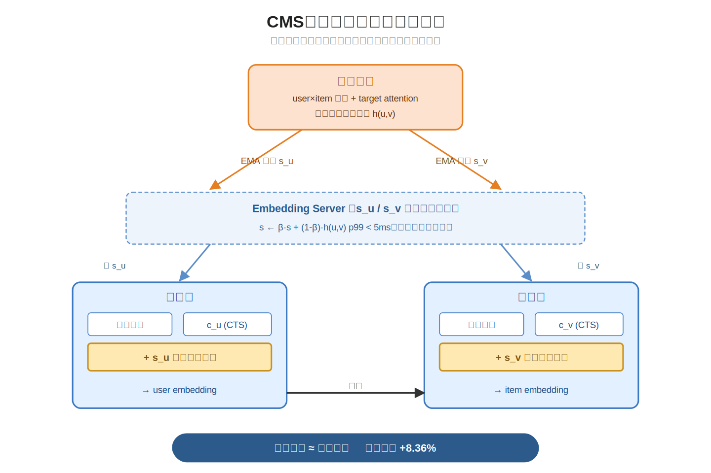
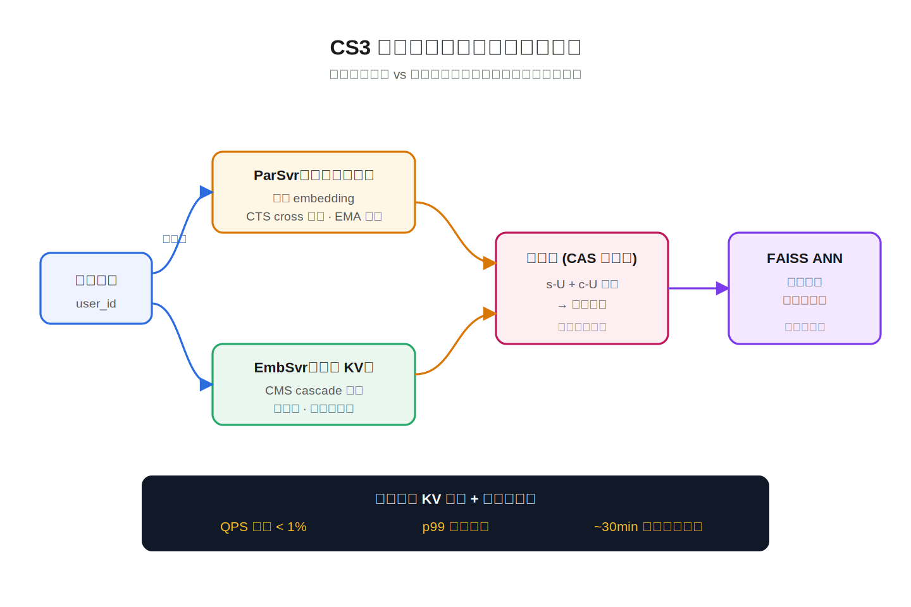
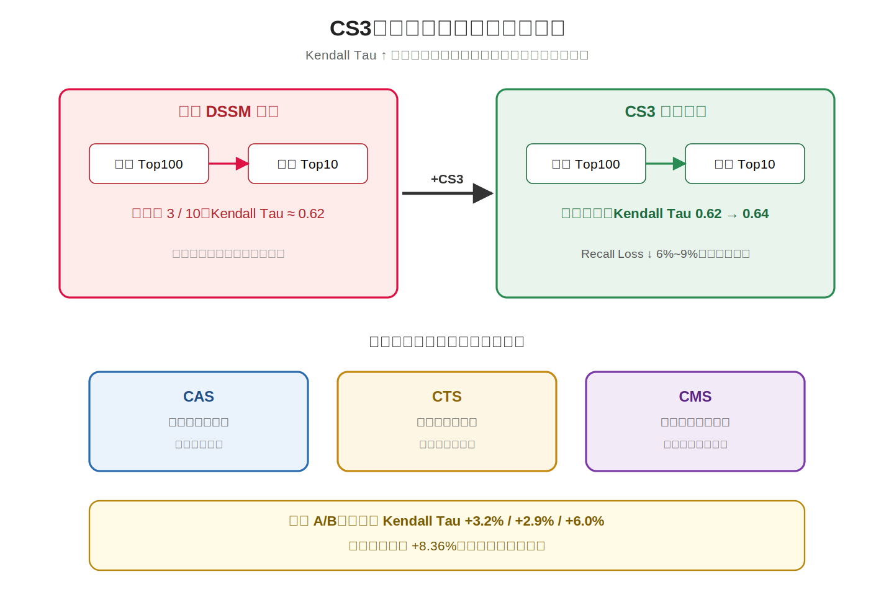

# 2026-04-28 论文日报

## 一、今日趋势与创新观察

### 1. 趋势概况

- 当日全量646篇中，cs.AI以342篇占据主导，LLM 与语言理…
- Agent 与多智能体方向出现120篇，集中在工具使用、多轮推理协…
- 表示学习与检索排序贡献192篇，既有视觉自监督表示的几何分析，也有…

展开趋势详细版

- 当日全量646篇中，cs.AI以342篇占据主导，LLM 与语言理解（292篇）是最大主题，反映研究重心仍在语言模型的推理、对齐与应用层扩展。
- Agent 与多智能体方向出现120篇，集中在工具使用、多轮推理协议、记忆体系与垂直领域（代码、核工程、网络安全）的落地形态。
- 表示学习与检索排序贡献192篇，既有视觉自监督表示的几何分析，也有多模态 Semantic ID、RoPE 改造等偏工业的表示改进。
- 仅34篇涉及商业化决策与资源优化，Agent 部署评测、市场参与者建模等话题开始浮现，但整体仍是少数派。

### 2. 推荐系统 / 排序相关创新点

- 《Follow the TRACE》把点击后用户行为轨迹显式建模进…
- 快手的 Adaptive Semantic ID 把多模态 SID…
- 《Learning to Rotate》把 RoPE 的旋转流形本…

展开创新点详细版

- 《Follow the TRACE》把点击后用户行为轨迹显式建模进 CVR 预测里，不再只在延迟分布或重加权上打补丁，而是把观察窗口内的行为演化当作延迟转化的信号源。
- 快手的 Adaptive Semantic ID 把多模态 SID 从静态码本升级为工业级自适应学习方案，正面处理 token 碰撞、语义漂移与下游召回效果之间的矛盾，并跑到线上 GMV。
- 《Learning to Rotate》把 RoPE 的旋转流形本身视为可学习对象，让时间与语义共同参与旋转编码，在大型社交 feed 的生成式推荐中直接改善排序校准。

### 3. 全局创新点

- Kwai Summary Attention 把长上下文压缩成摘要…
- ZenBrain 用神经科学启发的七层记忆架构给 Agent 设计…
- MTServe 针对生成式推荐模型的在线服务瓶颈，设计跨请求的分层…

展开全局创新详细版

- Kwai Summary Attention 把长上下文压缩成摘要式注意力结构，试图在 LLM 推理、代码 Agent 与推荐长序列三种场景里共用同一套长上下文机制。
- ZenBrain 用神经科学启发的七层记忆架构给 Agent 设计巩固、遗忘与再巩固流程，跳出了虚拟内存分页和扁平向量库的工程隐喻。
- MTServe 针对生成式推荐模型的在线服务瓶颈，设计跨请求的分层 KV 缓存复用方案，把 LLM 推理侧的 KV 缓存工程迁到推荐服务链路。

## 二、今日一个 AI 知识点

### Agent 和一次性预测模型到底差在哪

- **快速理解：** Agent 和普通一次性预测模型最大的差别，是它不是只对一个输入给一个答案，而…

展开知识点详细版

Agent 和普通一次性预测模型最大的差别，是它不是只对一个输入给一个答案，而是会先观察环境，再决定下一步动作，然后根据新反馈继续调整。也就是说，它天然是一个带回路的系统，而不是一拍脑袋做完就结束。 很多新论文会把搜索、推荐、工具调用和规划串起来，这背后常常就是 Agent 思路。理解这个差别，有助于判断一篇论文到底是在做模型能力，还是在做任务编排。 可以顺着一次具体运行过程来理解：比如一个投放助手先读取过去一小时的点击率、转化率和预算消耗，判断问题是素材疲劳还是出价偏高；接着它调用检索工具找历史相似案例，再决定先换素材还是先降价；执行后再看新反馈，如果点击回升但转化没动，就继续改落地页策略。这个‘看信息-做动作-再看结果’的闭环，就是 Agent 的核心。

## 三、今日论文总览

### 1. Follow the TRACE: Exploiting Post-Click Trajectories for Online Delayed Conversion Rate Prediction
- 挑选理由：直接研究在线延迟反馈下的CVR预测，利用点击后轨迹建模，是广告/商业化核心问题。

### 2. CS3: Efficient Online Capability Synergy for Two-Tower Recommendation
- 挑选理由：双塔召回模型改进，部署于快手大规模广告系统，明确提升广告收入。

### 3. Beyond Static Collision Handling: Adaptive Semantic ID Learning for Multimodal Recommendation at Industrial Scale
- 挑选理由：工业级多模态Semantic ID学习，快手电商短视频召回线上A/B GMV提升，直接商业化分发

### 4. Similar Users-Augmented Interest Network
- 挑选理由：CTR预估模型，利用相似用户行为增强目标用户序列，是广告/推荐排序核心任务

### 5. Birds of a Feather Cluster Nearby: a Proximity-Aware Geo-Codebook for Local Service Recommendation
- 挑选理由：本地服务生成式推荐的语义ID，融合地理约束，与本地生活/LBS广告召回链路强同构。

### 6. CASP: Support-Aware Offline Policy Selection for Two-Stage Recommender Systems
- 挑选理由：两阶段推荐的离线策略选择与DR估值，对广告召回-排序策略选型有较强借鉴。

### 7. FreeScale: Distributed Training for Sequence Recommendation Models with Minimal Scaling Cost
- 挑选理由：大规模工业序列推荐模型分布式训练系统，与广告排序系统训练基础设施高度同构。

### 8. Learning to Rotate: Temporal and Semantic Rotary Encoding for Sequential Modeling
- 挑选理由：在大型社交网络生产级新闻feed排序生成式推荐上评估RoPE扩展，提升校准与排序指标，与广告排序高度同构。

### 9. MTServe: Efficient Serving for Generative Recommendation Models with Hierarchical Caches
- 挑选理由：生成式推荐模型的在线服务系统，涉及KV缓存与推理加速，与工业推荐/广告排序链路同构，有工程参考价值。

### 10. Geometric Analysis of Self-Supervised Vision Representations for Semantic Image Retrieval
- 挑选理由：图像检索表示分析，与广告链路无关

### 11. Scalable Hyperparameter-Divergent Ensemble Training with Automatic Learning Rate Exploration for Large Models
- 挑选理由：大模型训练超参优化，与广告业务无关

### 12. Cloudless-Training: A Framework to Improve Efficiency of Geo-Distributed ML Training
- 挑选理由：地理分布式训练框架，与广告业务链路无关，虽提及Tencent Cloud但仅为实验平台。

### 13. Chinese-SkillSpan: A Span-Level Dataset for ESCO-Aligned Competency Extraction from Chinese Job Ads
- 挑选理由：标题虽含Job Ads，但实际是招聘文本技能NER数据集，与商业化广告分发无关。

### 14. Kwai Summary Attention Technical Report
- 挑选理由：快手团队长上下文注意力机制，摘要提及推荐系统应用，可能影响商业化序列建模。

### 15. RedParrot: Accelerating NL-to-DSL for Business Analytics via Query Semantic Caching
- 挑选理由：小红书电商广告业务分析场景的NL-to-DSL加速，业务侧有价值但不属于广告核心决策链路。

## 四、补充关注

1. **Modeling Behavioral Intensity and Transitions for Generative Recommendation**
   - 理由：多行为生成式推荐，用Taobao/Tmall电商数据，但未直接涉及广告或商业化决策

## 五、重点论文精读

### 1. Follow the TRACE: Exploiting Post-Click Trajectories for Online Delayed Conversion Rate Prediction
- **为什么值得看：** 直面在线CVR延迟反馈，用点击后行为轨迹替代硬标签，实用性强
- **快速背景：** 在线CVR训练要在标签准确和数据新鲜之间折中，现有方法没用好点击后行为随时间演化的信息

*图示：延迟反馈是广告CVR预估的核心痛点，这篇工作把点击后尚未转化样本的行为轨迹作为软证据来动态修正后验，并给出可插拔的回溯补全模块，能嵌到现有延迟反馈框架里，对广告在线系统直接有用。*

展开论文背景详细版

- **详细背景：** 在线CVR预估里，点击后转化可能几分钟到几天才发生，等久了数据不新鲜，不等就会把还没转化的样本错标成负例。已有工作要么建模延迟分布、要么做重要性采样重加权，要么融合多窗口预测，但都把点击后行为当成孤立信号，没利用‘行为随观测时间累积演化’这条轨迹。作者认为这条轨迹本身就是判断样本到底会不会转化的强证据，因此值得专门建模。

**核心技术点速览：**

#### 技术点 1：反馈轨迹条件化建模
- 快速理解：不给未揭示样本打硬标签，而是用点击后行为轨迹算一个与转化/不转化的匹配分

*图示：直觉上就是：点完击后，用户每过一段时间有没有加购、有没有付款，本身就是很强的转化线索，不需要非等最终label。推断时对一个还没转化的样本，模型会分别算‘如果它最终会转化，这种行为轨迹有多合理’和‘如果它不会转化，这种轨迹有多合理’，哪边更合理就更倾向哪边。训练时对未揭示样本不硬标负，而是对y边际化，最大化已观测窗的边际似然，避免把延迟正样本当负样本学坏。*

展开技术点 1 详细版

- 技术细节：论文把（0, 最大归因窗）切成H个时间窗，每个窗记录是否发生了加购、收藏、购买等K类行为，形成累计行为状态序列，再配一个可见性掩码表示当前时间点哪些窗已经观测到。CVR概率被拆成两部分：一个只看静态特征的基础打分，一个在给定标签y=0或1条件下评估观测到的轨迹有多像该类的似然打分，二者相加再做softmax就得到轨迹条件下的转化概率。轨迹似然是对每个已观测窗的对数似然做加权求和，权重里既考虑该窗是否可见，也用训练集上该窗对标签的信息量（熵）做校正。
- 通俗讲解：直觉上就是：点完击后，用户每过一段时间有没有加购、有没有付款，本身就是很强的转化线索，不需要非等最终label。推断时对一个还没转化的样本，模型会分别算‘如果它最终会转化，这种行为轨迹有多合理’和‘如果它不会转化，这种轨迹有多合理’，哪边更合理就更倾向哪边。训练时对未揭示样本不硬标负，而是对y边际化，最大化已观测窗的边际似然，避免把延迟正样本当负样本学坏。
- 例子：比如一次点击后2分钟用户加购、10分钟收藏，但还没付款，当前时间点只能看到前两个时间窗。模型把静态特征送入基础打分得到先验，再分别在y=1和y=0下算‘加购+收藏’这段轨迹的似然——在历史数据里，这种组合在最终转化用户里常见、在未转化用户里少见，于是y=1那一路的对数似然高，softmax后后验明显偏向转化，而不是因为暂时没看到付款就被当成负样本。

#### 技术点 2：回溯式轨迹补全器
- 快速理解：用历史全生命周期数据预训一个补全模型，给早期稀疏轨迹提供软标签指导

*图示：刚点击完没多久时，能看到的行为太少，轨迹估计器容易退化成只看静态特征。作者的办法是：离线时把大量已经跑完的完整轨迹人为‘截短’，训练一个‘只看前面一段也能猜最终会不会转化’的专家，上线后让这个专家对早期样本打一个软分，当成老师来教在线模型。这样早期稀疏阶段也有可靠的监督信号。*

展开技术点 2 详细版

- 技术细节：离线阶段拿已经走完最大归因窗的历史样本，把完整轨迹随机截断到第k步，让一个MLP在只看到前k个窗加上静态特征和截断位置embedding的情况下，去预测最终是否转化，用BCE训练，得到q(y=1\|x, 前k窗)。在线阶段冻结这个补全器，对当前还未揭示的样本算一个回溯软目标q，再用它作为stop-gradient的soft label去约束在线模型p，形成一致性损失，和轨迹损失、已揭示样本的监督损失加权合成总loss。
- 通俗讲解：刚点击完没多久时，能看到的行为太少，轨迹估计器容易退化成只看静态特征。作者的办法是：离线时把大量已经跑完的完整轨迹人为‘截短’，训练一个‘只看前面一段也能猜最终会不会转化’的专家，上线后让这个专家对早期样本打一个软分，当成老师来教在线模型。这样早期稀疏阶段也有可靠的监督信号。
- 例子：一个刚点击5分钟的新样本，在线模型因为观测太少几乎只能吐静态先验。补全器因为在历史数据上见过很多‘5分钟时只点击、没其他动作，最后其实没转化’的完整案例，会给出一个偏低的转化概率，比如0.08。一致性损失就推在线模型的预测往0.08靠，避免它把这个样本当成模糊的中性样本或错误地当成潜在正样本。

#### 技术点 3：可靠性门控
- 快速理解：根据在线熵、补全器置信度和轨迹稀疏度动态决定听老师的程度

*图示：不是所有样本都该听补全器的。如果在线模型自己已经很确定、或者补全器对这个样本也犹豫、再或者轨迹其实已经观测得差不多了，就不该被软标签硬拽。这个门控就是一个自动旋钮，按三种信号决定软监督的力度。*

展开技术点 3 详细版

- 技术细节：一致性损失前面挂一个样本级权重w，由三项通过sigmoid后相乘得到：在线模型对该样本的预测熵（越不确定越该听老师）、补全器输出的置信度（1减去其熵，越确定越值得听）、轨迹稀疏度（观测窗比例越低越需要外部指导）。这样只有当在线模型拿不准、补全器又比较自信、且观测确实稀疏时，软标签的权重才高。
- 通俗讲解：不是所有样本都该听补全器的。如果在线模型自己已经很确定、或者补全器对这个样本也犹豫、再或者轨迹其实已经观测得差不多了，就不该被软标签硬拽。这个门控就是一个自动旋钮，按三种信号决定软监督的力度。
- 例子：样本A刚点击不久、在线预测在0.5附近徘徊，补全器却给出0.9并且很确定，门控三项都偏高，w接近1，一致性loss大力把A往0.9拉；样本B已经观测了大半个归因窗、在线模型给0.85很确定，门控自动把w压到接近0，即使补全器有不同意见也基本不干扰，避免伤害已经靠谱的预测。

- **对广告的启发：** 广告CVR在线训练可以直接用点击后行为轨迹做软监督，并把回溯补全当作插件叠加到现有延迟反馈模型上

展开广告启发详细版

- **详细启发：** 最适合层级：广告转化率预估与在线流式训练层（CVR/OCPX/CPA出价链路）；价值：给未揭示样本提供比硬负例更合理的监督：把加购、收藏、停留时长这类点击后行为组织成轨迹，结合离线训练的回溯补全器，可以在保证数据新鲜度的同时降低假负例偏差，论文显示对FNW、ES-DFM、DEFER、DEFUSE等多种延迟反馈backbone都有AUC和ECE改善，尤其利于CPA出价对校准的要求。；风险：一是需要稳定可用的点击后行为日志和合理的时间窗切分，对只有最终转化信号的场景收益会缩水；二是补全器基于历史全生命周期数据训练，当流量分布或转化路径漂移时回溯先验可能失真，需要可靠性门控或定期重训；三是论文只在Criteo和Taobao上验证，真实广告系统里多目标、多归因口径下还需要额外适配。

### 2. CS3: Efficient Online Capability Synergy for Two-Tower Recommendation
- **为什么值得看：** 快手广告双塔召回新框架，线上收入最高+8.36%
- **快速背景：** 双塔召回高效但表达弱、两塔难对齐、与排序不一致，论文要把这三件事一起补上。

*图示：这篇论文直接针对广告召回中双塔模型的三大痛点（表达力弱、两塔对齐差、与下游排序脱节），并在快手大规模广告系统线上A/B部署，三个场景广告收入最高提升8.36%，同时保持毫秒级延迟，对广告召回工程有很强的可迁移性。*

展开论文背景详细版

- **详细背景：** 广告和推荐的召回阶段普遍用双塔模型，因为用户塔和物品塔可以分开算、向量可以缓存、再用FAISS快速检索，但这种结构也带来三个老毛病：单塔模型容量有限、两塔在打分前没有交互导致对齐差、双塔缺乏交叉特征和target attention与下游精排模型能力差距大。已有的后期交互或蒸馏方法要么显著增加在线延迟，要么难以在持续更新的在线学习场景里实现。CS3想在不破坏双塔效率的前提下，一次性补齐这三块短板，因此对工业广告召回很值得看。

**核心技术点速览：**

#### 技术点 1：CAS 自我去噪结构
- 快速理解：塔内每层FC跑两遍，中间用自生成权重给输入特征加权去噪。

*图示：直觉是：模型自己先看一眼输入，判断哪些特征位置靠谱、哪些是噪声，然后压低噪声位的权重再算一遍。由于权重均值约为1，不会让激活整体塌缩，也不容易梯度消失。实验里对输入注入高斯噪声，加CAS后AUC掉得明显更少，说明这个循环确实在做去噪。*

展开技术点 1 详细版

- 技术细节：CAS替换塔内普通FC层：先做一次正常前向得到中间向量z，再用z过一个带Sigmoid的小网络生成一组与输入同维度的重要性权重e，把e乘以2让期望为1、范围在(0,2)之间，对原输入做逐元素加权得到去噪后的输入，然后用同一套FC参数再前向一次得到最终输出。相当于每层做了一次‘预判-重加权-重新前向’的自修正循环，论文里单轮循环就够用，多层堆叠提升鲁棒性。
- 通俗讲解：直觉是：模型自己先看一眼输入，判断哪些特征位置靠谱、哪些是噪声，然后压低噪声位的权重再算一遍。由于权重均值约为1，不会让激活整体塌缩，也不容易梯度消失。实验里对输入注入高斯噪声，加CAS后AUC掉得明显更少，说明这个循环确实在做去噪。
- 例子：比如用户塔某层输入是一个包含点击历史、地域、设备等拼起来的向量，第一次前向拿到z后，小网络给‘设备型号’位打出接近0的权重、给‘近期点击品类’打出接近1.8的权重，于是这些位先被压下去、那些位被放大，再用同一组FC权重重新跑一遍，输出就是一份更干净的用户表示，再喂给下一层。

#### 技术点 2：CTS 两塔交叉同步
- 快速理解：把对方塔上正样本的向量EMA缓存下来，作为本塔额外输入实现显式对齐。

*图示：原来的双塔在最后点积之前完全互不知道对方长什么样，只靠loss隐式拉齐。CTS的做法像是‘把你最近被哪些人/物喜欢，事先塞进你自己的输入里’，让每个塔天然知道对面空间大概在哪，减少表示空间错位。因为是用EMA而不是梯度更新，在线学习下也很轻量，存在参数服务器里即可。*

展开技术点 2 详细版

- 技术细节：为每个用户维护一个cross向量c-u，为每个物品维护c-v，初始化为0。训练时如果用户u和物品v发生正向交互(y=1)，就用EMA更新：c-u = α·c-u + (1-α)·v，c-v = α·c-v + (1-α)·u，负样本不更新。下一次塔前向时，用户塔的输入除了原始特征还会拼上c-u（即该用户历史正向物品向量的滑动平均），物品塔同理拼c-v，α论文里取0.8。
- 通俗讲解：原来的双塔在最后点积之前完全互不知道对方长什么样，只靠loss隐式拉齐。CTS的做法像是‘把你最近被哪些人/物喜欢，事先塞进你自己的输入里’，让每个塔天然知道对面空间大概在哪，减少表示空间错位。因为是用EMA而不是梯度更新，在线学习下也很轻量，存在参数服务器里即可。
- 例子：用户U1历史上点过物品A、B、C这三个正样本，这三件物品塔输出的向量按0.8的衰减被平均到c-(U1)里；下次U1来请求时，用户塔的输入不只是U1的画像特征，还带着‘U1过去喜欢的物品大致长这样’的那条向量。t-SNE可视化里，加了CTS之后U1的embedding和它的正样本物品聚成一簇，负样本明显被推开。

#### 技术点 3：CMS 级联模型共享
- 快速理解：把精排模型倒数第二层输出EMA缓存，回灌给双塔当输入，贴近下游打分。

*图示：双塔天然做不了user-item交叉和target attention，但精排模型能做；CMS相当于‘把精排学到的知识蒸到用户和物品身上，各自带着走’。因为缓存的是对该user/item的精排中间表示的滑动平均，双塔在打分时就已经带了一部分精排视角，召回和排序的排序一致性（Kendall Tau）因此明显上升。*

展开技术点 3 详细版

- 技术细节：CMS针对双塔与精排能力差距的问题：取下游精排模型输出层前一层的向量h-(uv)（蕴含用户-物品交叉和长序列attention的能力），对每个用户和物品分别维护一份cascade向量s-u、s-v，用EMA更新：s-u = β·s-u + (1-β)·h-(uv)，s-v同理，正负样本都参与更新。双塔前向时，除了原始特征和CTS的c向量，还会把s向量作为额外输入喂进去。实现上s向量存在独立的Embedding Server（类Redis但为embedding优化），训练和在线服务都从里面取，p99延迟低于5ms，可与其他特征请求并行。
- 通俗讲解：双塔天然做不了user-item交叉和target attention，但精排模型能做；CMS相当于‘把精排学到的知识蒸到用户和物品身上，各自带着走’。因为缓存的是对该user/item的精排中间表示的滑动平均，双塔在打分时就已经带了一部分精排视角，召回和排序的排序一致性（Kendall Tau）因此明显上升。
- 例子：某用户U对物品V一次曝光，精排模型算出倒数第二层向量h-(UV)，系统把它按β=0.8分别融合进U的s-U和V的s-V。下次U来召回时，用户塔输入=U的原始特征+c-U（CTS向量）+s-U（精排视角的U摘要），物品塔对每个候选V同样拼上s-V，两塔点积得到的召回分就更接近精排会给的分。线上A/B里，CMS单独带来的收入增幅最大，Scenario A叠加CAS+CMS就有+7.88%。

#### 技术点 4：在线学习工程落地
- 快速理解：参数服务器存CTS向量、Embedding服务器存CMS向量，全链路毫秒级。

*图示：这块是论文能在广告系统实际跑起来的关键。挑战在于：CTS、CMS都需要‘记住历史向量并持续更新’，但又不能拖慢线上。作者把两类向量分开放，训练频繁读写的放参数服务器，跨模型共享且量大的放专门的向量KV，并让这些请求和其他特征请求并行，从而把额外延迟压到几乎感知不到。*

展开技术点 4 详细版

- 技术细节：训练端用参数服务器ParSvr存稀疏embedding和CTS的cross向量，后者用自定义梯度走EMA更新，跟着稀疏参数一起周期性同步到线上。CMS的cascade向量体量大、还要跨模型共享，放在独立的Embedding Server（KV存储，针对向量优化，比Redis高QPS），以user-id/item-id为key读写。CAS主要增加用户塔实时计算，物品塔向量可离线预计算缓存，整体QPS下降不到1%，召回p99延迟仍在毫秒级；模型每~30分钟完成一次在线学习迭代。
- 通俗讲解：这块是论文能在广告系统实际跑起来的关键。挑战在于：CTS、CMS都需要‘记住历史向量并持续更新’，但又不能拖慢线上。作者把两类向量分开放，训练频繁读写的放参数服务器，跨模型共享且量大的放专门的向量KV，并让这些请求和其他特征请求并行，从而把额外延迟压到几乎感知不到。
- 例子：一次线上召回请求到来时，系统并行地向特征服务取用户画像、向Embedding Server取s-U，两路返回后在用户塔跑CAS增强的前向，加上本地缓存的c-U，得到用户向量；物品向量早已离线算好（带CAS、c-V、s-V）存在ANN索引里，用FAISS做相似度检索返回候选。整套流程相比原双塔只多了一次EmbSvr KV查询和塔内的重加权前向，Scenario A实测QPS只降0.589%。

#### 技术点 5：双塔逼近精排能力
- 快速理解：召回与精排Kendall Tau提升3%~6%，AUC接近BST/EulerNet等精排模型。

*图示：这部分其实是对前三个模块的效果验证：CAS让塔更能表达、CTS让两塔对齐、CMS让召回跟精排口径一致，三者合起来让召回给出的Top候选更接近精排最终会选的结构，从而减少‘召回选出来的好物品被精排当成一般’这种浪费。*

展开技术点 5 详细版

- 技术细节：作者用Kendall Tau衡量召回模型与下游精排模型的排序一致性，线上A/B中CS3相对基线在三个场景分别提升+3.2%、+2.9%、+6.0%；Recall Loss下降6%~9%。离线对比中，CS3增强的DSSM/IntTower等双塔在TaobaoAd、KuaiRand、RecSys2017上的AUC已经接近甚至追平BST、EulerNet这类精排模型，但仍保持双塔的计算效率。
- 通俗讲解：这部分其实是对前三个模块的效果验证：CAS让塔更能表达、CTS让两塔对齐、CMS让召回跟精排口径一致，三者合起来让召回给出的Top候选更接近精排最终会选的结构，从而减少‘召回选出来的好物品被精排当成一般’这种浪费。
- 例子：基线DSSM在某场景下召回出的Top100里，精排重排后真正留在Top10的可能只有3个；加了CS3后Kendall Tau从0.62涨到0.64，意味着召回输出的顺序更接近精排意图，同一批候选里精排最终保留的数量上升，广告收入和DAC因此同步上涨。

- **对广告的启发：** 广告召回双塔可直接照搬：自去噪+对塔向量+精排蒸向量，三件套上线收益明显。

展开广告启发详细版

- **详细启发：** 最适合层级：广告召回（粗排前的大规模候选检索双塔模型）；价值：一是CAS提供了一种几乎零额外特征、低成本提升单塔表达力和抗噪能力的改造方式，对广告中噪声大、长尾特征多的场景友好；二是CTS用EMA缓存对塔正样本向量，是在不破坏双塔解耦、可FAISS检索的前提下做显式对齐的实用技巧，非常适合在线学习持续更新的广告召回；三是CMS把精排倒数第二层向量按user/item维度EMA回灌召回，相当于一种‘结构化蒸馏’，比传统KD更轻且与在线学习兼容，可以显著提高召回-精排一致性，减少漏召回优质广告；工程上用参数服务器+独立Embedding Server分别承载两类向量的方案，也能直接被大厂广告系统复用。；风险：一是CMS依赖精排中间向量的稳定性，如果精排频繁大改版或存在信息泄漏，s向量会带偏召回；二是CTS只用正样本更新c向量，对冷启动和曝光偏差敏感，可能放大热门广告/热门用户的马太效应；三是CAS会增加用户塔实时计算，若塔较深或QPS极高需评估延迟；四是论文在广告场景的提升主要来自CMS，在强依赖精排质量的业务里收益可能不如文中显著，需要结合自身精排水平评估。

## 六、候选但未完成深读的论文

当前重点论文都已完成可用分析。
