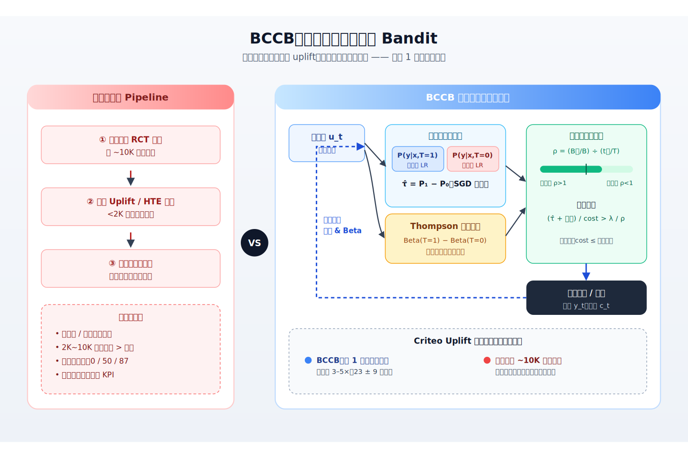
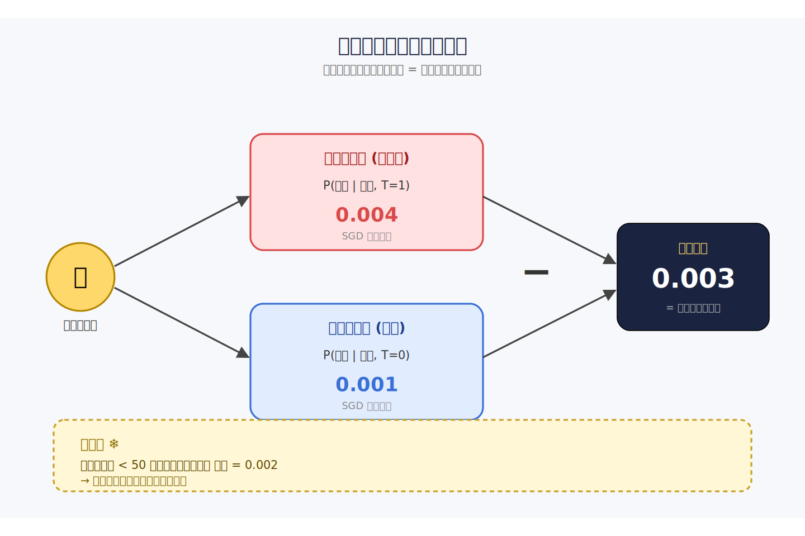
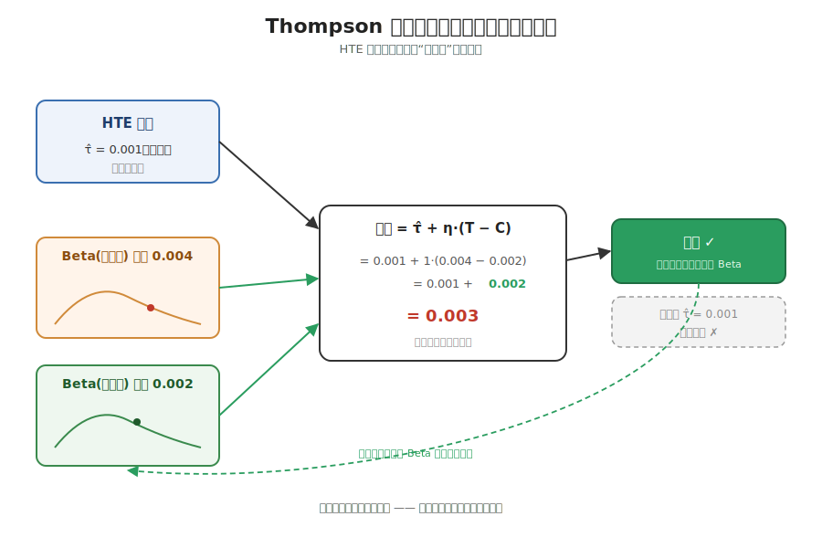
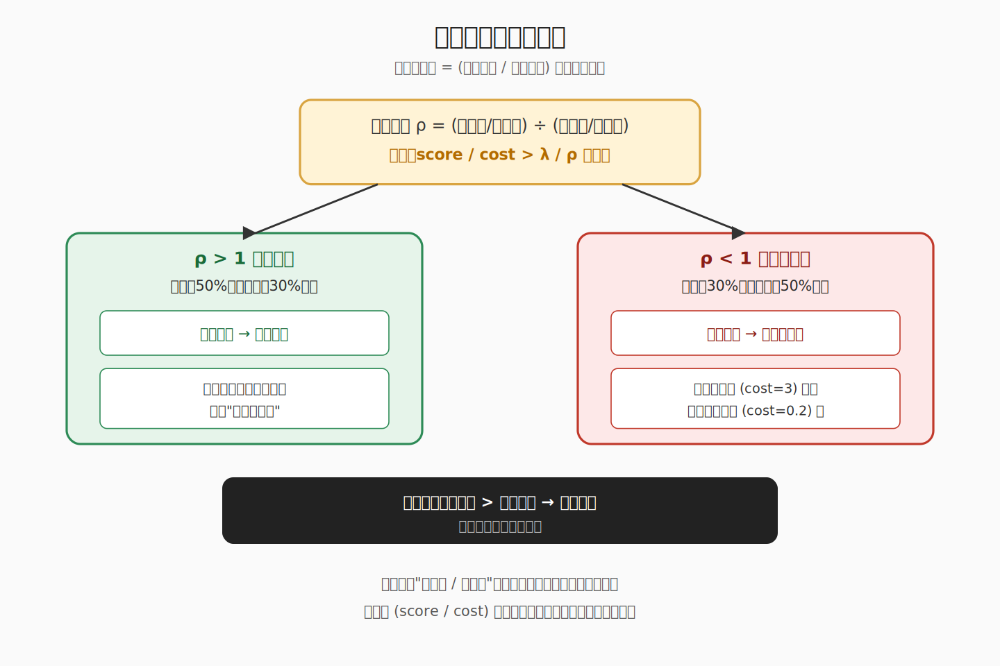
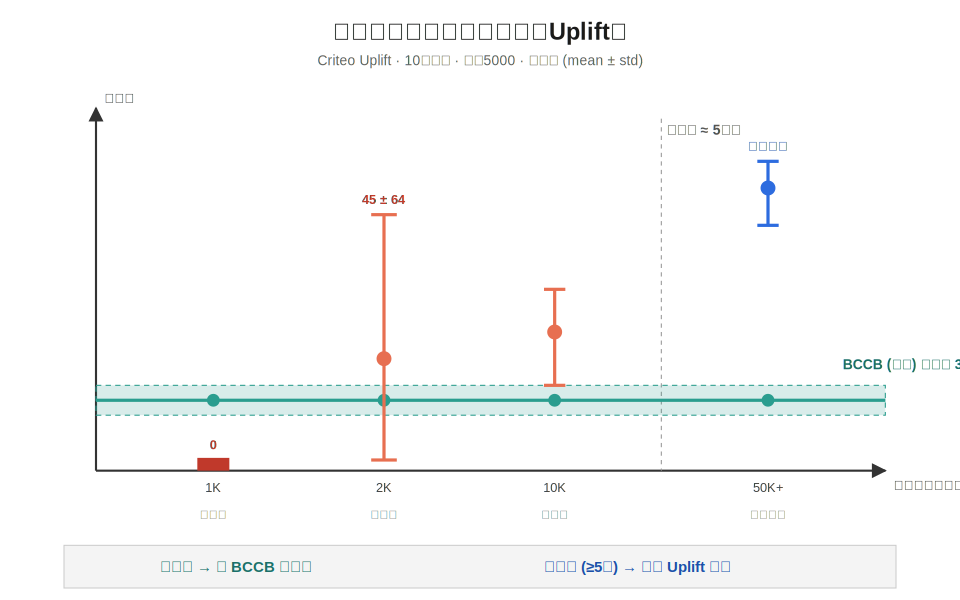
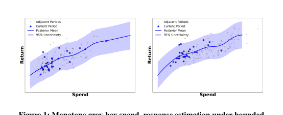
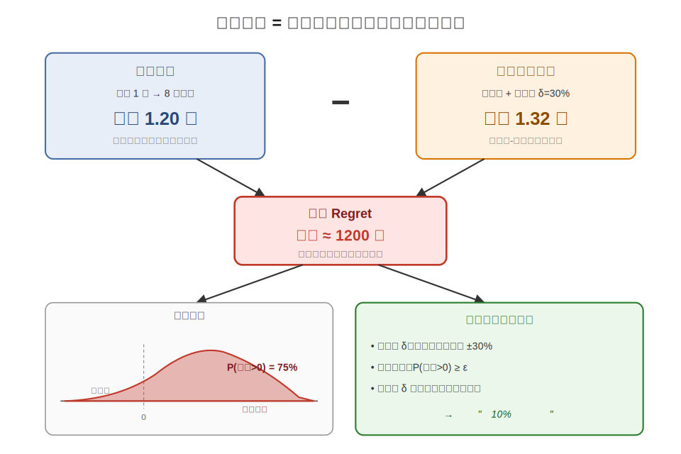
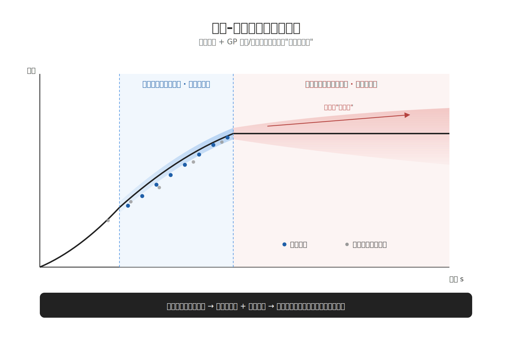
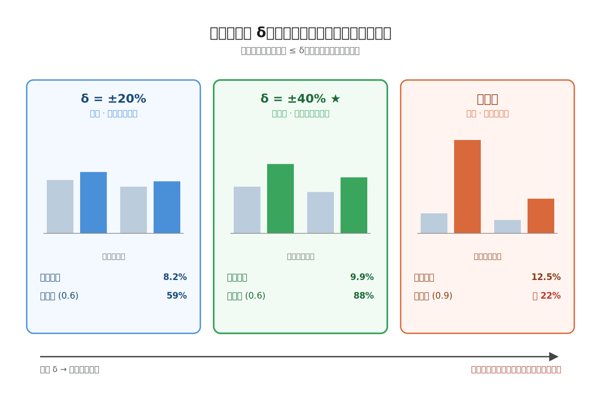
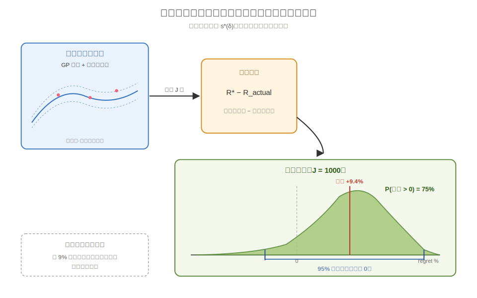

# 2026-04-30 论文日报

## 一、今日趋势与创新观察

### 1. 趋势概况

- LLM 相关论文占比超四成，仍是当天绝对主角
- 迁移泛化与 Agent 系统各占一块，偏向落地部署
- 广告与预算决策虽少但集中，围绕 uplift 与审计

展开趋势详细版

- 全量 254 篇里 LLM 与语言理解占 107 篇，继续是当天主旋律，重心从通用能力转向检索增强、长上下文服务和 Agent 化应用。
- 表示学习与检索排序 63 篇紧随其后，主题从单纯的 embedding 训练转向生成式推荐、语义 ID 量化与特征交互结构再分析。
- 迁移学习与跨域泛化 37 篇，跨语种 RAG、联邦 ReID、神经符号组合泛化都在提醒大家：域外鲁棒性比纯点数更值得关心。
- 商业化决策与资源优化类论文数量不多但很集中，预算分配审计、uplift bandit、边缘推理调度构成一条偏工程的落地线。

### 2. 推荐系统 / 排序相关创新点

- 预算约束 uplift 与因果 bandit 打通，Criteo 上端到端验证
- CARD 用非均匀量化重做语义 ID，让生成式推荐更稳
- 特征交互 DNN 的维度坍缩视角，重新审视 CTR 结构

展开创新点详细版

- Budget-Constrained Causal Bandits 把传统两阶段 uplift 建模与在线序列决策合并，直接在广告预算约束下做因果 bandit，Criteo 数据集上端到端验证。
- CARD 针对生成式推荐的语义 ID，用非均匀量化重新分配视觉语义单元的编码预算，让 SID 既保留判别性又对长尾更稳。
- Understanding DNNs in Feature Interaction Models 从维度坍缩角度拆解 CTR/CVR 里的 DNN，指出所谓高阶交互其实被表示塌缩吞掉了，给排序结构设计提供新诊断视角。

### 3. 全局创新点

- Auditing Marketing Budget 用 hindsight regret 做事后审计
- MetaSR 让元数据按内容自适应编排生成式超分
- Sparse Attention + 分层记忆打通长上下文 LLM 服务

展开全局创新详细版

- Auditing Marketing Budget Allocation with Hindsight Regret 提出用 hindsight regret 回看历史预算分配与最优可行解的差距，把营销决策从"事前优化"扩展到"事后可审计"。
- MetaSR 在生成式超分里把文字、运动、低光等元数据当作条件信号做内容自适应编排，让同一个扩散模型针对不同片段走不同的生成路径。
- Unifying Sparse Attention with Hierarchical Memory 把动态稀疏注意力与 CPU/GPU 分层 KV cache 联合设计，让长上下文 LLM 服务真正从算法省算力落到端到端省时延。

## 二、今日一个 AI 知识点

### Off-Policy Evaluation：为什么能用旧日志评估新策略

- **快速理解：** OPE 用历史日志加重要性加权，估计一个还没上线的新策略的期望收益，让广告和推荐系统不必每改一版都上线 A/B。

展开知识点详细版

想象你手里有一堆过去的广告曝光日志：每条记录包含用户特征、当时旧策略推了哪个广告、这个广告被推的概率，以及最终是否点击。现在你训练出一个新策略，它对同一个用户可能会挑不一样的广告。问题是：不上线怎么知道新策略收益更好？OPE 的思路是，先把每条日志看成一次"对旧策略的抽样"。接着对每条样本算一个重要性权重，等于"新策略在该用户下选这个广告的概率"除以"旧策略当时选它的概率"。如果新策略也很想选这条广告，权重就接近 1；如果新策略几乎不会选它，权重就接近 0，这条样本对评估几乎不贡献。然后把每条样本的真实回报乘上这个权重再平均，得到的就是新策略在同一用户分布下的期望回报的无偏估计。再进一步，工程上会做 clipping、self-normalized、doubly robust 这些修正，核心是防止个别样本权重爆炸、以及在旧策略覆盖不到的区域用一个回报模型补位。这就是为什么广告和推荐论文里会反复出现 propensity、reweighting、IPS、DR 这些词——它们都是在回答同一个问题：怎么让昨天的日志，诚实地告诉你明天这个新策略值不值得上线。

## 三、今日论文总览

### 1. Budget-Constrained Causal Bandits: Bridging Uplift Modeling and Sequential Decision-Making
- 挑选理由：直接针对数字广告预算约束下的uplift建模与在线决策，Criteo数据集验证，属于广告核心链路

### 2. Apriori-based Analysis of Learned Helplessness in Mathematics Tutoring: Behavioral Patterns by Level, Intervention, and Outcome
- 挑选理由：命中强迁移信号：recommendation, system。

### 3. Auditing Marketing Budget Allocation with Hindsight Regret
- 挑选理由：直接研究营销预算分配的后验审计框架，涉及 spend-response 建模与约束优化，属于广告预算分配链路。

### 4. CO-EVO: Co-evolving Semantic Anchoring and Style Diversification for Federated DG-ReID
- 挑选理由：命中强迁移信号：retrieval, framework。

### 5. Asymptotically Robust Learning-Augmented Algorithms for Preemptive FIFO Buffer Management
- 挑选理由：命中强迁移信号：matching, framework。

### 6. Understanding DNNs in Feature Interaction Models: A Dimensional Collapse Perspective
- 挑选理由：特征交互模型中DNN维度坍缩分析，与CTR/CVR预估模型核心结构高度同构，对广告排序建模有参考价值。

### 7. Meta-Learning and Targeted Differential Privacy to Improve the Accuracy-Privacy Trade-off in Recommendations
- 挑选理由：差分隐私推荐，与广告业务链路关系弱。

### 8. STLGT: A Scalable Trace-Based Linear Graph Transformer for Tail Latency Prediction in Microservices
- 挑选理由：微服务尾延迟预测，与广告业务链路无关

### 9. Unifying Sparse Attention with Hierarchical Memory for Scalable Long-Context LLM Serving
- 挑选理由：LLM推理系统，与广告商业化无关。

### 10. SWE-Edit: Rethinking Code Editing for Efficient SWE-Agent
- 挑选理由：软件工程代码编辑Agent，与广告商业化无关

### 11. Bian Que: An Agentic Framework with Flexible Skill Arrangement for Online System Operations
- 挑选理由：快手部署的搜索/推荐/广告引擎O&M智能体框架，涉及商业化系统运维，有一定参考价值但不直接作用于分发决策链路。

### 12. Hierarchical Long-Term Semantic Memory for LinkedIn's Hiring Agent
- 挑选理由：LinkedIn工业部署的agent长时记忆系统，公司线索强但属于HR场景而非广告商业化分发，参考工业架构价值中等。

## 四、补充关注

1. **Recipes for Calibration Checks in Safety-Critical Applications**
   - 理由：有一定相关信号，但不足以进入正式候选：calibration。
2. **CARD: Non-Uniform Quantization of Visual Semantic Unit for Generative Recommendation**
   - 理由：生成式推荐的Semantic ID量化方法，对商业化推荐架构有参考价值但非广告核心。

## 五、重点论文精读

### 1. Budget-Constrained Causal Bandits: Bridging Uplift Modeling and Sequential Decision-Making
- **为什么值得看：** 把uplift建模搬到在线bandit，解决新广告冷启动没历史数据的痛点
- **快速背景：** 新广告冷启动没历史数据，传统离线uplift+背包优化跑不起来

*图示：这篇直接面向广告预算分配的冷启动场景，把传统离线两阶段uplift管线替换为一个能边学边花预算的在线bandit框架，并在Criteo Uplift真实数据上给出了‘离线需要多少历史数据才值得用’的临界点结论，对新广告、新市场、新人群的投放工程实践有直接参考价值。*

展开论文背景详细版

- **详细背景：** 广告投放中常用套路是：先用历史随机实验数据训一个uplift模型估每个用户的增量效应，再用带预算约束的多选背包优化挑用户。这套在数据充足时很好，但新广告、新市场、新客群根本没有足够历史数据，离线模型要么训不出来，要么结果高度不稳定。作者提出把预算约束、HTE学习和探索统一做成一个在线bandit，让系统从第一个用户开始就能边学边投。

**核心技术点速览：**

#### 技术点 1：双模型在线估计增量
- 快速理解：用两个逻辑回归分别建实验组和对照组转化率，相减得到个体增量

*图示：可以把这两个模型想成两个并行跑的小学生：一个只看被投放过广告的人学转化规律，另一个只看没投过广告的人学转化规律。来了新用户，把他特征分别喂给两个学生，得到‘投广告会转的概率’和‘不投也会转的概率’，一减就是广告真正带来的增量。早期样本少的时候，干脆先假设广告有点小正作用，保证系统愿意去试。*

展开技术点 1 详细版

- 技术细节：BCCB维护两个独立的逻辑回归分类器：一个估P(转化\|特征,处理=1)，一个估P(转化\|特征,处理=0)，两者之差就是该用户的预测增量效应。两个模型都用SGD partial-fit做增量更新，每来一个用户就用观测到的结果更新对应那一边的模型。在处理组和对照组各自观测数不到50时，直接给一个小的乐观先验(增量=0.002)，鼓励早期多投放做探索。
- 通俗讲解：可以把这两个模型想成两个并行跑的小学生：一个只看被投放过广告的人学转化规律，另一个只看没投过广告的人学转化规律。来了新用户，把他特征分别喂给两个学生，得到‘投广告会转的概率’和‘不投也会转的概率’，一减就是广告真正带来的增量。早期样本少的时候，干脆先假设广告有点小正作用，保证系统愿意去试。
- 例子：比如第80个用户来了，此时处理组只看过30个人，还没到50个，系统直接用预测增量0.002。到了第500个用户时，两边都攒够样本，喂入特征后处理组模型输出0.004的转化概率，对照组模型输出0.001，于是该用户的预测增量就是0.003。

#### 技术点 2：Thompson探索加成
- 快速理解：在增量分数上再加一个Beta后验采样的差值，鼓励探索不确定用户

*图示：HTE模型只会告诉你‘平均看这个人值不值得投’，但它可能还没学准。Thompson采样的作用是：让系统对整体处理组/对照组的成功率有一个带不确定性的信念，每次随机抽一下，如果这次抽出来觉得处理组挺行，就给所有候选用户一个额外的‘去试试’的推力。这样就不会在模型还没学好时过早锁死某种策略。*

展开技术点 2 详细版

- 技术细节：除了HTE估计，BCCB还为处理组和对照组各自维护一个Beta后验分布，参数随每次观测到的转化结果更新。每一轮从两个Beta中分别抽一个样本，两者之差乘以一个探索权重，作为‘探索加成’加到该用户的增量分数上。当Thompson采样恰好偏向处理组时，这个加成就是正的，会把一些HTE估计模糊的用户也推过阈值去试一下。
- 通俗讲解：HTE模型只会告诉你‘平均看这个人值不值得投’，但它可能还没学准。Thompson采样的作用是：让系统对整体处理组/对照组的成功率有一个带不确定性的信念，每次随机抽一下，如果这次抽出来觉得处理组挺行，就给所有候选用户一个额外的‘去试试’的推力。这样就不会在模型还没学好时过早锁死某种策略。
- 例子：某用户预测增量ˆτ=0.001，看起来很边缘。系统这轮从处理组Beta抽到0.004，从对照组Beta抽到0.002，探索权重η=1，探索加成=0.002。最终得分=0.001+0.002=0.003，比单看ˆτ高不少，于是这个原本会被跳过的用户被投放了，模型也因此得到了一次新样本去更新。

#### 技术点 3：自适应预算配速阈值
- 快速理解：用剩余预算比/剩余时间比算出一个配速系数，动态调整投放门槛

*图示：就像出差报销有总额度：前半程如果剩的钱比剩的天数比例还多，说明你节省过头了，可以稍微大方一点；反过来花太快就得立刻收紧。这里把这件事直接塞进决策阈值——预算充裕时门槛低，多投；预算紧张时门槛高，只挑增量大又便宜的用户。每个用户还要看性价比（分数/成本），不是只看效果。*

展开技术点 3 详细版

- 技术细节：每一步计算‘预算压力比’：剩余预算占初始预算的比例，除以剩余轮数占总轮数的比例。大于1说明钱花得慢，可以放宽标准；小于1说明钱花得太快，要提高标准。最终决策用‘(预测增量+探索加成)/用户成本’跟‘基础阈值λ/配速系数’比较，超过才投。硬约束上如果该用户成本大于剩余预算，直接不投。
- 通俗讲解：就像出差报销有总额度：前半程如果剩的钱比剩的天数比例还多，说明你节省过头了，可以稍微大方一点；反过来花太快就得立刻收紧。这里把这件事直接塞进决策阈值——预算充裕时门槛低，多投；预算紧张时门槛高，只挑增量大又便宜的用户。每个用户还要看性价比（分数/成本），不是只看效果。
- 例子：假设总预算5000，总用户10万，跑到第5万个用户时剩余预算只剩1500。预算比=1500/5000=0.3，时间比=0.5，配速=0.6\<1，阈值被放大到λ/0.6。这时候一个预测增量高但成本3的用户，性价比可能过不了更高的阈值而被跳过；但一个增量中等、成本0.2的用户反而被投放，系统自动转向‘省着花’模式。

#### 技术点 4：数据效率交叉点结论
- 快速理解：离线方法要1万条历史数据才稳定，BCCB从第一个用户就能用且方差小3-5倍

*图示：这条结论对工程选型非常实用：如果你手上有几万条干净的历史随机实验数据，老老实实训离线uplift模型效果最好；但如果只有几千条甚至没有（新活动、新市场、新品上线），离线管线不是训不出来就是结果像抽奖，这时用BCCB这种在线学习+探索+配速的方案反而更稳、更可预测。*

展开技术点 4 详细版

- 技术细节：在Criteo Uplift数据集上（100K用户、$5000预算），作者用replay evaluation对比离线逻辑回归uplift和BCCB在不同历史训练集大小下的表现。离线方法在不足2000条时直接训不出来（对照组正样本可能为0），2000~10000条时转化数标准差甚至超过均值，达到5万条后显著反超BCCB。BCCB全程不需要历史数据，转化方差始终低3-5倍。
- 通俗讲解：这条结论对工程选型非常实用：如果你手上有几万条干净的历史随机实验数据，老老实实训离线uplift模型效果最好；但如果只有几千条甚至没有（新活动、新市场、新品上线），离线管线不是训不出来就是结果像抽奖，这时用BCCB这种在线学习+探索+配速的方案反而更稳、更可预测。
- 例子：预算5000、评估10万用户：用1000条历史数据训离线模型，得到0次转化（训练失败）；用2000条训，三次随机种子结果分别可能是0、50、87次转化，均值45±64，根本没法给广告主承诺KPI。同样场景下BCCB三次跑出来大概23±9次，数字不是最高但落差小，做预算规划靠谱得多。

- **对广告的启发：** 新广告/新人群冷启动场景可用在线bandit替代离线uplift管线，更稳更可预测

展开广告启发详细版

- **详细启发：** 最适合层级：出价与预算分配层（智能出价/人群定向的冷启动）；价值：对于新建广告计划、新市场扩张、新客群试投这种没有足够历史转化数据的场景，可以把传统‘离线训uplift+背包分配’替换或补充成这种在线bandit：双模型估个体增量、Thompson采样做探索、用‘剩余预算/剩余流量’做自适应配速阈值，并用‘性价比=得分/成本’作为决策依据。工程上最有价值的启发其实是那个‘配速阈值’的写法，可以直接嵌入现有的pacing模块。；风险：论文里的成本是对数正态模拟的，不是真实竞价价格，真实广告拍卖里成本和用户增量高度相关，会让这个‘性价比阈值’的表现打折；在线HTE模型只是线性逻辑回归，工业级特征维度和稀疏度下需要换更强的在线模型；当历史数据其实够用（5万条以上）时离线方法明显更好，不要盲目上在线方案；另外replay评估本身也只是离线近似，真实上线还需要小流量AB验证。

### 2. Auditing Marketing Budget Allocation with Hindsight Regret
- **为什么值得看：** 把'营销预算分配做得好不好'变成可量化的事后后悔值，直击广告预算复盘痛点
- **快速背景：** 预算怎么分才算好？本文用历史日志事后审计，告诉你当初到底留下多少钱没赚到。

*图示：这是候选中最接近论文核心方法的图：它展示了 spend-response 灰盒建模、相邻时期信息借用、单调约束与不确定性随支持区间外扩而增大的机制，直接对应论文方法链路中的关键建模环节。相比之下，Figure 2 和 Figure 3 都是结果/ablation 可视化，不是方法总览。虽然这张图不是完整 framework 流程图，但在现有候选里它最能代表论文方法本体，且图形主体相对完整、正文噪声较少。*

展开论文背景详细版

- **详细背景：** 营销预算要在多个渠道、市场、活动间长期分配，一旦定下就难改、错了损失大。但实际收入既受决策影响也受市场波动影响，光看结果根本判断不出'当初分得好不好'。在线 A/B 对连续高维预算分配代价太高，pre-post、合成控制等方法又容易被非平稳和跨渠道干扰破坏。论文提出一个事后审计框架：基于历史日志估计花费-回报曲线，在相同预算与操作约束下算出'事后最优分配'，再用后悔分布量化'本来可以多赚多少'。

**核心技术点速览：**

#### 技术点 1：事后后悔作为审计指标
- 快速理解：把决策好坏定义成'真实分配 vs 同约束下事后最优'之间的收益差，并给出显著性判定

*图示：直观上就是：'如果上帝让我拿着同样的钱、同样的操作规矩重分一次，最多还能多赚多少？'这个差额就是后悔。论文不直接说'你分错了'，而是告诉你：平均能多赚多少、多赚是正的概率有多大、这个结论对稳定性约束有多敏感。*

展开技术点 1 详细版

- 技术细节：论文把后悔定义为：在同样的总预算和稳定性约束下，事后最优可行分配的总回报减去实际分配的总回报。由于回报有随机性，后悔是一个随机变量，论文关注期望后悔以及 P(后悔\>0) 这个'基准真的打败现实的概率'。同时引入稳定性参数 δ 控制相邻期预算可改动比例，并要求 P(后悔\>0)\>=ε 才认为改进是'可认证'的，在一组候选 δ 里挑期望后悔最大且满足置信门槛的那个。
- 通俗讲解：直观上就是：'如果上帝让我拿着同样的钱、同样的操作规矩重分一次，最多还能多赚多少？'这个差额就是后悔。论文不直接说'你分错了'，而是告诉你：平均能多赚多少、多赚是正的概率有多大、这个结论对稳定性约束有多敏感。
- 例子：比如一个季度总预算 1 亿，实际分给 8 个渠道赚了 1.2 亿。框架在约束'每期相邻预算变动不超过 30%'下算出事后最优分配能赚 1.32 亿，那么后悔均值约 1200 万。再看 1000 次蒙特卡洛里有 75% 的样本后悔\>0，于是报告'30% 灵活度下，约 10% 的可认证提升空间'。

#### 技术点 2：花费-回报曲线的灰盒建模
- 快速理解：用饱和曲线作主干加高斯过程修正，并在样本稀疏区主动放大不确定性

*图示：直觉是：有数据覆盖的花费区间里模型可以自信地说'再投一块钱大概能多赚多少'；但一旦优化器想把钱挪到历史从没花过的量级，模型就主动承认'我不知道'，把方差调大。这样后续算出的后悔分布在外推区自然会变宽，防止优化器过度乐观。*

展开技术点 2 详细版

- 技术细节：每个渠道每个时间段单独建模花费-回报关系：主干是一个饱和型函数 a(1-exp(-b·s))，保证单调递减的边际收益这种'经济学常识'形状；再叠加一个均值高斯过程捕捉局部偏差，另一个高斯过程建模方差（异方差）。相邻期数据作为辅助样本以指数权重弱加入，控制漂移。超出当前期实际花费范围时，用等距回归投影保证单调，并在远离有数据区域的地方人为放大 epistemic 方差。
- 通俗讲解：直觉是：有数据覆盖的花费区间里模型可以自信地说'再投一块钱大概能多赚多少'；但一旦优化器想把钱挪到历史从没花过的量级，模型就主动承认'我不知道'，把方差调大。这样后续算出的后悔分布在外推区自然会变宽，防止优化器过度乐观。
- 例子：某渠道历史花费都在每周 5-20 万，建出来的曲线在这个区间平滑上升并带窄置信带。若优化器想把它拉到 50 万/周，模型会把这一段的均值用等距回归压平到不下降，同时把方差放大数倍，导致该方案在蒙特卡洛中经常得到很低甚至负的后悔，从而在置信筛选里被淘汰。

#### 技术点 3：带稳定性约束的事后最优
- 快速理解：通过限制相邻期变动幅度 δ 在'激进重分'和'可落地'之间做权衡

*图示：纯粹让模型'随便重分'会得到一个漂亮但不现实的方案：运营上没法一下子把某渠道预算翻 5 倍。用 δ 限制每期最多动多少，既贴近实际节奏，又避免优化器冲进数据稀疏区自嗨。实验显示中等 δ（20%-40%）往往捕获了大部分可实现收益，再放大 δ 边际收益递减还更不稳。*

展开技术点 3 详细版

- 技术细节：事后最优分配通过约束优化求解：目标是各期各渠道的估计回报之和最大，约束包括总预算、每个渠道的上下界，以及关键的稳定性约束——相邻期预算变动比例不超过 δ。论文对比了无约束版（理论上界）和多档 δ 的结果，并观察到一个非单调现象：放松 δ 虽然确定性目标上限变高，但优化器会把钱挪向弱支持区，带不确定性评估后的期望后悔和可检测概率反而可能下降。
- 通俗讲解：纯粹让模型'随便重分'会得到一个漂亮但不现实的方案：运营上没法一下子把某渠道预算翻 5 倍。用 δ 限制每期最多动多少，既贴近实际节奏，又避免优化器冲进数据稀疏区自嗨。实验显示中等 δ（20%-40%）往往捕获了大部分可实现收益，再放大 δ 边际收益递减还更不稳。
- 例子：论文 Table 2：δ=±20% 时只有 59% 的组合在 0.6 置信度下可认证提升，平均增益 8.2%；δ=±40% 升到 88% 可认证、9.9% 增益；但继续放到无约束，虽然均值能到 12.5%，可在严格 0.9 置信度下仅 22% 组合能认证，说明更激进的方案收益高但赌性也更大。

#### 技术点 4：蒙特卡洛得到后悔分布
- 快速理解：不只给一个点估计，而是给后悔的整条分布和'打败现实的概率'

*图示：一次点估计容易让人过度相信'你少赚了 1000 万'，但实际上这个数本身有误差棒。论文每次模拟都重新抽一次'如果当时市场运气这样、曲线长这样'的世界，看看最优方案能不能打赢现实。输出一条分布后，决策者既知道中位数增益，也知道下行风险。*

展开技术点 4 详细版

- 技术细节：固定事后最优轨迹 s\*(δ) 后，按拟合的均值高斯过程+异方差方差模型对每个渠道每期独立采样反事实回报，算出每次采样下的'最优总回报 - 实际总回报'作为一次后悔样本。重复 J 次得到后悔分布，报告均值、标准差、可信区间和 P(后悔\>0)。这套流程把'分配是否低效'和'响应曲面本身不确定'两类误差分离开来。
- 通俗讲解：一次点估计容易让人过度相信'你少赚了 1000 万'，但实际上这个数本身有误差棒。论文每次模拟都重新抽一次'如果当时市场运气这样、曲线长这样'的世界，看看最优方案能不能打赢现实。输出一条分布后，决策者既知道中位数增益，也知道下行风险。
- 例子：在某投资组合 δ=30% 的实验里，1000 次模拟中后悔均值 +9.4%，标准差 ±6.7%，95% 可信区间跨越了 0 的一小段，P(后悔\>0)=75%。于是报告给业务方：'有四分之三把握这次分配可以改进约 9%，但别指望稳赢'，而不是一句武断的'你错了 9%'。

- **对广告的启发：** 给广告预算复盘提供一套带不确定性的'事后审计'方法论，替代拍脑袋复盘

展开广告启发详细版

- **详细启发：** 最适合层级：预算分配与策略复盘层（跨渠道/campaign 预算规划、年度复盘、策略 scoreboard）；价值：1) 在不能做在线实验时，用历史日志就能评估预算分配决策的优劣，输出'还能多赚多少'的带置信度结论；2) 稳定性约束 δ 直接对应广告运营中'不能大幅改预算'的现实，结果可落地；3) 均值 GP + 方差 GP + 外推惩罚的建模范式可直接借鉴到 ROI 曲线、出价-转化曲线的离线评估，避免优化器在数据稀疏区过度乐观；4) 输出分布而非点估计，适合给管理层做风险感知的决策沟通。；风险：1) 框架依赖 epoch 内局部平稳和条件独立假设，广告里跨渠道干扰（品牌带动效果搜索等）会破坏该假设，需扩展到联合模型；2) 仅在实际花费范围内'可识别'，对'历史从没试过的大胆分配'本质上给不出可靠结论，只能保守报告；3) 真实广告系统还有 pacing、竞价动态等上游机制，论文把这些抽象为黑盒，迁移时需要谨慎评估上游反馈；4) 论文未在公开基准上验证，具体数字仅来自内部日志。

## 六、候选但未完成深读的论文

当前重点论文都已完成可用分析。
