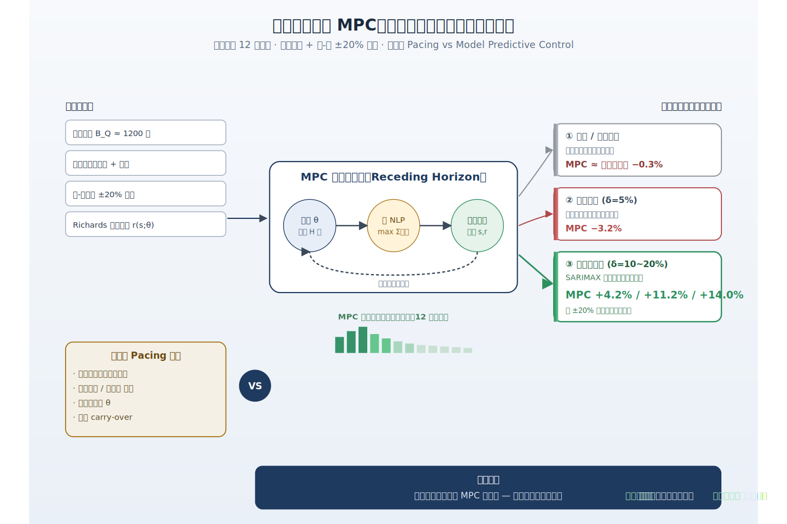
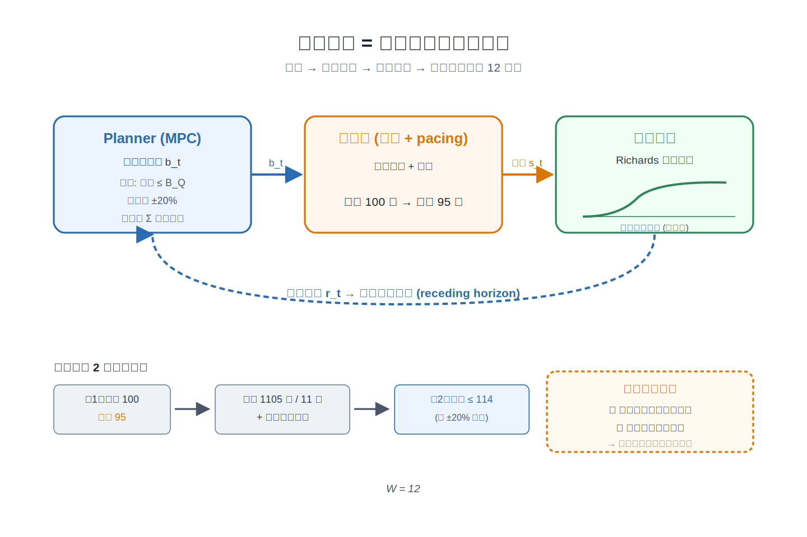
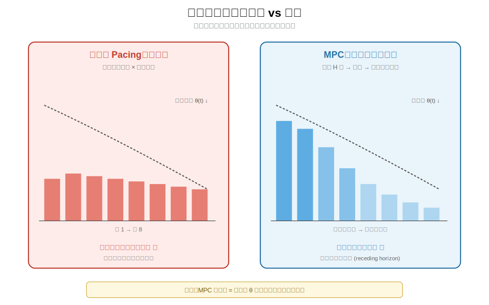
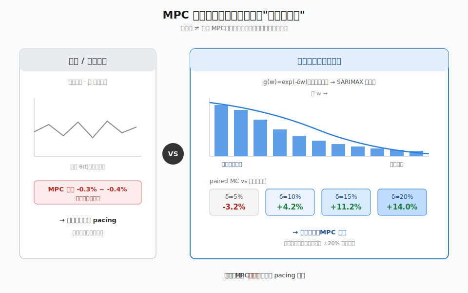
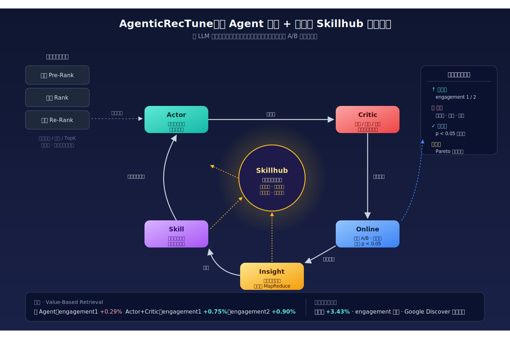
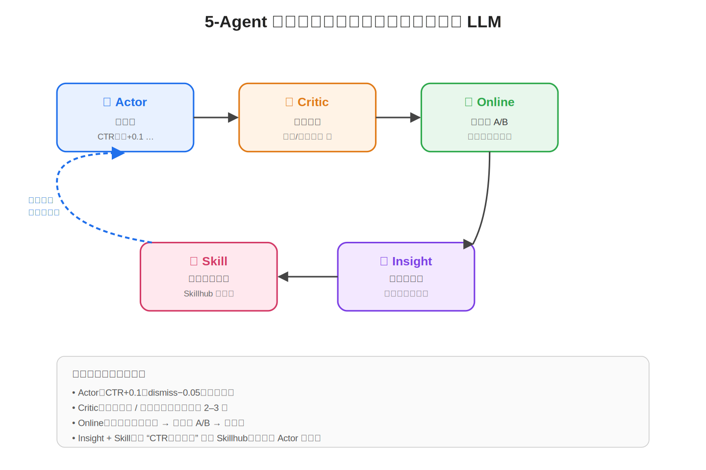
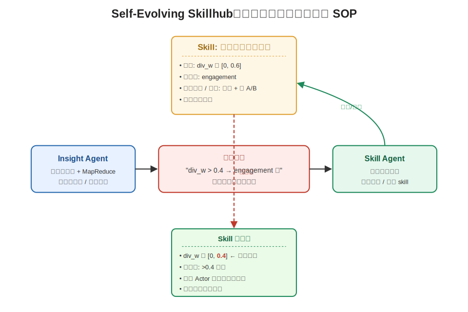
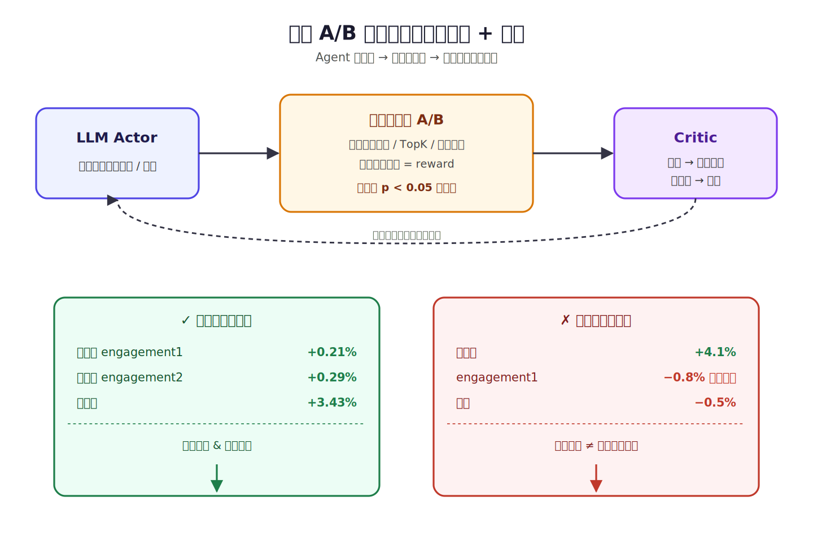
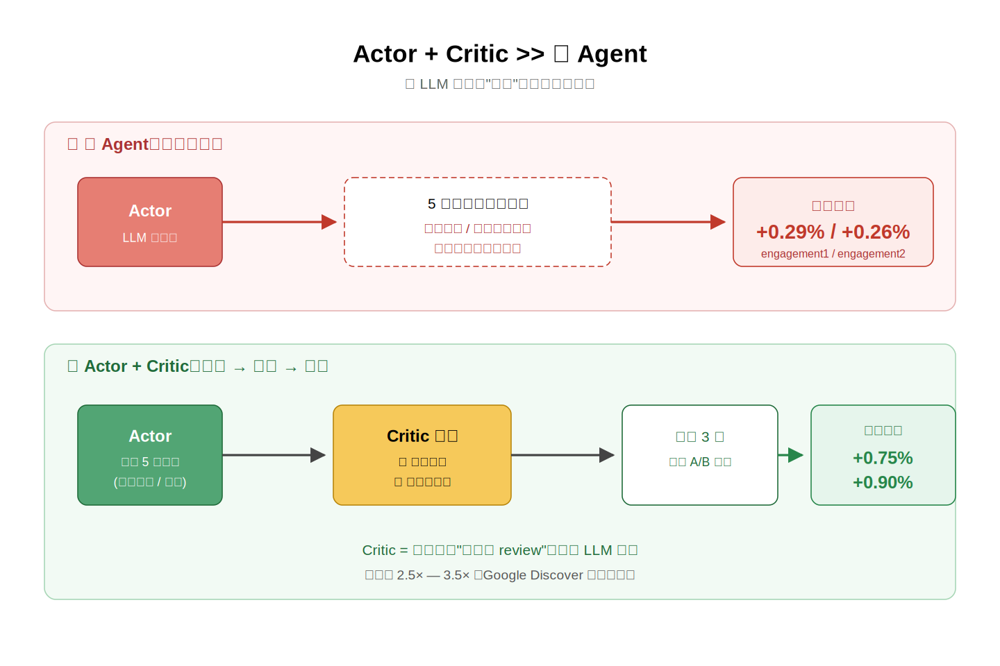

# 2026-05-01 论文日报

## 一、今日趋势与创新观察

### 1. 趋势概况

- 当天共抓取372篇，LLM与语言理解相关工作占173篇，仍是绝对主…
- 表示学习与检索排序方向有108篇，重心明显从单塔embedding…
- Agent与多智能体相关92篇，话题从单体工具调用扩展到多智能体技…

展开趋势详细版

- 当天共抓取372篇，LLM与语言理解相关工作占173篇，仍是绝对主流，具体集中在推理加速、列表式重排序位置不变性、以及生成式搜索对传统检索生态的冲击。
- 表示学习与检索排序方向有108篇，重心明显从单塔embedding转向RAG链路上的证据筛选、片段级过滤和多向量高效检索。
- Agent与多智能体相关92篇，话题从单体工具调用扩展到多智能体技能库自演化、运行时委派安全，以及Agent编排是否真的优于in-context prompt的反思。
- 商业化与资源优化类工作只有12篇，但出现了预算MPC控制、LLM服务推理预算约束等把'花钱'明确建模进系统的工作。

### 2. 推荐系统 / 排序相关创新点

- AgenticRecTune把粗排/精排/重排整条工业推荐链路的系…
- One Pass, Any Order提出位置不变的listwis…
- Position-Aware Drafting把推测解码的draf…

展开创新点详细版

- AgenticRecTune把粗排/精排/重排整条工业推荐链路的系统级调优抽象成多智能体协作，并引入可自演化的技能库，复用历史调优经验，这和广告多阶段链路同构性极高。
- One Pass, Any Order提出位置不变的listwise重排方法，让decoder-only LLM在一次前向内对候选集做集合式打分，缓解了LLM重排对输入顺序敏感导致的推荐结果抖动。
- Position-Aware Drafting把推测解码的draft模型做成位置感知版本，专门服务生成式列表推荐的解码加速，在不改变目标分布前提下降低在线延迟。

### 3. 全局创新点

- Learning to Spend把有限时域预算分配建成闭环经济控…
- In-Context Prompting Obsoletes Ag…
- Bayesian X-Learner在重尾结局下同时给出异质处理效…

展开全局创新详细版

- Learning to Spend把有限时域预算分配建成闭环经济控制问题，用滚动时域MPC应对执行噪声和非平稳回报效率，是把预算pacing真正当控制问题来解的一次系统化尝试。
- In-Context Prompting Obsoletes Agent Orchestration通过控制实验质疑LangGraph、CrewAI等外部编排器的必要性，指出对程序化任务只用一段精心设计的上下文prompt就能打平甚至超越复杂编排。
- Bayesian X-Learner在重尾结局下同时给出异质处理效应估计与校准后验，把CATE估计从点估计推进到可用于决策的不确定性量化层面。

## 二、今日一个 AI 知识点

### World Model 为什么不是普通预测器

- **快速理解：** World Model 可以理解成模型先在内部搭一个可 rollout 的小世…

展开知识点详细版

World Model 可以理解成模型先在内部搭一个可 rollout 的小世界。它先把当前观察压成状态表示，再预测如果执行某个动作，下一步环境会怎样变化，所以它关心的不只是这一步答什么，而是后面几步会发生什么。 这类思路已经从机器人扩展到 Agent、视频生成和策略优化。你只要抓住‘先学环境，再在脑内演练动作’这个骨架，就能更快看懂很多新工作。 可以顺着一次具体运行过程来理解：顺着一次运行过程看：系统先读入用户、上下文和候选动作，把它们编码成一个紧凑状态；然后假设先展示创意A，world model 预测点击、停留和后续可转化信号会怎样变化；再假设换成创意B，重复模拟几步；最后规划器比较两条未来轨迹的长期收益，选出累计价值更高的动作。

## 三、今日论文总览

### 1. Learning to Spend: Model Predictive Control for Budgeting under Non-Stationary Returns
- 挑选理由：明确以数字营销为背景研究预算分配与MPC预算控制，直接关联广告预算pacing问题。

### 2. AgenticRecTune: Multi-Agent with Self-Evolving Skillhub for Recommendation System Optimization
- 挑选理由：针对工业多阶段推荐系统（粗排/精排/重排）的系统级配置优化，与广告链路高度同构

### 3. A Gated Hybrid Contrastive Collaborative Filtering Recommendation
- 挑选理由：通用学术推荐模型，与商业化链路无关

### 4. The Impact of LLM Self-Consistency and Reasoning Effort on Automated Scoring Accuracy and Cost
- 挑选理由：教育评分任务，无广告相关性

## 四、补充关注

1. **LLM Biases**
   - 理由：从理论角度分析transformer生成式推荐的注意力偏差、马太效应、合成数据偏差，对商业化推荐系统的可靠性分析有一定参考价值，但非广告核心链路工作。
2. **From Unstructured to Structured: LLM-Guided Attribute Graphs for Entity Search and Ranking**
   - 理由：电商实体检索与排序工作，涉及商品相似度和排序，与电商流量分发相关但不触及广告决策。可能来自Amazon团队。

## 五、重点论文精读

### 1. Learning to Spend: Model Predictive Control for Budgeting under Non-Stationary Returns
- **为什么值得看：** 用控制论视角检验MPC在广告预算分配中到底什么时候才真的有用
- **快速背景：** 把季度广告预算分配当成带执行噪声的闭环控制问题，研究MPC到底啥时候比反应式pacing强

*图示：这篇论文把广告季度预算分配建成闭环控制问题，系统比较了反应式pacing和模型预测控制(MPC)在不同非平稳环境下的表现，直接回答了一个工业界常纠结的问题：什么时候上更复杂的预测式预算控制才划算。对做预算pacing、MMM落地、季度/月度预算分配的团队都有参考价值。*

展开论文背景详细版

- **详细背景：** 大公司（论文以Expedia每年约68亿美金营销投入为背景）每季度要把一个大预算切到各周各渠道，但实际花出去的钱会被拍卖、pacing系统和竞争扰动搞成有噪声的执行结果，而且单位花费的回报效率也会随时间变化。传统做法要么是基于历史pacing比例的反应式分配，要么是基于MMM拟合响应曲线再做静态优化，都假设响应稳定、不擅长闭环调整。作者想搞清楚：在执行噪声+非平稳回报下，receding-horizon的MPC到底什么时候真的比简单反应式pacing强，什么时候只是自欺欺人。

**核心技术点速览：**

#### 技术点 1：预算分配建模为闭环控制
- 快速理解：把季度12周预算决策写成带执行噪声和平滑约束的有限时域随机控制问题

*图示：可以把它想成一个每周拨款的闭环：你定一个本周想花多少，但平台实际会因为竞价和pacing偏离你的计划一点点；花出去后观察到真实转化，再决定下一周怎么调。论文强调两点摩擦——执行不是确定性的，以及每周不能相对上周跳太多，这两点让问题变得像工业控制而不是单纯的离线优化。*

展开技术点 1 详细版

- 技术细节：时间按周离散化(W=12周一个季度)，每周计划预算b-t决定后，执行层按一阶跟踪动力学把日目标花出去，实际花费s-t是计划的带噪声执行结果；回报r-t通过一个饱和型非线性响应函数(Richards曲线)从实际花费生成，响应的潜在效率参数可能随时间变。planner目标是最大化整季累计期望回报，约束是累计花费不超过季度预算BQ、非负、以及可选的周-周变化幅度上下限(比如±20%或±30%)。
- 通俗讲解：可以把它想成一个每周拨款的闭环：你定一个本周想花多少，但平台实际会因为竞价和pacing偏离你的计划一点点；花出去后观察到真实转化，再决定下一周怎么调。论文强调两点摩擦——执行不是确定性的，以及每周不能相对上周跳太多，这两点让问题变得像工业控制而不是单纯的离线优化。
- 例子：比如某季度总预算1200万，反应式pacing第1周按历史比例打算花100万，执行层实际花了95万(有噪声)，观察到回报后，第2周planner看到还剩1105万、还有11周，就按剩余历史比例重新分配；同时受±20%约束，第2周计划最多从95万涨到114万，不能一下翻倍。

#### 技术点 2：反应式pacing vs MPC两种策略
- 快速理解：反应式只看剩余预算和历史比例，MPC每周重新解一个带约束的H周前瞻优化

*图示：反应式像是'只看账本'的出纳：剩多少钱、还剩几周、按历史节奏摊。MPC像是'带预测的管家'：它会先预测未来几周回报效率怎么走，再用优化器在预算、平滑度约束下算出一整条未来路径，但只执行第一步，下周再根据新观测重新规划。关键在于，MPC的优势完全取决于它对未来θ的预测是否真的包含可利用的结构。*

展开技术点 2 详细版

- 技术细节：反应式基线(Phase1+Phase2)：用去年同季各周的花费比例策略-t当名义权重，每周用剩余预算乘以剩余周权重归一化得到本周预算，花完后把差额自动carryover到后面几周，完全不预测未来回报效率。MPC则在每周τ做三件事：用预测模块(假设指数饱和响应ρ=ρmax·(1-exp(-κ·s)))对未来H周的参数θ做预测，解一个最大化H周累计预测回报的NLP(约束包括累计花费\<=剩余预算、非负、周-周相对变化在（1-γL, 1+γU）之间)，只执行第一周的结果，下周观察实际花费和回报后再重新解。论文还区分Oracle MPC(用真实潜在参数)和Learned MPC(用历史+在线观测估参数)来把'规划价值'和'估计误差'拆开。
- 通俗讲解：反应式像是'只看账本'的出纳：剩多少钱、还剩几周、按历史节奏摊。MPC像是'带预测的管家'：它会先预测未来几周回报效率怎么走，再用优化器在预算、平滑度约束下算出一整条未来路径，但只执行第一步，下周再根据新观测重新规划。关键在于，MPC的优势完全取决于它对未来θ的预测是否真的包含可利用的结构。
- 例子：比如第3周时MPC预测后面9周回报效率会每周衰减10%(季节性衰减)，它就会在平滑约束允许的上界里把第3、4周预算尽量推高、把后面几周压低，解出来第3周可能是120万；执行后实际花了118万，第4周重新预测、重新解、再执行一次。而反应式在同样场景下还是按历史策略摊，后期在低效率期烧掉大量预算。

#### 技术点 3：三种非平稳场景的分界结论
- 快速理解：只有当非平稳具有可预测结构(比如季节性衰减)时MPC才稳定优于反应式

*图示：核心洞见是：'非平稳'本身不足以证明要上MPC，关键看这个变化可不可预测。噪声式漂移虽然也在变，但你forecast不出规律，前瞻优化就会被噪声反向带偏、反而不如诚实的反应式；而像广告疲劳、生命周期衰减这种跨季度重复的结构，MPC就能提前把预算前置到高效率周拿到两位数的提升。同时，当结构足够强时，瓶颈就不再是预测精度，而是你允许周-周预算变化多大——论文里±20%平滑约束已经让MPC吃掉了大部分理论收益。*

展开技术点 3 详细版

- 技术细节：论文构造了三种regime：(1)静态：参数不变；(2)随机游走漂移：logθ-(t+1)=logθ-t+η-t，平滑但不可预测，此时MPC用粒子滤波做在线状态估计(PF-MPC)；(3)可预测季节性衰减：周内效率因子g(w)=exp(-δw)，δ属于(5%,10%,15%,20%)且跨季度重复，用SARIMAX预测θ。实验用paired Monte Carlo比较oracle归一化回报和对基线的提升百分比。结果：静态regime下MPC和基线都在oracle的0.5%以内，MPC反而-0.37%；随机游走下PF-MPC比基线还差0.3-0.4%(在困难trial里才有下行保护)；季节性衰减下δ=5%时MPC还是比基线-3.2%(结构太弱)，δ=10%/15%/20%时MPC分别+4.2%/+11.2%/+14.0%并且oracle gap只有6-7%(被±20%平滑约束顶住了)。
- 通俗讲解：核心洞见是：'非平稳'本身不足以证明要上MPC，关键看这个变化可不可预测。噪声式漂移虽然也在变，但你forecast不出规律，前瞻优化就会被噪声反向带偏、反而不如诚实的反应式；而像广告疲劳、生命周期衰减这种跨季度重复的结构，MPC就能提前把预算前置到高效率周拿到两位数的提升。同时，当结构足够强时，瓶颈就不再是预测精度，而是你允许周-周预算变化多大——论文里±20%平滑约束已经让MPC吃掉了大部分理论收益。
- 例子：举例：同样总预算1200万、12周。静态场景下MPC和反应式都接近每周100万，差异可忽略。随机漂移场景下，某周真实效率突然变高但下周又掉回来，PF-MPC基于滤波估计把预算往这周推，结果下周又被拉回、白白付了切换成本，整体反而-0.3%。季节性δ=15%场景下，前几周效率是后几周的好几倍，MPC在平滑约束内把第1-3周预算顶到上界、后面逐步收缩，整季比基线多赚11.2%。

- **对广告的启发：** 预算pacing要不要上MPC，先判断非平稳是可预测结构还是纯噪声，否则简单反应式+carryover就够

展开广告启发详细版

- **详细启发：** 最适合层级：预算分配与pacing层(季度/月度预算切分、跨周/跨渠道分配、广告疲劳与生命周期建模)；价值：给了工业界一个很实用的判据：如果你的回报效率变化主要来自广告疲劳、品类季节性、生命周期衰减这种跨周期可复现结构，上带前瞻的MPC/滚动优化能拿到两位数提升；如果只是市场噪声漂移，就别折腾，基于历史pacing比例+carryover的反应式基线在执行约束下已经逼近oracle。另外论文明确指出当结构足够强时，瓶颈是周-周变化幅度约束而非预测精度，这提醒团队优化方向应该是去和业务方谈放宽平滑约束，而不是继续卷forecast模型。；风险：实验是纯合成仿真(Richards响应+指数饱和误设、高斯同方差噪声、单一季节性结构)，没有真实平台数据和多渠道竞争交互；MPC只对单一预算聚合体建模，没处理多渠道耦合、ROI/ROAS双约束、延迟转化等真实pacing系统的复杂性；粒子滤波MPC在漂移场景反而变差，说明预测模型误设的代价不小，实战落地要小心估计质量与控制鲁棒性的权衡。

### 2. AgenticRecTune: Multi-Agent with Self-Evolving Skillhub for Recommendation System Optimization
- **为什么值得看：** Google Discover上线的多Agent自动调多阶段融合权重，广告链路同构
- **快速背景：** 工业推荐多阶段融合权重难调，论文用多Agent+LLM自动跑A/B来找最优配置

*图示：这篇论文直接对应广告/推荐工业链路里最头疼的问题：粗排、精排、重排各自有一堆融合权重和阈值，每次模型改版都要重调一次。它用LLM多Agent+在线A/B闭环把这个调参工作自动化，并在Google Discover真实上线，对广告系统级参数调优有很强迁移价值。*

展开论文背景详细版

- **详细背景：** 现代大规模推荐（以及广告）系统是粗排-精排-重排的多阶段链路，每个阶段模型会输出多个分数（如CTR、dismiss率、质量分等），再用一组融合权重和阈值合成最终排序。这些系统级配置是非可导的（涉及排序、TopK、业务规则），而且模型一改、产品北极星指标一变，就要全部重调，传统靠人工、Grid Search或AutoML都吃不消。论文提出用LLM多Agent框架自动完成端到端配置搜索，并在Google Discover真实上线，证明比人工调更稳更好，因此对同构的广告链路很有参考价值。

**核心技术点速览：**

#### 技术点 1：五Agent端到端调参闭环
- 快速理解：Actor提案、Critic过滤、Online跑A/B、Insight+Skill沉淀经验，形成自动调参闭环

*图示：可以理解成把一个调参工程师团队塞进LLM：一个人负责想点子，一个人负责挑刺，一个人负责上线跑实验，还有两个人负责复盘和更新经验手册。每一轮线上A/B的结果都会回写到记忆里，下一轮提案就会更聪明。*

展开技术点 1 详细版

- 技术细节：框架把调参拆成五个角色：Actor Agent根据当前skill和历史结果生成一批候选配置并给出理由；Critic Agent按格式、搜索空间、护栏指标和历史失败案例筛掉不靠谱的候选；Online Agent自动生成A/B实验代码、分流量、设控制组/实验组、跑到显著性后回收北极星指标；Insight Agent再从历史实验中提炼敏感参数和规律；Skill Agen把这些规律写回Skillhub。整个过程把'提配置—跑线上—总结—再提配置'串成闭环。
- 通俗讲解：可以理解成把一个调参工程师团队塞进LLM：一个人负责想点子，一个人负责挑刺，一个人负责上线跑实验，还有两个人负责复盘和更新经验手册。每一轮线上A/B的结果都会回写到记忆里，下一轮提案就会更聪明。
- 例子：比如要调粗排的value-based retrieval融合权重，Actor看到历史上CTR权重比较敏感，就给出几组候选（如把CTR权重+0.1、dismiss权重-0.05）并解释原因；Critic检查是否超出允许范围、有没有违反护栏（如多样性不能跌），筛出2-3组；Online Agent自动把这些配置写成实验配置文件、拉小流量A/B，跑满显著性后回收参与度/多样性指标，再把结果写回记忆，下一轮Actor就知道哪个方向有效。

#### 技术点 2：自进化Skillhub
- 快速理解：每个任务配一个skill插件，Insight+Skill Agent不断把线上结果写成新规则和更窄的搜索空间

*图示：相当于给Agent配了一本不断更新的'调参SOP'：哪个参数最该动、哪些值组合过去经常崩、哪些组合对DAU有正向，都会被写进这本手册。下一轮Actor在生成候选时就会先翻这本手册，不会反复踩同样的坑。*

展开技术点 2 详细版

- 技术细节：Skillhub里每个skill对应一个具体调参任务（如粗排价值融合、重排多样性），包含任务上下文、参数定义、搜索空间约束、北极星和护栏指标、初始生产配置、领域知识和可调用工具（部署API、查实验结果等）。Insight Agent用自学习和跨任务MapReduce方式从历史日志里找出最敏感参数和成功模式，Skill Agent把这些模式追加进Domain Knowledge、收紧搜索空间，甚至生成新的skill。
- 通俗讲解：相当于给Agent配了一本不断更新的'调参SOP'：哪个参数最该动、哪些值组合过去经常崩、哪些组合对DAU有正向，都会被写进这本手册。下一轮Actor在生成候选时就会先翻这本手册，不会反复踩同样的坑。
- 例子：比如Insight Agent发现历史上'多样性惩罚权重\>0.4时整体engagement会掉'，就把这条规则追加到重排多样性skill的领域知识里，同时把该参数的上界从0.6收到0.4；下次Actor再提案，就只会在更窄且更安全的空间里探索。

#### 技术点 3：直接优化线上北极星+护栏
- 快速理解：跳过离线proxy，直接在A/B线上同时最大化主指标并卡住护栏指标

*图示：传统训练只能盯着CTR这种离线proxy，但线上真正要的是多个指标的平衡。这里直接把线上实验当成'目标函数'，Agent每提一组配置就真的跑一次小流量A/B，拿真实业务指标作为奖励信号，同时用护栏避免为了涨一个指标把别的砸了。*

展开技术点 3 详细版

- 技术细节：论文把调参写成一个多指标复合优化：最大化主北极星指标（如engagement1），同时约束其他指标不低于基线（如多样性、留存不能跌），并有系统成本上限。因为排序/TopK/业务逻辑不可导，框架不走梯度，而是由Actor-Critic在线上A/B反馈中搜索Pareto前沿，每次实验显著性p\<0.05才算数。
- 通俗讲解：传统训练只能盯着CTR这种离线proxy，但线上真正要的是多个指标的平衡。这里直接把线上实验当成'目标函数'，Agent每提一组配置就真的跑一次小流量A/B，拿真实业务指标作为奖励信号，同时用护栏避免为了涨一个指标把别的砸了。
- 例子：在重排多样性任务上，Agent提出一组新阈值，线上A/B跑完发现多样性+3.43%、engagement1+0.21%、engagement2+0.29%，且都过显著性，就被Insight保留进'精英池'；如果某组配置多样性涨但engagement跌破护栏，就会被Critic或后续剪枝直接淘汰。

#### 技术点 4：Actor-Critic显著优于单Agent
- 快速理解：消融显示Actor+Critic双Agent比单Actor在参与度指标上收益翻倍

*图示：一个人拍脑袋容易想偏，加一个'杠精'专门挑毛病，整体提案质量就会高很多。Critic相当于把工程师review配置那一步也自动化了。*

展开技术点 4 详细版

- 技术细节：消融实验对比单Agent直接提配置 vs. Actor提案+Critic审查两种策略，在Value-Based Retrieval任务上，Actor-Critic把engagement1从+0.29%提到+0.75%，engagement2从+0.26%提到+0.90%，说明Critic的审查环节对抑制LLM幻觉、提高候选质量作用很大。另外模型消融表明Gemini 3 Pro明显好于Flash和Gemini 1.5 Pro，说明这类任务依赖强推理能力。
- 通俗讲解：一个人拍脑袋容易想偏，加一个'杠精'专门挑毛病，整体提案质量就会高很多。Critic相当于把工程师review配置那一步也自动化了。
- 例子：Actor一次性给出5组融合权重候选，Critic逐条检查：第1组CTR权重超出允许上界变成丢；第2组和历史某次失败配置几乎一样变成丢；剩下3组进入线上A/B，最终命中一组带来engagement双涨的配置，而纯Actor模式下同样预算只能做到一半的涨幅。

- **对广告的启发：** 广告粗排/精排/混排融合权重和出价参数调优可以直接套这套多Agent+A/B闭环

展开广告启发详细版

- **详细启发：** 最适合层级：广告多阶段链路的系统级配置调优（粗排/精排/混排融合权重、pACTR与pCVR组合、多样性与频控阈值、ECPM公式中的各项系数等）；价值：广告链路同样是非可导的多阶段系统，北极星（收入、CTR、CVR、长期留存、广告负反馈）之间常年打架，模型一升级就要重调融合权重。这套Actor-Critic+Skillhub+线上A/B闭环可以直接迁移，用来自动调ECPM系数、粗排蒸馏分融合、混排广告与自然结果的插入权重等，减少算法工程师手工调参成本，并把历史实验经验沉淀成可复用的skill。；风险：1) 论文几乎没有披露Skillhub、Prompt、Critic规则的完整细节，且作者邮箱里混有非Google域名，可靠性需谨慎；2) 严重依赖Gemini级别的强推理模型，小模型（Flash）效果明显打折，业务方需评估推理成本；3) 广告线上A/B代价高、指标噪声大，Agent如果对护栏理解不到位可能带来收入风险，落地时需要更强的人审和回滚机制；4) 多指标Pareto优化本身很难，论文没给出严谨的收敛性保证，更多是工程经验。

## 六、候选但未完成深读的论文

当前重点论文都已完成可用分析。
