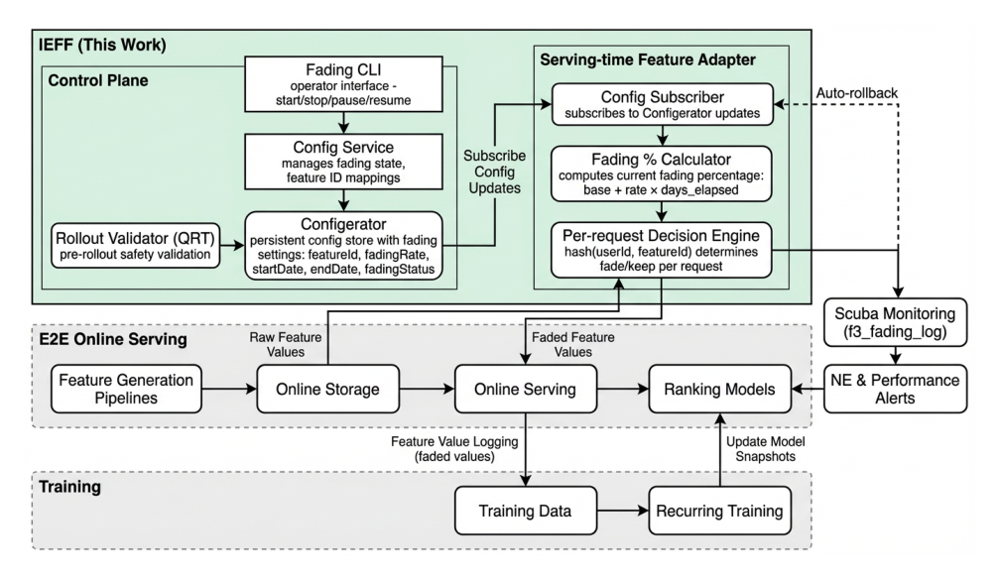
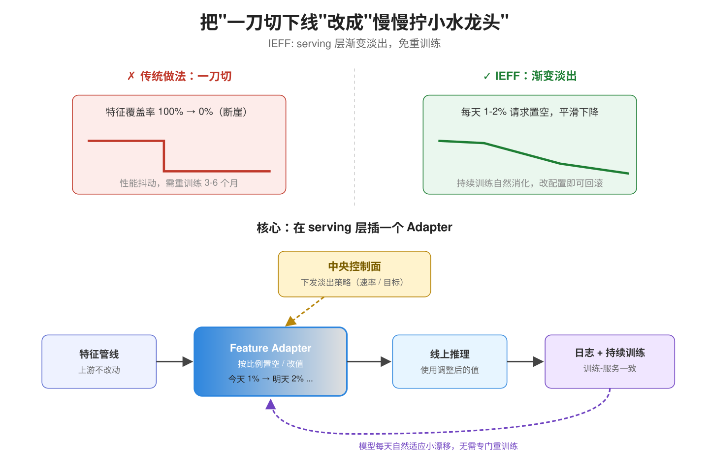
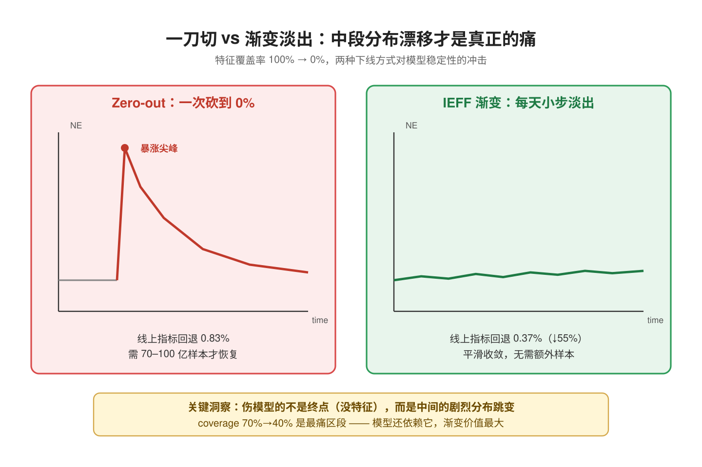
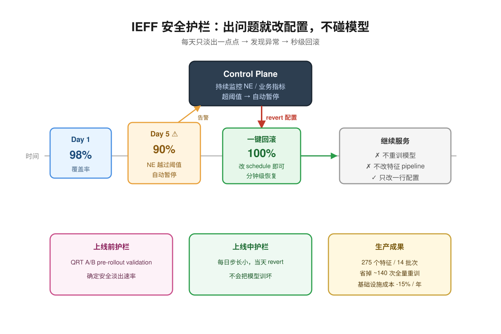
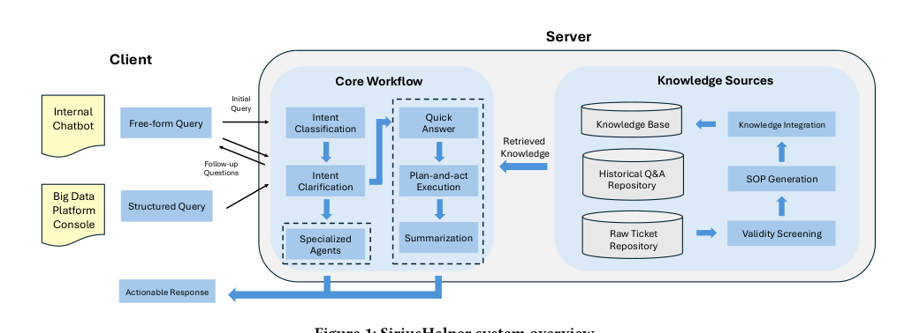
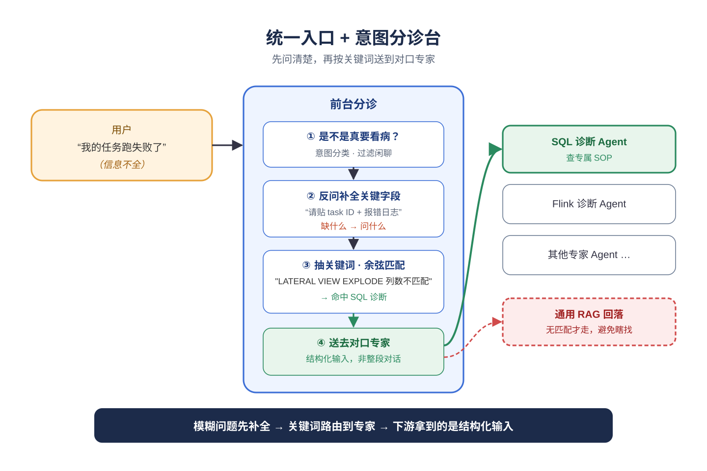
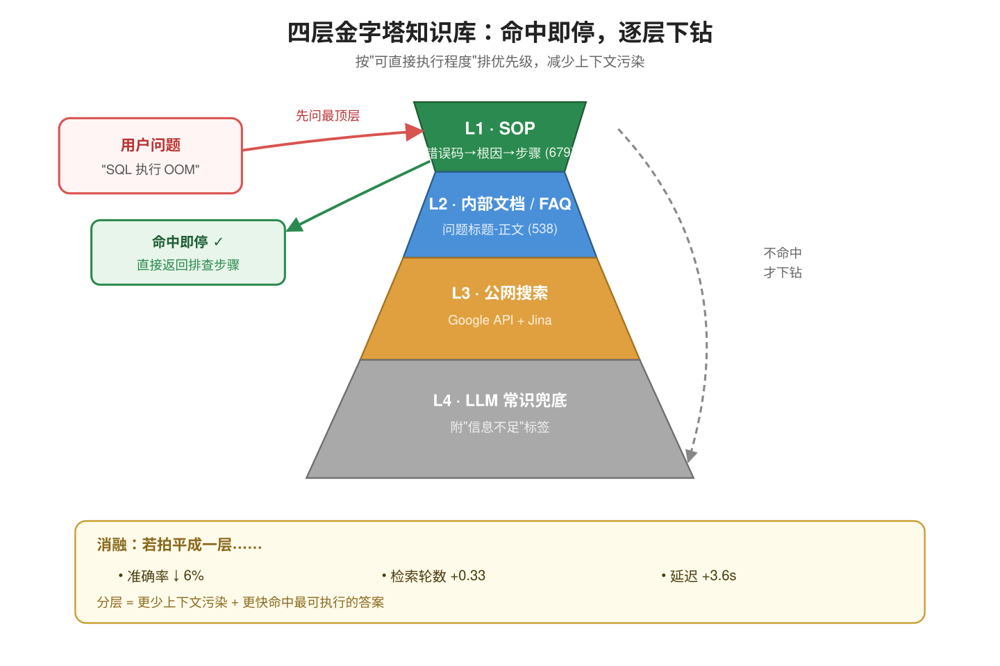
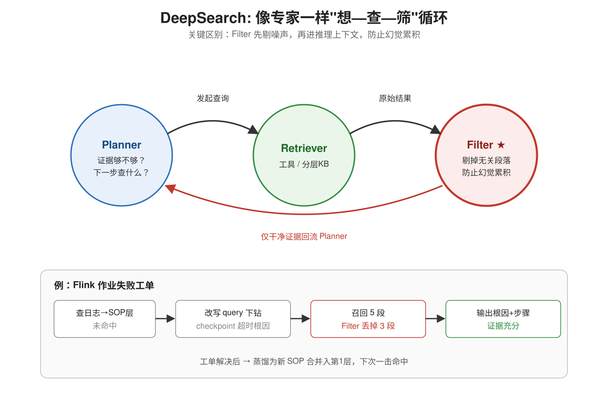

# 2026-05-04 论文日报

## 一、今日趋势与创新观察

### 1. 趋势概况

- 今天 cs.AI 与 cs.LG 合计超过 220 篇，主线是 L…
- Agent 与多智能体方向今天有 42 篇，话题从通用对话转向具体…
- 推荐系统相关论文虽然数量不多，但问题拆得很细，包括多模态模态缺失、…

展开趋势详细版

- 今天 cs.AI 与 cs.LG 合计超过 220 篇，主线是 LLM 与语言理解相关工作（115 篇），信息检索与表示学习类排在第二梯队（85 篇）。
- Agent 与多智能体方向今天有 42 篇，话题从通用对话转向具体系统，比如运维助手、skill 审计、多 agent pipeline 的粒度控制。
- 推荐系统相关论文虽然数量不多，但问题拆得很细，包括多模态模态缺失、下一购物篮的时间间隔、LLM 偏好优化中的负样本等。
- 带明显工业信号的论文约 31 篇，涉及电商搜索、大规模排序特征治理、企业大数据平台等，说明今天真实系统经验类工作比较集中。

### 2. 推荐系统 / 排序相关创新点

- Intelligent Elastic Feature Fadin…
- IKEA.com 的稠密检索工作把负样本挖掘做成系统化策略，并结合…
- Robust Multimodal Recommendation …

展开创新点详细版

- Intelligent Elastic Feature Fading 针对大规模排序系统提出一套免重训练的特征效率治理框架，让特征下线不再等 3-6 个月的模型重训周期，是工业排序链路的基础设施级创新。
- IKEA.com 的稠密检索工作把负样本挖掘做成系统化策略，并结合线上 A/B 给出结构化的负样本选择方案，对广告召回的负采样设计有直接参考价值。
- Robust Multimodal Recommendation 用图检索来补全缺失的视觉或文本模态，把“模态不完整”当成一个检索补全问题处理，是多模态推荐比较新的视角。

### 3. 全局创新点

- Agent Capsules 提出把多 agent pipelin…
- AgentReputation 针对去中心化 agent 市场设计…
- Thinking in Text and Images 在长程机器…

展开全局创新详细版

- Agent Capsules 提出把多 agent pipeline 的多次 LLM 调用自适应合并，用质量门控避免合并后出现工具丢失和 prompt 压缩带来的性能退化，是 agent 系统工程化的新思路。
- AgentReputation 针对去中心化 agent 市场设计了一套抗策略操纵的信誉框架，把传统 reputation 机制搬到 agent 经济体里并重新定义失效模式。
- Thinking in Text and Images 在长程机器人操控中引入文本与图像交错的推理轨迹，让因果顺序和空间约束能在同一条链里同时被表达。

## 二、今日一个 AI 知识点

### Off-Policy Evaluation 为什么能离线估计新策略

- **快速理解：** Off-Policy Evaluation 的难点在于：你手里只有旧策略下产生…

展开知识点详细版

Off-Policy Evaluation 的难点在于：你手里只有旧策略下产生的日志，但你想知道一个新策略如果当时上线，效果会怎样。它本质上是在做‘带偏差采样下的反事实估计’，核心不是直接平均，而是先校正旧策略和新策略看到样本的概率差。 广告排序、预算控制和出价优化都不可能天天线上试错，所以很多工业系统都依赖离线评估。先理解 OPE，才能看懂为什么一篇论文总在强调 propensity、reweighting 或 doubly robust。 可以顺着一次具体运行过程来理解：顺着一次计算过程看：日志里某次曝光原本是旧策略把广告A推上去的，旧策略给A的概率是0.8，而新策略只会在类似场景下以0.2的概率展示A；那这条样本在评估新策略时就不能按原权重直接算，而要乘一个和两者概率比相关的修正系数。把很多样本都这样校正后，才更接近‘如果新策略当时上线会发生什么’。

## 三、今日论文总览

### 1. Intelligent Elastic Feature Fading: Enabling Model Retrain-Free Feature Efficiency Rollouts at Scale
- 挑选理由：大规模排序系统的特征效率管理基础设施，免重训练特征下线，直接作用于工业排序系统链路，对广告系统高度同构。

### 2. SiriusHelper: An LLM Agent-Based Operations Assistant for Big Data Platforms
- 挑选理由：腾讯大数据平台运维助手，虽有公司线索但与广告商业化链路无关。

### 3. Negative Data Mining for Contrastive Learning in Dense Retrieval at IKEA.com
- 挑选理由：IKEA电商搜索的负样本挖掘与A/B test分析，涉及真实商业化搜索系统，与广告召回排序同构。

## 四、补充关注

今天没有需要额外提示的补充关注论文。

## 五、重点论文精读

### 1. Intelligent Elastic Feature Fading: Enabling Model Retrain-Free Feature Efficiency Rollouts at Scale
- **为什么值得看：** Meta工业级特征下线基础设施，免重训练，对广告排序系统直接可迁移
- **快速背景：** 工业排序/广告系统下线特征要等重训练，周期长、GPU贵，论文用serving层渐变替代

*图示：这是 Figure 1 的完整系统架构图，主体聚焦在 IEFF 的 control plane、serving-time feature adapter、online serving 与 recurring training 之间的模块关系和信息流，最能直接代表论文核心方法。相比同页的 block 版本，它几乎不含 caption/正文噪声，裁剪更干净完整，更适合作为日报主图。其余候选要么是正文截图，要么是实验结果图，不适合作为方法总览图。*

展开论文背景详细版

- **详细背景：** 大规模广告和推荐排序系统依赖上千个特征，特征下线、替换、精度迁移等效率类改动通常要走模型重训练闭环，迭代周期3-6个月且消耗大量GPU。如果直接把特征覆盖率一次性从100%砍到0%（zero-out），又会因为分布突变导致模型性能剧烈抖动。论文提出一种serving层的'渐变淡出'基础设施，把这类改动从重训练闭环中解耦，Meta已在生产大规模部署，值得广告系统工程团队借鉴。

**核心技术点速览：**

#### 技术点 1：serving层渐变淡出
- 快速理解：不改上游特征管线，在线推理时按日程一点点降低特征覆盖率或分布影响

*图示：直觉上就是把'一刀切下线'改成'慢慢拧小水龙头'。每天只减少少量请求带这个特征，模型通过日常的持续训练消化这点小的分布漂移，不需要专门安排一次重训练。因为淡出发生在serving层而不是特征生成层，上游特征管线完全不动，回滚只需改配置。*

展开技术点 1 详细版

- 技术细节：IEFF在特征生成管线之后、模型推理之前插入一个serving时的feature adapter，由中央控制面下发淡出策略（起始时间、每日淡出速率、目标状态）。策略分两种：coverage控制决定该请求是否带这个特征，distribution控制修改特征的有效值而不完全移除。生产中速率通常是1-2%/天，隐私或紧急场景用5-10%/天。关键是adapter输出的调整后特征值既用于线上推理，也被日志落盘给持续训练使用，保证训练-服务一致，模型通过recurring training自然适应。
- 通俗讲解：直觉上就是把'一刀切下线'改成'慢慢拧小水龙头'。每天只减少少量请求带这个特征，模型通过日常的持续训练消化这点小的分布漂移，不需要专门安排一次重训练。因为淡出发生在serving层而不是特征生成层，上游特征管线完全不动，回滚只需改配置。
- 例子：假设要下线一个稀疏ID特征，第一天把这个特征在99%的请求里正常返回、1%的请求里置空（或降为默认值）；这些请求的推理和训练日志都用'置空后'的值，持续训练pipeline第二天就看到了1%缺失的样本、相应更新参数；第二天扩到2%缺失，如此推进50-100天后自然降到0。期间模型一直在跟，不需要专门开一次GPU重训。

#### 技术点 2：渐变vs一刀切稳定性
- 快速理解：同样是从100%降到0%，渐变能省掉50-55%的线上性能损失

*图示：核心洞察是：真正伤模型的不是终点状态（特征没了），而是中间的剧烈分布跳变。渐变把一次大跳变拆成很多次小跳变，每次跳变的幅度都在持续训练一天就能吸收的范围内，所以模型始终'跟得上'。特别是在coverage从70%降到40%这个中间阶段，模型还很依赖这个特征、一下砍掉最疼，恰恰是渐变价值最大的区段。*

展开技术点 2 详细版

- 技术细节：论文用归一化熵NE和线上业务指标作为稳定性度量。离线实验显示，Top50稀疏特征zero-out每天NE上升0.10%，渐变只上升0.05%，各种特征类型都稳定呈现约50%的降幅。线上A/B中，Top50稀疏特征zero-out导致0.83%的业务指标回退，渐变只有0.37%，减少约55%的损失。此外zero-out会造成暂时性尖峰，需要额外70-100亿训练样本才能恢复，渐变则平滑收敛。
- 通俗讲解：核心洞察是：真正伤模型的不是终点状态（特征没了），而是中间的剧烈分布跳变。渐变把一次大跳变拆成很多次小跳变，每次跳变的幅度都在持续训练一天就能吸收的范围内，所以模型始终'跟得上'。特别是在coverage从70%降到40%这个中间阶段，模型还很依赖这个特征、一下砍掉最疼，恰恰是渐变价值最大的区段。
- 例子：阶段性对比很直观：coverage从70%到40%这一段，zero-out的线上性能只有渐变的99.4%（差0.6%），因为模型还高度依赖这个特征；而覆盖率已经降到10%以下时差距缩到0.3%，因为模型那时基本已经适应没这个特征了。也就是说渐变的主要收益来自把中段分布漂移的冲击压平。

#### 技术点 3：安全护栏与回滚
- 快速理解：上线前QRT压测定速率，线上实时监控NE和业务指标，异常即自动回滚

*图示：因为这套机制直接改线上特征值，一旦搞错影响面很大，所以必须有完整的闸门：先小流量压测定速率、设硬性速率上限和作用域、持续看指标、能秒级回滚。由于渐变每天动得很小，即使出问题也能在当天发现并revert回昨天的状态，不会把模型训坏。*

展开技术点 3 详细版

- 技术细节：每个淡出rollout上线前必须通过内部A/B框架QRT做pre-rollout validation，用于确定安全的淡出速率。上线中由control plane持续监控NE和业务指标，一旦越过阈值可自动暂停或回滚；回滚只需改配置把fading schedule revert，不需要重训模型也不需要改pipeline。Meta已用该机制处理275个特征，分14个批次，避免约140次全量重训，年基础设施成本降低约15%。
- 通俗讲解：因为这套机制直接改线上特征值，一旦搞错影响面很大，所以必须有完整的闸门：先小流量压测定速率、设硬性速率上限和作用域、持续看指标、能秒级回滚。由于渐变每天动得很小，即使出问题也能在当天发现并revert回昨天的状态，不会把模型训坏。
- 例子：比如配置某特征每天淡出2%，第5天线上NE突然超阈值：control plane自动把fading schedule停在第5天状态（coverage 90%），运维人员检查后一键revert到100%，下一个训练批次模型又看到完整特征值，整个过程不动模型、不动特征管线、分钟级恢复。

- **对广告的启发：** 广告排序系统可直接借鉴，特征下线/迁移从季度级缩到周级且免GPU重训

展开广告启发详细版

- **详细启发：** 最适合层级：广告排序/召回系统的特征管理与在线serving基础设施层；价值：广告CTR/CVR模型依赖成千上万的特征，下线老特征、迁移到更紧凑表示、隐私合规移除是日常刚需。直接搬IEFF思路可以：1) 把特征下线从等重训练周期（3-6个月）压到周级；2) 省掉专门重训练的GPU开销，用日常持续训练吸收分布漂移；3) 用渐变大幅降低上线抖动，减少线上事故和收入损失；4) 配合QRT类A/B框架形成标准化的特征治理流程。对有大规模深度CTR模型+持续训练pipeline的广告团队几乎是即插即用。；风险：论文明确指出对强非线性交互或模型高度敏感的特征可能仍需重训练，小幅覆盖率变动也可能带来不成比例的影响；此外淡出速率目前靠人工QRT经验选择，自适应策略仍是开放问题。广告场景下还要特别注意：某些特征跟出价、计费逻辑强耦合，渐变期间可能造成广告主间不公平的竞价环境，需要额外设计公平性护栏。

### 2. SiriusHelper: An LLM Agent-Based Operations Assistant for Big Data Platforms
- **为什么值得看：** 腾讯大数据平台LLM运维助手，分层知识库+DeepSearch可迁移到广告运维问答
- **快速背景：** 大数据平台LLM客服助手普遍覆盖窄、多跳检索差、工单难沉淀，SiriusHelper想一次性解决

*图示：这是 Figure 1 的系统总览图，完整展示了 SiriusHelper 的端到端架构：客户端入口、核心工作流中的意图分类/快速回答/规划执行/专用 agent，以及知识源侧的知识库、历史 QA、原始工单仓库与 SOP 生成/知识集成之间的关系，最能代表论文的整体方法。该候选图主体完整、模块关系清楚、信息流明确，正文噪声也较少。相比之下，Figure 2 和 Figure 3 只覆盖专门子模块（专用 agent 工作流、SOP 提取流程），代表性不如系统总览图；page-4-block-22 还是不完整裁剪，应降级。*

展开论文背景详细版

- **详细背景：** 大数据平台（SQL、Flink等）用户的问题既有使用咨询又有故障诊断，现有LLM+RAG助手存在三个痛点：场景覆盖单一（要么只做FAQ要么只做某一种诊断），知识检索要么单轮不够要么多轮导致上下文爆炸，工单升级后难以反哺知识库。SiriusHelper把路由、分层知识库、DeepSearch迭代检索、工单到SOP的自动蒸馏拼在一起，在腾讯大数据平台线上跑通并把工单量降了20.8%，工程完整度较高，是值得广告团队抄作业的一篇系统论文。

**核心技术点速览：**

#### 技术点 1：统一入口+意图路由
- 快速理解：用意图分类+澄清把咨询、诊断、专家Agent统一分流，避免单一pipeline覆盖不全

*图示：相当于一个前台+分诊台：先判断来的人是不是真要看病，再问清楚'哪里不舒服、有没有化验单'，最后根据关键词决定送到内科还是急诊。对模糊问题强制补全关键字段，下游Agent拿到的都是结构化输入，而不是一堆杂乱的对话历史。*

展开技术点 1 详细版

- 技术细节：系统分5个阶段处理请求：先做意图分类判断是否可操作，再做意图澄清（缺字段就反问用户补task ID、错误日志等），然后走快速回答（从历史工单库找高相似度案例），不行再进入Plan-and-act执行，最后总结输出。路由时把澄清后的请求抽成关键词，和预定义关键词集合做余弦相似度匹配，匹配到SQL诊断、Flink诊断等专门Agent就走专家工作流，否则回落通用pipeline。控制台入口因为字段结构化可以直接跳过澄清。
- 通俗讲解：相当于一个前台+分诊台：先判断来的人是不是真要看病，再问清楚'哪里不舒服、有没有化验单'，最后根据关键词决定送到内科还是急诊。对模糊问题强制补全关键字段，下游Agent拿到的都是结构化输入，而不是一堆杂乱的对话历史。
- 例子：用户在聊天窗说'我的任务跑失败了'，意图分类判为可操作变成澄清阶段反问'请贴一下task ID和报错日志'变成拿到日志后抽出关键词'LATERAL VIEW EXPLODE 列数不匹配'，余弦相似度匹配到SQL诊断Agent变成进入专家工作流去查SOP，而不是让通用RAG在整个文档库里瞎找。

#### 技术点 2：四层金字塔知识库
- 快速理解：把SOP、内部文档、网页、模型常识按优先级分四层，自顶向下检索降延迟

*图示：核心直觉是：能用SOP一句话解决的就别再去翻长文档，能在内部文档解决的就别上公网。把知识按'可直接执行程度'排优先级，模型每一步只在最相关的一层里捞，既减少了上下文污染也减少了迭代轮数。消融实验显示拍平成一层后准确率掉6%、检索轮数多0.33轮、延迟多3.6秒。*

展开技术点 2 详细版

- 技术细节：知识库按可操作性和权威性分四层：第1层SOP（专家整理或从工单蒸馏的'错误码变成根因+排查步骤+解决步骤'结构化条目，679条），第2层内部专业文档和FAQ（538条，组织成'问题标题-正文'），第3层公网搜索（Google Search API+Jina抓取），第4层LLM预训练常识作兜底。检索时从第1层开始，够了就停，不够才下钻到下一层，每层内部用lexical+embedding混合召回再重排。
- 通俗讲解：核心直觉是：能用SOP一句话解决的就别再去翻长文档，能在内部文档解决的就别上公网。把知识按'可直接执行程度'排优先级，模型每一步只在最相关的一层里捞，既减少了上下文污染也减少了迭代轮数。消融实验显示拍平成一层后准确率掉6%、检索轮数多0.33轮、延迟多3.6秒。
- 例子：用户报'SQL执行OOM'：先在SOP层用错误码检索，命中'OOM常见根因SOP'就直接返回排查步骤；如果没命中，再下钻到内部文档层查SQL引擎架构文档；还不行才去公网搜类似issue；都没有才让LLM凭常识编答案（此时会加'信息不足'标签）。

#### 技术点 3：DeepSearch迭代+工单蒸馏SOP
- 快速理解：Plan-检索-过滤闭环做多跳检索，并把历史工单自动蒸馏成新SOP回灌知识库

*图示：把'专家排查一个问题'拆成三件事循环做：想下一步查什么、去查、把噪声丢掉，丢掉这一步就是和普通DeepSearch最大的区别。线下那条蒸馏链则是把'这次没答好的工单'变成'下次能答好的SOP'，而且通过多版本生成+一致性打分来控制LLM生成SOP的幻觉。*

展开技术点 3 详细版

- 技术细节：DeepSearch由Planner/Retriever/Filter组成闭环：Planner维护当前证据状态，判断证据够不够，不够就选下一步动作（调平台工具拿日志指标，或在分层知识库某一层发一个聚焦query），Retriever去召回，Filter在进入推理上下文前先剔掉无关段落（论文强调这一步很关键，能防止幻觉累积）。离线侧用多Agent工作流从工单蒸馏SOP：Data Screener过滤无效工单变成SOP Author/Editor生成并修订多版本草稿变成SOP Reviewer打稳定性分数选最终版变成SOP Curator判断是否和已有SOP合并。工单归因用朴素贝叶斯后验（先验×各动作特征条件概率），后验超过0.8自动分派到负责方，否则转人工。
- 通俗讲解：把'专家排查一个问题'拆成三件事循环做：想下一步查什么、去查、把噪声丢掉，丢掉这一步就是和普通DeepSearch最大的区别。线下那条蒸馏链则是把'这次没答好的工单'变成'下次能答好的SOP'，而且通过多版本生成+一致性打分来控制LLM生成SOP的幻觉。
- 例子：一个Flink作业失败工单进入系统：Planner先调工具拿最近日志变成Retriever去SOP层查类似错误码没命中变成Planner决定下钻到内部文档层并改写query为'Flink checkpoint超时根因'变成Retriever返回5段变成Filter丢掉3段无关段变成Planner判断证据够了变成Summarizer输出根因+操作步骤。该工单解决后进入蒸馏流水线，生成一条新的'checkpoint超时SOP'合并进第1层，下次同类问题就能在第一层命中，省掉多轮检索。

- **对广告的启发：** 广告投放诊断/客服机器人可直接套用'分层知识库+工单蒸馏SOP'这一整套工程方案

展开广告启发详细版

- **详细启发：** 最适合层级：广告平台运维与客服：投放诊断助手、广告主自助排障、内部on-call机器人；价值：广告平台每天有大量'为什么我的广告不跑量''为什么审核被拒''消耗异常'类问题，现状要么规则FAQ要么单轮RAG，效果和本文baseline类似。可直接借鉴：(1)把诊断SOP（不跑量十问、拒审码→原因映射、消耗异动排查）作为知识库第1层，内部产品文档第2层；(2)用带filter的DeepSearch做多跳检索，避免LLM把一堆相关但无用的文档一起吞进上下文；(3)把客服工单/IM对话用多Agent蒸馏成新SOP回灌，形成'越用越准'的闭环；(4)用贝叶斯后验自动把工单归因到'文档缺失/路由错误/工具缺失'等类别，减轻运营负担。上线工单降20.8%的数字对广告客服ROI很有参考价值。；风险：论文场景是内部工程师用户，容忍度高、字段相对结构化；广告主面向C端商家，表达更口语化、情绪化，澄清反问如果过多会伤体验。另外SOP自动蒸馏依赖工单质量和一致性打分阈值，广告领域业务迭代快（新政策、新产品形态频繁），SOP容易过期，需要加时效性衰减或定期复核。贝叶斯归因假设动作特征条件独立，在广告这种多因耦合问题上可能偏乐观，阈值0.8需要按业务重新标定。

## 六、候选但未完成深读的论文

当前重点论文都已完成可用分析。
