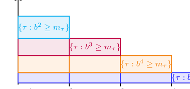
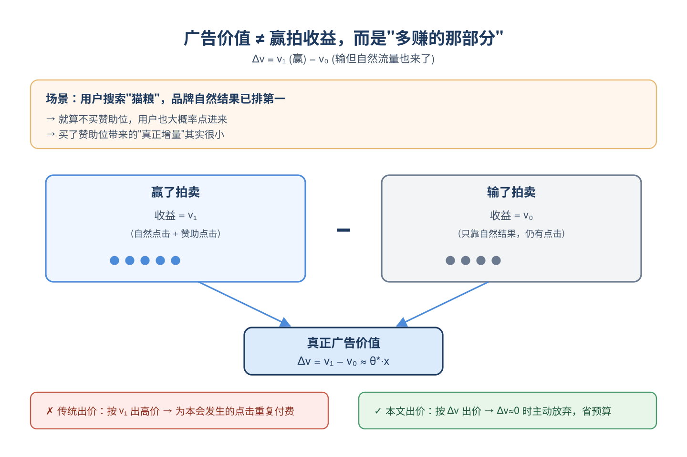
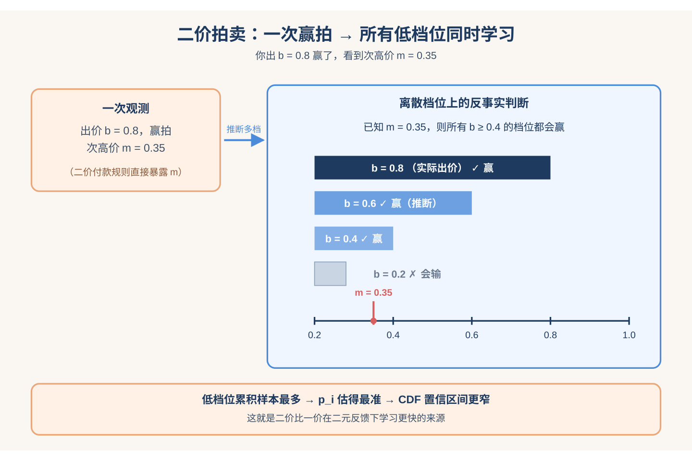
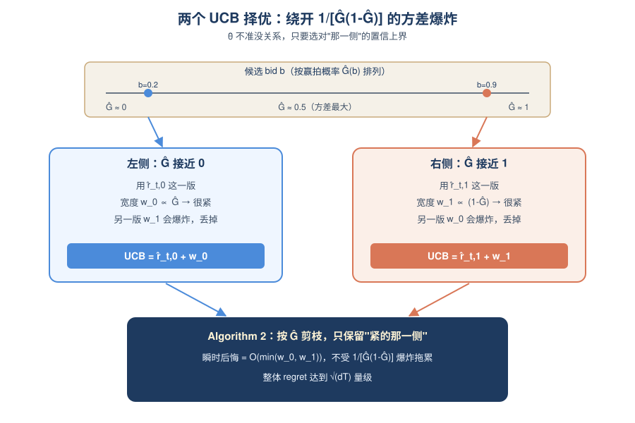
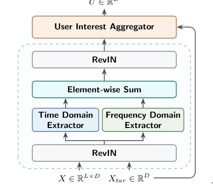
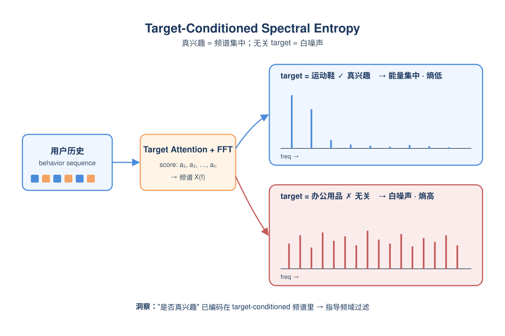
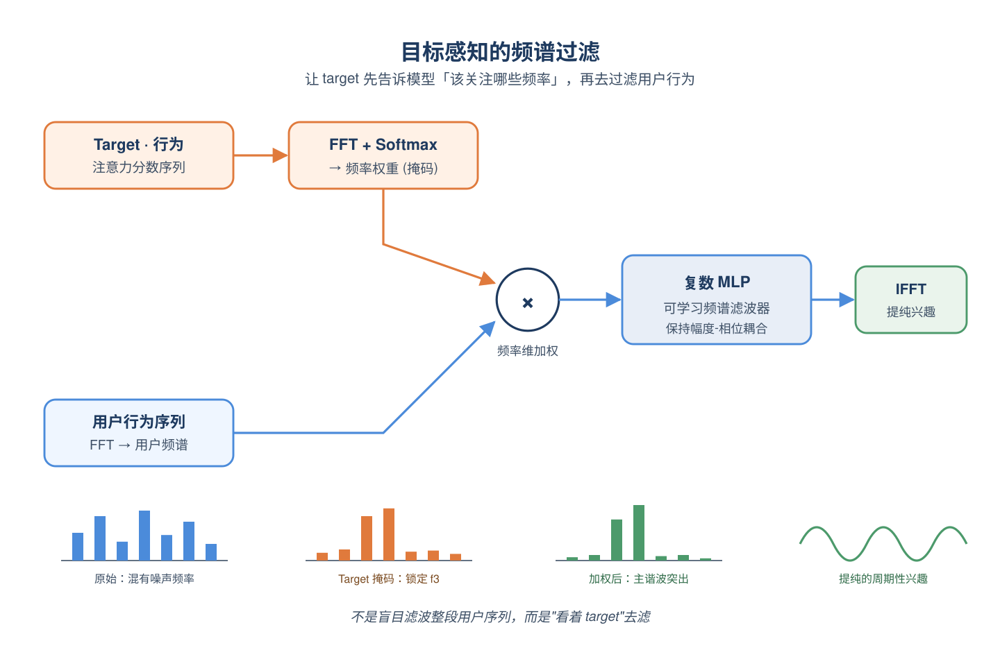
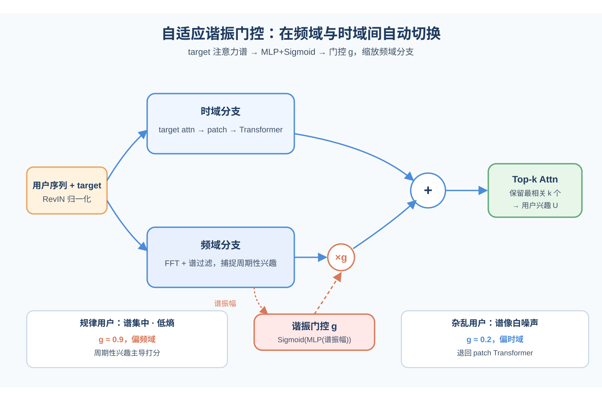

# 2026-05-05 论文日报

## 一、今日趋势与创新观察

### 1. 趋势概况

- 今天 712 篇论文中 cs.AI 占 370 篇，LLM 与语言理解主题覆盖 280 篇，Agent 与多智能体 136 篇，显示研究重心仍集中在大模型本体能力、长期记忆与多智能体协同。
- 表示学习与检索排序主题有 213 篇，RAG 检索-重排框架、神经排序模型的对抗攻防以及知识图谱+LLM 混合检索是其中较密集的子方向。
- 迁移学习与跨域泛化 120 篇，集中在跨域序列推荐、公平性再分配与多任务表示迁移，说明业务泛化仍是热点但方法偏表示层。
- 直接广告相关论文数量不多，但出现了搜索广告因果边际价值、广告治理策略自适应、CTR 频域增强等少而精的业务向工作。

### 2. 推荐系统 / 排序相关创新点

- 《The (Marginal) Value of a Search Ad》把二价拍卖中广告价值建模为付费曝光相对自然结果的因果处理效应，用在线因果框架替换传统以成交收入为目标的自动出价，直接修正了 auto-bidding 的价值定义。
- FEDIN 在 Deep Interest Network 基础上引入频域增强模块，通过跨序列频谱交互挖掘用户兴趣的潜在周期性，用频域视角缓解时域行为噪声，对 CTR 序列建模是一种新的结构补充。
- ARGUS 针对广告审核中政策非平稳的问题，提出带对抗裁判的演化强化学习治理框架，把历史标签不一致和新政策迁移统一到策略自适应里，是广告合规链路少见的系统级方法创新。

### 3. 全局创新点

- MEMAUDIT 提出带预算约束的精确 package-oracle 评测协议，把长程 LLM 记忆写入与检索、推理解耦单独度量，为 Agent 长期记忆研究提供了干净的评测基座。
- Trojan Hippo 把 Agent 持久记忆作为攻击面，展示在更现实威胁模型下通过记忆投毒实现跨会话数据外泄，给 Agent 记忆系统安全设计敲了警钟。
- CRAFT 用监督式可迁移框架对神经排序模型做黑盒对抗内容注入，取代以往启发式/代理模型攻击，为 NRM 鲁棒性评估提供了更强基线。

### 4. 跨论文综合观察

- MEMAUDIT、Trojan Hippo、Feedback-Normalized Developer Memory 同时聚焦 LLM Agent 的长期记忆，一个从评测、一个从攻击、一个从 RL 反馈写入切入，拼起来正好是记忆系统的评测-安全-优化三面。
- 搜索广告因果出价、FEDIN 频域 CTR、ARGUS 广告治理分别对应广告链路的出价、排序、合规三层，说明广告侧虽量少但开始从单点模型改进转向全链路各环节的方法创新。
- CRAFT 对抗攻击神经排序与 E-MIA 对 RAG 做成员推断，共同指向检索/排序系统的对抗与隐私风险，和 RAG+重排框架的繁荣形成一体两面：能力提升的同时攻击面也在同步扩张。

## 二、今日论文总览

### 1. The (Marginal) Value of a Search Ad: An Online Causal Framework for Repeated Second-price Auctions
- 挑选理由：直接研究搜索广告自动出价，将广告价值建模为因果treatment effect，二价拍卖在线学习，核心广告问题。

### 2. FEDIN: Frequency-Enhanced Deep Interest Network for Click-Through Rate Prediction
- 挑选理由：CTR预估、DIN系列改进，作者含腾讯团队（Junwei Pan, Dapeng Liu），直接作用于广告排序链路。

### 3. ARGUS: Policy-Adaptive Ad Governance via Evolving Reinforcement with Adversarial Umpiring
- 挑选理由：直接针对在线广告审核/治理的政策自适应系统，属于广告业务链路中的内容合规环节

### 4. MEMAUDIT: An Exact Package-Oracle Evaluation Protocol for Budgeted Long-Term LLM Memory Writing
- 挑选理由：LLM记忆评估协议，与广告商业化无关

### 5. Structural Ranking of the Cognitive Plausibility of Computational Models of Analogy and Metaphors with the Minimal Cognitive Grid
- 挑选理由：认知科学评估，与广告ranking无关

### 6. E-MIA: Exam-Style Black-Box Membership Inference Attacks against RAG Systems
- 挑选理由：针对RAG的成员推断攻击，与广告链路无关。

### 7. Code World Model Preparedness Report
- 挑选理由：Meta代码模型安全评估，与广告业务无关。

### 8. Graph Query Generation with Constraint-guided Large Language Agents
- 挑选理由：知识图谱Cypher查询生成，与广告商业化链路无关

### 9. Predicting Post Virality with Temporal Cross-Attention over Trend Signals
- 挑选理由：Reddit帖子爆款预测，与广告商业化分发关联较弱

### 10. Learn-to-learn on Arbitrary Textual Conditioning: A Hypernetwork-Driven Meta-Gated LLM
- 挑选理由：LLM元学习方法，与广告链路无直接关系

### 11. Hallucinations Undermine Trust; Metacognition is a Way Forward
- 挑选理由：LLM幻觉与元认知，非广告。

### 12. Valley3: Scaling Omni Foundation Models for E-commerce
- 挑选理由：电商多模态基础模型（疑似阿里），涉及电商场景理解，但不直接作用于广告排序/出价/召回链路

## 三、补充关注

1. **Post-hoc Provider Fairness Adaptation via Hierarchical Exposure Alignment**
   - 理由：推荐系统中provider曝光公平性，后处理适配框架，与广告曝光分配有一定同构性但非直接广告论文。

## 四、重点论文精读

### 1. The (Marginal) Value of a Search Ad: An Online Causal Framework for Repeated Second-price Auctions
- **为什么值得看：** 把广告价值改成'因果增量'，并在二价拍卖下给出最优在线出价算法
- **背景：** 在搜索广告里，用户就算没点赞助位，也可能通过自然搜索结果访问广告主，所以广告的真实价值应该是'赢拍带来的增量'而不是'赢拍后的总收益'。但现有自动出价算法几乎都按后者出价，会系统性高估广告价值、造成浪费预算。已有工作在一价拍卖下讨论过把广告价值当treatment effect来学，但二价拍卖这一搜索广告主流机制还没有完整的在线学习理论。本论文补上了这一块，并指出二价的'赢家才付并看到次高价'这个规则其实额外泄露了信息，能让学习比一价更快。

*图示：这是候选中唯一真正对应论文核心机制的示意图，直接展示了作者利用二价拍卖支付信息推断单侧反馈、从而获得更多观测的关键思想。相比之下，Figure 2 只是实验结果曲线；另一个 Figure 1 候选包含大量正文、像页面截图而不是纯图。虽然这张图不是传统的大型框架图，但在本论文缺少完整系统架构图的情况下，它最集中、最清楚地代表了方法核心。*

**核心技术点：**

#### 技术点 1：广告价值=因果增量
- 快速理解：把广告价值重新定义为赢拍和不赢拍两种结果之差，用因果推断视角建模。

*图示：直觉就是：如果一个品牌自然搜索就排第一，用户本来就会点进去，那你再花钱买赞助位，增量几乎为零，不该出高价。论文把这件事数学化——真正要学的不是'赢了之后赚多少'，而是'因为赢了才多赚的那部分'。每次出价时，算法会根据当前上下文x预测一个线性增量θ·x，然后结合赢拍概率估计去决定出多少。*

- 技术细节：论文设定每次拍卖有两个潜在结果：赢了得到v1，输了仍可能通过自然结果得到v0，真正的广告价值是增量Δv = v1 - v0，并假设它对特征x呈线性关系（参数θ\*）。出价者的期望收益因此写成'赢的概率×(θ\*·x - 付款)'加上一个与出价无关的基线项，优化目标就是对每个上下文选出价去最大化这个增量收益。因为Δv从来不会被直接观测到（同一次拍卖只能看到一种结果），必须走因果推断路线。
- 通俗讲解：直觉就是：如果一个品牌自然搜索就排第一，用户本来就会点进去，那你再花钱买赞助位，增量几乎为零，不该出高价。论文把这件事数学化——真正要学的不是'赢了之后赚多少'，而是'因为赢了才多赚的那部分'。每次出价时，算法会根据当前上下文x预测一个线性增量θ·x，然后结合赢拍概率估计去决定出多少。
- 例子：比如用户搜'猫粮'，特征x是'老用户+熟悉品牌'。传统方法看到历史CTR很高就出高价；本方法会发现'即使输了拍卖，这个用户也会从自然结果点进来'，也就是v0很高，于是Δv接近0，模型输出的θ·x很小，最终出低价甚至放弃这次机会，避免为本来就会发生的点击再付一次钱。

#### 技术点 2：二价付款泄露的信息
- 快速理解：利用二价'赢家才看到并支付次高价'这一规则，可以顺便学到整条出价区间上的次高价分布。

*图示：一价拍卖下你赢了只知道'自己出的价赢了'，不知道对手到底出多少，对低档位的学习帮助有限。二价下你赢了就直接看到次高价这个数值，相当于一次样本同时给所有更低档位都提供了信息。于是低档位档格样本最多、估计最准；把这些估计按档位累加起来，就能得到整条CDF的紧致估计。*

- 技术细节：作者把出价空间离散成大约根号T个档位b1\<b2\<...，定义pi = P(次高价落在(bi-1, bi）)，CDF G(bj)就是前j个pi之和。关键观察是：如果你在某次用了较高的bid b'赢了，不仅知道次高价\<=b'，还直接看到了次高价的具体数值，因此对任何更低的bid b，你也知道'b是否也能赢'。所以对小档位pi，样本量其实累积了所有'出价\>=bi'的历史，而不是只有出价正好等于bi的那些。论文据此构造了分段概率估计量和带Bernstein型置信宽度的CDF估计，证明在小pi时收敛更快。
- 通俗讲解：一价拍卖下你赢了只知道'自己出的价赢了'，不知道对手到底出多少，对低档位的学习帮助有限。二价下你赢了就直接看到次高价这个数值，相当于一次样本同时给所有更低档位都提供了信息。于是低档位档格样本最多、估计最准；把这些估计按档位累加起来，就能得到整条CDF的紧致估计。
- 例子：假设档位是0.2、0.4、0.6、0.8。某次你出0.8赢了，付款看到次高价是0.35。这一条样本立刻告诉你：次高价落在(0.2, 0.4）这一段（对p2是正样本）、同时也告诉出价0.4/0.6/0.8这三档都能赢。于是低档位(0.2, 0.4）既有'出0.8赢了'也有'出0.4赢了'等多种历史都算数，样本量大，p2估得很准，进而G(0.4)的置信区间很窄。

#### 技术点 3：两个UCB择优+IPW值估计
- 快速理解：用两种等价的收益改写各算一个UCB，谁的不确定度小就用谁，抵消掉价值估计可能很差的问题。

*图示：核心trick是：即使我对θ本身估得很烂（因为样本方差大导致整条线性估计都发飘），也没关系——只要我能识别出当前bid是在'赢概率很小'还是'赢概率很大'这两种极端之一，我就可以选那种对θ不敏感的收益表达去做决策。于是算法每一步先看Ĝ(b)更接近0还是1，用那侧的UCB，保证瞬时后悔只由'小的那个宽度'决定。*

- 技术细节：论文先用带估计倾向分的IPW构造Δv的估计：赢了就用v1/Ĝ(b)，输了就用v0/(1-Ĝ(b))，再对历史做加权岭回归得到θ̂。这个估计的方差代理是1/(Ĝ(1-Ĝ))，在Ĝ接近0或1时会爆炸，看起来很不可靠。但作者把期望收益写成两种等价形式r-t,0和r-t,1，它们对θ·x的依赖方向不同，配套的置信宽度w-t,0、w-t,1一个在Ĝ小时更紧、一个在Ĝ大时更紧。算法在每个候选bid上计算两个UCB，用一个专门的'UCB选择'子程序（Algorithm 2）根据Ĝ把bid区间剪枝到其中一侧是明显更紧的，再在该侧跑标准UCB。再加上一个分层master routine（按置信宽度所在的2 -ℓ档位把历史分桶）来维持条件独立性，整体regret达到√(dT)量级。
- 通俗讲解：核心trick是：即使我对θ本身估得很烂（因为样本方差大导致整条线性估计都发飘），也没关系——只要我能识别出当前bid是在'赢概率很小'还是'赢概率很大'这两种极端之一，我就可以选那种对θ不敏感的收益表达去做决策。于是算法每一步先看Ĝ(b)更接近0还是1，用那侧的UCB，保证瞬时后悔只由'小的那个宽度'决定。
- 例子：想象某个时刻模型对θ·x的估计误差很大。对bid=0.2，Ĝ≈0.1，此时r-t,0版本的宽度w-t,0小（因为前面乘了Ĝ），算法用br-t,0+w-t,0作为UCB；对bid=0.9，Ĝ≈0.95，则用r-t,1那一版更紧。选择子程序会把候选bid区间压到'Ĝ统一靠近0或统一靠近1'的段，然后在该段按对应UCB取选择分数最高的方案出价。即便θ̂此刻很不准，最终选出来的bid的瞬时后悔还是O(min(w0,w1))，可控。

- **对广告的启发：** 自动出价系统值得把'价值模型'从'赢后收益'改成'赢拍相对自然结果的增量'，尤其在搜索广告。
- **适用边界：** 强依赖于：次高价近似i.i.d.稳态、Δv对特征线性、以及能获得'未曝光时的baseline结果v0'的可靠信号；在高度非稳态竞价环境或无法度量organic转化的场景，方法需要额外的baseline估计模块才能落地。
- **实践建议：** 搜索/电商广告团队可以先做个A/B或ghost ads实验估计organic baseline v0，把自动出价中的价值信号从'预估赢后收益'改成'预估赢拍增量'，并在二价/类二价场景下把赢家看到的成交价用起来，反哺次高价分布的在线估计。

### 2. FEDIN: Frequency-Enhanced Deep Interest Network for Click-Through Rate Prediction
- **为什么值得看：** 腾讯团队改造DIN，用频域过滤行为序列噪声，CTR指标全面提升
- **背景：** CTR预估里DIN、DIEN、SASRec这类时域模型容易被用户历史里的随机点击、误点干扰，长序列中很难把稳定的周期性兴趣和噪声区分开。已有频域方法（FMLP-Rec、FEARec、DIFF）虽然引入了傅里叶变换，但都是对用户序列独立处理，忽略了目标item这个关键条件。作者通过实验观察到：同一用户序列在正样本target下注意力谱集中、熵低，在负样本下像白噪声，于是提出让频域过滤'看着target item来做'。

*图示：该图是FEDIN整体架构总览，直接展示了输入序列与目标item如何经过RevIN、Time Domain Extractor、Frequency Domain Extractor、Element-wise Sum和User Interest Aggregator形成最终表示，模块关系和信息流最完整，最能代表论文核心方法。相比之下，Figure 2候选更像频域分支的局部子模块，不如这张总览图全面；其余候选多为现象图或实验图，不适合作为主架构图。*

**核心技术点：**

#### 技术点 1：目标条件下的频谱熵现象
- 快速理解：正样本的注意力谱集中低熵，负样本谱分散高熵，target成了天然频率选择器

*图示：可以把用户历史想象成一段混杂信号。如果问'这个用户对运动鞋感兴趣吗'，和运动鞋真正相关的那些点击会呈现出规律性的周期（比如每隔几天看一次），在频谱上就是几根尖峰；如果问的是一个完全不相关的品类，那整段注意力分数就是一团乱麻，频谱上到处都是小起伏。论文抓住的就是'谱是否集中'这件事来判断兴趣真伪。*

- 技术细节：作者先跑一个标准target attention拿到每个历史行为对target的注意力分数序列，然后对这个分数序列做FFT看频谱。统计发现：当target是用户真正感兴趣的item时，频谱能量集中在少数几个频点，谱熵低；当target无关时，频谱接近白噪声，谱熵高。这说明'是否是真兴趣'这个信号本身就编码在target-conditioned的频域结构里。
- 通俗讲解：可以把用户历史想象成一段混杂信号。如果问'这个用户对运动鞋感兴趣吗'，和运动鞋真正相关的那些点击会呈现出规律性的周期（比如每隔几天看一次），在频谱上就是几根尖峰；如果问的是一个完全不相关的品类，那整段注意力分数就是一团乱麻，频谱上到处都是小起伏。论文抓住的就是'谱是否集中'这件事来判断兴趣真伪。
- 例子：假设用户过去100次行为中有15次和运动鞋相关、且分布有规律，那target=运动鞋时，attention score序列经FFT后在低频几个点有明显尖峰；换成target=办公用品，attention分数几乎均匀分布，FFT后各频点振幅接近，谱熵显著升高。

#### 技术点 2：目标感知的频谱过滤
- 快速理解：把target-attention分数的频谱作为权重，去加权过滤用户序列的频谱

*图示：相当于让target先告诉模型'该关注哪些频率'，再用这个频率掩码去看用户的行为频谱，而不是盲目地对整段用户序列做频域滤波。复数MLP是为了在滤波时同时处理频谱的振幅和相位，不破坏信号的周期结构。*

- 技术细节：频域分支的核心流程是：先算target和每个行为的相似度得到注意力分数序列，对其做FFT得到目标条件频谱；取这个频谱的振幅过softmax当作频率维的权重，去按元素乘以用户序列本身的FFT结果，得到目标感知的频域表示。然后用一个复数MLP（遵循Deep Complex Networks的复数运算规范，保持相位-幅度耦合）作为可学习的频谱滤波器，放大主导谐波、压制噪声频率，最后IFFT回时域。
- 通俗讲解：相当于让target先告诉模型'该关注哪些频率'，再用这个频率掩码去看用户的行为频谱，而不是盲目地对整段用户序列做频域滤波。复数MLP是为了在滤波时同时处理频谱的振幅和相位，不破坏信号的周期结构。
- 例子：用户序列经FFT后在频点f1、f3、f7上都有能量。如果target-attention的频谱告诉模型f3这个频率上响应特别强（对应用户每周固定看一次运动鞋的节奏），那么加权后f3被放大、f1和f7被压制，复数MLP再进一步学习把残余噪声频率抹掉，IFFT回去就得到一段'提纯过'的周期性兴趣信号。

#### 技术点 3：自适应谐振门控与双分支融合
- 快速理解：用频谱熵决定多相信频域分支，再和时域patch Transformer相加后做Top-k target attention

*图示：门控的作用是'会看情况'：遇到有明显规律的用户就多用频域结果，遇到行为零散的用户就回退到时域。Top-k的设计则借鉴了多任务里的参数隔离思想，防止不相关的兴趣稀释最终打分。整条链路就是：RevIN归一化变成时域和频域并行出表示变成加和变成Top-k target attention变成用户兴趣U。*

- 技术细节：不是所有user-item对都有明显周期性，作者用target注意力频谱的振幅过一个MLP+Sigmoid，得到一个标量门控去缩放频域分支输出：谱越清晰（低熵）门控越大，越依赖频域；谱越糊门控越小，退回依赖时域。时域分支走的是target attention粗筛变成patch切分变成Transformer编码的路线，保留时序细节。两个分支逐元素相加后，最后用Top-k target attention（只保留与target最相似的k个位置，其余mask为负无穷）聚合出用户兴趣向量，避免弱信号稀释。
- 通俗讲解：门控的作用是'会看情况'：遇到有明显规律的用户就多用频域结果，遇到行为零散的用户就回退到时域。Top-k的设计则借鉴了多任务里的参数隔离思想，防止不相关的兴趣稀释最终打分。整条链路就是：RevIN归一化变成时域和频域并行出表示变成加和变成Top-k target attention变成用户兴趣U。
- 例子：某用户历史规律明显，target注意力频谱集中，门控输出0.9，频域分支贡献大；另一用户行为杂乱，门控输出0.2，模型主要靠时域patch Transformer。最后在Top-k=3的情况下，只有3个最相关行为位置参与softmax加权求和，输出U用于和target拼接过MLP出CTR分数。

- **对广告的启发：** 为长行为序列的广告CTR模型提供一条'频域去噪+target条件化'的新兴趣抽取路径
- **适用边界：** 方法依赖于用户行为中存在可被频谱捕捉的周期性结构，对新用户或行为极稀疏用户帮助有限；另外本文只验证到序列长度100，对SIM级别的超长序列（数千）是否仍稳定未经验证。
- **实践建议：** 可以在现有DIN/TIN精排模型旁挂一个轻量频域分支：对target-attention分数做FFT得到频域权重，去过滤用户行为embedding的频谱，再用一个门控按谱熵决定融合比例，先在离线长序列样本上看AUC/GAUC和对噪声注入的鲁棒性。
