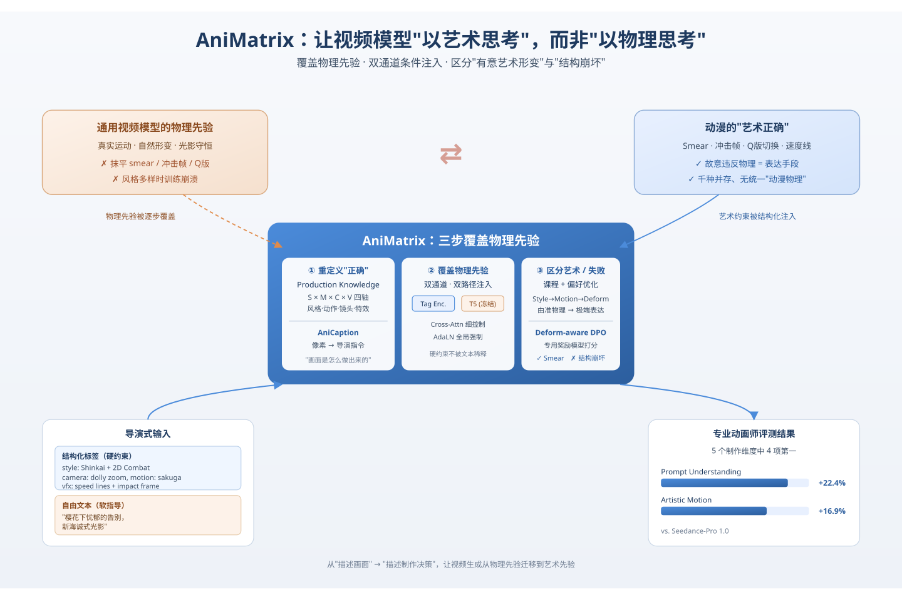
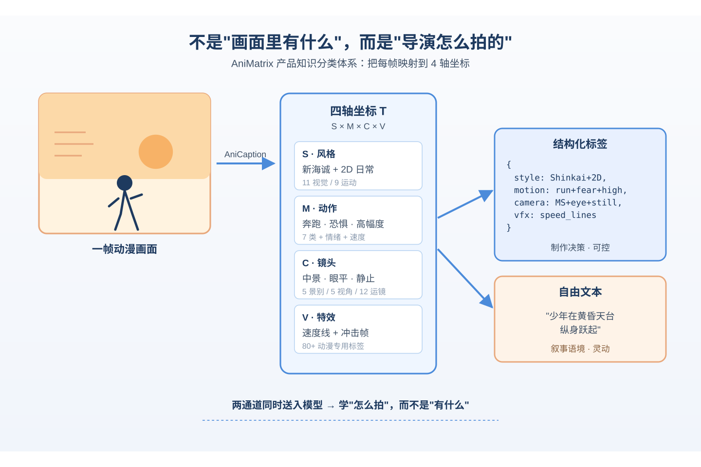
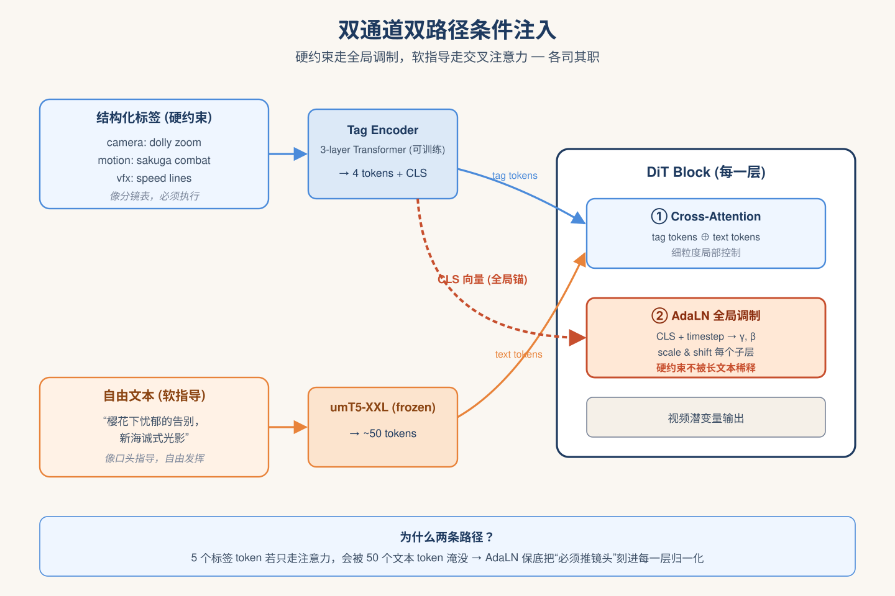
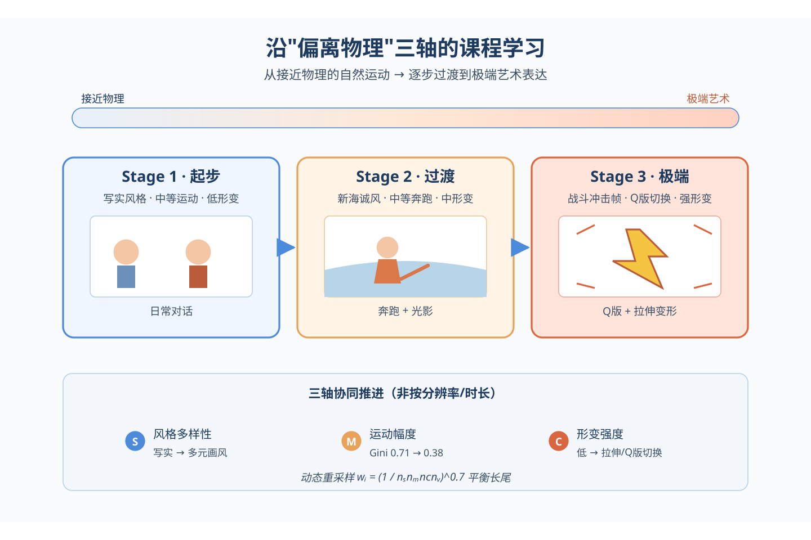
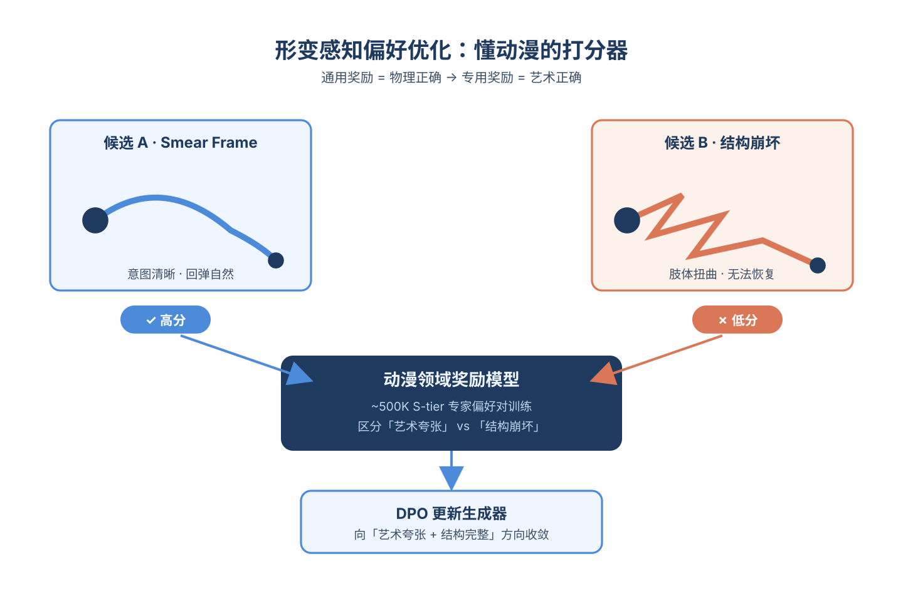

# 2026-05-06 论文日报

## 一、今日趋势与创新观察

### 1. 趋势概况

- 今天全量346篇论文中cs.AI 186篇、cs.LG 121篇，LLM与语言理解主题仍覆盖138篇，研究重心延续在大模型能力与应用落地。
- Agent与多智能体方向有64篇，今天集中讨论多智能体协调架构、分层记忆、工具执行可靠性，以及智能体在网络安全、无人机群等高风险场景的闭环控制。
- 检索排序方向112篇中，生成式POI检索、RAG证据充分性验证（SURE-RAG）、面向Agent的推理型检索评测同时出现，显示检索研究从相似度匹配进一步向生成式、可验证方向迁移。
- 迁移学习与跨域泛化61篇，KV-cache量化/搬运（QKVShare、HeadQ）与跨域稠密检索构成今天比较突出的系统向子方向。

### 2. 推荐系统 / 排序相关创新点

- 腾讯《Revisiting General Map Search via Generative POI Retrieval》把地图搜索中模糊query下的召回改造成生成式POI检索，与电商/广告中的生成式召回同构，值得关注在大规模稀疏ID库上的工业落地细节。
- SURE-RAG提出基于充分性与不确定性判定的选择性检索，让RAG从"总是检索"变为"按需检索"，思路可迁移到广告召回中的触发/跳过决策。
- 《Rethinking Reasoning-Intensive Retrieval》面向Agentic Search系统重新评测检索器，指出推理型query下传统稠密检索表现显著下滑，为Agent时代的检索/排序评测提供新基准。

### 3. 全局创新点

- MEMSAD首次把检索增强Agent的持久记忆投毒攻击形式化为Stackelberg博弈，并提出梯度耦合的异常检测，把RAG安全从"内容过滤"推进到"记忆层攻防建模"。
- MOSAIC-Bench揭示编码Agent在逐条prompt安全审查下通过的任务分解序列，仍可组合出可利用漏洞，提出"组合式脆弱性诱导"作为新的安全评测维度。
- QKVShare针对端侧多Agent提出量化KV-cache切换协议，用token级混合精度+自包含结构替代re-prefill或全精度传输，为多智能体端侧协作提供可落地的系统层原语。

### 4. 跨论文综合观察

- 生成式POI检索、SURE-RAG与Agentic检索评测实际上在回答同一个问题——当query模糊或需要推理时，传统相似度检索失效，今天的多篇论文分别从生成式召回、触发决策、评测基准三个层面给出回应。
- MEMSAD、MOSAIC-Bench与Stable Agentic Control方向一致：Agent时代的安全问题从单轮prompt注入上升到"记忆层"和"任务组合层"，说明安全研究正与Agent架构研究耦合，而非单独的内容审核问题。
- QKVShare、HeadQ与多智能体协调层论文共同指向一个工程趋势：多Agent系统的瓶颈正从模型能力转向上下文/KV的高效传递与协调架构设计，这与检索/记忆层研究在系统侧形成互补。

## 二、今日论文总览

### 1. AniMatrix: An Anime Video Generation Model that Thinks in Art, Not Physics
- 挑选理由：动漫视频生成，与广告链路无关

## 三、补充关注

1. **Revisiting General Map Search via Generative Point-of-Interest Retrieval**
   - 理由：腾讯地图工业级POI生成式检索，与商业化搜索有一定同构性，但非广告排序/出价链路。

## 四、重点论文精读

### 1. AniMatrix: An Anime Video Generation Model that Thinks in Art, Not Physics
- **为什么值得看：** 腾讯动漫视频生成，双通道条件控制思路可迁移到广告创意生成
- **背景：** 主流视频生成模型（Sora、HunyuanVideo、Wan等）都把物理真实性当成隐式先验，但动漫恰恰故意违背物理——拉伸变形、冲击帧、Q版切换都是艺术手段而非错误。单纯在通用模型上微调会抹平动漫风格，强行塞入多样动漫数据又会训练崩溃。AniMatrix想回答一个关键问题：怎么让模型从追求'物理正确'转向追求'艺术正确'。

*图示：这是腾讯HY团队的动漫视频生成模型，虽然不是广告论文，但其'结构化标签+自由文本'双通道条件注入机制、产品知识分类体系和偏好优化方法，对广告创意素材生成、可控视频广告制作都有直接借鉴价值。*

**核心技术点：**

#### 技术点 1：产品知识分类体系
- 快速理解：把动漫拆成风格×动作×镜头×特效四个可控维度

*图示：传统caption是在描述'画面里有什么'，而这套体系描述的是'这个画面是怎么被导演做出来的'。比如一个奔跑画面，普通标注只会说'女孩在跑'，但这里会记录：风格是新海诚+2D日常、动作是恐惧中奔跑+高幅度、镜头是中景+眼平+静止、特效是速度线。这样模型学到的是制作决策而非观察结果。*

- 技术细节：作者构建了一个四轴正交分类空间T = S×M×C×V：风格（11种视觉+9种运动风格标签）、动作（7类动作+情绪+幅度+速度）、镜头（5种景别+5种视角+12种运镜）、特效（80+动漫专用特效标签如速度线、冲击帧、Q版）。每个片段被映射到这个空间的一个坐标，然后由AniCaption模型从像素反推出坐标并生成导演指令式的文本描述。
- 通俗讲解：传统caption是在描述'画面里有什么'，而这套体系描述的是'这个画面是怎么被导演做出来的'。比如一个奔跑画面，普通标注只会说'女孩在跑'，但这里会记录：风格是新海诚+2D日常、动作是恐惧中奔跑+高幅度、镜头是中景+眼平+静止、特效是速度线。这样模型学到的是制作决策而非观察结果。
- 例子：对一个角色跳跃镜头，系统输出JSON结构化标签(style: Shinkai+2D Combat, motion: jump+excitement+high, camera: MS+low angle+tracking, vfx: speed lines+impact frame)，加上自由文本'少年在黄昏天台纵身跃起'，两者一起送入模型。

#### 技术点 2：双通道双路径条件注入
- 快速理解：结构化标签走可训练编码器+AdaLN，自由文本走冻结T5+交叉注意力

*图示：核心动机是：类别性的硬约束（必须是close-up）和开放性的软指导（忧郁氛围）不能塞进同一个编码器，否则模型不知道哪些必须严格遵守、哪些可以自由发挥。类似导演工作流——分镜表是硬约束、口头指导是软提示。标签只有几个token，如果只走交叉注意力会被几十个文本token淹没，所以再加一条AdaLN路径把'必须是沙鲁加战斗+推镜头'这种硬约束直接注入每一层的归一化层。*

- 技术细节：标签通道用一个3层Transformer标签编码器，每个标签用'字段embedding+取值embedding'相加表示（保留正交结构），输出序列表示和一个CLS全局向量。文本通道保留冻结的umT5-XXL。注入时走两条路径：路径1把标签序列和文本序列拼起来走交叉注意力做细粒度控制；路径2把标签CLS向量通过AdaLN在每一层每个子层做全局调制（scale和shift），保证全局制作属性不被长文本稀释。
- 通俗讲解：核心动机是：类别性的硬约束（必须是close-up）和开放性的软指导（忧郁氛围）不能塞进同一个编码器，否则模型不知道哪些必须严格遵守、哪些可以自由发挥。类似导演工作流——分镜表是硬约束、口头指导是软提示。标签只有几个token，如果只走交叉注意力会被几十个文本token淹没，所以再加一条AdaLN路径把'必须是沙鲁加战斗+推镜头'这种硬约束直接注入每一层的归一化层。
- 例子：用户输入标签(camera: dolly zoom, motion: sakuga combat, vfx: speed lines)和文本'樱花下忧郁的告别，新海诚式光影'。标签通过可训练编码器得到4个标签token+1个CLS；文本通过冻结T5得到~50个token。两组token拼接走cross-attention做局部控制，CLS向量和timestep融合后在每个DiT block生成γ和β做AdaLN调制，保证'dolly zoom'这个指令在每一层都被强制执行。

#### 技术点 3：风格-动作-形变课程学习
- 快速理解：沿着'偏离物理的程度'逐步训练，避免物理先验和极端动漫之间直接对撞崩溃

*图示：如果一上来就让物理先验模型学挤压拉伸+高速战斗+多样化风格，三个极端维度同时冲击会导致早期训练崩溃。课程学习相当于先让模型学'稍微夸张一点的动作'，再慢慢推到'Q版突然切换'这种极端变形，给物理先验一个逐渐被覆盖的迁移路径。*

- 技术细节：常规课程学习是按分辨率或时长排序，这里改为沿着三个'偏离物理'的轴组织：风格多样性、运动幅度、形变强度。训练从接近物理的自然运动开始，逐步过渡到极端艺术表达。此外用动态重采样权重wi = (1/(ns·nm·nc·nv)) α (α=0.7)平衡长尾，把Motion轴Gini系数从0.71降到0.38。
- 通俗讲解：如果一上来就让物理先验模型学挤压拉伸+高速战斗+多样化风格，三个极端维度同时冲击会导致早期训练崩溃。课程学习相当于先让模型学'稍微夸张一点的动作'，再慢慢推到'Q版突然切换'这种极端变形，给物理先验一个逐渐被覆盖的迁移路径。
- 例子：训练第一阶段喂入风格接近写实、运动幅度中等、形变强度低的片段（如日常对话）；中间阶段加入新海诚风格+中等奔跑；最后阶段才训练沙鲁加战斗+Q版切换+强形变。

#### 技术点 4：形变感知偏好优化
- 快速理解：用专用奖励模型区分'故意艺术夸张'和'病态结构崩塌'

*图示：FVD、CLIP score这些通用指标对动漫是反指标——越像物理越高分，但动漫恰恰需要违反物理。所以需要一个懂动漫的打分器，知道什么样的变形是风格、什么样的变形是bug。这个打分器提供偏好对的排序，通过DPO让生成器学会往'艺术夸张但结构完整'的方向走。*

- 技术细节：在DPO框架下，用一个在专家标注的动漫偏好对上训练的领域奖励模型，代替通用的物理真实性奖励。通用reward model会把smear frame、冲击帧、Q版切换都判定为失败，而这个专用模型学会了区分'有意的艺术夸张'和'角色结构崩坏'。训练数据来自S-tier专家验证的~500K片段。
- 通俗讲解：FVD、CLIP score这些通用指标对动漫是反指标——越像物理越高分，但动漫恰恰需要违反物理。所以需要一个懂动漫的打分器，知道什么样的变形是风格、什么样的变形是bug。这个打分器提供偏好对的排序，通过DPO让生成器学会往'艺术夸张但结构完整'的方向走。
- 例子：两个候选片段都有角色四肢夸张拉伸：A是标准smear frame（意图清晰、回弹自然），B是肢体扭曲后无法恢复（结构崩塌）。通用奖励模型可能都给低分，专用奖励模型给A高分给B低分，DPO据此更新参数。

- **对广告的启发：** 双通道条件控制可用于广告创意视频：硬性品牌约束走标签，创意文案走自由文本
- **适用边界：** 方法严重依赖一个封闭可枚举的制作分类体系和大规模领域专家标注（约500K S-tier片段），在分类边界模糊或专家稀缺的垂类难以复现；评估也改用人工评分替代自动指标，难以快速迭代。
- **实践建议：** 做广告AIGC视频时，不要把品牌硬约束和创意描述塞进同一个prompt；可以尝试把结构化元素（品牌元素、景别、必现时长、合规词）走独立的tag encoder+AdaLN注入，创意文案走常规文本编码器，观察硬约束遵循率提升。
