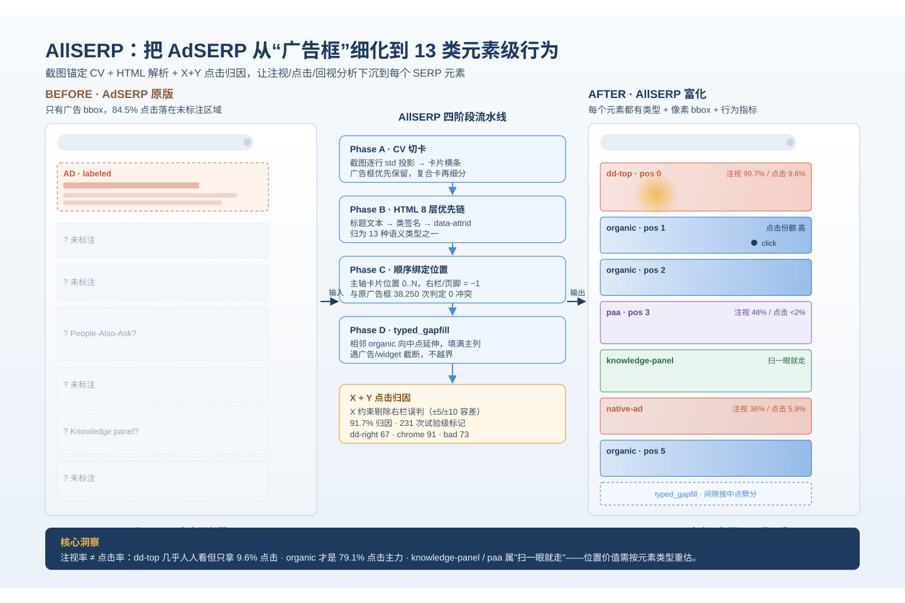
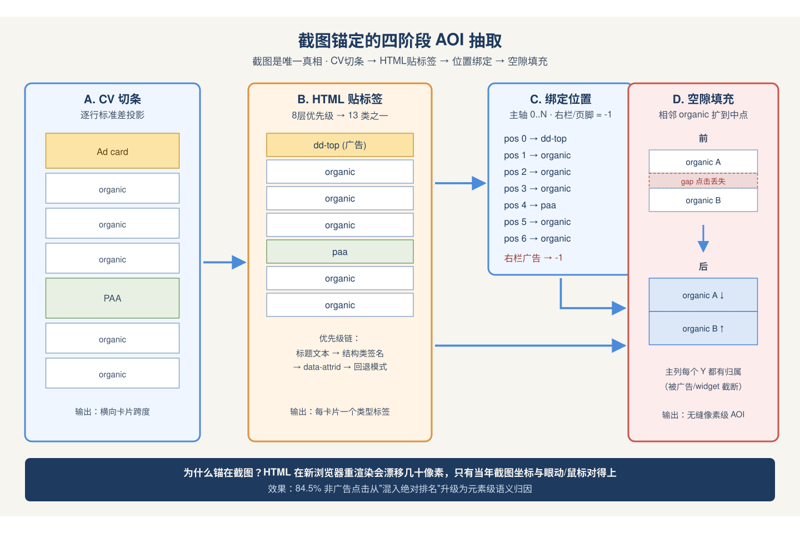
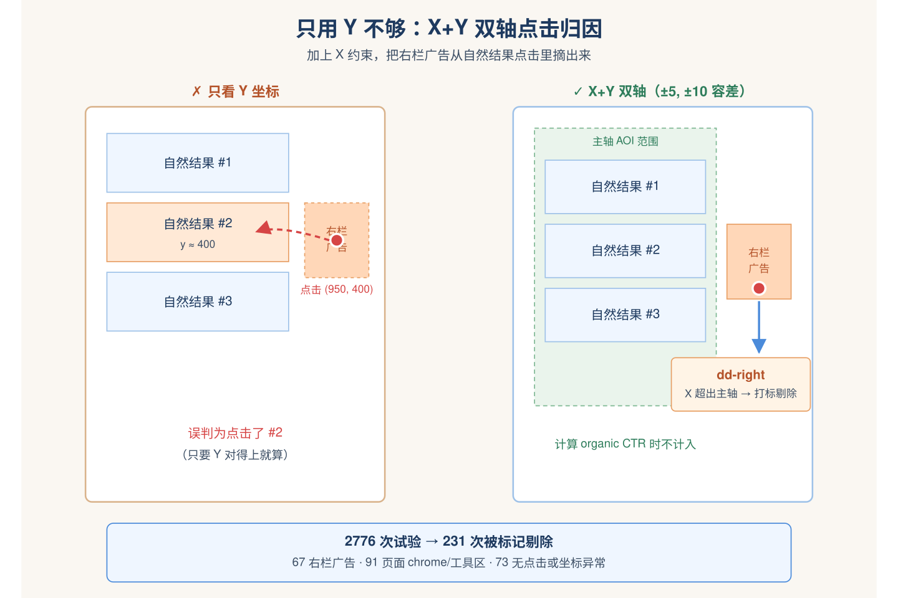
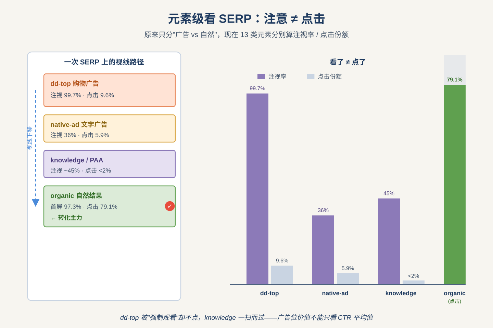
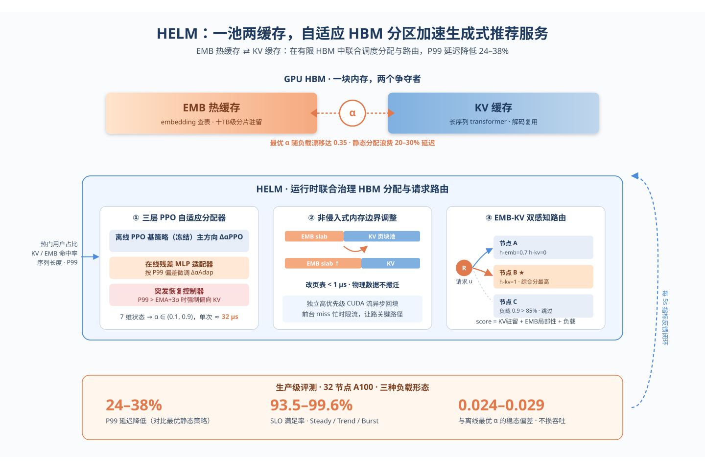
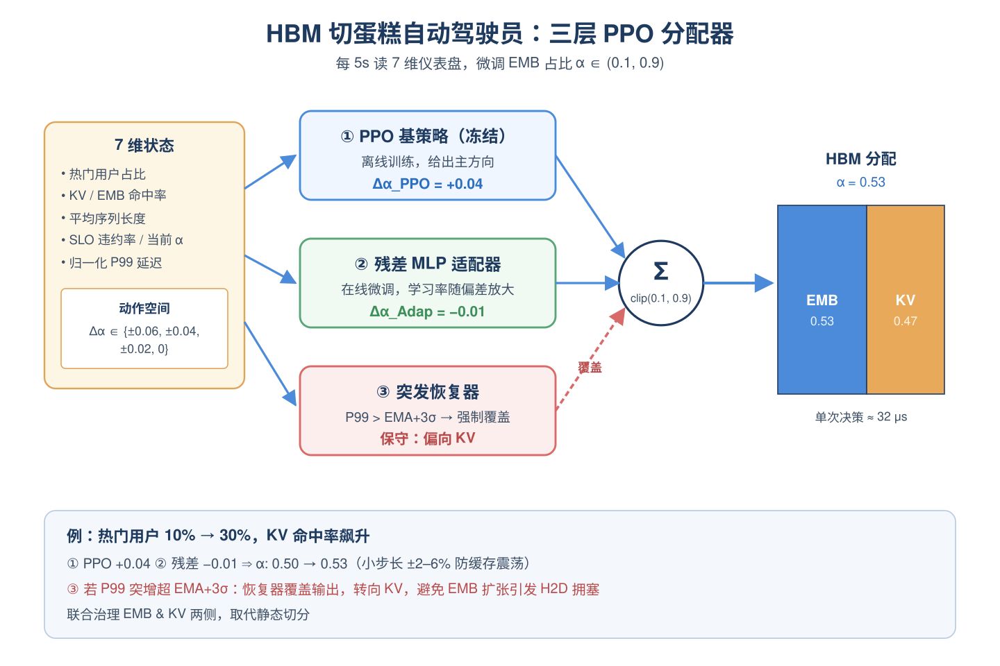
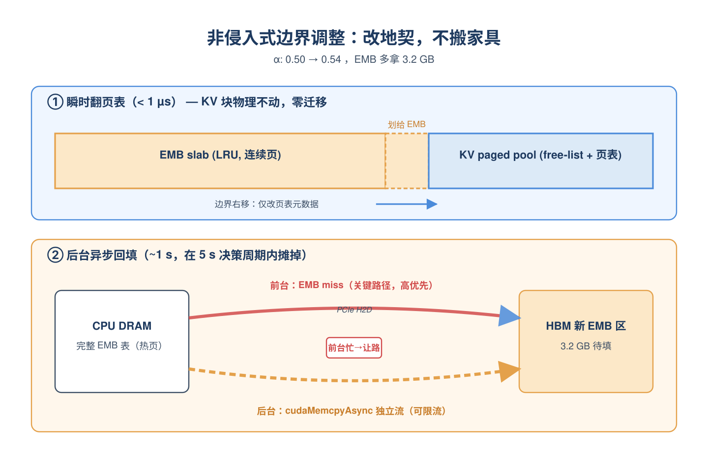
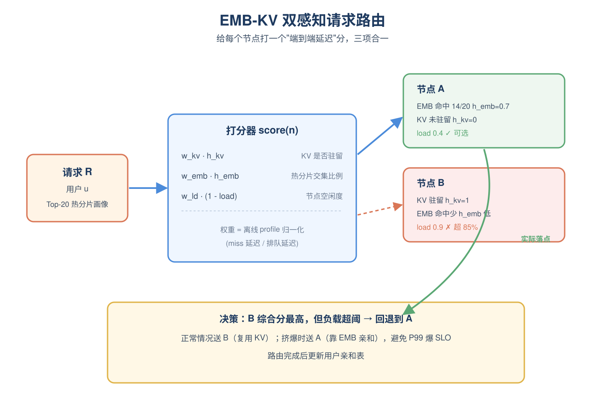

# 2026-05-07 论文日报

## 一、今日趋势与创新观察

### 1. 趋势概况

- 今天全量392篇论文中cs.AI占186篇、cs.LG 159篇，LLM与语言理解主题覆盖159篇，研究重心仍围绕大模型能力、对齐与落地展开。
- 表示学习与检索排序111篇，亮点集中在生成式推荐的语义ID、序列推荐结构改造以及LLM推荐的list-wise对齐，同时出现端侧LLM做用户意图理解的工业落地工作。
- Agent与多智能体44篇，今天明显向运行时安全、工具调用拦截、红队评测、漏洞推理等可信方向聚拢，而不再只谈能力上限。
- LLM推理系统层出现多篇KV Cache排队论、HBM分区、子空间量化、扩散LLM自适应长度等工作，显示服务化成本与稳定性是今天一条隐线。

### 2. 推荐系统 / 排序相关创新点

- CapsID针对生成式推荐tokenizer瓶颈，用软路由的变长语义ID取代每层硬最近邻RVQ，缓解多义物品被坍缩的问题。
- One Pool, Two Caches把生成式推荐serving中embedding热缓存与KV缓存视为竞争者，用自适应HBM分区在线调度最佳占比，直接对应大规模推荐/广告在线服务的资源调度难题。
- Beyond Static Best-of-N提出Bayesian list-wise对齐，让LLM4Rec跳出token级目标，直接优化NDCG、公平性等列表级不可微指标。

### 3. 全局创新点

- Text Corpora as Concept Fields把语料建模成句向量空间中的局部漂移场，用ζ分数黑盒度量句子转移的幻觉与新颖性，给不可访问内部状态的模型提供了统一的评估手段。
- FASQ提出免校准的子空间量化，突破传统标量量化只有离散比特点的限制，为LLM在商用GPU上的灵活压缩提供了连续压缩曲线。
- DecodingTrust-Agent Platform构建了一个可控、交互式的Agent红队平台，把工具调用安全从事后benchmark推向运行时可干预的评测基础设施。

### 4. 跨论文综合观察

- CapsID、Rethinking CNN for Sequential Rec、Beyond Static Best-of-N三篇从tokenizer、序列骨干、训练目标三个层面分别重塑推荐链路，共同指向'生成式/LLM推荐各环节都值得重新设计'这条主线。
- RecGPT-Mobile把LLM下沉到端侧做意图预测，One Pool Two Caches优化云侧生成式推荐的HBM占用，两者一端一云地回应同一个问题——大模型推荐如何在真实服务成本下跑起来。
- AgentTrust、DTap、COM漏洞推理等工作与Agent能力类论文形成张力：当多智能体方向继续扩能力边界时，今天同样密集出现的运行时拦截与红队评测在提醒工具调用的安全缺口正在被放大。

## 二、今日论文总览

### 1. AllSERP: Exhaustive Per-Element Enrichment of the Versatile AdSERP Dataset
- 挑选理由：广告SERP数据集的增强，包含广告与自然结果点击行为标注，直接服务于搜索广告研究

### 2. One Pool, Two Caches: Adaptive HBM Partitioning for Accelerating Generative Recommender Serving
- 挑选理由：生成式推荐serving的HBM资源调度优化，与大规模推荐/广告在线服务系统高度同构

### 3. RecGPT-Mobile: On-Device Large Language Models for User Intent Understanding in Taobao Feed Recommendation
- 挑选理由：淘宝Feed推荐端侧LLM做意图理解和next-query预测，属于电商商业化分发链路

### 4. Text Corpora as Concept Fields: Black-Box Hallucination and Novelty Measurement
- 挑选理由：文本幻觉与新颖性检测，非广告方向

### 5. HeterSEED: Semantics-Structure Decoupling for Heterogeneous Graph Learning under Heterophily
- 挑选理由：通用异构图神经网络方法，与广告商业化链路无关。

### 6. ARMATA: Auto-Regressive Multi-Agent Task Assignment
- 挑选理由：多agent任务分配路由规划，与广告分发链路无关

### 7. FASQ: Flexible Accelerated Subspace Quantization for Calibration-Free LLM Compression
- 挑选理由：LLM量化压缩，与广告系统无直接关系。

## 三、补充关注

1. **CapsID: Soft-Routed Variable-Length Semantic IDs for Generative Recommendation**
   - 理由：生成式推荐的语义ID tokenizer改进，与排序召回有同构性但未涉及广告决策链路

## 四、重点论文精读

### 1. AllSERP: Exhaustive Per-Element Enrichment of the Versatile AdSERP Dataset
- **为什么值得看：** 把AdSERP商业意图SERP的眼动+鼠标数据从只标广告扩展到每个元素
- **背景：** AdSERP是目前唯一一个公开的、规模达2776次试验、在真实Google商业意图SERP上同时采集眼动（150Hz）、鼠标轨迹、滚动、瞳孔信号的数据集，但它只给广告位标了bbox，剩下约84.5%的点击落在自然结果、知识面板、People-Also-Ask等没有类型标注的区域，导致以往研究要么把广告和自然结果混在一起按'绝对排名'分析，要么用h3标题数量粗略估自然结果几何位置。AllSERP用CV+HTML解析给每个元素补齐了像素级bbox和13种语义类型，把分析粒度从'广告vs自然'细化到元素级，对搜索广告的点击归因和注意力建模都是基础设施性质的升级。

*图示：这篇是对AdSERP搜索结果页行为数据集的增强：原数据集只标了广告框（占15.5%点击），新版本把自然结果、知识面板、PAA、图片包等13类元素都加上了像素级框和语义类型，使得广告vs自然结果的注视、点击、回视行为可以在元素粒度上分析，对研究搜索广告的点击归因、注意力建模、位置价值评估都有直接价值。*

**核心技术点：**

#### 技术点 1：截图锚定的四阶段AOI抽取
- 快速理解：用截图做坐标基准而不是重渲染HTML，避免三年后浏览器渲染漂移13-45像素

*图示：直觉上，保存下来的2022-2023年HTML在2026年浏览器里重渲染会有十几到几十像素的偏移，而原始的眼动和鼠标坐标是按当年截图记录的，所以用截图作为'唯一真相'才靠谱。一次抽取的流程是：先在截图上用CV找出横向的一行行卡片边界，再翻HTML给每个卡片贴类型标签，按顺序配对起来，最后把自然结果之间的空隙填满以便点击归因。*

- 技术细节：Phase A在主列做逐行标准差投影切出卡片跨度，遇到广告框优先保留，复合卡片（图片包/PAA/头条故事）再做内部细分；Phase B走HTML用8层优先级链（标题文本变成结构类签名变成data-attrid变成结构回退模式）给每个卡片打13种类型之一；Phase C按文档顺序把类型标签和几何位置绑定（主轴卡片给位置0到N，右栏和页脚给-1）；Phase D做gap-fill，把相邻两个自然结果的bbox各自延伸到中点，让主列每个Y坐标都归属某个bbox，但被广告或widget截断。
- 通俗讲解：直觉上，保存下来的2022-2023年HTML在2026年浏览器里重渲染会有十几到几十像素的偏移，而原始的眼动和鼠标坐标是按当年截图记录的，所以用截图作为'唯一真相'才靠谱。一次抽取的流程是：先在截图上用CV找出横向的一行行卡片边界，再翻HTML给每个卡片贴类型标签，按顺序配对起来，最后把自然结果之间的空隙填满以便点击归因。
- 例子：比如一个SERP顶部是个购物广告（dd-top），下面接3个自然结果、一个People-Also-Ask、再3个自然结果。CV会切出7-8个横条，HTML解析器依次标成dd-top/organic/organic/organic/paa/organic/...，Phase C给它们分配位置0到6，Phase D让相邻两个organic之间的空隙按中点劈开各归一半，这样用户点在两个结果之间的间隙也能正确归到上面那条。

#### 技术点 2：X+Y点击归因与试验级过滤
- 快速理解：只按Y归因会把右栏广告误判到主列，加X约束后91.7%点击能归到主轴元素

*图示：只看Y坐标的话，用户点右栏广告时Y值和左边某个自然结果一样，就会被错判成点了那个自然结果。加上X约束后，右栏和页面边缘的点击会被明确识别并拎出来打标签，让分析者自己决定是否要剔除。*

- 技术细节：点击归因要求X和Y都落在某个主轴AOI内，带±5像素X、±10像素Y的小容差处理链接padding点击；is-main-axis-click函数用于判断一次试验的最终点击是否落在主轴AOI里。对2776次试验跑完后有231次被打上试验级标记：67次落在右栏广告、91次落在页面chrome或搜索工具区、73次无点击或点击坐标病态，做点击率特征时应丢弃这些试验。
- 通俗讲解：只看Y坐标的话，用户点右栏广告时Y值和左边某个自然结果一样，就会被错判成点了那个自然结果。加上X约束后，右栏和页面边缘的点击会被明确识别并拎出来打标签，让分析者自己决定是否要剔除。
- 例子：假设用户在某试验最后点了右侧栏的一个广告，坐标(x=950, y=400)，左边Y=400位置正好有一个自然结果位置2。只按Y会错判成点击了位置2的organic，但X=950不在主列(比如0-700像素)范围内，系统会给这条试验打上dd-right标记并在计算组织结果点击率时排除它。

#### 技术点 3：元素级行为统计揭示注意-点击分离
- 快速理解：dd\_top广告99.7%被注视但只拿到9.6%点击，细粒度暴露'看了不点'模式

*图示：以前用'广告vs自然结果'两分法只能说'广告总体拿的点击比注意少'，现在能具体说dd-top这种顶部购物广告和native-ad文字广告的'看了不点'程度不一样、知识面板基本是'扫一眼就走'、自然结果才是真正的转化主力，这对广告出价和版位价值评估的颗粒度都更细。*

- 技术细节：论文给出9种主轴元素类型的描述性指标：注视率（在该类型AOI上是否有注视）、点击份额（占2634次gap-fill归因点击的比例）、回视率（注视子集中发生回视的比例）、首屏占比。关键数字：organic占97.3%首屏、79.1%点击；dd-top首屏57%、注视率99.7%但只有9.6%点击；native-ad注视36.4%、点击5.9%；knowledge-panel和paa注视率40-48%但点击都低于2%。
- 通俗讲解：以前用'广告vs自然结果'两分法只能说'广告总体拿的点击比注意少'，现在能具体说dd-top这种顶部购物广告和native-ad文字广告的'看了不点'程度不一样、知识面板基本是'扫一眼就走'、自然结果才是真正的转化主力，这对广告出价和版位价值评估的颗粒度都更细。
- 例子：在同一个SERP上，用户先被顶部的dd-top广告吸引（几乎100%概率看一眼），平均注视几百毫秒后视线下移，扫过知识面板（约49%概率停留），最后在位置1-2的organic上点击。元素级统计能把这条路径上每一步的注视停留时间、回视次数、是否点击分别算出来，而不是只告诉你'广告整体CTR=X%'。

- **对广告的启发：** 给广告位价值评估提供元素级注视-点击数据，可用于校准版位定价和注意力模型
- **适用边界：** 数据是pre-SGE/AI Overviews快照，对当前带AI概览的SERP需要扩展新元素类型；Phase D的中点劈分是启发式而非DOM真值，相邻自然结果间5-60像素范围内存在归因误差；强制单击任务不覆盖查询改写和放弃场景。
- **实践建议：** 做搜索广告点击模型或位置价值分析的同学可以下载这个数据集，把你们线上的'广告vs自然'双标签扩展到元素级（dd\_top/native\_ad/knowledge\_panel等），重新跑一遍点击模型看看不同广告样式的注视-点击转化效率差异，特别是评估邻近widget（知识面板、PAA）对广告CTR的挤出效应。

### 2. One Pool, Two Caches: Adaptive HBM Partitioning for Accelerating Generative Recommender Serving
- **为什么值得看：** 生成式推荐serving里HBM在EMB和KV缓存间动态分配，与广告大模型在线服务资源调度高度同构
- **背景：** 生成式推荐模型（以Meta HSTU为代表）推理分两步：先查巨大的embedding表（几十到几百TB，分片在CPU DRAM），再跑长序列transformer并复用KV缓存。这两者都要放进有限的GPU HBM，形成直接竞争——多给EMB则KV算得多、少给EMB则查表慢。作者通过生产trace发现最优分配比会随序列长度、热门用户比例等漂移多达0.35，静态分配留下20-30%延迟空间；而天真地在线调整又会在关键PCIe路径上制造H2D搬运流量，打爆P99 SLO。现有系统要么只优化EMB侧（预取、分片），要么只优化KV侧（压缩、复用），从未联合治理，因此值得看。

*图示：论文揭示了生成式推荐（HSTU）serving中一个广告serving也会遇到的核心矛盾：同一块GPU HBM要同时放热门embedding缓存和KV缓存，二者此消彼长，静态分配会留下20-30%的延迟空间。它给出的'在线PPO调控+非侵入式内存搬迁+双感知路由'三件套，对广告大模型/生成式广告排序的serving资源管理有直接迁移价值。*

**核心技术点：**

#### 技术点 1：三层PPO自适应分配器
- 快速理解：用冻结PPO+在线残差+突发恢复三层控制器，每5秒决定EMB与KV的HBM切分比

*图示：可以把它想成一个'HBM切蛋糕'的自动驾驶员：离线学了个稳妥的大方向，在线时根据最近几秒的命中率和延迟做小幅修正，遇到突发流量再触发应急预案。每5秒它读一次系统仪表盘（7个指标），加减2%-6%的EMB占比，而不是一次大改，避免缓存震荡。*

- 技术细节：把'每个决策周期选择EMB占比α'建模成MDP：状态是7维向量（热门用户占比、KV命中率、EMB命中率、平均序列长度、SLO违约率、当前α、归一化P99延迟），动作是离散增量(±0.06, ±0.04, ±0.02, 0)，奖励=SLO满足率 - λ·max(0, P99-SLO阈值)。控制器由三部分组成：离线训练后冻结的PPO基策略给出主方向ΔαPPO；一个很小的3层MLP在线残差适配器根据最近数据做微调ΔαAdap，其学习率按'当前P99与EMA偏差'自适应放大；突发恢复器监测P99超出EMA+3σ时强制覆盖输出，在热门用户比例高时把内存偏向KV。最终α限制在（0.1,0.9），单次决策约32微秒。
- 通俗讲解：可以把它想成一个'HBM切蛋糕'的自动驾驶员：离线学了个稳妥的大方向，在线时根据最近几秒的命中率和延迟做小幅修正，遇到突发流量再触发应急预案。每5秒它读一次系统仪表盘（7个指标），加减2%-6%的EMB占比，而不是一次大改，避免缓存震荡。
- 例子：比如当前α=0.5，突然热门用户比例从10%涨到30%、KV命中率飙升，PPO建议+0.04，残差适配器再微调-0.01，最终α变成0.53；如果此时P99突然超过EMA+3σ，恢复器直接覆盖为'向KV倾斜'的保守值，避免EMB扩张引发H2D拥塞。

#### 技术点 2：非侵入式内存边界调整
- 快速理解：只动EMB边界、不搬KV块，用独立高优先级CUDA流在后台按带宽限流回填

*图示：核心直觉是'改地契不搬家具'：逻辑边界挪动只是改页表，瞬间完成；真正要把新划出来的HBM填满有用数据这件耗带宽的事，单开一条后台车道慢慢做，还会在主路繁忙时自动让路。这样在线调整就不会和关键的embedding miss抢PCIe。*

- 技术细节：作者把两种缓存用不同数据结构管理：KV用vLLM式的分页块池（free list+页表），EMB用连续LRU slab按页分配。调整α时只通过alloc-page/free-page改页表元数据（\<1微秒），KV块物理上不动，彻底避开live KV迁移。真正的数据回填（比如4%调整对应3.2GB H2D）放到一条独立的高优先级CUDA流上异步做cudaMemcpyAsync，并根据当前EMB miss的H2D流量动态限流：关键路径忙时就压住后台回填流量。由于决策周期5秒、回填约1秒，成本被完全摊掉。
- 通俗讲解：核心直觉是'改地契不搬家具'：逻辑边界挪动只是改页表，瞬间完成；真正要把新划出来的HBM填满有用数据这件耗带宽的事，单开一条后台车道慢慢做，还会在主路繁忙时自动让路。这样在线调整就不会和关键的embedding miss抢PCIe。
- 例子：α从0.5调到0.54，EMB多拿到3.2GB空间：先瞬时把对应页从KV free list划给EMB slab（µs级）；然后后台流以受控带宽把这3.2GB热embedding从CPU搬过来，期间若检测到前台EMB miss带宽飙到10GB/s，就临时压制后台流量，整个回填在约1秒内完成，不影响当前推理的P99。

#### 技术点 3：EMB-KV双感知请求路由
- 快速理解：路由打分同时考虑KV命中、EMB热分片覆盖率和节点负载，避免单感知路由偏科

*图示：在动态分配下各节点变得'不一样'——有的EMB多、有的KV多，所以不能只看一种局部性。打分相当于估一次端到端延迟：这个用户的KV在不在、他常用的热embedding分片在不在、节点还挤不挤，三项加起来谁最划算就送谁。*

- 技术细节：每个节点维护两个轻量元数据：用户变成KV是否驻留的哈希表、当前驻留embedding分片集合；每个用户预计算Top-K（K=20）热分片画像。对请求R（用户u），对每个节点n打分score = w-kv·h-kv + w-emb·h-emb + w-ld·(1-load) + 亲和度奖励，其中h-emb是u的Top-K热分片与n驻留分片的交集比例。权重w-i由离线profile出的KV miss、EMB miss、排队延迟三项实际代价归一化得到，而不是手调。若最高分节点负载超85%，回退到最轻载节点；否则路由到最高分节点并更新用户亲和。
- 通俗讲解：在动态分配下各节点变得'不一样'——有的EMB多、有的KV多，所以不能只看一种局部性。打分相当于估一次端到端延迟：这个用户的KV在不在、他常用的热embedding分片在不在、节点还挤不挤，三项加起来谁最划算就送谁。
- 例子：用户u的Top-20热分片有14个落在节点A（h-emb=0.7），但KV在节点B（h-kv=1）；若B当前负载0.9超阈值，路由回退到A，避免排队爆SLO；正常情况下B的综合分更高，请求送B，复用KV同时A继续服务其他有EMB亲和的用户。

- **对广告的启发：** 广告大模型serving可借鉴'embedding热缓存与KV缓存联合动态切分+路由感知'的资源调度范式
- **适用边界：** 方法假设一次前向推理即可完成（GR场景），因此没做KV CPU offloading；对LLM式多轮decode或KV可跨设备迁移的场景不完全适用。另外最优分配比依赖能稳定采集到7维状态信号，若监控粒度差或流量极端稀疏，PPO+残差可能退化。
- **实践建议：** 在自家广告推理集群上先离线grid-search一次EMB/KV分配比，量化'静态最优 vs 按时间段分段最优'的P99差距；若差距\>15%，就值得上类似HELM的轻量在线控制器和双感知路由，而不是继续单独优化embedding预取或KV压缩。
