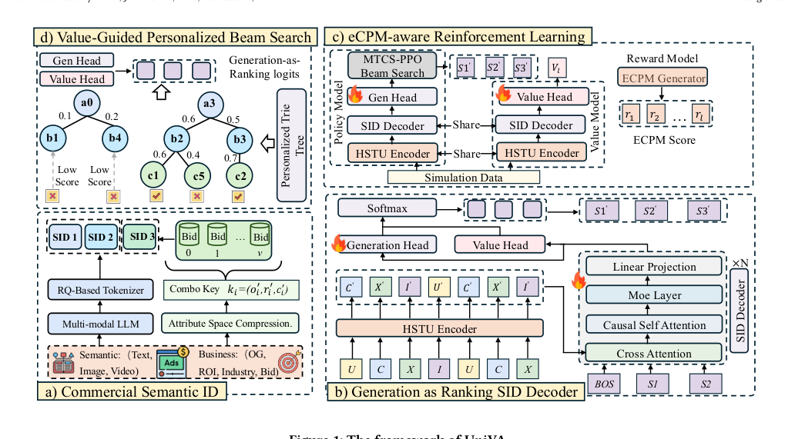
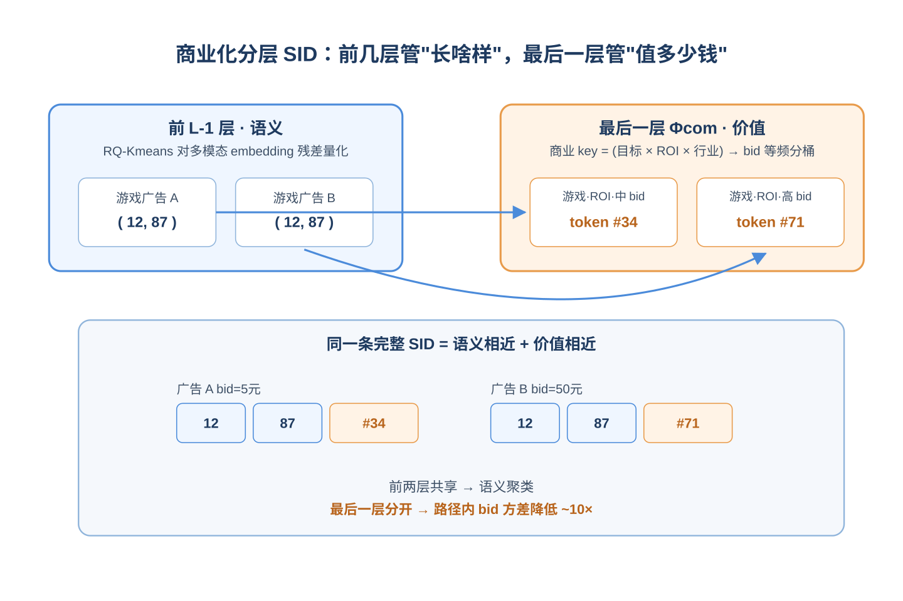
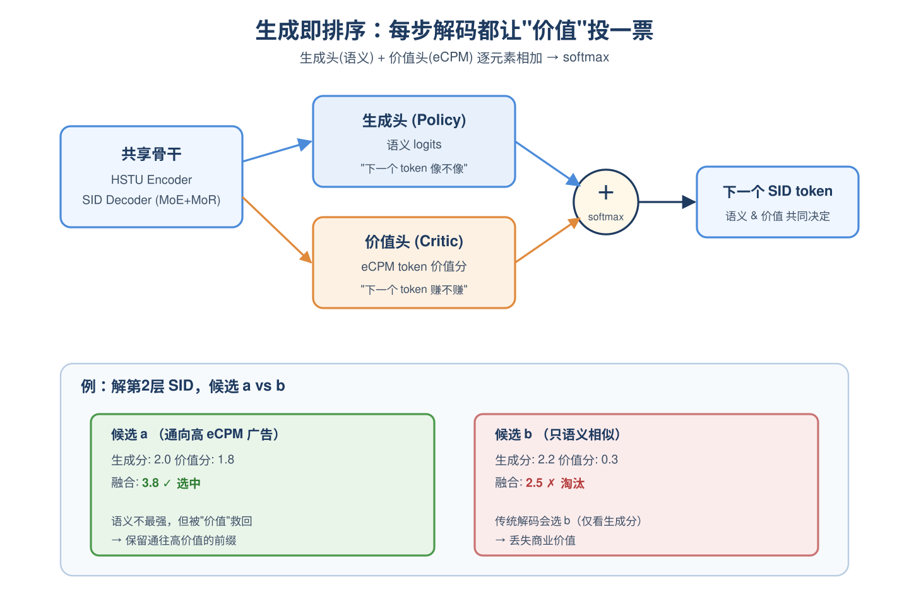
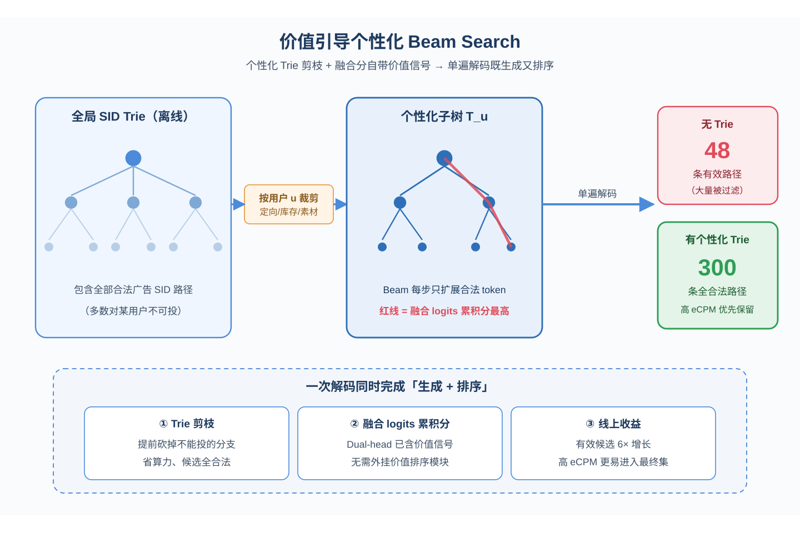
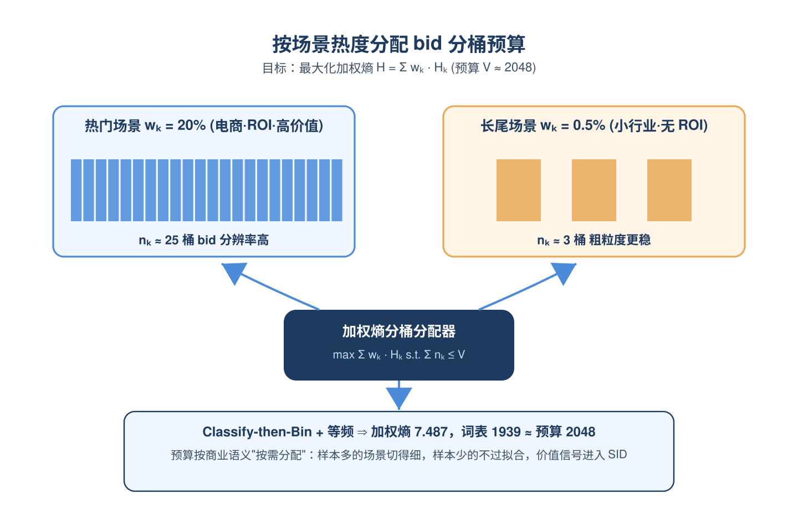
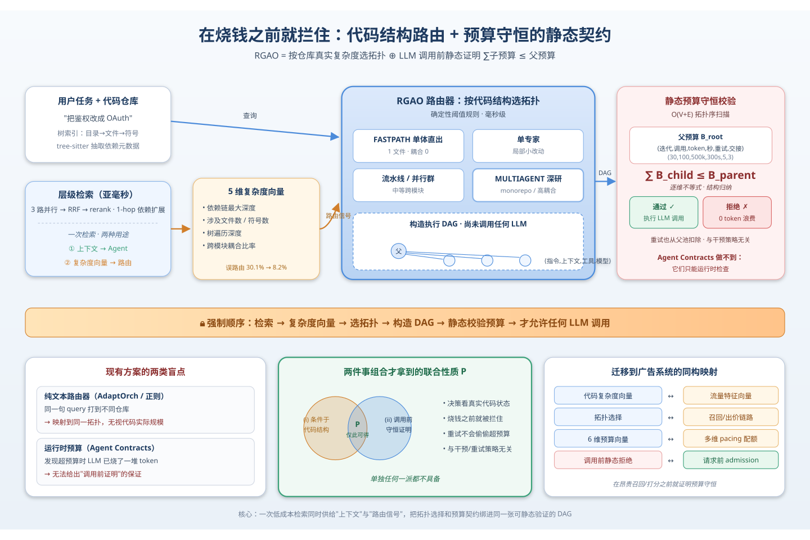
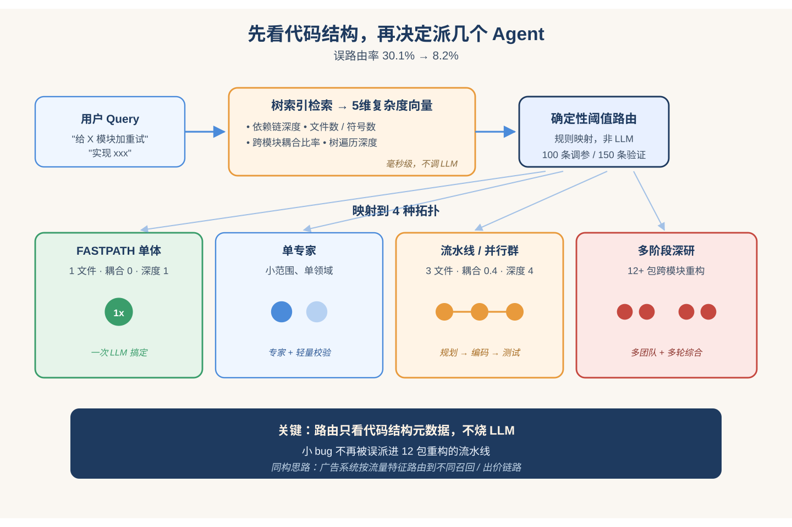
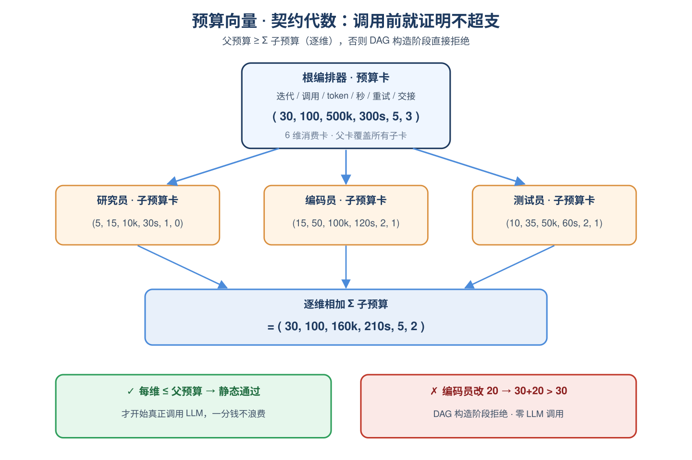
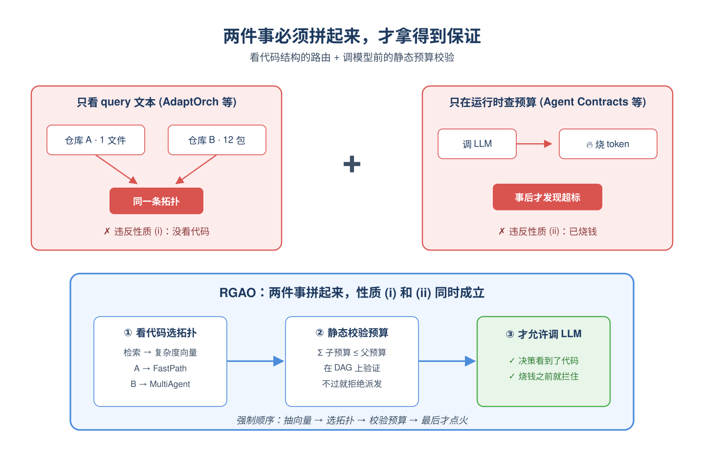
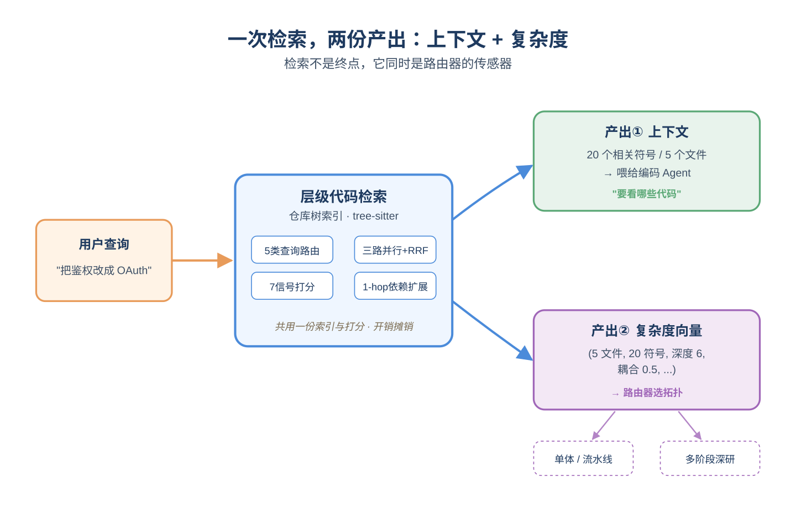

# 2026-05-08 论文日报

## 一、今日趋势与创新观察

### 1. 趋势概况

- 今天全量626篇论文中cs.AI占344篇、cs.LG 214篇、cs.CL 42篇、cs.IR 26篇，LLM与语言理解覆盖133篇，研究重心仍是大模型能力与应用落地。
- 表示学习与检索排序42篇、Agent与多智能体78篇，生成式推荐的表达力边界、RAG的事实可信度、电商搜索相关性多智能体化是密集子方向。
- 商业化决策与资源优化出现10篇集中讨论预算约束、在线资源分配、自动出价与定价风险，显示Agent工作流开始直面成本与约束问题。
- 迁移学习与跨域泛化17篇，多任务推荐的知识迁移、轨迹预测的长尾泛化、跨域标签偏移是代表性切面。

### 2. 推荐系统 / 排序相关创新点

- 《Unified Value Alignment for Generative Recommendation in Industrial Advertising》把价值对齐思路引入工业广告的生成式推荐，统一多目标而不是只堆CTR/CVR单点指标。
- 《Expressiveness Limits of Autoregressive Semantic ID Generation in Generative Recommendation》从理论角度刻画自回归Semantic ID在生成式推荐中的表达力上限，给出这一主流范式的边界诊断。
- 《On the Role of Language Representations in Auto-Bidding》系统性分析语言表征在自动出价中的作用与失效模式，为"LLM+竞价"提供了实证性的方法学参考。

### 3. 全局创新点

- 《Retrieval-Conditioned Topology Selection with Provable Budget Conservation》在多智能体代码生成中用检索条件化选择拓扑，并给出预算守恒的理论保证，把"选哪种协作结构"变成带约束的可分析问题。
- 《On Time, Within Budget: Constraint-Driven Online Resource Allocation for Agentic Workflows》把在线资源分配与约束优化引入Agent工作流调度，直接对齐延迟-预算双约束。
- 《DataDignity: Training Data Attribution for Large Language Models》把训练数据归因做到LLM规模，为数据定价、版权与数据市场提供可量化的技术底座。

### 4. 跨论文综合观察

- Unified Value Alignment、TriAlignGR与Expressiveness Limits三篇共同把生成式推荐推向"对齐+多任务+表达力边界"的系统化反思，既有工程统一方案也有理论天花板分析。
- 预算与约束成为跨场景共同语言：Topology Selection在多智能体协作中守恒预算、Online Resource Allocation在Agent工作流里调度时延预算、Inference-Time Budget Control约束搜索Agent推理开销、Auto-Bidding则直接面对竞价预算，方法论上正从"堆算力"转向"带约束优化"。
- DataDignity的训练数据归因与Attributions All the Way Down的可解释性元讨论形成互补视角：前者给出可量化的数据贡献度工具，后者则提醒归因本身可能陷入无穷回归，两者合在一起勾勒出"归因要落地也要自省"的研究张力。

## 二、今日论文总览

### 1. Unified Value Alignment for Generative Recommendation in Industrial Advertising
- 挑选理由：命中广告核心词：advertising。

### 2. Retrieval-Conditioned Topology Selection with Provable Budget Conservation for Multi-Agent Code Generation
- 挑选理由：命中广告核心词：budget。

### 3. On Time, Within Budget: Constraint-Driven Online Resource Allocation for Agentic Workflows
- 挑选理由：命中广告核心词：budget。

### 4. On the Role of Language Representations in Auto-Bidding: Findings and Implications
- 挑选理由：命中广告核心词：bidding。

### 5. Inference-Time Budget Control for LLM Search Agents
- 挑选理由：命中广告核心词：budget。

### 6. DataDignity: Training Data Attribution for Large Language Models
- 挑选理由：命中广告核心词：attribution。

### 7. Effective Knowledge Transfer for Multi-Task Recommendation Models
- 挑选理由：命中强迁移信号：recommendation, multi-task。

### 8. Light-FMP: Lightweight Feature and Model Pruning for Enhanced Deep Recommender Systems
- 挑选理由：命中强迁移信号：recommender, system。

### 9. TriAlignGR: Triangular Multitask Alignment with Multimodal Deep Interest Mining for Generative Recommendation
- 挑选理由：命中强迁移信号：recommendation, multimodal。

### 10. Dynamic Graph with Similarity-Aware Attention Graph Neural Network for Recommender Systems
- 挑选理由：命中强迁移信号：recommender, system。

### 11. DINORANKCLIP: DINOv3 Distillation and Injection for Vision-Language Pretraining with High-Order Ranking Consistency
- 挑选理由：命中强迁移信号：ranking, pretrain。

### 12. Attributions All the Way Down? The Metagame of Interpretability
- 挑选理由：可解释性元议题，与广告链路无关

## 三、补充关注

1. **Expressiveness Limits of Autoregressive Semantic ID Generation in Generative Recommendation**
   - 理由：有一定相关信号，但不足以进入正式候选：recommendation。
2. **Bridging Passive and Active: Enhancing Conversation Starter Recommendation via Active Expression Modeling**
   - 理由：有一定相关信号，但不足以进入正式候选：recommendation。
3. **Career-Aware Resume Tailoring via Multi-Source Retrieval-Augmented Generation with Provenance Tracking: A Case Study**
   - 理由：有一定相关信号，但不足以进入正式候选：retrieval。
4. **Towards Dependable Retrieval-Augmented Generation Using Factual Confidence Prediction**
   - 理由：有一定相关信号，但不足以进入正式候选：retrieval。
5. **GATHER: Convergence-Centric Hyper-Entity Retrieval for Zero-Shot Cell-Type Annotation**
   - 理由：有一定相关信号，但不足以进入正式候选：retrieval。
6. **Revisiting Uncertainty: On Evidential Learning for Partially Relevant Video Retrieval**
   - 理由：有一定相关信号，但不足以进入正式候选：retrieval。
7. **Open-SAT: LLM-Guided Query Embedding Refinement for Open-Vocabulary Object Retrieval in Satellite Imagery**
   - 理由：有一定相关信号，但不足以进入正式候选：retrieval。
8. **AdaGATE: Adaptive Gap-Aware Token-Efficient Evidence Assembly for Multi-Hop Retrieval-Augmented Generation**
   - 理由：有一定相关信号，但不足以进入正式候选：retrieval。
9. **Improved techniques for fine-tuning flow models via adjoint matching: a deterministic control pipeline**
   - 理由：有一定相关信号，但不足以进入正式候选：matching。
10. **Debiased Multimodal Personality Understanding through Dual Causal Intervention**
   - 理由：有一定相关信号，但不足以进入正式候选：debias。

## 四、重点论文精读

### 1. Unified Value Alignment for Generative Recommendation in Industrial Advertising
- **为什么值得看：** 工业级广告生成式推荐，把商业价值贯穿SID构建、解码和在线服务
- **背景：** 生成式推荐（GR）把推荐问题改写成'给每个item一个语义ID（SID），然后自回归生成下一个SID'的序列建模任务，已经在电商、内容推荐取得不错效果。但广告场景必须同时优化用户兴趣和商业变现（bid、ROI、eCPM），而现有GR方案里价值信号只是在训练阶段加个loss或者在生成后再接一个ranking模块——tokenization阶段只保语义相似、解码阶段还是按生成似然走、在线serving也主要靠语义beam搜索。作者把这种割裂叫做'价值不一致'问题，提出在SID构建、解码、在线搜索三个环节统一注入商业价值，值得做广告召回/排序的同学关注。

*图示：这是 Figure 1，标题明确为“The framework of UniVA”，且图中完整展示了论文核心方法的四个关键模块及其关系：Commercial Semantic ID、Generation as Ranking SID Decoder、Value-Guided Personalized Beam Search、eCPM-aware Reinforcement Learning。相比其他候选主要是实验图、统计图或局部结果图，这张图最直接体现模型结构、信息流和训练/推断框架，最适合作为论文主架构图。*

**核心技术点：**

#### 技术点 1：商业化SID分词
- 快速理解：SID前几层保语义相似，最后一层专门用商业属性+bid分桶做价值区分

*图示：直觉是：语义上很像的两个广告（比如都是美妆短视频），bid可能差十倍，放在同一个SID路径里会让模型学不到'价值差异'。所以前面几层用来把'长什么样'分好，最后一层专门用来把'值多少钱'分好。一个新广告进来后，先通过多模态embedding走RQ拿到前两层SID，再用它的优化目标/ROI/行业组合找到所属key，最后按bid落到该key下的某个等频桶，得到最终一层token。*

- 技术细节：采用分层混合SID：前L-1层沿用RQ-Kmeans对多模态embedding做残差量化、保留语义邻近；最后一层Φcom用'先压缩属性、再组合分桶'的方式构造。先把优化目标、ROI、行业这些稀疏属性按覆盖率压缩（比如优化目标压到25类、ROI压到8类、行业压到10类），三者组合成一个'商业上下文key'，再在每个key内部对bid做等频分桶，桶数受总词表预算约束，并通过最大化加权熵来决定每个key分几桶——样本多的key多分几个桶、样本少的合少点，保证稳定。
- 通俗讲解：直觉是：语义上很像的两个广告（比如都是美妆短视频），bid可能差十倍，放在同一个SID路径里会让模型学不到'价值差异'。所以前面几层用来把'长什么样'分好，最后一层专门用来把'值多少钱'分好。一个新广告进来后，先通过多模态embedding走RQ拿到前两层SID，再用它的优化目标/ROI/行业组合找到所属key，最后按bid落到该key下的某个等频桶，得到最终一层token。
- 例子：比如一个'游戏类+ROI目标+bid=5元'的广告，前两层SID可能和另一个游戏广告一样是(12, 87)，但第三层会落到'游戏-ROI-中bid桶'对应的token；而另一个语义相似但bid=50元的游戏广告，前两层仍是(12, 87)，第三层却落到'游戏-ROI-高bid桶'。这样同一条完整SID路径下的广告就既语义相近又价值相近，论文显示路径内bid标准差和极差降低了约一个数量级。

#### 技术点 2：生成即排序解码器
- 快速理解：解码器双头同时出生成分和价值分，逐token融合，让价值信号直接参与自回归选择

*图示：核心想法是：不要'先生成候选再排序'，而是在每一步选token的时候就让商业价值参与投票。以前自回归解码只看'这个token语义上最可能'，现在每步同时看两个分数——语义上该选哪个、价值上该选哪个，加起来再softmax。这样即使某个SID前缀语义上不是最强、但后续能通到高eCPM广告，它也不会在早期被剪掉。*

- 技术细节：共享的HSTU编码器+SID解码器（用MoE加宽度、MoR递归加深度）之上挂两个头：生成头输出下一个SID token的生成logits，价值头输出同一词表上的token级价值分。两者逐元素相加后再softmax，作为真正的下一个token分布。训练上先用监督学习让生成头学会稳定生成SID，再用eCPM-aware的PPO强化学习：把生成头当policy，价值头当critic，用离线模拟器（复刻线上候选库+pCTR/pCVR模型）生成eCPM奖励，用请求内归一化后的奖励+GAE做token级优势估计，SL和RL批次交替训练。
- 通俗讲解：核心想法是：不要'先生成候选再排序'，而是在每一步选token的时候就让商业价值参与投票。以前自回归解码只看'这个token语义上最可能'，现在每步同时看两个分数——语义上该选哪个、价值上该选哪个，加起来再softmax。这样即使某个SID前缀语义上不是最强、但后续能通到高eCPM广告，它也不会在早期被剪掉。
- 例子：假设当前要解第2层SID，生成头给候选token a的生成分是2.0、b是2.2，价值头给a的价值分是1.8、b是0.3。只看生成头会选b，但融合后a=3.8、b=2.5，解码器会选a，从而保留了通往高价值广告的前缀。训练时如果这条路径最终被模拟器打出高eCPM奖励，价值头就会进一步强化对a的偏好。

#### 技术点 3：价值引导个性化beam搜索
- 快速理解：用请求级trie树限定合法SID路径，beam分数直接用融合后的生成+价值logits

*图示：两件事合一起做：一是'别搜废路径'——个性化trie把这个用户根本不能投的广告分支提前砍掉，省算力；二是'搜的时候就带着价值偏好'——不用再等生成完再过一个排序模型，融合分本身已经包含价值信号，单遍解码既生成又排序。*

- 技术细节：离线把所有合法SID路径建成全局trie；线上来一个请求时，根据定向、库存、素材规则从全局trie裁出该请求的个性化子树T-u，beam搜索每步只在子树中的合法下一token里扩展。beam累积分直接用前面dual-head融合后的logits求和，不再额外挂一个价值排序模块。
- 通俗讲解：两件事合一起做：一是'别搜废路径'——个性化trie把这个用户根本不能投的广告分支提前砍掉，省算力；二是'搜的时候就带着价值偏好'——不用再等生成完再过一个排序模型，融合分本身已经包含价值信号，单遍解码既生成又排序。
- 例子：同样beam宽度300，不加trie只能产出48条有效SID路径（剩下大多数被定向规则过滤掉），加了个性化trie能产出300条全部合法的路径，线上6倍多的有效候选，且因为beam分自带价值信号，高eCPM广告更容易被保留到最终候选里。

#### 技术点 4：属性压缩+加权熵分桶
- 快速理解：组合key分桶时按样本量自适应分桶数，用加权熵最大化选配置

*图示：意思是：给分桶预算做分配时，哪个商业场景广告多就多切几档bid（判别更细），少的就少切（避免过拟合小样本）。用加权熵衡量'平均下来分桶是不是都被用上了'，越均衡说明词表利用越充分、价值区分越稳。*

- 技术细节：给定词表预算V，对每个商业key k选择桶数n-k（受上下界约束），目标是最大化各key加权熵之和H=求和 w-k·H-k，其中w-k是该key样本占比，H-k是该key内bid分桶的熵。这样样本密集的商业上下文能拿到更细的bid分辨率，稀疏上下文保持粗粒度更稳。论文实验对比了'直接分桶/先聚类再分桶/先分类再分桶'×'等宽/等频/聚类'六种组合，最终Classify-then-Bin+等频组合拿到最高加权熵7.487、词表1939最接近预算2048。
- 通俗讲解：意思是：给分桶预算做分配时，哪个商业场景广告多就多切几档bid（判别更细），少的就少切（避免过拟合小样本）。用加权熵衡量'平均下来分桶是不是都被用上了'，越均衡说明词表利用越充分、价值区分越稳。
- 例子：'电商-ROI-高行业'这个key样本占20%，可能分到25个bid桶；而'长尾行业-无ROI目标'这个key样本占0.5%，只分到3个桶，避免bid分布抖动。

- **对广告的启发：** 广告生成式召回想落地，必须让价值信号贯穿SID构建+解码+beam搜索三层
- **适用边界：** 适合大规模广告平台、有稳定eCPM估计pipeline和结构化商业属性的场景；如果平台候选规模小或者定向规则复杂到难以预构trie，个性化beam的收益会下降。论文没说明跨域或冷启动广告如何处理商业SID中unseen key（论文提到回退到全局bid分桶，但未细说效果）。
- **实践建议：** 可以先从最轻量的一步试起：在现有召回SID最后一层加一个'商业属性组合+bid等频分桶'的token，不动解码器也能观察HR和价值指标变化（论文显示这一步单独就带来+5.78% HR@100）。

### 2. Retrieval-Conditioned Topology Selection with Provable Budget Conservation for Multi-Agent Code Generation
- **为什么值得看：** 把'按预算投放'搬进多智能体编排，预算可静态证明不超支
- **背景：** 当前多智能体代码生成系统在接到任务时，要决定用'单体直出/单专家/流水线/多阶段深研'哪种拓扑，但路由器几乎只看查询文本（正则或query难度），根本不看被改的代码长什么样，导致一个小bug和一次跨12个包的重构走同一条流水线，浪费严重。另一方面，现有预算控制（如Agent Contracts）只能在运行中检查，等发现超预算时LLM已经被烧了一堆token。作者想同时解决这两件事：让路由条件化到代码结构，并在任何LLM调用之前就静态证明'子预算之和不会超过父预算'。

*图示：这篇论文虽然是做多智能体代码生成的，但它的核心机制——'按复杂度路由到不同拓扑+带预算向量的契约代数+在执行前静态校验预算守恒'——和广告系统里'按流量特征路由到不同出价/检索链路+预算守恒'的问题高度同构，属于强迁移论文。它给出了一种在调用昂贵模块（LLM/广告召回）之前就能证明不会超预算的工程化思路，值得广告侧借鉴。*

**核心技术点：**

#### 技术点 1：按代码结构路由拓扑
- 快速理解：先做一次检索，抽5维代码复杂度向量，再决定用哪种智能体拓扑。

*图示：直觉就是'先看看要动的代码长什么样，再决定派几个人去做'。比如一个query说'implement xxx'，正则路由看到implement就派一支多智能体队伍，但RGAO先检索发现只命中一个文件、没有跨模块依赖，于是把它降级成FASTPATH单体直出，省掉整条流水线。整个复杂度向量读取是毫秒级的，因为信息全部来自树索引的元数据，不用再跑LLM。*

- 技术细节：RGAO先在仓库的树形索引上跑一次检索，从命中子图里读出一个5维复杂度向量：最大依赖链深度、涉及文件数、符号数、树遍历深度、跨模块耦合比率（命中符号中依赖跳出本目录的比例）。然后用一组人工调过阈值的确定性规则，把向量映射到四种拓扑之一：单体直出、单专家、流水线/并行群、多阶段深研。阈值是在100条任务上调的，150条留出集上评测，误路由从30.1%降到8.2%。
- 通俗讲解：直觉就是'先看看要动的代码长什么样，再决定派几个人去做'。比如一个query说'implement xxx'，正则路由看到implement就派一支多智能体队伍，但RGAO先检索发现只命中一个文件、没有跨模块依赖，于是把它降级成FASTPATH单体直出，省掉整条流水线。整个复杂度向量读取是毫秒级的，因为信息全部来自树索引的元数据，不用再跑LLM。
- 例子：输入query'给X模块加个重试逻辑'。检索命中3个文件、依赖链深度4、跨模块耦合0.4，属于典型中等规模跨模块改动变成路由到MULTIAGENT流水线。如果命中只有1个文件、耦合0、依赖深度1，则降级到FASTPATH，一次LLM调用搞定，不再走规划-编码-测试的三段式。

#### 技术点 2：预算向量与契约代数
- 快速理解：每个子Agent有6维预算，父预算必须≥所有子预算之和，执行前静态校验。

*图示：可以把它想成给每个子任务发一个6维的'消费卡'，父卡余额必须覆盖所有子卡面额之和。和现有系统不一样的地方是：别人是边跑边扣，扣爆了才报错；这里是在派单之前就把所有卡加一遍，加超了直接拒绝执行，一个token都不会浪费。重试也从父卡池里扣，所以不会因为反复重试偷偷超预算。*

- 技术细节：每个子Agent用一个四元契约⟨指令, 上下文, 工具, 模型⟩定义，其中上下文里带一个6维预算向量：迭代数、调用数、token数、秒数、重试数、交接数。父子之间的约束是：父节点直接成本加上所有子节点预算的逐维相加，必须在每一维都不超过父预算。论文把这个写成一个'并行组合'算子，并证明了结构归纳式的守恒定理：只要每层都满足这个不等式，整棵执行树的总消耗就不会超过根预算，跟重试次数、干预策略无关。校验在DAG构造后以O(点数+边数)一次拓扑序扫描完成，发生在任何LLM调用之前。
- 通俗讲解：可以把它想成给每个子任务发一个6维的'消费卡'，父卡余额必须覆盖所有子卡面额之和。和现有系统不一样的地方是：别人是边跑边扣，扣爆了才报错；这里是在派单之前就把所有卡加一遍，加超了直接拒绝执行，一个token都不会浪费。重试也从父卡池里扣，所以不会因为反复重试偷偷超预算。
- 例子：根编排器预算是(30,100,500k,300s,5,3)。它想派三个子Agent：研究员(5,15,10k,30s,1,0)、编码员(15,50,100k,120s,2,1)、测试员(10,35,50k,60s,2,1)。三者逐维相加=(30,100,160k,210s,5,2)，每一维都\<=根预算变成静态校验通过，才真正开始调用LLM。若编码员被改成(20,60,...)，则迭代维30+20=50\>30，DAG在构造阶段就被拒，不会发生任何昂贵调用。

#### 技术点 3：两件事组合才有的性质
- 快速理解：检索条件化路由+静态预算校验，单独都做不到'调LLM前就保证不超支'。

*图示：作者的卖点不是'我发明了路由'也不是'我发明了预算代数'，而是'这俩拼在一起才能给出一个前所未有的保证：决策既看真实代码状态，又在烧钱之前就被拦住'。这像是一条强制顺序：先低成本检索变成抽向量变成选拓扑变成构造DAG变成静态校验预算变成才允许任何一次LLM调用。*

- 技术细节：论文显式定义了一个联合性质P：运行时必须同时做到(i)拓扑由代码结构派生的复杂度向量决定，(ii)在任何LLM调用之前静态拒绝预算不守恒的执行森林。作者用一个'组合必要性'命题论证：只看query文本的路由器（AdaptOrch、正则那一派）满足不了(i)，因为同一段query打到不同仓库会被映射成同一拓扑；只在运行时做预算校验的系统（Agent Contracts、AOrchestra那一派）满足不了(ii)，因为第一次超预算一定发生在某次LLM调用之后。只有把两件事拼起来才能同时拿到。
- 通俗讲解：作者的卖点不是'我发明了路由'也不是'我发明了预算代数'，而是'这俩拼在一起才能给出一个前所未有的保证：决策既看真实代码状态，又在烧钱之前就被拦住'。这像是一条强制顺序：先低成本检索变成抽向量变成选拓扑变成构造DAG变成静态校验预算变成才允许任何一次LLM调用。
- 例子：同样一句'修一下登录bug'，仓库A只有一个文件、仓库B是12个包的monorepo。纯文本路由器会给两者分配同样的拓扑和同样的预算；而RGAO给A分FASTPATH小预算、给B分MULTIAGENT大预算，且对B在派发前就检查子预算求和是否超标，不超才真的调模型。

#### 技术点 4：层级代码检索作为信号源
- 快速理解：把仓库建成根→目录→文件→符号的树，融合多路检索后既出上下文又出复杂度向量。

*图示：关键点是检索不是终点，它同时扮演'路由的传感器'。一次检索既告诉你要看哪些代码，也顺便告诉你这活儿有多大，两者共用一份树索引和一份打分结果，开销摊销掉了，所以整个复杂度向量抽取才能做到亚毫秒。*

- 技术细节：检索引擎把仓库建成'根变成目录变成文件变成符号'的树索引，用tree-sitter抽出符号、类型、docstring、依赖元数据。查询先被分成5类（标识符/精确/概念/依赖/结构），概念类query走三路并行检索（LATTICE路径分数校准+KohakuRAG多查询改写+PageIndex LLM束搜索），再用Reciprocal Rank Fusion融合，最后做一次代码专用rerank和1-hop依赖扩展。树节点用一个7信号的打分函数（子词TF-IDF重叠、语言先验、符号类型优先级、上下文接近度、log压缩的依赖枢纽分、内容长度、静态PageRank风格全局重要性）排序。检索结果既喂给后续Agent当上下文，也顺手产出那5维复杂度向量。
- 通俗讲解：关键点是检索不是终点，它同时扮演'路由的传感器'。一次检索既告诉你要看哪些代码，也顺便告诉你这活儿有多大，两者共用一份树索引和一份打分结果，开销摊销掉了，所以整个复杂度向量抽取才能做到亚毫秒。
- 例子：用户问'把鉴权改成OAuth'。检索分类为概念类变成三路并行召回变成RRF融合变成rerank变成1-hop依赖扩展得到20个相关符号分布在5个文件、最大依赖深度6、跨模块耦合0.5。这20个符号作为上下文交给编码Agent，而(5, 20, 6, ..., 0.5)作为复杂度向量交给路由器判拓扑。

- **对广告的启发：** 广告可以借鉴'按流量特征路由召回链路+预算向量静态守恒校验'这一套组合拳。
- **适用边界：** 守恒定理依赖确定性成本、有限检索深度和有限动作空间；在采样温度\>0、外部工具耗时方差大、或跨语言/陌生仓库等分布漂移场景下，复杂度向量会退化，路由优势收窄。阈值是人工在小样本上调的，规模化需要换成学习式路由。
- **实践建议：** 可以先在自家广告检索链路上挑一个小环节试水：用一次廉价召回的统计量（候选数、类目熵、跨域依赖比等）构造一个低维复杂度向量，把当前'文本/用户特征路由'改成'内容池结构路由'，并同步把RT/算力/调用次数做成多维预算，在请求分裂前做一次静态求和校验，对比误路由率和超支率的变化。
