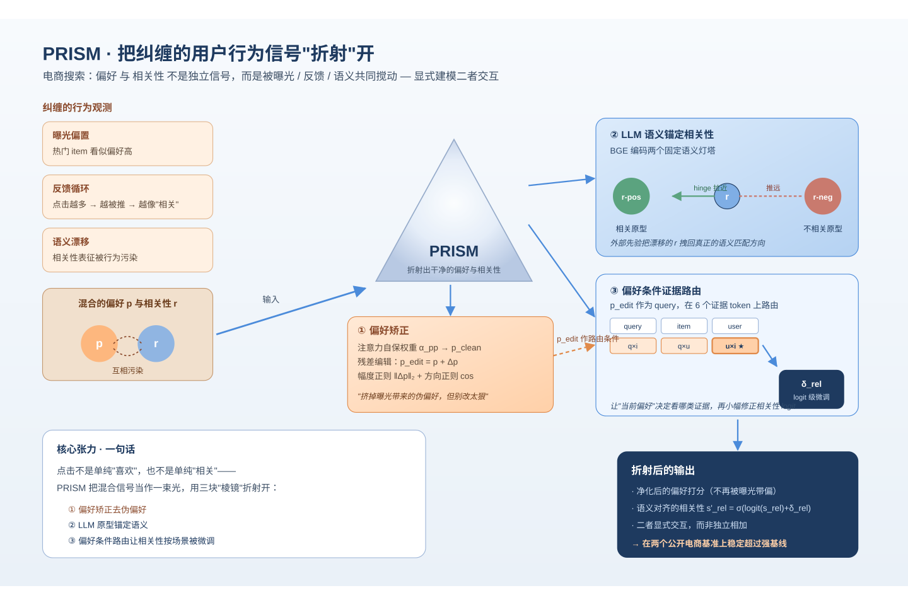
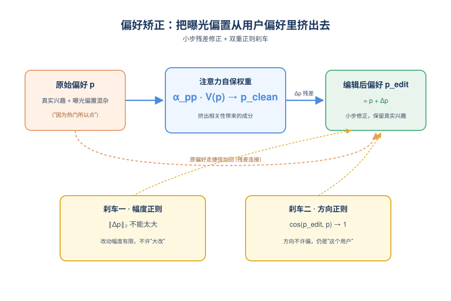
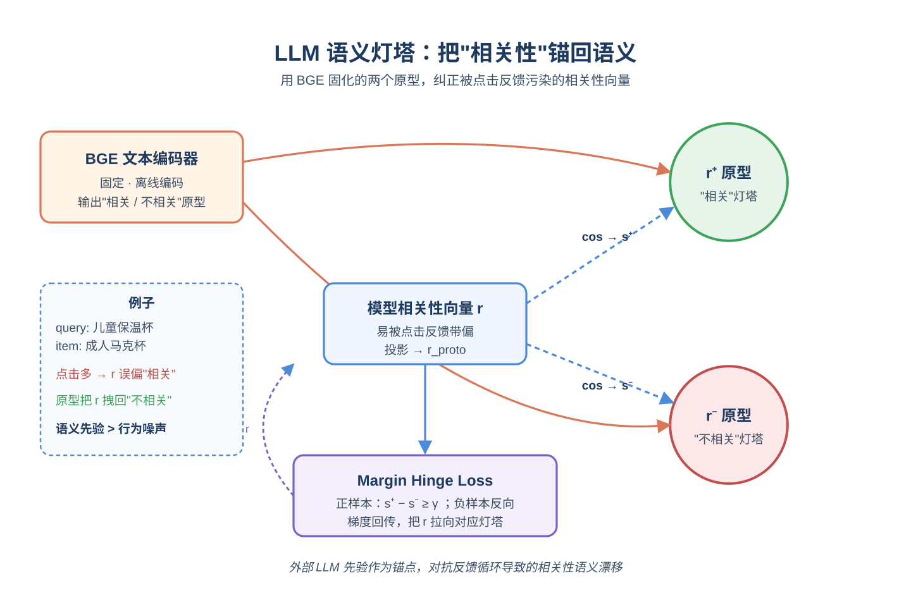
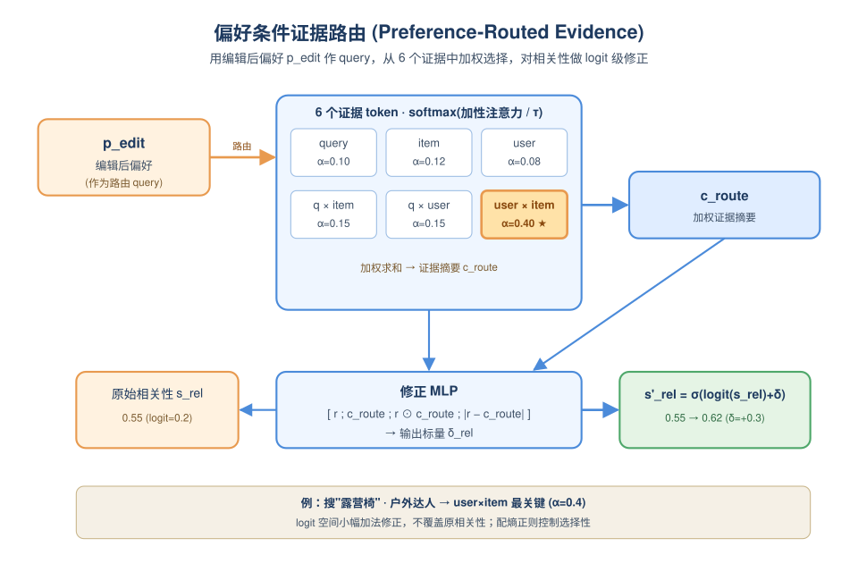
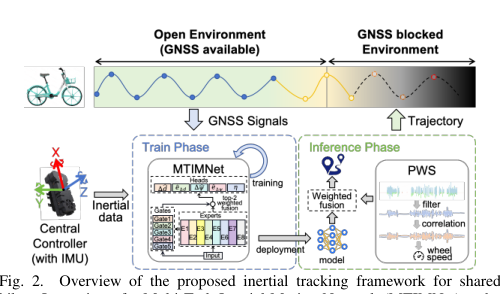
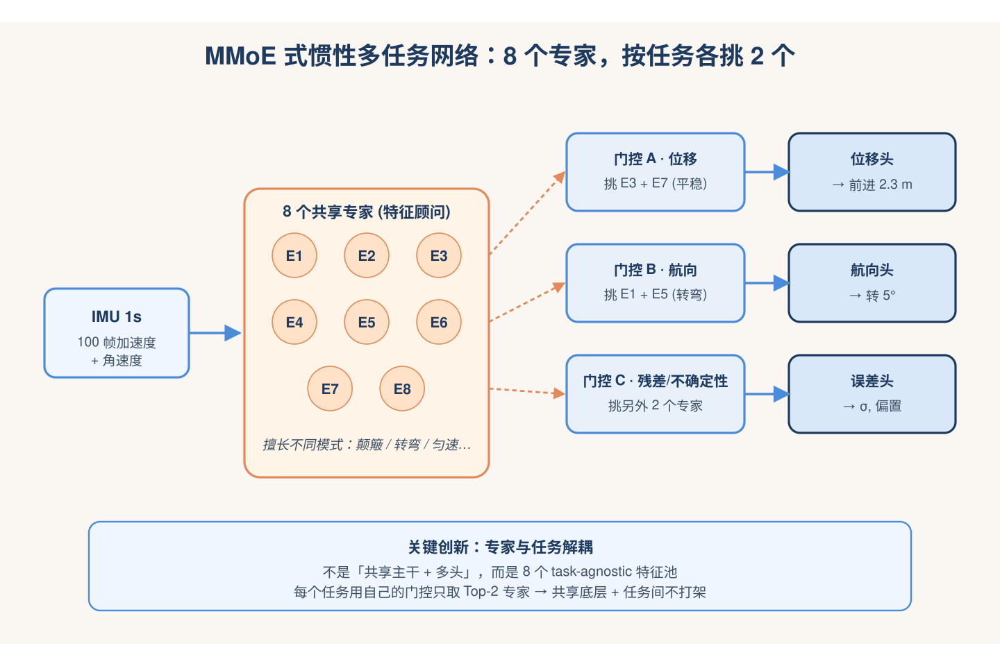
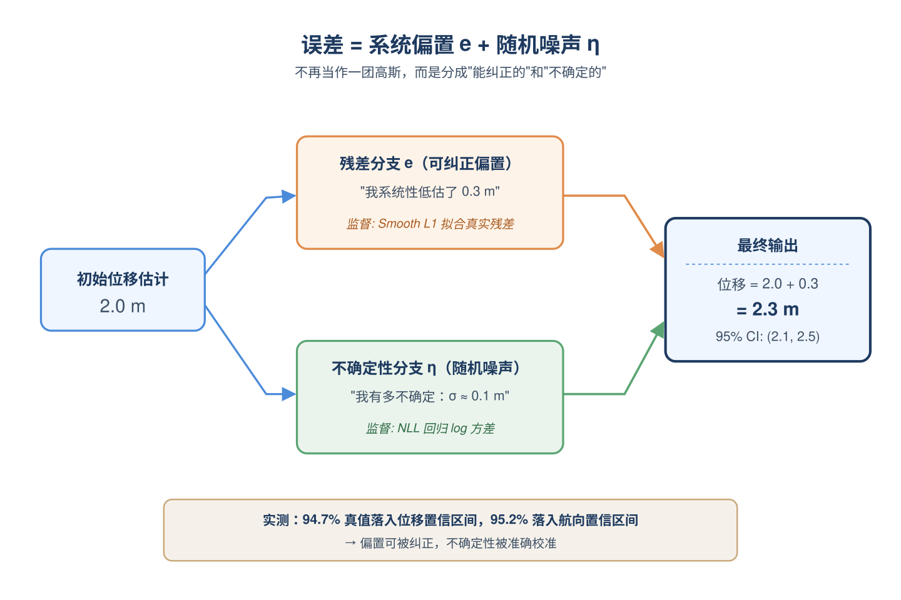
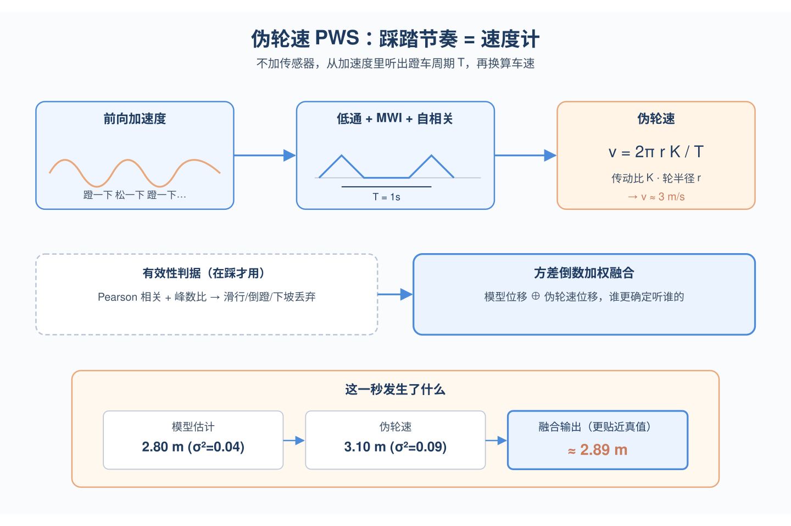

# 2026-05-11 论文日报

## 一、今日趋势与创新观察

### 1. 趋势概况

- 今天全量547篇中cs.AI 298篇、cs.LG 234篇、cs.IR 15篇，LLM与语言理解仍以221篇占据主导，研究重心延续在大模型推理、对齐与RAG可信性。
- Agent与多智能体方向有103篇，今天出现Agent技能体系综述、工具作为连续流的推理范式、以及面向安全审计的统一图表示，显示Agent研究正从单点能力转向体系化与可观测性。
- 表示学习与检索排序157篇，亮点集中在电商搜索的行为解耦、LLM推荐的检索-记忆框架、以及面向过滤查询的ANNS系统优化，覆盖召回到排序的多个层面。
- 营销与决策侧出现基于能量模型与反事实推断的世界模型、以及面向离散选择的因果基础模型，表明因果与决策智能正在向商业化场景延伸。

### 2. 推荐系统 / 排序相关创新点

- PRISM针对电商搜索中用户行为被曝光机制、反馈循环与语义匹配纠缠的问题，提出对行为空间进行折射式解耦，把相关性与偏好信号分别还原出来再建模。
- RRCM在LLM推荐中引入排序驱动的检索机制，并用协同记忆与元记忆两层结构来构造决策相关上下文，避免传统RAG只检索相似item的浅层使用方式。
- DCGL用双通道图学习把知识图的结构信号与LLM的语义理解分别建模再融合，缓解KG稀疏与LLM幻觉对知识感知推荐的影响。

### 3. 全局创新点

- Echo借助谱Koopman算子实现无KV缓存的关联召回，让长链推理与Agent工具调用在常数内存下避免状态空间模型的检索悬崖。
- Three-in-One世界模型用深度玻尔兹曼机把消费者异质性、时变内部状态与显式干预统一在能量一致性、预测与反事实推断三个头中，给营销决策提供可干预的仿真底座。
- Tools as Continuous Flow把Agent的工具调用从step-wise改写为连续流式推理，提供全局视角以缓解长程误差累积并提升对未见工具的泛化。

### 4. 跨论文综合观察

- PRISM、RRCM与DCGL其实是在推荐链路的不同层面回应同一问题——如何在纠缠信号中抽出干净的决策上下文：PRISM从行为侧解耦曝光与语义，RRCM从检索侧解耦协同与元记忆，DCGL从知识侧解耦图结构与LLM语义。
- Three-in-One世界模型与Causal-Aware双层优化基础模型共同体现因果建模正在被装进可决策的基础模型壳里，从单纯估计处理效应走向直接服务定价、品类组合等业务动作。
- Echo、Tools as Continuous Flow与Agent技能综述呈现出Agent方向的方法论共性：把长程工具调用与记忆访问从离散step抽象为连续/谱表示，再配合体系化的技能与审计视角，反映社区开始把Agent当作系统工程问题来治理。

## 二、今日论文总览

### 1. PRISM: Refracting the Entangled User Behavior Space for E-Commerce Search
- 挑选理由：电商搜索中偏好与相关性建模，与商业化排序链路较为同构

### 2. Tracking Large-scale Shared Bikes with Inertial Motion Learning in GNSS Blocked Environments
- 挑选理由：共享单车惯性定位，虽提到滴滴但与广告分发无关

### 3. HARMONY: Bridging the Personalization-Generalization Gap by Mitigating Representation Skew in Heterogeneous Split Federated Learning
- 挑选理由：联邦学习，无广告业务上下文

### 4. ModelLens: Finding the Best for Your Task from Myriads of Models
- 挑选理由：模型推荐框架，虽含'推荐'但作用于模型选择，非商业化分发

## 三、补充关注

1. **Three-in-One World Model: Energy-Based Consistency, Prediction, and Counterfactual Inference for Marketing Intervention**
   - 理由：营销干预的反事实推断和异质处理效应，与增量效果建模有一定相关性，但偏仿真和消费者建模，不直接作用于广告系统。

## 四、重点论文精读

### 1. PRISM: Refracting the Entangled User Behavior Space for E-Commerce Search
- **为什么值得看：** 电商搜索中显式建模偏好与相关性的耦合，对广告排序链路有直接借鉴
- **背景：** 电商搜索的点击行为同时受到query-item相关性和用户偏好驱动，但现有联合建模方法（如PRECTR、PRINT）默认两者独立、稳定，忽视了曝光机制和反馈循环导致的信号纠缠：偏好被混杂因素污染，相关性也会因行为反馈出现语义漂移。论文要解决的就是在这种纠缠观测下如何同时净化偏好、锚定相关性语义、并让二者动态交互，这对广告排序里类似的'相关性vs个性化'拆分很有借鉴意义。

*图示：广告排序中也长期存在'用户偏好'与'query-item相关性'纠缠的问题：曝光偏置、反馈循环、语义漂移让两路信号互相污染。这篇论文显式建模二者交互，并用LLM语义原型给相关性做锚定，对广告精排和相关性子模型都有直接迁移价值。*

**核心技术点：**

#### 技术点 1：偏好矫正模块
- 快速理解：用GAT式注意力把相关性对偏好的干扰剥离，再以残差形式小幅修正偏好向量

*图示：直觉是：原始偏好里混了'因为这个item相关所以我点'的成分，要把这部分挤出去，但又不能改太狠把用户真实兴趣也丢了。所以用注意力算一个'保留多少原偏好'的权重，再用残差小步修正，并用两个正则当刹车——一个限制改动幅度，一个限制改动方向。*

- 技术细节：把偏好向量p和相关性向量r投到共享空间，计算两条注意力路径：'相关性变成偏好'和'偏好变成偏好自保'。论文取自保权重αpp乘到偏好的value上得到一个'净化后的偏好'pclean，再以残差Δp = pclean − p加回原偏好，得到编辑后的pedit。为了防止过度改写，加了两个正则：幅度正则约束Δp的L2范数不要太大，方向正则要求pedit和原p的余弦相似度尽量高。最终偏好打分由pedit经一层线性+sigmoid给出。
- 通俗讲解：直觉是：原始偏好里混了'因为这个item相关所以我点'的成分，要把这部分挤出去，但又不能改太狠把用户真实兴趣也丢了。所以用注意力算一个'保留多少原偏好'的权重，再用残差小步修正，并用两个正则当刹车——一个限制改动幅度，一个限制改动方向。
- 例子：假设用户搜'跑鞋'，曝光的是一双热门跑鞋，原始偏好向量p其实混入了'热门曝光导致点击'的偏置。模块算出αpp=0.85（大部分保留自身偏好），生成pclean，再以Δp = pclean−p的形式只对p做轻微调整，得到pedit；下游再用pedit打偏好分，从而减弱'因为曝光多而看起来偏好高'的假象。

#### 技术点 2：LLM语义锚定相关性
- 快速理解：用LLM生成的'相关/不相关'原型向量当固定锚点，把相关性表征拉向正极、推离负极

*图示：把'什么叫相关、什么叫不相关'用LLM先固化成两个语义灯塔，模型学相关性向量时被强行拉向对应的灯塔。这样即使行为反馈让相关性信号漂移，原型作为外部先验可以把它拽回到真正的语义匹配方向。整个过程就是：先投影r到锚定空间变成算与两个原型的余弦变成用margin loss推动正负极分开。*

- 技术细节：事先用BGE-base文本编码器把'相关query-item'和'不相关query-item'的语义原型编码成两个固定向量r-pos和r-neg。训练时把模型学到的相关性向量r投影到锚定空间得到r-proto，再分别和两个原型计算余弦相似度（除以温度），得到s-pos和s-neg。损失是一个带margin的hinge：对正样本要求s-pos − s-neg \>= γ，对负样本反过来；并用一个mask控制哪些样本有可靠的相关性监督才参与这一项。
- 通俗讲解：把'什么叫相关、什么叫不相关'用LLM先固化成两个语义灯塔，模型学相关性向量时被强行拉向对应的灯塔。这样即使行为反馈让相关性信号漂移，原型作为外部先验可以把它拽回到真正的语义匹配方向。整个过程就是：先投影r到锚定空间变成算与两个原型的余弦变成用margin loss推动正负极分开。
- 例子：对一个query='儿童保温杯'+item='成人马克杯'，BGE把'相关'和'不相关'的语义原型固定下来。模型学到的相关性向量r被投影后，与'不相关'原型余弦更高、与'相关'原型更低，hinge loss就会反向修正r，让它在表征空间中更靠近不相关极，避免因为该item被高频点击就被错误学成'相关'。

#### 技术点 3：偏好条件证据路由
- 快速理解：以矫正后偏好作query，对6类证据token做softmax路由，再去微调相关性logit

*图示：不同搜索场景下，决定相关性的关键证据不一样：有时候query-item语义最重要，有时候user-item历史更关键。这个模块让'当前偏好状态'来决定该多看哪类证据，再用这些被选中的证据对原始相关性分做一个小幅度的logit级修正——而不是直接覆盖，避免大改动破坏已学好的相关性。*

- 技术细节：构造6个证据token：query、item、user三个一阶表征，加上query-item、query-user、user-item三个交互表征。用编辑后的偏好pedit作为路由query，对每个证据token算key，做加性注意力得到路由分数a(e)，softmax（带温度τ）得到权重α(e)，加权求和成证据摘要c-route。然后构造修正特征（r; c-route; r⊙c-route; \|r−c-route\|）送入MLP，输出一个标量δrel，在logit空间对原相关性分srel做加法修正：s'rel = sigmoid(logit(srel)+δrel)。还加了路由分布的熵正则，控制选择性。
- 通俗讲解：不同搜索场景下，决定相关性的关键证据不一样：有时候query-item语义最重要，有时候user-item历史更关键。这个模块让'当前偏好状态'来决定该多看哪类证据，再用这些被选中的证据对原始相关性分做一个小幅度的logit级修正——而不是直接覆盖，避免大改动破坏已学好的相关性。
- 例子：用户搜'露营椅'，pedit表明该用户最近重户外。路由器在6个证据token上算权重，发现user-item交互token权重最高（α≈0.4），说明该用户的历史行为对判断这把椅子是否合适很关键。证据摘要c-route结合r拼成修正特征，MLP输出δrel=+0.3，把原相关性logit从0.2抬到0.5，对应sigmoid分数从0.55提升到0.62。

- **对广告的启发：** 广告精排里相关性子模型可以借鉴：用LLM原型锚定语义、用偏好门控做证据路由
- **适用边界：** 方法依赖可靠的相关性监督标签（用mask筛选）和高质量LLM语义原型，在缺乏显式相关性标注或query/item文本极短的场景下，锚定模块可能失效；此外多个辅助loss的权重调参成本较高。
- **实践建议：** 可以先在广告相关性子模型里试'LLM原型+hinge对齐'这一招：用文本编码器离线编出'相关/不相关'原型向量，作为辅助loss加到现有相关性塔上，不改主结构就能验证语义锚定是否带来稳定收益。

### 2. Tracking Large-scale Shared Bikes with Inertial Motion Learning in GNSS Blocked Environments
- **为什么值得看：** 滴滴共享单车惯性定位，MoE多任务+不确定性建模思路对广告排序有借鉴价值
- **背景：** 城市峡谷、立交桥下等场景GNSS信号失效，共享单车要支持还车判定、计费、调度就必须有可靠的室外定位。传统惯性导航靠加速度二次积分，低成本IMU噪声大、漂移严重；视觉/激光雷达又部署不起。论文要解决的就是只用便宜IMU、无需额外传感器的情况下，如何把单车轨迹估准并约束长期漂移。

*图示：这是论文的主方法总览图，直接展示了完整 inertial tracking framework：开放环境下用 GNSS 训练 MTIMNet、GNSS blocked 环境下进行推断，并结合 PWS 做速度校准，模块关系和训练/推断流程都清楚，最能代表论文核心贡献。相比同页另一个候选，这张裁剪更聚焦图主体、正文干扰更少、完整性也足够；而 Fig.1 只是问题场景示意，Fig.3 只是局部子模块对比，不如该图适合作为主架构图。*

**核心技术点：**

#### 技术点 1：MMoE式多任务惯性网络
- 快速理解：用共享专家+任务门控同时学位移、航向、残差、不确定性五个任务

*图示：可以理解为有8个'特征顾问'，每个顾问擅长IMU序列里不同的模式（比如颠簸、转弯、匀速）。每个任务（估距离、估转角、估误差）派一个调度员去挑2个最对口的顾问，把他们的意见加权综合后下决策，这样任务之间既共享底层特征又不会互相干扰。*

- 技术细节：MTIMNet把1秒IMU窗口编码后送进8个共享专家，每个任务（位移、航向增量、位移残差、航向残差、不确定性）有独立门控，从8个专家里选权重最高的2个加权融合，再过任务专属头输出。不像传统多头共享主干，这里专家是task-agnostic的特征池，门控让不同任务自由组合。
- 通俗讲解：可以理解为有8个'特征顾问'，每个顾问擅长IMU序列里不同的模式（比如颠簸、转弯、匀速）。每个任务（估距离、估转角、估误差）派一个调度员去挑2个最对口的顾问，把他们的意见加权综合后下决策，这样任务之间既共享底层特征又不会互相干扰。
- 例子：实际跑一次推断：1秒100帧IMU数据进编码器拿到底层特征变成8个专家各产出一份候选表征变成位移任务的门控发现专家3和专家7权重最高（可能是平稳骑行模式），把它们加权融合变成位移头输出本秒前进了2.3米；同一批特征里航向任务的门控却选了专家1和专家5（转弯敏感的），输出航向变化了5度。

#### 技术点 2：误差拆成确定偏置+随机噪声
- 快速理解：把预测误差显式拆成可学习残差和高斯噪声，分别用两个分支建模

*图示：低成本IMU的误差既有装歪了导致的固定偏置，也有随机抖动。如果一锅炖成高斯分布，确定性偏差会被当噪声平均掉。论文让模型一边预测'我大概偏了多少'（残差，可纠正），一边预测'我有多不确定'（方差，表示置信度），训练时两个目标分别用Smooth L1和NLL监督。*

- 技术细节：论文不假设误差全是高斯，而是把误差写成 ε=e+η，e是可学习的系统性偏置（残差分支用Smooth L1拟合真实残差），η是随机噪声（用负对数似然回归log方差）。最终输出=初始估计+残差估计，同时给出不确定性。
- 通俗讲解：低成本IMU的误差既有装歪了导致的固定偏置，也有随机抖动。如果一锅炖成高斯分布，确定性偏差会被当噪声平均掉。论文让模型一边预测'我大概偏了多少'（残差，可纠正），一边预测'我有多不确定'（方差，表示置信度），训练时两个目标分别用Smooth L1和NLL监督。
- 例子：模型对某秒位移初估2.0米，残差分支说'我系统性低估了0.3米'，不确定性分支说'log方差对应标准差0.1米'。最终位移=2.3米，95%置信区间约（2.1, 2.5）。实测94.7%的真值落进位移置信区间、95.2%落进航向置信区间，校准得很准。

#### 技术点 3：伪轮速：用踩踏周期当观测
- 快速理解：从前向加速度里检测踩踏周期反推车速，作为长期漂移的校准观测

*图示：骑车时人腿发力是周期性的，加速度信号里天然带'蹬一下、松一下'的节奏。论文不需要装额外的轮速传感器，靠这个节奏的频率就能反推车在多快。再因为有时候人不蹬车（滑行/下坡），就用两个简单判据剔除这些无效段，只在'真的在踩'时才输出伪轮速去纠正模型。*

- 技术细节：脚踏和后轮之间是固定传动比，每蹬一圈后轮转固定圈数。论文从前向加速度做低通+滑窗积分(MWI)+自相关，找到踩踏周期T，再用 v=2策略rK/T 算出车速。再用Pearson相关和峰数比做异常检测，过滤滑行、倒蹬、下坡等无效情况。最后把伪轮速换算的位移和模型位移按方差倒数加权融合。
- 通俗讲解：骑车时人腿发力是周期性的，加速度信号里天然带'蹬一下、松一下'的节奏。论文不需要装额外的轮速传感器，靠这个节奏的频率就能反推车在多快。再因为有时候人不蹬车（滑行/下坡），就用两个简单判据剔除这些无效段，只在'真的在踩'时才输出伪轮速去纠正模型。
- 例子：5秒前向加速度窗口变成低通滤波变成滑窗积分得到平滑波形变成自相关找到峰间距对应踩踏半周期0.5秒变成T=1秒变成按车轮半径和传动比算出v≈3m/s。模型这一秒估位移2.8米(方差0.04)，伪轮速给3.1米(方差0.09)，加权融合后输出≈2.89米，明显比单靠模型更接近真值。

- **对广告的启发：** MMoE任务专属门控+不确定性感知融合，对多任务排序和多路融合有直接借鉴
- **适用边界：** 伪轮速强依赖周期性踩踏行为，滑行、下坡、停车、电助力等场景都会失效；MTIMNet的训练监督来自开阔区域的GNSS，地下车库等长时间无信号场景没法在线再训练，跨城市/跨车型的泛化仍依赖众包数据覆盖。
- **实践建议：** 如果你在做多目标精排或多路融合，可以试试把现有共享主干换成MMoE+top-2门控，并在主预估头之外加一个'残差头+log方差头'，用残差做事后校准、用方差做多路加权融合，看能否在AUC/校准指标上同时获益。
