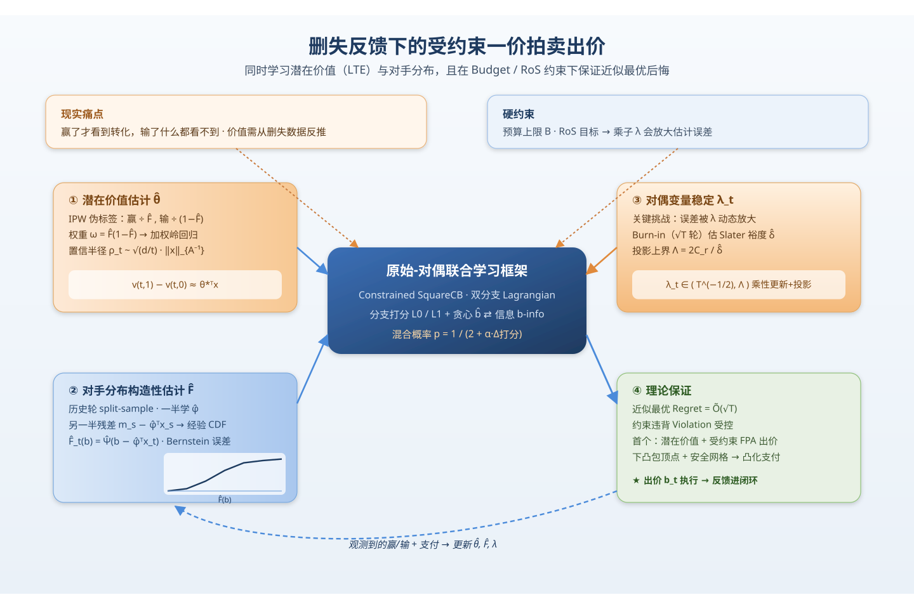
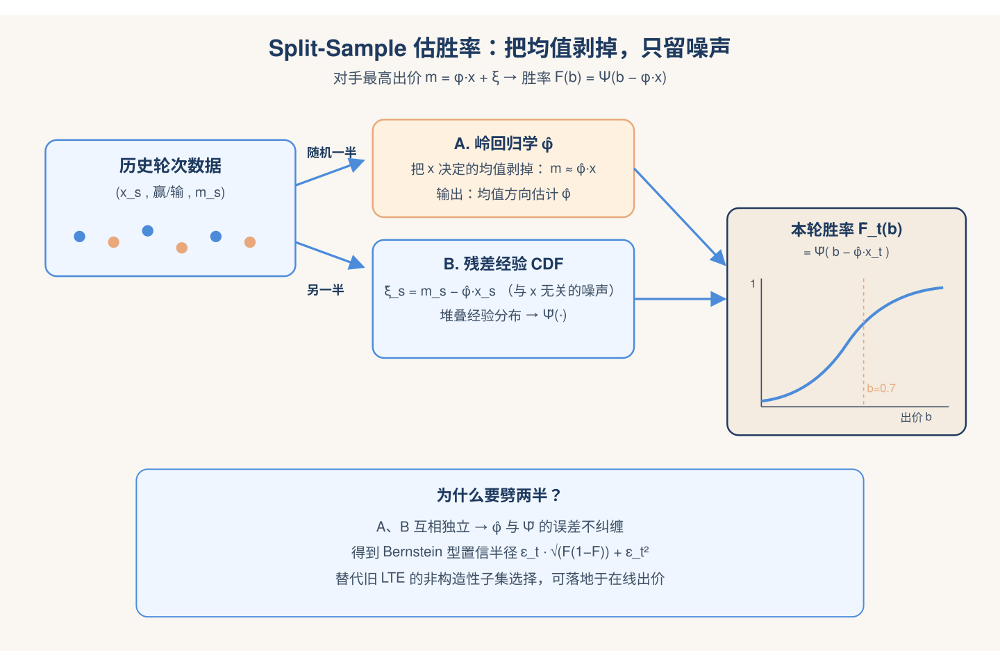
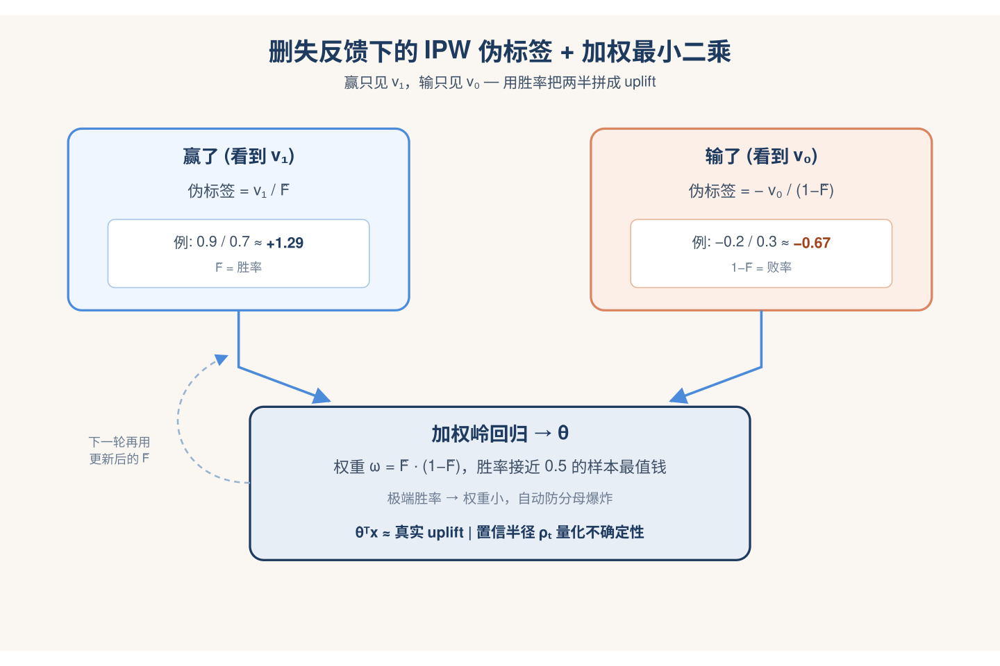
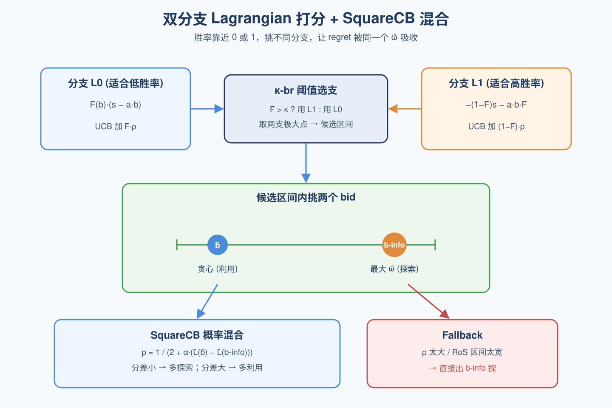
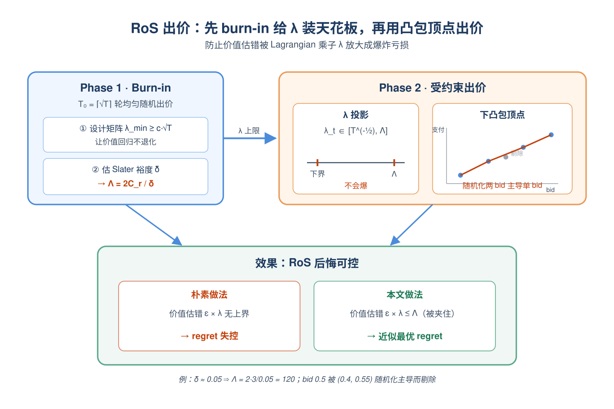
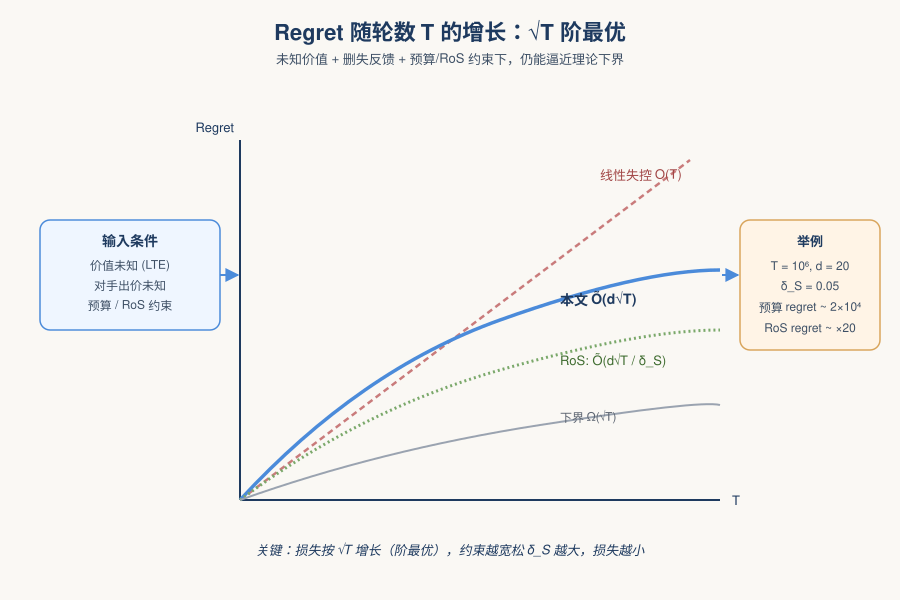
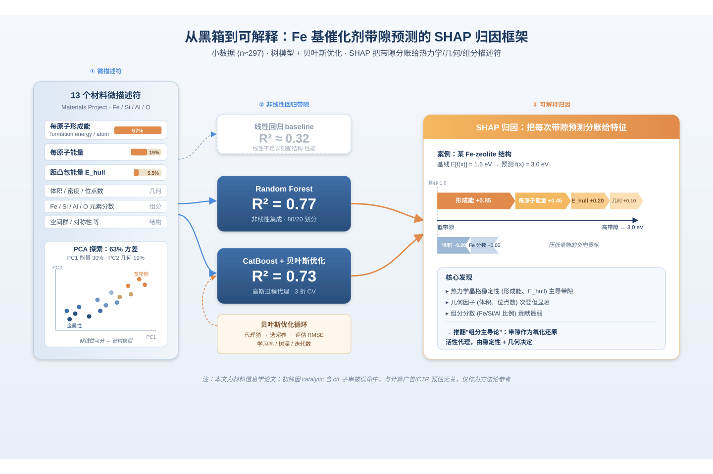
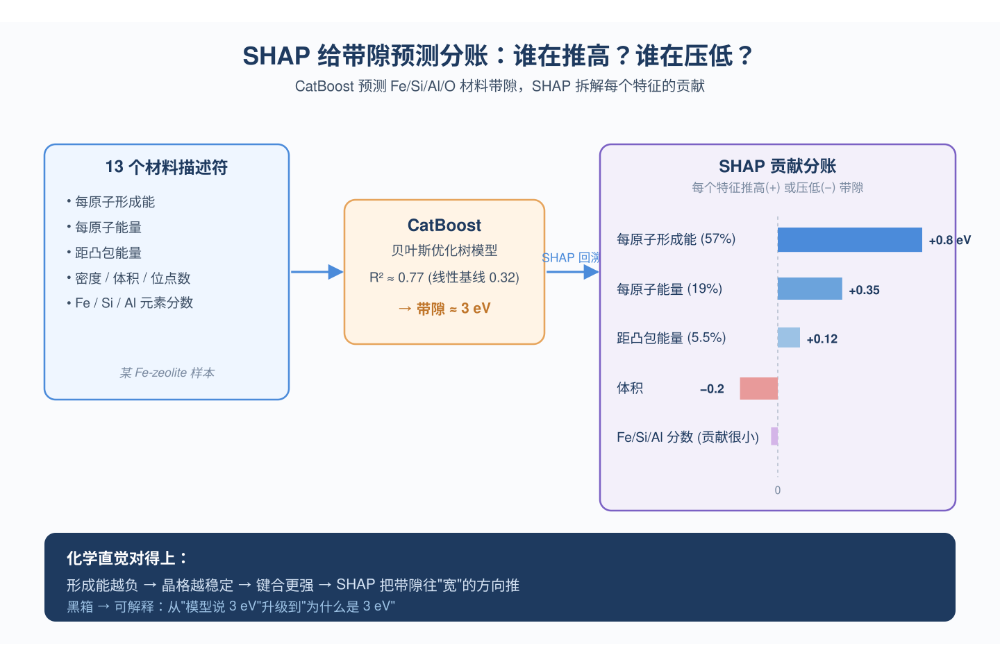
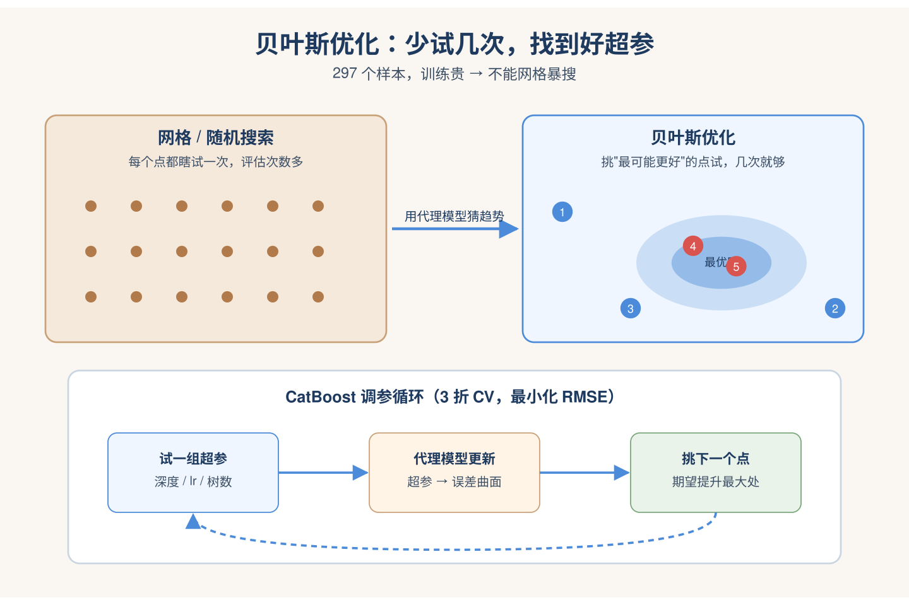
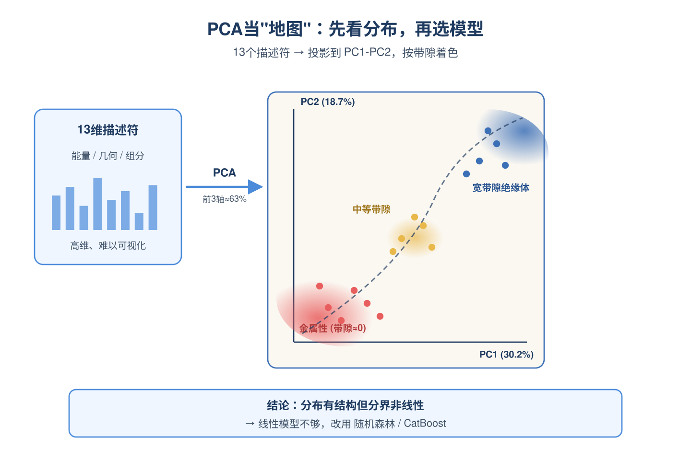

# 2026-05-12 论文日报

## 一、今日趋势与创新观察

### 1. 趋势概况

- 今日全量1189篇中cs.AI 707篇、cs.LG 450篇、cs.IR仅32篇，LLM与语言理解491篇仍是绝对重心，但Agent与多智能体上升到220篇，Agentic Search、深度研究助手、群体决策模拟成为新的密集子方向。
- 表示学习与检索排序330篇，重点议题从传统CTR转向生成式推荐的语义对齐(LASAR)、list-wise统一重排(UniRank)、序数偏好注入与late-interaction中的数值能力增强(NumColBERT)。
- 迁移学习与跨域泛化185篇集中在医疗、EEG、CAD等垂直基础模型，体现foundation model向行业纵深渗透；商业化决策与资源优化91篇里出现了首批LLM原生广告与神经元拍卖工作。
- 围绕LLM部署，端云协同、KV cache压缩、混合SSM等系统侧论文密集出现，反映从"能力刷点"向"成本与延迟约束下落地"的转向。

### 2. 推荐系统 / 排序相关创新点

- 《Learning to Bid with Unknown Private Values in Budget-Constrained First-Price Auctions》在FPA中放弃valuation oracle假设，直接从censored数据学习LTE价值并联合建模对手分布与预算/RoS约束，给自动出价提供了更贴近现实的学习范式。
- 《LLM Advertisement based on Neuron Auctions》和《NaiAD》共同把LLM生成式广告推到方法+数据的体系化阶段，前者在神经元粒度做拍卖以协调广告主、平台与用户三方效用，后者构建58999条ad-embedded响应的首个原生广告数据集。
- 《UniRank: Confidence-Ordered Denoising》和《LASAR》分别在重排和生成式推荐侧给出新视角：前者以置信度排序做list-wise去噪统一框架，后者把latent语义对齐显式注入生成式推荐的reasoning过程。

### 3. 全局创新点

- 《NumColBERT》以非侵入方式把数值表示注入late-interaction检索模型，在不破坏ColBERT结构的前提下解决数值语义匮乏问题，对电商/价格类检索有直接借鉴意义。
- 《Large Language Models over Networks》系统性论述在间歇连接、亚秒延迟、数据驻留等约束下的端云协同LLM架构，把"LLM部署"从单点优化抬升为网络级协同问题。
- 《Measuring and Decomposing Mode Separation via the Canonical Diffusion》提出基于规范扩散过程的mode分离度量，把高维分布的"碎裂程度"与"分散程度"解耦，可用于生成式推荐/广告中的多样性诊断。

### 4. 跨论文综合观察

- 出价侧的FPA带预算学习与LLM侧的Neuron Auction、NaiAD三篇可串成一条线：广告机制设计正从传统竞价场景向LLM生成式场景迁移，但共同关注点都是在信息不完全(私有价值未知/用户效用难量化)下的多方效用平衡。
- UniRank的list-wise去噪重排、LASAR的latent语义对齐生成式推荐、NumColBERT的数值注入检索，反映出排序链路三个层级(召回-生成-重排)正不约而同地走向"语义+结构化信号融合"，而不是单纯堆参数。
- LLM-over-Networks、KV eviction诊断、Hybrid SSM Priming和Agentic Edge Benchmarking在不同层面回应同一现实压力——大模型必须在受限算力/延迟下服务真实业务，这与生成式广告、Agentic Search等新场景的工业化诉求是耦合的。

## 二、今日论文总览

### 1. Learning to Bid with Unknown Private Values in Budget-Constrained First-Price Auctions
- 挑选理由：数字广告FPA下带预算和RoS约束的出价学习，直接覆盖自动出价核心问题，包含LTE价值建模与对手分布学习

### 2. Beyond the Black Box: An Interpretable Machine Learning Framework for Predicting Electronic Structure Microdescriptors and Structure-Performance Relationships in Fe-based Catalytic Systems
- 挑选理由：命中广告核心词：ctr。

### 3. HEART: A High-Efficiency Adaptive Real-Time Telemonitoring Framework for Secure Electrocardiogram Signal Transmission Using Chaotic Encryption
- 挑选理由：命中广告核心词：ctr。

### 4. Inverse Design of Multi-Layer Sub-Pixel-Resolution RF Passives Through Grayscale Diffusion with Flexible S-Parameter Conditioning
- 挑选理由：命中广告核心词：ctr。

### 5. NaiAD: Initiate Data-Driven Research for LLM Advertising
- 挑选理由：直接面向LLM原生广告，构建数据集并刻画用户/商业化效用，明确广告链路

### 6. Accelerating Power Method with Fast Sketching for Stronger Low-Rank Approximation
- 挑选理由：命中广告核心词：ctr。

### 7. Phases of Muon: When Muon Eclipses SignSGD
- 挑选理由：命中广告核心词：ctr。

### 8. A Market-Rule-Informed Neural Network for Efficient Imbalance Electricity Price Forecasting
- 挑选理由：命中广告核心词：ctr。

### 9. Measuring and Decomposing Mode Separation via the Canonical Diffusion
- 挑选理由：命中广告核心词：ctr。

### 10. Large Language Models over Networks: Collaborative Intelligence under Resource Constraints
- 挑选理由：命中广告核心词：ctr。

### 11. Learnability and Competition in High-Dimensional Multi-Component ICA
- 挑选理由：命中广告核心词：ctr。

### 12. Domain-Adaptive Arrhythmia Classification Using a Hybrid Transformer on Wearable Heart Signals
- 挑选理由：命中广告核心词：ctr。

### 13. Neural Posterior Estimation of Terrain Parameters from Radar Sounder Data
- 挑选理由：命中广告核心词：ctr。

### 14. UxSID: Semantic-Aware User Interests Modeling for Ultra-Long Sequence
- 挑选理由：快手广告超长用户序列建模，A/B带来0.337%广告收入提升，直接广告排序工作

### 15. LLM Advertisement based on Neuron Auctions
- 挑选理由：直接研究 LLM 生成式广告与拍卖机制设计，将广告竞价对象迁移到神经元层面，平衡广告主收益、平台收入与用户体验，属于广告核心问题

### 16. Empirical Bayes 1-bit matrix completion
- 挑选理由：命中强迁移信号：recommendation, calibration, system。

### 17. From pre-training to downstream performance: Does domain-specific pre-training make sense?
- 挑选理由：命中强迁移信号：matching, system, pre-training。

### 18. Cross-Domain Lossy Compression via Constrained Minimum Entropy Coupling
- 挑选理由：命中强迁移信号：matching, framework。

### 19. Kinetic theory for Transformers and the lost-in-the-middle phenomenon
- 挑选理由：命中强迁移信号：retrieval, system。

### 20. Sliced Inner Product Gromov-Wasserstein Distances
- 挑选理由：命中强迁移信号：matching, framework。

### 21. LoKA: Low-precision Kernel Applications for Recommendation Models At Scale
- 挑选理由：Meta大规模推荐模型FP8低精度训练系统，工业级LRM训练基础设施，与广告排序模型工程强同构

### 22. UniRank: Unified List-wise Reranking via Confidence-Ordered Denoising
- 挑选理由：工业级list-wise重排框架，统一AR/NAR范式，有线上A/B实验，与广告重排链路高度同构。

### 23. AgentGR: Semantic-aware Agentic Group Decision-Making Simulator for Group Recommendation
- 挑选理由：群组推荐+LLM agent模拟，偏学术，不直接面向广告商业化决策链路。

### 24. OpenZL: Using Graphs to Compress Smaller and Faster
- 挑选理由：Meta的数据压缩系统，与广告决策链路无关。

### 25. Reddit2Deezer: A Scalable Dataset for Real-World Grounded Conversational Music Recommendation
- 挑选理由：对话音乐推荐数据集，非广告

### 26. LLM Jaggedness Unlocks Scientific Creativity
- 挑选理由：LLM科学创造力评测，与商业化分发无关。

### 27. Agent-First Tool API: A Semantic Interface Paradigm for Enterprise AI Agent Systems
- 挑选理由：企业Agent工具API设计，与广告链路无关。

### 28. SKG-VLA: Scene Knowledge Graph Priors for Structured Scene Semantics and Multimodal Reasoning for Decision Making
- 挑选理由：投诉处理决策系统，非广告商业化分发链路。

### 29. MBP-KT: Learning Global Collaborative Information from Meta-Behavioral Pattern for Enhanced Knowledge Tracing
- 挑选理由：教育知识追踪，与广告链路无关

### 30. Revisiting Mixture Policies in Entropy-Regularized Actor-Critic
- 挑选理由：纯RL理论，无广告业务上下文

### 31. FraudBench: A Multimodal Benchmark for Detecting AI-Generated Fraudulent Refund Evidence
- 挑选理由：电商退款欺诈检测，虽涉及电商但不属于广告分发链路

### 32. PRIM: Meta-Learned Bayesian Root Cause Analysis
- 挑选理由：因果根因分析，与广告链路无关。

### 33. The Extrapolation Cliff in On-Policy Distillation of Near-Deterministic Structured Outputs
- 挑选理由：LLM蒸馏方法，虽实验在Amazon Fashion但与广告分发链路无关。

### 34. Quantifying Concentration Phenomena of Mean-Field Transformers in the Low-Temperature Regime
- 挑选理由：Transformer理论分析，无关。

### 35. RubricEM: Meta-RL with Rubric-guided Policy Decomposition beyond Verifiable Rewards
- 挑选理由：深度研究agent训练，无广告业务上下文。

### 36. Stellar Age Compression Reshapes Interpretations of the Milky Way Thick-Disk Formation History
- 挑选理由：天体物理，无关

### 37. CCD-Level and Load-Aware Thread Orchestration for In-Memory Vector ANNS on Multi-Core CPUs
- 挑选理由：小红书生产环境的ANNS线程调度优化，明确服务搜索/推荐/广告，是基础设施类工业落地。

## 三、补充关注

1. **A General Framework for Multimodal LLM-Based Multimedia Understanding in Large-Scale Recommendation Systems**
   - 理由：工业级推荐系统中MM-LLM多模态理解框架，含线上AUC指标，对商业化排序有参考价值但非直接广告论文
2. **Unified Approach for Weakly Supervised Multicalibration**
   - 理由：有一定相关信号，但不足以进入正式候选：calibration。
3. **Optimal Regret for Single Index Bandits**
   - 理由：有一定相关信号，但不足以进入正式候选：matching。
4. **Towards Trustworthy Audio Deepfake Detection: A Systematic Framework for Diagnosing and Mitigating Gender Bias**
   - 理由：有一定相关信号，但不足以进入正式候选：debias。
5. **Beyond Toy Benchmarks: A Systematic Evaluation of OOD Detection Methods For Plant Pathology Classification**
   - 理由：有一定相关信号，但不足以进入正式候选：calibration。
6. **Compressed Video Aggregator: Content-driven Module for Efficient Micro-Video Recommendation**
   - 理由：微视频推荐中视频内容嵌入压缩模块，与商业化分发有一定同构性但偏内容理解

## 四、重点论文精读

### 1. Learning to Bid with Unknown Private Values in Budget-Constrained First-Price Auctions
- **为什么值得看：** 首次解决FPA下含预算/RoS约束、且广告价值需从删失数据反事实学出来的出价问题
- **背景：** 广告平台基本切到一价拍卖(FPA)，自动出价又普遍带预算和RoS约束，但已有受约束出价的理论工作几乎都假设impression的真实价值能直接拿到，这在RTB里并不现实——价值要从'赢了才能看到转化、输了什么也看不到'的删失数据中反推。论文提出在FPA中同时学习线性处理效应(LTE)价值参数和对手最高出价分布，并把这套估计塞进带预算/RoS约束的原始-对偶出价框架，是首个在'潜在价值+约束FPA出价'同时成立的理论性方案，所以值得关注。

*图示：这篇直击自动出价的核心痛点：现实中广告主既要遵守硬预算和RoS目标，又拿不到真实impression价值，只能从赢/输的删失反馈里反推。论文把因果价值学习(LTE)和对手出价分布学习放进同一个原始-对偶框架，并给出近似最优后悔界，对FPA自动出价的理论与工程都有直接价值。*

**核心技术点：**

#### 技术点 1：双线性结构与CDF构造性估计
- 快速理解：假设我方价值与对手最高出价都线性依赖同一上下文，并用split-sample方法构造性估计胜率CDF

*图示：直觉是：用户特征x既决定我方对这次曝光的估值，也决定别人愿意出多少，因此对手出价分布可以看成'同一个x推出来的均值，加一个与x无关的噪声'。算法把历史样本随机劈两半，一半学φ把对手出价的均值剥掉，另一半就只剩噪声，对噪声做经验CDF再平移回当前x-t，就得到这一轮的胜率曲线F̂-t；两半互不相关，保证了后面置信半径推导的独立性。*

- 技术细节：论文设定我方uplift价值平均值（v1-v0\|x）=θ\*'x，对手最高出价m=φ\*'x+ξ，于是胜率F-t(b)=Ψ(b-φ\*'x-t)只是噪声CDF的平移。算法1把历史轮次随机一半用来岭回归估φ，另一半用来在'移动后的残差'上做经验CDF，得到带Bernstein型误差界的F̂-t，误差形如ε-t·√(F(1-F))+ε-t²，这把过去LTE工作里非构造性的子集选择步骤替换成可实现的split-sample过程。
- 通俗讲解：直觉是：用户特征x既决定我方对这次曝光的估值，也决定别人愿意出多少，因此对手出价分布可以看成'同一个x推出来的均值，加一个与x无关的噪声'。算法把历史样本随机劈两半，一半学φ把对手出价的均值剥掉，另一半就只剩噪声，对噪声做经验CDF再平移回当前x-t，就得到这一轮的胜率曲线F̂-t；两半互不相关，保证了后面置信半径推导的独立性。
- 例子：比如来了一次'上东区+iPhone'的曝光x-t：用训练子集回归出φ，估计对手平均最高出价大概0.6；评估子集里所有历史(m-s - φ'x-s)堆成噪声样本，要算F̂-t(0.7)就数有多少噪声样本\<=0.7-0.6=0.1，得到比如65%胜率，并附带一个随√(d/t)收缩的误差ε-t。

#### 技术点 2：IPW+加权最小二乘的价值估计
- 快速理解：用估计胜率做逆倾向加权，把删失反馈变成对uplift的无偏线性观测，再做加权岭回归

*图示：想象你只能看到一半的因果反事实：赢的时候知道'有广告下的转化'，输的时候只能看到'没广告下的转化'。IPW的做法是：赢的样本除以胜率把它放大到代表全体，输的样本除以败率同理放大，这样两边加起来的期望刚好就是想要的uplift。胜率离0.5越近，这个反事实信息就越扎实，所以同样的样本在加权回归里被赋予更大权重，模型也就更愿意从'胜负都有可能'的局里学东西。*

- 技术细节：因为只有赢了才看到v-(t,1)、输了才看到v-(t,0)，论文用Horvitz-Thompson构造伪标签：赢的那一项除以max(ε²,F̂)，输的除以max(ε²,1-F̂)，相减后期望近似θ\*'x。再以ω-t(b)=F̂(1-F̂)作权重做加权岭回归得到θ̂，对应置信半径ρ-t=β-t‖x-t‖-(A-t (-1))，β-t规模为Õ(√d)。胜率太接近0或1的样本权重小，自动避免分母爆炸。
- 通俗讲解：想象你只能看到一半的因果反事实：赢的时候知道'有广告下的转化'，输的时候只能看到'没广告下的转化'。IPW的做法是：赢的样本除以胜率把它放大到代表全体，输的样本除以败率同理放大，这样两边加起来的期望刚好就是想要的uplift。胜率离0.5越近，这个反事实信息就越扎实，所以同样的样本在加权回归里被赋予更大权重，模型也就更愿意从'胜负都有可能'的局里学东西。
- 例子：假设在x-t上出价0.55、F̂=0.7：赢了观察到v1=0.9，伪标签≈0.9/0.7≈1.29；如果输了观察到v0=0.2，伪标签≈-0.2/0.3≈-0.67。把这条样本以权重0.7×0.3=0.21加进加权最小二乘，长期来看θ̂'x-t就会逼近真实uplift θ\*'x-t，而ρ-t给出'我对这次估值还有多不确定'。

#### 技术点 3：约束SquareCB与双分支Lagrangian打分
- 快速理解：用两种代数等价的Lagrangian分支打分，配SquareCB在贪心bid与信息bid间随机混合

*图示：两个分支等价，但把价值不确定性ρ分别挂在F̂或(1-F̂)上，差别在于胜率靠近哪一端时哪个分支的'后悔'能被同一权重ω̂吸收掉，方便把regret算清。SquareCB的角色是：当贪心bid和'最长见识'的bid差不多时，多探索；差很多时，主要利用但偶尔探。一旦置信半径还很大、强行贪心可能在信息量极少的胜率区下注，就触发fallback，宁可少赚一点期望Lagrangian也要换来一次有用的WLS更新。*

- 技术细节：对每个候选b构造两个分支分数：L0=F̂(b)(s-t - a-t·b)、L1=-(1-F̂(b))s-t - a-t·b·F̂(b)，二者只差与b无关的常数；a-t在预算模式下为1+Zμ-t、RoS下为1+λ-t/(1+λ-t)。两个分支配上各自的UCB(分别加F̂·ρ和(1-F̂)·ρ)，用κ-br阈值挑出'胜率不靠近0/1'那一支，再在分支极大值之间形成局部候选区间。区间内取贪心b̂-t和最大化ω̂(b)的信息bid b-info，按SquareCB概率p-t=1/(2+α(L̂(b̂)-L̂(b-info)))混合。当ρ-t过大或RoS分支区间过宽时，直接退化到信息bid作fallback。
- 通俗讲解：两个分支等价，但把价值不确定性ρ分别挂在F̂或(1-F̂)上，差别在于胜率靠近哪一端时哪个分支的'后悔'能被同一权重ω̂吸收掉，方便把regret算清。SquareCB的角色是：当贪心bid和'最长见识'的bid差不多时，多探索；差很多时，主要利用但偶尔探。一旦置信半径还很大、强行贪心可能在信息量极少的胜率区下注，就触发fallback，宁可少赚一点期望Lagrangian也要换来一次有用的WLS更新。
- 例子：某轮s-t=0.8、a-t=1.3，分支1选出最大点0.55、分支0选出0.50：胜率F̂(0.55)=0.6\>κ-br，于是用L1为打分函数；候选区间（0.50,0.55）里贪心b̂=0.55、信息bid b-info=0.52(在那里F̂≈0.5使ω̂最大)。若两者打分相近，SquareCB可能给b-info 40%概率，给b̂ 60%概率；若此时ρ-t超过r0=κ-br/(4(1+Z))，则直接出0.52去探。

#### 技术点 4：RoS下burn-in估Slater与对偶天花板
- 快速理解：靠均匀探索阶段估Slater裕度δ\_S，进而设置λ的上界Λ=O(1/δ\_S)避免对偶发散

*图示：RoS是软的、平均型的约束，乘子λ理论上没有自然上界，价值估错就会被λ放大成大亏损。burn-in就是先用一段时间老老实实随机出价，一来摸清x的分布让回归不退化，二来用Slater策略策略slater能多大幅度满足约束来反推λ最多需要多大；上限Λ设好后，后面再用乘性更新+投影，就保证λ既能反应约束紧张程度，又不会爆。下凸包则是为了一价支付bF(b)关于F不是凸的——通过随机化两个bid可以做到比任何确定性bid更好的(分配,支付)组合，所以只在凸包顶点里挑bid就够了。*

- 技术细节：RoS情形里估值误差会被Lagrangian乘子λ-t放大，理论上可能让regret失控。论文先用T0=⌈√T⌉轮均匀探索做burn-in：保证加权设计矩阵的λ-min达到c·√T，并估出Slater裕度δ̂；据此设Λ=2C-r/δ̂，把λ-t投影到（T (-1/2),Λ）中。Phase 2再加'安全网格+下凸包顶点'两个结构：安全网格剔除胜率太极端的bid，下凸包顶点把一价支付的非凸前沿凸化，让分支比较和RoS Lagrangian真的对齐。
- 通俗讲解：RoS是软的、平均型的约束，乘子λ理论上没有自然上界，价值估错就会被λ放大成大亏损。burn-in就是先用一段时间老老实实随机出价，一来摸清x的分布让回归不退化，二来用Slater策略策略slater能多大幅度满足约束来反推λ最多需要多大；上限Λ设好后，后面再用乘性更新+投影，就保证λ既能反应约束紧张程度，又不会爆。下凸包则是为了一价支付bF(b)关于F不是凸的——通过随机化两个bid可以做到比任何确定性bid更好的(分配,支付)组合，所以只在凸包顶点里挑bid就够了。
- 例子：burn-in估出δ̂≈0.05，于是Λ=2·3/0.05=120；Phase 2某轮λ-t=8，γ-RoS=8/9≈0.89，a-t≈1.89。算出安全网格上每个bid的(q†,c†)=(F̂+ε, b·(F̂+ε))后做下凸包，发现0.4、0.55、0.7是凸包顶点，0.5被0.4和0.55的随机化主导而被剔除；分支区间限定在q†属于（0.5,0.75），最终在(0.55,0.7)里选贪心、在更细的安全网格里选信息bid，再按SquareCB混合并用乐观margin更新λ。

#### 技术点 5：近似最优regret与违反控制
- 快速理解：无约束/预算给出Õ(d√T)、RoS给出Õ(d√T/δ\_S)的regret与可控违反

*图示：翻译成实践语言：在样本足够多、且RoS目标不至于贴边的前提下，这套出价器的损失大概按√T增长，与最理想可行平稳策略只差一个对数因子；约束越宽松(δ-S越大)，损失越小。RoS违反量的上界保证了你不会为了赚钱而长期严重超支ROI红线。*

- 技术细节：在双线性CDF特化下，论文证Budget-SquareCB-LTE的regret为Õ((d+Z√d)√T)，预算非激活时退化为无约束Õ(d√T)；RoS-SquareCB-LTE在Slater条件下取得Õ(d√T/δ-S)的regret，并对累计违反取期望后给出可控上界。由于无约束已有Ω(√T)下界，这些速率在T上是阶最优。
- 通俗讲解：翻译成实践语言：在样本足够多、且RoS目标不至于贴边的前提下，这套出价器的损失大概按√T增长，与最理想可行平稳策略只差一个对数因子；约束越宽松(δ-S越大)，损失越小。RoS违反量的上界保证了你不会为了赚钱而长期严重超支ROI红线。
- 例子：若T=10 6、d=20、Z=1、δ-S=0.05，预算情形regret大约~Õ(20·1000)=Õ(2×10 4)；RoS情形再除以δ-S相当于额外20倍，但仍然按√T增长，而不是线性失控。

- **对广告的启发：** 给'价值看不全+预算/RoS双约束'的自动出价提供了可落地的联合学习+原始对偶模板
- **适用边界：** 适用于FPA+i.i.d.上下文+线性uplift与线性对手出价均值+log-concave噪声的场景，且RoS分析需要存在严格Slater策略；当对手出价非线性、上下文有强时间漂移或δ\_S很小(约束贴边)时，理论保证会显著退化。
- **实践建议：** 在已有自动出价器基础上，可以先单独尝试论文的split-sample CDF + IPW加权回归这一对子模块，用线下日志评估它在FPA删失反馈下估uplift和胜率的稳定性，再决定是否替换现有的胜率/价值估计器并接入预算-RoS的原始对偶更新。

### 2. Beyond the Black Box: An Interpretable Machine Learning Framework for Predicting Electronic Structure Microdescriptors and Structure-Performance Relationships in Fe-based Catalytic Systems
- **为什么值得看：** 材料学论文，与计算广告无关，初筛误判需澄清
- **背景：** 论文要解决的是催化剂研发依赖试错、设计空间巨大、结构-性能关系不清的问题，作者在Materials Project上抓取约297个Fe/Si/Al/O材料，用线性回归、随机森林、贝叶斯优化的CatBoost预测电子带隙，并用SHAP解释哪些热力学/结构/几何描述符最重要。这是一篇典型的材料信息学论文，不属于计算广告范畴；初筛得分91是因为'catalytic'字符串里包含'ctr'被误匹配，需要明确指出。值得看的点仅在于它把'小数据+树模型+贝叶斯调参+SHAP解释'这套通用Pipeline讲得比较完整，可作为方法论参考。

*图示：这篇论文研究的是Fe基催化剂在甲烷部分氧化反应中的电子结构预测，用SHAP+随机森林/CatBoost解释材料微观描述符与带隙的关系，与计算广告、CTR、推荐系统完全无关。初筛把'催化(catalytic)'里的字符串误命中为'ctr'，属于明显误判。仅作为'可解释机器学习+贝叶斯优化+SHAP特征排序'这一通用方法论的弱迁移参考。*

**核心技术点：**

#### 技术点 1：SHAP+树模型解释带隙
- 快速理解：用随机森林和CatBoost预测带隙，再用SHAP把每个描述符的贡献排序

*图示：直觉是：先训练一个能准确预测带隙的非线性模型，再让SHAP像'分账'一样把每次预测拆给各个输入特征，看谁在推高带隙、谁在压低带隙。一次预测的链路是：把某个Fe/Si/Al/O材料的13个数值丢进CatBoost，模型沿着上百棵增强树叶子累加得到带隙预测值，SHAP再回溯计算这个预测里'形成能'贡献了+0.8eV、'体积'贡献了-0.2eV这样的明细。*

- 技术细节：把13个材料描述符（每原子形成能、每原子能量、能量距凸包、密度、体积、位点数、Fe/Si/Al元素分数等）作为输入，带隙(eV)作为回归目标。线性回归作为基线R²≈0.32，随机森林达到R²≈0.77，贝叶斯优化的CatBoost达到R²≈0.73。然后用SHAP计算每个特征对每个样本预测值的加性贡献，全局排序得到'每原子形成能'贡献最大（约57%重要性），其次是每原子能量(~19%)和能量距凸包(~5.5%)，组分分数贡献很小。
- 通俗讲解：直觉是：先训练一个能准确预测带隙的非线性模型，再让SHAP像'分账'一样把每次预测拆给各个输入特征，看谁在推高带隙、谁在压低带隙。一次预测的链路是：把某个Fe/Si/Al/O材料的13个数值丢进CatBoost，模型沿着上百棵增强树叶子累加得到带隙预测值，SHAP再回溯计算这个预测里'形成能'贡献了+0.8eV、'体积'贡献了-0.2eV这样的明细。
- 例子：例如某个Fe-zeolite结构，每原子形成能是-2.5eV(很负，说明很稳定)，模型预测带隙约3eV；SHAP依赖图显示形成能越负，其SHAP值越正，即把带隙往大的方向推，这与'晶格越稳定变成键合越强变成带隙越宽'的化学直觉一致。

#### 技术点 2：贝叶斯优化调参
- 快速理解：用贝叶斯优化在小样本下高效搜CatBoost超参，避免网格搜索浪费

*图示：可以理解成：每试一组超参就更新一下'我对超参空间长什么样'的猜测，然后下一次故意挑那些既可能变好、又还没探过的位置。这样在数据少、训练不便宜的场景下，比随便扫网格省很多时间。*

- 技术细节：因为只有约297个样本、80/20划分，作者用scikit-optimize对CatBoost的学习率、树深、迭代数等超参做贝叶斯优化，配合3折交叉验证，目标是最小化验证集RMSE。贝叶斯优化用一个代理模型（通常是高斯过程或树模型）拟合'超参变成验证误差'的关系，每次挑一个最有希望的超参点去试，从而在很少的评估次数下逼近最优。
- 通俗讲解：可以理解成：每试一组超参就更新一下'我对超参空间长什么样'的猜测，然后下一次故意挑那些既可能变好、又还没探过的位置。这样在数据少、训练不便宜的场景下，比随便扫网格省很多时间。
- 例子：比如先随机试5组超参得到5个RMSE，代理模型据此猜测'深度6+学习率0.05附近可能更好'，下一次就重点试这一带，几十次评估后收敛到一组比默认参数明显更好的配置。

#### 技术点 3：PCA做探索性分析
- 快速理解：用PCA先看描述符空间结构，确认非线性模型有必要

*图示：PCA在这里不是用来训练，而是当'地图'用：先把高维特征压到二维看一眼，目标变量在地图上的分布是不是简单可分。如果发现不同带隙的点交错但有结构，就说明任务非平凡且适合非线性模型。*

- 技术细节：对13个描述符做主成分分析，发现前3个主成分解释约63%方差（PC1=30.2%主导能量类，PC2=18.7%主导几何类，PC3=14.4%主导组分类）。在PC1-PC2平面用带隙着色，可以看到大带隙、金属性、中等带隙样本大致分布在不同区域，说明描述符空间存在低维结构但分界非线性，因此线性模型不够、需要树模型。
- 通俗讲解：PCA在这里不是用来训练，而是当'地图'用：先把高维特征压到二维看一眼，目标变量在地图上的分布是不是简单可分。如果发现不同带隙的点交错但有结构，就说明任务非平凡且适合非线性模型。
- 例子：把每个材料投影到PC1-PC2平面，金属性材料(带隙≈0)集中在地图一侧，宽带隙绝缘体在另一侧，中间带隙散在中间，这种渐变但非直线的分布支持后续选用随机森林而非线性回归。

- **对广告的启发：** 方法论可弱迁移：小样本场景的'树模型+贝叶斯调参+SHAP解释'三件套
- **适用边界：** 论文本身只有约297样本且全是Fe/Si/Al/O材料，模型对带隙长尾区域（\>4eV）系统性低估；带隙只是反应活性的代理量，并不能直接预测转化率/选择性，作者也明确说这只是早期筛选工具。
- **实践建议：** 如果只是想找广告论文，可以直接跳过；如果手上恰好有一个小样本可解释性需求强的子任务，可以参考这套'RF/CatBoost+贝叶斯调参+SHAP summary/dependence图'的最小可行Pipeline，一两天就能搭出来给业务做特征归因。
