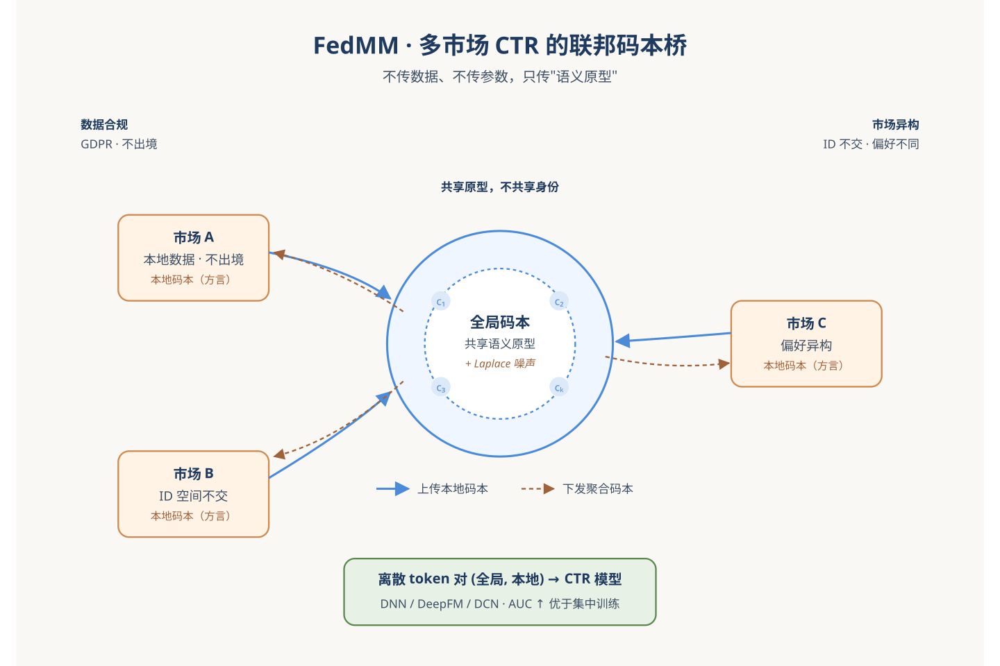
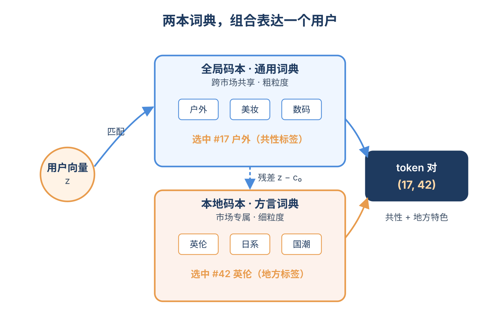
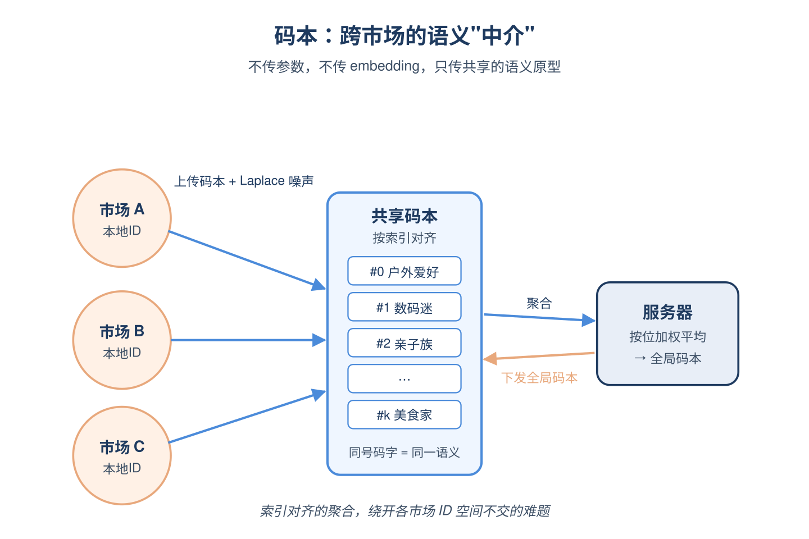
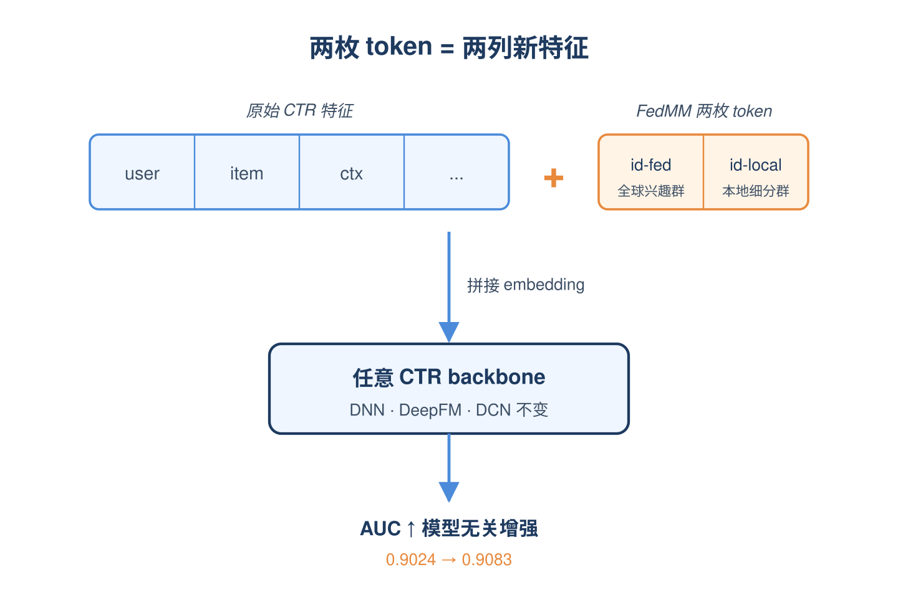
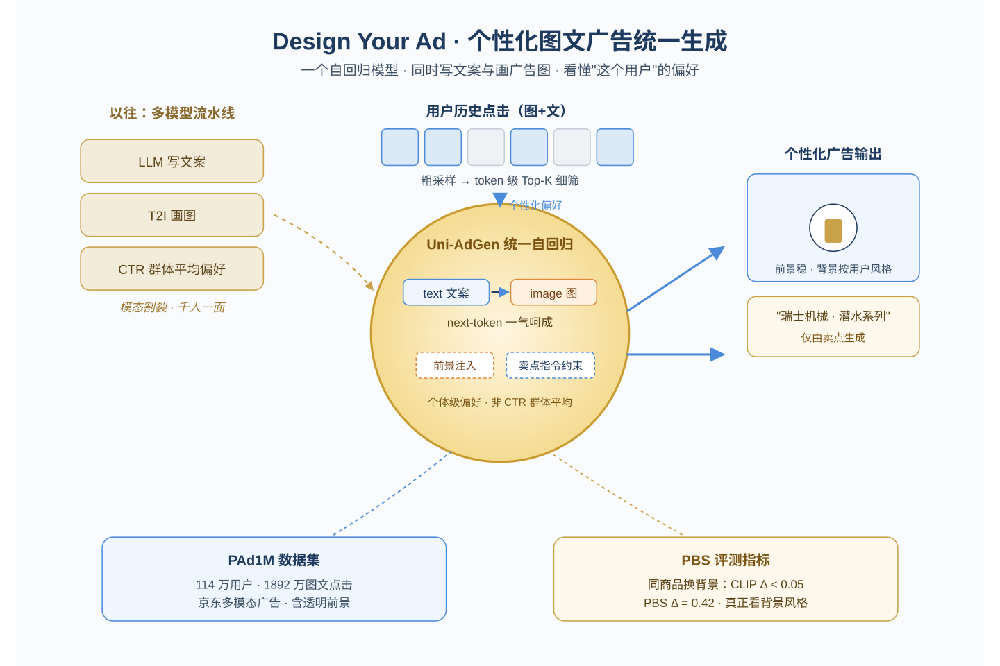
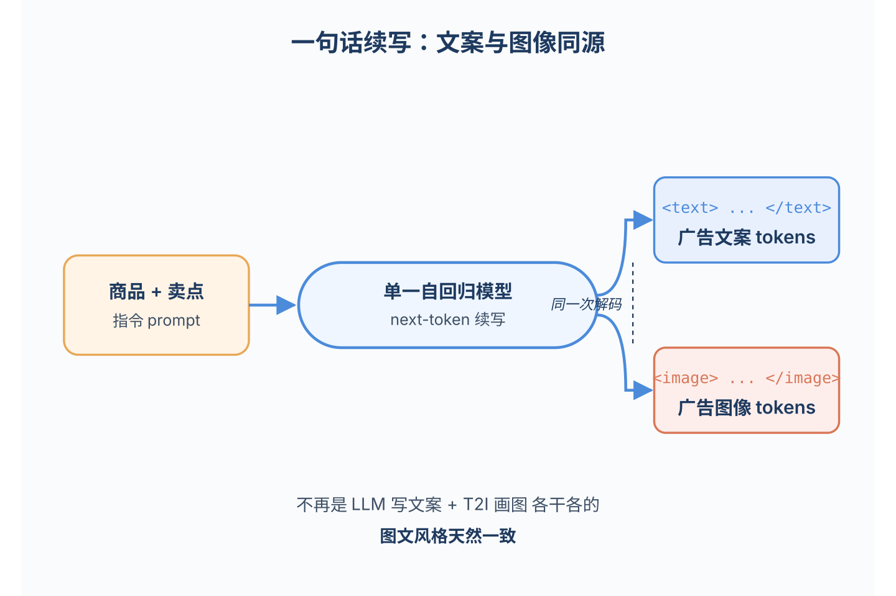
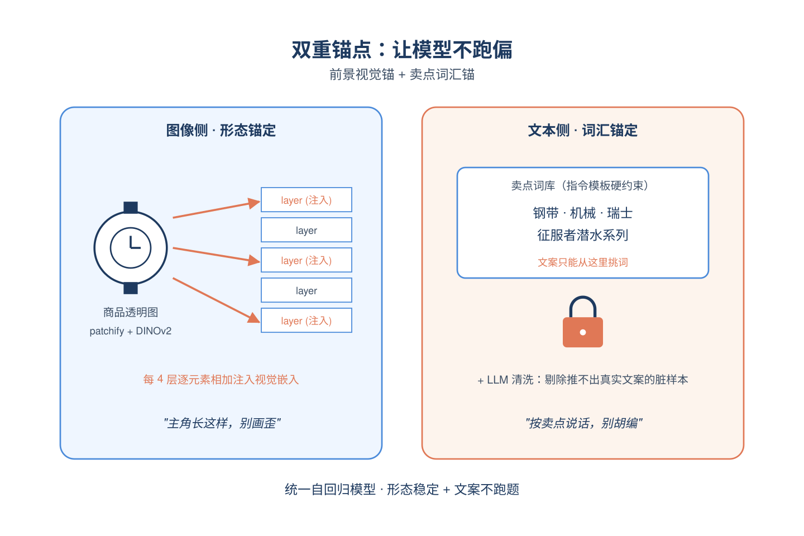
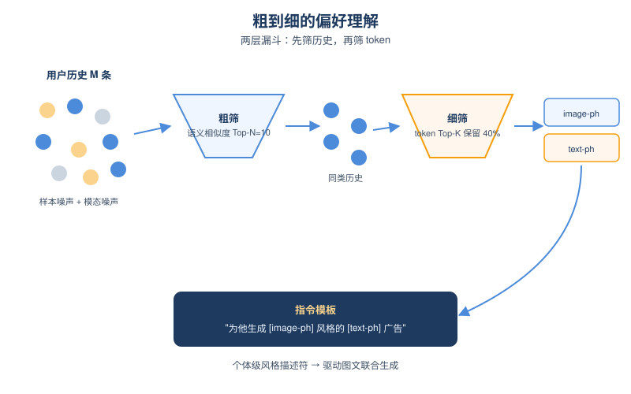
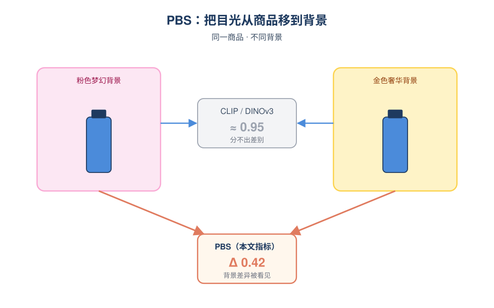

# 2026-05-13 论文日报

## 一、今日趋势与创新观察

### 1. 趋势概况

- 今天全量583篇中cs.AI 352篇、cs.LG 198篇、cs.IR仅33篇，LLM与语言理解类122篇仍是当天最大主题，研究重心仍集中在大模型能力、对齐与基准评测。
- Agent与多智能体类77篇，方向从通用研究助手扩展到推荐奖励建模(RecRM-Bench)、稠密检索(Test-Time Compute)、工具调用安全等具体业务化场景。
- 表示学习与检索排序39篇，集中在生成式推荐的语义ID与记忆增强、长文档listwise多模态重排，以及医疗/影像等领域的检索增强基础模型。
- 广告与商业化决策信号较弱，仅有FedMM联邦CTR、个性化广告图文生成等少数直命中工作，预算/约束策略类论文偏理论化。

### 2. 推荐系统 / 排序相关创新点

- FedMM提出在多市场CTR预估中以联邦协同信号量化打通跨市场表达，避免直接共享原始数据，是广告侧少见的多域CTR结构化方案。
- Conditional Memory Enhanced Item Representation把条件记忆模块塞进生成式推荐的item表征中，让长尾物品在自回归生成解码时携带更稳定的历史上下文。
- Very Efficient Listwise Multimodal Reranking在长文档场景下做listwise重排的效率优化，提供了把listwise loss落到工业多模态搜索的可行路径。

### 3. 全局创新点

- Design Your Ad用统一自回归模型同时生成广告图像与文案，把创意生产从分阶段拼接整合为端到端生成，是广告创意生成的工程化新尝试。
- Test-Time Compute for Dense Retrieval提出在不动embedding模型的前提下，由agent生成检索程序并在测试时增加算力，开辟了一条用agent增强冻结表征的新范式。
- MCPShield针对LLM Agent工具调用流量做内容感知的攻击检测，把传统流量安全思路迁移到agent生态，对未来agent化推荐/广告系统的安全很有借鉴价值。

### 4. 跨论文综合观察

- FedMM、Design Your Ad、HSUGA等共同体现广告与推荐侧正从'单模型单任务'向'跨域协同+生成式表达'演化：CTR走联邦多市场、创意走统一生成、推荐走LLM层级语义对齐。
- Very Efficient Listwise Reranking、Caraman三阶段重排、MIRA多类目检索基准方向一致，都在补齐'检索-粗排-精排'链路在长文本与多类目下的工程化能力，方法上回归listwise与多阶段而非单纯端到端LLM。
- RecRM-Bench把奖励建模引入Agentic推荐，与Conditional Memory、HSUGA形成对照：前者关注agent推荐的评测与反馈信号，后者关注表征与对齐，合在一起预示推荐系统正在朝'生成-反馈-记忆'三件套的agent化结构靠拢。

## 二、今日入选论文

### 1. FedMM: Federated Collaborative Signal Quantization for Multi-Market CTR Prediction
- 挑选理由：命中广告核心词：ctr。

### 2. Design Your Ad: Personalized Advertising Image and Text Generation with Unified Autoregressive Models
- 挑选理由：命中广告核心词：advertising。

## 三、补充关注

1. **Unlocking Crowdsourcing for Ontology Matching Validation**
   - 理由：有一定相关信号，但不足以进入正式候选：matching。
2. **Quality-Aware Collaborative Multi-Positive Contrastive Learning for Sequential Recommendation**
   - 理由：有一定相关信号，但不足以进入正式候选：recommendation。
3. **HSUGA: LLM-Enhanced Recommendation with Hierarchical Semantic Understanding and Group-Aware Alignment**
   - 理由：有一定相关信号，但不足以进入正式候选：recommendation。
4. **Conditional Memory Enhanced Item Representation for Generative Recommendation**
   - 理由：有一定相关信号，但不足以进入正式候选：recommendation。
5. **MIRA: An LLM-Assisted Benchmark for Multi-Category Integrated Retrieval**
   - 理由：有一定相关信号，但不足以进入正式候选：retrieval。
6. **Debiasing Message Passing to Mitigate Popularity Bias in GNN-based Collaborative Filtering**
   - 理由：有一定相关信号，但不足以进入正式候选：debias。
7. **ORBIT: Preserving Foundational Language Capabilities in GenRetrieval via Origin-Regulated Merging**
   - 理由：有一定相关信号，但不足以进入正式候选：retrieval。
8. **ClinicalBench: Stress-Testing Assertion-Aware Retrieval for Cross-Admission Clinical QA on MIMIC-IV**
   - 理由：有一定相关信号，但不足以进入正式候选：retrieval。
9. **A Cascaded Generative Approach for e-Commerce Recommendations**
   - 理由：有一定相关信号，但不足以进入正式候选：recommendation。

## 四、重点论文精读

### 1. FedMM: Federated Collaborative Signal Quantization for Multi-Market CTR Prediction
- **为什么值得看：** 用码本做联邦聚合解决多市场CTR的隐私和ID不对齐难题
- **背景：** 亚马逊、Netflix这类平台要在多个国家做CTR预估，但GDPR等法规禁止把各市场原始数据汇总到中央服务器。直接用FedAvg等联邦方法又会遇到两个麻烦：一是不同市场用户偏好差异大，强行平均参数会负迁移；二是各市场ID空间互不相交，连embedding都没法对齐聚合。这篇论文提出用'码本'作为跨市场沟通的中介，绕开了直接共享embedding或参数的难题，值得关注。

*图示：多市场CTR预估同时面临数据跨境合规、市场异构和ID空间不重叠三大痛点，FedMM用一个'联邦码本+本地码本'的离散量化思路把跨市场知识抽象成可共享的语义原型，思路新颖且对广告平台多地区部署很有借鉴意义。*

**核心技术点：**

#### 技术点 1：双层码本RQ-VAE量化
- 快速理解：用全局+本地两层离散码本把协同embedding量化成token，全局层联邦聚合、本地层各自学。

*图示：可以把全局码本想成一本所有国家通用的'购物动机词典'，本地码本是各国自己的'方言词典'。一个用户的兴趣向量先在通用词典里找到一个最接近的'通用标签'，剩下没表达完的部分（残差）再去本地方言词典里找一个补充标签。两个标签加起来就能既体现共性也保留地方特色。*

- 技术细节：每个市场先用LightGCN预训练得到用户和item的协同embedding，然后送进一个两层的残差量化变分自编码器（RQ-VAE）。第一层码本用余弦相似度找最近码字，是跨市场联邦聚合得到的全局码本，捕捉共享的粗粒度模式；用原向量减去这个码字得到残差，再过第二层本地码本，学市场专属的细粒度特征。最终把两层码字相加作为量化结果，并用重建损失加码本对齐损失共同优化。
- 通俗讲解：可以把全局码本想成一本所有国家通用的'购物动机词典'，本地码本是各国自己的'方言词典'。一个用户的兴趣向量先在通用词典里找到一个最接近的'通用标签'，剩下没表达完的部分（残差）再去本地方言词典里找一个补充标签。两个标签加起来就能既体现共性也保留地方特色。
- 例子：比如英国市场某用户的协同向量z，先在全局码本里匹配到第17号码字（代表'户外运动爱好者'这种跨市场通用模式），残差z-c0再在英国本地码本里匹配到第42号码字（代表'偏好英伦风格徒步装备'），最终该用户被表达成token对(17,42)，作为离散特征送入下游DNN/DeepFM/DCN。

#### 技术点 2：码本作为联邦传输介质
- 快速理解：只上传码本而不传梯度或embedding，既绕开ID不对齐又天然脱敏。

*图示：码本里的每个码字是大量用户embedding聚类后的'语义原型'，本身已经把个人信息抽象掉了，相当于只共享'有这么一类人喜欢户外'这种统计概念，而不是某个具体用户的画像。索引对齐的聚合保证了不同市场第j号码字代表的语义是同一类，避免了ID不对齐带来的对齐难题。*

- 技术细节：传统联邦推荐要么传模型参数（市场异构会负迁移），要么传embedding（ID空间不交无法对齐）。FedMM每轮只让客户端上传第一层码本（再叠加Laplace噪声做本地差分隐私），服务器按索引位置对齐做加权平均得到全局码本下发。论文还给了一个定理：在初始化一致的前提下，本地码本聚合的梯度等价于在全部数据并集上更新码本的梯度。
- 通俗讲解：码本里的每个码字是大量用户embedding聚类后的'语义原型'，本身已经把个人信息抽象掉了，相当于只共享'有这么一类人喜欢户外'这种统计概念，而不是某个具体用户的画像。索引对齐的聚合保证了不同市场第j号码字代表的语义是同一类，避免了ID不对齐带来的对齐难题。
- 例子：比如3个市场都有一个尺寸为256的码本，每轮训练完后各自给码本加点拉普拉斯噪声上传到服务器，服务器把三方的第0号码字平均得到新的全局第0号码字，第1号同理，最后下发回去，客户端再做几轮自适应训练，让本地码本和新全局码本协调起来。

#### 技术点 3：离散token喂回CTR模型
- 快速理解：量化得到的(全局id,本地id)作为额外离散特征拼进任意CTR backbone。

*图示：相当于给原本的CTR特征表里多加了两列：一列是'这个用户在全球范围属于哪个兴趣群', 一列是'在本市场属于哪个细分群'。模型不用改结构，只是多消费两个高质量的协同信号特征，所以是模型无关的增强方案。*

- 技术细节：联邦训练收敛后冻结两层码本，对每个用户/item做一次量化推断，得到一对token (id-fed, id-local)。这两个token被当作两个新特征域，用可学习embedding层映射成稠密向量后与原始CTR特征embedding拼接，再送入DNN/DeepFM/DCN等backbone，用标准BCE loss训练。
- 通俗讲解：相当于给原本的CTR特征表里多加了两列：一列是'这个用户在全球范围属于哪个兴趣群', 一列是'在本市场属于哪个细分群'。模型不用改结构，只是多消费两个高质量的协同信号特征，所以是模型无关的增强方案。
- 例子：在4市场场景下用DCN作为backbone，加上FedMM的两个token特征后AUC从0.9024提到0.9083，远高于FedAvg的0.9023，也比集中训练的MMR方法MA(0.9059)更好。

- **对广告的启发：** 多地区/多业务线广告平台可以用'共享码本'来做跨域知识迁移而不暴露原始数据。
- **适用边界：** 适用于市场之间ID基本不交、但存在共性兴趣模式的场景；如果市场差异极大（兴趣几乎无重叠）全局码本会退化成噪声，反过来如果数据本来就能集中训练则FedMM相对集中式MMR的增益有限。
- **实践建议：** 在跨域/跨地区的精排场景里，可以先尝试用RQ-VAE把现有协同embedding量化成2层token加进特征表试一版离线AUC，再决定是否上联邦码本聚合的完整链路。

### 2. Design Your Ad: Personalized Advertising Image and Text Generation with Unified Autoregressive Models
- **为什么值得看：** 首个统一自回归模型联合生成个性化广告图文，并发布百万级数据集
- **背景：** 电商广告需要图和文案配合，但现有方法把 T2I、VLM、LLM 串成多模型流水线，模态之间不互通；个性化方面又主要靠 CTR，反映的是群体平均偏好，无法贴合单个用户。论文提出用一个统一的自回归模型同时生成图文广告，并从用户历史点击行为里抽个性化偏好。值得关注的点是：它是第一个把广告图文联合生成 + 个体级偏好建模做到一起的工作，还配了一个百万级数据集和针对广告背景相似度的新指标。

*图示：这是一篇直接面向电商广告创意生成的论文，提出用单一自回归模型同时生成广告图和广告文案，并显式建模用户历史点击行为做个性化，还发布了百万级用户的图文广告数据集 PAd1M 和新评测指标 PBS，对广告创意自动化方向有较强参考价值。*

**核心技术点：**

#### 技术点 1：图文统一自回归生成
- 快速理解：用一个自回归模型 next-token 同时吐广告文案和广告图 token

*图示：可以理解成把'写文案'和'画图'当成同一句话的两段来续写：模型先看到商品描述和卖点，被特殊标记引导着先续写一段广告文案 token，再续写一段图像 token；这样图像和文字是在同一次解码里被同一个模型决定的，自然会保持风格一致，不像以前那样 LLM 写一套、T2I 画一套各干各的。*

- 技术细节：Uni-AdGen 基于 Janus-Pro 7B 这种视觉语言自回归架构，把任务定义、商品描述、卖点拼成一段指令，再用 \<text\>\</text\>、\<image\>\</image\> 这些特殊标记圈出文本段和图像段，模型按 next-token 方式先吐文案 token 再吐图像 token，图像 token 通过 VQ-GAN 解码成像素。训练目标就是文本 token 的对数似然加图像 token 的对数似然之和，两个权重都设成 1，端到端联合优化。
- 通俗讲解：可以理解成把'写文案'和'画图'当成同一句话的两段来续写：模型先看到商品描述和卖点，被特殊标记引导着先续写一段广告文案 token，再续写一段图像 token；这样图像和文字是在同一次解码里被同一个模型决定的，自然会保持风格一致，不像以前那样 LLM 写一套、T2I 画一套各干各的。
- 例子：比如输入是商品'KUYURA 香氛沐浴露 550ml'的描述和卖点，模型先在 \<text\>...\</text\> 段里输出'KUYURA 持久香氛保湿沐浴露 550ml'这样的文案 token，紧接着遇到 \<image\> 标记开始输出图像 token 序列，再被 VQ-GAN 解码成一张包含该沐浴露、风格匹配文案调性的广告图。

#### 技术点 2：前景感知 + 指令微调控制
- 快速理解：靠商品透明图和卖点列表把图文牢牢拴在真实商品上

*图示：图像那边相当于每隔几层就把商品本体的视觉特征再喂一次给模型，提醒它'主角长这样别画歪'；文案那边则通过模板硬约束模型只能从给定卖点里挑词，再加上数据清洗，让模型学到一种稳定的'按卖点说话'的习惯。结果就是图里商品形态稳定，文案不胡说卖点。*

- 技术细节：为了避免自回归模型乱画乱写，图像侧加了前景感知模块：商品透明图先 patchify、过 DINOv2 编码器拿到视觉嵌入，再经 MLP 控制序列层对齐到自回归模型的隐空间，每隔 4 层在解码器 token 上做逐元素相加注入。文本侧用指令微调，模板里强调'文案只能用提供的卖点里的词'，再用 LLM 把训练集中卖点推不出真实文案的脏样本清掉。
- 通俗讲解：图像那边相当于每隔几层就把商品本体的视觉特征再喂一次给模型，提醒它'主角长这样别画歪'；文案那边则通过模板硬约束模型只能从给定卖点里挑词，再加上数据清洗，让模型学到一种稳定的'按卖点说话'的习惯。结果就是图里商品形态稳定，文案不胡说卖点。
- 例子：对一个手表商品，把透明背景的手表 PNG 切 patch、过 DINOv2，得到的视觉特征每 4 层注入解码器；同时指令模板告诉模型卖点是'钢带、机械、瑞士、征服者潜水系列'，模型生成的文案就只会围绕这几个词组合，而图里手表外形也和透明图保持一致，不会变成另一只表。

#### 技术点 3：粗到细的偏好理解
- 快速理解：先按商品相似度采历史，再用跨模态 token 级 mask 去模态噪声

*图示：用户历史里又有不相关商品（样本噪声），又有'其实只关心图风格不关心文案'这种模态噪声。粗一步先按商品语义相似度抽样，把茶几之类完全无关的历史降权；细一步则在 token 级别让模型自己决定历史里的哪些视觉 token、哪些文字 token 真正有用，用 Top-K 把不重要的扔掉。最后把筛出来的偏好 token 当作风格描述符塞回指令里，模型生成时就会沿着这个风格来。*

- 技术细节：个性化模块分两步。粗粒度：从用户的 M 条历史点击里，按历史商品文本和目标商品描述的语义相似度做重要性采样，挑出 top-N=10 条候选，权重正比于相似度（带个小 epsilon 防 0），既留相关样本也保留一定多样性。细粒度：把这 N 条历史的图和文分别过编码器，再用两个 Transformer 关联抽取器，对每个 token 用输入输出嵌入的余弦相似度打分，配合 Gumbel-Softmax + Top-K（保留前 40% token）做可微分选择，残差连 FFN 后再过一个融合 Transformer，把得到的 image-ph 和 text-ph 嵌入插回到指令模板的占位符位置驱动个性化生成。
- 通俗讲解：用户历史里又有不相关商品（样本噪声），又有'其实只关心图风格不关心文案'这种模态噪声。粗一步先按商品语义相似度抽样，把茶几之类完全无关的历史降权；细一步则在 token 级别让模型自己决定历史里的哪些视觉 token、哪些文字 token 真正有用，用 Top-K 把不重要的扔掉。最后把筛出来的偏好 token 当作风格描述符塞回指令里，模型生成时就会沿着这个风格来。
- 例子：用户点过手表、皮带、背包等十几条记录，目标是新一款浪琴手表。粗采样按文本相似度把'浪琴自动机械男表''劳力士黑湾'等真正同类的历史挑进 top-10；细抽取再从这些历史的图 token 里保留'金属表带+深色表盘'这类视觉 token，从文 token 里保留'机械、瑞士、潜水系列'这些词，融合后填进指令的 image-ph/text-ph，最终生成的广告图风格更接近他过去点过的手表广告，文案也更偏机械潜水卖点。

#### 技术点 4：PAd1M 数据集 + PBS 指标
- 快速理解：百万用户图文广告数据集，加一个对背景敏感的相似度指标

*图示：广告创意里背景风格其实非常重要，但 CLIP/DINOv3 这些通用相似度指标只盯着前景商品看，结果同一个商品配两种完全不同背景也判成几乎一样。PBS 训练时专门告诉模型'前景一样别管，背景不同就要拉开'，就把指标的注意力调到背景上。论文实测同前景不同背景时，CLIP/DINOv3/MoCov3 的相似度差距都不到 0.05，而 PBS 能拉开到 0.42。*

- 技术细节：PAd1M 来自京东，约 114 万用户、856 万商品、1892 万次图文点击，平均每个用户 16+ 条多模态历史，每个样本含目标图文、透明前景（用 Grounded SAM 抠出来）、商品描述和卖点。PBS 指标基于 MoCov3，用 68 万对'同一商品但不同背景'的图做对比训练：同图自身为正样本，同商品换背景为负样本，强调背景差异、压制前景偏置；评估时取编码器特征算余弦相似度。
- 通俗讲解：广告创意里背景风格其实非常重要，但 CLIP/DINOv3 这些通用相似度指标只盯着前景商品看，结果同一个商品配两种完全不同背景也判成几乎一样。PBS 训练时专门告诉模型'前景一样别管，背景不同就要拉开'，就把指标的注意力调到背景上。论文实测同前景不同背景时，CLIP/DINOv3/MoCov3 的相似度差距都不到 0.05，而 PBS 能拉开到 0.42。
- 例子：把同一瓶沐浴露分别放在粉色梦幻背景和金色奢华背景里，CLIP 都给到 0.95 以上几乎不区分，PBS 则给出明显不同的分数，从而能在评测个性化广告时真正反映出'这个用户偏好粉色场景'被生成出来没有。

- **对广告的启发：** 可作为电商广告图文一体化生成 + 个体级偏好建模的参考范式
- **适用边界：** 方法重度依赖用户长历史和卖家提供的透明图、卖点等结构化信息，在历史稀疏、品类杂乱或缺少前景抠图的场景下个性化效果会明显下降；自回归图像解码的速度也限制了在高 QPS 在线广告链路里的直接落地。
- **实践建议：** 可以先把'粗到细偏好建模'这一思路迁到现有创意生成链路：用商品语义相似度先筛用户历史素材，再在图/文 embedding 上做 token 级或字段级筛选当作 prompt 注入，看能否在不改主模型的前提下提升个性化点击率。
