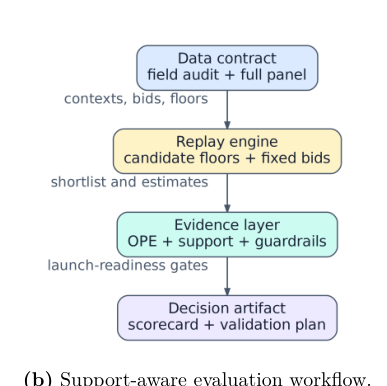
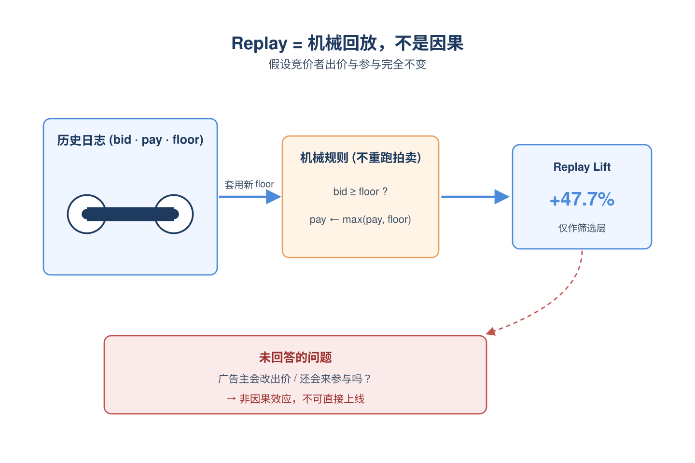
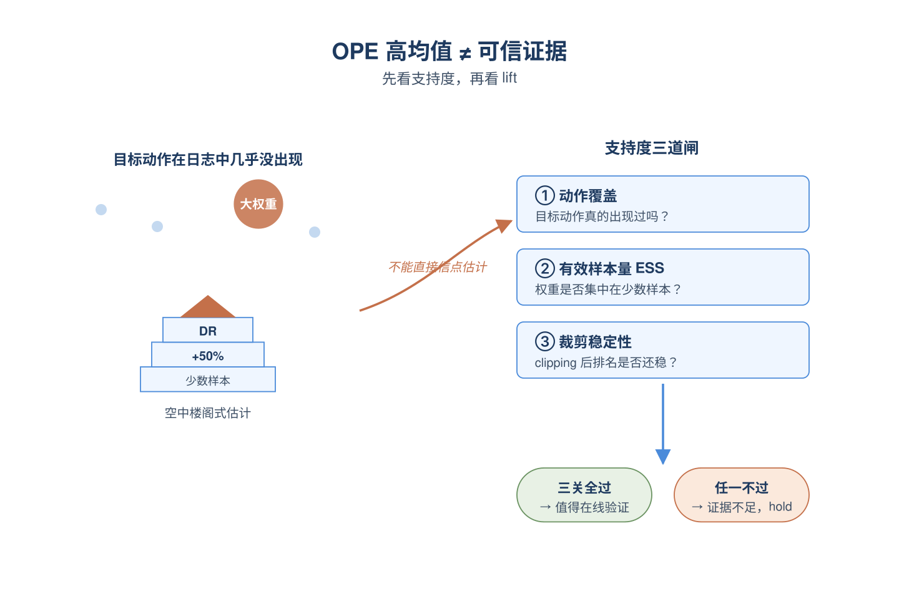
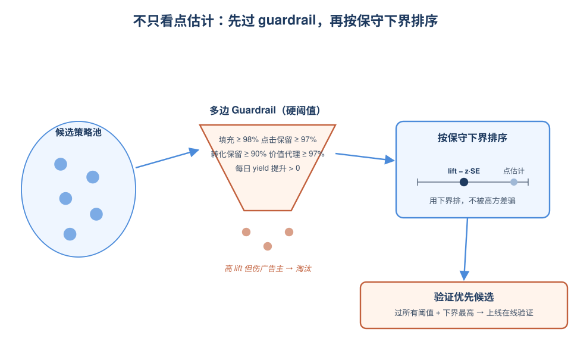
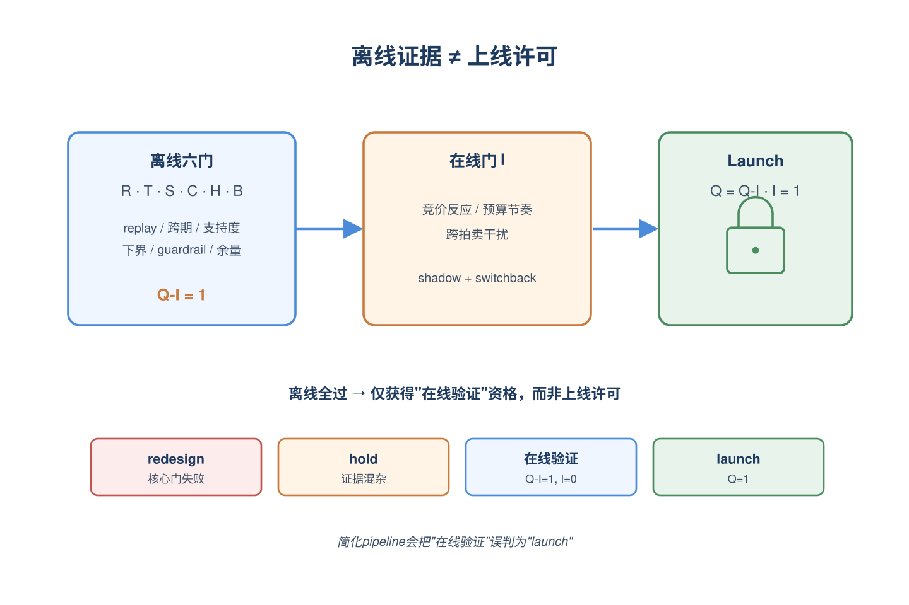
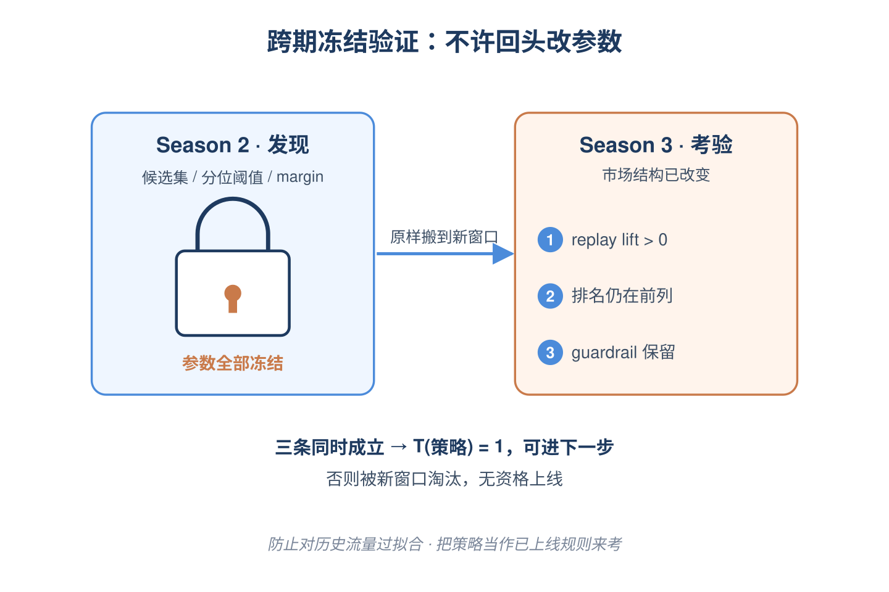
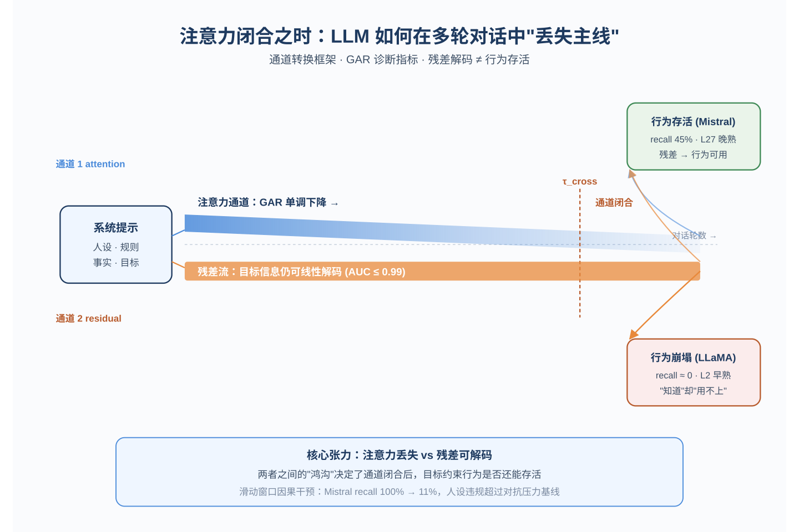
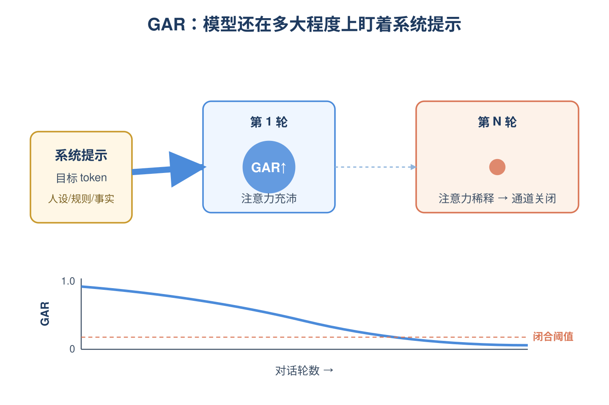
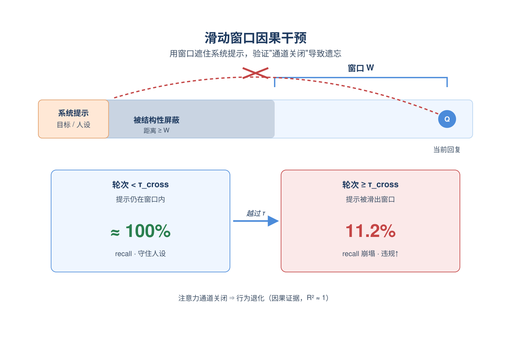
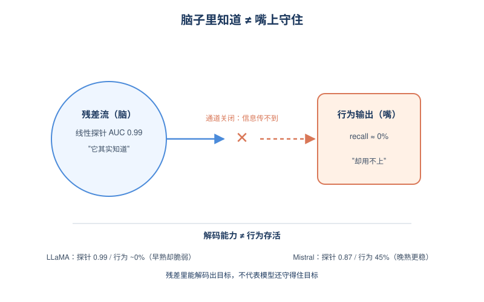

# 2026-05-14 论文日报

## 一、今日趋势与创新观察

### 1. 趋势概况

- 今天全量474篇中cs.AI 253篇、cs.LG 202篇、cs.IR仅19篇，LLM与语言理解（177篇）仍是绝对重心，主题集中在多轮对话稳定性、推理扩展和RAG事实性。
- Agent与多智能体维持高位（93篇），重点从单体推理转向工具调用、技能复用与web search agent生态（如EcoGEO、ReTool-Video、MMSkills）。
- 表示学习与检索排序（138篇）出现明显的"生成式推荐工程化"信号：包含训练加速系统、SID解码蒸馏、统一召回-排序的RL方案。
- 直接广告信号仅2篇，但商业化决策与资源优化类论文（36篇）开始用LLM agent视角重新包装预算/调度问题，迁移到广告链路的潜力较大。

### 2. 推荐系统 / 排序相关创新点

- TurboGR针对生成式推荐的Transformer结构特点构建Ascend NPU加速训练系统，并在KuaiRand验证scaling行为，把GR从论文阶段推向工业训练栈。
- MLPs are Efficient Distilled Generative Recommenders指出注意力解码对SID beam expansion属于结构过度设计，用MLP蒸馏在保住生成质量的同时显著压低线上延迟，对召回-排序延迟优化是直接可迁移的技巧。
- F-GRPO提出因子化Group-Relative Policy Optimization，把候选生成和重排统一进单次自回归过程，用RL端到端联合优化，与广告召回-排序联合训练的目标高度同构。

### 3. 全局创新点

- When Attention Closes提出channel-transition账户，把多轮交互中LLM"丢失指令线索"的现象机制化为目标token的注意力通道坍缩，给长上下文/多轮排序场景的稳定性诊断提供新视角。
- Orthrus用双架构dual-view diffusion同时拿到自回归的生成保真度和扩散的并行解码速度，对生成式推荐/SID解码加速是潜在的新路径。
- KVServe针对分离式LLM serving提出service-aware的KV压缩，把KV作为跨网络/存储的显式payload来优化，对大模型推荐推理的端到端成本结构有借鉴意义。

### 4. 跨论文综合观察

- TurboGR、MLP蒸馏GR和F-GRPO三篇正从训练系统、解码结构、目标函数三个层面共同推进生成式推荐的工业落地，呈现出"GR范式工程化收敛"的清晰趋势。
- When Attention Closes的多轮注意力坍缩分析与RAG-Enhanced时效性预测可以串起来看：前者解释LLM在长交互中为什么会"忘掉规则"，后者则在搜索排序中用RAG补回时效语义，两者共同指向"LLM在排序链路里需要外部记忆+机制可解释性"的方向。
- Decision Support for Marketplace Policies（RTB floor策略离线评估）与TRIAGE（LLM在预算约束下的元认知控制）虽然一个在广告拍卖、一个在LLM调度，但都在回答同一个问题：在不能完整试错的环境里如何安全地决定策略上线，方法论上都强调反事实评估与上线就绪性。

## 二、今日入选论文

### 1. Decision Support for Marketplace Policies under Incomplete Evidence: From Replay to Launch Readiness
- 挑选理由：RTB市场reserve价/floor策略的离线评估与上线决策框架，使用iPinYou日志，直接作用于广告拍卖与商业化策略链路。

### 2. When Attention Closes: How LLMs Lose the Thread in Multi-Turn Interaction
- 挑选理由：命中强迁移信号：recall, architecture, framework。

## 三、补充关注

1. **Improving Code Translation with Syntax-Guided and Semantic-aware Preference Optimization**
   - 理由：有一定相关信号，但不足以进入正式候选：multi-objective。

## 四、重点论文精读

### 1. Decision Support for Marketplace Policies under Incomplete Evidence: From Replay to Launch Readiness
- **为什么值得看：** RTB floor策略的离线评估到上线决策完整框架，直击广告策略上线判断难题。
- **背景：** 在RTB广告市场里，调整保留价或floor会同时影响平台收入、填充率、广告主价值、预算节奏和跨拍卖竞争，离线replay或OPE算出来的提升并不等于上线安全。现有工作要么只做策略优化，要么只做off-policy估计，要么只做实验设计，缺一个把这些证据串起来、明确告诉团队'这个策略现在该不该上线'的统一协议。论文的价值在于把问题从'估计这个策略好不好'升级成'现有证据支不支持直接上线'，并在iPinYou日志上证明：简化的pipeline会选出同一个策略却错误地建议直接上线，而完整框架会建议先做在线验证。

*图示：该图是论文方法主流程的核心部分，直接展示了 support-aware evaluation workflow：从数据审计与字段检查，到 replay engine，再到 OPE/support/guardrails，最终输出决策工件与验证计划，完整体现了论文“不是只估计效果，而是做 launch-readiness 决策支持”的核心贡献。相比 page-6-block-5 的整块截图，这个候选是对方法图右半部分的干净裁剪，正文噪声更少、模块关系更清楚，更适合作为日报主图。其他候选均为分布图、校准图或结果散点图，不能代表方法框架。*

**核心技术点：**

#### 技术点 1：Replay只是机械估计
- 快速理解：把静态replay定义成bids和参与不变下的机械估计量，明确它不能等同于上线效果。

*图示：可以理解成把历史日志当成录像带回放：只看'如果当时floor抬高到新值，这次曝光还能不能赢、要付多少'，而不模拟广告主会不会因为floor高了就改出价或不来了。所以replay数字再漂亮，也只回答了'机械层面收入怎么变'，没回答'广告主和市场会怎么反应'。*

- 技术细节：论文把replay严格限制在非递减floor策略上，对每条日志只判断'在新floor下这条已成交的曝光还会不会成交、付多少'，付费用max(原付费, 新floor)机械修正，不重新跑拍卖。replay lift就是这个机械收益相对原floor基线的相对变化。论文把它定位为筛选层，而不是因果效应估计，因为它假设竞价者的出价和参与完全不变。
- 通俗讲解：可以理解成把历史日志当成录像带回放：只看'如果当时floor抬高到新值，这次曝光还能不能赢、要付多少'，而不模拟广告主会不会因为floor高了就改出价或不来了。所以replay数字再漂亮，也只回答了'机械层面收入怎么变'，没回答'广告主和市场会怎么反应'。
- 例子：比如某条曝光记录：原floor=20，广告主出价=150，成交价=80。某新策略把floor抬到100，replay会判断150\>=100仍然成交，付费修正为max(80,100)=100，于是这条贡献从80变成100；但如果原成交价是50、新floor=100，replay就直接判定不成交、贡献变0。把所有日志这样过一遍累加，就得到该策略的replay yield，论文里选中的Q75 margin-gated策略由此得到47.7%的replay lift。

#### 技术点 2：支持度感知的OPE诊断
- 快速理解：OPE不是用来出最终结论，而是配合ESS和clipping敏感性来判断证据可不可靠。

*图示：直觉是：如果新策略要做的动作在历史日志里几乎没出现过，或者只有少数几条样本权重特别大，OPE算出来的均值再高也是空中楼阁。所以论文不直接信OPE的点估计，而是先看'我有多少真实证据支撑这个策略'，证据薄就降级处理。一次评估的流程是：算DR分数变成算ESS变成对权重逐步clipping看排名是否还在前列变成排名稳定才把这条策略放进候选。*

- 技术细节：对每条日志算doubly robust分数：先用结果模型预测目标策略下的产出，再用'实际动作==目标动作'的指示函数除以logging propensity做残差修正。论文额外报告三个支持度信号：目标动作在日志中是否真的出现过、有效样本量ESS（权重平方反映集中度）、以及对权重做clipping时排名是否稳定。只有这些诊断都过关，OPE的lift才被当作'值得验证'的信号，而不是上线依据。
- 通俗讲解：直觉是：如果新策略要做的动作在历史日志里几乎没出现过，或者只有少数几条样本权重特别大，OPE算出来的均值再高也是空中楼阁。所以论文不直接信OPE的点估计，而是先看'我有多少真实证据支撑这个策略'，证据薄就降级处理。一次评估的流程是：算DR分数变成算ESS变成对权重逐步clipping看排名是否还在前列变成排名稳定才把这条策略放进候选。
- 例子：比如某策略要把floor设成q75，但日志里只有3%的曝光真的处在q75附近，ESS就会很小，权重高度集中在少数样本上；此时即使DR均值显示+50%提升，把权重clipping到不同阈值后排名剧烈波动，论文就会把它从'可上线'降级为'证据不足，需要在线验证'。

#### 技术点 3：保守下界+多边guardrail
- 快速理解：用单边下界排序代替点估计，并叠加填充、点击、转化、价值代理等多边约束。

*图示：直觉是：广告平台不能只盯收入，floor抬太狠会丢曝光、伤广告主、特定细分严重受损，单一指标上的'最优'可能在其他维度上是灾难。所以论文先用一组硬阈值把那些会打坏填充、点击、转化、广告主价值的策略直接踢出，再在剩下的策略里按保守下界排序，避免被一个高方差的点估计骗到。*

- 技术细节：排序目标不是最大lift点估计，而是lift减去标准误乘以正态分位数得到的单边下界。同时定义可行集：策略必须满足yield提升\>=0.5%、整体填充\>=98%、每日填充\>=98%、点击保留\>=97%、转化保留\>=90%、价值代理(点击+10倍转化)保留\>=97%、且每个观测日的日yield提升都为正。最后在通过guardrail的策略中选下界最大的作为'验证优先'候选。
- 通俗讲解：直觉是：广告平台不能只盯收入，floor抬太狠会丢曝光、伤广告主、特定细分严重受损，单一指标上的'最优'可能在其他维度上是灾难。所以论文先用一组硬阈值把那些会打坏填充、点击、转化、广告主价值的策略直接踢出，再在剩下的策略里按保守下界排序，避免被一个高方差的点估计骗到。
- 例子：实证里Q75 margin-gated floor的replay lift是47.7%，保守下界lift是45.8%；它同时在填充、点击、价值代理上都满足retention阈值，每天的yield lift也都为正，于是被选为'验证优先'策略。如果某个均匀加价30%的策略replay lift也很高但每日填充跌到95%，就会在guardrail这一关被直接淘汰。

#### 技术点 4：Launch-readiness决策门
- 快速理解：把所有证据折成一组二元门，最后输出launch/在线验证/hold/重设计四选一。

*图示：关键设计是：把'离线证据完备'和'真实市场响应被验证'明确分开。离线再漂亮也只能换来'去做在线验证'的资格，绝不直接给上线许可——因为竞价者反应、预算节奏、跨拍卖干扰这些事在静态日志里根本看不到。每条策略走完所有门后会得到一个明确的下一步动作，而不是一个含糊的提升数字。*

- 技术细节：论文定义六个离线门(replay为正R、跨期稳定T、支持度足够S、保守下界为正C、guardrail全过H、抗竞价反应余量足B)和一个在线门(干扰已通过shadow logging+switchback等设计验证I)。Q-I=R·T·S·C·H·B表示'离线全过'，Q=Q-I·I表示'离线+在线都过'。决策映射：Q=1变成launch；Q-I=1且I=0变成在线验证；证据混杂可诊断变成hold；核心测量或guardrail失败变成redesign。
- 通俗讲解：关键设计是：把'离线证据完备'和'真实市场响应被验证'明确分开。离线再漂亮也只能换来'去做在线验证'的资格，绝不直接给上线许可——因为竞价者反应、预算节奏、跨拍卖干扰这些事在静态日志里根本看不到。每条策略走完所有门后会得到一个明确的下一步动作，而不是一个含糊的提升数字。
- 例子：在iPinYou实证里，Q75 margin-gated floor过了R(replay+47.7%)、T(season3外推+43.9%且排名保持)、S、C(下界+45.8%)、H(全部guardrail通过)、B；但因为公开日志没有真实logging propensity也没做switchback，I=0，所以Q-I=1而Q=0，最终决策是'在线验证'而不是launch。论文专门做了消融：只看replay、只看OPE、只看guardrail、只看holdout的简化pipeline都会选出同一个策略却错误地推荐直接上线。

#### 技术点 5：跨期冻结策略验证
- 快速理解：把策略类、阈值都冻死在season2，再去season3 replay看是否还稳。

*图示：这一步是为了防止'对历史窗口过拟合'：如果一个策略只是在season2这个特定流量结构下显得好，到season3市场组成变了就崩了，那它根本没资格谈上线。冻结意味着分析师不能偷偷换阈值，相当于把策略当成已上线的固定规则去考验它在新窗口上的表现。*

- 技术细节：在discovery窗口(season2)定下候选集合、quantile阈值、margin门限后全部冻结，不允许在season3上重新调参，然后在season3 replay计算lift、排名和guardrail retention。跨期门T(策略)要求三件事同时成立：season3的replay lift\>0、排名仍在前列、所有监控guardrail的retention仍在阈值以上。
- 通俗讲解：这一步是为了防止'对历史窗口过拟合'：如果一个策略只是在season2这个特定流量结构下显得好，到season3市场组成变了就崩了，那它根本没资格谈上线。冻结意味着分析师不能偷偷换阈值，相当于把策略当成已上线的固定规则去考验它在新窗口上的表现。
- 例子：season3的曝光量只有season2的约20%、填充率却更高，市场结构明显不同。Q75 margin-gated在这种偏移下replay lift仍有43.9%、曝光和价值代理保留率都没掉，T(策略)=1；如果换成某个对原始floor分位非常敏感的策略，可能在season3排名直接掉出前列，T(策略)=0而被卡住。

- **对广告的启发：** 给广告平台的策略评审一个可直接落地的'是否够格上线'判定模板。
- **适用边界：** 论文实证用的是公开iPinYou日志，没有真实的logging propensity和广告主反应数据，所以OPE和干扰部分只能当诊断而非因果证据；策略类被刻意限制在可解释的floor规则上，对复杂学习型定价策略的迁移性未验证。
- **实践建议：** 把自家广告策略上线评审改造成'离线门 + 在线门'两段式：离线只能换到'做在线实验'的资格，强制要求保守下界排序+多边retention guardrail+跨期冻结replay，并把switchback或shadow logging作为真正launch前的必经一关。

### 2. When Attention Closes: How LLMs Lose the Thread in Multi-Turn Interaction
- **为什么值得看：** 用注意力-残差双通道解释多轮对话中目标遗忘，对长会话广告场景有迁移价值
- **背景：** 大模型在单轮指令下表现很好，但在长多轮对话中会渐渐忘记系统提示里写的人设、规则、参考事实。以往工作只是观察到这种行为退化，没解释为什么。本文提出'通道转换'框架：随着对话变长，生成token对系统提示中目标token的注意力会逐渐衰减直到几乎为零，此时模型能否还守住目标，取决于残差流是否提前把目标信息编码进去了。这个机制对所有依赖系统提示约束的长会话场景都有意义。

*图示：广告系统正越来越多依赖多轮对话Agent（智能客服、长会话推荐、内容生成），但长对话中模型会逐渐丢失系统提示里的目标、人设和合规约束。这篇论文不只是行为观察，而是机制层面解释了'为什么会忘'，并给出可量化的诊断指标和干预方法，对设计稳健的对话型广告系统有直接启发。*

**核心技术点：**

#### 技术点 1：目标可达性比率GAR
- 快速理解：用生成token对系统提示目标token的平均注意力质量，量化目标是否还'被看见'

*图示：可以把GAR想象成'模型现在还在多大程度上盯着开头的指令看'。第一轮模型几乎全神贯注盯着系统提示，GAR很高；随着对话变长，注意力被中间一堆用户问答稀释，GAR数值持续下降；当它降到接近零时，模型其实已经'看不到'最初的指令了，后面能不能守规矩就只能靠它早期是否把指令'记进脑子'（残差流）。*

- 技术细节：GAR定义为：把所有层、所有注意力头中、当前回复token指向系统提示里目标token的注意力权重加起来，再用'最大可能值'归一化，得到一个0到1之间的数。论文把它作为诊断指标，跨10个架构都观察到GAR随着轮数单调下降（Mann-Kendall检验p\<10 -7）。每个模型有一个'闭合阈值'，GAR降到该阈值以下就视为注意力通道关闭，目标token实际上已经访问不到了。
- 通俗讲解：可以把GAR想象成'模型现在还在多大程度上盯着开头的指令看'。第一轮模型几乎全神贯注盯着系统提示，GAR很高；随着对话变长，注意力被中间一堆用户问答稀释，GAR数值持续下降；当它降到接近零时，模型其实已经'看不到'最初的指令了，后面能不能守规矩就只能靠它早期是否把指令'记进脑子'（残差流）。
- 例子：比如系统提示里写了'项目代号是Aurora Borealis、预算420万美元'等5条事实。第1轮问'代号是什么'，模型注意力大量集中在这几条事实token上，GAR较高，回答完全正确；到第40轮再问，GAR几乎降到噪声水平，模型对原始事实token的注意力质量趋近0，这时回答是否还正确就取决于其他通道。

#### 技术点 2：滑动窗口因果干预
- 快速理解：强行用窗口遮挡，让目标token在某一轮起被注意力屏蔽，验证因果关系

*图示：他们想证明'GAR下降导致行为退化'是因果关系，于是做了一个干净实验：人为用滑动窗口把开头的指令完全遮住，看模型表现会不会就在这一刻崩。结果Mistral在控制复杂度的20事实任务上，τcross之前recall还是接近100%，越过τcross后逐步崩到11.2%；人设违规率甚至超过了主动施加对抗压力的基线。这说明注意力通道关闭本身就足以引发失败。*

- 技术细节：作者在推断时给注意力加一个滑动窗口mask，只允许查询位置看到自己前面W个token以内的位置。当对话推进到某一轮，回复token的位置距离系统提示已经超过W时，所有目标token都被遮挡，注意力通道结构性关闭。关键是这个交叉轮τcross可以用'回复位置-目标最后位置\>=W'精确预测，五点扫窗实验显示拟合R²≈1。
- 通俗讲解：他们想证明'GAR下降导致行为退化'是因果关系，于是做了一个干净实验：人为用滑动窗口把开头的指令完全遮住，看模型表现会不会就在这一刻崩。结果Mistral在控制复杂度的20事实任务上，τcross之前recall还是接近100%，越过τcross后逐步崩到11.2%；人设违规率甚至超过了主动施加对抗压力的基线。这说明注意力通道关闭本身就足以引发失败。
- 例子：Mistral-7B设W=4096，根据token消耗计算τcross=23。前22轮表现完美，第23轮起开头的5条/20条事实被结构性屏蔽。第50轮做'一次性回忆'测试，5事实任务recall从100%掉到45%，20事实任务掉到11%；同时人设违规率从0.08升到0.48，超过对抗用户压力下的0.35基线。

#### 技术点 3：残差流线性探针
- 快速理解：用线性分类器在残差流上预测每条样本最终是否答对，揭示信息已被'内化'但不一定能用

*图示：线性探针就像问：'即使模型嘴上答错了，它脑子里其实知不知道答案？'结果发现四个模型脑子里都'知道'，但有的能把这份知识用到嘴上，有的用不上。更有趣的是不同架构信息出现在不同深度：LLaMA第2层就编码完成（早熟），Mistral要到第27层才出现（晚熟），Mixtral则在中层有个相变跳跃。这说明'残差能解码到信息'和'模型还能听话'是两回事。*

- 技术细节：对每个架构，在第一个'后交叉轮'选取回复前一个位置的残差激活，先做PCA降到50维再训练LDA二分类器，预测该episode最终是否能recall成功，留一交叉验证。结果四个架构的峰值AUC分别达到0.99(LLaMA L2)/0.98(Qwen L11)/0.99(Mixtral L21)/0.87(Mistral L27)，但输入嵌入层(L0)是随机水平。关键发现是：'残差能解码'不等于'行为能守住'——LLaMA残差AUC=0.99却几乎完全崩盘，Mistral残差AUC较低反而行为保留得最好。
- 通俗讲解：线性探针就像问：'即使模型嘴上答错了，它脑子里其实知不知道答案？'结果发现四个模型脑子里都'知道'，但有的能把这份知识用到嘴上，有的用不上。更有趣的是不同架构信息出现在不同深度：LLaMA第2层就编码完成（早熟），Mistral要到第27层才出现（晚熟），Mixtral则在中层有个相变跳跃。这说明'残差能解码到信息'和'模型还能听话'是两回事。
- 例子：对LLaMA-3.1-8B在闭通道下第20轮的残差，第2层激活就能用一个线性分类器以AUC 0.99预测出'这条对话最后5事实recall能不能过'，但实际行为recall几乎是0%——信息明明在那，模型却用不上；而Mistral虽然探针AUC只有0.87，行为recall却能保留45%。这种'解码能力'与'行为存活'之间的差距，就预测了模型在通道关闭后是否还守得住目标。

- **对广告的启发：** 对话型广告Agent要监控对系统提示的注意力衰减，并把关键约束在前几轮显式重申或写进上下文不同位置
- **适用边界：** 实验局限于50轮以内、四个结构化任务和四个主架构，对开放式闲聊、目标动态演变、状态空间模型等未验证；GAR需要可清晰圈出的目标token集合，对模糊约束适用性弱。
- **实践建议：** 在自家对话型广告/客服Agent上加一个轻量GAR监控：定期统计回复token对系统提示中关键约束token的平均注意力，画出随轮数曲线，看是否在某一轮快速跌到噪声水平，再据此设计'关键约束重注入'策略或会话重启阈值。
