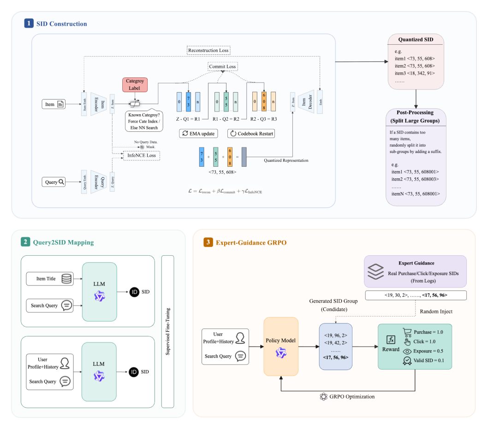
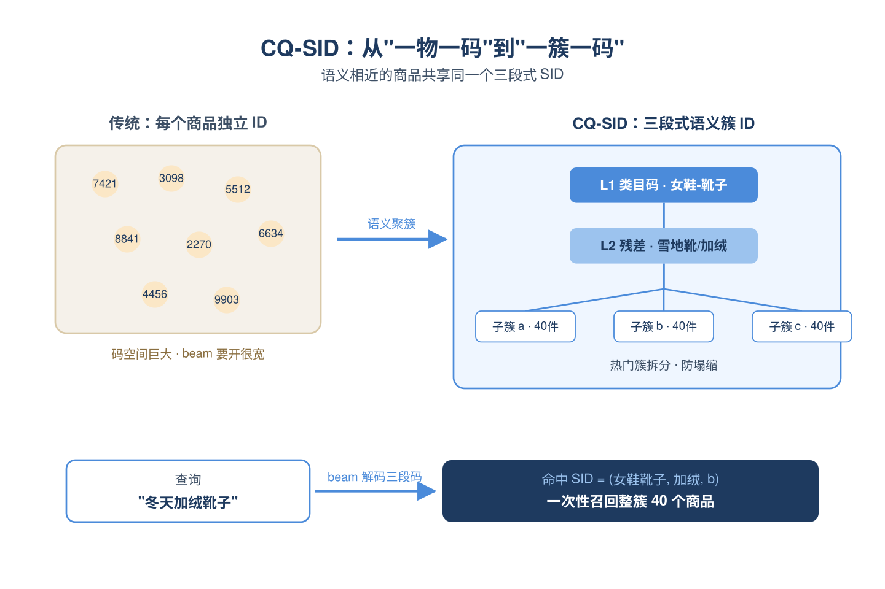
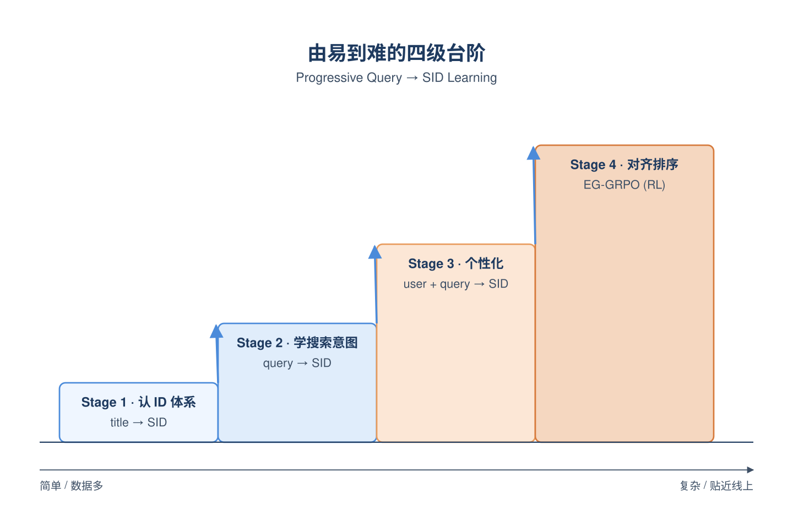
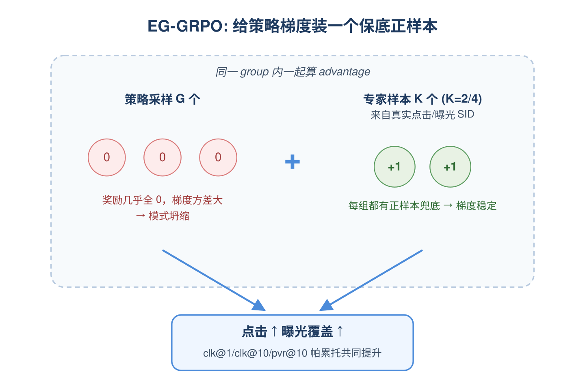
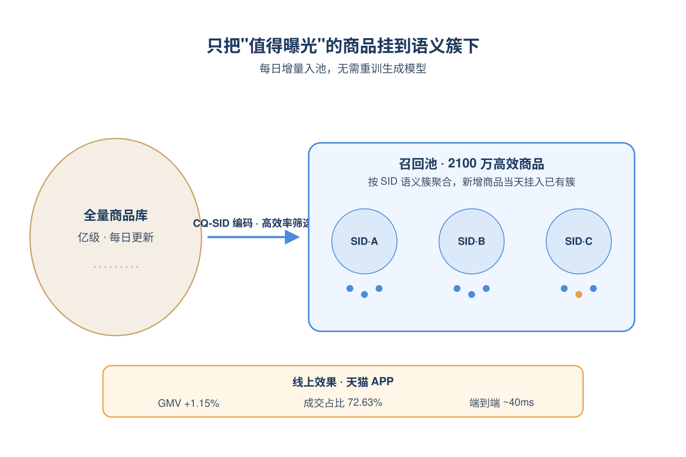
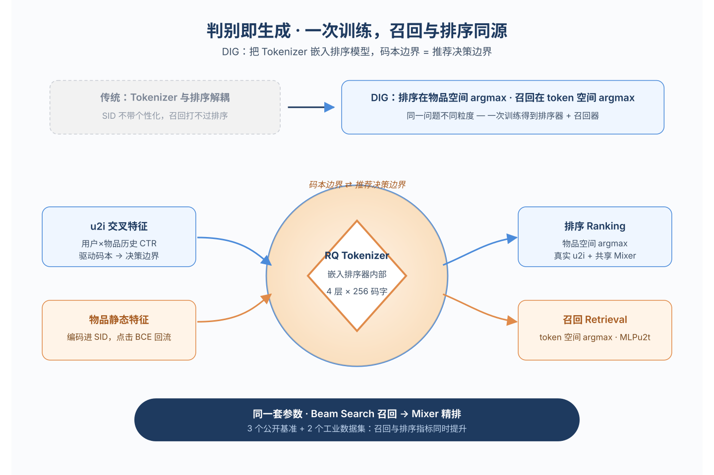
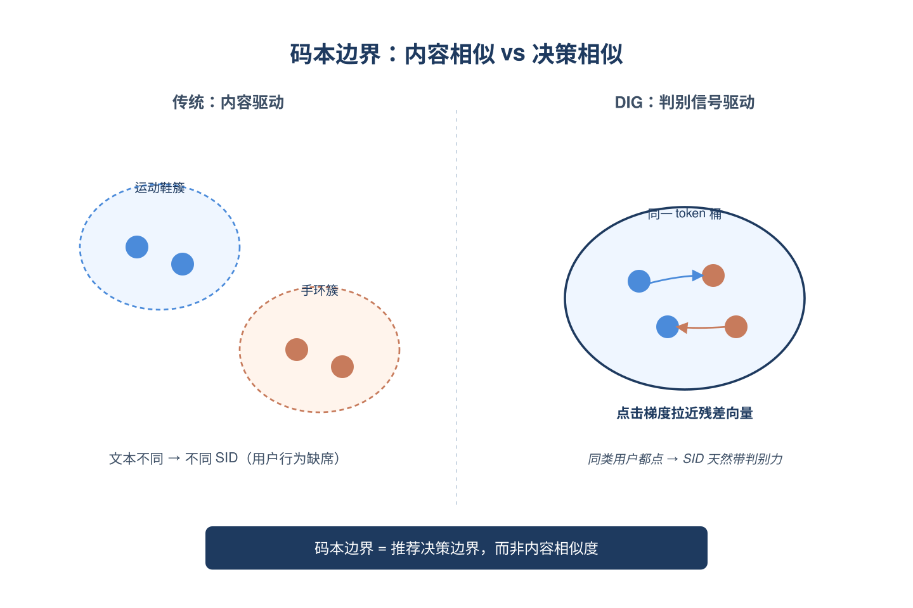
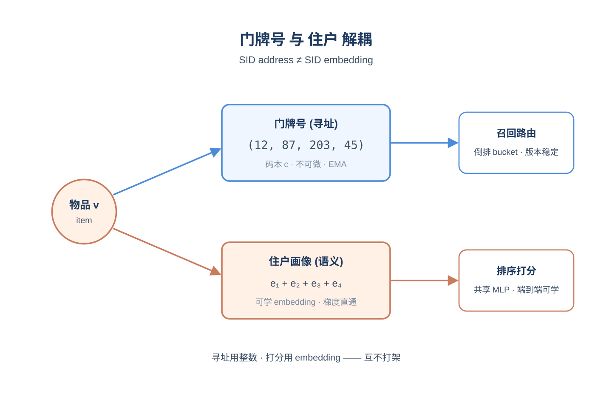
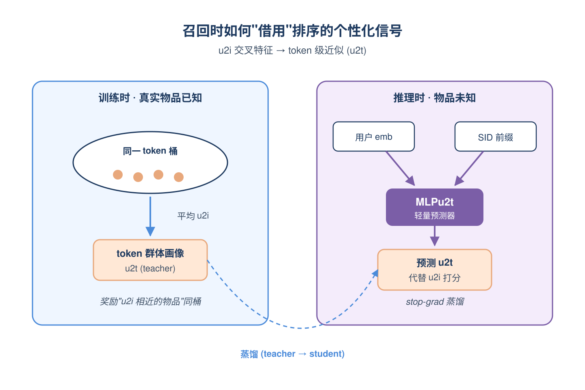
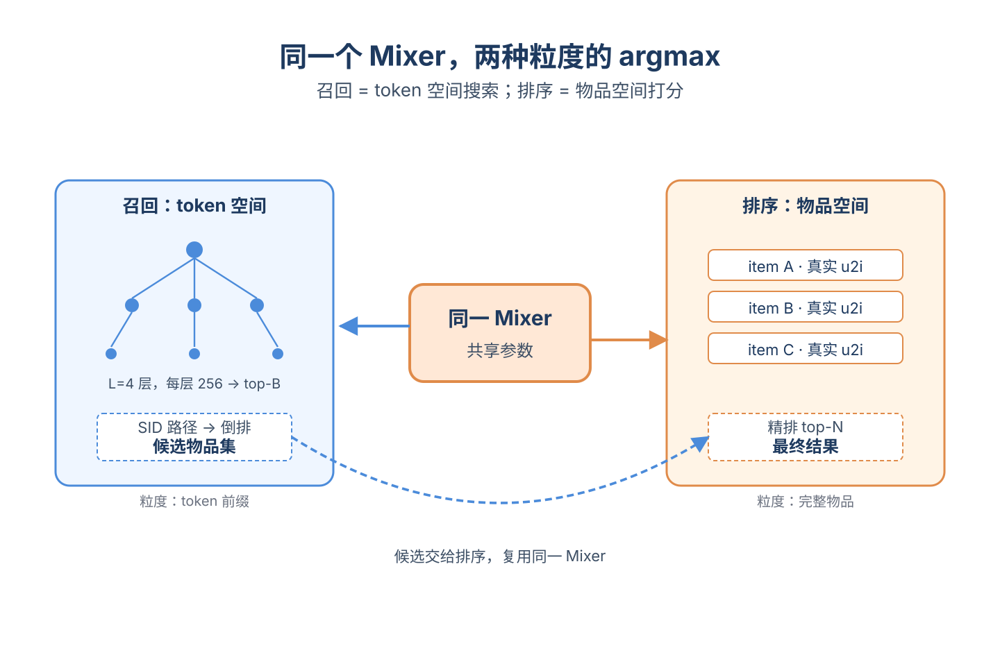

# 2026-05-15 论文日报

## 一、今日趋势与创新观察

### 1. 趋势概况

- 今天全量抓取452篇，cs.AI 283篇、cs.LG 155篇、cs.IR仅14篇，LLM与语言理解（195篇）依然是最大主题，研究重心延续在大模型推理、生成与上下文处理。
- Agent与多智能体保持高位（107篇），从单体能力转向自演化记忆架构（EvolveMem）、多智能体对抗鲁棒性（GAMBIT）、Agent设计模式二维框架等系统化议题。
- 表示学习与检索排序（113篇）今天集中爆发出多篇生成式推荐/检索工作，将tokenizer、Semantic ID与排序统一，是当天最聚焦的方法论方向。
- 迁移与跨域泛化（73篇）热度上升，伴随OPE logging策略、因果连续处理基础模型、censored库存ICL等评估与决策类研究增多。

### 2. 推荐系统 / 排序相关创新点

- 《Discrimination Is Generation》从tokenizer视角把召回和排序统一在同一生成空间，将个性化信号注入Semantic ID构造过程，是召排一体化的新颖切入。
- 天猫《Efficient Generative Retrieval for E-commerce Search》用语义簇ID替代纯离散ID，并通过专家引导RL让生成检索与下游排序目标对齐，给出工业级A/B GMV落地范式。
- 《Logging Policy Design for OPE》跳出常规"给定logging策略评估目标策略"的设定，反向设计logging policy以提升估计精度，对广告A/B与反事实评估有直接借鉴。

### 3. 全局创新点

- EvolveMem提出自演化记忆架构，把记分函数、融合策略和生成策略也纳入持续优化对象，而不是只更新存储内容，扩展了Agent记忆的可适应边界。
- 《Causal Foundation Models with Continuous Treatments》把因果基础模型从离散干预拓展到连续处理变量，为剂量–响应类决策提供通用预训练范式。
- 《Head Forcing》发现自回归视频DiT中attention头存在功能异质（局部细节/锚点/记忆），据此设计长视频生成稳定化机制，是对Transformer内部结构功能的细粒度刻画。

### 4. 跨论文综合观察

- 《Discrimination Is Generation》《Asymmetric Generative Recommendation》和天猫的电商生成式检索三篇共同指向同一趋势：用Semantic ID/tokenizer重新定义召回与排序边界，把生成式范式真正推进到工业搜索推荐链路。
- EvolveMem（自演化记忆）、Agent设计模式二维框架、GAMBIT（多智能体对抗鲁棒性）从架构、抽象、安全三个层面共同回应"Agent系统该如何工程化"，反映Agent研究正在从单点能力走向系统方法论。
- Logging Policy Design、连续处理因果基础模型、censored ICL库存控制三篇虽分属OPE、因果与运筹，但都在强调"评估与决策环节本身需要被显式建模"，与单纯堆模型能力的主流形成方法论上的互补。

## 二、今日入选论文

### 1. Efficient Generative Retrieval for E-commerce Search with Semantic Cluster IDs and Expert-Guided RL
- 挑选理由：天猫电商搜索召回工业落地，含A/B GMV指标与下游排序对齐的RL，与商业化分发链路紧密。

### 2. Discrimination Is Generation: Unifying Ranking and Retrieval from a Tokenizer Perspective
- 挑选理由：统一召回与排序的端到端框架，与广告召排一体化高度同构，工业落地价值明确。

## 三、补充关注

1. **Asymmetric Generative Recommendation via Multi-Expert Projection and Multi-Faceted Hierarchical Quantization**
   - 理由：生成式推荐的语义ID改进，作者含腾讯，可作参考但与广告决策链路关系一般。
2. **SimPersona: Learning Discrete Buyer Personas from Raw Clickstreams for Grounded E-Commerce Agents**
   - 理由：电商场景买家行为建模，从点击流学习买家类型用于Agent模拟，与电商流量分发有一定关联但更偏Agent模拟方向，非广告核心链路
3. **Agentic Recommender System with Hierarchical Belief-State Memory**
   - 理由：LLM agent推荐系统，记忆机制创新，但与广告商业化决策链路距离较远。
4. **Measuring Google AI Overviews: Activation, Source Quality, Claim Fidelity, and Publisher Impact**
   - 理由：测量Google AIO对搜索流量与发布商广告收入的影响，涉及商业化生态变迁，但不是直接的广告系统优化论文。

## 四、重点论文精读

### 1. Efficient Generative Retrieval for E-commerce Search with Semantic Cluster IDs and Expert-Guided RL
- **为什么值得看：** 天猫搜索召回工业落地，生成式召回贡献过半曝光与七成成交
- **背景：** 电商搜索是典型的多级漏斗（召回-粗排-精排-重排），传统召回靠倒排和向量近邻，语义匹配差且索引维护重；近期生成式检索想用一个端到端模型直接生成物料ID，但在亿级且频繁更新的商品库、严苛延迟和与下游排序对齐方面落地困难。这篇论文不追求端到端替换，而是把生成式检索定位为召回阶段的一路补充，给出了在天猫APP真正跑起来并贡献过半曝光的工程方案，所以值得做电商召回/广告召回的同学认真看。

*图示：这是 Figure 1 的完整方法总览图，直接展示了论文核心三阶段流程：CQ-SID item encoding、progressive query-to-SID learning 和 EG-GRPO ranking alignment。该候选几乎无正文噪声，主体完整，模块边界和信息流清晰，比带更多页眉页脚和caption干扰的 page-3-block-2 更适合作为日报主图。其余候选基本是正文截图或非完整方法图，不适合代表论文核心方法。*

**核心技术点：**

#### 技术点 1：CQ-SID 语义簇ID
- 快速理解：把语义ID从一物一码改成一簇一码，类目约束首层量化加查询-商品对比学习

*图示：传统做法非要给每个商品一个独一无二的ID，码越细越难学、beam要开得越大。这里反过来，让语义相近的商品共享同一个三段式SID，相当于把检索目标从'某个具体商品'换成'某个语义簇'。前向时商品embedding先按类目落到一级码，再用残差去找二级、三级码，查询侧通过对比学习被拉到相同的语义空间，beam search时只要解码到正确的三段ID，就能一次性捞出簇里所有商品。*

- 技术细节：在RQ-VAE基础上做三层残差量化（码本大小2048×1024×1024）：第一层强制用商品的顶层类目（1711个）作为码字索引，让一级前缀天然对齐类目树；第二三层走标准最近邻量化，码本用EMA更新并加重启防塌缩。同时把商品和高置信查询塞进同一个编码器，用双向InfoNCE对齐查询与商品向量。最后做一个后处理：当一个SID下挂的商品超过阈值（如50）就把第三层index随机分组拆成多个子簇，既保留前缀层级，又防止热门簇过大。
- 通俗讲解：传统做法非要给每个商品一个独一无二的ID，码越细越难学、beam要开得越大。这里反过来，让语义相近的商品共享同一个三段式SID，相当于把检索目标从'某个具体商品'换成'某个语义簇'。前向时商品embedding先按类目落到一级码，再用残差去找二级、三级码，查询侧通过对比学习被拉到相同的语义空间，beam search时只要解码到正确的三段ID，就能一次性捞出簇里所有商品。
- 例子：比如一件'女款雪地靴'，编码时一级码被强制锁定到'女鞋-靴子'类目槽位，二级码继续按风格残差细分到'雪地靴/加绒'，三级码再细分到具体款式簇，假如该簇下有120个商品就被随机切成3个子簇各40个。线上来一个query'冬天加绒靴子'，模型beam@30就能命中这个三段ID，一次性召回该簇下的几十个商品，论文里在同beam下click hitrate相对RQ-VAE提升26.76%，beam减半还能保持召回质量。

#### 技术点 2：渐进式 Query→SID 训练
- 快速理解：用Qwen2.5-0.5B分四阶段从认ID到个性化再到对齐排序

*图示：直接让小模型从query端到端生成一串语义ID其实很难，作者把任务拆成由易到难的课程：先让模型背下'什么标题对应什么SID'，再学'什么query对应哪些SID'，再加用户画像做个性化，最后再用RL去抠点击和曝光的细节。每一阶段输入更复杂、目标更贴近线上，训练更稳。*

- 技术细节：用轻量Qwen2.5-0.5B作为生成器，分四个阶段SFT：阶段1 用(商品标题, SID)让模型先认识ID体系；阶段2 用(query, SID)，对每个query从其点击/购买商品里随机采3个SID当目标，让模型学搜索意图到语义簇的映射；阶段3 把用户性别、年龄段、最近相关类目下点击过的SID序列拼到query前面，做个性化UQ变成SID；阶段4 接EG-GRPO做与下游排序对齐的强化学习。
- 通俗讲解：直接让小模型从query端到端生成一串语义ID其实很难，作者把任务拆成由易到难的课程：先让模型背下'什么标题对应什么SID'，再学'什么query对应哪些SID'，再加用户画像做个性化，最后再用RL去抠点击和曝光的细节。每一阶段输入更复杂、目标更贴近线上，训练更稳。
- 例子：比如同样query'跑步鞋'，阶段3的输入会变成'用户:男/25-30岁；最近点击SID:（A,B,C）；query:跑步鞋'，模型生成的top-K SID会更偏向缓震款而不是女款时尚款，论文报告个性化场景下beam@1 hitrate从0.1359提升到0.1510。

#### 技术点 3：EG-GRPO 专家引导RL
- 快速理解：在GRPO的采样组里强行注入真实点击/曝光样本，避免稀疏奖励下模型坍缩到少数高置信SID

*图示：搜索日志里点击购买非常稀疏，纯GRPO时模型采出来的一组样本可能全是0奖励，梯度方差大就会让模型把概率都堆到少数几个最有把握的SID上——top1指标看着涨，但beam@10的多样性和曝光覆盖反而崩了。EG-GRPO的做法很朴素：每一组里塞几个真实正例进去，相当于给策略梯度装一个'保底正样本'，既稳定训练又强制模型保留召回宽度。*

- 技术细节：奖励按行为分层：购买1.0、点击1.0、曝光0.5、合法SID 0.1、非法0.0。组内做标准化得到advantage，然后走带clip的策略梯度。关键改动是每个group除了从当前策略采G个输出，还从该query的真实点击/曝光SID集合里抽K个（K=2或4）当作'专家样本'一起进组参与奖励和梯度计算，相当于保证每次更新都有正样本。
- 通俗讲解：搜索日志里点击购买非常稀疏，纯GRPO时模型采出来的一组样本可能全是0奖励，梯度方差大就会让模型把概率都堆到少数几个最有把握的SID上——top1指标看着涨，但beam@10的多样性和曝光覆盖反而崩了。EG-GRPO的做法很朴素：每一组里塞几个真实正例进去，相当于给策略梯度装一个'保底正样本'，既稳定训练又强制模型保留召回宽度。
- 例子：论文里K=0的纯GRPO虽然clk@1略涨但clk@10和pvr都掉了；K=2时clk@1从0.1510涨到0.1524、clk@10和exp@10、pvr@10同时上涨，实现了点击和曝光覆盖的帕累托共同提升，正好对应作者说的'缓解稀疏奖励下的模式坍缩'。

#### 技术点 4：工程化部署与池子管理
- 快速理解：把全量亿级商品过滤为约2100万的高效池子，并按日动态更新

*图示：工业落地的隐藏难点是物料每天都在变，全量编码既贵也没必要。做法是只把'值得曝光'的高效率商品入池，并按SID聚合，新增商品当天就能通过CQ-SID挂到已有语义簇下被召回，无需重训生成模型。*

- 技术细节：线上服务用动态beam（20,50,100），8张GPU撑200+QPS、端到端约40ms、可用性99.9%。召回池不是全量商品，而是从亿级商品里筛出约2100万的高效率子集挂在SID簇下，每天用CQ-SID重新对新增高效商品做编码并挂到对应簇上。
- 通俗讲解：工业落地的隐藏难点是物料每天都在变，全量编码既贵也没必要。做法是只把'值得曝光'的高效率商品入池，并按SID聚合，新增商品当天就能通过CQ-SID挂到已有语义簇下被召回，无需重训生成模型。
- 例子：线上A/B两周GMV+1.15%、UCTCVR+0.40%，生成式召回这一路最终占全召回曝光50.25%、点击58.96%、成交72.63%，说明这种'簇ID+池子日更'的组合在天猫APP已经是主力召回。

- **对广告的启发：** 广告召回可以借鉴'语义簇ID+专家引导RL'，把生成式检索做成多路召回的一路而不是端到端替换。
- **适用边界：** 方法依赖较完整的类目体系和高置信query-item行为日志，类目体系混乱或行为稀疏的场景下一级码约束和对比学习都会变弱；hitrate本身是封顶指标，三阶段SFT之后RL提升空间有限，论文里EG-GRPO的绝对增益其实较小。
- **实践建议：** 如果你在做搜索广告召回，可以先尝试在现有向量召回旁挂一路'类目约束RQ-VAE+簇ID'的生成式召回做A/B，beam先开小验证延迟，奖励函数把点击换成考虑出价和转化的组合，并参考EG-GRPO在group里注入真实曝光/点击样本以稳住训练。

### 2. Discrimination Is Generation: Unifying Ranking and Retrieval from a Tokenizer Perspective
- **为什么值得看：** 把tokenizer塞进排序模型端到端训，召排一体一次训练出两套
- **背景：** 生成式推荐用Semantic ID（SID）把物品离散化后做beam search召回，但现有tokenizer都是用重建或对比损失独立训练的，只编码物品静态特征，用户-物品交叉特征（u2i，比如用户在某品类的历史CTR）完全没参与码本构建。结果就是同一个物品对所有用户拿到同样的SID，生成式召回的个性化天花板被锁死，长期打不过判别式排序。这篇论文把'排序在物品空间找argmax，召回在token空间找argmax'看成同一个问题在不同粒度上的解，提出把tokenizer直接嵌进排序模型端到端训练，一次训练同时得到排序器和召回器，对广告召排一体化很有参考价值。

*图示：广告系统长期被召回-排序两阶段语义割裂困扰，这篇论文从tokenizer视角把判别式排序和生成式召回统一起来，一次训练得到两个模型，工业可落地性强，对广告召排一体化和Semantic ID落地都有直接借鉴。*

**核心技术点：**

#### 技术点 1：判别信号驱动SID构建
- 快速理解：把RQ量化器嵌进排序模型，用点击BCE损失端到端反向传播塑造码本边界

*图示：传统做法是先用文本embedding+RQ-VAE离线把物品切成SID，再训生成模型，码本一旦切好就和下游目标脱钩。这里反过来：码本是排序器训练时'顺便学出来'的，每一步点击预测的梯度都在告诉量化器'这两个物品对用户行为很像，应该分到一起'，所以最后切出来的token天然带判别力。*

- 技术细节：在标准DIN+DCNv2+MoE排序器的物品embedding之后插入一个残差量化（RQ）层，4层每层256码字。排序loss（点击BCE）和分层召回loss一起端到端优化，梯度可以穿过SID embedding回流到VQ encoder。这样码本边界不再反映内容相似度，而是被推向'推荐决策边界'——即把那些会被同一类用户喜欢的物品聚到同一个token桶里。
- 通俗讲解：传统做法是先用文本embedding+RQ-VAE离线把物品切成SID，再训生成模型，码本一旦切好就和下游目标脱钩。这里反过来：码本是排序器训练时'顺便学出来'的，每一步点击预测的梯度都在告诉量化器'这两个物品对用户行为很像，应该分到一起'，所以最后切出来的token天然带判别力。
- 例子：比如两个商品文本上完全不同（一个是运动鞋一个是健身手环），但点击它们的用户群高度重叠。传统tokenizer会把它们分到不同SID簇；DIG里因为同一批用户对它们的点击label相似，BCE梯度会推动量化器把它们的残差向量拉近，最终落到同一个或相邻的token bucket，beam search就能在一条路径上同时召回。

#### 技术点 2：SID地址与语义解耦
- 快速理解：SID只管寻址，另设一套可学习SID embedding承载语义，避开STE近似

*图示：可以理解为'门牌号'和'房子里住的人'分开管：门牌号（SID码字）只负责把物品路由到固定bucket，保证版本间稳定零冲突；而每个门牌号对应的'住户画像'（SID embedding）是普通可学参数，梯度直接回传，不需要近似。这样召回路径里把物品embedding直接换成SID embedding前缀和，复用同一个排序MLP。*

- 技术细节：传统RQ用码本向量本身既做argmin寻址又做下游打分，导致细分vs共享的两难，而且非可微argmin需要STE。DIG把这两件事拆开：码本向量c只用于残差量化和EMA更新负责寻址；另设一组可学习SID embedding（每层每个码字一份），它和排序物品特征embedding维度一致，端到端被判别loss训练，承载语义。一个语义重建loss把码本几何锚定到encoder输出。
- 通俗讲解：可以理解为'门牌号'和'房子里住的人'分开管：门牌号（SID码字）只负责把物品路由到固定bucket，保证版本间稳定零冲突；而每个门牌号对应的'住户画像'（SID embedding）是普通可学参数，梯度直接回传，不需要近似。这样召回路径里把物品embedding直接换成SID embedding前缀和，复用同一个排序MLP。
- 例子：物品v被量化为SID=(12,87,203,45)。寻址时只看这4个整数到倒排索引找物品；打分时取第1层的第12号SID embedding + 第2层第87号 + 第3层第203号 + 第4层第45号求和，得到一个和原物品embedding同维度的向量，喂进排序MLP得到分数。整个过程不经过码本向量c，所以梯度顺畅。

#### 技术点 3：u2i特征的两阶段处理
- 快速理解：训练时用batch内token桶平均的u2t隐式塑造码本，推理时用MLPu2t蒸馏还原

*图示：排序能用'你在运动品类点击率20%'这种细粒度信号，召回时却没有具体物品，只有正在生成的token。论文的trick：训练时假装我已经知道这个token里大概住着哪些物品，把它们的u2i平均一下当成token的'群体画像'喂给模型；推理时这个群体画像由一个小MLP根据用户和SID前缀实时预测出来。这样召回路径也能用上类似排序的个性化交叉信号。*

- 技术细节：用户-物品交叉特征c-uv（如用户对该品类历史CTR）是排序的核心优势，但召回时target物品未知，u2i不可用。论文做法：训练时在每个mini-batch里，把落到同一token桶的物品的c-uv求平均，得到token级u2t特征喂给召回路径，让召回loss隐式奖励量化器'把u2i相近的物品分到同桶'；推理时训练一个轻量MLPu2t，输入用户embedding和已生成的SID前缀，输出对u2t的预测，作为c-uv的token级近似。MLPu2t用batch平均做teacher、stop-gradient蒸馏。
- 通俗讲解：排序能用'你在运动品类点击率20%'这种细粒度信号，召回时却没有具体物品，只有正在生成的token。论文的trick：训练时假装我已经知道这个token里大概住着哪些物品，把它们的u2i平均一下当成token的'群体画像'喂给模型；推理时这个群体画像由一个小MLP根据用户和SID前缀实时预测出来。这样召回路径也能用上类似排序的个性化交叉信号。
- 例子：beam search第2步要给候选token=87打分。模型先把用户embedding和已选的token=12的SID embedding拼起来送进MLPu2t，输出一个6维向量（对应6个u2i特征），近似'这个用户对token 87桶里那一类商品的历史CTR/曝光数等'。这个向量替代真实c-uv进入共享排序MLP打分，从而保留个性化分辨力。

#### 技术点 4：统一推理的beam search
- 快速理解：召回和排序共用同一个MLP，召回路径直接逐层beam search出token序列

*图示：传统两阶段召回和排序是两个独立模型，目标和打分函数都不一样，存在语义gap。这里召回搜索的'目标'就是排序MLP在token空间的选择分数最高的方案，二者天然对齐：召回挑出来的就是排序也会打高分的候选，只是粒度从物品退化到token。*

- 技术细节：推理时召回路径每层对K=256个token打分：输入是用户embedding（共享BN）+当前SID前缀embedding（专属BN）+MLPu2t输出的近似u2t（专属BN），过同一个排序Mixer得到sigmoid分数，beam search保留top-B。L=4层走完拿到候选SID，倒排索引取出物品。排序路径对召回出的物品用真实c-uv再过同一个Mixer精排。
- 通俗讲解：传统两阶段召回和排序是两个独立模型，目标和打分函数都不一样，存在语义gap。这里召回搜索的'目标'就是排序MLP在token空间的选择分数最高的方案，二者天然对齐：召回挑出来的就是排序也会打高分的候选，只是粒度从物品退化到token。
- 例子：用户登录后，召回阶段第1层对256个一级token打分，留top 50；第2层在每个prefix下再对256打分，得50×256变成top 50；走完4层得到约50条SID路径，每条SID查倒排得若干物品，合并成候选集。排序阶段对这批候选取真实u2i特征再用同一MLP打分排序，整个链路只有一份模型参数。

- **对广告的启发：** 广告召排一体化可借鉴：把SID tokenizer嵌进CTR模型端到端训，召回口径直接对齐排序
- **适用边界：** 方法依赖训练样本里有较完整的u2i特征覆盖，KuaiRec-Big这种83%样本u2i缺失的场景增益就明显变小；当u2i是高维稠密特征时，MLPu2t的token级近似误差会放大召回-排序gap，需要更强的蒸馏模块。
- **实践建议：** 可以先在现有广告判别式排序模型的item embedding后挂一个RQ量化层，加一份分层召回BCE loss和MLPu2t蒸馏分支做离线A/B，验证'一次训练出召回+排序'在自家u2i特征体系下的真实收益和召排AUC gap。
