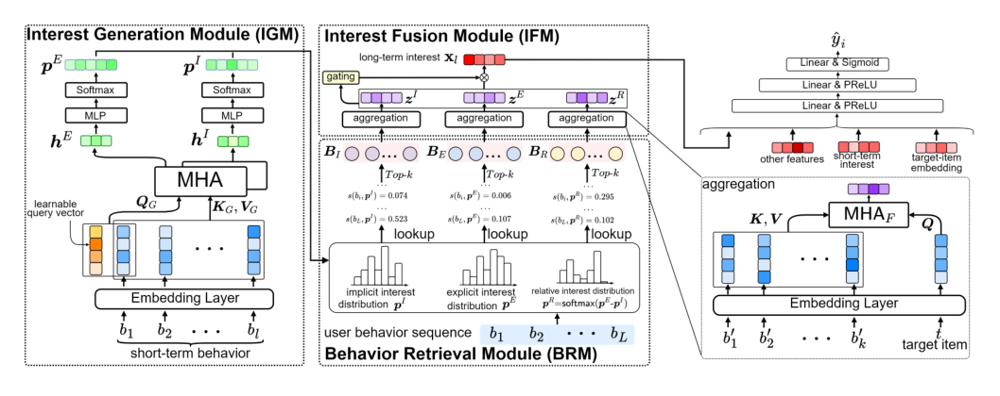
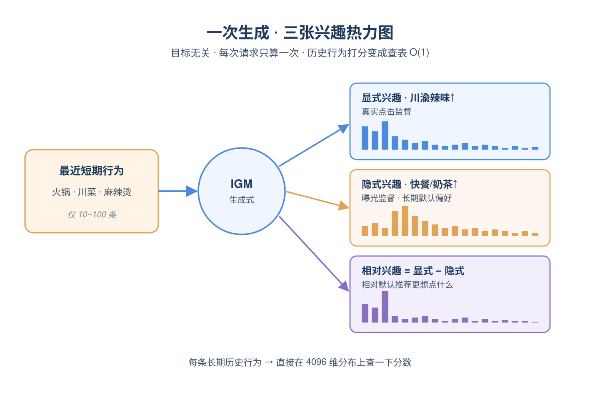
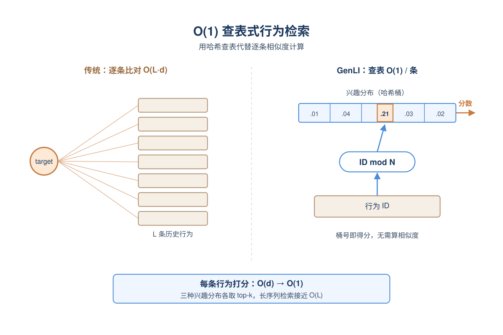
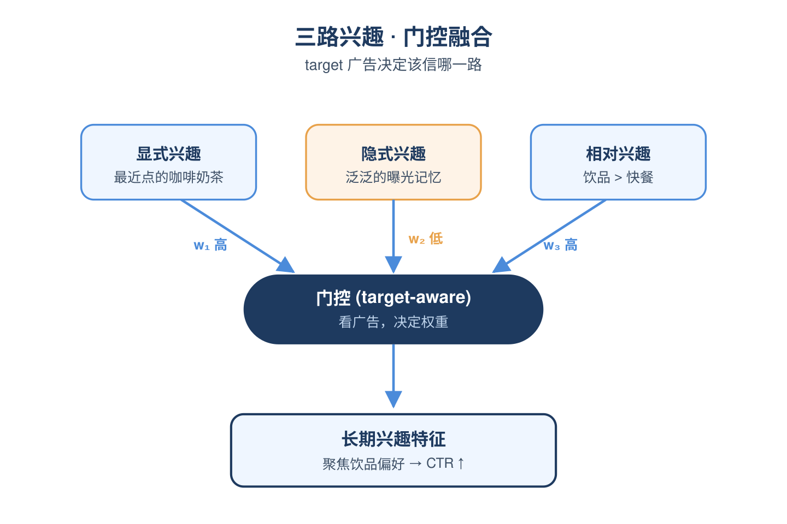

# 2026-05-18 论文日报

## 一、今日趋势与创新观察

### 1. 趋势概况

- 今天cs.AI+cs.LG+cs.IR共334篇，cs.IR只有14篇延续走低，LLM与语言理解（54篇）、Agent与多智能体（44篇）继续构成两大主线，主题从纯推理转向记忆固化（RecMem）、记忆投毒（Sleeper Memory）、Agent协作约定（paper.json）等更工程化的方向。
- 表示学习与检索排序保持中等热度（17篇），覆盖多模态视频检索（MERVIN）、十亿级量化检索加速（Ascend-RaBitQ）、公平RAG等基础设施与生成式检索议题，整体偏底层系统与公平性而非纯排序模型。
- 迁移与泛化（5篇）出现Dynamic Graph Transformer注意力分散诊断、块注意力自动分段蒸馏等针对Transformer结构性缺陷的具体修补，研究重心从能力扩张转向结构稳定性。
- 广告/商业化直接相关论文当天仅1篇（生成式长期兴趣CTR），但围绕电商Agent仿真（ShopGym）、上下文定价（Semiparametric Contextual Pricing）等间接业务议题有明显散点信号。

### 2. 推荐系统 / 排序相关创新点

- Generative Long-term User Interest Modeling for CTR把生成式建模直接套到长期用户兴趣序列上，为CTR链路提供了相比传统DIN/SIM类方法更连续的兴趣表示思路。
- Agent4POI用Agentic的context-conditioned affordance推理做多模态POI推荐，把'用户在此情境下能做什么'作为召回信号，是Agent范式向LBS推荐的一次具体落地。
- Fortress通过时序数据增强与特征剪枝来稳住搜索推荐的日常波动，是少见公开讨论搜推系统稳定性而非单点指标提升的工业案例。

### 3. 全局创新点

- Ascend-RaBitQ结合NPU-CPU异构调度与1-bit量化，把十亿级相似度检索的吞吐与成本推到新平衡点，对召回/向量库基础设施有直接借鉴价值。
- Attention Dispersion in Dynamic Graph Transformers系统性诊断了图Transformer的注意力发散问题并给出可迁移的修补方案，是当天少见把'结构缺陷-诊断-补丁'闭环做完整的工作。
- RecMem提出基于recurrence的记忆巩固机制来支撑长时间运行的LLM Agent，相比单纯外挂向量库更接近'参数化长期记忆'，对长会话推荐与对话Agent都有迁移空间。

### 4. 跨论文综合观察

- Generative长期兴趣CTR、Agent4POI、Fortress分别从'兴趣表示—召回视角—线上稳定性'三个层面切入推荐链路，可以拼成一条从模型到系统的完整剖面，反映当天推荐工作正在向'生成式表示+Agent化召回+工程稳定性'三足并进。
- Ascend-RaBitQ的检索加速与RecMem/Sleeper Memory的Agent记忆讨论，看似分属系统与算法，实际都在回答'大规模上下文如何被高效且安全地存取'，是同一问题在召回基础设施与Agent记忆两端的呼应。
- Contextual Pricing与Misspecified Explore-then-Exploit都触及定价中的探索-利用权衡，但前者强调利用单峰结构学习oracle价格映射、后者警示模型设定错误会导致超竞争价格，两者在方法论上互补也在结论上形成张力，值得拍卖/出价方向同学对照阅读。

## 二、今日入选论文

### 1. Generative Long-term User Interest Modeling for Click-Through Rate Prediction
- 挑选理由：生成式长期用户兴趣建模直接用于CTR预估，属于广告/商业化排序核心问题。

## 三、补充关注

1. **Fortress: A Case Study in Stabilizing Search Recommendations via Temporal Data Augmentation and Feature Pruning**
   - 理由：搜索推荐稳定性的工业案例，对商业化排序系统有一定参考但缺摘要无法判断深度。

## 四、重点论文精读

### 1. Generative Long-term User Interest Modeling for Click-Through Rate Prediction
- **为什么值得看：** 把GSU换成生成式兴趣分布查表，长序列CTR又快又准
- **背景：** 在广告/推荐CTR预估中，长序列用户行为蕴含丰富兴趣信号，主流做法是两阶段：GSU先用相似度从上千条历史行为里检索top-k，再由ESU做精细注意力。但这种target-centered检索只关注与目标item相关的兴趣，忽略用户其他潜在兴趣；逐条算相似度的成本随序列变长而线性放大，且行为之间的交互信息被忽视。论文提出用生成式方法直接产出多种兴趣分布替代匹配，是工业界长序列建模的一种新思路，且已在美团上线，值得看。

*图示：这是 Figure 1 的方法总览图，完整展示了 GenLI 的三大核心模块 IGM、BRM、IFM 及其信息流，最能代表论文的核心方法。相比 block 版本，这个候选几乎没有正文和 caption 干扰，主体更聚焦、结构更清晰，适合作为日报主图。其余候选均为实验结果曲线，不适合作为主架构图。*

**核心技术点：**

#### 技术点 1：生成多种实时兴趣分布
- 快速理解：用短期行为生成隐式/显式/相对三种离散兴趣分布，与目标item无关

*图示：可以把这三个分布想成对用户当前兴趣的三张'热力图'：显式图是'我最近确实点了什么'，隐式图是'平台一直推什么给我'，相对图是'在被推的东西里我相对更偏爱哪些'。生成时模型只看用户最近行为，不看候选广告，所以一次前向就能得到完整的兴趣画像，而不是被某个候选item牵着走。*

- 技术细节：兴趣生成模块IGM以最近的若干条短期行为做key/value，用最近一条行为embedding加一个可学习query拼成query向量，经过多头注意力得到隐藏兴趣表示，再用MLP+softmax输出一个N=4096维的离散兴趣分布。论文同时生成三种分布：显式兴趣（用真实点击item做监督，负对数似然损失）、隐式兴趣（用曝光item做监督）、相对兴趣（显式分布减隐式分布再softmax）。整个IGM不依赖目标item，因此能覆盖更全面的兴趣面。
- 通俗讲解：可以把这三个分布想成对用户当前兴趣的三张'热力图'：显式图是'我最近确实点了什么'，隐式图是'平台一直推什么给我'，相对图是'在被推的东西里我相对更偏爱哪些'。生成时模型只看用户最近行为，不看候选广告，所以一次前向就能得到完整的兴趣画像，而不是被某个候选item牵着走。
- 例子：假设用户最近点了奶茶、咖啡、蛋糕，曝光里还有麻辣烫、烧烤。IGM会生成显式分布在'饮品/甜点'桶上概率高，隐式分布在'快餐/饮品'都较高，相对分布则突出'饮品甜点比快餐更偏爱'，三张分布合起来描绘用户此刻的真实偏好。

#### 技术点 2：O(1)查表式行为检索
- 快速理解：历史行为通过ID取模到分布桶里直接查概率值当作打分，省掉两两相似度计算

*图示：传统做法是拿广告去和上千条历史行为一个个比相似度，像逐个翻名片；这里相当于把分布事先做成一张哈希查找表，每条历史行为查一下自己那一格的概率，谁概率高就被选上。这样行为再多查表都很快，而且分数本身已经包含了序列里行为之间交互的信息（由生成分布时的注意力学到）。*

- 技术细节：行为检索模块BRM不再算target与每条历史行为的相似度，而是把每条历史行为的ID对N取模，得到该行为在兴趣分布中的桶下标，然后直接读取分布在该桶上的概率值作为这条行为的重要性分数。在三种兴趣分布下分别取top-k条，得到三组候选行为。每条行为打分复杂度从O(d)降到O(1)，整体长序列检索成本接近O(L)。
- 通俗讲解：传统做法是拿广告去和上千条历史行为一个个比相似度，像逐个翻名片；这里相当于把分布事先做成一张哈希查找表，每条历史行为查一下自己那一格的概率，谁概率高就被选上。这样行为再多查表都很快，而且分数本身已经包含了序列里行为之间交互的信息（由生成分布时的注意力学到）。
- 例子：历史里有一千条行为，对每条行为算ID%4096得到一个桶号，比如'某奶茶店点击'落在桶123，从显式分布读到该桶概率0.02，从隐式读到0.005——这两个数就是它在两种兴趣下的得分；从三个分布各取top-20条，合计60条进入下一阶段，全过程几乎只是数组取值。

#### 技术点 3：分组聚合加门控融合
- 快速理解：三组检索行为分别与目标item做注意力，再用门控合成长期兴趣特征

*图示：三组候选代表用户三种'兴趣视角'下选出的相关行为，模型分别让目标广告和每一组做attention，得到三段兴趣向量；门控的作用是看当前广告该更信哪一组——比如这是个新品广告，可能更需要看相对兴趣那一路，门控就给它更大权重。*

- 技术细节：兴趣融合模块IFM对显式、隐式、相对三组检索出的行为分别做多头注意力（target item做query，行为做key/value），得到三个兴趣embedding，再拼接后经MLP+sigmoid产生门控权重，与拼接向量逐元素相乘后投影得到最终长期兴趣特征。整体损失是CTR交叉熵加上隐式/显式分布的负对数似然损失，端到端训练。
- 通俗讲解：三组候选代表用户三种'兴趣视角'下选出的相关行为，模型分别让目标广告和每一组做attention，得到三段兴趣向量；门控的作用是看当前广告该更信哪一组——比如这是个新品广告，可能更需要看相对兴趣那一路，门控就给它更大权重。
- 例子：对一个咖啡新品广告，显式组里都是用户最近点的奶茶咖啡，attention打分很高得到强信号；隐式组里多是泛泛曝光，信号较弱；相对组突出'相比快餐更爱饮品'。门控判断这条广告偏饮品场景，于是显式和相对两路权重高，隐式低，融合后输出的兴趣向量更聚焦饮品偏好，最终CTR预测分数提高。

- **对广告的启发：** 长序列广告CTR可以用生成式分布查表替代GSU匹配，提速并扩兴趣覆盖
- **适用边界：** 方法依赖能拿到曝光与点击两种监督信号，且短期行为要足够丰富才能生成稳定分布；当N设得太小或类目极度长尾时，ID取模哈希冲突会让查表分数变噪。
- **实践建议：** 如果线上正在用SIM/ETA/TWIN类GSU且长序列已成耗时瓶颈，可以试点把GSU替换为'短期行为生成多兴趣分布+ID哈希查表'的结构，先离线对齐AUC和P99延迟，再小流量A/B验证RPM。
