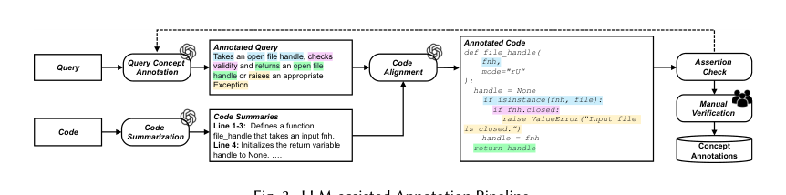
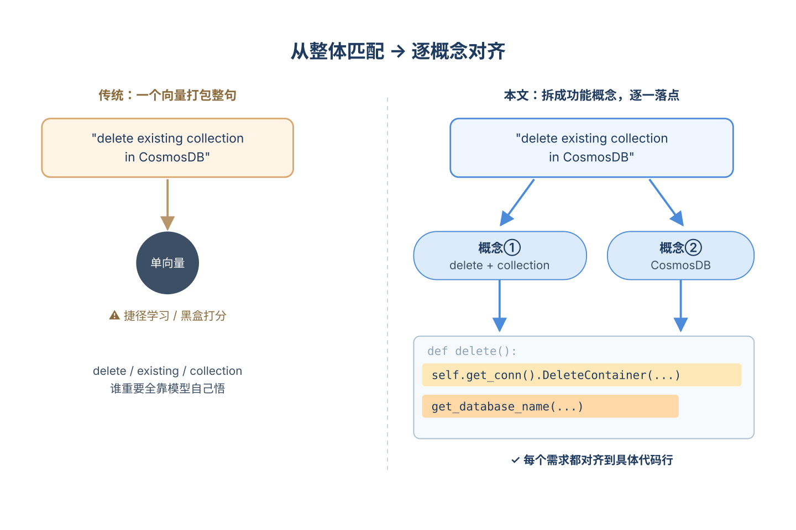
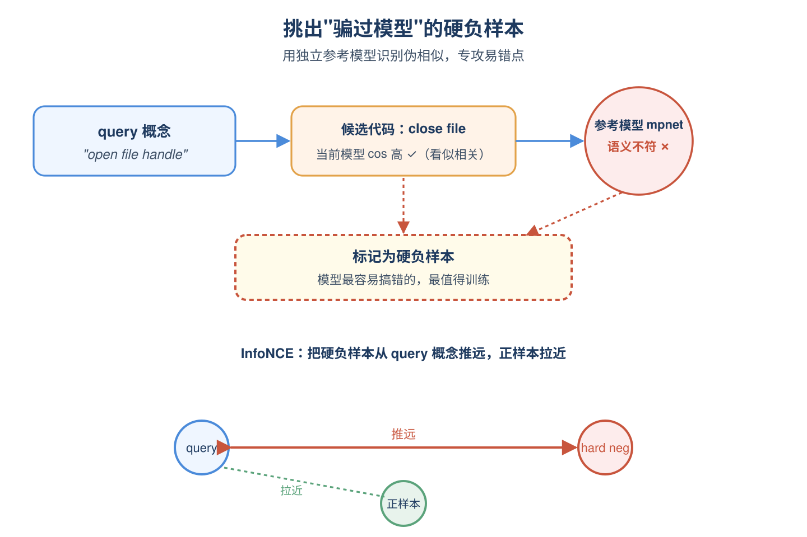
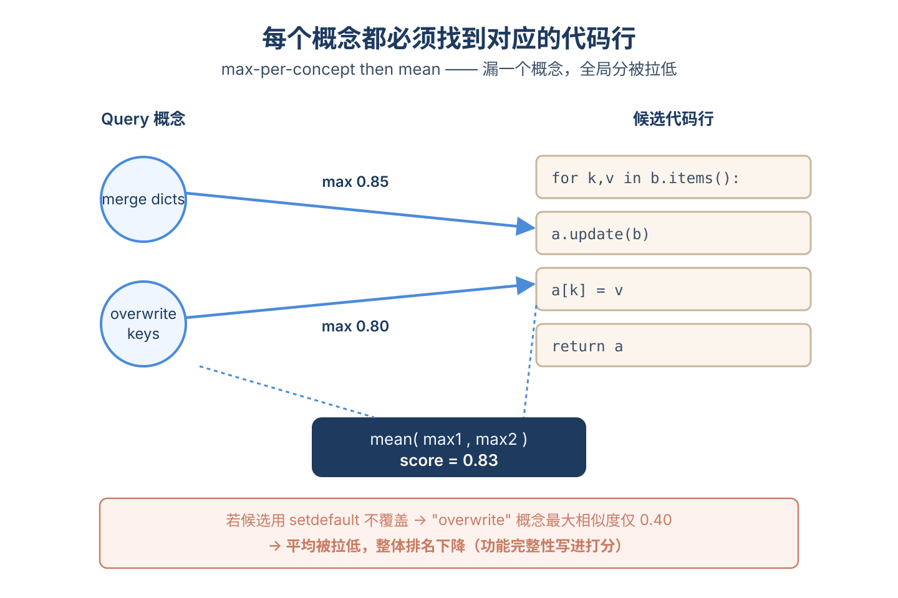
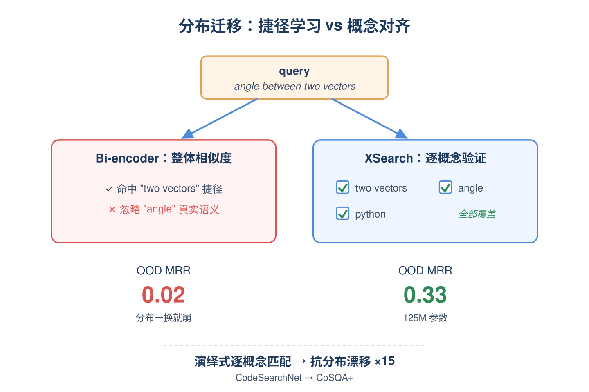

# 2026-05-18 论文日报

## 一、今日趋势与创新观察

### 1. 趋势概况

- 今天全量334篇中cs.AI 191篇、cs.LG 129篇、cs.IR 14篇，IR占比延续上周的低位，但表示学习与检索排序主题达80篇，比近几日明显回暖。
- LLM与语言理解仍是最大主题（126篇），重点从纯推理转向多模态事件检索、JEPA式微调审计、RAG去偏等更落地的子方向。
- Agent与多智能体保持72篇高位，热点从通用工具调用扩散到微服务根因分析、长程记忆压缩、POI推荐等具体业务垂类。
- 迁移学习与跨域泛化56篇、商业化资源优化31篇，多篇围绕工业系统稳定性、特征裁剪、边缘部署等工程化问题，强迁移信号74篇。

### 2. 推荐系统 / 排序相关创新点

- Generative Long-term User Interest Modeling 在传统GSU/ESU两阶段框架上引入生成式建模来重塑超长行为序列的兴趣表达，是当天最贴近广告CTR链路的工作。
- Fortress针对App Store query-to-app相关性模型，提出时序数据增强加特征剪枝来缓解多阶段排序中分数抖动，对广告排序的稳定性治理有直接借鉴。
- Agent4POI抛弃静态POI embedding，改为推理时按上下文条件生成多模态表征，把agent式affordance推理引入推荐召回排序，是表征建模范式上的新尝试。

### 3. 全局创新点

- RecMem提出基于循环的记忆巩固机制，避免长程LLM agent对每条交互都调用LLM做记忆抽取，是长上下文agent的成本-效果权衡新解法。
- Representation Without Reward用JEPA视角审计LLM微调后的隐状态几何，提出无需奖励信号即可评估表征质量的新型分析工具。
- Ascend-RaBitQ通过NPU-CPU异构调度结合1bit量化，把十亿级向量相似搜索的吞吐推到新量级，对召回与ANN系统是硬件协同的新方向。

### 4. 跨论文综合观察

- Generative Long-term User Interest、Agent4POI 与 CHoE 都在尝试摆脱静态预计算embedding，转向生成式或上下文条件化表征，反映出推荐表征正从离线固定向在线动态迁移。
- Fortress、RecMem 与 Ascend-RaBitQ 分别从特征稳定性、记忆压缩和向量检索硬件三个层面攻击工业系统的可扩展性问题，方法各异但共同指向多阶段链路的成本-鲁棒性瓶颈。
- XSearch的概念-代码对齐与JEPA Audit的隐状态几何分析在视角上互补：前者强调跨模态语义对齐的可解释性，后者关注表征空间内部结构的可审计性，共同推动embedding从黑盒检索走向可解释表征。

## 二、今日入选论文

### 1. Generative Long-term User Interest Modeling for Click-Through Rate Prediction
- 挑选理由：直接做广告/推荐CTR预估的长期用户兴趣建模，GSU/ESU框架，明显工业广告链路。

### 2. XSearch: Explainable Code Search via Concept-to-Code Alignment
- 挑选理由：命中强迁移信号：retrieval, matching, framework。

## 三、补充关注

1. **Entropy Across the Bridge: Conditional-Marginal Discretization for Flow and Schrödinger Samplers**
   - 理由：有一定相关信号，但不足以进入正式候选：matching。
2. **Towards Trustworthy and Explainable AI for Perception Models: From Concept to Prototype Vehicle Deployment**
   - 理由：有一定相关信号，但不足以进入正式候选：calibration。

## 四、重点论文精读

### 1. Generative Long-term User Interest Modeling for Click-Through Rate Prediction
- **为什么值得看：** 把GSU目标中心检索改成生成式兴趣分布查表，工业部署有效。
- **背景：** 在广告/推荐CTR预估里，长期用户行为建模普遍走GSU+ESU两阶段：GSU先用相似度从上千条历史行为里挑Top-k，再交给ESU做attention。但GSU是'目标item中心'的，只能挑出和当前候选item相似的行为，忽略用户其它潜在兴趣；而且每条历史行为都要和目标做一次相似度计算，序列一长在线就扛不住，还忽略了行为之间的交互。论文提出GenLI，用生成式方法直接产出'目标无关'的多种实时兴趣分布，把行为打分变成一次O(1)的查表，兼顾多样性、效率和精度，并且已经在真实广告系统部署，所以工业参考意义比较强。

*图示：这是 Figure 1 的方法总览图，完整展示了 GenLI 的三大核心模块 IGM、BRM、IFM 及其信息流，最能代表论文核心方法。相比 block 版本，这个候选去掉了更多caption/正文干扰，主体更聚焦、结构更清晰，适合作为日报主图。其余候选都是实验曲线，不适合作为主架构图。*

**核心技术点：**

#### 技术点 1：生成多种兴趣分布替代GSU
- 快速理解：用短期行为生成隐式/显式/相对三种兴趣分布，不再依赖目标item做检索。

*图示：可以把这三种分布想成给用户画了三张'兴趣热力图'：一张是他真的点过什么（显式），一张是平台过去经常曝给他、他默认接受的领域（隐式），第三张是'相对于平台推给他的，他更偏爱的那部分'（相对）。生成时只看最近10~100条短期行为，但产出的是覆盖整个item空间的概率分布，所以即便长期行为里有冷门兴趣，也能在分布里被打到分。*

- 技术细节：兴趣生成模块IGM拿最近若干条短期行为做key/value，用最新一条行为embedding加一个可学习query向量做多头注意力，得到隐藏兴趣表示，再过MLP+softmax生成一个N维（论文取4096）离散概率分布。论文同时生成三种分布：显式兴趣分布用真实点击item做监督（负log似然），隐式兴趣分布用曝光item做监督（更稳定、长期偏好），相对兴趣分布定义成显式减隐式再softmax，用来刻画'在曝光池里相对更想点哪个'的对比关系。整个IGM是目标无关的，所以同一个用户一次请求只生成一次分布即可。
- 通俗讲解：可以把这三种分布想成给用户画了三张'兴趣热力图'：一张是他真的点过什么（显式），一张是平台过去经常曝给他、他默认接受的领域（隐式），第三张是'相对于平台推给他的，他更偏爱的那部分'（相对）。生成时只看最近10~100条短期行为，但产出的是覆盖整个item空间的概率分布，所以即便长期行为里有冷门兴趣，也能在分布里被打到分。
- 例子：比如用户最近点过'火锅店、川菜、麻辣烫'，IGM吃进这几条短期行为，输出三个4096维分布：显式分布在'川渝辣味'相关bucket上概率高，隐式分布在'附近常曝的快餐、奶茶'上概率高，相对分布则突出'辣味相对快餐更偏好'。这三张分布在这次请求里就固定了，后面所有历史行为打分都直接查这三张表。

#### 技术点 2：查表式行为检索O(1)打分
- 快速理解：历史行为按ID取模映射到分布桶，单条打分从O(d)降到O(1)。

*图示：传统GSU相当于拿目标item挨个去和上千条历史行为比相似度，行为越多越慢。GenLI把这件事反过来：先一次性算好'用户当下对每个bucket有多感兴趣'的三张表，然后历史行为只要报上自己的ID落在哪个bucket，就能立刻查到分数，谁也不用再两两比。本质是把配对相似度替换成了哈希式查表，再用Top-k选出最有代表性的行为送下游。*

- 技术细节：行为检索模块BRM不再算目标item和每条历史行为的内积/汉明距离，而是把每条历史行为的ID对N取模，得到分布里的一个bucket索引，直接读出该桶的概率值作为打分。每条行为会从隐式、显式、相对三个分布各拿到一个分数，分别按Top-k挑出k条（论文k=20，总共K=60），形成三组候选行为。整体复杂度从SIM/TWIN的O((L+K)·d)降到约O(L+(l+K)·d)，其中对每条历史行为打分的部分只剩O(1)的查表。
- 通俗讲解：传统GSU相当于拿目标item挨个去和上千条历史行为比相似度，行为越多越慢。GenLI把这件事反过来：先一次性算好'用户当下对每个bucket有多感兴趣'的三张表，然后历史行为只要报上自己的ID落在哪个bucket，就能立刻查到分数，谁也不用再两两比。本质是把配对相似度替换成了哈希式查表，再用Top-k选出最有代表性的行为送下游。
- 例子：假设历史里有1000条行为，原来TWIN要做1000次目标-行为attention打分。GenLI里每条行为算一次'ID%4096'得到桶号，比如行为A落在桶732，从显式分布读到0.012、从隐式读0.005、从相对读0.020；按三个分布各自Top-20选出共60条最相关行为，喂给后面的IFM做精细attention。

#### 技术点 3：分组聚合+门控融合长期兴趣
- 快速理解：三组检索行为各自做target attention，再用gating拼成长期兴趣特征。

*图示：三种分布选出来的行为代表三种'视角'下的相关行为，直接混在一起做attention会互相干扰，所以先分别和目标item做注意力得到三个兴趣表示，再用门控决定这次请求里哪种视角更重要。门控相当于一个软开关：如果当前候选广告更偏'长期稳定品类'，隐式那一支的权重会被放大；如果是新奇尝鲜场景，相对兴趣那一支可能更被采纳。*

- 技术细节：兴趣融合模块IFM对隐式、显式、相对三组各自的Top-k行为分别用一次多头注意力（query是目标item embedding，key/value是这组行为embedding）得到三个兴趣向量，再拼接起来过一个MLP+sigmoid产生门控分数，与拼接向量做逐元素相乘后再线性投影，得到最终长期兴趣特征x-l。整体loss是CTR交叉熵 + α·隐式兴趣loss + β·显式兴趣loss，端到端联合训练，论文里α=β=1。
- 通俗讲解：三种分布选出来的行为代表三种'视角'下的相关行为，直接混在一起做attention会互相干扰，所以先分别和目标item做注意力得到三个兴趣表示，再用门控决定这次请求里哪种视角更重要。门控相当于一个软开关：如果当前候选广告更偏'长期稳定品类'，隐式那一支的权重会被放大；如果是新奇尝鲜场景，相对兴趣那一支可能更被采纳。
- 例子：对同一个目标广告'某新开火锅店'：显式组可能选出最近点过的几家川菜店，注意力后形成'强辣偏好'向量；隐式组选出经常被曝光的工作日午餐店，形成'稳定刚需'向量；相对组选出'相对于普通快餐更倾向辣味'的行为，形成'对比偏好'向量。门控可能给显式0.7、相对0.5、隐式0.2，融合后输出强调辣味偏好的长期特征，进入最后的CTR MLP做打分。

- **对广告的启发：** 工业广告长行为建模可以把GSU换成生成式分布查表，省算力又能覆盖多兴趣。
- **适用边界：** 方法依赖高质量的曝光/点击日志来训练显式和隐式分布，曝光日志缺失或严重有偏的场景需要额外近似；同时分布维度N是固定哈希桶，item规模远大于N时碰撞会稀释打分精度，需要随item规模一起放大。
- **实践建议：** 如果你们线上还在用SIM-soft/ETA/TWIN类GSU，可以先做一个小实验：在现有ESU不动的前提下，把GSU替换成'短期行为生成一个4096维softmax分布 + 历史行为ID取模查表Top-k'，对比在线打分耗时和AUC，验证查表式检索在自家长行为序列上的性价比。

### 2. XSearch: Explainable Code Search via Concept-to-Code Alignment
- **为什么值得看：** 概念对齐式检索思路可迁移到广告 query-creative 召回与可解释匹配
- **背景：** 代码检索现在主流是把 query 和代码各自编码成一个向量然后算相似度，在训练分布内表现好但有两个老问题：一是黑盒，开发者只看到一个分数不知道命中了 query 的哪个需求；二是模型学到的是'函数名等显眼 token'这种捷径特征，一旦换分布(比如从 CodeSearchNet 换到 CoSQA+)，MRR 会从 0.7 掉到 0.02。作者认为根因是把检索做成了'归纳式整体匹配'，应该改成'演绎式逐概念验证'，这对所有要做语义检索 + 可解释相关性的场景都有借鉴意义。

*图示：该图是唯一明确展示流程与模块关系的候选：从 Query/Code 出发，经 Query Concept Summarization、Code Summarization、Code Alignment，到 Assertion/Manual Verification/Concept Annotations，完整体现了论文核心的“概念提取+代码对齐”方法范式。相比之下，其余候选主要是失败案例或超参数热力图，不适合作为主架构图。虽然这张图标题是 annotation pipeline 而非完整模型框架，但它最直接、最完整地传达了 XSearch 的核心思想，且裁剪干净、正文噪声少。*

**核心技术点：**

#### 技术点 1：把 query 拆成功能概念
- 快速理解：用 LLM 把 query 切成'动作+实体+修饰'的概念单元，并对齐到代码行

*图示：传统做法是把整句 query 压成一个向量，'delete existing collection'里 delete/existing/collection 谁重要全靠模型自己悟。这里改成显式告诉模型：query 里有几个原子功能点，每个点对应代码哪几行，相当于给检索任务加了细粒度的对齐监督，而不是只给一个'相关/不相关'的二分类标签。*

- 技术细节：作者定义一个'概念'是一组 query token 共同表达的不可分功能需求，由动作(如 delete)、实体(如 collection)、可选修饰(如 existing)组成。用 LLM 三步标注：先从 query 里抽概念 span，再把代码按行做自然语言摘要，最后把每个概念对齐到一行或多行代码上。还加了格式断言和一致性断言来过滤 LLM 幻觉，72.98% 样本一次过，所有保留样本五次重试内通过，人工抽检 kappa=0.9。
- 通俗讲解：传统做法是把整句 query 压成一个向量，'delete existing collection'里 delete/existing/collection 谁重要全靠模型自己悟。这里改成显式告诉模型：query 里有几个原子功能点，每个点对应代码哪几行，相当于给检索任务加了细粒度的对齐监督，而不是只给一个'相关/不相关'的二分类标签。
- 例子：query 是'deletes an existing collection in CosmosDB'，被拆成两个概念：'delete existing collection'(动作+修饰+实体)和'CosmosDB database'(实体)。代码里 self.get-conn().DeleteContainer(...) 这一行被对齐到第一个概念，get-database-name(...) 被对齐到第二个概念，每个概念都有明确落点。

#### 技术点 2：概念高亮+对齐双任务训练
- 快速理解：一个 token 级 focal loss 学高亮，一个 span 级对比学习把概念和代码段拉近

*图示：训练时模型同时学两件事：哪些 token 是关键功能词、关键功能词组成的小段落该和代码哪段贴近。硬负挖掘的关键在于用一个独立的语义参考模型来识别'伪相似'，避免拿一堆显然无关的负样本浪费算力，专门挑模型当前最容易搞错的来纠正。*

- 技术细节：在 GraphCodeBERT 上加一个轻量线性头，对每个 token 预测是否为'概念承载 token'，因为正样本稀疏所以用 focal loss。同时对每个 query 概念 span 做 mean-pooling 得到一个向量，和它对齐的代码 span 向量作为正对，用 InfoNCE 拉近。负样本用一个巧妙的硬负挖掘：当前模型觉得相似(高 cos)、但参考模型 all-mpnet-base-v2 觉得 query 概念和该代码自然语言描述并不匹配，这种'被当前模型骗到'的负样本最有训练价值，取 top-50。代码侧还额外加了 AST 节点类型 embedding。
- 通俗讲解：训练时模型同时学两件事：哪些 token 是关键功能词、关键功能词组成的小段落该和代码哪段贴近。硬负挖掘的关键在于用一个独立的语义参考模型来识别'伪相似'，避免拿一堆显然无关的负样本浪费算力，专门挑模型当前最容易搞错的来纠正。
- 例子：query 概念'open file handle'的 span 向量，正样本是代码里 if isinstance(fnh, file)... 那几行的 mean-pool 向量。同 batch 里另一个代码片段处理的是'close file'，当前模型给它们打了高 cos(看起来都涉及 file)，但参考模型读它的英文描述发现语义不匹配，于是它被选为硬负样本，被推远。

#### 技术点 3：推断期概念聚类+贪心匹配
- 快速理解：query 端聚类成若干概念中心，对每个概念取代码行最大相似度再平均

*图示：和传统'一个 query 向量 vs 一个代码向量算一次 cos'不一样，这里是'k 个 query 概念 vs L 个代码行，每个概念挑自己最匹配的那行，然后求平均'。这样一来如果代码漏实现某个概念，那个概念的最大相似度会很低，整体分被拉下来，相当于把'功能完整性'写进了打分函数。*

- 技术细节：推断时先用阈值 δ-highlight=0.4 过滤出概念 token，再用层次聚类(余弦相似度阈值 δ-cluster=0.8)合成若干概念中心向量。代码侧不聚类，按行处理：行内若有概念 token 就计算行级 mean-pool 向量。最终相似度是'每个 query 概念找最相似代码行的 cos，再对所有概念取平均'。这是个贪心 max-then-mean 结构，意味着任何一个概念找不到对应行都会拉低总分，强制覆盖所有需求。
- 通俗讲解：和传统'一个 query 向量 vs 一个代码向量算一次 cos'不一样，这里是'k 个 query 概念 vs L 个代码行，每个概念挑自己最匹配的那行，然后求平均'。这样一来如果代码漏实现某个概念，那个概念的最大相似度会很低，整体分被拉下来，相当于把'功能完整性'写进了打分函数。
- 例子：query'merge two dicts overwriting existing keys'拆出两个概念中心：'merge dicts'和'overwrite existing keys'。候选 A 实现合并但用的是 setdefault(不覆盖)，'overwrite'概念找最大相似度只有 0.4；候选 B 用 dict.update 直接覆盖，两个概念分别能找到 0.85 和 0.8 的行，平均 0.83 排第一。

#### 技术点 4：OOD 上 15 倍提升
- 快速理解：125M 参数 XSearch 在 CoSQA+ 上 MRR 从 0.02 飙到 0.33，超过 7B 解码器模型

*图示：传统 bi-encoder 在训练分布里靠函数名等捷径就能拿高分，换分布后这些捷径不灵了立刻崩。XSearch 因为强制每个概念都要找到对应代码行，模型没法只盯函数名，被迫去理解每段代码到底实现了什么，所以分布迁移时鲁棒性显著更好。*

- 技术细节：在 CodeSearchNet 上训练后直接迁到 CoSQA+ 评测，CodeBERT/GraphCodeBERT 等 bi-encoder MRR 都在 0.02-0.05，Qwen2.5-Coder-7B 微调版能到 0.24，XSearch 用 125M 参数拿到 0.33 MRR / 0.24 MMRR。失败案例分析显示 ID 上的轻微下降主要来自'query 写了代码里没实现的多余概念'(占 32.3%)，因为 XSearch 严格要求所有概念都被覆盖，这其实是更保守也更可信的失败模式。用户研究里 20 人 20 任务，概念对齐解释让接受/拒绝判断快 38%、准 10.5%。
- 通俗讲解：传统 bi-encoder 在训练分布里靠函数名等捷径就能拿高分，换分布后这些捷径不灵了立刻崩。XSearch 因为强制每个概念都要找到对应代码行，模型没法只盯函数名，被迫去理解每段代码到底实现了什么，所以分布迁移时鲁棒性显著更好。
- 例子：query'angle between two vectors using python'在 CoCoSoDa 那里返回了一个做向量除法的函数(因为'two vectors'命中强)，分高但功能错。XSearch 因为还要匹配'angle'这个概念，向量除法函数里没有任何行能对上'angle'概念，整体分被压低，真正算夹角的代码排到 Top-1。

- **对广告的启发：** 广告检索/相关性可借鉴'query 拆功能点 + 逐点对齐创意'来抗 OOD 并提供可解释相关性
- **适用边界：** 方法依赖高质量概念标注(LLM+断言校验)，对 query 极短或概念不清晰的场景效果不确定；ID 数据上略低于强 baseline，因为对'多余概念'采取保守降分，业务里如果允许部分匹配反而是劣势。
- **实践建议：** 可以先在广告相关性精排上小范围试：用 LLM 把 query 拆成属性概念，把落地页/创意切片，复用 max-then-mean 概念对齐打分作为一路特征或重排分，并用'当前模型觉得像、语义模型觉得不像'的硬负样本来训练相关性模型。
