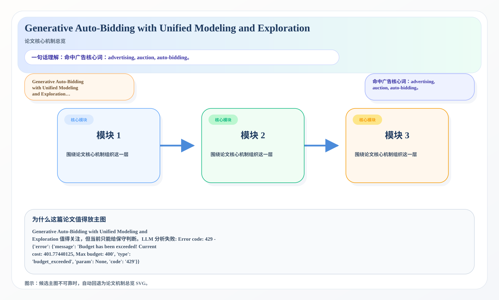
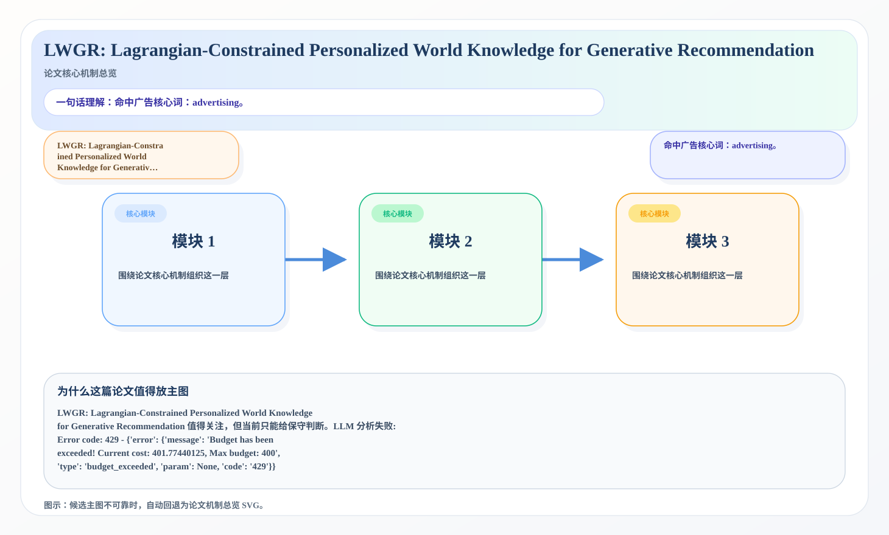

# 2026-05-20 论文日报

## 一、今日趋势与创新观察

### 1. 趋势概况

- 今天一共抓到 484 篇论文，趋势概况优先基于全量抓取结果而不是只看最后保留的候选。
- 从全量论文看，主题最集中的方向是：LLM 与语言理解、表示学习与检索排序、Agent 与多智能体。
- 进入候选池的工作里，直接广告 3 篇、强迁移 25 篇、大公司线索 6 篇，说明今天既有直接商业化问题，也有可迁移的方法论输入。

### 2. 推荐系统 / 排序相关创新点

- 《D$^3$-Subsidy: Online and Sequential Driver Subsidy Decision-Making for Large-Scale Ride-Hailing Market》：亮点信号：diffusion, dit, constraint, robust；主题：迁移学习与跨域泛化、商业化决策与资源优化；候选属性：直接广告论文
- 《Memory-Augmented Reinforcement Learning Agent for CAD Generation》：亮点信号：tool, closed-loop, dit, constraint；主题：LLM 与语言理解、Agent 与多智能体；来自全量抓取的补充观察
- 《KG-ASG: Collision-Knowledge-Guided Closed-Loop Adversarial Scenario Generation With Primary-Support Attribution》：亮点信号：attack, closed-loop, dit, constraint；主题：表示学习与检索排序；公司线索：Meta；候选属性：大公司优先论文

### 3. 全局创新点

- 今天暂时没有足够稳定的全局创新点可总结。

## 二、今日入选论文

### 1. Generative Auto-Bidding with Unified Modeling and Exploration
- 挑选理由：命中广告核心词：advertising, auction, auto-bidding。

### 2. LWGR: Lagrangian-Constrained Personalized World Knowledge for Generative Recommendation
- 挑选理由：命中广告核心词：advertising。

## 三、补充关注

1. **HaorFloodAlert: Deseasonalized ML Ensemble for 72-Hour Flood Prediction in Bangladesh Haor Wetlands**
   - 理由：有一定相关信号，但不足以进入正式候选：recall。
2. **Interference-Aware Multi-Task Unlearning**
   - 理由：有一定相关信号，但不足以进入正式候选：multi-task。
3. **StruMPL: Multi-task Dense Regression under Disjoint Partial Supervision and MNAR Labels**
   - 理由：有一定相关信号，但不足以进入正式候选：multi-task。
4. **Breaking Modality Heterogeneity in Low-Bit Quantization for Large Vision-Language Models**
   - 理由：有一定相关信号，但不足以进入正式候选：calibration。
5. **Planner-Admissible Graph-PDE Value Extensions for Sparse Goal-Conditioned Planning**
   - 理由：有一定相关信号，但不足以进入正式候选：ranking。
6. **GOAL: Graph-based Objective-Aligned Diffusion Solvers for Dynamic Multi-Objective Optimization**
   - 理由：有一定相关信号，但不足以进入正式候选：multi-objective。
7. **Cross-Subject Intracranial EEG Reconstruction from Scalp Recordings Using Multi-Scale Cross-Attention Transformers**
   - 理由：有一定相关信号，但不足以进入正式候选：calibration。
8. **PMF-CL: Pareto-Minimal-Forgetting Continual Learner for Conflicting Tasks**
   - 理由：有一定相关信号，但不足以进入正式候选：multi-task。
9. **Spectral Gradient Surgery for Domain-Generalizable Dataset Distillation**
   - 理由：有一定相关信号，但不足以进入正式候选：matching。
10. **UCCI: Calibrated Uncertainty for Cost-Optimal LLM Cascade Routing**
   - 理由：有一定相关信号，但不足以进入正式候选：calibration。

## 四、重点论文精读

### 1. Generative Auto-Bidding with Unified Modeling and Exploration
- **为什么值得看：** 命中广告核心词：advertising, auction, auto-bidd…
- **背景：** Generative Auto-Bidding with Unified Modeling and Exploration 值得关注，但当前只能给保守判断。LLM 分析失败: Error code: 429 - {'error': {'message': 'Budget has been exceeded! Current cost: 401.77440125, Max budget: 400', 'type': 'budget\_exceeded', 'param': None, 'code': '429'}}

*图示：候选主图不可靠，已回退为论文核心机制总览 SVG。*

- **当前状态：** llm_failed（LLM 分析失败: Error code: 429 - {'error': {'message': 'Budget has been exceeded! Current cost: 401.77440125, Max budget: 400', 'type': 'budget_exceeded', 'param': None, 'code': '429'}}）
- **核心技术点：** 本次精读未成功，暂不展示结构化核心点，避免误导。
- **对广告的启发：** 暂时只保留候选判断，建议稍后重试精读。

### 2. LWGR: Lagrangian-Constrained Personalized World Knowledge for Generative Recommendation
- **为什么值得看：** 命中广告核心词：advertising。
- **背景：** LWGR: Lagrangian-Constrained Personalized World Knowledge for Generative Recommendation 值得关注，但当前只能给保守判断。LLM 分析失败: Error code: 429 - {'error': {'message': 'Budget has been exceeded! Current cost: 401.77440125, Max budget: 400', 'type': 'budget\_exceeded', 'param': None, 'code': '429'}}

*图示：候选主图不可靠，已回退为论文核心机制总览 SVG。*

- **当前状态：** llm_failed（LLM 分析失败: Error code: 429 - {'error': {'message': 'Budget has been exceeded! Current cost: 401.77440125, Max budget: 400', 'type': 'budget_exceeded', 'param': None, 'code': '429'}}）
- **核心技术点：** 本次精读未成功，暂不展示结构化核心点，避免误导。
- **对广告的启发：** 暂时只保留候选判断，建议稍后重试精读。

## 五、候选但未完成深读的论文

- **Generative Auto-Bidding with Unified Modeling and Exploration**
  - 状态：llm_failed
  - 原因：LLM 分析失败: Error code: 429 - {'error': {'message': 'Budget has been exceeded! Current cost: 401.77440125, Max budget: 400', 'type': 'budget_exceeded', 'param': None, 'code': '429'}}
- **LWGR: Lagrangian-Constrained Personalized World Knowledge for Generative Recommendation**
  - 状态：llm_failed
  - 原因：LLM 分析失败: Error code: 429 - {'error': {'message': 'Budget has been exceeded! Current cost: 401.77440125, Max budget: 400', 'type': 'budget_exceeded', 'param': None, 'code': '429'}}
