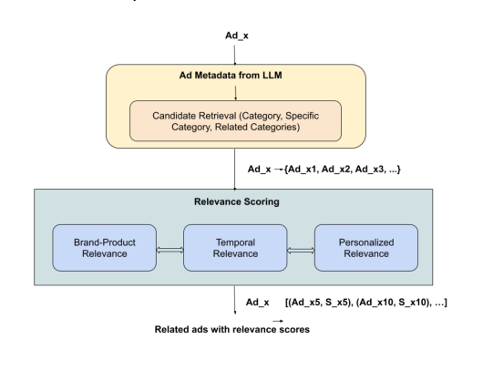
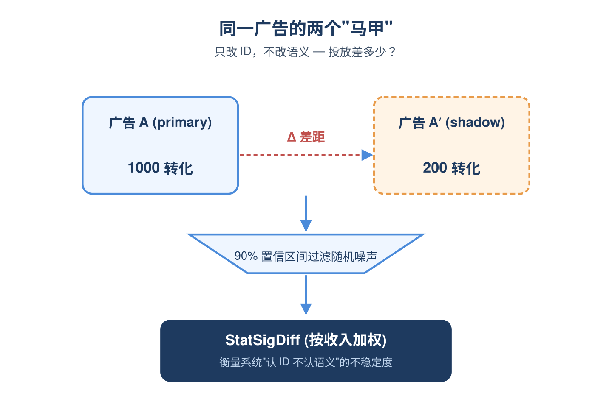
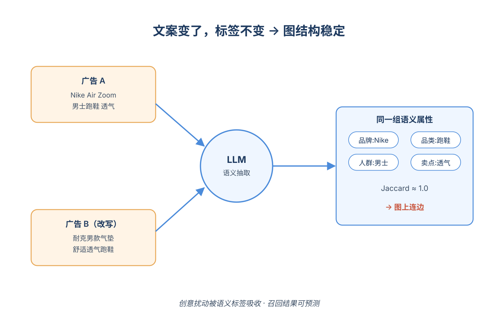
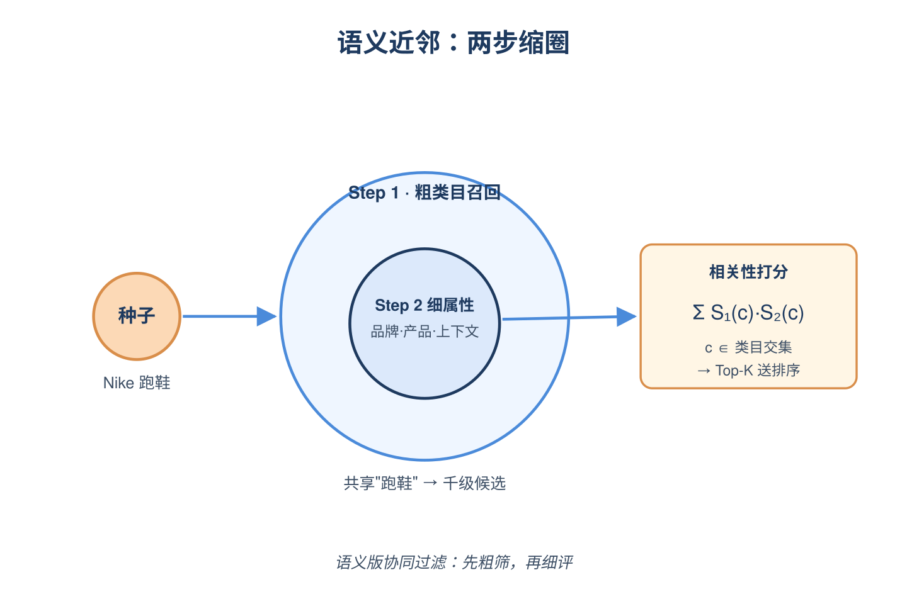
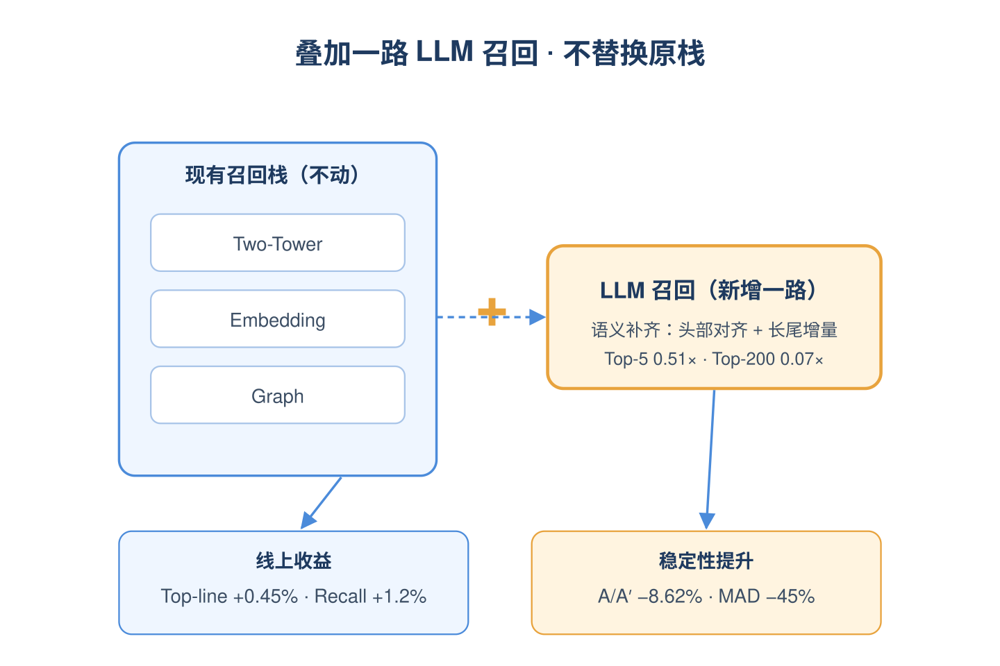
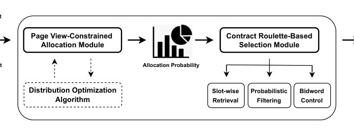
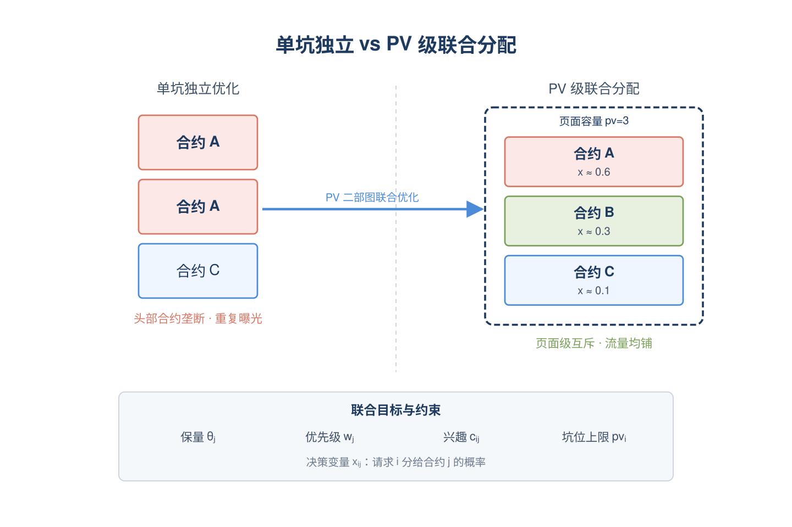
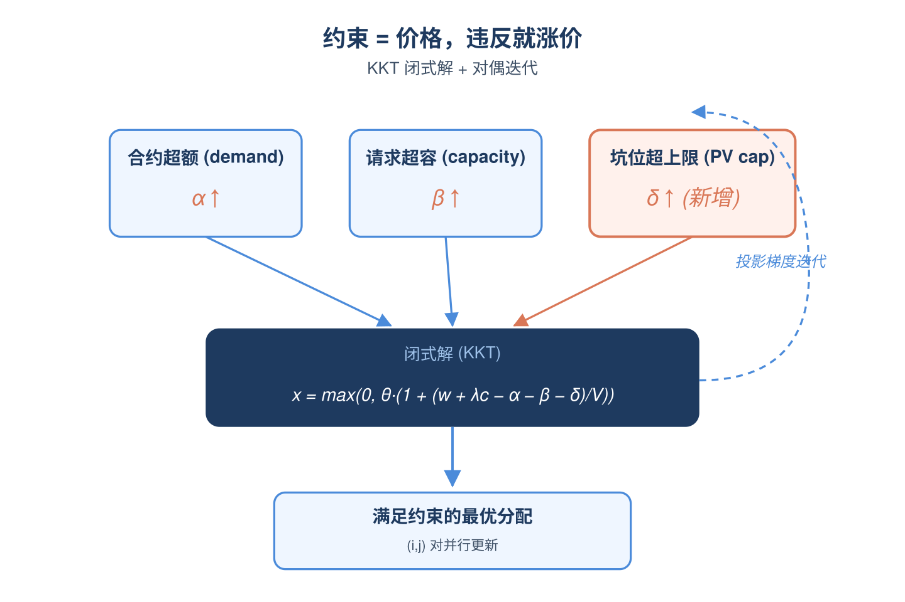
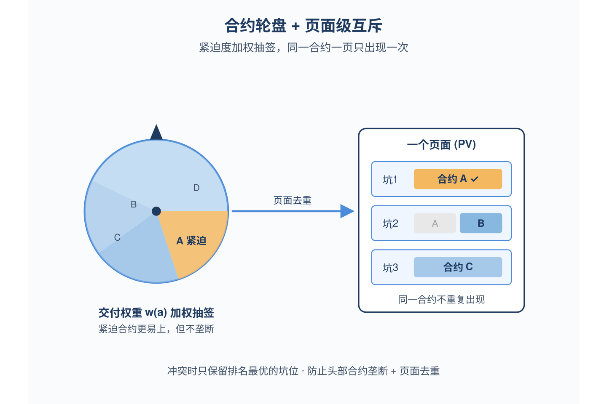

# 2026-05-22 论文日报

## 一、今日趋势与创新观察

### 1. 趋势概况

- 今日全量421篇，cs.AI 232篇与cs.LG 177篇延续主导，cs.IR仅12篇但工业系统论文密度反而较高。
- LLM与语言理解仍是最大主题（175篇），重心落在推理增强推荐、RAG稳定性以及KV缓存压缩等长上下文工程问题。
- Agent与多智能体方向（77篇）开始向latent KV通信、自蒸馏搜索演化、源码级自改写等系统级议题延伸，单点对话Agent明显减少。
- 迁移学习与跨域泛化74篇里出现较多RL+调度、自治科研团队、表格Agent等场景化落地，呈现Agent化趋势。

### 2. 推荐系统 / 排序相关创新点

- Meta提出以LLM语义检索做广告候选生成，将优化目标从NDCG/Recall转向预测稳定性与可预测性，正面回应生成式广告库存爆炸下的系统性风险。
- 美团《Beyond Single Slot》打破保量展示广告单坑假设，提出多slot联合优化分配框架，把页面级排版纳入保量约束求解。
- FLUID用多模态语义码替代直播间短生命周期ID embedding，从根上解决直播推荐冷启动与ID稀疏问题，对广告冷启动具同构借鉴价值。

### 3. 全局创新点

- Meta-Soft提出可组合meta-token替代固定soft token做KV cache eviction，在长上下文压缩中保留语义可还原性，是KV压缩从启发式向结构化token的一次推进。
- Search-E1用自蒸馏驱动搜索增强推理的自我演化，把RAG从静态检索-生成升级为可自迭代的能力闭环。
- 《Do Not Trust The Auctioneer》形式化first-price重复拍卖中shilling只污染反馈不改变分配的新设定，给出对应regret界，为广告竞价反作弊提供理论锚点。

### 4. 跨论文综合观察

- Meta的LLM广告召回、美团多slot保量、快手推理增强推荐三篇都在用LLM/语义能力重塑广告与推荐链路，但分别从候选稳定性、分配联合优化、用户偏好推理三个不同层面切入，呈现工业链路全栈被LLM重做的态势。
- PEARL（直播去偏排序）与FLUID（直播多模态语义码）共同指向同一痛点——直播场景行为强度不均与ID短命，一个从label/曝光去偏入手，一个从item表征侧重构，构成互补的双轮解法。
- Meta-Soft的KV压缩、LCGuard的安全KV共享、Search-E1的自蒸馏检索演化都围绕'长上下文/多Agent下的KV与记忆系统'，预示Agent基础设施层将取代单点prompt工程成为下阶段研究重心。

## 二、今日入选论文

### 1. LLM Retrieval for Stable and Predictable Ad Recommendations
- 挑选理由：直接讲广告召回系统，LLM语义候选生成，工业A/B验证，符合广告召回核心

### 2. Beyond Single Slot: Joint Optimization for Multi-Slot Guaranteed Display Advertising
- 挑选理由：美团展示广告多slot联合优化保量分配，直接广告论文

## 三、补充关注

1. **Bridging the Cold-Start Gap: LLM-Powered Synthetic Data Generation for Natural Language Search at Airbnb**
   - 理由：Airbnb自然语言搜索冷启动合成数据，工业搜索系统但非广告变现
2. **Reinforced Preference Optimization for Reasoning-Augmented Recommendations**
   - 理由：Kuaishou团队LLM推理增强推荐，与排序相关但非直接广告

## 四、重点论文精读

### 1. LLM Retrieval for Stable and Predictable Ad Recommendations
- **为什么值得看：** Meta工业级广告召回，用LLM做语义召回还提出了'可预测性'新指标
- **背景：** 传统广告召回只关注Recall、NDCG这类准确率指标，但随着广告库存爆炸和生成式AI带来的创意泛滥，同一广告的小改动经常导致投放结果剧烈波动，引发广告主感知到的重复、冷启动、欠探索问题。论文要解决的是'广告系统在输入轻微扰动下输出是否稳定可预测'这件事，并在Meta工业广告召回栈里同时定义了新指标和给出了基于LLM的解决方案。值得看的点在于这是一个真正上线A/B验证、并且把'稳定性'这个隐性问题显性化为可优化指标的工作。

*图示：Figure 1 'LLM Ad to Ad Generator' 是论文的方法总览图，清晰展示了从Ad metadata抽取到候选检索再到相关性打分的完整流程，最能代表论文核心方法。embedded版本相比block版本裁剪更干净，没有正文噪声。*

**核心技术点：**

#### 技术点 1：A/A'可预测性指标
- 快速理解：用主广告和扰动副本的转化差异量化系统稳定性

*图示：直觉是：如果你把一个广告复制一份、只改个ID，理论上投放效果应该差不多，差太多就说明召回/排序在'认ID不认语义'。论文就把这种'同一个广告两个马甲的投放差距'做成一个可统计、可监控的数字，再用置信区间剔除掉随机噪声那部分，剩下的就是真正不该有的不稳定性。*

- 技术细节：论文定义了一个'shadow ad'机制：对每个原始广告（primary）发布一份只改了广告ID或某个非语义字段的副本（shadow），在线上同时投放并比较两者的归一化转化数。把两者转化差Δ与高斯近似下的90%置信区间阈值比较，超过阈值的部分定义为StatSigDiff，再按收入加权聚合到系统级指标，并用每日impression相对差的中位绝对偏差（MAD）衡量波动幅度。指标越低代表系统越依赖语义而非ID等噪声特征。
- 通俗讲解：直觉是：如果你把一个广告复制一份、只改个ID，理论上投放效果应该差不多，差太多就说明召回/排序在'认ID不认语义'。论文就把这种'同一个广告两个马甲的投放差距'做成一个可统计、可监控的数字，再用置信区间剔除掉随机噪声那部分，剩下的就是真正不该有的不稳定性。
- 例子：比如同一个卖跑鞋的广告A，复制一份A'只换ID。系统跑一段时间后A拿了1000转化、A'只拿了200转化，Δ很大且超过高斯置信区间阈值，StatSigDiff就会记一笔；把全平台所有这种pair按收入加权汇总，就能得到一个全局的'不稳定性分数'，在A/B实验里对比新旧召回方案。

#### 技术点 2：LLM抽语义属性建图
- 快速理解：用微调LLM从创意里抽分层类目属性，再按属性重合度连边

*图示：传统召回靠ID embedding或双塔，文本一变embedding就抖。这里改成先让LLM把每个广告'读懂'成一组结构化标签（比如品牌、品类、卖点），然后两个广告共享标签越多就连得越近。这样创意里换个措辞、换张图，抽出来的标签集合基本不变，图结构也就稳定。*

- 技术细节：拿一个在广告互动数据上微调过的Llama类LLM，对每条广告的标题、描述、创意文本做推理，输出一组带分数的层级语义属性（类目c和分数s的列表）。然后以广告为节点、以属性集合的Jaccard相似度为边权构建广告-广告语义图；相似度计算先用短语级匹配，低于阈值θ时回退到token级匹配，保证既能抓品牌/产品这种强语义又能兜底。
- 通俗讲解：传统召回靠ID embedding或双塔，文本一变embedding就抖。这里改成先让LLM把每个广告'读懂'成一组结构化标签（比如品牌、品类、卖点），然后两个广告共享标签越多就连得越近。这样创意里换个措辞、换张图，抽出来的标签集合基本不变，图结构也就稳定。
- 例子：广告A是'Nike Air Zoom男士跑鞋 透气轻便'，LLM抽出(品牌:Nike(0.9), 品类:跑鞋(0.95), 人群:男士(0.8), 卖点:透气(0.7))；广告B改文案成'耐克男款气垫跑鞋 舒适透气'，LLM抽出几乎同样的标签集合。两者Jaccard很高直接在图上连边，召回时从A出发能稳定触达B。

#### 技术点 3：图遍历做召回扩展
- 快速理解：在语义图上从种子广告两步走，先粗筛再精打分

*图示：可以理解成'语义版的协同过滤'：不再看谁点了谁，而是看广告本身的语义标签谁跟谁像。先用粗标签把候选池缩小，再用细标签把同品牌、同产品、同场景的广告打高分排上去，最终送给下游排序。*

- 技术细节：线上召回分两步：Step1检索阶段用粗粒度类目相关性从种子广告扩展出一批近邻候选；Step2再用更深的品牌、产品、上下文属性维度做ad-to-ad相关性打分，打分函数是两个广告在共同类目c上属性分数的乘积之和（即对c属于两者类目交集求S-Ad1(c)·S-Ad2(c)的和）。整个服务跑在GPU上做批量LLM推理，保证低延迟。
- 通俗讲解：可以理解成'语义版的协同过滤'：不再看谁点了谁，而是看广告本身的语义标签谁跟谁像。先用粗标签把候选池缩小，再用细标签把同品牌、同产品、同场景的广告打高分排上去，最终送给下游排序。
- 例子：用户最近对广告A（Nike跑鞋）有兴趣，把A当种子。Step1从图上拉出所有共享'跑鞋'类目的几千个广告；Step2再用品牌Nike、男士、透气这些细属性打分，最终Top-K里Nike同系列、Adidas同价位跑鞋分数最高，被送进排序层。

#### 技术点 4：线上A/B收益验证
- 快速理解：上线后opline+0.45%、recall+1.2%、A/A'差异降8.62%、MAD降45%

*图示：重点是这个方案不是替代而是叠加，在已经很卷的Meta召回栈里还能再榨出收益，更关键的是把'稳定性'同时拉上来——意味着广告主以后改文案、换素材，投放效果不会再大起大落。*

- 技术细节：实验把LLM召回器作为一路加进现有的双塔+embedding+图召回的多路ensemble里，其他链路不动。结果显示线上top-line指标提升0.45%（统计显著），最终阶段recall提升1.2%；同时A/A'差异相对下降8.62%，每日impression相对差的MAD下降45%。Top-K分析显示LLM召回在Top-5上Recall对齐比是0.51X、到Top-200降到0.07X，说明它既能补齐头部高质量候选又能贡献大量增量长尾。
- 通俗讲解：重点是这个方案不是替代而是叠加，在已经很卷的Meta召回栈里还能再榨出收益，更关键的是把'稳定性'同时拉上来——意味着广告主以后改文案、换素材，投放效果不会再大起大落。
- 例子：对比实验里，对照组是Two-tower+embedding+图召回的组合；实验组多挂一路LLM召回。一周后看板上opline收入涨了0.45%，A/A'稳定性指标降了8.62%，相当于广告主感知到的'同样的广告突然投不动'问题少了近一成。

- **对广告的启发：** 广告召回团队可以直接抄：LLM抽语义标签建图召回 + A/A'稳定性指标
- **适用边界：** 论文只在召回阶段验证，没覆盖排序和出价；shadow ad需要一定流量和转化量才能让StatSigDiff统计显著，长尾小广告主上指标可能噪声很大；Jaccard相似度对属性粒度敏感，跨语言或纯图片创意场景下LLM抽属性能力是瓶颈。
- **实践建议：** 可以先用很小成本复刻A/A'指标——挑一批头部广告复制shadow副本上线一周，看自家召回/排序的StatSigDiff和MAD有多大，再决定要不要投入做LLM语义召回。

### 2. Beyond Single Slot: Joint Optimization for Multi-Slot Guaranteed Display Advertising
- **为什么值得看：** 美团把保量广告从单坑优化升级到整页多坑联合分配
- **背景：** 保量展示广告(GD)主流方法都假设每个广告位独立优化，但美团、淘宝这类页面一次会同时曝光多个广告坑，单坑独立优化会导致三个问题：高优先级合约垄断好坑、坑位之间流量分配失衡、同一合约在一页里多个坑重复出现。论文把合约-坑位分配重新建成页面级(PV级)的二部图匹配问题，并加入坑位曝光上限和合约页面级互斥两个工业落地必要的约束，是少见的从单坑跳到多坑的联合优化工作。

*图示：该候选是Figure 1框架总览图，完整展示了Page View-Constrained Allocation Module、Distribution Optimization Algorithm和Contract Roulette-Based Selection Module等核心模块及其信息流，正文噪声极少，最能代表论文方法。*

**核心技术点：**

#### 技术点 1：PV级二部图联合分配
- 快速理解：把分配问题从单坑独立优化改写成页面视角下请求与合约的全局匹配

*图示：以前每个坑各算各的，现在把'整页有几个坑'当成一个请求的容量来看。系统在离线层面对所有(请求,合约)对一起算一个分配概率，既要满足每个合约的保量需求，又要兼顾合约重要性和用户兴趣，还要让每个坑的曝光不超过设定上限，从而把流量更均匀地铺到所有坑上。*

- 技术细节：决策变量是请求i分给合约j的概率x-ij。目标函数有三项：第一项是平滑正则，惩罚实际分配偏离合约目标交付比例θ-j(=合约需求量/可服务请求总量)，保证保量稳定；第二项是优先级奖励，权重w-j越高越鼓励多分；第三项是用户兴趣项，鼓励把合约分给兴趣相关度c-ij高的请求。约束包括合约需求上限d-j、单请求总分配\<=1、非负性，以及新引入的页面级曝光上限pv-i。
- 通俗讲解：以前每个坑各算各的，现在把'整页有几个坑'当成一个请求的容量来看。系统在离线层面对所有(请求,合约)对一起算一个分配概率，既要满足每个合约的保量需求，又要兼顾合约重要性和用户兴趣，还要让每个坑的曝光不超过设定上限，从而把流量更均匀地铺到所有坑上。
- 例子：比如某个搜索请求页面有3个广告坑(pv-i=3)，同时有合约A(高优先级、还差很多量)、合约B(兴趣匹配高)、合约C(普通)。单坑做法可能让A同时占据2个坑；联合优化时，A被需求约束d-j和坑曝光上限同时压住，最后输出x-iA≈0.6、x-iB≈0.3、x-iC≈0.1这样的概率分配，三个坑被分散覆盖。

#### 技术点 2：KKT+对偶迭代求解
- 快速理解：用KKT闭式解+投影梯度更新对偶变量，避免直接解大规模原问题

*图示：原问题规模太大没法直接解，作者用'拉格朗日影子价格'的思路：每个约束维护一个价格，价格越高就越抑制对应的分配。每轮迭代检查约束是否被违反，违反就涨价，没违反就降价，再用闭式公式重新算x-ij，逐步收敛到既满足约束又最优的分配。*

- 技术细节：通过KKT条件推出x-ij有闭式形式：x-ij = max(0, θ-j·(1 + (w-j + λ-j·c-ij − α-j − β-i − δ-ij)/V-j))，其中α-j、β-i、δ-ij分别是合约需求、请求容量、坑位PV约束的对偶变量，V-j是平滑强度。算法不断用投影梯度法更新这三组对偶变量：合约j超量就调高α-j压低分配，请求i超容量就调高β-i，某坑曝光超上限就调高δ-ij，这些更新可在所有(i,j)对上并行执行。
- 通俗讲解：原问题规模太大没法直接解，作者用'拉格朗日影子价格'的思路：每个约束维护一个价格，价格越高就越抑制对应的分配。每轮迭代检查约束是否被违反，违反就涨价，没违反就降价，再用闭式公式重新算x-ij，逐步收敛到既满足约束又最优的分配。
- 例子：假设坑位1的PV上限是100次曝光/天，迭代中发现实际分给它105次，超了，就把对应的δ-ij调大，下一轮闭式公式里x-ij整体被压低；同时如果合约B已经超额完成d-j，α-B也会涨，两个'价格'共同把这部分流量挤到其他坑或其他合约。

#### 技术点 3：合约轮盘+页面级互斥
- 快速理解：用按交付权重抽样保证一个合约一页只出现一次，同时兼顾长尾曝光

*图示：离线算出来的x-ij是概率，线上还得真正决定谁上谁不上。轮盘抽样让交付紧迫(快不达标)的合约有更高概率被选中，但又不是确定性选最高分，从而避免头部合约垄断；'每合约最多一页一次'的硬约束加上多坑冲突时只留最佳坑位，彻底防止同一商家广告在一页里重复出现。*

- 技术细节：线上分三步：(1)各坑独立召回候选，每个候选合约按交付权重w(a)做轮盘抽样，使紧迫度高的合约更易被召回，且每个POI级合约一页只能被一个坑召回；(2)用CTR·CVR打分过阈值K1，若某合约出现在多个坑则只保留它排名最好的那个坑；(3)自适应bidword：第一个坑随机选bidword，后续坑优先复用上一个bidword以保持页面一致性，无库存时再切换。
- 通俗讲解：离线算出来的x-ij是概率，线上还得真正决定谁上谁不上。轮盘抽样让交付紧迫(快不达标)的合约有更高概率被选中，但又不是确定性选最高分，从而避免头部合约垄断；'每合约最多一页一次'的硬约束加上多坑冲突时只留最佳坑位，彻底防止同一商家广告在一页里重复出现。
- 例子：某用户打开页面有3个广告坑，合约A、B同时被多个坑召回，A在坑1和坑2都进了候选。打分阶段A在坑1的rank比坑2好，就只保留坑1的A；坑2从剩余候选里再按轮盘抽签出B或其他合约；bidword上坑2尽量复用坑1的词，使整页广告主题不会跳跃。

- **对广告的启发：** 信息流/搜索广告做整页分配时可直接借鉴这套PV约束+对偶迭代+合约互斥方案
- **适用边界：** 适用于有明确合约需求和多坑同页曝光的保量广告(GD)场景；对竞价(RTB)、单坑场景收益有限；同时需要稳定的库存/PV预测和离线批处理能力支撑对偶迭代。
- **实践建议：** 如果你们的展示/信息流系统目前还在按单坑做保量分配，可以先在离线分配模块里加一个'坑位曝光上限'约束和'同合约一页只出现一次'的硬规则跑离线对比，往往能立刻改善头部坑过载和重复曝光问题。
