# 2026-05-25 论文日报

## 一、今日趋势与创新观察

### 1. 趋势概况

- 今日全量299篇，cs.AI 160篇与cs.LG 123篇继续主导，cs.IR只有16篇但工业排序系统论文密度较高。
- LLM与语言理解类120篇仍是当天最大主题，研究重心从生成转向SLM蒸馏、检索增强工程化以及生成式搜索证据可信审计。
- 表示学习与检索排序96篇，密集出现统一排序、生成式推荐扩展、长尾语义ID等工业化议题，强迁移信号80条创近期高位。
- Agent与多智能体62篇议题多元，从科研知识图谱到自演化技能、世界模型对抗攻击和记忆投毒归因都有覆盖。

### 2. 推荐系统 / 排序相关创新点

- HARNESS-LM提出三阶段训练配方将Qwen3-Embedding-4B/8B蒸馏到SLM以满足赞助搜索高吞吐低延迟约束，并在Bing线上A/B同时拿到Revenue/Impression/Click提升。
- TubiFM把item排序、carousel排序与搜索统一到一个生成式排序模型，利用观看-搜索-曝光跨任务互补信号，工业A/B验证可替代多套独立模型。
- Long-tail Recommendation with Generative Semantic IDs在Tmall提出头尾非对称知识迁移，把多模态内容特征与协同信号通过语义ID桥接，线上CTR/GMV双升。

### 3. 全局创新点

- Expand More, Shrink Less从有效秩动力学视角重新分析RankMixer的token mixing与P-FFN，提出针对embedding collapse的稠密扩展方案，对大模型在表征层的scaling路径有普适启发。
- WMAttack为世界模型智能体设计自动化对抗攻击搜索框架，在评估精度与计算成本之间做平衡，把闭环决策系统的鲁棒性评测推到可量化层面。
- The Misattribution Gap首次系统区分多智能体系统中由记忆层投毒触发的行为与真正模型失配，提出归因诊断框架，对Agent安全与运维有方法论意义。

### 4. 跨论文综合观察

- HARNESS-LM、TubiFM、Generalizable Generative Recommenders与Expand More Shrink Less共同指向同一工业命题：在生成式/大模型范式下如何把表征质量、扩展性与服务延迟同时拿下，分别从蒸馏、统一架构、跨任务预训练和秩动力学切入不同层面。
- Tmall的语义ID长尾迁移与Meta的生成式推荐都在押注‘语义化item表征+生成式骨干’，但前者强调头尾非对称知识桥接，后者更关注预训练增益向下游任务的可转化性，方法论互补。
- WMAttack与Misattribution Gap从攻防两端揭示Agent系统的脆弱性：一个用自动化攻击量化世界模型鲁棒性，一个指出记忆投毒会被错误归因为模型失败，二者共同提示Agent评测需要把模型层与记忆/环境层解耦。

## 二、今日入选论文

### 1. HARNESS-LM: A Three-Phase Training Recipe for Harnessing SLMs in Sponsored Search Retrieval
- 挑选理由：Bing赞助搜索检索的SLM蒸馏方案，线上A/B显示Revenue/Impression/Click提升，直接广告论文

### 2. TubiFM: Unified Item, Carousel, and Search Ranking for Streaming Discovery
- 挑选理由：统一item/carousel/search排序的生成式排序模型，工业A/B验证，与商业化分发链路高度同构

## 三、重点论文精读

### 1. HARNESS-LM: A Three-Phase Training Recipe for Harnessing SLMs in Sponsored Search Retrieval
- **为什么值得看：** Bing广告检索SLM三段式蒸馏，线上A/B营收+1%，落地实证强
- **背景：** 赞助搜索的第一阶段召回必须在十几毫秒内对每个query在线编码，再去ANN匹配亿级广告库，所以在线query编码器既要小又要准。最近的Qwen3-Embedding等SLM检索器在公开榜上效果很好但参数量到4B/8B根本无法上线，直接用小模型做对称双塔又拿不到大模型的语义质量。论文价值在于：把'大文档塔离线、小query塔在线'这种非对称结构的训练拆成清晰的三步，并给出Bing Ads真实A/B的提升。
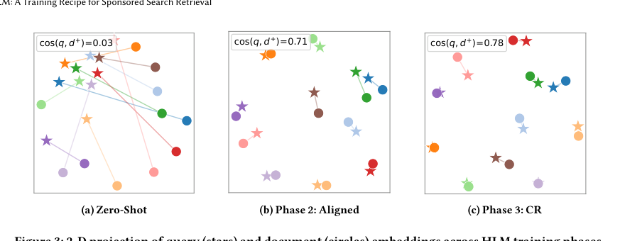
*图示：Figure 3展示了HLM三阶段训练中query和document嵌入的2D投影变化（Zero-Shot → Phase 2 Aligned → Phase 3 CR），直观体现了论文核心的三段式训练配方及其效果，是最能代表方法的图。其他候选要么是收敛曲线（实验性图），要么缺caption。*

**核心技术点：**

#### 技术点 1：三段式训练配方
- 快速理解：把教师训练、query对齐、对比微调拆成三步，避免一次端到端训练同时学多个目标

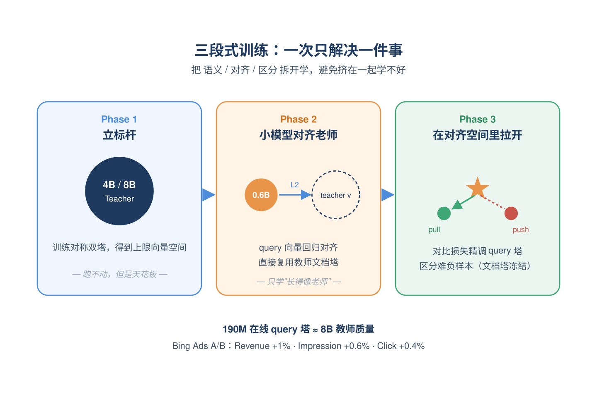
*图示：可以理解为：先请一位'天花板老师'告诉你最好能做到多好，再让小学生模仿老师写出的query向量(纯无监督回归)，最后让小学生在老师已经布好的文档坐标系里专门练一下'区分对错'。一次端到端训练等于让小模型同时学会语义、学会跟大文档塔兼容、学会区分难负样本，三件事挤在一起反而学不好；分三步则每步只解决一个问题。*

- 技术细节：第一阶段用4B/8B的Qwen3-Embedding做对称双塔教师，用Qwen3版的InfoNCE（带同塔负例、挖掘的难负、屏蔽假负）训练，得到一个高质量但跑不动的上限模型。第二阶段冻结教师，把小模型(0.6B或更小)的query向量用L2回归对齐到教师query向量空间，文档塔直接复用教师的(离线索引)。第三阶段冻结教师文档塔，用监督对比损失只精调对齐后的小query塔，让它在已对齐的空间里再把正样本和难负样本拉得更开。
- 通俗讲解：可以理解为：先请一位'天花板老师'告诉你最好能做到多好，再让小学生模仿老师写出的query向量(纯无监督回归)，最后让小学生在老师已经布好的文档坐标系里专门练一下'区分对错'。一次端到端训练等于让小模型同时学会语义、学会跟大文档塔兼容、学会区分难负样本，三件事挤在一起反而学不好；分三步则每步只解决一个问题。
- 例子：比如query'change from pdf into word free'，第一阶段训出的8B教师把它编成一个高质量向量v-T；第二阶段拿2B条无标注query文本，让0.6B小模型对每条query输出v-S，用L2拉近v-S和v-T，使v-S直接能跟教师的广告向量库匹配；第三阶段再用Bing的(query, 正广告, 难负广告)对，按对比损失微调小模型，使该query向量更靠近正广告、远离扣子是PDF转换器但相关度0.2-0.5的难负广告。

#### 技术点 2：L2对齐胜过KL/核对齐
- 快速理解：直接用L2回归把学生query向量拉到教师向量上，比KL蒸馏和核矩阵对齐都好

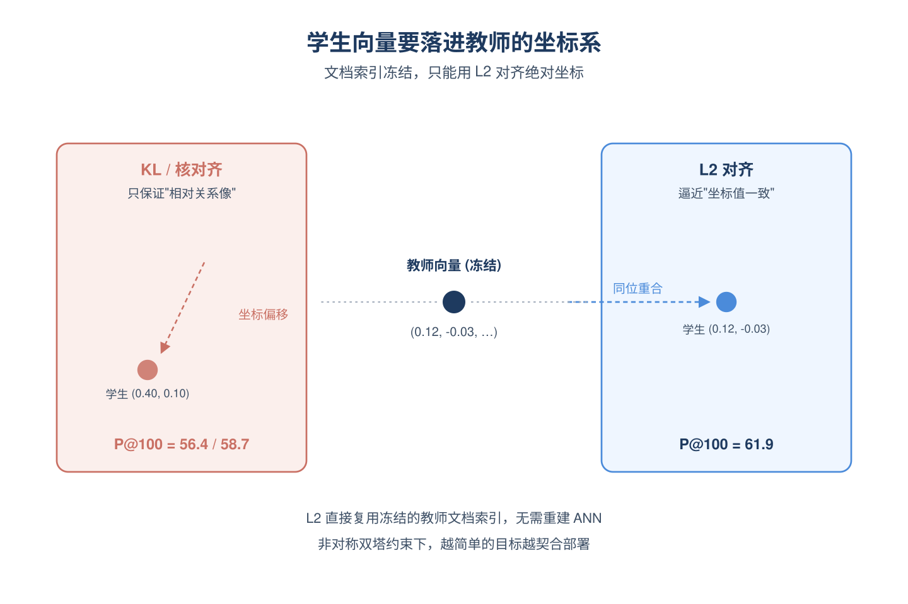
*图示：KL蒸馏和核对齐本质都是'让相对关系像'，但相对关系再像，绝对坐标偏移一点，跟冻结的文档索引就对不上号。L2则是'坐标值要一样'，这正好满足'文档塔不动、只换query塔'的部署需求。所以越简单的目标反而越契合非对称双塔的实际约束。*

- 技术细节：对齐阶段比较了三种目标：基于教师softmax分数的KL散度对比蒸馏、基于教师/学生相似度核矩阵匹配的无监督核对齐、以及作者用的最简单的逐样本L2向量距离。在固定Qwen3-4B教师、Qwen3-0.6B学生时，L2对齐把学生P@100做到61.9，而KL只有56.4、核对齐58.7，差距明显。L2对齐还有一个关键好处：它直接把学生的向量塞进教师向量空间，因此可以无缝复用冻结的教师文档索引，不需要重建ANN库。
- 通俗讲解：KL蒸馏和核对齐本质都是'让相对关系像'，但相对关系再像，绝对坐标偏移一点，跟冻结的文档索引就对不上号。L2则是'坐标值要一样'，这正好满足'文档塔不动、只换query塔'的部署需求。所以越简单的目标反而越契合非对称双塔的实际约束。
- 例子：同一句query进去，教师8B输出向量(0.12, -0.03, ...)。KL蒸馏只保证学生对一批候选广告的打分排序跟老师像，但学生输出可能是(0.40, 0.10, ...)，跟离线已经入库的教师文档向量内积就偏了；L2则强迫学生输出也接近(0.12, -0.03, ...)，学生上线后跟原文档索引算内积，结果几乎和教师本人一致。

#### 技术点 3：渐进剪枝+反复对齐
- 快速理解：层数和FFN宽度一档档剪、剪一次对齐一次，避免一步剪到底导致质量崩盘

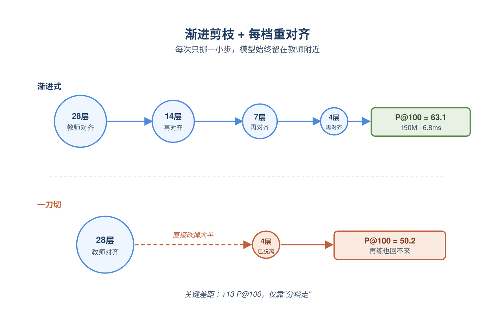
*图示：一次性砍一半身体的小模型基础太差，对齐损失从一开始就很高，再怎么练也回不来；分档剪、每档都先把模型重新对齐到教师空间，相当于每次只做一点点改动，模型始终待在'离教师不远的好初始点'附近，优化就能继续走下去。*

- 技术细节：在已对齐的Qwen3-0.6B(28层)基础上做结构化剪枝：用校准数据测每层的'输出/输入范数比'作为层重要性，保留top-K层；FFN内部用门控×上投影激活值大小给每个隐藏单元打分，保留top-K单元，再同步剪down投影。剪完一次就重新做一次L2对齐，再剪下一档(28变成14变成7变成4变成2层)。论文显示剪到4层(190M参数)P@100只从61.9掉到60.4，再做对比微调还能回到63.1，延迟从约41ms降到6.8ms；但如果一步从0.6B直接剪到4层再对齐，P@100只剩50.2。
- 通俗讲解：一次性砍一半身体的小模型基础太差，对齐损失从一开始就很高，再怎么练也回不来；分档剪、每档都先把模型重新对齐到教师空间，相当于每次只做一点点改动，模型始终待在'离教师不远的好初始点'附近，优化就能继续走下去。
- 例子：想要一个能跑在低端GPU/CPU上的4层小模型：先把28层剪成14层并对齐，再剪到7层并对齐，再到4层并对齐，每一步L2 loss都能收敛得很低；最终4层模型在A100上6.8ms能跑6800 QPS，P@100=63.1，相比直接剪4层的50.2高出近13个点。

#### 技术点 4：非对称双塔的真正难点
- 快速理解：小query塔配大文档塔不能一把梭训，否则大文档塔会迁就小query塔

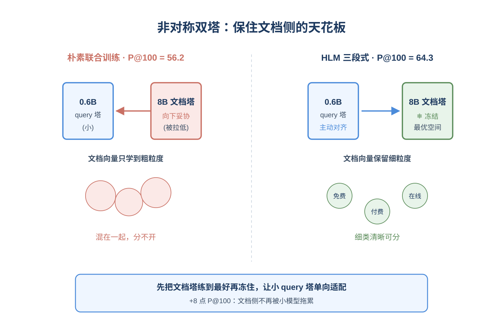
*图示：可以想成两个人合作写题：如果让学霸和学渣一起从零做题，学霸会下意识把答案写得'学渣也能看懂'，整体水平被拉低；HLM的做法是先让两个学霸一起把答案写到最好(对称大双塔)，再让学渣单独练习'看懂学霸答案'，文档侧的高质量被锁定了，最终质量上限明显更高。*

- 技术细节：论文做了一个关键对照：用同样的小query+大文档结构直接做监督对比训练(Naive CL)，0.6B query+8B文档只能拿到56.2 P@100；走HLM三段式则达到64.3，整整高出8个点以上。作者解释原因：联合训练时大文档塔会向小query塔的能力'妥协'，文档表示不再是它本可以达到的最优；而HLM先用对称大双塔训出最佳文档空间并冻结，再让小query塔被动适配这个高质量索引，文档侧的天花板就保住了。
- 通俗讲解：可以想成两个人合作写题：如果让学霸和学渣一起从零做题，学霸会下意识把答案写得'学渣也能看懂'，整体水平被拉低；HLM的做法是先让两个学霸一起把答案写到最好(对称大双塔)，再让学渣单独练习'看懂学霸答案'，文档侧的高质量被锁定了，最终质量上限明显更高。
- 例子：广告库里关于'pdf转word'的广告，对称8B双塔训练出的文档向量能精细区分'免费在线转换工具'与'需要付费的Office订阅'；如果直接和小query塔联合训，文档向量可能只学到粗粒度的'pdf相关'，因为更细的差异小query塔抓不到，最终在线召回也分不开这两类广告。HLM中文档塔被冻结，文档向量保留细粒度，小query塔通过对齐+对比微调学会去命中正确那类。

#### 技术点 5：线上A/B与延迟收益
- 快速理解：190M小模型上线Bing Ads，延迟比8B低27倍，营收/曝光/点击全正

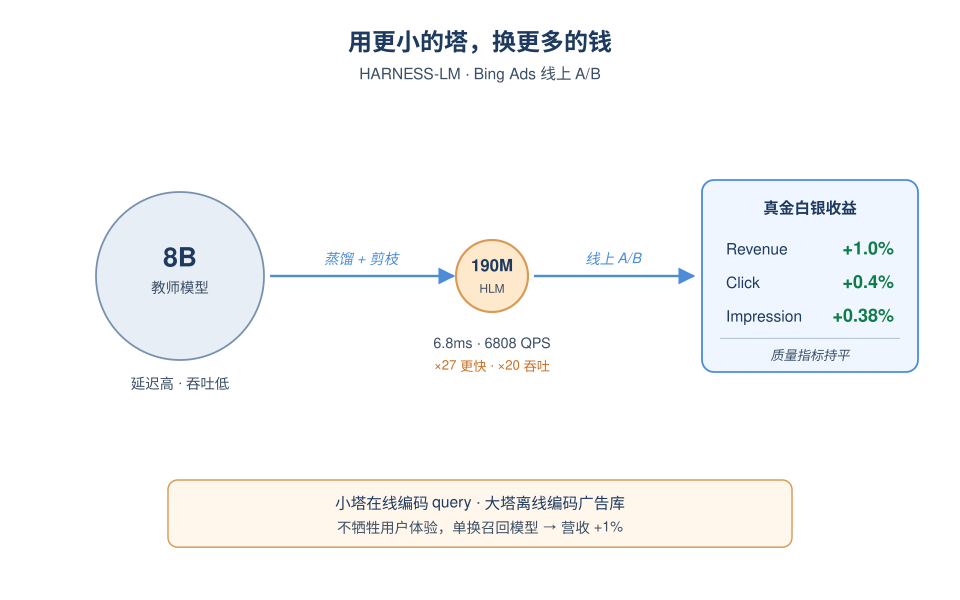
*图示：对工业广告团队来说这组数字含义很直接：在不牺牲用户体验指标(快速返回率、广告相关性缺陷率)的前提下，单独换一个召回小模型就能多赚1%的营收，这是大多数线上实验梦寐以求的量级。*

- 技术细节：最终部署的是剪枝后的4层190M模型，A100上query编码延迟6.8ms、吞吐6808 QPS，相对8B教师延迟降低约27倍、吞吐提升约20倍。在Bing Ads真实流量上替换当前生产中由多个检索器组成的ensemble，A/B显示Revenue +1.0%、Click +0.4%、Impression +0.38%，而Quick Back Rate和Ad Defect率基本持平，说明质量没有变差。
- 通俗讲解：对工业广告团队来说这组数字含义很直接：在不牺牲用户体验指标(快速返回率、广告相关性缺陷率)的前提下，单独换一个召回小模型就能多赚1%的营收，这是大多数线上实验梦寐以求的量级。
- 例子：线上每个query进来，原本要走多个召回(传统倒排+多个稠密塔)凑结果，现在加上HLM 190M塔后，对'change from pdf into word free'这类长尾query，能稳定召回更相关的转换工具广告，从而点击和成交都上升，但用户点完不会快速返回，说明召回的广告确实更对路。

- **对广告的启发：** 广告召回可直接复刻：先大双塔教师→L2对齐小query塔→冻结文档塔做对比微调
- **适用边界：** 方法强假设是'文档塔可以离线、可以做大'，对那些文档侧也要频繁实时编码或文档量没那么大的场景红利会缩小；另外对齐阶段的query语料分布如果跟线上分布偏差较大，迁移效果会打折扣，论文也观察到只用广告query对齐会损害通用语义能力，需要混入公开多语文本。
- **实践建议：** 如果你团队已有一个不错的双塔召回小模型，强烈建议先尝试：训一个更大的对称双塔教师→冻结教师文档塔，用大批无标注线上query对小query塔做L2对齐→再用现有(query,正样本,难负)数据冻结文档塔做对比微调，几乎不动线上索引就能拿到一波明显收益。

### 2. TubiFM: Unified Item, Carousel, and Search Ranking for Streaming Discovery
- **为什么值得看：** 用一个生成式LLM统一item/carousel/search排序，工业A/B验证且降延迟
- **背景：** 在Tubi这类流媒体里，首页item推荐、carousel(内容行)推荐、搜索结果排序通常是三个独立模型，但它们其实共享同一份用户旅程：观看影响推荐、搜索query暴露意图(哪怕没点击)、观看历史又能帮助理解搜索是回看还是新发现。各自建模既丢信号又拉高维护成本，所以作者想用一个统一的生成式排序模型把三任务合并；该论文有真实工业A/B和延迟数据，因此对做广告多链路统一的同学有参考价值。
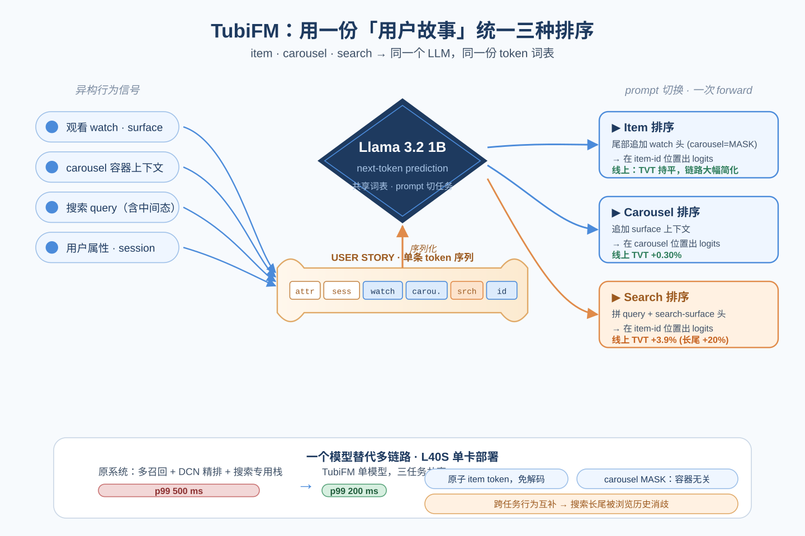
*图示：这篇论文把流媒体里item排序、carousel排序、搜索排序三个原本独立的模型，用一个基于Llama 3.2 1B的生成式排序统一掉，并在Tubi线上A/B验证有效、p99延迟从500ms降到200ms。对广告系统而言，召回-粗排-精排-重排-搜索广告这种多链路、多模型的现状高度类似，因此这种'用户故事+prompt切换任务'的范式是非常值得迁移参考的工业实践。*

**核心技术点：**

#### 技术点 1：用户故事序列化表示
- 快速理解：把用户跨surface的属性、会话、观看、搜索串成一条token序列

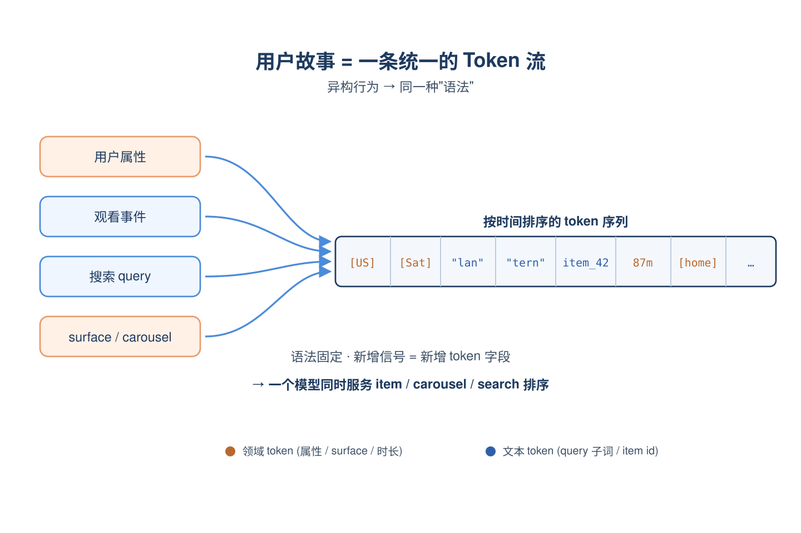
*图示：可以把它理解为给用户写一份按时间排的'看片日记'，里面既有自然语言token(属性、搜索词)又有专门的领域token(item id、carousel名、surface)。模型读这本日记时，watch、search、surface在它眼里就是同一个序列里不同类型的'词'，前后能互相提供上下文。*

- 技术细节：user story是一条扁平token序列，先放用户属性(国家/设备等用普通文本)，再按时间放session块。每个session有elapsed小时和星期几字段，session内按时间序穿插watch事件(item id token、surface、carousel、时长、小时)和search事件(query的BPE子词，包括边打字边搜的中间query)。这样把跨surface的异构行为统一成一份'语法固定'的token流，新增信号只需要加新的token字段。
- 通俗讲解：可以把它理解为给用户写一份按时间排的'看片日记'，里面既有自然语言token(属性、搜索词)又有专门的领域token(item id、carousel名、surface)。模型读这本日记时，watch、search、surface在它眼里就是同一个序列里不同类型的'词'，前后能互相提供上下文。
- 例子：比如某用户故事可能是：属性头变成session(周六凌晨)变成搜lan变成搜lantern变成在search surface点了某部恐怖片看87分钟变成16小时后再开一个session，从home的'雨夜回看'carousel里又把那部片重看了27分钟。整条序列就是一个token串，模型据此学'回看意图'与surface的关系。

#### 技术点 2：Prompt切换三任务
- 快速理解：在用户故事后面拼不同任务头，next-token打分就分别得到三种排序

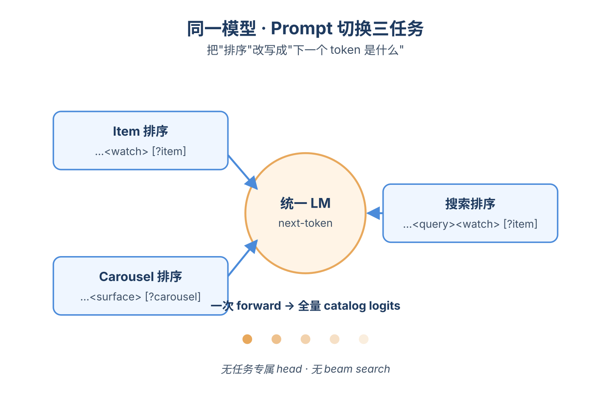
*图示：把'排序'这件事改写成'下一个token最该是什么'。要排item就让模型在'下一观看'位置给所有item id算概率，要排carousel就让它在'下一carousel'位置打分，要排搜索结果就在query后面问'用户最可能点哪个item'。同一个模型、同一份词表，靠prompt切换任务。*

- 技术细节：三个任务都被改写成next-token预测：item排序在故事末尾追加一个watch事件头(可用MASK的carousel做容器无关排序)，让模型在item id token位置出logits；carousel排序追加surface上下文，让模型在carousel token位置出logits；搜索排序追加query token加search-surface watch头，再在item id位置出logits。一次forward就能对全量catalog或全量carousel打分，不用任务专属head也不用beam search。
- 通俗讲解：把'排序'这件事改写成'下一个token最该是什么'。要排item就让模型在'下一观看'位置给所有item id算概率，要排carousel就让它在'下一carousel'位置打分，要排搜索结果就在query后面问'用户最可能点哪个item'。同一个模型、同一份词表，靠prompt切换任务。
- 例子：比如用户搜了'fog'，serving时把当前用户故事+session头+'\<search\>fog\<watch\>\<surface=search\>'拼成prompt，跑一次forward，对所有item id token的logits排序就是搜索结果；把prompt换成'\<watch\>\<surface=home\>\<carousel(MASK)\>'，同一个模型马上变成首页item排序器。

#### 技术点 3：原子item token+训练masking
- 快速理解：每个item用一个原子token，并随机mask carousel让排序与容器解耦

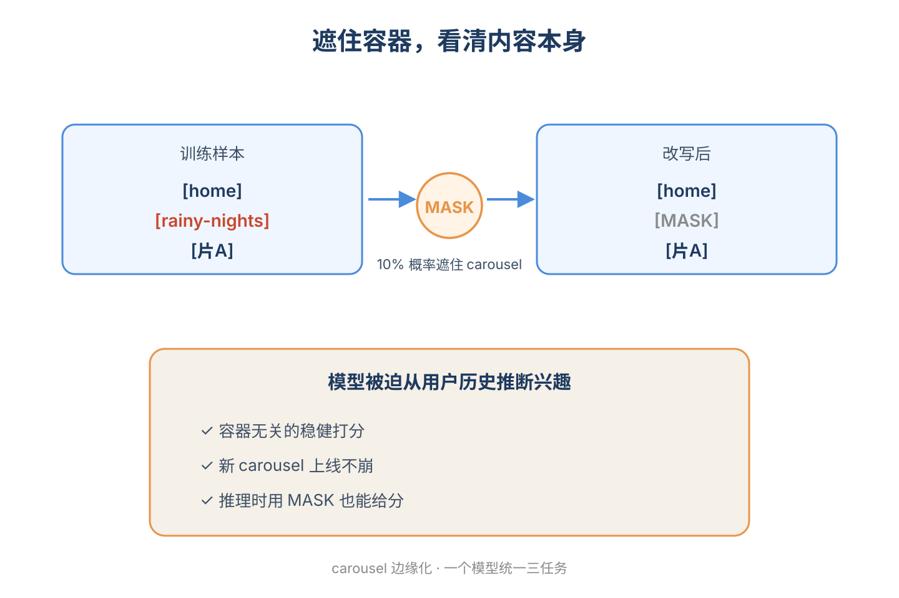
*图示：原子token的好处是打分快——一次forward直接拿到对所有item的概率分布，不用beam search。carousel mask的作用是教模型：就算不知道这个观看来自哪个carousel，也要能合理估计用户会不会看；这样推理时无论用真实carousel上下文还是MASK，都能给出稳健的item分数。UNK token则是给新品留的占位符。*

- 技术细节：约10万部影片每部分配一个独立token，next-token一次性输出全catalog logits，省掉semantic id的自回归解码。训练时以0.1概率把(surface,carousel)替换成(home, MASK)，让模型学到'容器无关'的item分数，相当于对carousel边缘化；还以0.001概率把item id替换成UNK token，让新上架内容在catalog token还没刷新前也能被打分。词表月度刷新一次。
- 通俗讲解：原子token的好处是打分快——一次forward直接拿到对所有item的概率分布，不用beam search。carousel mask的作用是教模型：就算不知道这个观看来自哪个carousel，也要能合理估计用户会不会看；这样推理时无论用真实carousel上下文还是MASK，都能给出稳健的item分数。UNK token则是给新品留的占位符。
- 例子：训练时一条样本里'\<surface=home\>\<carousel(rainy-nights)\>\<id(片A)\>'有10%概率被改写成'\<surface=home\>\<carousel(MASK)\>\<id(片A)\>'，模型被迫从用户其他历史推断片A会被看，而不是依赖rainy-nights这个容器。上线后即使新增一个carousel，模型也能用MASK打分而不崩。

#### 技术点 4：统一训练优于专用
- 快速理解：三任务共训的TubiFM全面超过任务专用版本和SASRec/HSTU/BM25

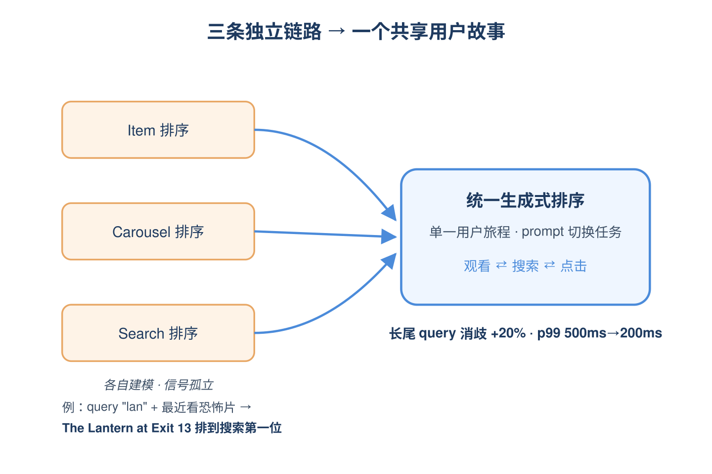
*图示：证据链是：先在自己的数据上对比任务专用baseline和任务专用版TubiFM，确认增益既来自架构也来自跨任务共训；再在生产A/B里跟成熟的DCN两段式系统比，搜索/carousel是真涨TVT，item是'打平但极大简化'。说明跨任务行为信号确实互相增强，尤其是搜索这种lexical证据稀疏时，浏览历史能帮模型消歧。*

- 技术细节：用Llama 3.2 1B初始化、约2000万用户、110亿token、1024上下文、120k步训练。离线HR@8相对HSTU在item排序上+41%、carousel +8%、搜索相对BM25 +22%；统一模型还比'同backbone但只看任务专属视图'的TubiFM变体在item HR@8上再高17%。线上A/B：搜索TVT +3.9%(长尾query +20%)，carousel TVT +0.30%(头部位置增益更大)，item TVT中性但用单模型替代了多召回+DCN精排的整条链路，p99从500ms降到200ms。
- 通俗讲解：证据链是：先在自己的数据上对比任务专用baseline和任务专用版TubiFM，确认增益既来自架构也来自跨任务共训；再在生产A/B里跟成熟的DCN两段式系统比，搜索/carousel是真涨TVT，item是'打平但极大简化'。说明跨任务行为信号确实互相增强，尤其是搜索这种lexical证据稀疏时，浏览历史能帮模型消歧。
- 例子：用户输入很短的query'lan'，BM25几乎没法判断要lantern还是landscape，但TubiFM在prompt里能看到该用户最近一直在看恐怖片，于是更倾向把The Lantern at Exit 13排到搜索结果第一位——这就是搜索长尾query上+20% TVT的直观来源。

- **对广告的启发：** 广告多链路(自然推荐+搜索广告+不同广告位)可考虑用统一用户故事+prompt切任务
- **适用边界：** 方法目前只在流媒体视频且catalog约10万的规模上验证；标签来自隐式正反馈，不含完整相关性判定；上下文截断到1024 token，超长行为历史会被裁掉，对超大候选库或需要严格数值校准(如竞价pCTR)的广告排序需谨慎迁移。
- **实践建议：** 可以先在一个小场景(比如搜索广告相关性或某个广告位的精排)做POC：把用户跨场景行为序列化成统一token流，用一个开源小LLM做next-token排序，对比现有DCN精排的离线HR/NDCG和线上延迟，验证'统一表示+prompt切任务'是否在你们体量下能既涨指标又降serving复杂度。
