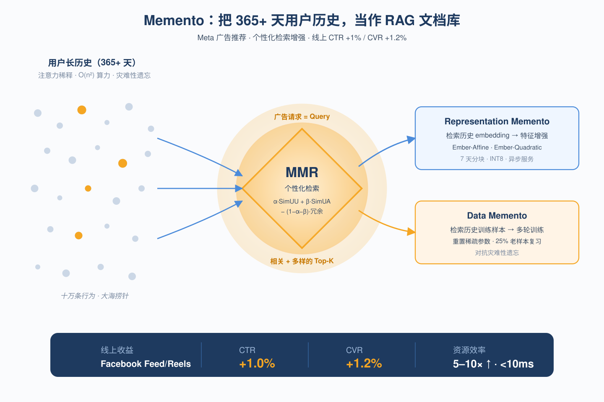
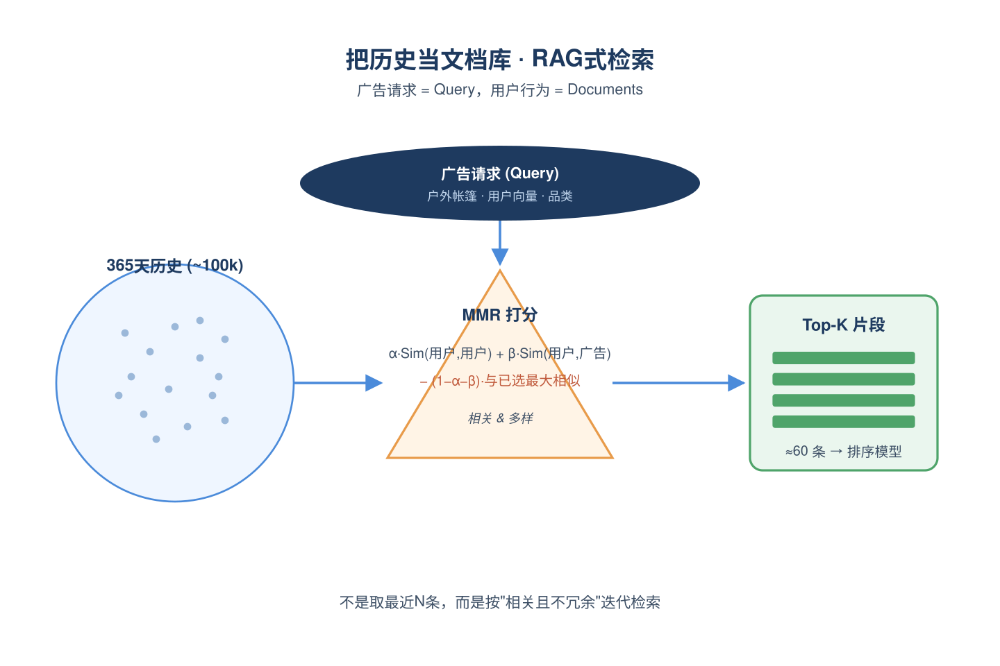
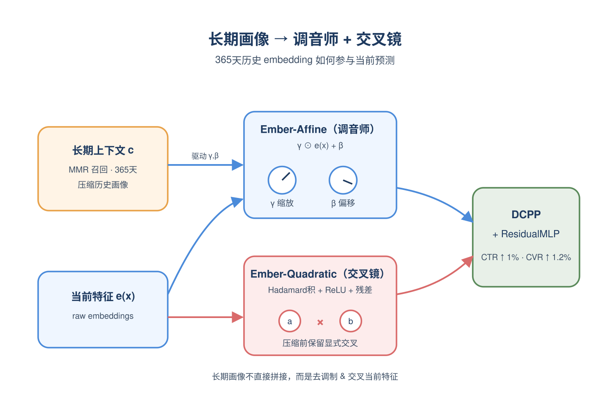
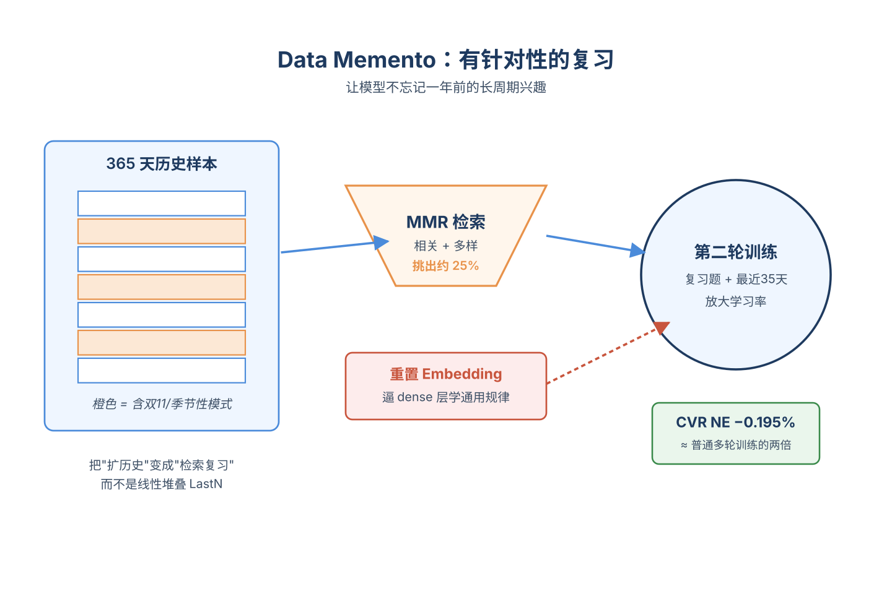
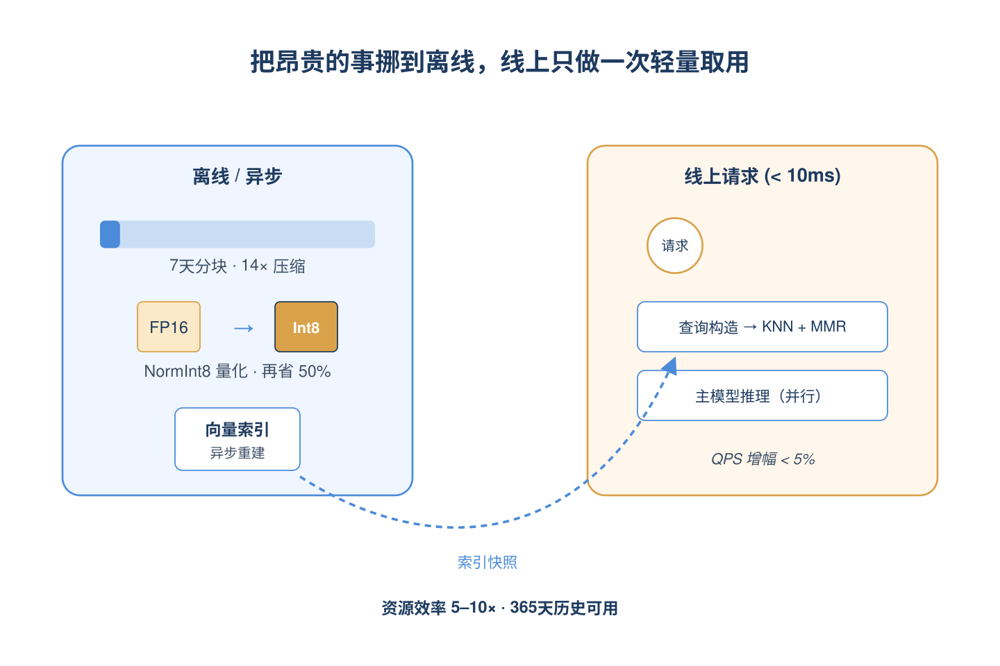
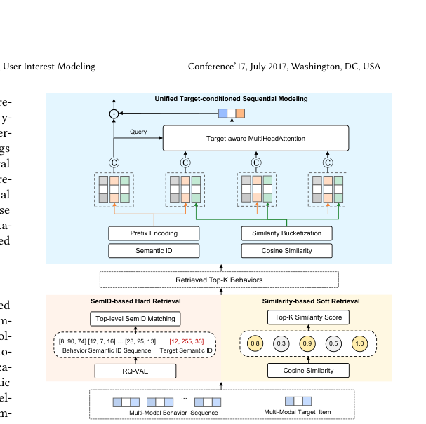
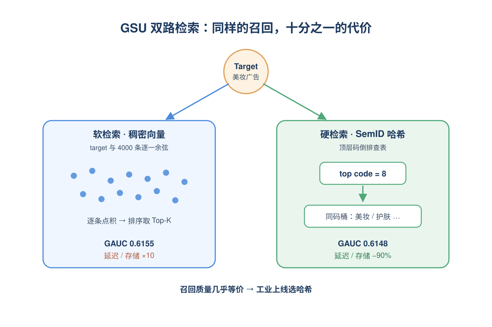
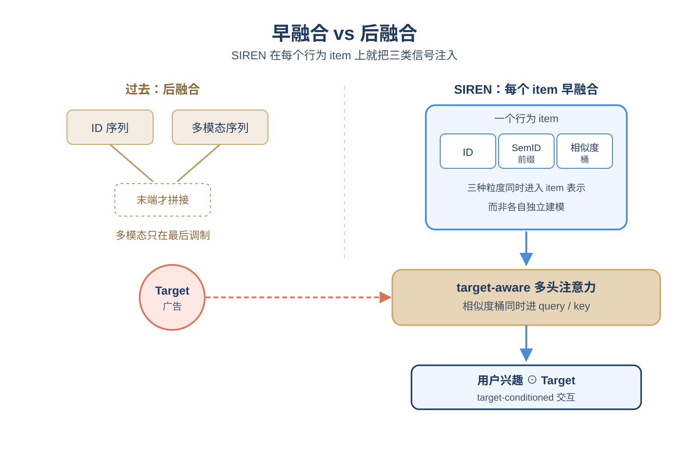
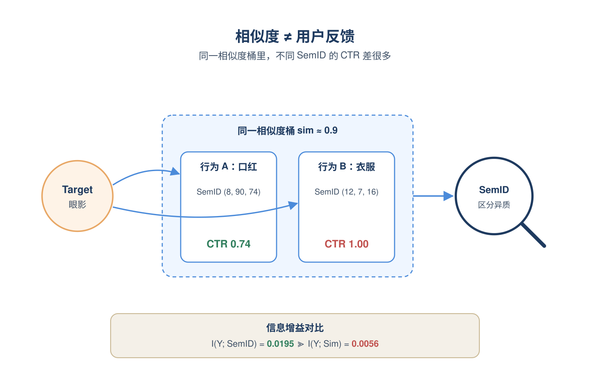

# 2026-05-26 论文日报

## 一、今日趋势与创新观察

### 1. 趋势概况

- 今日全量745篇，cs.AI 467篇、cs.LG 243篇、cs.IR 35篇，LLM与语言理解类323篇仍占最大主题，但工业推荐与CTR的论文密度较前几日明显提升。
- 表示学习与检索排序方向229篇，议题集中在生成式重排、终身多模态兴趣建模、稀疏编码器跨语言迁移和语义ID tokenizer评测可靠性等具体技术点。
- Agent与多智能体方向145篇，研究重心从能力刷榜转向工具注册表治理、MCP协议安全、可验证多智能体编排等系统级问题。
- 迁移学习与跨域泛化119篇，多语种检索（含Amharic等低资源语言）、CTR字段异构性、跨模态对齐成为跨域议题主线。

### 2. 推荐系统 / 排序相关创新点

- Meta的Memento把用户长期行为视为可检索文档，用RAG式个性化检索替代传统LastN截断，缓解长上下文注意力稀释与灾难性遗忘并在Facebook Feed/Reels线上验证。
- Selective Test-Time Compute Scaling将LLM的测试时算力扩展思想迁移到工业CTR，按预测不确定性触发特征路径探索，实现非对称的算力分配并取得7天A/B 5.3% CTR提升。
- Self-Balancing Gradient Allocation针对生成式CTR预训练中字段难度差异，提出自平衡梯度分配，避免简单字段主导重建目标导致的表示塌缩。

### 3. 全局创新点

- Agent-Facing Information Design把LLM工具注册表类比为无监管广告平台，首次系统性引入可见性标准、质量分与结果审计的机制设计框架。
- Choosing Online Experiment Designs under Interference在预算、库存、图溢出等干扰机制未知时，把随机化设计本身视为统计决策问题，给出广告与推荐A/B的统一选择方法。
- Attested Tool-Server Admission为MCP协议补上服务端可信准入扩展，把硬件证明与敏感度分级引入Agent-工具交互，是Agent生态的系统级安全创新。

### 4. 跨论文综合观察

- Memento、SIREN、LENS三篇都在攻同一个问题——长/终身用户行为如何更高效地参与排序，但分别从检索化召回、多模态多粒度交互、序列交互粒度分层三个层面切入，呈现出'长行为建模'方法论的分层化趋势。
- Selective Test-Time Compute与Self-Balancing Gradient Allocation共同体现了把LLM社区的训练/推理范式（测试时算力、生成式预训练）系统迁移到CTR工业场景的潮流，且都在线上A/B拿到正向收益。
- Agent-Facing Information Design与Choosing Online Experiment Designs共享一个视角：把广告/拍卖里的机制设计与因果推断工具迁移去解决新场景（LLM工具市场、含干扰的在线实验），说明广告方法论正在反向输出到更广的AI系统治理领域。

## 二、今日入选论文

### 1. Memento: Personalized RAG-Style Long-Retention Data Scaling for META Ads Recommendation
- 挑选理由：Meta广告推荐生产系统，RAG风格的长历史检索建模，含Facebook Feed/Reels线上CTR/CVR提升，典型工业广告核心论文。

### 2. SIREN: Unified Multi-Granularity Semantic Interaction for Multi-Modal Lifelong User Interest Modeling
- 挑选理由：腾讯广告平台已全量上线的多模态终身兴趣建模，直接服务广告排序与GMV提升。

## 三、补充关注

1. **How Reliable Are Semantic-ID Tokenizer Comparisons in Generative Recommendation?**
   - 理由：对生成式推荐SemID评估范式的质疑，方法论参考价值，但非广告专项。
2. **What Gets Cited: Competitive GEO in AI Answer Engines**
   - 理由：研究 AI 答案引擎中内容被引用的因素，属于生成式引擎优化，与商业化曝光排序有一定参考意义但不直接是广告

## 四、重点论文精读

### 1. Memento: Personalized RAG-Style Long-Retention Data Scaling for META Ads Recommendation
- **为什么值得看：** Meta生产级RAG式长历史建模，CTR+1%/CVR+1.2%
- **背景：** 广告排序模型希望用更长的用户历史（数百天甚至上千天）来捕捉季节性购物、长周期兴趣，但传统LastN线性扩展存在三个瓶颈：长序列里相关信号被噪声稀释（needle-in-haystack）、注意力O(n²)算力扛不住、滚动窗口训练会让模型遗忘老行为。论文把'扩历史'重新定义成'信息检索问题'，借鉴LLM里的RAG思路，是工业广告里少见的把365+天历史真正用起来的完整方案，所以值得看。

*图示：这是Meta在Facebook Feed/Reels广告主模型上落地的RAG式长历史建模方案，把365天用户行为当文档检索来用，线上CTR提1%、CVR提1.2%，并附完整生产工程细节（量化、分块、异步索引），对工业级广告系统极具参考价值。*

**核心技术点：**

#### 技术点 1：把历史检索建模成RAG
- 快速理解：用改造版MMR从全量历史里挑出与当前广告请求最相关又多样的片段。

*图示：可以理解成给每个广告请求做一次'个性化的检索召回'：先按当前广告和用户当下兴趣去打分历史片段，再扣掉跟已选片段重复的部分，保证选出来的历史既相关又不冗余。一次推理流程是：来一个广告请求变成构造多维查询（时间、用户群、广告品类）变成在向量库里跑MMR迭代变成拿到几十条最有信息量的历史片段变成喂给排序模型。*

- 技术细节：论文把用户全量历史当文档库，把每次广告请求当查询，定义三种相似度：用户-用户(SimUU(Q,D))、用户-广告(SimUA(Q,D))、文档间(SimUU(Di,Dj))。打分函数是改造版MMR：用α加权用户-用户相似度、β加权用户-广告相似度、(1-α-β)惩罚与已选文档的最大相似度，迭代地选出K个历史片段。线上用预计算版MMR降低延迟，训练阶段用in-model版本调参。
- 通俗讲解：可以理解成给每个广告请求做一次'个性化的检索召回'：先按当前广告和用户当下兴趣去打分历史片段，再扣掉跟已选片段重复的部分，保证选出来的历史既相关又不冗余。一次推理流程是：来一个广告请求变成构造多维查询（时间、用户群、广告品类）变成在向量库里跑MMR迭代变成拿到几十条最有信息量的历史片段变成喂给排序模型。
- 例子：比如某用户有10万条历史行为，当前广告是户外帐篷。MMR先用用户-广告相似度把'露营、徒步、登山鞋'相关的历史片段拉到高分，再用多样性项压低三条都讲'同一双登山鞋点击'的冗余片段，最终从10万条里挑出比如60个embedding片段输入主模型，而不是简单拿最近30天。

#### 技术点 2：Representation Memento
- 快速理解：把检索到的历史embedding通过Ember架构注入主模型，做特征增强。

*图示：直觉是：光把历史embedding拼到用户特征上太浪费，但又不能在embedding层用注意力（太贵）。Affine相当于让'长期画像'当一个调音师，对每个特征做轻量的拉伸和偏移；Quadratic则是在压缩前先跑一遍便宜的两两特征乘法，把细粒度交叉信号保留下来。一次前向是：MMR召回60条历史embedding变成生成上下文向量c变成c驱动每个用户特征的γβ调制，同时raw embedding并行进QNN算交叉变成一起进入下游DCPP和ResidualMLP。*

- 技术细节：对约40个embedding来源、365天日级embedding做7天分块聚合+INT8量化，存进VectorDP。线上用MMR召回相关历史embedding，再用Ember架构融合：Ember-Affine用一个小MLP从历史上下文c生成每个特征的缩放γ和偏移β，做逐元素的仿射调制(γ⊙e(x)+β)，初始化成恒等映射；Ember-Quadratic在LCE压缩前并行跑一个分头的二次神经元(Hadamard积+ReLU+残差)，把显式特征交叉信号送进DCPP的权重生成路径。
- 通俗讲解：直觉是：光把历史embedding拼到用户特征上太浪费，但又不能在embedding层用注意力（太贵）。Affine相当于让'长期画像'当一个调音师，对每个特征做轻量的拉伸和偏移；Quadratic则是在压缩前先跑一遍便宜的两两特征乘法，把细粒度交叉信号保留下来。一次前向是：MMR召回60条历史embedding变成生成上下文向量c变成c驱动每个用户特征的γβ调制，同时raw embedding并行进QNN算交叉变成一起进入下游DCPP和ResidualMLP。
- 例子：原本3800个embedding槽位会被压成64维后再做交叉，细节早丢了。加了Quadratic后，比如'最近浏览品类'和'长期消费力'这两个槽位在压缩前就先做了Hadamard积，结果再进DCPP，论文报告这一改动带来约0.03% NE提升、QPS反而更好。

#### 技术点 3：Data Memento对抗遗忘
- 快速理解：把灾难性遗忘当检索问题，二轮训练时定向回放MMR选出的老样本。

*图示：核心直觉：模型在滚动窗口训练里会逐渐忘掉半年前的模式，所以需要'有针对性地复习'。重置embedding是为了不让模型靠死记硬背老样本作弊，逼dense层学通用规律；MMR则保证复习材料是真正会被遗忘且当前还相关的题目，而不是随便翻。一次训练流程：先在150天baseline上重置sparse参数变成用MMR从一年历史里挑25%样本变成拼上最近35天，用大学习率重新训练。*

- 技术细节：把每条训练样本(user, ad, label)用双塔模型编成embedding，按小时分块并按模型loss做正负采样后入库。二轮训练时先重置稀疏参数（embedding表清零）+放大学习率，再用MMR从O(365)天历史训练数据里挑出约25%最相关的老样本，与最近35天数据一起做第二遍训练。论文实验显示：重置比embedding shrinking好0.04% NE，MMR比随机采样好0.07% NE。
- 通俗讲解：核心直觉：模型在滚动窗口训练里会逐渐忘掉半年前的模式，所以需要'有针对性地复习'。重置embedding是为了不让模型靠死记硬背老样本作弊，逼dense层学通用规律；MMR则保证复习材料是真正会被遗忘且当前还相关的题目，而不是随便翻。一次训练流程：先在150天baseline上重置sparse参数变成用MMR从一年历史里挑25%样本变成拼上最近35天，用大学习率重新训练。
- 例子：比如季节性购物用户在双11附近的转化模式，普通35天窗口模型早忘了。Data Memento会用当前数据分布去检索一年前类似的(user, ad)样本作为复习集，论文报告CVR模型在DM-MMR25-RS配置下相对baseline有-0.195% NE，比单纯多轮训练baseline (-0.107%)几乎翻倍。

#### 技术点 4：工程协同设计
- 快速理解：通过分块、INT8量化、异步索引把RAG做到sub-10ms线上延迟。

*图示：工业落地里，算法再好如果延迟扛不住也上不了线。这里的思路是把'昂贵的事情'全挪到离线/异步：embedding提前分块量化、索引提前建好，线上只做一次轻量KNN+MMR召回。一次线上请求：广告请求到达变成并行发起异步查询构造变成向量库返回top-K历史变成主模型继续算变成全程检索控制在10ms内。*

- 技术细节：三件事：1) 时间分块——把连续7天embedding聚成一个epoch级片段，存储从约701K floats/user降到50K，14倍压缩；2) NormInt8量化——比FP16再省约50%；3) 异步服务——索引离线/异步重建不阻塞推理，查询构造与模型计算并行，神经网络推理时再去拿最新索引快照。整体相对线性LastN扩展拿到5-10×资源效率。
- 通俗讲解：工业落地里，算法再好如果延迟扛不住也上不了线。这里的思路是把'昂贵的事情'全挪到离线/异步：embedding提前分块量化、索引提前建好，线上只做一次轻量KNN+MMR召回。一次线上请求：广告请求到达变成并行发起异步查询构造变成向量库返回top-K历史变成主模型继续算变成全程检索控制在10ms内。
- 例子：线上A/B显示Representation Memento V1-FULL（30+源、360天）和V1-LITE（单源、180天）两版本部署后，QPS增幅都\<5%，没有显著推理变慢；Data Memento因CTR模型训练量太大暂时只在CVR模型上线，靠25-50%的MMR下采样把训练延迟控制在预算内。

- **对广告的启发：** 想做长历史建模的团队可以直接借鉴这套RAG+MMR+二轮回放的范式。
- **适用边界：** 方案高度依赖向量数据库、异步索引和大规模训练设施；CTR模型由于训练数据量过大，Data Memento暂未上线，说明在算力受限或训练管线较弱的团队里只能部分复用。MMR中β过大（如0.95）反而劣化，超参对场景敏感。
- **实践建议：** 可以先在自家广告排序里用一个轻量版试跑：把现有用户长期embedding序列按7天分块+INT8量化入向量库，用'用户-用户+用户-广告+多样性'的MMR召回top-K，作为额外特征拼到主模型，验证NE收益再决定是否引入Ember和二轮回放。

### 2. SIREN: Unified Multi-Granularity Semantic Interaction for Multi-Modal Lifelong User Interest Modeling
- **为什么值得看：** 腾讯广告全量上线的多模态终身兴趣建模，GMV显著提升
- **背景：** 工业广告排序里同时用终身行为序列和多模态内容已经是大势所趋，但多模态嵌入空间和ID协同空间天然不对齐，过去主流做法是把多模态序列和行为序列分开建模、最后再后融合，结果就是多模态信号只能当注意力调制或序列级增强，没法在item级别和ID特征真正交互。论文还观察到：仅用target-behavior相似度分桶是粗粒度的，相同相似度桶内不同Semantic ID组的CTR差异很大，尤其在高相似度区间，说明光靠相似度不能区分'语义接近但用户反馈不同'的行为对。

*图示：该候选是Figure 3 SIREN整体架构图，清晰展示了GSU双路检索（SemID hard / Similarity soft）与ESU目标条件序列建模的多粒度早融合流程，正好对应论文核心方法。相比page-2-drawing-caption-26，此版本正文噪声更少、图主体更聚焦完整。*

**核心技术点：**

#### 技术点 1：GSU双路检索
- 快速理解：软检索看效果、SemID硬检索看上线效率，两条路任选

*图示：想象你要从用户两年的4000条行为里挑50条最相关的：软检索是把每条行为的稠密向量都和target算余弦，贵但准；硬检索是先把每条行为打上一个'语义类目编号'(顶层SemID)，然后只挑和target同编号的，等于把相似度匹配换成了哈希查表。论文发现这两种召回质量在GAUC上差不多，因此线上选硬检索省成本。*

- 技术细节：GSU阶段提供两种从终身行为里挑Top-K的策略：一是基于多模态embedding余弦相似度的软检索（效果好但要维护稠密向量索引）；二是基于Semantic ID顶层码的硬检索——用RQ-VAE把每个item的多模态embedding离散化成多层码，检索时只取target的顶层码，从倒排索引里捞所有顶层码相同的历史行为。两者性能接近(GAUC 0.6155 vs 0.6148)，但硬检索把在线延迟和存储降了90%以上。
- 通俗讲解：想象你要从用户两年的4000条行为里挑50条最相关的：软检索是把每条行为的稠密向量都和target算余弦，贵但准；硬检索是先把每条行为打上一个'语义类目编号'(顶层SemID)，然后只挑和target同编号的，等于把相似度匹配换成了哈希查表。论文发现这两种召回质量在GAUC上差不多，因此线上选硬检索省成本。
- 例子：比如target是一条美妆广告，RQ-VAE给它编码成（8, 90, 74），那硬检索就直接从倒排表里捞所有顶层码=8的历史行为(可能是各种美妆/护肤/化妆品)，不用算任何向量内积；而软检索则要把这4000条行为的128维向量都和target向量做点积排序。

#### 技术点 2：ESU多粒度早融合
- 快速理解：把SemID和相似度桶在item级别拼进表示，再做target attention

*图示：关键差异是'早融合'：以前的做法是多模态序列汇总成一个向量、ID序列汇总成一个向量，最后两个向量拼一下，多模态信号只在最后一步起作用。SIREN则在每个行为还没被聚合之前，就把'这个item是什么(SemID)'和'它和target有多像(相似度桶)'都注入进去，让注意力机制在算权重和算加权和的时候都能用上这些信号。*

- 技术细节：ESU不再走'多模态序列单独建模+后融合'的老路，而是在每个行为item上把三类特征拼在一起：ID类特征embedding、prefix编码的SemID embedding（把(c1)、(c1,c2)、(c1,c2,c3)各层前缀都查表后拼接，保留层次语义）、以及该行为与target的余弦相似度分桶embedding。然后用target-aware多头注意力，注意力的query/key都包含相似度桶信息，让相似度既调制注意力权重，也参与行为表示本身。最后再做一次user兴趣表示和target表示的逐元素相乘做target-conditioned interaction。
- 通俗讲解：关键差异是'早融合'：以前的做法是多模态序列汇总成一个向量、ID序列汇总成一个向量，最后两个向量拼一下，多模态信号只在最后一步起作用。SIREN则在每个行为还没被聚合之前，就把'这个item是什么(SemID)'和'它和target有多像(相似度桶)'都注入进去，让注意力机制在算权重和算加权和的时候都能用上这些信号。
- 例子：用户历史里有一条'买过口红'的行为，target是'眼影广告'：先算两者多模态相似度0.8，落到第8个桶查表得到一个桶embedding；再把口红的SemID前缀（8）、（8,90）、（8,90,74）分别查表拼接得到语义embedding；然后这条行为的最终表示=ID embedding ⊕ SemID embedding，注意力打分时再把相似度桶embedding拼进query/key，target attention给它一个较高权重，加权聚合后再和target做逐元素乘得到最终用户兴趣向量。

#### 技术点 3：为什么要细粒度SemID
- 快速理解：相似度桶只能给粗粒度对齐，桶内CTR方差很大需要SemID补

*图示：相似度桶告诉你'这条行为和target多像'，SemID告诉你'这条行为本身是什么'，两者互补。光看相似度的话，'买过口红'和'买过眼影'对'眼影target'可能相似度都是0.85，落进同一个桶，但用户对它们的真实点击率可能差很多——SemID能区分这种语义异质性。*

- 技术细节：论文用条件熵分析：SemID分组对click label的信息增益I(Y;SID)=0.0195，远高于相似度分桶的I(Y;Sim)=0.0056。同一相似度桶内不同SemID组的CTR标准差从低相似度桶的0.035涨到高相似度桶的0.068，说明'多模态空间相近≠用户反馈相同'。而且单纯加细相似度桶数量也不行——MUSE的桶数从20加到40 GAUC上升，再加就下降，因为histogram式聚合本身丢了item身份和时序信息。
- 通俗讲解：相似度桶告诉你'这条行为和target多像'，SemID告诉你'这条行为本身是什么'，两者互补。光看相似度的话，'买过口红'和'买过眼影'对'眼影target'可能相似度都是0.85，落进同一个桶，但用户对它们的真实点击率可能差很多——SemID能区分这种语义异质性。
- 例子：假设相似度都在（0.9,1.0）这个高桶里有两个行为：A是和target同品类口红、SemID=（8,90,74），B是只是颜色风格相近的衣服、SemID=（12,7,16）。光看相似度桶它们一样，但实测CTR一个0.74一个1.0，差距很大；加上SemID后模型就能学到这种细粒度区分。

- **对广告的启发：** 工业终身序列建模可直接借鉴：SemID硬检索省成本+item级早融合提效果
- **适用边界：** 方法依赖于已经和协同信号做过对齐的多模态embedding（论文用的是SCL预训练表示），如果业务里多模态embedding纯粹来自CLIP等内容预训练而没经过用户交互对齐，效果可能打折；另外RQ-VAE码表需要随item分布漂移定期重训，否则SemID硬检索召回会逐步失真。
- **实践建议：** 如果你们已经在跑SIM/TWIN类两阶段长序列方案，可以优先尝试把多模态embedding离散成SemID并做顶层码倒排作为GSU的补充召回路；ESU侧不必重写架构，只要在现有target attention的item特征里把'SemID前缀embedding'和'target相似度分桶embedding'拼进去就能拿到大部分收益。
