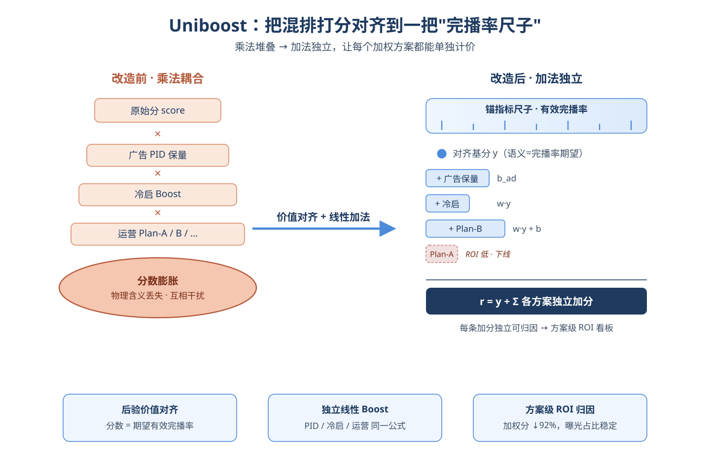
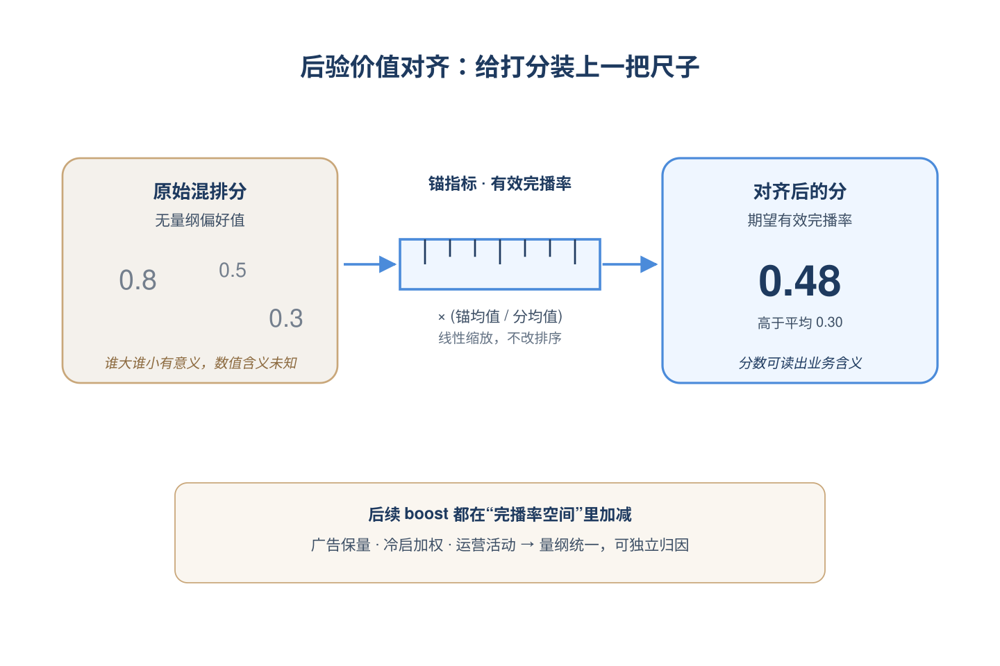
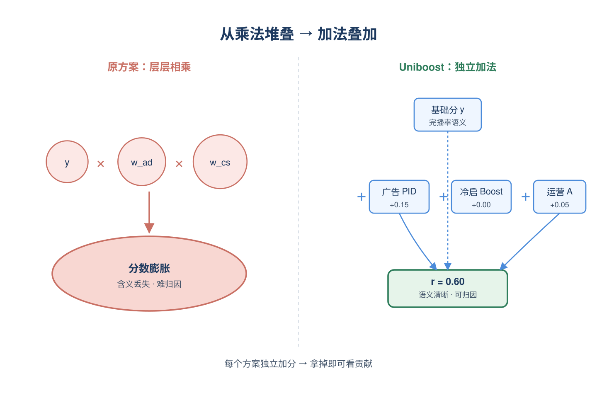
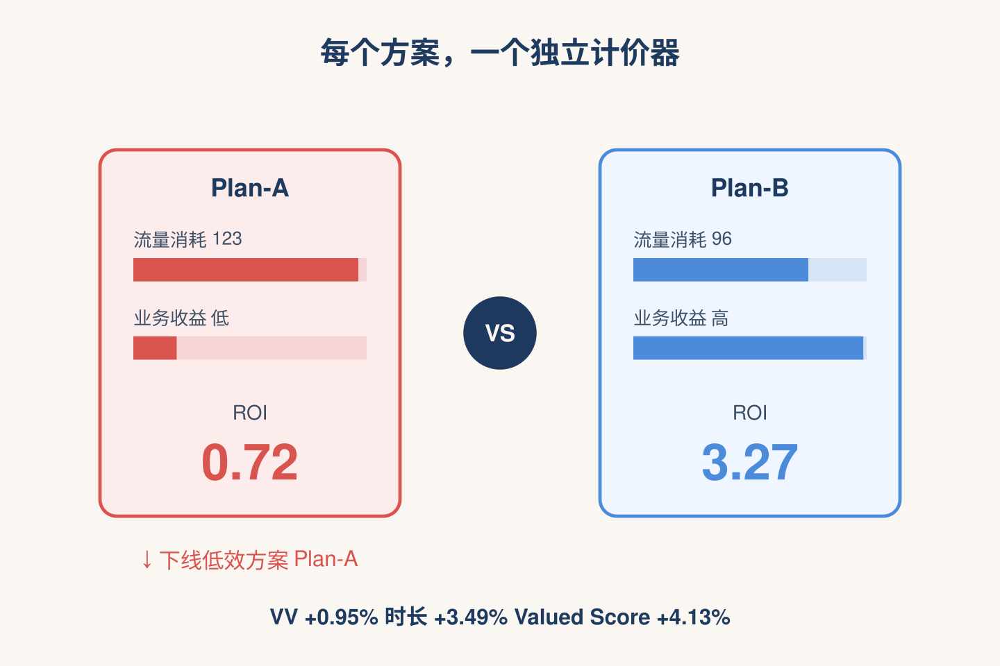
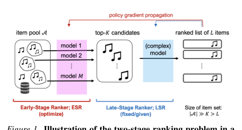
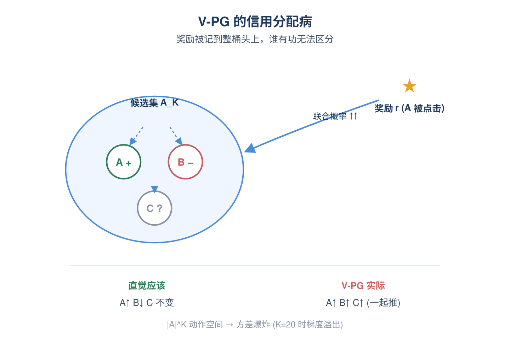
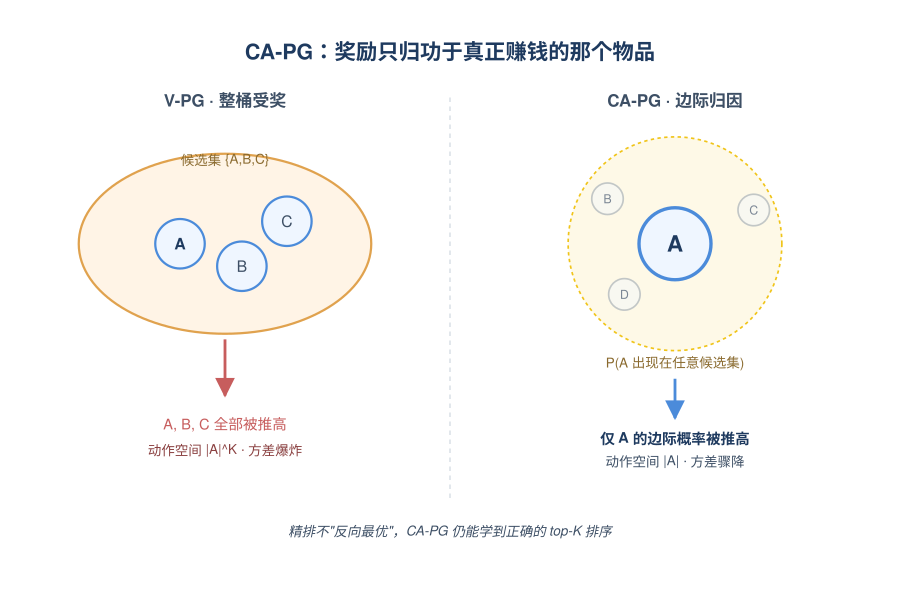
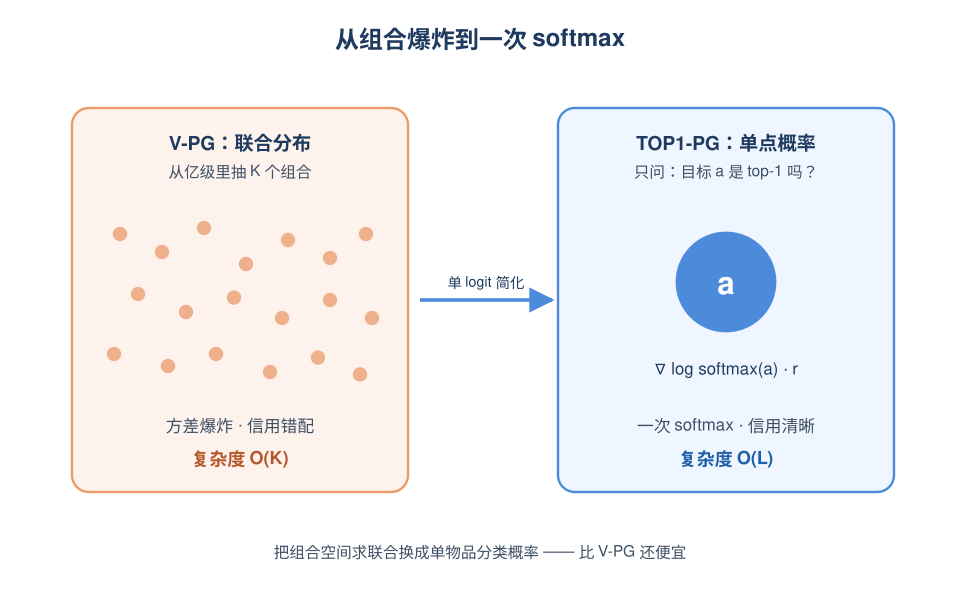
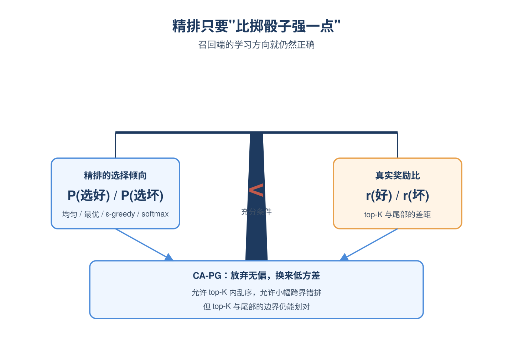

# 2026-05-27 论文日报

## 一、今日趋势与创新观察

### 1. 趋势概况

- 今日全量393篇，cs.AI 251篇与cs.LG 124篇继续主导，cs.IR只有18篇但工业系统论文仍有亮点。
- LLM与语言理解类173篇是当天最大主题，研究重心明显从生成转向Agentic RAG、检索逻辑重构（超越向量embedding）以及RAG中位置/上下文偏置等可复现性问题。
- Agent与多智能体79篇延续上周热度，话题集中在长期记忆的数据底座设计、工具编排安全性（记忆投毒、工具劫持）以及自我改进闭环。
- 迁移学习与跨域泛化66篇构成另一条主线，因果表征、提示优化的可迁移性、分布偏移诊断成为方法论焦点。

### 2. 推荐系统 / 排序相关创新点

- 阿里Uniboost提出重排阶段的全局协调与价值对齐框架，针对多业务目标流量分配中的耦合分配计划与打分膨胀问题，并完成工业A/B验证，对广告混排有直接借鉴意义。
- Meta相关团队提出Credit-assigned Policy Gradient，把两阶段检索-排序中早期召回器纳入端到端RL训练，并显式做信用分配，与广告召回-粗排-精排链路高度同构。
- Spotify的Causal Representation Learning for Generalisable Recommendation把推荐日志看作被部署策略混淆的观测数据，用因果表征缓解训练-服务分布漂移，对广告排序的反事实建模有方法论参考。

### 3. 全局创新点

- Rethinking Agentic RAG提出用LLM驱动的逻辑式检索取代纯向量embedding匹配，重塑检索增强生成的基本接口，是当天最具范式性的探索。
- MemMorph通过记忆投毒实现LLM Agent的工具劫持，绕过传统对工具元数据的审计检查，揭示了Agent长期记忆带来的新攻击面。
- Beyond Differences提出比值型CATE的双稳健元学习器，把医疗、定价、营销等天然以比值表达处理效应的场景统一到稳健估计框架，对增量与归因建模有借鉴。

### 4. 跨论文综合观察

- Uniboost、Credit-assigned Policy Gradient与Causal Representation for Recommendation三篇虽分别针对重排、召回和表征层，但都在回应同一问题——离线训练目标与在线部署分布/多目标耦合下的失真，呈现出排序链路从局部最优转向全局价值对齐与因果稳健的趋势。
- Agentic RAG的逻辑检索、Is Agent Memory a Database重思记忆数据底座、MemMorph的记忆投毒攻击共同围绕Agent的'记忆-检索-工具'闭环：一边在重构正向能力接口，一边在暴露其安全脆弱面，方法论上正从堆叠组件走向系统化反思。
- Causal Representation Learning与Beyond Differences双稳健CATE虽场景不同，但都体现了今日因果方法在推荐与营销决策中重新升温的共性趋势：用更结构化的假设修正纯预测模型在高维处理与策略混淆下的偏差。

## 二、今日入选论文

### 1. Uniboost: Global Coordination with Value Alignment for Fair and Efficient Traffic Allocation
- 挑选理由：阿里团队的混排/重排流量分配框架，直接作用于商业化目标分配，工业A/B验证

### 2. Credit-assigned Policy Gradient for Early Stage Retrieval in Two-stage Ranking
- 挑选理由：Meta相关作者的两阶段排序中早期召回端到端RL训练，与广告召回排序链路高度同构

## 三、补充关注

1. **L2Rec: Towards Dual-View Understanding of LLMs for Personalized Recommendation**
   - 理由：LLM个性化推荐参数级行为/语义统一，有工业A/B但未明确广告场景，对排序有参考价值

## 四、重点论文精读

### 1. Uniboost: Global Coordination with Value Alignment for Fair and Efficient Traffic Allocation
- **为什么值得看：** 阿里淘宝混排层流量分配新框架，工业落地且直接处理广告与自然内容的加权耦合问题
- **背景：** 在淘宝这类大型推荐系统的混排（重排）阶段，广告保量用PID、冷启用Boost、各种运营活动还会叠加自己的加权方案，结果是最终打分被各种乘法权重越堆越大，物理含义丢失，方案之间互相干扰，也很难单独评估某一个加权计划到底花了多少流量、带来多少收益。Uniboost要解决的就是这个工业系统里非常普遍但少有人系统处理的痛点：让混排打分既保留可解释的业务语义，又能对每个加权方案独立归因。

*图示：这是阿里淘宝内容Feeds混排阶段的真实落地工作，直接处…*

**核心技术点：**

#### 技术点 1：后验价值对齐
- 快速理解：用全局均值比把抽象模型分校准到'有效完播率'这种有业务含义的锚指标。

*图示：可以把模型原始分理解成一个没有单位的偏好值，谁大谁小有意…*

- 技术细节：论文先做相关性分析，从完播、时长、点击、购买、互动、滑走等候选后验指标里挑出'有效完播率'作为锚指标（理由是它在各分数区间分布稳定、校准误差小）。然后对原始混排分做一个简单线性缩放：把原始分乘以'锚指标全局均值除以原始分全局均值'，得到对齐后的分数。这一步不改排序顺序，但让分数的量纲变成了'期望有效完播率'。
- 通俗讲解：可以把模型原始分理解成一个没有单位的偏好值，谁大谁小有意义，但具体数值是多少没人说得清。Uniboost相当于在全站层面找一个'尺子'——有效完播率，把整个分数分布平移缩放到这把尺子上，于是每个分数都能解读成'这条内容大概期望有多少有效完播'，后续再加什么权重就都有可比的物理含义了。
- 例子：假设全站原始混排分均值是0.5，全站有效完播率均值是0.3，那一条原始分0.8的视频对齐后变成0.8×0.3/0.5=0.48，意思是这条视频的期望有效完播率约是0.48，比平均水平高，后面广告保量或冷启加分就可以在这个'完播率空间'里直接加减。

#### 技术点 2：独立线性Boost
- 快速理解：每个加权方案用'权重乘对齐分加偏置'的统一形式，最后线性相加而非相乘。

*图示：原来的系统是各种加权层层相乘，分数越滚越大、互相耦合。U…*

- 技术细节：对每一个业务加权方案p，对候选v计算 s-p,v = 指示函数(v属于p) × (w-p × y-v + b-p)，其中y-v是对齐后的分数，w-p和b-p是该方案的权重和偏置。最终排序分 r-v = y-v + 所有方案 s-p,v 的求和。论文特别指出：当w-ad=0、b-ad设为PID控制器输出时，就退化为传统广告PID保量；当b-cs=0、w-cs非零时，就退化为传统冷启Boost。也就是说一套公式覆盖了原来分散的多种加权机制。
- 通俗讲解：原来的系统是各种加权层层相乘，分数越滚越大、互相耦合。Uniboost改成加法：每个方案独立算出自己加多少分，再统一加到基础分上。因为分数已经被对齐到完播率维度，每个加分项也都是'这个方案给这条内容额外加了多少期望完播率'，含义清楚，而且加法天然支持归因——把某个方案去掉，就能看出它贡献了多少。
- 例子：一条广告内容对齐分y=0.4，广告保量方案给b-ad=0.15（PID输出），冷启方案不命中贡献0，运营Plan-A命中加w×y+b=0.05，最终排序分r=0.4+0.15+0+0.05=0.6。线上A/B显示这种改造让广告加权分数下降92%、自然视频加权分数下降96%，但曝光占比保持稳定，说明大部分原来的'分数膨胀'其实是冗余的。

#### 技术点 3：方案级ROI归因
- 快速理解：把每个加权计划的流量成本和指标增益独立统计，用ROI指导下线低效方案。

*图示：因为加法结构让每个方案的贡献能被单独算出来，相当于给每个…*

- 技术细节：近线/离线模块持续追踪原始分、对齐分、每个方案的boost分的分布，并按方案聚合资源消耗（流量占比）和业务收益（锚指标提升量）。对每个方案计算ROI=ΔVV/Cost这类指标，形成方案级看板。论文用这套看板识别出ROI最低的Plan-A，做消融实验把它下线，结果VV+0.95%、Valued VV+2.83%、Duration+3.49%、Valued Score+4.13%，验证了归因可信。
- 通俗讲解：因为加法结构让每个方案的贡献能被单独算出来，相当于给每个运营活动、每个保量策略都装了一个独立计价器。运营和算法可以直接看哪个方案花了多少流量、换来多少完播率提升，性价比低的就果断关掉。这把原来'一锅炖'的加权机制变成了可以单独审计的小账本。
- 例子：看板上Plan-A消耗123单位流量但ROI只有0.72，Plan-B消耗96流量ROI 3.27，对比之下Plan-A明显低效。下线Plan-A后核心指标全面正向，说明它确实在抢占其他方案本可以更高效利用的流量。

- **对广告的启发：** 广告保量、冷启、活动加权可以统一到加法框架，方便归因和裁撤低效方案。
- **适用边界：** 适用前提是存在一个足够稠密、与模型分相关性稳定的后验锚指标；在广告竞价等目标稀疏或多目标强耦合的场景，单一锚指标可能不足，且线性加法对非线性策略交互的近似能力有限。
- **实践建议：** 可以先在自家混排层做一次审计：列出所有加权/保量/扶持策略，挑一个稳定的后验锚指标对原始分做均值比对齐，然后把现有乘法权重改写成'权重×对齐分+偏置'的加法，搭一个方案级ROI看板，大概率能识别出几个可以直接下线的低效加权计划。

### 2. Credit-assigned Policy Gradient for Early Stage Retrieval in Two-stage Ranking
- **为什么值得看：** 把广告召回端到端RL训练的方差问题讲透，给出可落地的信用分配梯度方法
- **背景：** 搜索、推荐、RAG普遍采用'召回(ESR)+精排(LSR)'两阶段架构，精排端有大量RL方法，但召回端如何端到端用策略梯度训练一直没解决好。直接套用vanilla策略梯度(V-PG)时，候选集是从亿级物品里抽K个的组合空间，方差随K指数爆炸，而且梯度是对整个候选集的联合概率求导，分不清候选集里哪个物品真正贡献了奖励。论文的价值在于既指出'信用分配'是方差的根因，又给出方差更小、计算可行、且在合理精排策略下仍能学到正确排序的替代梯度。

*图示：Figure 1 清晰展示了两阶段排序架构（ESR+LS…*

**核心技术点：**

#### 技术点 1：V-PG的方差与信用分配病
- 快速理解：vanilla策略梯度把奖励平摊到整个候选集，K一大方差就指数爆炸

*图示：可以理解为：模型一次只看到一个候选集和一个最终被点击的物…*

- 技术细节：V-PG对召回策略选择整个候选集AK的联合概率求对数梯度，再乘以位置l的奖励rl。这意味着只要某个候选集里有一个物品拿到高奖励，整个候选集里所有物品被选中的联合概率都会被一起推高，无法区分谁是真正贡献者。由于候选集动作空间大小约为\|A\|的K次方，蒙特卡洛估计需要的样本量随K指数增长，论文实验中K=20时V-PG直接出现梯度溢出。
- 通俗讲解：可以理解为：模型一次只看到一个候选集和一个最终被点击的物品，但它把'好评'记到了整桶候选集头上。比如候选集是(A,B,C)，精排展示了A和B，A拿正奖励B拿负奖励，直觉上应该提高A降低B，但V-PG会把A、B、C三个一起的联合概率往上推，奖励信号被稀释又被错配，候选集越大稀释得越厉害。
- 例子：设候选集大小K=20，每条样本只观测到一个候选集和一个被精排选中的物品。V-PG要估计对\|A\| 20级别动作空间的期望，单条样本提供的信息几乎可以忽略，导致梯度估计在训练初期就溢出，论文图3里K=20时V-PG曲线在50K步前就被中断。

#### 技术点 2：CA-PG: 边际化候选集
- 快速理解：改成对'目标物品被任意候选集选中'的边际概率求梯度，把信用精确发给单个物品

*图示：直觉上就是：别再问'这一整桶候选集出现的概率',而是问'…*

- 技术细节：论文把联合策略重新分解：召回选中目标物品al的边际概率 乘以 在包含al的候选集里al被精排选到位置l的条件概率。CA-PG只对前一项(目标物品出现在任意候选集的边际概率)求梯度，故意忽略后一项对召回参数的依赖。这样动作空间从\|A\| K降到\|A\|，梯度只推高真正拿到奖励那个物品的边际选中概率。理论上CA-PG是V-PG的一个分量(定理3.1)，丢掉的残差项在精排策略合理对齐时不会破坏排序学习(定理3.3)：只要精排不是'反向最优'，CA-PG学到的召回策略就能把top-K真物品的概率排在尾部物品之前。
- 通俗讲解：直觉上就是：别再问'这一整桶候选集出现的概率',而是问'物品A出现在我抽出的任何一桶里的概率'。奖励来自A，就只把A的边际选中概率往上抬，B、C不蹭这个梯度。代价是这不是真梯度的无偏估计，但论文证明只要精排比'乱排'强一点(top-K里的物品平均被精排选中的概率比尾部高)，CA-PG最终仍能把真正好的K个物品排进召回top-K。
- 例子：用前面(A,B,C)的例子：A拿正奖励，CA-PG只计算'A出现在任意三元候选集中的边际概率'对召回参数的梯度并乘上A的奖励，于是A的logit被推高，B、C不受牵连；下次抽样时A更容易进候选，B如果拿到负奖励也会单独被压低。

#### 技术点 3：TOP1-PG: 计算可行化
- 快速理解：在Plackett-Luce单logit下退化成'目标物品被选为top-1的概率'梯度，计算降到O(L)

*图示：可以这样想：要算'A出现在任意候选集中的概率'本来很麻烦…*

- 技术细节：CA-PG的边际概率在Plackett-Luce(无放回采样)下需要O(KL)计算。论文借用'有放回采样'近似(SwR)，把PL看成对每个位置独立做softmax，得到CA-PG-SwR；当只用单个logit模型(非MoE)时进一步简化为TOP1-PG：直接对'目标物品被召回选为top-1的softmax概率'求梯度乘以奖励，复杂度O(L)，比V-PG的O(K)还低。当用MoE多专家召回时，CA-PG-SwR复杂度为O(ML)，并能利用MoE的多样性带来更好的探索，论文实验显示MoE+CA-PG收敛后的策略价值高于V-PG-SwR。
- 通俗讲解：可以这样想：要算'A出现在任意候选集中的概率'本来很麻烦，但如果假装每个候选位都独立从全量物品里softmax抽一次，那么A被选中的边际概率近似于K次独立softmax里至少被抽中的概率；单logit时干脆只算'A是softmax top-1的概率'，一次softmax就够了。这样训练每步只要一次普通softmax+log+乘奖励，跟普通分类训练差不多便宜。
- 例子：K=200的KuaiRec实验里，V-PG根本跑不动，CA-PG-SwR(即TOP1-PG)每步只对被点击物品的softmax概率求对数梯度乘上watch-ratio奖励，50K步时策略价值7.10，对比V-PG-SwR的5.92，且最终8.32略胜8.26，说明计算便宜的同时收敛更快。

#### 技术点 4：对精排对齐的鲁棒条件
- 快速理解：只要精排不是反向最优，CA-PG的有偏估计仍能学到正确top-K划分

*图示：通俗讲：CA-PG其实把'到底是哪个具体候选集贡献了奖励…*

- 技术细节：定理3.3给出充分条件：对任意真排序中top-K里的物品k和尾部物品j，精排在包含它们的候选集里选中它们的期望概率之比，要小于真实奖励之比。该条件在精排是均匀随机、最优、ε-greedy、softmax等'合理对齐'策略时都成立，甚至允许top-K内部和尾部内部的次序错乱、以及在奖励差距较大时的跨边界小幅错排。也就是说CA-PG牺牲了无偏性换方差，但只要线上精排不至于把坏物品系统性地排在好物品前面，召回端学习方向仍然正确。
- 通俗讲解：通俗讲：CA-PG其实把'到底是哪个具体候选集贡献了奖励'这件事糊掉了，所以理论上有偏。但论文证明，只要精排比掷骰子强一点，这种糊掉不会让召回学错方向——它最多分不清top-K内部谁第一谁第二，但能保证top-K和尾部之间的边界划对。
- 例子：假设真值奖励A=3、B=2、C=1，精排是带温度的softmax。即使精排偶尔把B排到A前面，只要它选A的平均概率/选C的平均概率不至于低于1/3，CA-PG仍能让召回把A、B排进top-2、把C压到尾部。

- **对广告的启发：** 广告召回端做端到端RL训练时，用'目标物品边际选中概率'替代候选集联合概率，能稳住训练
- **适用边界：** 方法假设位置奖励只依赖该位置物品(无多样性/级联交互)，且依赖精排满足'合理对齐'条件；离线off-policy场景下还需要补充重要性采样策略，论文未深入。
- **实践建议：** 可以在现有双塔召回上做小实验：保留softmax打分，把训练目标改成'被下游选中的广告的top-1对数概率乘以转化/收入奖励'(即TOP1-PG)，对比当前point-wise蒸馏或V-PG式联合训练，观察大候选集下的收敛速度与稳定性。
