# 2026-05-28 论文日报

## 一、今日趋势与创新观察

### 1. 趋势概况

- 今日全量562篇，cs.AI 351篇与cs.LG 172篇延续主导，cs.IR仅39篇但工业化广告/电商排序论文密度较前几日明显上升。
- LLM与语言理解类283篇仍是最大主题，研究重心从纯生成进一步转向Agentic数据检索、覆盖率感知检索以及面向任务对齐而非纯相似度的检索范式。
- 迁移与跨域泛化84篇里，RAG安全成为新焦点，出现联邦RAG路由劫持、语义保持的对抗数据投毒、缓存复用安全边界等多篇攻防类工作。
- 商业化决策与资源优化38篇中，自动出价、二价拍卖学习、LLM辅助广告预测、电商多任务排序等工业系统论文集中出现，信号比近几日更强。

### 2. 推荐系统 / 排序相关创新点

- Constrained Auto-Bidding via Generative Response Modeling 用生成式响应建模刻画未来流量与拍卖动态，再叠加控制器满足预算与CPA约束，AuctionNet实验上替代了传统pacing式控制思路。
- Fine-Tuned LLM as a Complementary Predictor 把微调LLM作为补充预测器并行注入广告召回与排序链路，给出了LLM在生产广告系统真正落地而非仅仅做特征增强的范式。
- Context Features Are Cheap 提出rank-aware decomposition，发现工业DLRM对同一用户/上下文重复广播N次context特征是冗余的，重排计算图后吞吐提升87.5%，是排序服务侧的硬核工程优化。

### 3. 全局创新点

- Learning to Bid in Repeated Second-Price Auctions 把出价方价值建模成依赖距上次中标时长的动态过程，并在仅有聚合反馈的弱观测条件下给出后悔界，是竞价学习理论一个新的扰动方向。
- Utility-Aware Multimodal Contrastive Learning for Product Image Generation 把消费者效用直接写进多模态对比学习目标，让生成模型不仅对齐文本，还对齐市场转化指标，给广告创意/商品图生成提供了端到端商业化优化路径。
- A Unified Structured Query Understanding Framework 用单一SLM替代LinkedIn Job/People Search里多个级联式查询理解组件，长尾一致性与维护成本上的工业收益值得排序系统借鉴。

### 4. 跨论文综合观察

- 自动出价（生成式响应建模）与重复二价拍卖动态价值学习从应用与理论两端同时推进竞价问题：前者强调约束下的长期价值最大化与系统落地，后者关注弱反馈下的后悔界，二者互补地丰富了广告竞价的方法谱。
- 广告/电商侧的几篇工业论文（LLM辅助广告预测、电商多任务相关性+参与度联合排序、Rank-Aware上下文特征分解）共同指向同一个范式：用LLM/语义信号增强主排序，同时通过工程层面的解耦与高效监督来抵消LLM带来的成本压力。
- RAG安全相关多篇（联邦RAG路由劫持、语义保持对抗数据投毒、Grounded Cache Routing）都在质疑'检索/缓存复用是否安全'这一隐含假设，表明RAG从效果优化阶段进入到了可信与攻防阶段，对推荐侧的语义ID与向量库治理也有迁移意义。

## 二、今日入选论文

### 1. Constrained Auto-Bidding via Generative Response Modeling
- 挑选理由：直接做广告自动出价，约束下生成式响应建模+控制器，AuctionNet实验

### 2. Fine-Tuned LLM as a Complementary Predictor Improving Ads System
- 挑选理由：明确直接的广告系统论文，提出LLM作为广告主预测辅助器，作用于召回与排序，工业落地。

## 三、补充关注

1. **Paraphrase Brittleness in Production Retrieval-Augmented Commercial Recommendation: Reproducibility Below the Rerun-Stability Baseline**
   - 理由：研究LLM对商业品牌推荐的paraphrase鲁棒性，与AEO/GEO（生成式引擎优化）有关，触及AI营销分发，但属于审计而非建模。
2. **Prominence-Stratified Failure Modes in Retrieval-Augmented Commercial Recommendation: A 37,000-Run Audit**
   - 理由：审计LLM商业品牌推荐的层级失败模式，对AI时代营销分发有参考价值，但非广告系统建模。
3. **ProRL: Effective Reinforcement Learning for Proactive Recommendation via Rectified Policy Gradient Estimation**
   - 理由：RL用于主动推荐路径生成，修正policy gradient偏差，与排序/序列决策有同构性，但偏推荐研究，非广告核心。

## 四、重点论文精读

### 1. Constrained Auto-Bidding via Generative Response Modeling
- **为什么值得看：** 把出价学习目标从动作改成响应曲线，约束求解更透明可控
- **背景：** 自动出价系统要在每天数十亿次拍卖里，既最大化广告主价值又满足整段周期的预算和CPA/ROAS约束，但未来流量和竞争都不稳定。控制类pacing只能事后纠偏不会预判，RL和生成式方法把约束压进reward，违规情况看不见也难诊断，分布漂移时还会大幅退化。论文要解决的就是‘怎么让出价模型既能预判未来，又能把约束显式可控地处理掉’，因此值得看。
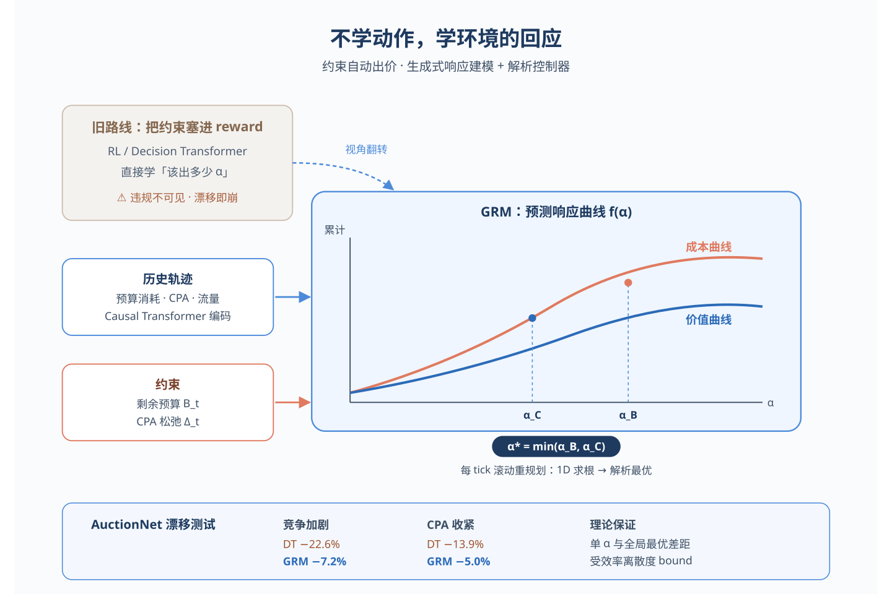
*图示：这篇直接面向广告自动出价的核心难题：长周期预算与CPA/…*

**核心技术点：**

#### 技术点 1：学响应曲线而不是学动作
- 快速理解：把模型预测目标从最优出价改成成本和价值随出价系数变化的曲线

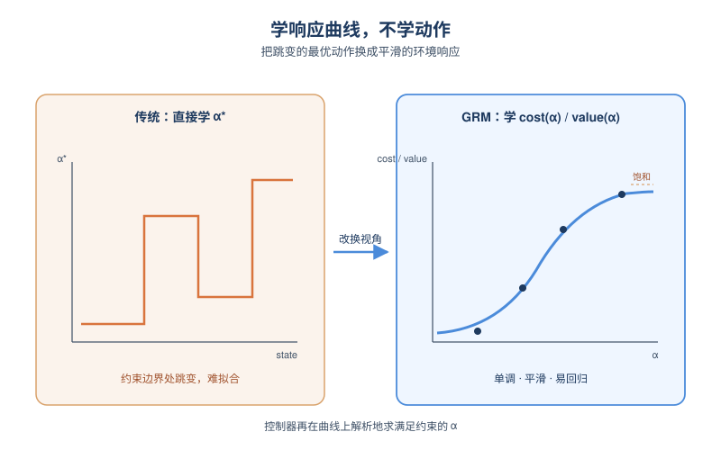
*图示：传统模型直接学‘该出多少’，但最优动作在约束边界附近会跳…*

- 技术细节：GRM是一个基于因果Transformer的序列模型，输入历史状态和过去的出价系数，输出三样东西：剩余周期总流量、整段周期上每次机会的平均成本曲线和平均价值曲线，两条曲线都是关于出价系数α的函数。曲线用一个log-sigmoid参数族表示（饱和值、敏感度、位移共三个参数），保证单调、有界，并符合赢得率随出价log-concave的经验规律。训练时对每个锚点tick t，从未来tick里随机采样若干个k，用k那一刻logged的α和实际成本/价值作为监督点，按流量加权做回归，让一条整段曲线拟合多个散点。
- 通俗讲解：传统模型直接学‘该出多少’，但最优动作在约束边界附近会跳变，很难拟合。论文反过来让模型学‘如果整段周期都用某个α，预计会花多少钱、拿多少转化’，这种曲线天然单调平滑，更适合监督学习。推断时模型读完到当前tick的历史，吐出曲线参数，控制器再去这条曲线上找满足约束的α。
- 例子：假设现在是当天第10个tick，模型读入前10个tick的预算消耗、CPA、流量等历史，输出未来38个tick总共还有约30万次机会，并给出一组log-sigmoid参数：当α=1.0时平均每次花0.6元拿0.02转化，α=1.5时花0.9元拿0.025转化，曲线在α=2附近开始饱和。控制器拿这条曲线就能直接算该用多大α。

#### 技术点 2：两次一维求根的Min-Pacing控制器
- 快速理解：在预测曲线上分别解预算约束和CPA约束，取较小α保证两边都不破

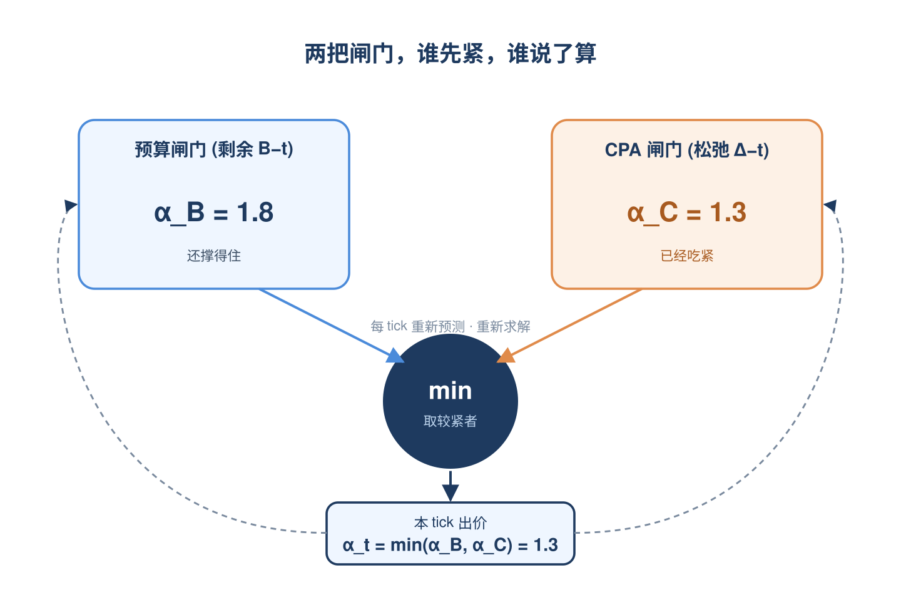
*图示：把预算和CPA两类约束分开，各自独立求一个临界α，谁更紧…*

- 技术细节：在每个tick，控制器先算剩余预算B-t和CPA松弛Δ-t（=目标CPA×已得价值−已花成本）。然后在预测的总成本曲线上用二分法求α-B，使预测剩余花费正好等于剩余预算；再在‘成本−目标CPA×价值’这条曲线上求α-C，使其等于Δ-t。最终执行α-t=min(α-B,α-C)。论文证明在曲线单调假设下，这个min-pacing就是单一α受约束优化问题的精确解；并证明在滚动重规划下，约束违反量随预测误差线性放大，流量预测误差只贡献log T级别的项。
- 通俗讲解：把预算和CPA两类约束分开，各自独立求一个临界α，谁更紧就听谁的。因为曲线单调，更小的α一定更安全，所以取min就同时满足两个约束。每个tick重新预测、重新解一次，相当于不断纠错，预测准则约束稳，预测有偏也只会平滑放大不会突然爆炸。
- 例子：比如剩余预算够撑到α=1.8花完，而要保住目标CPA最多只能用α=1.3，那这个tick就执行α=1.3，本tick实际花费观测后回灌历史，下个tick重新算一次α-B和α-C；如果竞争变激烈导致预测曲线整体上移，下一次解出来的α-C会自动降下来。

#### 技术点 3：单一α近似的理论保证
- 快速理解：整段周期共用一个α相比逐tick最优的损失只取决于‘效率方差’

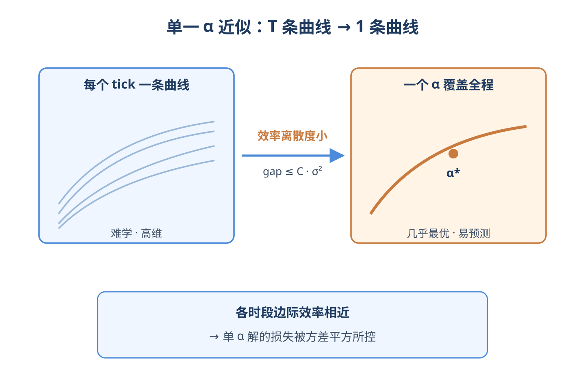
*图示：理论上每个tick选不同α会更优，但那样要预测T条曲线很…*

- 技术细节：论文用一个量叫‘效率离散度’，即各tick边际价值/边际成本（围绕全周期平均水平）按流量加权的方差。定理证明：用一个α覆盖整段周期相对于‘每个tick各自最优α’的目标差距，被这个方差的平方乘以一个常数所bounded。也就是说，当各tick的边际效率相近时，单α解几乎是最优的，预测目标也因此从‘T条曲线’降到‘1条曲线’。
- 通俗讲解：理论上每个tick选不同α会更优，但那样要预测T条曲线很难学。论文给出条件：只要不同时段的‘多花一块钱能换多少价值’差不多，那共用一个α损失就很小。这给了把预测目标极度压缩的合理性。
- 例子：如果上午和晚上每多花一块钱能换的转化数差不多，那一整天用同一个α≈1.4，相对‘上午1.3、晚上1.5的精细方案’只差很小一截；但若白天和夜间效率差很大，单α近似就会带来明显gap，这时就得考虑分段。

#### 技术点 4：对分布漂移更鲁棒
- 快速理解：竞争或CPA目标变化时，重新预测曲线就能及时纠偏

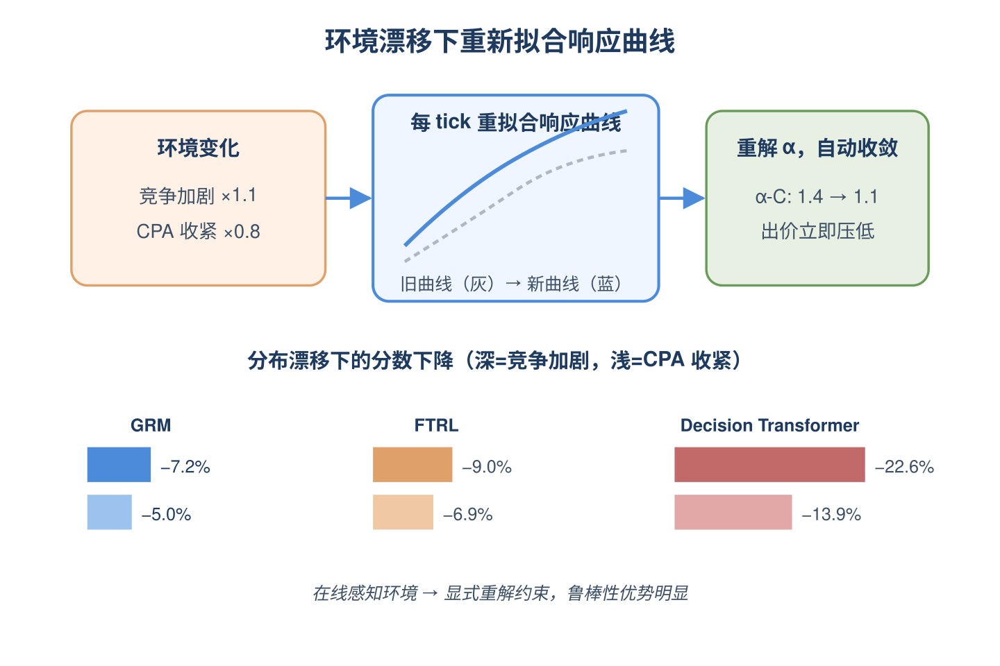
*图示：DT把约束塞进return-to-go条件，一旦真实环境…*

- 技术细节：实验在AuctionNet上构造两类漂移：竞品预算×1.1（竞争加剧）和目标CPA×0.8（约束收紧）。GRM在竞争加剧下分数只掉7.2%，约束收紧下掉5.0%，而Decision Transformer分别掉22.6%和13.9%，FTRL掉9.0%和6.9%。原因是GRM每个tick都重新拟合响应曲线并重新解α-B、α-C，相当于在线感知环境变化。
- 通俗讲解：DT把约束塞进return-to-go条件，一旦真实环境跟训练分布不一致，条件就跟实际响应对不上。GRM不预测动作而预测‘环境怎么回应’，环境变了曲线参数会跟着变，控制器自动给出更保守的α。
- 例子：目标CPA从1.0改成0.8后，下一个tick预测的‘成本−0.8×价值’曲线整体抬高，求得的α-C从1.4降到1.1，min-pacing就立即把出价压低，避免CPA爆掉。

#### 技术点 5：预测质量直接决定出价表现
- 快速理解：验证集loss和最终分数强负相关，可以用loss当上线前的代理指标

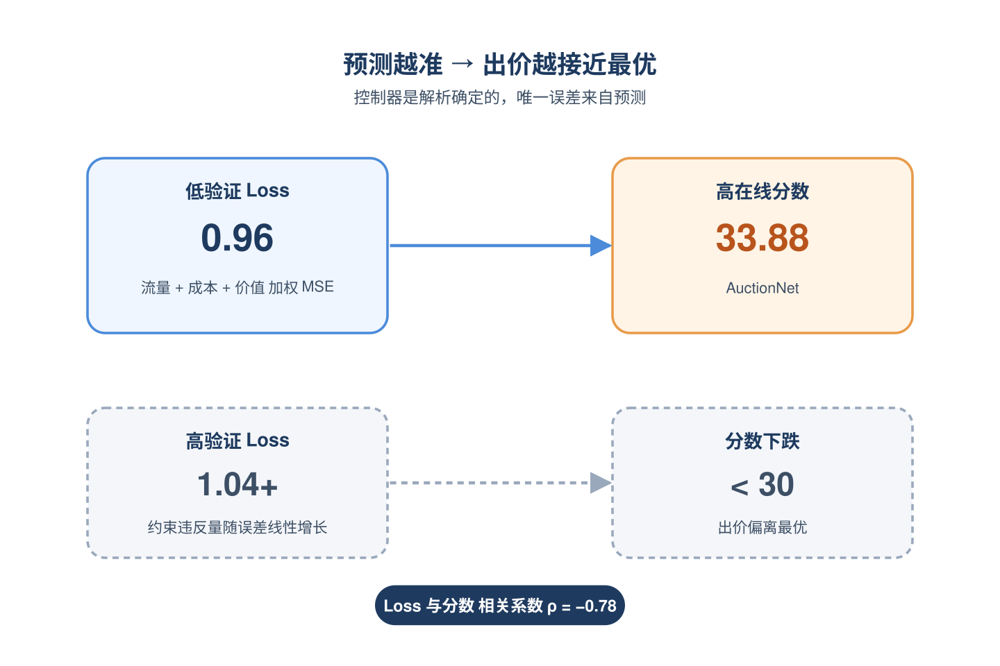
*图示：因为控制器是解析的、确定性的，模型唯一的不确定来源就是预…*

- 技术细节：论文跑了10个不同收敛程度的checkpoint，发现验证集loss（流量+成本+价值三项加权MSE）与AuctionNet分数相关系数−0.78，跨18组架构/超参也保持−0.72。这与定理4里‘约束违反量随预测误差线性增长’的结论一致。
- 通俗讲解：因为控制器是解析的、确定性的，模型唯一的不确定来源就是预测误差，所以预测得越准，出价就越接近最优。这给了一个工程上的便利：不必跑完整模拟回测，看离线loss就能粗判线上效果。
- 例子：best checkpoint验证loss=0.96对应分数33.88；loss=1.04+的checkpoint平均分跌到30以下。线上调参时可以先用一小批历史数据筛loss最低的几个版本，再做更贵的全量模拟。

- **对广告的启发：** 工业出价可以借鉴：把模型学‘环境响应曲线’，把约束交给解析控制器。
- **适用边界：** 方法依赖响应曲线对α单调且接近log-concave，依赖效率离散度较小才能让单α近似站得住；如果广告主结构（如多目标、混合ROI约束）或拍卖机制偏离这些假设，理论保证会变弱。此外整体在AuctionNet模拟上验证，真实流量更高维的非平稳性下表现仍需进一步验证。
- **实践建议：** 可以先在自家自动出价系统里复用现有预算pacing和ROI pacing服务的min结构，把内部的反馈式控制替换成‘预测整段周期成本/价值曲线再做1D求根’的方案，并用离线验证loss作为上线前的快速筛选指标。

### 2. Fine-Tuned LLM as a Complementary Predictor Improving Ads System
- **为什么值得看：** Pinterest工业落地：微调LLM做广告主预测，召回排序双端拿到收益
- **背景：** 广告系统主流是召回+精排两段式，特征是稀疏ID为主，直接拿LLM做排序又慢又贵，所以业界落地的LLM大多停留在生成式召回、重排或打标签三种形态。这篇Pinterest的工作提出第四种用法：把开源LLM微调成'下一个广告主预测器'，输出预测的广告主列表和兴趣标签，再喂给传统召回和CVR模型当先验信号，既享受了LLM的世界知识，又规避了实时打分的成本，并且真的在生产系统拿到了线上RoAS提升。
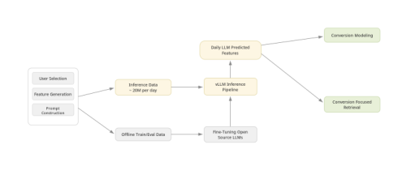
*图示：该候选是Figure 1的纯图裁剪，完整呈现了系统总览p…*

**核心技术点：**

#### 技术点 1：广告主作为预测目标
- 快速理解：不让LLM排ad，而是预测用户接下来最可能转化的广告主名字

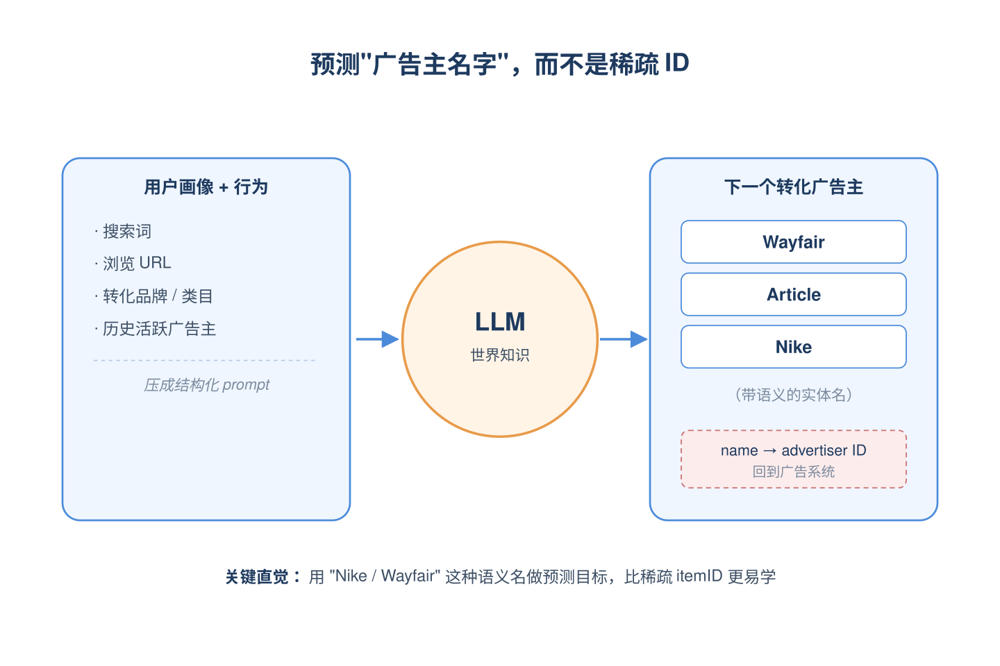
*图示：直觉是：广告主名字本身就是带语义的实体（比如'Nike'…*

- 技术细节：把每个用户的画像（性别、年龄、用户类型）和行为序列（站内搜索、站外搜索、站外URL、归因转化、匹配转化、Top类目/品牌、有过转化的活跃广告主）压成一个结构化prompt，让LLM预测未来7天用户首次转化的那个广告主名字。候选广告主来自两个池子：用户历史有过转化的活跃广告主，以及一个按当日收入排序的Top美国Shopping广告主预设池。预测出来的广告主名字会再通过一个名称到广告主ID的映射层接回到广告系统里使用。
- 通俗讲解：直觉是：广告主名字本身就是带语义的实体（比如'Nike'、'Wayfair'），LLM对它们有世界知识，比直接预测稀疏的itemID好学得多。一次推断的流程是：拿到一个用户，把他最近的搜索词、浏览过的URL、买过东西的品牌都拼成一段文本prompt，丢给微调后的LLM，输出一个排名好的20个广告主名字+5个兴趣标签的XML，然后名字映射回广告主ID供下游用。
- 例子：比如一个美国女性用户最近在站外搜过'patio furniture'，URL里出现过几个家居站点，历史在某家居广告主有过转化。模型读到这些信号后，输出的广告主列表前几位会是Wayfair、Article这种家居电商，再加上'home decor'、'outdoor living'之类兴趣标签，这些再被召回侧用作定向过滤、被CVR模型当特征。

#### 技术点 2：SFT+GRPO两段训练
- 快速理解：先用单广告主SFT学准，再用20个广告主的GRPO学排序

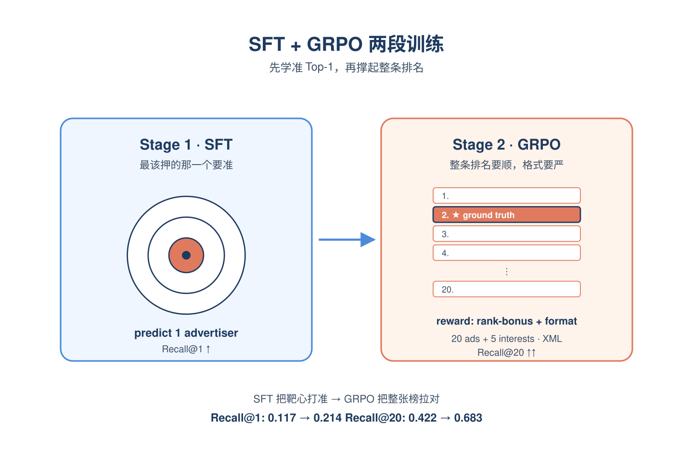
*图示：可以理解成：SFT教模型'最top1要押对'，GRPO教…*

- 技术细节：SFT阶段prompt只要求预测1个广告主，标签就是窗口内首个转化广告主，目的是让模型先把'最可能那个'学准。GRPO阶段prompt改成输出20个广告主+5个兴趣（XML格式），但监督仍是那一个真值广告主。奖励包含三块：匹配奖励按真值广告主出现在第i位算0.1×(20-i)的基础分，前4位再加2.0的bonus；广告主数量和兴趣数量不等于规定值时给长度惩罚。选20而不是5是为了每步GRPO有更大的奖励方差。
- 通俗讲解：可以理解成：SFT教模型'最top1要押对'，GRPO教模型'整张排名要顺、还得严格按格式输出'。一次GRPO训练步是这样的：模型采样出一份20个广告主的排名，看真值广告主在第几位，比如排在第3位就拿0.1×17+2.0=3.7分；如果输出了19个广告主而不是20个，就再扣一个长度惩罚。多次采样后用GRPO更新策略，让真值更频繁地出现在前列且格式严格符合XML。
- 例子：论文V1数据上：零样本Recall@20只有0.422，单广告主SFT后Recall@1从0.117升到0.214，再叠GRPO后Recall@20跳到0.683，说明GRPO主要把'排进前20'的能力撑起来，而SFT解决了'top1要准'。

#### 技术点 3：双路接入召回与排序
- 快速理解：LLM输出既给召回当定向过滤，又给CVR模型当特征

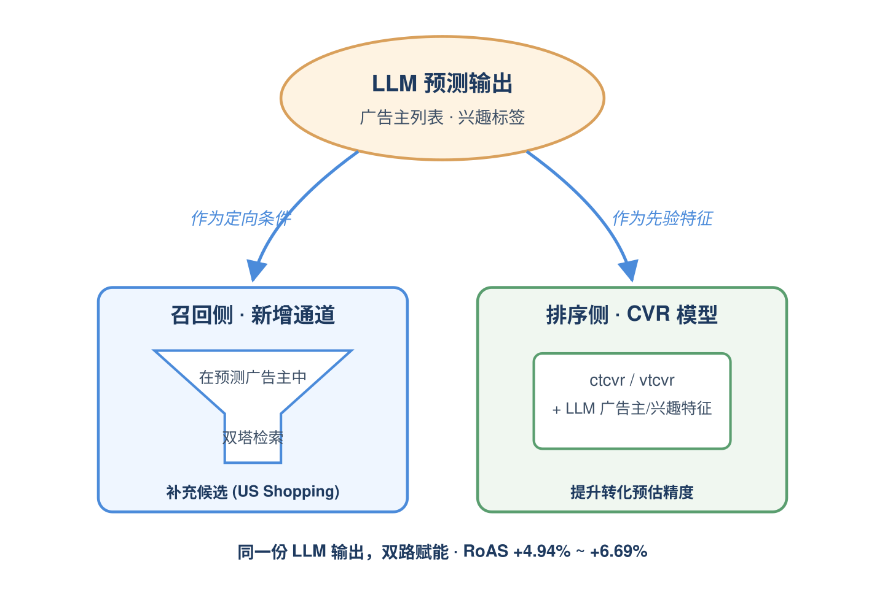
*图示：一句话：把LLM的输出同时当'选谁'（召回定向）和'值多…*

- 技术细节：召回侧新建了一路候选生成器（CG）：用LLM预测出的广告主当定向过滤条件，在这些广告主下用一个双塔模型按用户参与度做检索；这路CG只覆盖美国opt-in的Shopping用户，作为补充通道而非主召回。排序侧把LLM预测的广告主和兴趣作为额外特征喂进ctcvr、vtcvr等转化模型。在线实验里他们还发现双塔训练目标很关键：用曝光当正样本会破坏参与度，用转化当正样本太稀疏不稳，最后用'点击+停留时长加权'最平衡；同时这路CG的L0配额必须仔细调，因为它的ad CTR/CVR分数偏高，配额给大了会挤压广告主多样性。
- 通俗讲解：一句话：把LLM的输出同时当'选谁'（召回定向）和'值多少'（排序特征）两件事用。一次线上请求的流程是：用户进来变成主召回照常跑变成新增的LLM-CG先看预测出的20个广告主，在这些广告主候选里用双塔召一批高参与度的ad变成和其他通道合流去重变成精排时CVR模型读到'这个用户被LLM预测了哪些广告主、属于哪些兴趣'当额外特征变成排序打分。
- 例子：线上结果：美国Shopping整体RoAS+4.94%，opt-in slice +6.69%，离线vtcvr的PR-AUC +1.64%、AUC +0.09%。说明同一份LLM预测在召回端带来增量流量、在排序端提升CVR预估精度。

#### 技术点 4：Semantic ID继续预训练
- 快速理解：把多模态SID当新token加进LLM，分三阶段防遗忘

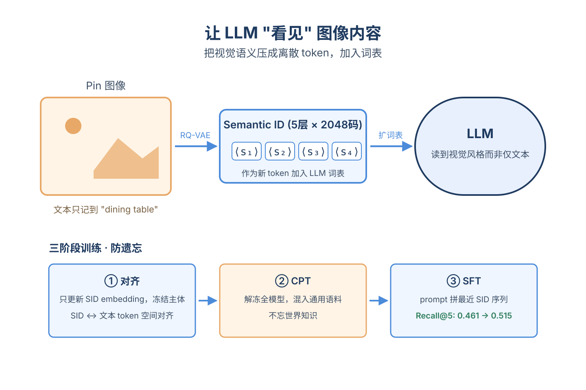
*图示：直觉是：广告主名字、URL字符串这些文本特征捕捉不到图像…*

- 技术细节：用PinCLIP多模态embedding做RQ-VAE，得到5层、每层2048码的Semantic ID，作为新token加入LLM词表。三阶段训练：阶段1只更新SID token的embedding，冻结其余参数，先把SID和文本token空间对齐；阶段2解冻全模型做大规模CPT，混入大量通用语料防止灾难遗忘；阶段3做任务SFT，prompt里在原文本特征基础上额外拼上最近的SID序列。在V1上，加SID后Recall@1/5/20分别从0.223/0.461/0.683涨到0.248/0.515/0.755。
- 通俗讲解：直觉是：广告主名字、URL字符串这些文本特征捕捉不到图像/版式语义，但Pinterest的内容本质是图，所以把图像内容压成一串离散'语义ID'丢给LLM读，相当于让LLM'看见'用户最近浏览过的Pin长什么样。三阶段是为了让LLM在学这些新token时不忘掉它原来的世界知识。
- 例子：比如用户最近频繁浏览风格相近的'波西米亚风餐桌'图片，文本特征可能只记到'dining table'，但SID序列能编码出具体的视觉风格码字，模型读到后会更倾向预测出做该风格家居的广告主，而不是泛泛的家具广告主。

#### 技术点 5：工业化推断与特征筛选
- 快速理解：vLLM+Ray批跑、增量更新，特征里活跃转化广告主最关键

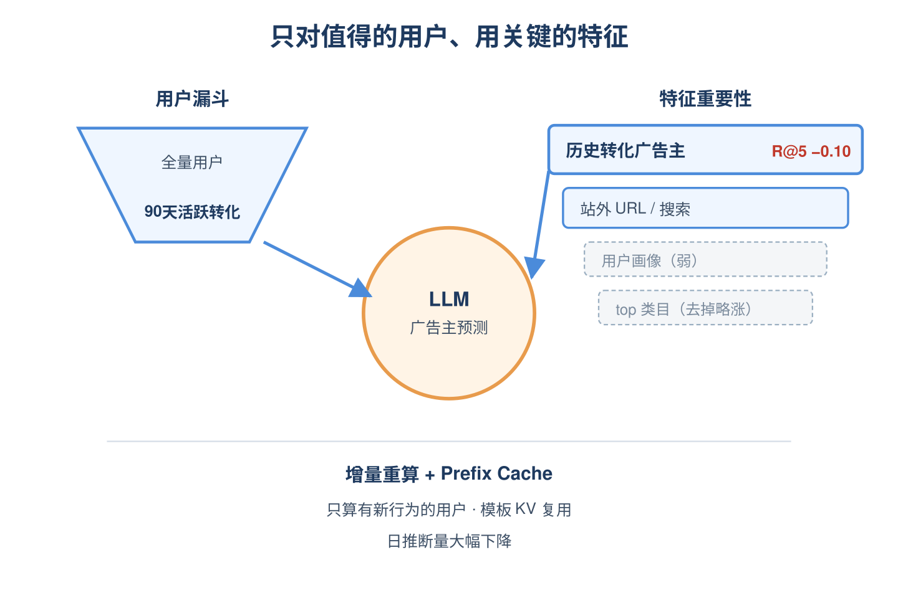
*图示：一句话：不是所有用户都值得跑LLM，也不是所有特征都该塞…*

- 技术细节：推断侧只对美国近90天有过转化的活跃用户跑LLM，用vLLM+Ray分布式批量推理，靠prefix caching复用prompt模板、PagedAttention管KV cache、连续batching拉满GPU；用virtual epochs+checkpoint做容错，并且只对'有新行为'的用户做增量重算，大幅压低日推断量。特征消融显示，去掉'用户历史活跃转化广告主'这一项Recall@5会掉0.10，是单一最强特征；offsite URL和offsite search次之；用户profile贡献很小，去掉top categories反而略涨。
- 通俗讲解：一句话：不是所有用户都值得跑LLM，也不是所有特征都该塞进prompt。工程上挑出有商业意图的用户群跑批，再用prefix cache把prompt模板那部分KV复用掉；特征上，行为信号（特别是已经转化过哪些广告主、最近站外搜啥点啥）远比静态画像有用。
- 例子：如果一个用户没有任何近90天转化记录，他根本不会进入当日推断队列；如果进入了，prompt里关于'活跃过的广告主'那段是模型最依赖的信息——把这段抹掉Recall@5直接掉10个点，相当于模型主要在做'你下次还会复购/继续转化哪家'，再叠加站外URL扩展到新广告主。

- **对广告的启发：** 想用LLM做广告又怕扛不住延迟时，把它做成离线广告主预测器是性价比最高的切入点
- **适用边界：** 适合广告主集中、商业意图信号丰富的电商/Shopping场景，对长尾广告主多、用户行为稀疏或广告主频繁更替的市场可能掉效；同时整个范式是T+1离线推断，不适合需要分钟级响应新意图的场景。
- **实践建议：** 可以先在自家系统里挑'近N天有转化的高价值用户'这个子集，用开源LLM跑一版'下一个广告主预测'离线任务，把输出当排序模型的新特征做AB，验证完再扩到召回端做定向过滤——投入小、链路短，是把LLM工业化的低风险第一步。
