# 2026-05-29 论文日报

## 一、今日趋势与创新观察

### 1. 趋势概况

- 今日全量541篇，cs.AI 338篇与cs.LG 174篇延续主导，cs.IR仅29篇但当天工业级推荐/搜索排序论文密度明显高于前几日。
- LLM与语言理解类288篇仍是最大主题，议题从生成转向多模态RAG不确定性量化、对话满意度个性化评测以及训练数据组织策略等更工程化的方向。
- 表示学习与检索排序179篇，研究重心集中在多向量检索的稀疏编码替代K-means、late-interaction的IO感知融合算子、图检索的计划式重排等具体技术点。
- Agent与多智能体111篇延续高位，关注点从单体规划转向长程记忆策略优化、多智能体协同自演化以及规划表示对Web Agent的影响。

### 2. 推荐系统 / 排序相关创新点

- 《On the Practice of Scaling Search Conversion Rate Prediction》系统拆解了搜索CVR模型在backbone、embedding、数据维度的scaling实践，并把warmstart与低延迟服务一并纳入工业化方法论。
- 《Rec-Distill》提出面向大规模推荐模型的工业蒸馏管线，弥合scaling law收益与serving成本约束之间的鸿沟，是当天最贴近广告/推荐排序系统的工程性工作。
- 《LoopFM》通过迁移基础模型的历史中间表示而非单一标量预测，显著提升TaobaoAd上的AUC与转化率，给出了FM→VM知识蒸馏中传递率衰减的新解法。

### 3. 全局创新点

- 《Quotient DAGs for Off-Policy Evaluation》提出基于商DAG的forward-flow重要性采样，能精确计算无序slate倾向，对推荐/广告离线评估的方差控制有方法论意义。
- 《No More K-means: Single-Stage Sparse Coding for Efficient Multi-Vector Retrieval》直接用单阶段稀疏编码替代多向量检索中长期依赖的K-means量化，简化了ColBERT类系统的索引pipeline。
- 《FLASH-MAXSIM》面向late-interaction打分设计IO感知的融合kernel，把检索系统的工程优化思路从模型层下沉到算子层，是当天值得关注的系统级创新。

### 4. 跨论文综合观察

- Search CVR Scaling、Rec-Distill与LoopFM三篇从不同角度回答同一问题：在serving延迟与成本约束下如何兑现大模型/基础模型的scaling收益——分别走规模化训练、蒸馏管线与中间表示迁移路线，构成今天工业排序方向最完整的拼图。
- No More K-means与FLASH-MAXSIM共同体现检索方向正从模型创新转向系统与索引层的工程优化，前者重构索引构造、后者重写打分算子，方法论上呈现把检索pipeline拆细再各自极致优化的趋势。
- Quotient DAG的slate off-policy评估与LoopFM的TaobaoAd转化提升形成互补：一边给离线评估提供更精确的倾向工具，一边给在线大模型迁移给出可落地路径，反映社区在大规模推荐链路上offline/online两端同步推进。

## 二、今日入选论文

### 1. On the Practice of Scaling Search Conversion Rate Prediction
- 挑选理由：电商搜索CVR预估的规模化实践，覆盖backbone/embedding/数据scaling、warmstart、低延迟服务，直接是商业化转化建模核心。

### 2. Rec-Distill: An Industrial Distillation Pipeline for Large-Scale Recommendation Models
- 挑选理由：工业级大规模推荐模型蒸馏管线，明确覆盖推荐和广告场景，关注serving延迟与成本，正属于商业化排序系统核心。

## 三、补充关注

1. **Persona Conditioning of Brand Recommendations in Retrieval-Augmented Commercial Chat: A Prominence-Stratified Cross-Provider Audit**
   - 理由：审计AI助手中品牌推荐受用户persona影响，涉及商业化品牌推荐分发，与广告品牌曝光有一定关联但非核心链路

## 四、重点论文精读

### 1. On the Practice of Scaling Search Conversion Rate Prediction
- **为什么值得看：** 电商搜索CVR大模型规模化的完整工程实践，离落地最近
- **背景：** 搜索CVR预估在电商里直接决定排序质量，但和LLM不同，CVR模型是异构的（数值/类别/文本/序列特征混在一起），大头参数集中在embedding表，并且线上有严格的延迟和成本约束，单纯堆参数往往边际收益快速衰减。这篇论文系统拆解了backbone算力、embedding容量、训练数据三个维度的scaling规律，并给出了warmstart训练加速和GPU服务优化的工程方案，最后在Coupang真实部署，是一篇含金量很高的产业实践论文。
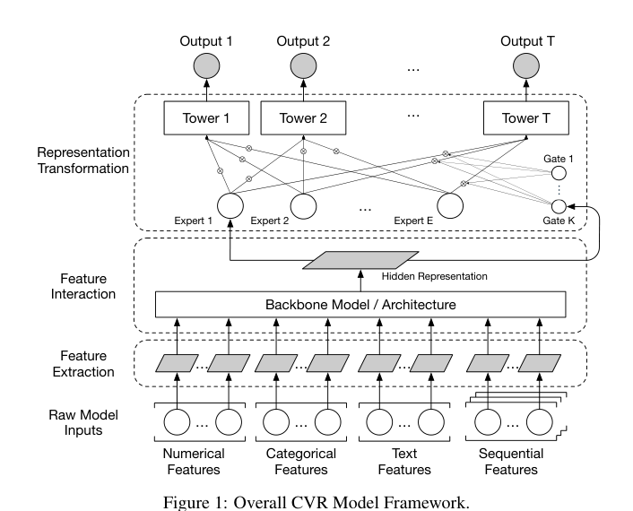
*图示：Figure 1 是论文的Overall CVR Mod…*

**核心技术点：**

#### 技术点 1：三维度Scaling可加性
- 快速理解：backbone、embedding、数据三条scaling轴的收益基本独立、可加

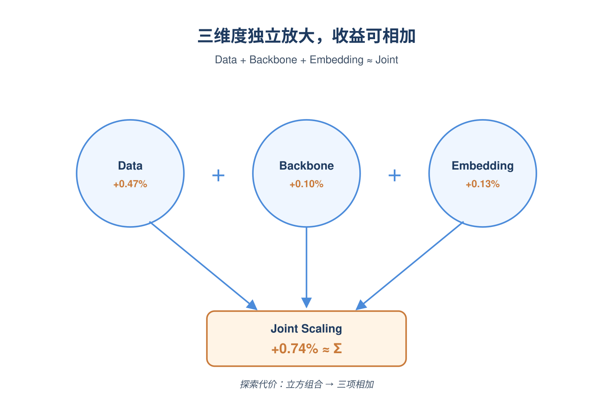
*图示：意思是这三件事几乎不打架：你不用做笛卡尔积式的联合调参…*

- 技术细节：作者把CVR模型scaling拆成三个维度：backbone计算量（如MaskNet的cross宽度、Transformer的序列长度）、embedding容量（维度和词表大小）、训练数据量（天数）。在生产数据上分别单独放大每一维并测mAP，发现每一维都呈log-linear提升，且联合放大时的总收益约等于各维收益之和（数据+0.47%、backbone+0.10%、embedding+0.13%、组合+0.74%）。
- 通俗讲解：意思是这三件事几乎不打架：你不用做笛卡尔积式的联合调参。可以先在小数据集上挑出最好的backbone和超参，再换到全量数据上训练，效果排序基本不变。这让模型选型的探索代价从'立方'降成'三次相加'。
- 例子：比如你想验证一个新的MaskNet配置：先用35天数据快速跑出几个候选的相对mAP排序，挑出冠军后直接换到300天数据再训练，论文显示Transformer-seq16 vs Transformer-seq128、MaskNet-cross512 vs cross4096这些对比在不同数据量下的相对优劣是稳定的。

#### 技术点 2：Backbone选型与缩放轴
- 快速理解：MaskNet的cross宽度比Transformer加层更划算，要选对缩放轴

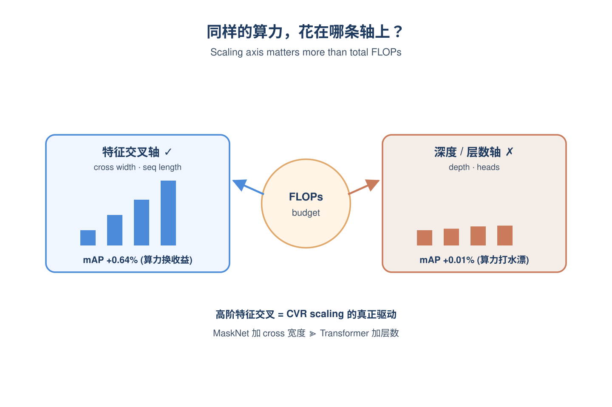
*图示：搜索/推荐场景的本质是'特征交叉'，所以扩'交叉能力'比…*

- 技术细节：比较了DCNv2、MaskNet、Transformer、RankMixer四类backbone。MaskNet用'掩码引导的cross层'(xl+1 = U(ReLU(Vx0)) ⊙ xl) 在同等FLOPs下mAP最高；Transformer虽能scale序列长度但显存吃紧、易OOM。更关键的是不同缩放轴效率差异巨大：MaskNet里加cross宽度比加deep宽度更有效，Transformer里加序列长度比加层数/头数更有效。作者用permutation feature importance分析发现，性能更好的模型在'用户embedding与其他特征的二阶交互'重要性分布上更接近MaskNet，说明高阶特征交叉能力是核心驱动。
- 通俗讲解：搜索/推荐场景的本质是'特征交叉'，所以扩'交叉能力'比扩'非线性深度'更见效。Transformer堆层数对CVR几乎没增益（+0.01%），但拉长序列就有用（+0.46%）。选型时不能只看总FLOPs，要看FLOPs花在哪条轴上。
- 例子：DCNv2把cross宽度从1k提到8k，mAP+0.18%但训练吞吐掉39%；而MaskNet把cross宽度从512提到4k，mAP+0.64%且吞吐只掉27%——同样的算力预算，MaskNet能换到3倍以上的mAP收益。

#### 技术点 3：Warmstart加速训练
- 快速理解：用固定维度投影层让checkpoint在特征变化后还能复用

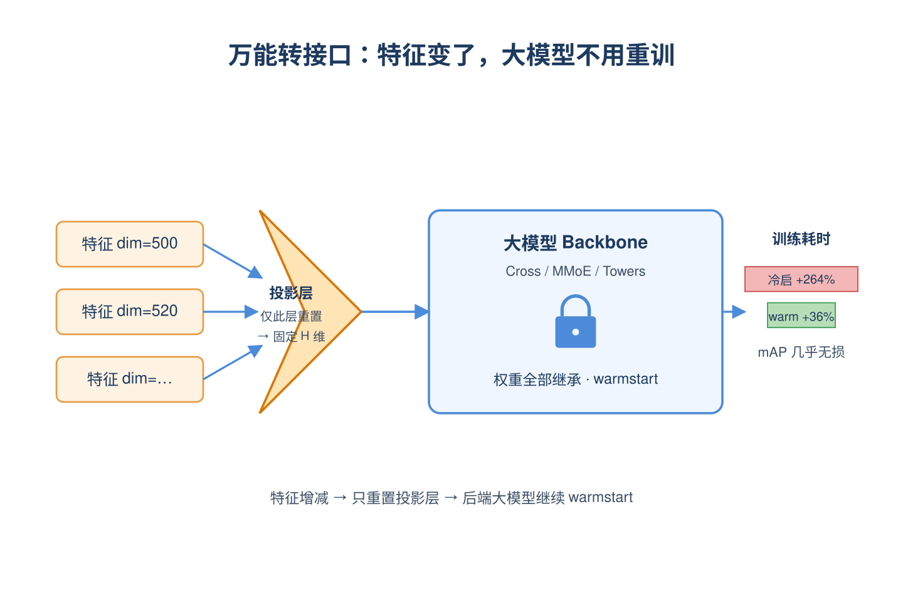
*图示：相当于给模型装了个'万能转接口'：不管前面特征怎么变，转…*

- 技术细节：传统warmstart的痛点是特征一加一减，输入维度变了，老checkpoint就不能用。作者的做法是：在特征拼接后先过一层固定维度的projection（投影到一个固定隐层），后面所有backbone参数都在这个固定空间里工作。当特征发生变化时，只重新初始化这层投影权重，其他所有层都从老模型warmstart继续训练。流程是先在一年数据+8x backbone上训一个base模型，然后在最近140天数据上fine-tune整网。
- 通俗讲解：相当于给模型装了个'万能转接口'：不管前面特征怎么变，转接口后面的大模型都不用重训。冷启动训练要+264%耗时，warmstart只需+36%，且mAP几乎无损。
- 例子：比如团队上线了一个新的query-item交互特征导致输入维度从500变成520，传统做法checkpoint直接报错；用本文方案只需把投影层从500x H 重置成520x H，cross/MMoE那些大矩阵全部继承老权重，几小时就能fine-tune完。

#### 技术点 4：GPU服务延迟优化
- 快速理解：拆图+动态batching让8x算力模型延迟几乎不变

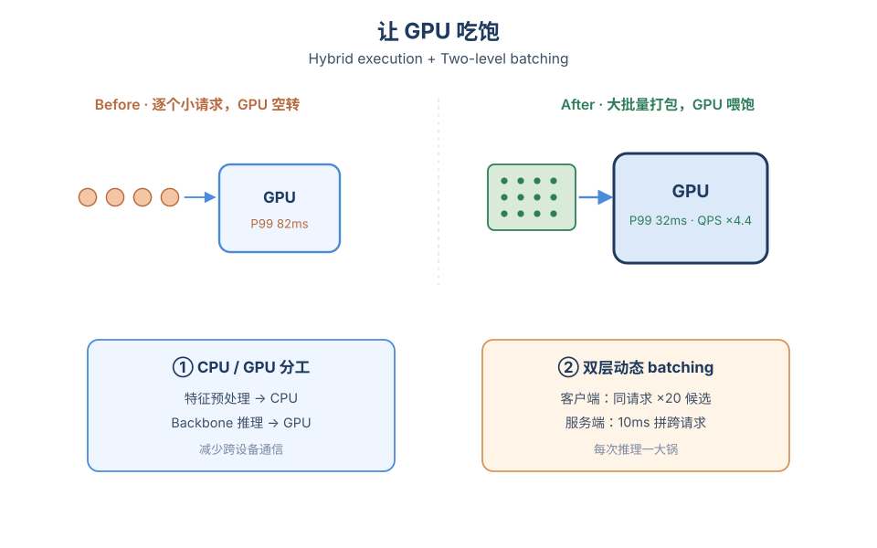
*图示：大模型上线最大的拦路虎是延迟，作者发现GPU不是不够快…*

- 技术细节：两个核心优化：(1)Hybrid CPU-GPU执行：把特征预处理钉在CPU上、backbone放GPU，避免GPU间通信瓶颈，P99从82ms降到32ms；(2)双层动态batching：客户端侧把同一请求的候选商品聚合送进GPU（一次性吃20x batch），服务端侧再用10ms超时窗口把不同请求拼起来，峰值QPS提升4.4x。
- 通俗讲解：大模型上线最大的拦路虎是延迟，作者发现GPU不是不够快，而是被'小batch+频繁通信'拖累。解决思路就是让GPU每次都吃饱：把不该GPU做的（预处理）赶下去，把该一起做的（同请求多商品、不同请求）打包送进去。
- 例子：原来一个搜索请求带100个候选商品，逐个走GPU导致GPU空转；优化后客户端把100个商品一次打包送来，服务端再把10ms内来的多个用户请求合并，GPU一次推理几百到上千个样本，P99延迟还能控制在50-75ms内。

#### 技术点 5：Embedding扩维优于扩词表
- 快速理解：item embedding加维度比加词表更值，文本embedding加维度无效

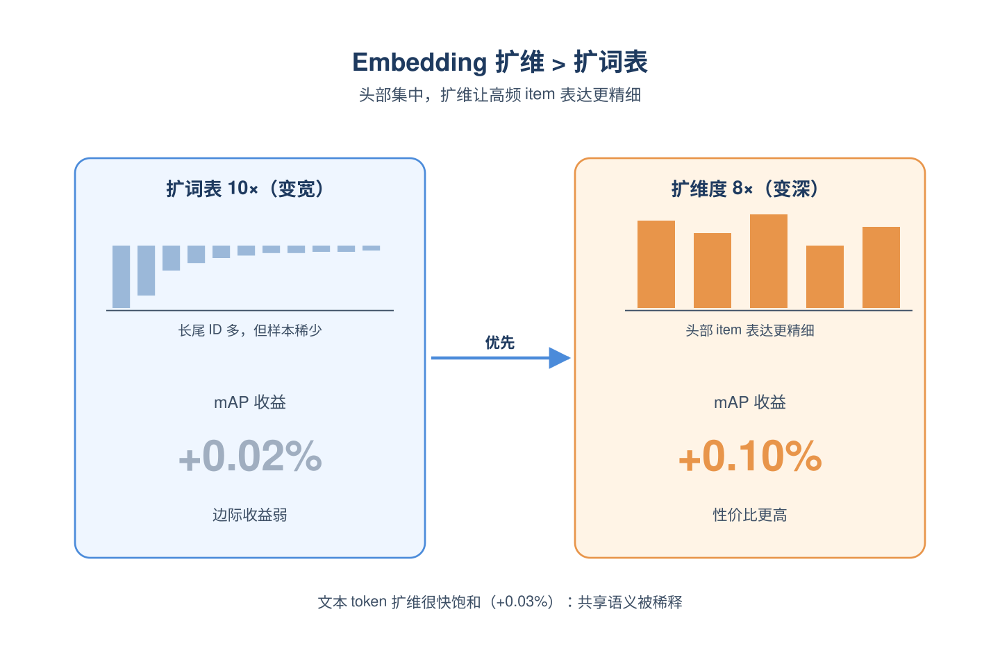
*图示：因为用户交互高度集中在头部商品，扩词表只让长尾商品有更独…*

- 技术细节：对item embedding做了2x2实验：词表大小1x vs 10x，维度16/32/64/128。结果显示维度翻倍的mAP收益(+0.10%)大于词表扩10x(+0.02%)，且两者收益可加。但对query和product title这类文本特征，token embedding扩维只有微弱收益(+0.03%)很快就饱和。
- 通俗讲解：因为用户交互高度集中在头部商品，扩词表只让长尾商品有更独立的ID，但他们本来就缺训练样本；而扩维度让头部高频商品的表达更精细，性价比高。文本token因为本身要在不同语境中被复用，扩维反而稀释了共享语义。
- 例子：把item embedding从16维提到128维：mAP+0.12%；同时把词表从1x扩到10x：再叠加+0.04%；但把title的token embedding维度从16翻到64基本看不到提升。

- **对广告的启发：** 广告CVR/CTR模型可以照搬这套'三维独立scaling+warmstart+GPU打包'的工程范式
- **适用边界：** 结论建立在Coupang这种高流量电商搜索场景，且没有上LLM式的超长用户行为序列建模；对低流量、冷启动严重或强依赖文本语义的场景（如广告创意生成、稀疏垂类）scaling规律可能不成立。文中也强调'mileage may vary'——不同业务最好用本文的小数据快速筛选法自己验证一遍。
- **实践建议：** 立刻可做的事：在自家CTR/CVR模型上加一层固定维度projection并搭起warmstart pipeline，下次加特征时把训练耗时从天级降到小时级；同时用本文'小数据集排序≈大数据集排序'的经验，把backbone选型实验全部迁到1/10数据量上做，迭代速度立刻提升。

### 2. Rec-Distill: An Industrial Distillation Pipeline for Large-Scale Recommendation Models
- **为什么值得看：** 字节工业级蒸馏管线，把24B教师压到轻量学生，广告CVR可直接复用
- **背景：** 推荐和广告模型按Scaling Law堆参数能涨AUC，但线上serving对延迟和成本极度敏感，超大模型直接部署不现实。已有蒸馏方法要么靠静态数据集（不适合流式更新的推荐场景），要么教师学生联合训练（成本爆炸），要么像Meta ExFM只关注算力摊销而没系统解决'怎样把教师涨点最大化迁移给学生'。论文要回答的就是：在工业流式环境下，怎么把一个24B、20K序列的教师模型的红利尽量灌到上线小模型里。
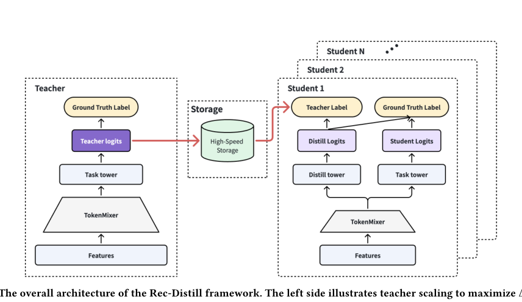
*图示：Figure 1 是 Rec-Distill 的整体架构…*

**核心技术点：**

#### 技术点 1：蒸馏增益分解公式
- 快速理解：把蒸馏收益拆成'教师涨幅×迁移率'，分别优化两端

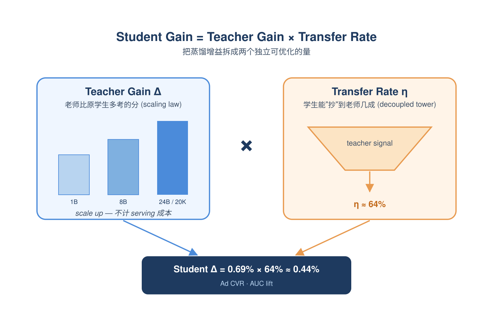
*图示：直觉是：要让学生从蒸馏中拿到多少分，等于'老师比原来多考…*

- 技术细节：论文把学生最终蒸馏增益分解成两部分相乘：一部分是教师相对于原始学生的提升幅度（教师增益），另一部分是迁移率，定义为'蒸馏后学生提升'除以'教师相对原始学生的提升'。前者靠scaling law扩教师（参数、序列长度、数据量）来做大，后者靠蒸馏算法和学生结构来做大。整篇文章所有模块都在围绕这两个量优化。
- 通俗讲解：直觉是：要让学生从蒸馏中拿到多少分，等于'老师比原来多考多少分'乘以'学生能抄到老师多少'。这样一拆，工程优化路径就清晰了——教师那边只管尽量做强不管成本，学生那边只管把能吸收的尽量吸收。论文报告最佳设置下迁移率超过60%，相当于把老师涨点的60%以上保留下来。
- 例子：广告CVR场景里，教师扩到24B、序列20K，相比1B学生Base AUC涨0.69%；蒸馏后的学生AUC涨0.44%，迁移率0.44/0.69≈64%。也就是教师辛辛苦苦多挣的0.69个点，学生靠蒸馏拿回了其中的0.44个点，剩下的0.25个点是被容量gap吃掉的损失。

#### 技术点 2：解耦双塔学生结构
- 快速理解：学生拆主塔和辅塔，主塔只学真值保serving稳定，辅塔吃蒸馏信号

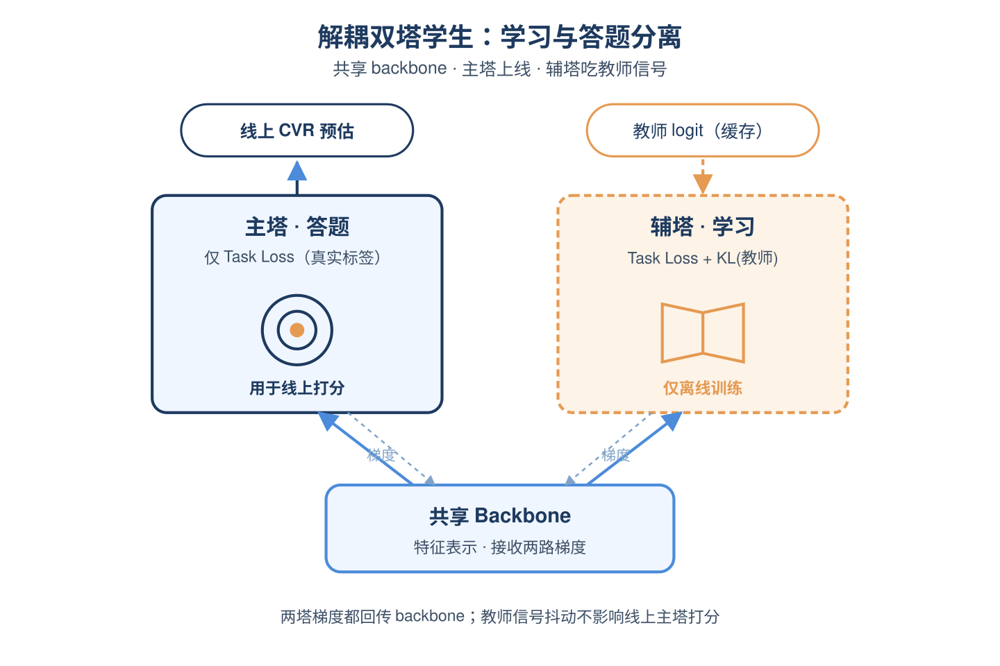
*图示：做法上像是把'学知识'和'考试答题'分两条路：辅塔负责跟…*

- 技术细节：学生网络共享一个特征backbone，但拆成两个塔：主任务塔只用真实标签的task loss训练，负责线上推理；辅助塔同时用真实标签和蒸馏KL loss训练，专门接收教师logit信号。两塔的梯度都会回传到共享backbone，所以backbone既学到任务监督又学到教师知识，但线上打分只走主塔，避免蒸馏管道异常波及线上。
- 通俗讲解：做法上像是把'学知识'和'考试答题'分两条路：辅塔负责跟着老师学，主塔负责按真实标签答题打分，两人共用同一套'底层笔记'（backbone）。这样即使老师签到迟了、教师信号抖了、蒸馏管道断了，主塔答题不受影响，线上CVR预估始终稳定。消融显示单塔只用蒸馏loss仅涨0.03%，单塔task+distill涨0.36%，而双塔配置能到0.44%。
- 例子：一条广告曝光样本进来，特征向量过共享backbone，得到一份共享表示；主塔基于这份表示输出最终CVR预估值，用于在线竞价；辅塔输出另一个logit，与教师缓存下来的logit算交叉熵做对齐。线上serving只读主塔输出，离线训练时两个塔的梯度都会更新backbone。

#### 技术点 3：批流混合蒸馏管线与教师logit缓存
- 快速理解：教师前向时把logit写入中间存储，学生异步消费，1教师N学生复用

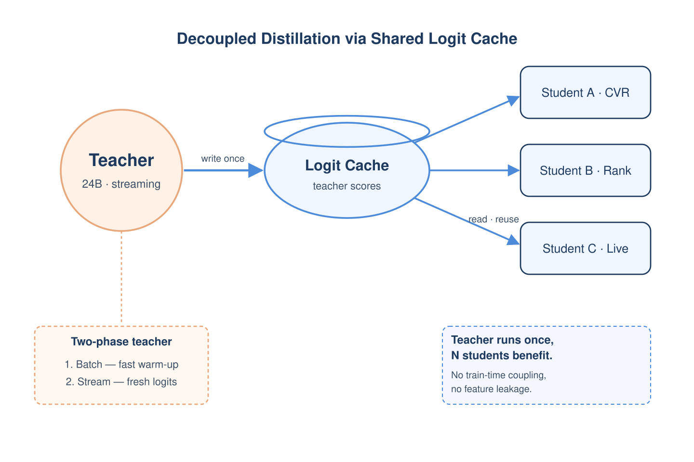
*图示：要点是把教师从学生训练循环里彻底解耦——教师只管自己流式…*

- 技术细节：教师在持续流式训练中前向产生的logit直接落到中间存储（避免train-then-predict的特征穿越），学生从中间存储读取作为蒸馏目标。批训练阶段用大batch快速收敛，流式阶段教师logit低延迟写入、与原始数据流join成补充流，学生分钟级消费。logit也会落HDFS长期存储，方便后续学生实验复用同一份教师监督，保证实验可复现。
- 通俗讲解：要点是把教师从学生训练循环里彻底解耦——教师只管自己流式更新并把打分结果存下来，学生爱什么时候读就什么时候读。这样一份教师可以喂多个学生（粗排、精排、不同业务塔），训练成本被多次摊销。消融显示如果跳过批阶段直接流式蒸馏，5个月都追不上批+流的组合；如果只批不流，5天后增益从0.10%掉到0.05%，说明两阶段都不能省。
- 例子：教师当天对一批广告样本前向打分，logit立即写入高速中间存储；几分钟后学生流式任务把这批logit和原始样本label join起来，作为新的训练流喂给学生；同一份教师logit同时被电商广告CVR学生、直播粗排学生消费，老师只跑一次，N个学生都受益。

#### 技术点 4：学生侧重新校正的去偏
- 快速理解：教师和学生采样比例不同，要把教师logit用学生的去偏函数重投影后再蒸馏

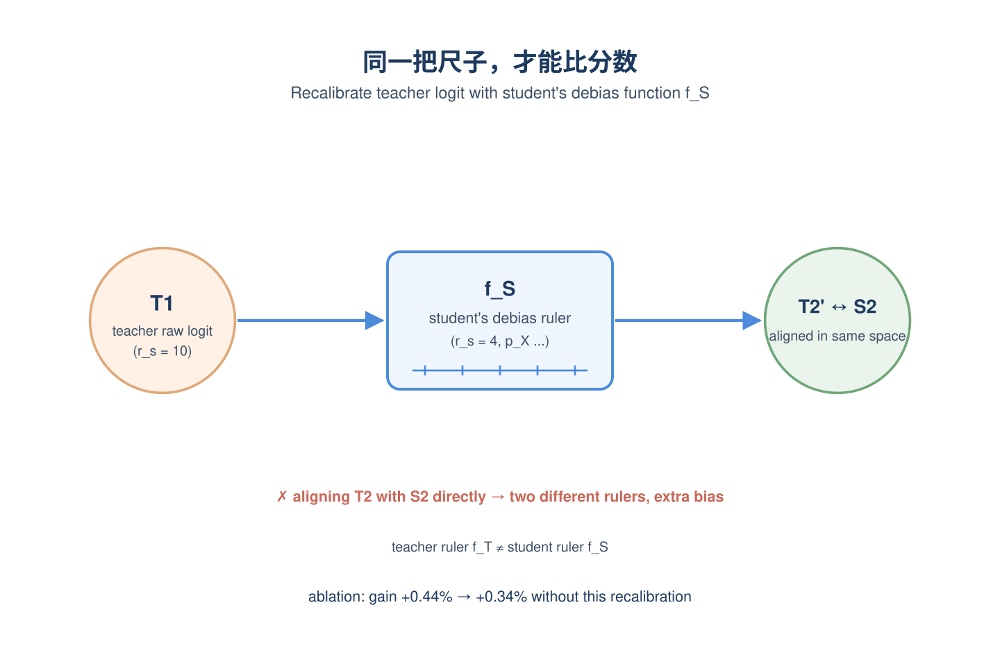
*图示：可以理解成两个人都在做应试题但用了不同的'分数换算表'…*

- 技术细节：工业广告里训练数据通常做负采样，教师为了涨点用更激进的采样扩大数据量，学生因为成本只能用更小数据集，两边的去偏函数不一样。论文的关键操作是：不要直接拿教师去偏后的概率T2去对齐学生去偏后的S2，而是把教师的原始logit T1用学生侧的去偏函数fS再投影一次得到T2'，再让T2'和S2对齐。否则会因为两套校正函数不一致引入额外bias。
- 通俗讲解：可以理解成两个人都在做应试题但用了不同的'分数换算表'，直接比换算后的分数会失真，要先把老师的原始卷面分用学生那张换算表重新算一遍再比。消融显示去掉这个去偏步骤，学生增益从+0.44%掉到+0.34%，掉了约四分之一。
- 例子：教师按负采样比例r-s=10训练，学生按r-s=4训练。教师对一条样本输出原始logit T1，论文不用教师自己的去偏概率T2，而是把T1代入学生那套校正公式（含r-s=4、p-X等参数）算出T2'，再让学生的去偏概率S2去拟合T2'，确保两边在同一个'校正后概率空间'里对齐。

#### 技术点 5：教师全维度Scaling都可迁移
- 快速理解：参数、序列长度、训练数据量三类scaling红利都能蒸馏给学生

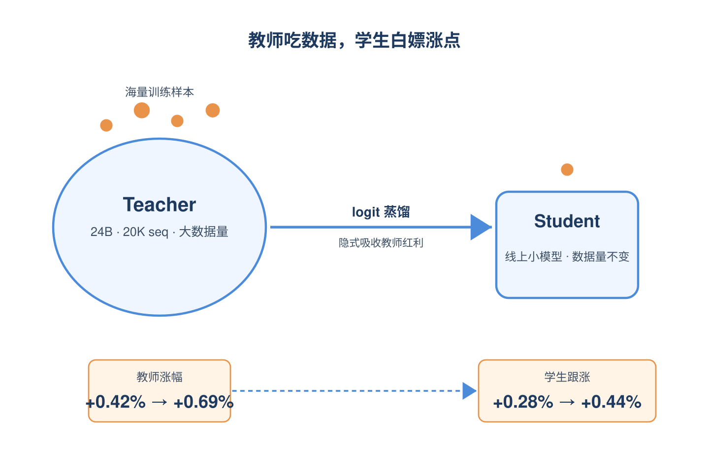
*图示：重要结论是数据量这一维特别值——教师替学生'吃下'更多数…*

- 技术细节：教师采用TokenMixer-Large扩dense参数到24B，用LONGER架构吃20K行为序列绕开Transformer二次复杂度，并按Chinchilla思路放大训练数据量。消融显示：单独把dense从1B扩到7B，教师涨0.30%、学生涨0.22%，迁移率73%；单独把序列从5K扩到20K，迁移率61%；单独放大教师数据量（学生数据不变），教师从+0.42%涨到+0.69%，学生从+0.28%涨到+0.44%。
- 通俗讲解：重要结论是数据量这一维特别值——教师替学生'吃下'更多数据，把消化结果通过logit传给学生，学生不用真的训那么多数据也能涨点，相当于用蒸馏把训练成本分摊掉。三类scaling红利都可迁移意味着只要能让教师变强，几乎都能反映到线上学生身上。
- 例子：广告场景里只把教师训练数据采样比放大（学生采样不变），教师AUC从+0.42%涨到+0.69%，学生跟着从+0.28%涨到+0.44%。学生从未见过那批扩出来的样本，但通过对齐教师logit隐式吸收了这部分知识。

- **对广告的启发：** 广告CVR/CTR排序可以直接照搬：教师离线扩参，学生线上轻量，靠logit缓存解耦
- **适用边界：** 方法依赖工业级流式训练和高速中间存储基础设施，对没有这套pipeline的团队复现成本高；当学生容量过小或教师-学生capacity gap过大时迁移率会显著下降，蒸馏不能完全消除容量瓶颈。
- **实践建议：** 如果你的广告排序已经在做大模型探索，优先尝试'教师流式训练+logit落中间存储+解耦双塔学生'这套结构，并务必把教师logit用学生侧采样校正函数重新投影一次再做对齐，能稳拿一个百分点级的迁移收益。
