# 2026-06-01 论文日报

## 一、今日趋势与创新观察

### 1. 趋势概况

- 今日全量415篇，cs.AI 215篇与cs.LG 180篇延续主导，cs.IR仅20篇但其中电商搜索相关性、自动出价拍卖等商业化议题密度明显上升。
- LLM与语言理解类167篇仍是最大主题，研究重心从纯生成进一步转向RAG中检索内容表征、事实密度评估以及面向e-commerce的依赖感知奖励信号。
- 表示学习与检索排序方向125篇，议题集中在合成IR测试集与干扰项诊断、多语言embedding鲁棒性、生产级稀疏视觉文档检索以及超越实例级对齐的CF语义因子学习。
- Agent与多智能体79篇与商业化决策26篇构成第二梯队，动态Agentic检索树、Thompson Sampling多目标决策等把RL/Bandit拉回到具体业务场景。

### 2. 推荐系统 / 排序相关创新点

- Model Monotonicity in Autobidding Auctions首次系统刻画pCTR/pCVR预测质量、拍卖格式与autobidder行为之间的单调性条件，给"模型变好是否一定带来平台收益"提供了理论判据。
- Graph-GRPO把电商搜索相关性拆成query理解、商品理解与facet匹配的依赖图，用依赖感知的GRPO信用分配做结构化推理，并在线A/B验证。
- Zero Collapse指出在重复首价拍卖等不连续奖励环境下，策略梯度会因cliff-like reward而退化为零出价，提示广告竞价RL需要重新设计探索与价值估计。

### 3. 全局创新点

- SPECTRA提出带relevance oracle和可控干扰项的合成IR测试集生成框架，让索引、排序延迟、评估工具的压力测试可在私有或未上线语料上低成本复现。
- Inference-Free Multimodal Learned Sparse Retrieval把视觉文档检索做成线上完全免神经编码的词法稀疏索引，弥合了语义召回质量与生产级延迟之间的鸿沟。
- Reducing GPU Memory Bottleneck用无损压缩替代有损压缩缓解PCIe传输瓶颈，给DLRM嵌入查找和LLM推理提供一种工作负载无关、无精度损失的加速路径。

### 4. 跨论文综合观察

- Model Monotonicity与Zero Collapse从不同侧面拷问广告竞价的"模型-机制-学习算法"链条：前者问预测变好是否真的导致更好结果，后者问RL算法在拍卖奖励结构下是否还能学得动，二者合起来提示autobidding系统需要联合考虑预测质量、拍卖格式与训练算法稳定性。
- Graph-GRPO与SPECTRA分别代表生产侧和评测侧的同一趋势：电商/IR排序正从"单一相似度分数"走向带结构化依赖与可控诊断的范式，前者把相关性拆成依赖图做奖励分配，后者用合成oracle定向探测干扰项鲁棒性。
- Inference-Free稀疏检索与GPU无损压缩共同指向工业检索/推荐系统在大模型时代的成本焦虑，一个从架构上去掉在线神经编码，一个从底层缓解显存与PCIe瓶颈，呈现"语义能力上移、推理负担下沉"的系统侧分工。

## 二、今日入选论文

### 1. Model Monotonicity in Autobidding Auctions: When Do Better Predictions Lead to Better Outcomes?
- 挑选理由：直接研究自动出价拍卖中pCTR/pCVR模型质量、拍卖格式与平台收入/福利的单调性，核心广告链路问题

### 2. Graph-GRPO: Dependency-Aware Credit Assignment for Generative E-commerce Search Relevance
- 挑选理由：电商搜索相关性建模，LLM+RL，线上A/B验证，直接作用于商业化搜索排序链路。

## 三、补充关注

1. **Modeling Covariate Transition for Efficient Estimation of Longitudinal Treatment Effects in Randomized Experiments**
   - 理由：A/B实验中的纵向因果效应估计，对广告增量评估有一定参考，但不是核心广告论文

## 四、重点论文精读

### 1. Model Monotonicity in Autobidding Auctions: When Do Better Predictions Lead to Better Outcomes?
- **为什么值得看：** 首次系统刻画pCTR/pCVR模型变细在自动出价拍卖中何时真能提升平台收入与福利
- **背景：** 广告平台天天迭代pCTR/pCVR模型，背后默认假设是'预测越准 → 分配越好 → 平台收入和福利越高'。但模型一变，自动出价器会改变出价策略，拍卖均衡也会移动，这个反馈回路使得'模型变好'未必带来平台指标变好。论文把这个工程直觉写成数学问题：在tCPA / max-CPA 出价人、FPA / VCG 拍卖、有无预算这几个维度下，系统性回答'模型细化是否单调提升收入/福利'，结论是大多数组合都不单调，对模型上线和A/B评估方式有直接启发。
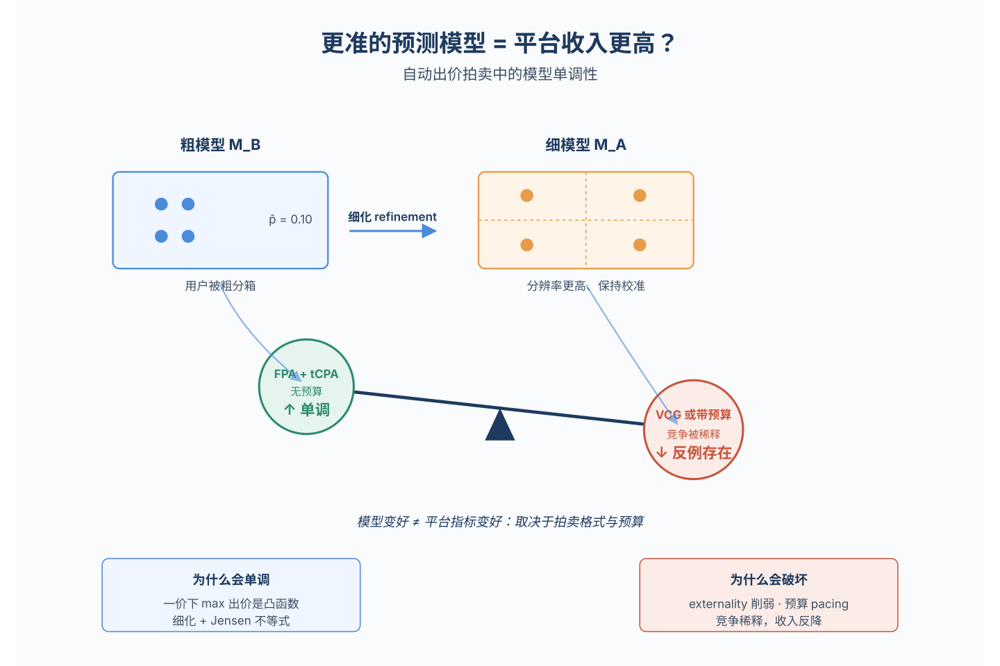
*图示：这是一篇直接面向广告核心链路的理论论文：把'更准的pCT…*

**核心技术点：**

#### 技术点 1：模型细化的形式化定义
- 快速理解：用'聚类细分'刻画模型变好：新模型把老模型的每个用户簇再切细，预测保持簇内平均校准。

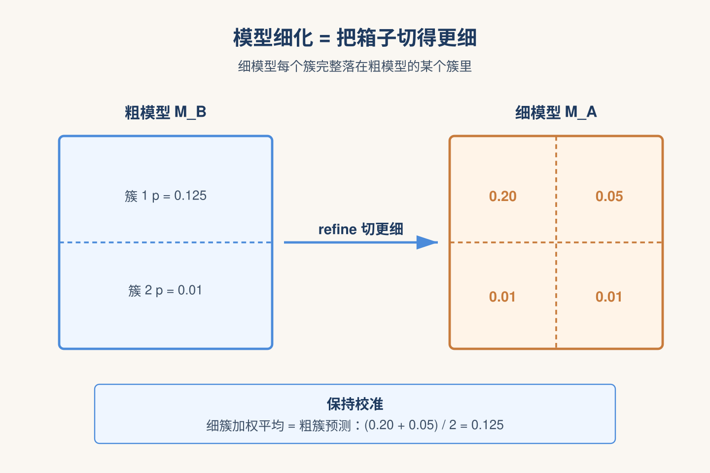
*图示：可以把模型想成把用户分箱：老模型按'年龄+地区'分箱，新…*

- 技术细节：作者把一个预测模型定义为对用户全集U的一个划分：每个簇C输出该簇内真实转化率的平均值作为预测pi,C。模型MA refines 模型MB，当且仅当MA的每个簇都完整落在MB的某个簇里，也就是MA在MB的基础上把簇切得更细。这种'细化'对应概率论里的过滤(filtration)，并且天然保持校准：粗模型的预测正好等于其内部细簇预测的加权平均。
- 通俗讲解：可以把模型想成把用户分箱：老模型按'年龄+地区'分箱，新模型在这个基础上再加'浏览历史'继续切箱。每个箱里输出的预测值就是这个箱里真实转化率的平均。新模型只是把老箱子拆成更小的箱子，所以两边的平均预测在期望上对得上，这就是'细化'的含义。论文所有结论都建立在这种'纯粹增加分辨率、不引入预测误差'的理想化假设上。
- 例子：例子：老模型把4个用户分成(用户0,1)和(用户2,3)两簇，分别预测转化率0.125和0.01；新模型把每个用户单独成簇，预测就是各自真实值0.20/0.05/0.01/0.01。新模型是老模型的refinement，并且在每个老簇内，新模型的加权预测平均回去正好等于老模型的预测。

#### 技术点 2：FPA+tCPA无预算可单调
- 快速理解：一价拍卖+tCPA+无预算时，模型变细一定不会让收入和福利下降，靠的是Jensen不等式。

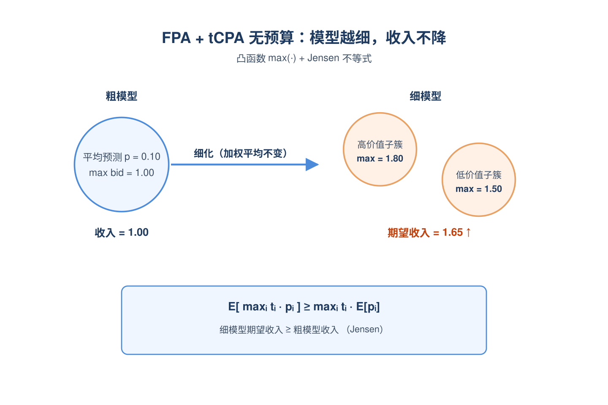
*图示：直觉是：一价里大家'按真实意愿出价'，平台拿到的就是每个…*

- 技术细节：在一价拍卖里，tCPA出价人无预算的最优uniform乘子是µ=1，于是出价就是bi(C)=ti·pi,C，每个簇的收入是maxi ti·pi,C。论文指出maxi ti·pi 这个函数对预测向量是凸的（一堆线性函数取max），而细化恰好把粗簇的预测写成细簇预测的加权平均。对凸函数用Jensen不等式，就得到细模型的期望收入\>=粗模型。又因为tCPA下假设vi=ti，胜者付的钱正好等于其期望价值，所以收入和福利同步单调。
- 通俗讲解：直觉是：一价里大家'按真实意愿出价'，平台拿到的就是每个机会上'最高出价者的价值'。细化模型相当于把'平均用户'拆成'高价值用户+低价值用户'，对最大值这种凸操作总是有利——你能在高价值子簇里收到更高的钱，而低价值子簇的损失被加权平均稀释掉。所以一旦你站在FPA+tCPA+无预算这个组合里，模型变准在数学上保证收入不会倒退。
- 例子：比如某簇里A、B两个广告主预测都是0.1，最高出价是10×0.1=1。细化后这个簇被拆成两半：上半A预测0.18、B预测0.05，下半A预测0.02、B预测0.15，加权平均仍是0.1。但上半最高出价变成1.8，下半变成1.5，加权后期望收入是1.65，比原来的1更高——这就是Jensen在这条链路上的具体体现。

#### 技术点 3：VCG/二价与预算下普遍不单调
- 快速理解：二价拍卖、VCG、以及任何带预算的设定，模型变细都可能让收入或福利掉下来，作者给了具体反例。

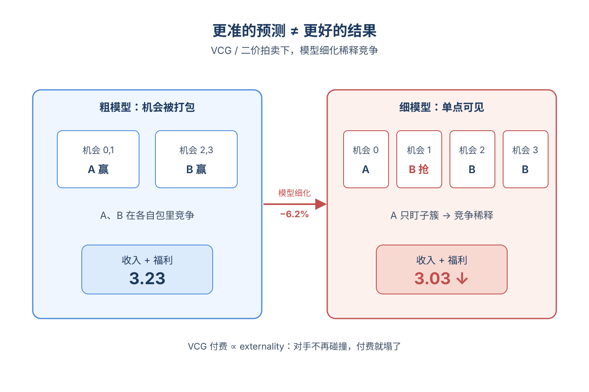
*图示：直觉是：二价/VCG里你付的不是自己的出价，而是'你挤掉…*

- 技术细节：论文用一张表系统列举了各种(出价人类型, 拍卖格式, 是否有预算)组合的单调性，结论是除了三种情形外其它都会反例。关键反例之一：两个tCPA出价人(tA=10, tB=1)在四个机会上的真实转化率给定后，粗模型把机会(0,1)和(2,3)各自打包，均衡下A拿(0,1)、B拿(2,3)，收入和福利都=3.23；细化到单点后，均衡里高tCPA的A只剩拿机会0，原本属于A的高价值机会1被低tCPA的B抢走，收入和福利同时降到3.03（下跌6.2%）。根因有三：VCG付费基于externality会因细化而削弱竞争；预算让最优乘子不再是1并产生pacing；tCPA目标和VCG福利最大化的对齐条件被破坏。
- 通俗讲解：直觉是：二价/VCG里你付的不是自己的出价，而是'你挤掉别人造成的福利损失'。模型变细意味着你能更精准地只盯着对自己价值最高的子簇，反而让你和对手在更多子簇里不再正面碰撞，竞争被稀释，平台收的钱就少了。预算更糟：粗模型下高价值广告主可能在好机会上正常竞争，细化后他能精准识别少数最优机会、迅速烧光预算，剩下的机会被低质量广告主以低价拿走，平台总收入反而下降。
- 例子：顺着论文的例子走：粗模型下机会1因为被打包在(0,1)里，A以高tCPA=10的乘子拿下整包，给平台贡献了机会1上的高收入。细化后机会1单独成簇，A的tCPA约束让它在均衡里不再以高乘子去抢机会1，于是B以tB=1的低乘子拿下机会1，平台在这一格的收入大幅缩水。整体A只赢机会0，B赢(1,2,3)，最终收入从3.23掉到3.03——更准的预测反而让平台少赚。

#### 技术点 4：LP分配作为'非策略'参考线
- 快速理解：如果平台直接用LP集中式分配（牺牲激励相容），带预算下福利就能保单调，凸显机制设计上的取舍。

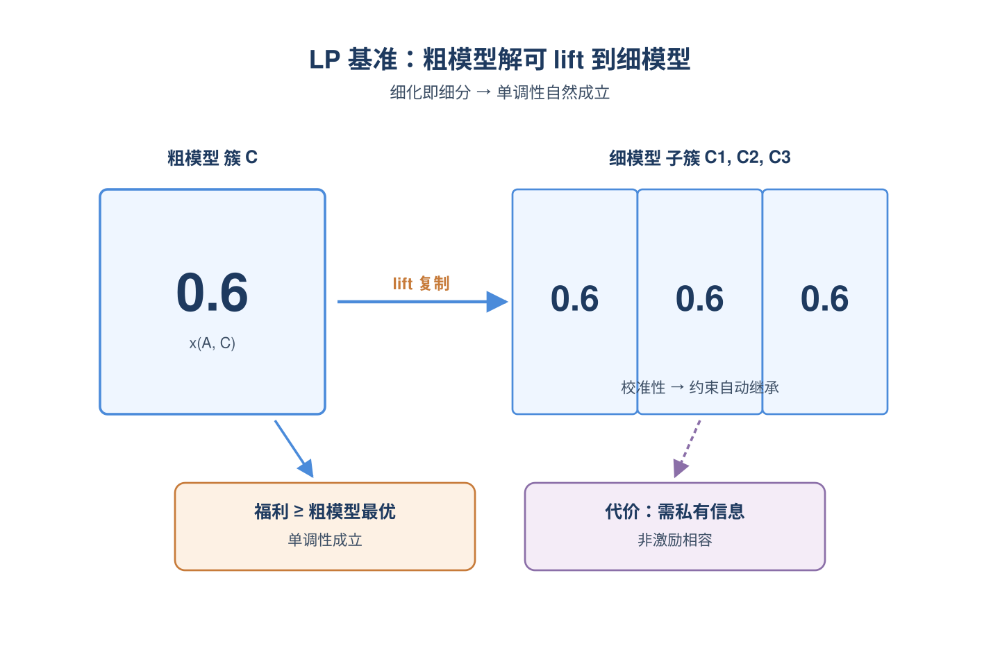
*图示：可以把LP理解成'上帝视角'的分配器：它不让广告主出价博…*

- 技术细节：作者引入一个非策略性的LP基准：平台直接对每个(广告主, 簇)选一个分数化分配xi,C属于（0,1），加上供给约束和形如求和 wC·xi,C·ai·pi,C \<= Bi 的预算约束，目标是最大化福利（或tCPA下的代理收入）。论文证明：在细化MA⪰MB下，可以把粗模型的最优解'抬升(lift)'到细模型——把每个粗簇上的xi,C原样复制到它的所有子簇，校准性保证供给、预算、目标函数全部继续可行且数值不变，所以细模型的最优值不会更低。代价是：LP需要平台知道tCPA、价值、预算等私有信息，不再激励相容。
- 通俗讲解：可以把LP理解成'上帝视角'的分配器：它不让广告主出价博弈，而是直接在表格上为每个(广告主×用户簇)填一个0~1的概率，凑齐预算和库存。论文的关键观察是：任何在粗表格上可行的方案，都可以原样填到细表格里，因为细簇只是粗簇的进一步切分，加权一致性让所有约束自动继承。于是细模型的最优解至少能达到粗模型的水平，单调性自然成立。代价是平台必须知道每家的真实预算和tCPA，这在现实中不现实。
- 例子：比如粗模型在某个簇上给广告主A分配了xA=0.6（即60%的机会给A），细化后这个簇被拆成3个子簇，LP只要在每个子簇都仍然给A分配0.6，福利贡献和预算消耗就和粗模型完全一样，可行性自动保持。然后LP还能利用细化带来的额外信息进一步优化，所以最终结果只会更好不会更差。

- **对广告的启发：** 模型上线别只看离线AUC，要在自动出价闭环里A/B验证，否则更准的模型可能反而掉收入。
- **适用边界：** 适用边界：单一物品拍卖、uniform bidding、模型完美校准且仅做'划分细化'、均衡选择遵循作者约定（如tCPA约束恰好binding）；当模型升级伴随校准漂移、出价器使用非uniform策略，或考虑跨渠道/跨时间预算分配时，本文的正面与负面结论都不能直接照搬。
- **实践建议：** 下次pCTR/pCVR模型迭代时，除了看离线AUC/LogLoss，建议在含真实自动出价器的仿真或小流量A/B里专门观测平台收入和liquid welfare，并按拍卖格式+是否预算受限分桶看，提前发现'模型变好但收入掉'的反直觉case。

### 2. Graph-GRPO: Dependency-Aware Credit Assignment for Generative E-commerce Search Relevance
- **为什么值得看：** 电商搜索相关性LLM推理的细粒度信用分配，已在京东上线
- **背景：** 电商搜索相关性判断不是一次性文本匹配，而要拆成query理解、商品理解、主体匹配、属性匹配等多步推理。现在主流做法是用LLM做CoT再用GRPO之类的RL优化，但奖励只看最终标签是否对，整条链当作一个优化单元，分不清是哪一步推错了；已有的过程奖励方法又把每步当独立节点，忽略上游错会传到下游。这篇论文把推理过程显式建成依赖图并在图上做奖励传播，对工业相关性建模很有参考价值。
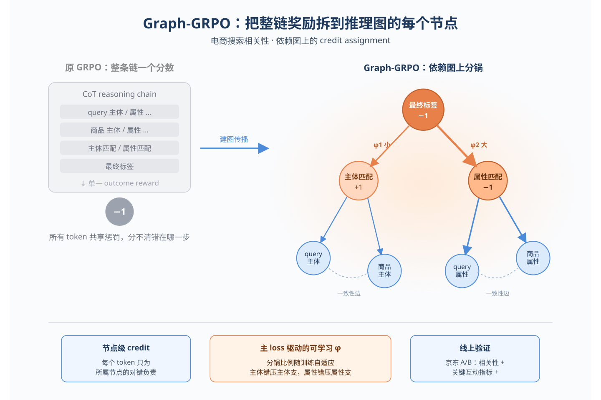
*图示：这是一篇直接作用于电商搜索相关性建模的工业论文，把LLM…*

**核心技术点：**

#### 技术点 1：推理依赖图建模
- 快速理解：把相关性CoT拆成7个语义节点，用有向边显式编码上下游依赖。

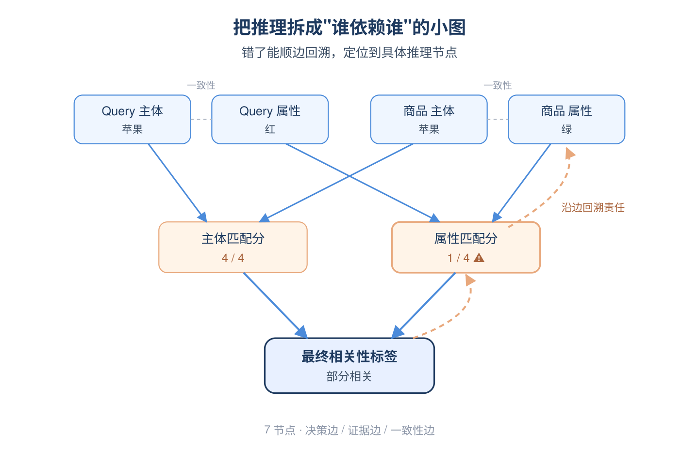
*图示：可以理解成把一次相关性判断画成一张'谁依赖谁'的小图：最…*

- 技术细节：论文把相关性推理固定成一条结构化路径：从query和商品中抽出query主体、query属性、商品主体、商品属性4个证据节点，再算主体匹配分和属性匹配分（0-4五档），最后映射出三档相关性标签。这7个语义单元做为图节点，边分三类：决策边（最终标签到两个匹配分）、证据边（匹配分到对应的主体/属性证据）、一致性边（同侧主体和属性互相约束）。
- 通俗讲解：可以理解成把一次相关性判断画成一张'谁依赖谁'的小图：最终判断挂在两个匹配分上，匹配分挂在query和商品的主体/属性理解上。这样一旦最终判错，就能顺着边往上找：是主体没匹配上，还是属性识别错了，还是query里属性根本没解析对。
- 例子：比如query='红苹果'，商品='青苹果'，模型输出query主体=苹果、属性=红，商品主体=苹果、属性=绿，主体分=4，属性分=1，最终判为'部分相关'。这7个东西就分别是图里的7个节点，沿着属性分到query属性、商品属性的边，可以把最终判错的责任落到属性这一支上。

#### 技术点 2：图上奖励传播打分
- 快速理解：只对最终标签和两个匹配分给奖励，再沿边把信号传到中间证据节点。

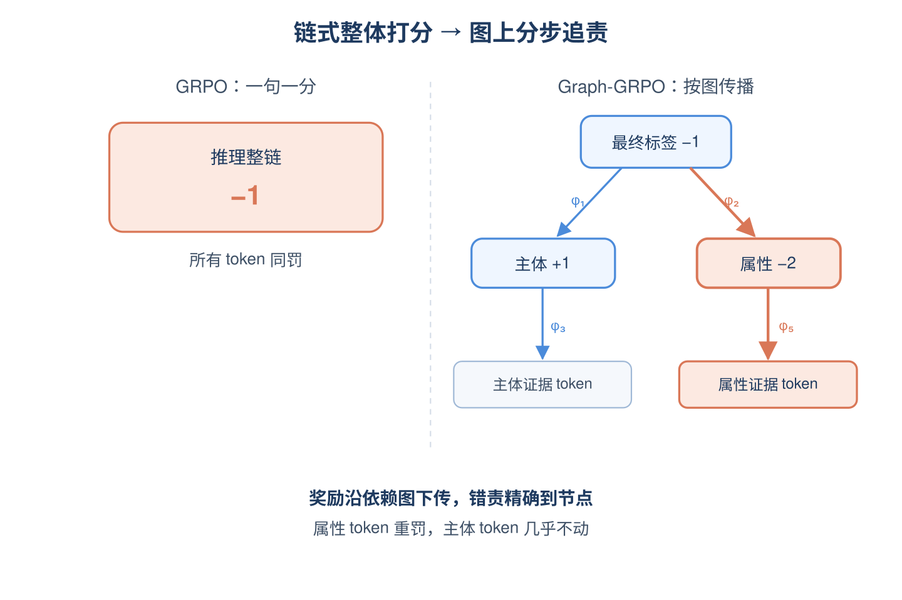
*图示：原来的GRPO是整句话一个分数，所有token共享一个优…*

- 技术细节：可直接监督的只有三个节点：最终标签、主体分、属性分，对就+1错就-1。然后分三步在图上传播：先把最终标签的奖励按系数φ1、φ2加到两个匹配分上；再把匹配分按φ3-φ6传到4个证据节点形成中间奖励；最后用φ7-φ10在同侧的主体和属性证据之间互相补一份一致性信号。每个节点拿到自己的奖励后，在GRPO的组内做归一化得到节点级优势，再按token属于哪个节点把优势映射到token级，套进带KL正则的clip目标里训练。
- 通俗讲解：原来的GRPO是整句话一个分数，所有token共享一个优势值，错一个地方全句一起被惩罚。现在改成每个节点自己一个分数：最终标签错了，先把锅按比例分给两个匹配分；匹配分再把锅传给它依赖的证据token。每个token只为自己所在节点的对错负责，credit就细到了具体的推理步骤上。
- 例子：假设一次采样里最终标签错(-1)、主体分对(+1)、属性分错(-1)。属性分节点会收到自己的-1再加上来自最终标签按φ2分到的一份-1，于是惩罚被集中到属性这一支；属性分再把信号传给query属性、商品属性两个证据节点，那些描述属性的token就拿到较强的负向优势，而描述主体的token几乎不受影响。

#### 技术点 3：主损失驱动的可学习边权
- 快速理解：把10条边的传播系数当成可学习参数，让主策略损失的梯度自己去调。

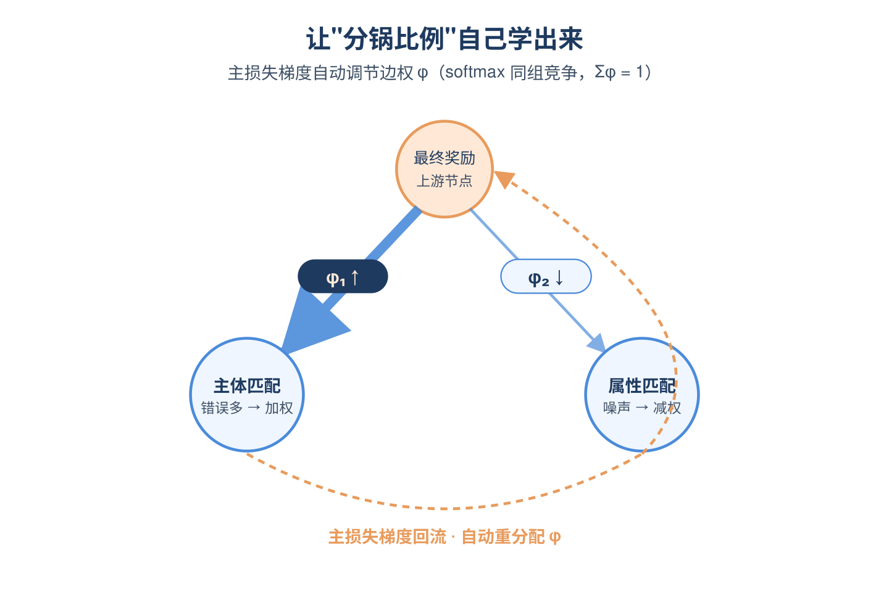
*图示：直觉上不同错误来源的责任权重应该不一样：有时候主体匹配错…*

- 技术细节：10个传播系数φ不是手工设定，而是参数化后做softmax分组归一化（同一上游节点出去的边在一组里竞争分配），然后直接进入主策略损失一起反向传播，配上一个正则项控制稳定性。因为节点奖励、节点优势、token损失都依赖这些系数，主loss的梯度会自动让有效路径的系数变大、噪声路径的系数变小。
- 通俗讲解：直觉上不同错误来源的责任权重应该不一样：有时候主体匹配错才是大头，有时候是属性。固定比例搞不定这种分布漂移，于是干脆把分锅比例当作模型参数学出来，让什么样分配能让策略更新得更好，梯度就会把系数推向那边。
- 例子：训练初期主体匹配错得多，主loss的梯度会推高'最终标签变成主体分'那条边的φ1，使主体支线获得更多惩罚信号；后期属性错变成主要瓶颈时，φ2会被自动学得更大，credit重心切到属性支线，无需人工调权重。

#### 技术点 4：CoT随机mask的SFT初始化
- 快速理解：推理token按概率随机mask掉损失，避免长解释把最终决策淹没。

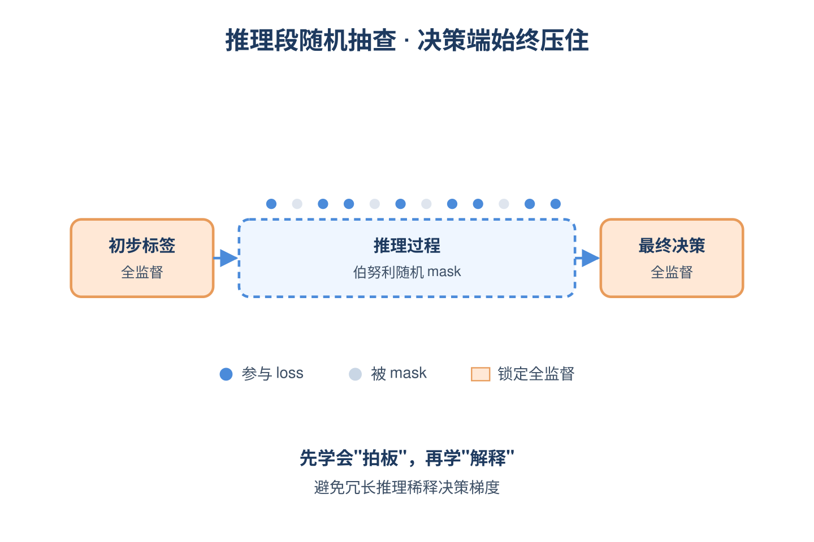
*图示：如果让模型对整段长推理逐token拟合，模型容易学成模板…*

- 技术细节：采用两阶段渐进SFT：先只用标签做监督训出稳定的判断能力；再切到'初步标签-推理过程-最终决策'的格式做CoT训练，但只对推理段的token按伯努利采样部分参与loss，初步标签和最终决策始终全监督。
- 通俗讲解：如果让模型对整段长推理逐token拟合，模型容易学成模板式说辞、把最终判断稀释掉。随机mask相当于只抽查推理过程的一部分token，决策token始终被压住，这样既留下结构化推理的监督信号又不让冗长解释主导梯度。
- 例子：一段推理里有200个token，每个token以30%概率被mask不计loss，剩下140个左右参与训练；而最前面的初步标签和最后的'最终决策：部分相关'始终算loss，保证模型先学会'拍板'再学'解释'。

#### 技术点 5：图节点多头蒸馏部署
- 快速理解：把14B教师的结构化推理蒸到BERT上，三头分别预测主体分、属性分和最终标签。

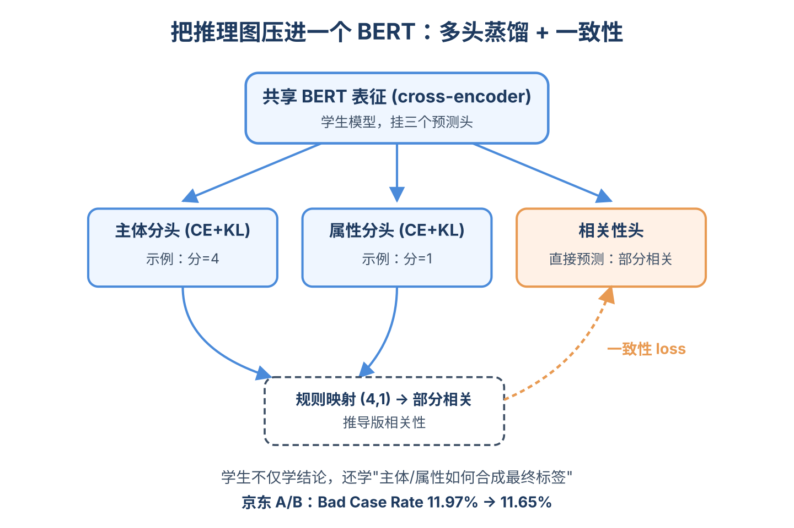
*图示：光蒸最终标签会丢掉教师的中间推理能力。把图里的关键节点都…*

- 技术细节：线上用cross-encoder BERT做学生，共享表征上挂三个预测头：主体分头、属性分头、最终相关性头，分别用CE和KL损失监督。再加一个一致性损失：把两个分数头通过标注规则映射出'推导版相关性'，要求它和直接预测头的分布对齐。
- 通俗讲解：光蒸最终标签会丢掉教师的中间推理能力。把图里的关键节点都做成监督头，学生不仅学最终结论，还要学'主体匹配几分、属性匹配几分'以及它们如何合成最终标签的逻辑，相当于把推理图压进了一个轻量模型里。
- 例子：线上一次query-商品打分：BERT编码后，主体头预测主体分=4、属性头预测属性分=1、相关性头直接预测'部分相关'，同时(4,1)按规则映射也得到'部分相关'，一致性loss推动两路对齐。线上A/B显示Bad Case Rate从约11.97%降到11.65%。

- **对广告的启发：** 广告相关性/创意审核里的多步判别可以借这种'依赖图+节点级奖励'做精细化RL。
- **适用边界：** 方法依赖一个固定且语义清晰的推理骨架（主体/属性两维度），换到推理结构更开放或链路更长的任务可能需要重新设计图；节点级奖励质量取决于中间标签或教师标注的可靠性，标注噪声会被图传播放大。
- **实践建议：** 如果你在做广告相关性或审核的LLM-RL，可以先把判别过程画成3-7个节点的依赖图，给中间节点配上可自动化校验的子奖励（如品牌是否一致、品类是否一致），用GRPO时按节点归一化优势替换整句优势，再蒸馏到线上小模型，预期能降低高危bad case比例。
