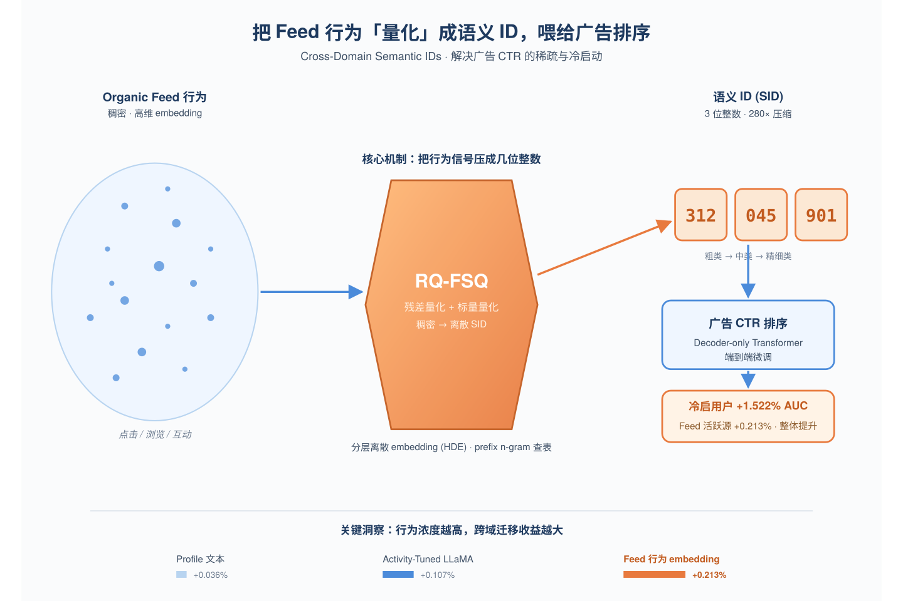
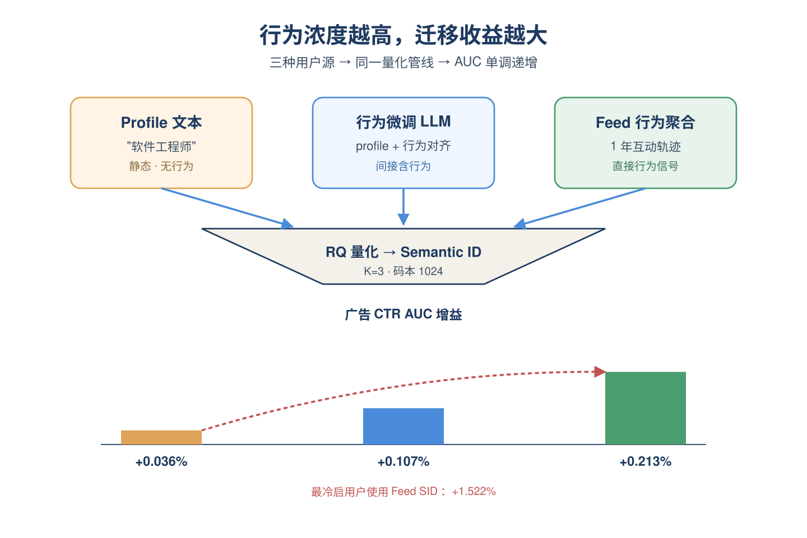
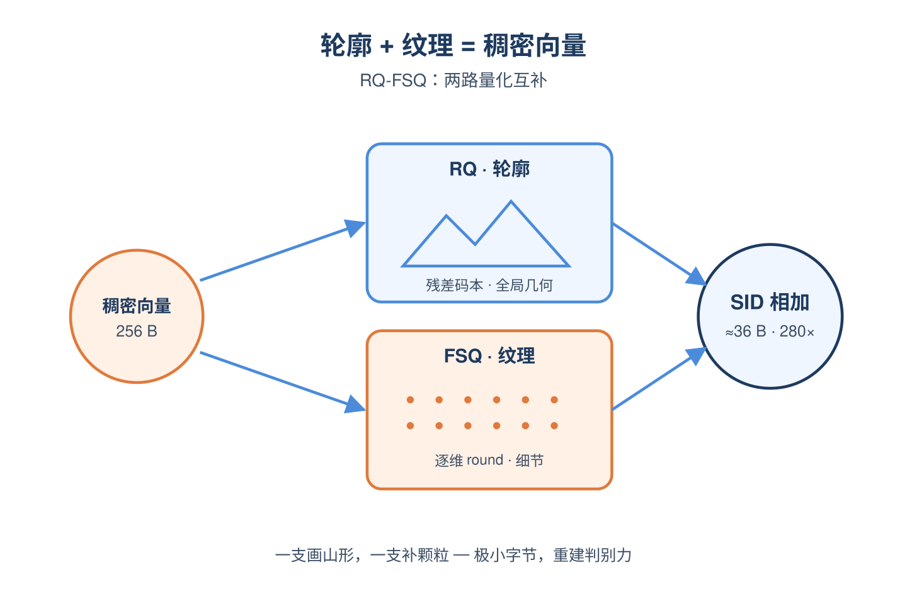
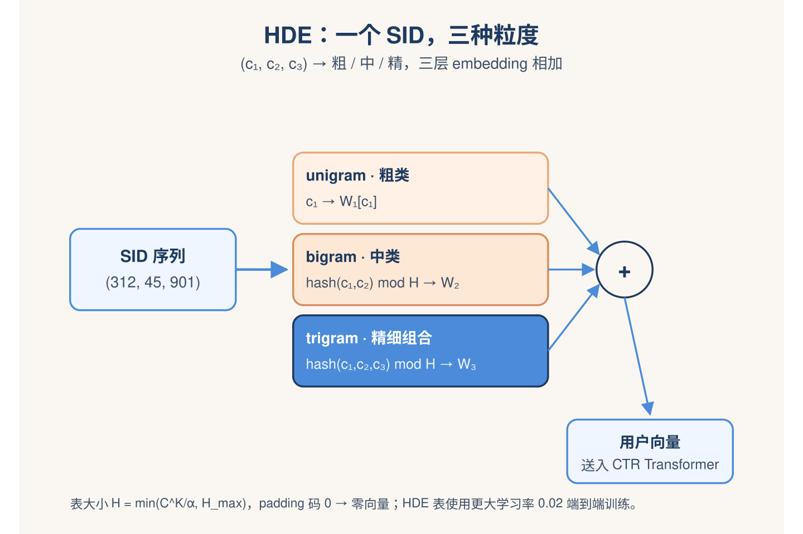
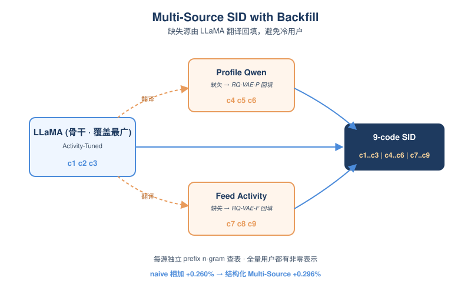
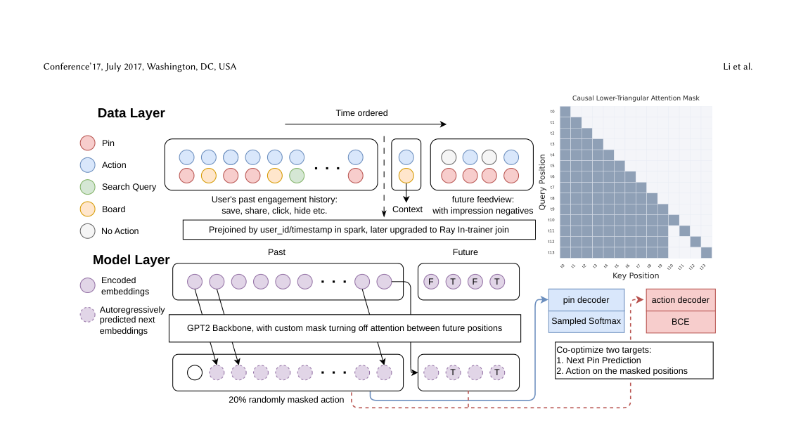
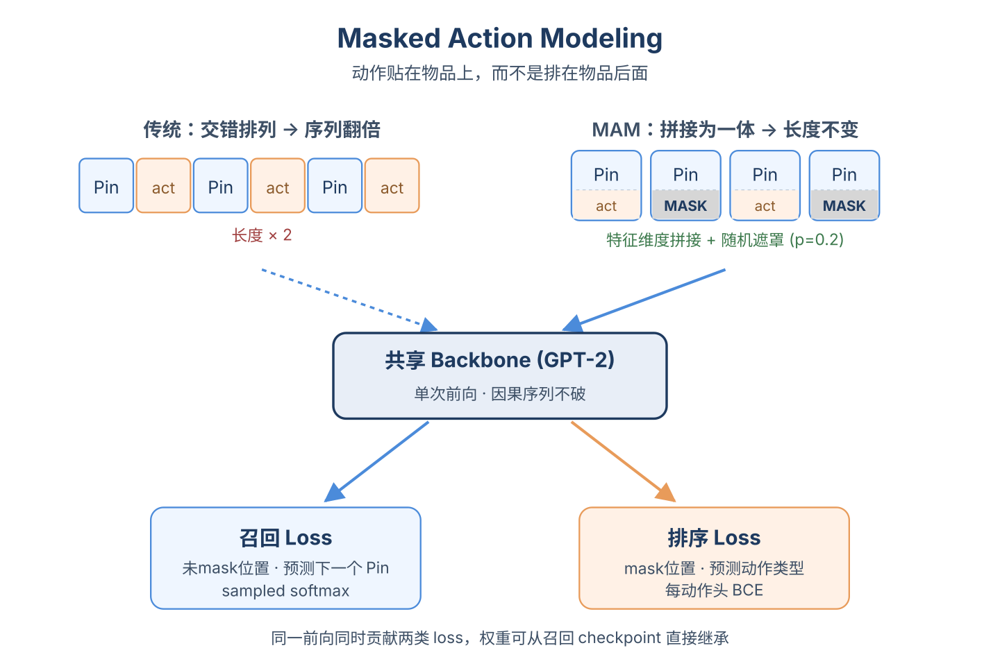
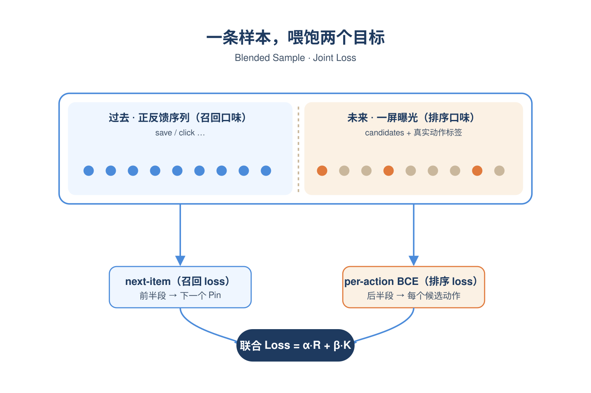
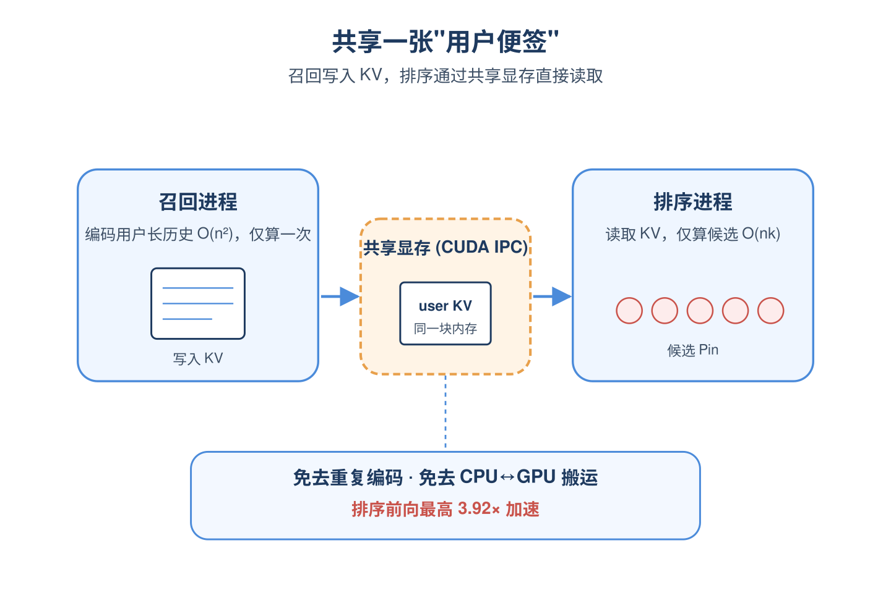
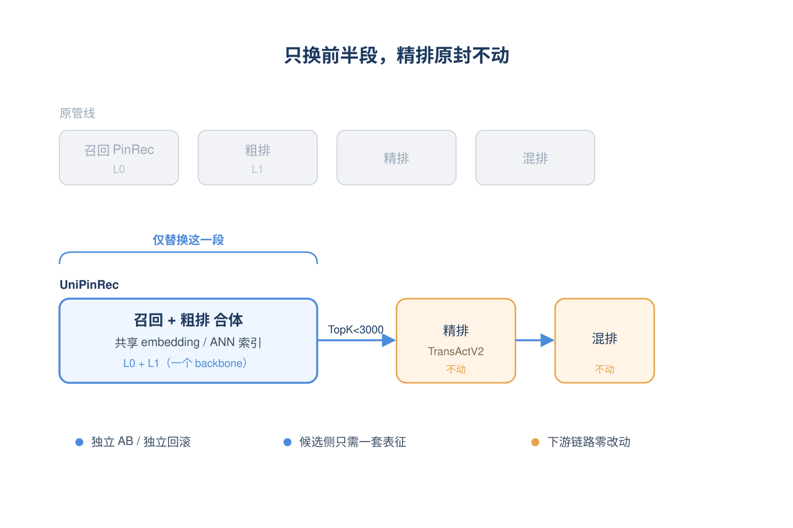

# 2026-06-02 论文日报

## 一、今日趋势与创新观察

### 1. 趋势概况

- 今日全量903篇，cs.AI 555篇与cs.LG 316篇继续主导，cs.IR仅32篇但工业级推荐/广告排序论文密度明显高于近几日。
- LLM与语言理解358篇仍是最大主题，但表示学习与检索排序方向240篇显著抬头，议题集中在Semantic ID量化、生成式召排统一以及跨域行为迁移。
- Agent与多智能体191篇延续高位，更多围绕工具编排、记忆外置与自愈式orchestrator，整体偏通用系统而非直接对接广告/推荐分发。
- 迁移学习与跨域泛化163篇，重心从纯算法迁移转向跨域语义ID、合成数据增强等更工业落地的形态。

### 2. 推荐系统 / 排序相关创新点

- Pinterest的UniPinRec把召回与排序统一在同一transformer与输入格式下，复用参数与算力，是生成式召排一体化的工业级样板。
- Quantizing Intent用organic feed行为蒸馏出跨域Semantic ID注入广告CTR排序，正面回应广告侧用户监督稀疏与冷启问题，并给出AUC与线上收益。
- FlowTime用flow-based个性化先验做连续生成式观看时长预测，绕开直接回归的mean-collapse与序数回归的离散化损失，是商业化目标建模的新范式。

### 3. 全局创新点

- LLMs Need Encoders for Semantic IDs Too主张Semantic ID应像视觉/音频模态一样配专用编码器接入LLM，而不是当作普通token，重新定义了生成式推荐与LLM的接口层。
- Decoupled Residual Quantization把码本利用率、决策边界稳定性与嵌入几何失真解耦诊断，让Semantic ID的"为什么坏"第一次有了可解释的归因工具。
- Harness-1提出state-externalizing harness，把搜索Agent的证据、约束、已验证声明等状态从transcript中剥离出来再做RL训练，缓解长程上下文里routine状态管理挤占决策能力的问题。

### 4. 跨论文综合观察

- UniPinRec、LLMs Need Encoders for Semantic IDs Too、Decoupled Residual Quantization与Quantizing Intent共同指向同一条主线：Semantic ID正在从单点tokenizer升级为贯穿召回-排序-LLM-跨域迁移的统一表示层，并开始配套诊断工具与编码器接口。
- Quantizing Intent与Synthetic Data from Cross-Domain Events是跨域信号利用的两种互补路径——前者把organic行为压缩成离散ID迁移到广告，后者直接合成跨域事件喂给目标域模型，反映出工业界对"广告侧监督稀疏"的两种工程化解法。
- FlowTime、UniPinRec与LeAP合在一起体现工业排序的三层共同收紧：目标建模从点估计转向生成式分布，架构从分段拼装转向召排统一，特征侧从人工选择转向可学自适应permutation，整体在朝"端到端可学的工业级生成式排序栈"演进。

## 二、今日入选论文

### 1. Quantizing Intent: Cross-Domain Semantic IDs from Organic Activity for Industrial Ranking
- 挑选理由：工业级广告CTR排序，跨域语义ID迁移organic feed信号，AUC收益与冷启分析齐全

### 2. UniPinRec: Unifying Generative Retrieval and Ranking at Pinterest Scale
- 挑选理由：Pinterest生产级召回与排序统一架构，强同构于广告召排链路

## 三、重点论文精读

### 1. Quantizing Intent: Cross-Domain Semantic IDs from Organic Activity for Industrial Ranking
- **为什么值得看：** LinkedIn工业广告：把feed行为量化成离散ID，冷启用户AUC涨1.5%
- **背景：** 广告CTR模型最大的痛点是用户和广告交互非常稀疏，尤其新用户基本没点过广告，但同一批用户在feed等organic场景却有大量行为。直接把feed的稠密embedding塞进广告模型存在域不匹配、存储贵、上线复杂等问题，所以作者把这些跨域信号量化成几位整数的Semantic ID（SID）作为广告排序模型的用户特征，既轻量又能端到端微调，是一篇典型的工业落地论文。

*图示：这篇是LinkedIn广告团队的真实落地工作，针对广告C…*

**核心技术点：**

#### 技术点 1：行为丰富度决定迁移收益
- 快速理解：源embedding里行为信号越多，做成SID后给广告CTR带来的AUC越高。

*图示：直觉是：广告里能预测点击的，最重要的不是'用户简介写了啥…*

- 技术细节：作者构造了三种用户源embedding：纯profile文本（Qwen编码）、用profile做输入但在跨域行为数据上对比微调过的LLaMA、以及直接由1年feed行为聚合而来的behavior embedding。各自用RQ-KMeans量化成K=3、码本1024的SID喂入同一个decoder-only Transformer广告CTR模型，AUC增益分别是+0.036%、+0.107%、+0.213%，呈单调递增；冷启分群中feed activity SID给最冷用户带来+1.522%。
- 通俗讲解：直觉是：广告里能预测点击的，最重要的不是'用户简介写了啥'，而是'用户最近在干啥'。论文把三种'含行为浓度'不同的embedding放在同一管线里跑，结果AUC严格按行为浓度排序，说明离散化没把行为信号磨没，CTR梯度还能把这些离散token重新对齐到广告任务。
- 例子：比如一个用户profile写着'软件工程师'，profile SID只能映射到一个泛泛的'技术人群'码字；而feed activity SID会把他最近一年频繁互动AI、云计算内容压成几个具体码字，喂进广告排序后，模型对AI类广告打分明显抬升，对最冷用户AUC提升1.5%。

#### 技术点 2：RQ-FSQ量化方法
- 快速理解：残差码本+逐维标量量化双分支融合，存储缩小30-280倍且不掉AUC。

*图示：RQ-VAE像是'先粗后细地用几个聚类中心拼出向量'，容…*

- 技术细节：对预训练embedding同时做两路量化：一路是RQ-VAE，按K级残差不断找最近码本中心，捕捉全局几何；另一路是FSQ，对每一维做tanh后乘L再round成小整数（L=16即4 bit），捕捉逐维细节。下游使用时，把RQ codes查embedding表得到的向量，与FSQ整数序列经过线性投影的向量直接相加。RQ-FSQ在Feed Activity上比稠密源还高+0.351% AUC（约30倍压缩），在Activity-Tuned LLaMA上+0.265%（约280倍压缩）。
- 通俗讲解：RQ-VAE像是'先粗后细地用几个聚类中心拼出向量'，容易丢逐维细节；FSQ则是'每一维独立四舍五入到几个档位'，保留细节但丢全局结构。作者干脆两路并行：一个负责轮廓、一个负责纹理，最后在下游模型里把两路embedding相加，相当于用极小的字节预算重建出原始稠密向量的判别力。
- 例子：一个64维的LLaMA用户向量原本要256字节存float32，经过RQ-FSQ后变成3个10位的RQ码加64个4位FSQ码，约36字节，存储省280倍，但喂进CTR模型后AUC比原稠密向量还略高0.001个百分点，说明压缩没损失反而通过端到端微调补回来。

#### 技术点 3：HDE分层离散embedding模块
- 快速理解：用prefix n-gram哈希查表把K级SID端到端学成稠密用户向量。

*图示：可以理解成给同一个SID设了三套粒度不同的'品类编码表'…*

- 技术细节：对K=3的SID序列(c1,c2,c3)：第1层直接以c1为索引查表W1；第2层把(c1,c2)做多项式哈希再mod H得到索引查W2；第3层把(c1,c2,c3)同样哈希查W3。所有表大小由 H = min(C K/α, H-max) 控制，padding码0对应零向量。三层embedding相加得到用户向量，与广告侧逐位事件embedding在LayerNorm前相加，整个表在CTR loss下端到端训练，HDE表用更大学习率0.02。多源SID时每个源独立做prefix n-gram再求和。
- 通俗讲解：可以理解成给同一个SID设了三套粒度不同的'品类编码表'：unigram管粗类、bigram管中类、trigram管精细组合。哈希+memory cap保证表不会爆炸，padding能优雅降级。整个模块就是把'离散token序列'当成普通category特征查表，不动Transformer主干，工程上能直接挂到现有排序系统。
- 例子：用户SID=(312, 45, 901)：W1查到'科技倾向'方向向量，W2用(312,45)哈希到'AI+创业内容偏好'向量，W3用(312,45,901)哈希到更细的'关注LLM创业新闻'向量；三者相加得到该请求的用户表示，广播到序列每个位置与广告事件embedding相加后送进Transformer，预测点击概率。

#### 技术点 4：多源SID与回填
- 快速理解：9码结构化SID，缺源时用Activity-Tuned LLaMA回填，避免冷源用户被零化。

*图示：工业里几乎不可能每个用户都同时有三种embedding…*

- 技术细节：把三种源各自K=3拼成9码：c1-c3来自Activity-Tuned LLaMA（覆盖率最高，作骨干），c4-c6来自Profile Qwen，c7-c9来自Feed Activity。当Profile Qwen embedding缺失时，用一个专门训练的RQ-VAE-P以LLaMA embedding经过线性投影后的结果作为输入，重建出Profile Qwen的SID；Feed Activity缺失时同理用RQ-VAE-F回填；如果连骨干都缺，则该源全部输出padding码。HDE对每个源独立做prefix n-gram再求和。相比把三个独立SID直接相加（+0.260%），结构化Multi-Source SID再涨+0.036%到+0.296%。
- 通俗讲解：工业里几乎不可能每个用户都同时有三种embedding，naive做法是缺谁就置零，会把一群用户活生生变成'冷用户'。作者选覆盖率最高且本身已含行为信息的LLaMA作为'万能翻译器'，在缺源时把它翻译成另一种源的SID，这样多源SID对全量用户都能给出有意义的token，且分源建prefix表避免哈希冲突串味。
- 例子：某新用户只有profile没feed行为：LLaMA SID(c1-c3)正常生成，Profile Qwen SID(c4-c6)正常，Feed Activity那块由RQ-VAE-F把LLaMA向量翻译成3个码当作c7-c9；HDE对三块分别查表相加。即使缺一块，模型也能拿到一个非零的用户表示，而不是退化成纯profile baseline。

- **对广告的启发：** 把organic场景的用户行为量化成几字节SID，是广告冷启最便宜有效的迁移姿势。
- **适用边界：** 方法成立的前提是公司同时拥有organic和广告两个高频场景，并能离线产出稳定的用户embedding；如果organic侧本身行为稀疏，或者两域用户群体差异极大，迁移收益会显著缩水。RQ-FSQ的压缩比优势在源维度高时才明显，对低维embedding收益有限。
- **实践建议：** 可以先选一个行为最稠密的organic源（feed/搜索/浏览），用RQ-KMeans做K=3、码本1024的SID，挂上prefix n-gram查表端到端训练广告CTR，按用户广告历史长度分桶看冷启分群AUC，再决定是否升级到RQ-FSQ和多源结构。

### 2. UniPinRec: Unifying Generative Retrieval and Ranking at Pinterest Scale
- **为什么值得看：** Pinterest生产级召回排序全栈统一，1%参与度提升+11%延迟下降
- **背景：** 现代推荐系统把召回和排序分成两个独立模型训练部署，但两者都用大Transformer编码同样的用户行为序列，参数、算力和服务成本都被重复支付。已有的'统一架构'工作（如HSTU）只统一了模型结构，输入格式、训练流程、线上服务仍是割裂的；端到端生成式方案（OneRec）则要替换整条漏斗，难以和现有候选源、粗精排链路兼容。UniPinRec想做的是真正可以drop-in到生产环境的全栈统一，并把节省下来的算力转化为延迟和QPS的实际收益。

*图示：Figure 2展示了UniPinRec的端到端方法核心…*

**核心技术点：**

#### 技术点 1：Masked Action Modeling
- 快速理解：用随机mask动作的方式让排序和召回共用同一条非交错序列

*图示：可以理解为：以前要让模型既看物品又看动作，得把它们一前一…*

- 技术细节：传统HSTU为了让排序看到候选侧动作，会在序列里把'物品token'和'动作token'交错排列，序列长度直接翻倍。MAM的做法是把动作多热向量经过线性层编码后，沿特征维度直接拼接到对应物品embedding上，再以一定概率（论文消融最佳为0.2）随机替换成专门的（MASK）类别。历史位置随机mask、未来候选位置全部mask（推理时本来就不知道动作）。训练时同一条序列在一次前向里同时算两个loss：历史位置上的下一物品sampled softmax（召回目标）和被mask位置上每种动作类型的BCE（排序目标）。
- 通俗讲解：可以理解为：以前要让模型既看物品又看动作，得把它们一前一后排成两倍长的队伍；MAM相当于把动作贴到物品身上当成'附加标签'，再随机遮住一部分让模型猜。这样序列长度不变、因果mask不破，召回的backbone可以直接拿来给排序用，连权重初始化都可以从召回checkpoint直接继承。
- 例子：假设用户历史是（Pin1-save, Pin2-click, Pin3-hide, ...Pin-n），再加上当前feedview要打分的k个候选Pin。每个历史位置把(Pin embedding, action embedding)拼接，其中20%位置的action被替换为（MASK）；候选位置的action全部MASK。一次前向后：所有未mask的历史位置贡献召回loss（预测下一个Pin），所有mask位置和候选位置经各动作头输出save/click/hide概率，贡献排序loss。

#### 技术点 2：Blended训练样本与联合loss
- 快速理解：每条样本同时带历史正反馈序列和未来曝光slate，召回排序一次训完

*图示：召回模型习惯吃'只有正反馈的行为流'，排序模型习惯吃'一…*

- 技术细节：联合训练需要一种新的样本格式：每条训练样本=用户过去的正向行为序列（满足召回的next-item预测）+ 用户随后一次feedview的完整曝光列表（含未点击的impression负样本，满足排序的per-action BCE）。曝光过多时对未engagement的feedview做10%下采样以放大稀有动作类别，评测集不下采样以保留真实分布。工程上用Ray分布式dataloader在训练时按user-id+timestamp做in-trainer bucket join，避免离线join带来的数据膨胀。
- 通俗讲解：召回模型习惯吃'只有正反馈的行为流'，排序模型习惯吃'一次曝光的完整候选列表+点没点'。这两套数据原本是分开生产的。论文的关键是在样本层就把它们拼起来：每条样本左半边是历史的正反馈序列、右半边是接下来真实展示给用户的那一屏候选+真实动作标签，让一条样本同时喂饱两个目标。
- 例子：构造一条样本：用户A过去30天的save/click/hide序列共992个位置作为'过去'，再取用户A某次刷新看到的feedview共656个Pin作为'未来'，每个未来Pin带上真实是否save/click/hide。这一条样本的前半段做下一个Pin预测（召回），后半段每个候选输出动作概率（排序），两个loss加权求和一起反传。

#### 技术点 3：跨阶段KV-Cache复用
- 快速理解：排序复用召回阶段算好的用户历史KV，把排序成本从O(n²)降到O(nk)

*图示：想象召回阶段已经把'用户这个人长什么样'读了一遍并记在便…*

- 技术细节：Transformer里编码用户长历史是O(n²)的大头，给k个候选打分只是O(nk)。论文让召回阶段先把用户历史的keys/values算出来缓存好，排序作为独立的Triton进程，通过CUDA IPC把同一块GPU显存pool映射到自己的地址空间，直接读取召回写入的KV，不再做CPU↔GPU搬运也不重算历史。同时用M-FALCON式的attention mask让候选之间互相不可见，保证每个候选的得分与batch组合无关。配合flex attention编译块稀疏kernel和FP8量化，端到端排序前向相对baseline最高3.92×加速。
- 通俗讲解：想象召回阶段已经把'用户这个人长什么样'读了一遍并记在便签上。排序阶段不需要再从头读一遍，只要拿来这张便签，对着每个候选问一句'你和这个用户匹配吗'就够了。难点是召回服务和排序服务是两个独立进程，论文用共享显存pool+IPC handle这个工程技巧，让两个进程能直接共用同一块GPU内存里的KV。
- 例子：线上一次请求：召回进程编码992个历史token生成KV写到共享pool的某个slot；ANN拉回656个候选Pin（同时用Faiss的search-and-reconstruct直接返回候选embedding，省一次特征拉取）；排序进程从同一slot读KV，只对656个候选做一次incremental forward，每个候选得到save/click/hide概率，按业务效用函数排序后取TopK送下游。线上A/B显示端到端延迟降11.1%、QPS涨63.6%。

#### 技术点 4：增量上线与模块化
- 快速理解：先替换召回+轻量粗排（L0+L1），保留下游精排，便于AB归因

*图示：与其一次性换掉整条流水线，不如先在最容易获益的'召回+粗…*

- 技术细节：论文没有像OneRec那样推倒整条漏斗，而是把UniPinRec部署为'L0召回+L1轻量打分'的合体服务，输出TopK（\<3000）继续喂给现有的TransActV2精排和混排。这样的好处是：召回和精排团队互不干扰，可以独立AB、独立回滚；同时由于召回和排序共享embedding空间和ANN索引（Faiss IVF-HNSW），候选侧不需要维护两套表征。
- 通俗讲解：与其一次性换掉整条流水线，不如先在最容易获益的'召回+粗排'这一段统一，下游精排原封不动，这样既能拿到算力收益又不会动摇线上稳定性，AB也好归因。
- 例子：Board More Ideas场景：原来PinRec召回返回K个候选直接给精排；UniPinRec改为先ANN拉~2K（2x overfetch）变成 用排序头按动作效用打分变成 取TopK给下游TransActV2精排。结果：surface saves +0.95%，site-wide saves +0.08%；通知场景push opens +0.91%（休眠用户+1.72%）。

- **对广告的启发：** 广告召回+粗排可共享同一Transformer backbone并通过KV复用大幅降本
- **适用边界：** 目前只统一了召回与上层粗排（L0+L1），尚未替换需要严格校准的L2精排；方法依赖召回和排序共享同一item embedding空间和同一ANN索引，对候选侧表征异构、需要复杂业务过滤（如广告定向/预算）的场景适配成本较高。
- **实践建议：** 可以先在广告召回+粗排链路试点'共享Transformer backbone + 跨进程KV cache复用'：把action作为特征拼接到item embedding并按20%概率mask，用一份'历史行为+一次曝光slate'的blended样本同时训召回sampled softmax和粗排多动作BCE，验证能否在不掉召回recall的前提下用粗排头替换独立pre-ranker。
