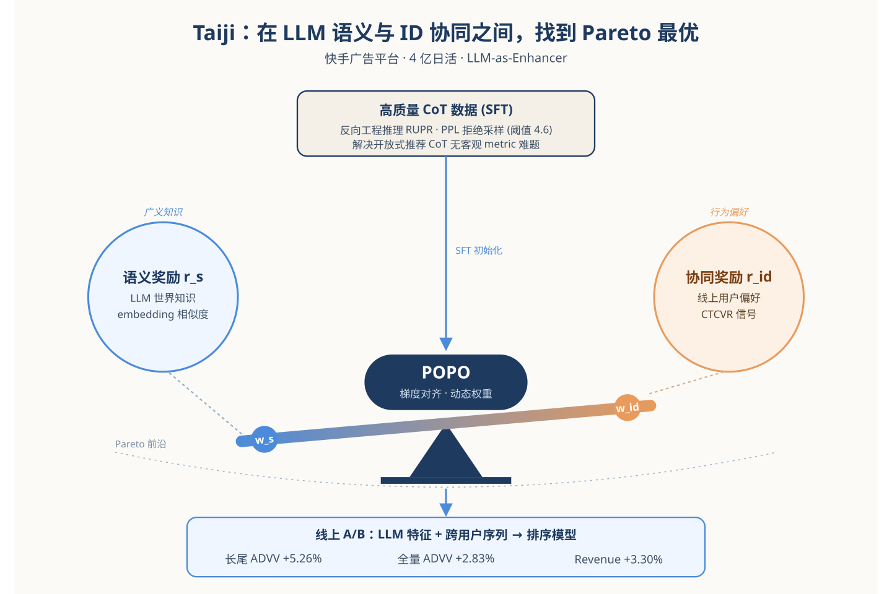
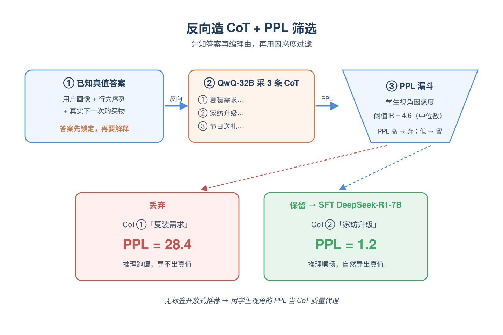
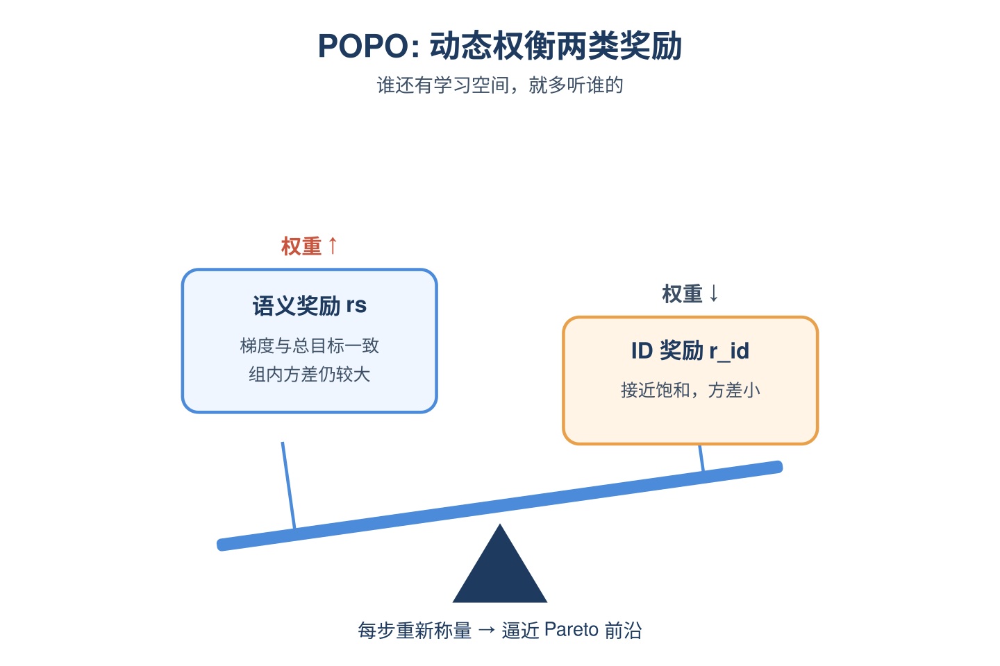
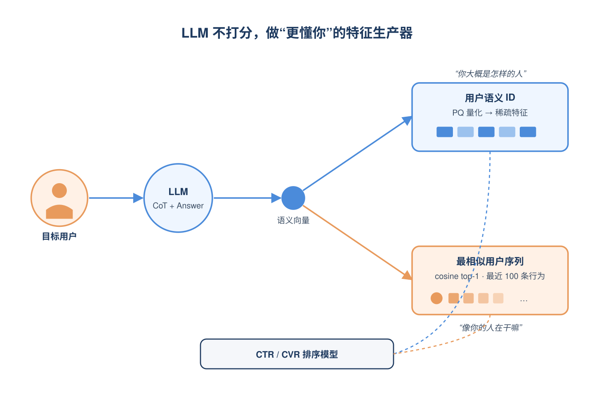
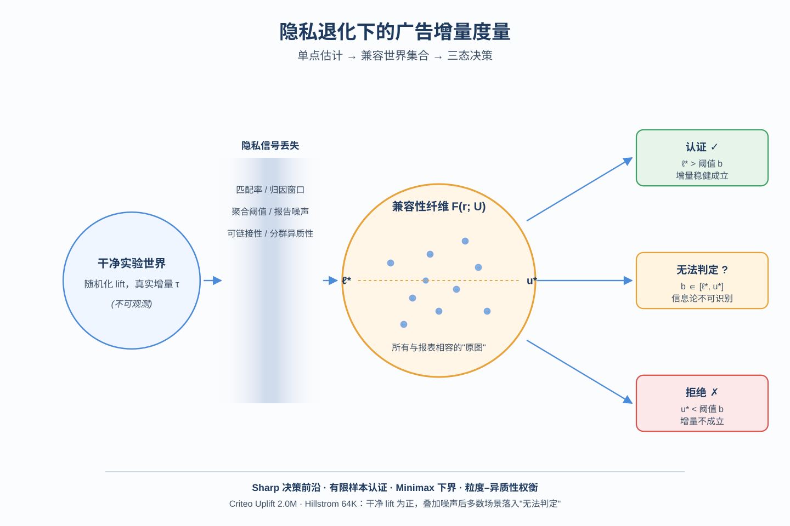
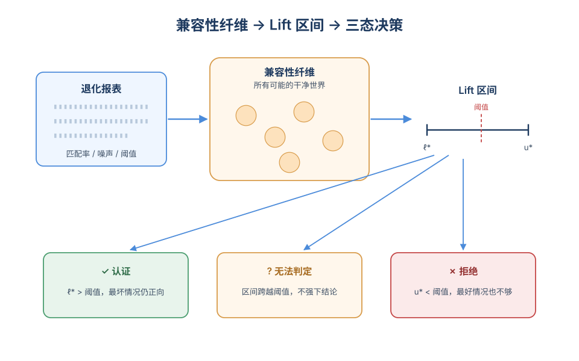
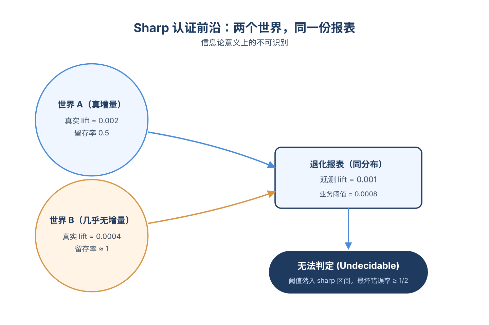
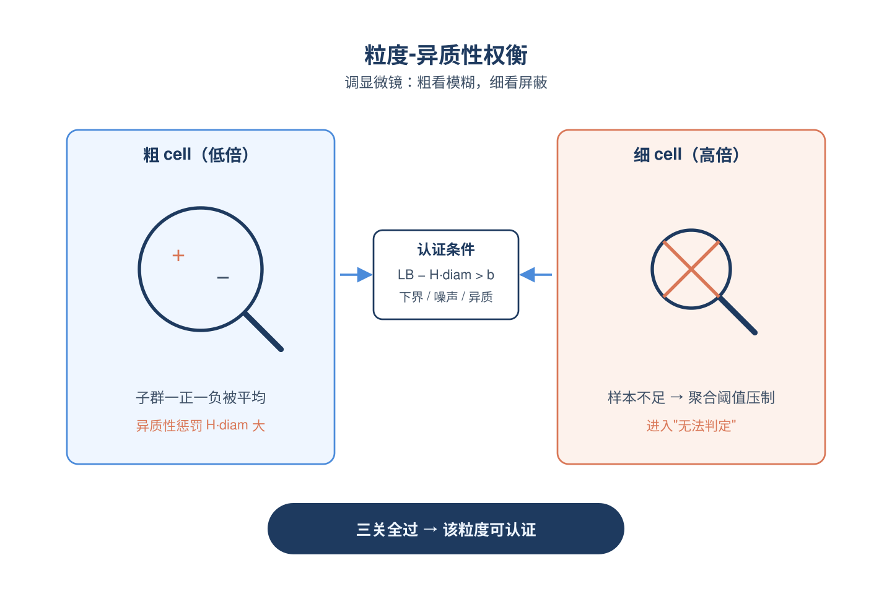
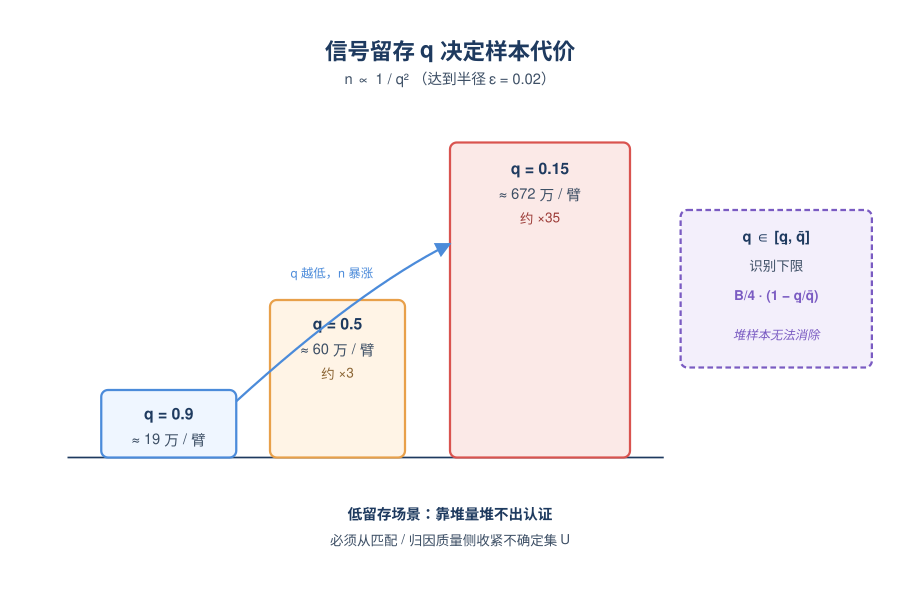

# 2026-06-03 论文日报

## 一、今日趋势与创新观察

### 1. 趋势概况

- 今日全量抓取444篇，cs.AI 275篇与cs.LG 149篇继续占绝对主导，cs.IR仅20篇但其中工业级LLM增强推荐和广告测量论文占比明显高于近几日。
- LLM与语言理解类198篇仍是最大主题，研究重心从纯生成进一步偏向Agent技能选择、重排自评估、惯用语等细粒度语义理解，以及黑盒序列推荐的模型抽取攻防。
- Agent与多智能体97篇延续高位，方向集中在技能图谱、工具协议（如自治科学的Agent-to-Instrument协议）和自演化LLM Agent，与单纯多智能体协作相比更强调结构化技能与外部系统对接。
- 商业化决策与资源优化31篇，覆盖动态定价bandit、资源约束序列定价、广告增量测量、备件检索等场景，呈现把在线学习方法迁移到带预算/审批/隐私约束的真实业务的共同特征。

### 2. 推荐系统 / 排序相关创新点

- 快手Taiji针对LLM4Rec中语义空间与ID空间难以对齐的痛点，把SFT/RL重构为Semantics-IDs权衡的Pareto最优策略优化，已在4亿日活广告系统部署。
- 针对广告隐私化报告下match率、归因窗口、聚合阈值、报告噪声等多重信号衰减，提出隐私鲁棒的增量(lift)测量框架，并在Criteo Uplift数据集系统刻画各类信号损失对衡量精度的影响。
- MARS提出encoder无关的多速率近期性聚合算子，让序列推荐显式建模多尺度时间结构，在稀疏与稠密交互场景下统一替代Transformer位置注意力或SSM单一衰减。

### 3. 全局创新点

- SkillDAG把LLM Agent技能选择从embedding相似度匹配重构为带依赖、冲突、特化关系的类型化有向图，用结构化检索取代纯语义召回，对推荐系统的工具/物料组织也具有方法论参考。
- LAP提出Agent-to-Instrument标准协议，让LLM Agent与异构自驾实验室仪器解耦对接，思路类似把RAG/Tool-Use中Agent与外部系统的接口抽象成可组合协议层。
- “Can LLM Rerankers Predict Their Own Ranking Performance?”系统评估重排器对自身排序质量的自感知能力，为级联排序里的不确定性路由和动态计算分配提供新的评估视角。

### 4. 跨论文综合观察

- Taiji与MARS分别从LLM语义对齐和时间多尺度聚合两个层面攻击工业序列推荐：前者解决跨空间对齐，后者解决用户行为时间结构刻画，合起来反映工业推荐对‘表征+时序’双轴升级的共同诉求。
- 广告增量测量工作和短租动态定价bandit、资源约束序列定价共享同一母题——在隐私、审批、预算等真实约束下做稳健的因果或在线决策，提示商业化决策研究正在从理想假设走向带噪信号与受限可行域。
- SkillDAG、LLM Agent技能路由的两阶段检索基准，以及重排器自评估，三者共同指向一个趋势：检索/排序系统不再被视作纯相似度问题，而是结合结构依赖与自身置信度的可控决策过程。

## 二、今日入选论文

### 1. Taiji: Pareto Optimal Policy Optimization with Semantics-IDs Trade-off for Industrial LLM-Enhanced Recommendation
- 挑选理由：快手广告平台部署的LLM增强推荐框架，直接服务广告业务，4亿日活用户

### 2. Privacy-Robust Incrementality Measurement for Advertising Systems under Signal Loss
- 挑选理由：直接研究广告系统隐私约束下的增量效果(incrementality)测量，覆盖归因窗口、聚合阈值、报告噪声等核心广告衡量问题，并在Criteo Uplift数据集验证。

## 三、重点论文精读

### 1. Taiji: Pareto Optimal Policy Optimization with Semantics-IDs Trade-off for Industrial LLM-Enhanced Recommendation
- **为什么值得看：** 快手广告线上部署的LLM增强框架，给出语义与ID奖励的Pareto动态平衡方案
- **背景：** 把LLM接进推荐/广告系统主流做法是LLM-as-Enhancer：用LLM生成用户/物品语义特征喂给排序模型。但有两个老大难：SFT阶段开放式推荐CoT没有客观metric，常常只能靠老师模型或最终答案对错粗略判断；RL阶段同时存在LLM语义奖励和推荐侧CTCVR奖励，过去都用固定权重相加，难以兼顾两类异质信号。Taiji在快手广告线上落地，既给了CoT数据构造方案，也提出了一个理论上能逼近Pareto前沿的动态加权RL方法，对广告团队复用LLM特征工程很有借鉴意义。

*图示：这是一篇直接落地在快手广告平台、服务4亿日活的LLM-a…*

**核心技术点：**

#### 技术点 1：反向工程造CoT+PPL拒绝采样
- 快速理解：用真实下一次购买当答案反推CoT，再用PPL过滤掉不靠谱的推理链

*图示：开放式推荐没有标准答案，作者干脆作弊：先告诉老师模型用户…*

- 技术细节：数据侧用RUPR：把用户画像、行为序列以及真实的下一次购买物品一起塞给QwQ-32B，让它'反向'解释为什么这个用户会买这个商品，从而拿到答案确定的CoT。然后对每个prompt采样3条CoT，用'在给定CoT条件下生成真实答案的困惑度PPL'作为CoT质量代理，PPL高于阈值R（取样本中位数4.6）的就丢掉，只留下PPL低的那些再去SFT一个DeepSeek-R1-7B。
- 通俗讲解：开放式推荐没有标准答案，作者干脆作弊：先告诉老师模型用户最后买了啥，让它编一段合理的解释当CoT。但老师模型也会瞎编，所以再用学生视角的PPL把它打分——如果一段CoT能让模型很自然地预测出真实购买物品，说明这段推理是顺的；反之就是逻辑跑偏。论文里的例子：同一个用户行为，CoT1把意图猜成'夏装需求'结果真值是床单，PPL=28.4被拒；CoT2猜成'家纺升级'，PPL=1.2被保留。
- 例子：输入：31-40岁内蒙女性、已婚有娃、近期浏览裙子/凉鞋/床单等50件商品；真值答案：一款床裙。RUPR提示QwQ-32B在已知答案条件下生成思路链；采3条，分别算PPL，留下PPL=1.2那条把'家纺升级意图'讲清楚的，作为SFT训练样本里的\<think\>段。

#### 技术点 2：POPO：语义/ID奖励动态加权
- 快速理解：在GRPO里用梯度对齐度动态调LLM语义奖励和CTCVR奖励的权重，逼近Pareto前沿

*图示：直觉是：哪个奖励此刻还有'学习空间'且不和别的奖励打架…*

- 技术细节：RL阶段同时有两个奖励：语义奖励rs（LLM生成答案与真值物品的Qwen3 embedding余弦相似度）和ID协同奖励rid（线上排序模型给出的CTCVR）。POPO不固定权重，而是在每步RL用一个'梯度对齐指标'I-i=该奖励梯度与所有奖励梯度之和的内积，按exp(η·I/μ)做指数化更新并归一化，得到当前步的两路权重。论文证明这等价于一个双层优化的镜像下降近似，平稳点满足Pareto最优条件。考虑工业开销，还给了POPO-light：直接用每组rollout内该奖励的标准差除以均值（变异系数）作为权重，几乎零额外成本。
- 通俗讲解：直觉是：哪个奖励此刻还有'学习空间'且不和别的奖励打架，就多听它的。如果语义奖励的梯度方向和总目标一致、且自身梯度还很大，说明顺着它走能同时把另一个目标也带上去，权重就调高；如果某个奖励已经饱和（组内方差很小）或者和另一个目标顶牛，权重就被自动压下去。一次训练步骤里：先采一组rollout、各自算rs和rid；POPO-light直接看这一组里rs和rid的均值方差算权重；POPO则反传一次拿梯度算内积，再更新权重；最后用加权后的总奖励做GRPO的优势归一化和策略更新。
- 例子：假设某步组内rs方差很小（语义答案都差不多对），rid方差大（CTCVR分数差异明显），POPO-light就会把w-id调大、w-s调小，这一步策略更新主要被CTCVR信号驱动；下一步如果CTCVR信号也饱和了，权重又会回摆。实验里POPO相对固定权重GRPO在Category L3 ACC上+29%，CTCVR也微涨。

#### 技术点 3：近线LLM特征+跨用户序列召回
- 快速理解：把LLM输出做PQ量化成稀疏ID特征，再按embedding相似度召回相似用户行为序列喂排序模型

*图示：LLM不是直接给打分，而是当一个'更懂用户'的特征生产器…*

- 技术细节：线上侧用RL后的LLM对实时用户做近线推理，输出\<think\>CoT\</think\>\<answer\>物品信息\</answer\>。把这段文本用Qwen3-Embedding-0.6B编码后做Product Quantization得到稀疏ID向量，作为'用户的LLM理解'特征塞进广告排序模型。同时用同一embedding做cosine相似度，给目标用户召回top-1相似用户，把相似用户最近100条行为序列拼上来，作为跨用户的协同序列特征。两类特征再和传统特征拼接进CTR/CVR模型。
- 通俗讲解：LLM不是直接给打分，而是当一个'更懂用户'的特征生产器。CoT和answer先变稠密向量，再被PQ切碎成离散ID（方便和传统sparse特征体系对齐），就成了用户画像的一部分；另一方面，向量空间里找到一个最像你的人，把他最近买/看的100个东西也告诉模型，相当于一个语义版的协同过滤。最后排序模型同时拿到'你大概是怎样的人'和'像你的人最近在干嘛'，对长尾用户尤其有用。
- 例子：线上A/B：长尾用户场景下，仅加intra-user量化特征ADVV+2.78%，仅加跨用户序列ADVV+2.48%，叠加后整体ADVV+5.26%、Revenue+5.32%；全量上整体ADVV+2.83%、Revenue+3.30%。

- **对广告的启发：** 广告里用LLM做特征增强时，可以把语义奖励和CTCVR奖励改成动态加权而不是拍脑袋固定权重
- **适用边界：** 方法强依赖一个能给出CTCVR的成熟线上排序模型作为ID奖励来源，冷启动业务或排序模型本身不稳的场景下rid会很噪；另外RUPR要求能拿到真实的'下一次转化'标签做反向蒸馏，对于转化稀疏或长周期归因的广告品类适配性有限。
- **实践建议：** 如果你已经在用GRPO/PPO对齐LLM特征模型，先把固定的语义+业务奖励权重换成POPO-light（按每组rollout的奖励变异系数动态加权），几乎不增加训练成本，可作为一个快速验证Pareto动态平衡是否有效的小实验。

### 2. Privacy-Robust Incrementality Measurement for Advertising Systems under Signal Loss
- **为什么值得看：** 把隐私衰减下的广告增量度量做成可证伪的三态决策框架，直击信号丢失痛点。
- **背景：** 广告增量度量的黄金标准是随机化lift实验，但在隐私保护体系下，平台拿到的是被6类信号丢失（匹配率、可链接性、归因窗口、聚合阈值、报告噪声、分群异质性丢失）污染过的报表，导致点估计经常偏乐观。已有工作要么在做uplift建模，要么在做隐私协议本身，没人系统回答'拿到这种退化报表后，到底哪些增量结论还能站得住'。论文把这个问题形式化为一个鲁棒因果决策问题，并给出可证伪的三态输出（认证/拒绝/无法判定），对广告测量实务非常对口。

*图示：广告平台越来越依赖隐私保护上报（Privacy Sand…*

**核心技术点：**

#### 技术点 1：兼容性纤维与三态决策
- 快速理解：把隐私退化报表反推成所有可能干净世界的集合，再投影到lift上做三态判定。

*图示：直觉上是这样：你看到一份被打了马赛克的报告，论文不去猜原…*

- 技术细节：论文定义'兼容性纤维'：给定观察到的退化报表 r-s 和一个信号丢失机制的不确定集 U，所有能产生该报表的干净实验世界构成一个集合 F-s(r-s; U)。把这个集合通过lift函数投影，得到sharp的下界 ℓ\*-s 和上界 u\*-s。决策规则是：下界高于业务阈值就认证为正向增量，上界低于阈值就拒绝，否则标为'无法判定'，而不是强行给一个数。
- 通俗讲解：直觉上是这样：你看到一份被打了马赛克的报告，论文不去猜原图，而是列出'所有可能的原图集合'，然后看这些原图算出来的lift是不是都在阈值以上。一次推断流程是：拿到退化的实验组/对照组均值变成根据匹配率、归因窗口等参数范围反推干净均值的可能区间变成在这个区间里取最坏情况算lift下界和上界变成比对业务阈值给出三态结论。关键是'无法判定'被当作合法输出，而不是被掩盖。
- 例子：在Criteo数据上干净lift是0.00112，业务阈值0.0005。当可上报留存率q=0.95时，lower bound=0.000905，仍然\>阈值，认证通过；q=0.65时lower bound=0.000499，刚好掉到阈值下，变成'无法判定'；再加上有限样本误差和报告噪声后所有压力测试场景都变成'无法判定'，提示分析师不要在这种报表上下强结论。

#### 技术点 2：Sharp认证前沿定理
- 快速理解：证明落在退化区间内的报表，任何方法都无法可靠区分有无增量。

*图示：可以这样理解：同一份隐私报表，可能是'真有增量+较高留存…*

- 技术细节：Theorem 5.1给出一条sharp前沿：对任意 δ 在 （ℓ-s(U), u-s(U)） 区间内，都存在一个干净实验加一个U中的留存机制能产生同样的退化均值且真实lift恰好等于δ。因此当业务阈值落在区间内时，存在两个真实lift在阈值两侧但产生同分布报表的世界，任何二元决策器最坏错误率至少1/2。这把'无法判定'从工程妥协升级成信息论意义上的不可识别。
- 通俗讲解：可以这样理解：同一份隐私报表，可能是'真有增量+较高留存率'造出来的，也可能是'没增量+较低留存率'造出来的，两种世界从外面看完全一样。所以任何算法只要只看这份退化报表，都没办法分辨它属于哪一边。论文不是说'我们做不到'，而是说'谁都做不到'，这给了产品和合规一个硬性的信息边界。
- 例子：假设两个候选世界：世界A真实lift=0.002，留存率0.5；世界B真实lift=0.0004，留存率接近1。两者最终都报出退化lift=0.001。如果业务阈值是0.0008，那么没有任何统计方法能仅凭这份报表区分A、B，论文要求此时必须返回'无法判定'，而不是基于点估计去认证。

#### 技术点 3：粒度-异质性权衡
- 快速理解：粗分群少噪声但藏异质性，细分群暴露异质却触发聚合阈值压制。

*图示：可以想成调显微镜倍数：调低（粗cell）画面亮但细节糊…*

- 技术细节：论文为每个报告cell引入Lipschitz型异质性惩罚项 H·diam(g)：cell越大直径越大，cell内子分群效果越可能偏离均值。一个cell安全认证的条件是 LB-g(α; U) - H·diam(g) \> b-g。实证上H·diam(g)用嵌套的细cell效果与父cell加权均值的最大偏差来估计，从数据里直接量出来；同时小cell触发聚合阈值m压制，进入'无法判定'。
- 通俗讲解：可以想成调显微镜倍数：调低（粗cell）画面亮但细节糊，可能两个子群一正一负被平均掉；调高（细cell）细节清楚但亮度不够，很多cell因人数太少被聚合服务直接屏蔽。论文要求在每个粒度同时检查三件事：lift下界、报告噪声放大、组内异质性惩罚，三关都过才允许在这个粒度认证。
- 例子：Hillstrom在最粗分组下100% cell通过总体认证，分到很细（channel×zip×history×recency）后只剩36%能认证，同时39.5%的cell因样本不足被聚合阈值压制。这直接告诉运营：在这份隐私报告上做精细化人群结论是不可靠的，应回退到更粗的报告粒度。

#### 技术点 4：样本量与minimax下界
- 快速理解：留存率q越低，所需样本以1/q²膨胀，且存在无法靠样本消除的识别下限。

*图示：通俗说：隐私丢一半信号≈样本量需要乘4；只剩两成≈乘25…*

- 技术细节：Proposition 5.2给出有限样本半径Rad-n，包含 B/(q-min)·√(log\|C\|/n) 的随机化项和 σ-ξ/(q-min·n) 的报告噪声项；要把半径压到ε，所需样本约为 B²/(q-min²·ε²)·log\|C\|。Theorem 5.3给出minimax下界：在退化观测下任何估计器误差至少 c·B/√(qn)，且当q只知道在（q̲, q̄）之间时，即使无限样本仍存在 B/4·(1-q̲/q̄) 的识别下限。
- 通俗讲解：通俗说：隐私丢一半信号≈样本量需要乘4；只剩两成≈乘25。这个膨胀不是工程估算而是有理论下界保证。更扎心的是，如果你连'到底丢了多少'都说不准（留存率只知道一个区间），那再多样本也消不掉这块识别误差，必须从测量系统侧把不确定集U本身收紧。
- 例子：想把半径压到0.02：q-min=0.9时每臂约19万样本就够；q-min=0.5时需要约60万；q-min=0.15时需要672万。如果想要更精细的0.005半径，q-min=0.15就要1亿+样本。这给广告测量同学一个清醒的结论：在低留存场景靠堆量是堆不出认证的，必须改善匹配/归因质量。

- **对广告的启发：** 给广告增量度量加一层'拒绝下结论'的护栏，避免在隐私退化报表上误判ROI。
- **适用边界：** 适用前提是有真随机化实验且能合理界定信号丢失参数范围；如果U被低估或者实验本身存在干扰/合规偏差，认证仍可能失效。在低留存、稀疏转化、细分群场景下大概率只会输出'无法判定'，框架本身不会变出信息。
- **实践建议：** 可以先在自家lift平台上挂一层'认证检查'：用真实匹配率、归因窗口留存、聚合服务噪声方差作为U，对每个增量结论同时计算下界和上界，把跨阈值的结论统一打成'无法判定'再给业务方，看一眼当前有多少历史lift结论其实经不起这层检验。
