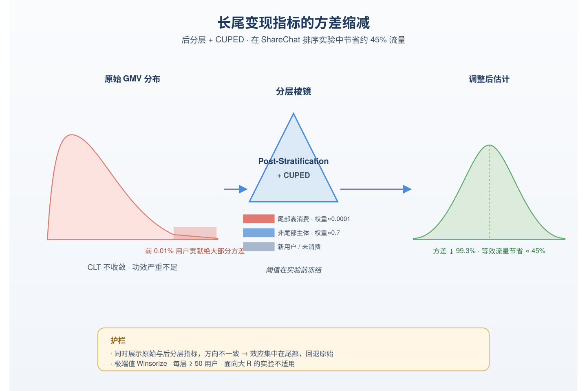
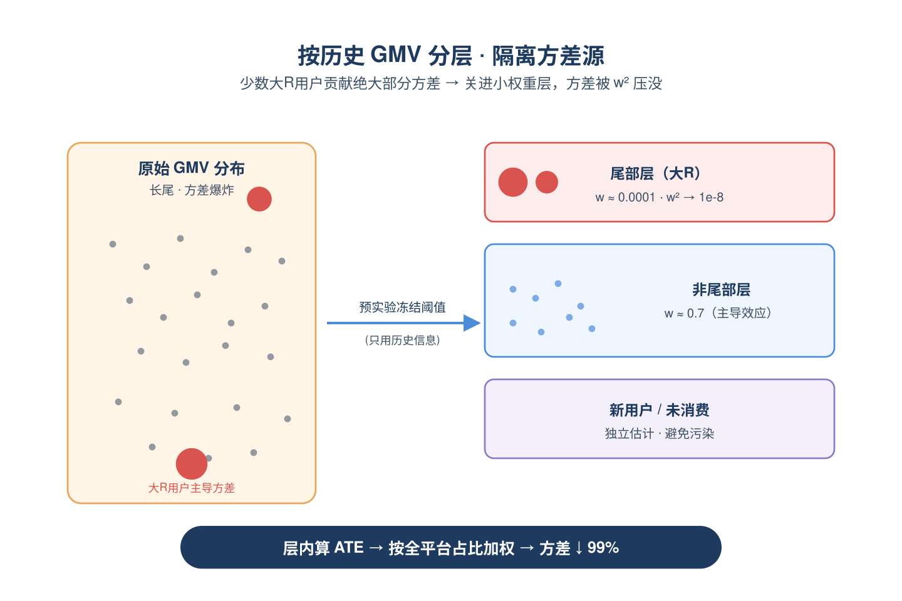
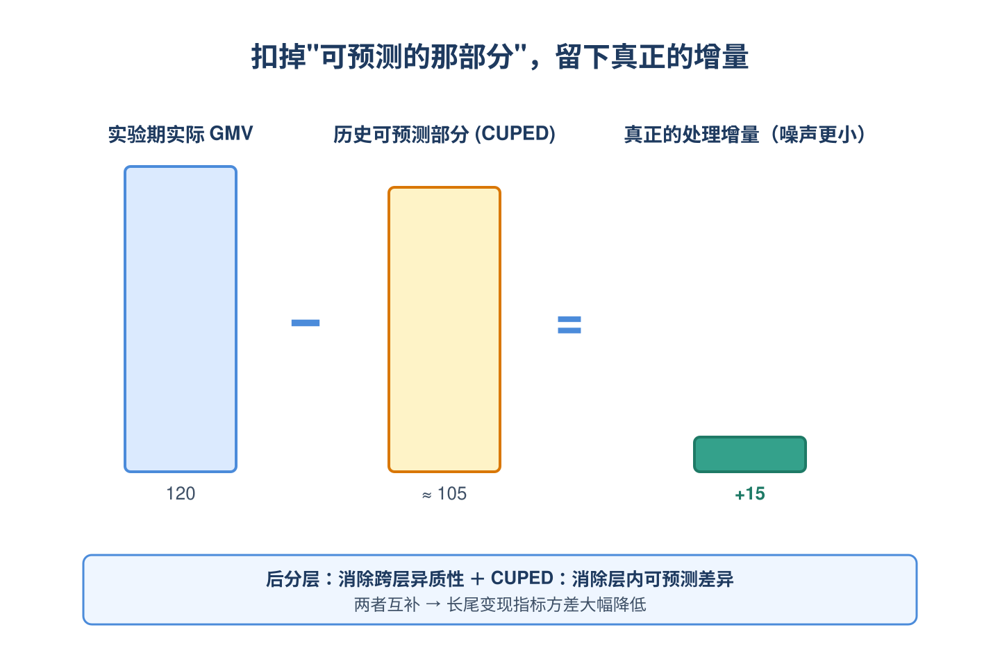
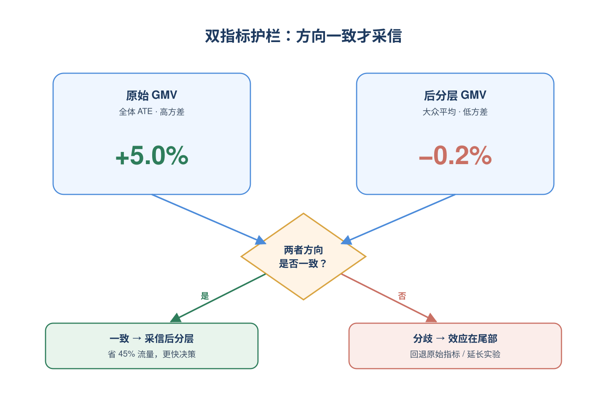
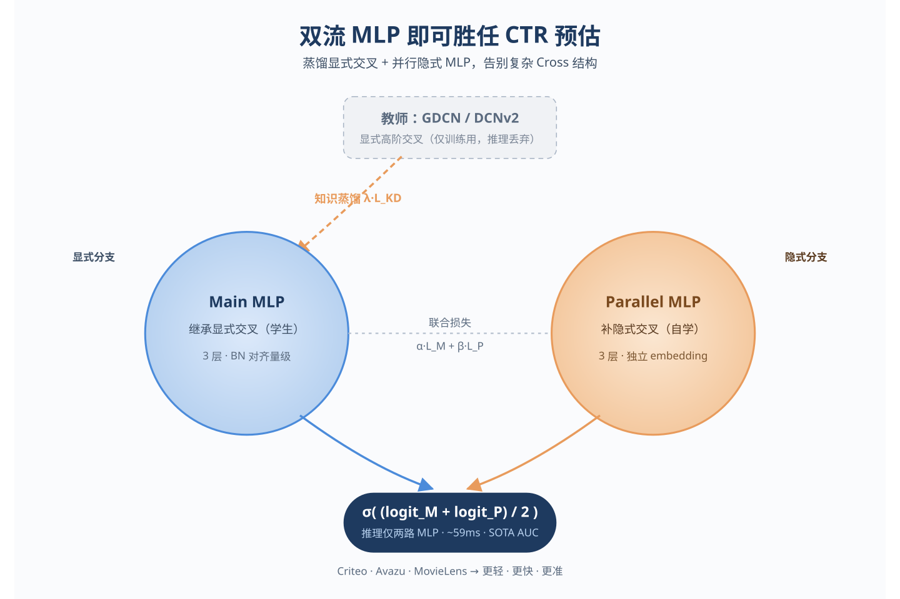
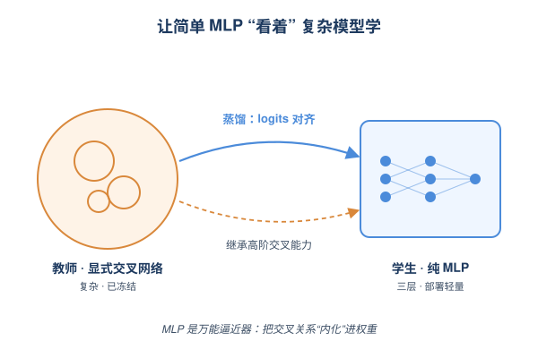
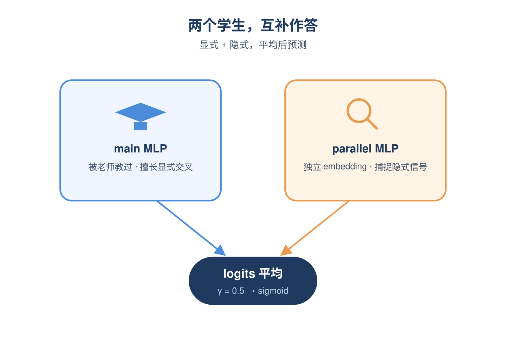
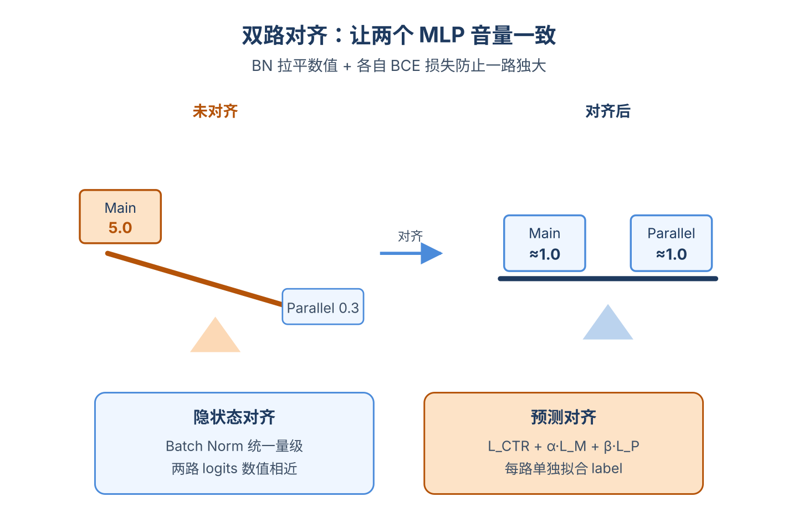
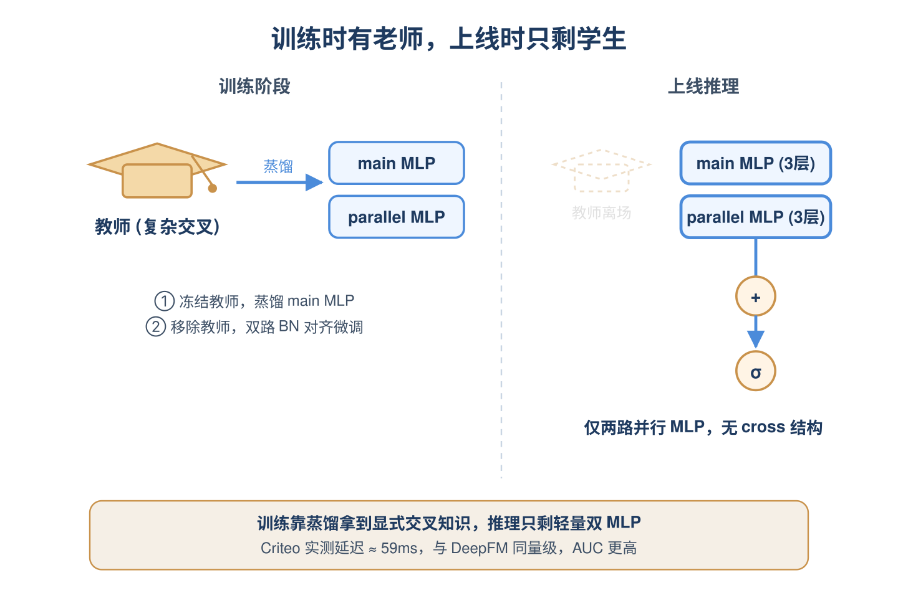

# 2026-06-04 论文日报

## 一、今日趋势与创新观察

### 1. 趋势概况

- 今日全量抓取365篇，cs.AI 199篇与cs.LG 139篇延续主导，cs.IR仅27篇但其中CTR预估、电商语义ID与排序实验方差缩减等工业级议题密度明显上升。
- LLM与语言理解类68篇仍是最大主题，研究重心从生成转向证据置信度估计、对话搜索的高效蒸馏以及面向LLM个性化的紧凑用户表征。
- Agent与多智能体类49篇显著抬头，议题集中在Agent交互协议声明式规范、Agentic RAG的级联幻觉检测以及记忆投毒等安全侧问题。
- 表示学习与检索排序方向31篇，分布式近邻检索的不确定性建模、碳约束重排和离散语义ID为代表的新切口同时出现。

### 2. 推荐系统 / 排序相关创新点

- Variance Reduction for Heavy-Tailed Monetization Metrics把Post-Stratification引入排序实验，针对变现指标的重尾分布做方差缩减，直接服务广告A/B测试可信度。
- Dual-Stream MLP for CTR Prediction用纯双流MLP结构替代复杂特征交互模块，挑战了广告排序里"必须用交叉网络"的隐性假设。
- DSIRM通过Query桥接的离散语义ID来做电商相关性建模，把生成式语义ID的思路从召回扩展到相关性判别侧。

### 3. 全局创新点

- EviRank在LLM-based Ranking中引入基于证据的置信度估计，把"为什么这条排前面"以可量化方式纳入打分。
- Distributional Approximate Nearest Neighbour Search把ANN从点估计扩展为分布近似，让向量检索天然带上不确定性信号。
- CHARM框架首次系统刻画Agentic RAG中的级联幻觉传播，并给出检测与缓解通路，对多步Agent链路调试有方法论价值。

### 4. 跨论文综合观察

- EviRank、Distributional ANN与CHARM从不同层面在解同一件事——给检索/排序/Agent链路注入"不确定性与证据"信号，反映出今日排序与检索研究正从"更准"转向"更可信"。
- DSIRM的离散语义ID、SAILRec的双侧语义对齐协同嵌入与Beyond Retrieval的紧凑用户表征共同指向：把LLM能力压进推荐侧的关键是表征结构化，而不是直接让LLM在线推断。
- Variance Reduction for Monetization Metrics和Dual-Stream MLP代表广告侧两个互补方向：一个让线上实验测得准，一个让线上模型跑得轻，方法论上一个偏统计、一个偏结构，但都在回应"工业排序系统降本增效"的同一压力。

## 二、今日入选论文

### 1. Variance Reduction for Heavy-Tailed Monetization Metrics in Ranking Experiments via Post-Stratification
- 挑选理由：排序实验中变现指标的方差缩减，直接服务于广告/商业化A/B测试。

### 2. Dual-Stream MLP is All You Need for CTR Prediction
- 挑选理由：CTR预估直接相关于广告排序核心

## 三、补充关注

1. **Trading Engagement for Sustainability: Carbon-Aware Re-ranking for E-commerce Recommendations**
   - 理由：电商重排序，引入碳约束作为多目标，与商业化重排有一定同构性

## 四、重点论文精读

### 1. Variance Reduction for Heavy-Tailed Monetization Metrics in Ranking Experiments via Post-Stratification
- **为什么值得看：** 广告变现A/B测试方差大、样本不够用，这篇给出可落地的方差缩减方案
- **背景：** 排序和推荐系统的线上A/B实验越来越关注变现指标（如GMV、广告收入、创作者打赏），但这类指标极度长尾——前0.01%的用户贡献大部分方差，导致中心极限定理在5%-20%流量下都不收敛，z统计量分布偏离正态，假阳性率只有1-2.6%（看似保守，其实是严重欠功效，根本检测不出真实效果）。单纯延长实验或加大流量也救不回来，已有的CUPED只能减约48%方差，仍不够用。论文提出在生产环境结合后分层（post-stratification）和CUPED来解决这个长期痛点。

*图示：广告/变现指标长尾严重，A/B实验经常因为方差太大检测不…*

**核心技术点：**

#### 技术点 1：用历史GMV做后分层
- 快速理解：按实验前30天GMV把用户切成尾部/非尾部/新用户三层，分层估计再加权回总体

*图示：直觉是：方差几乎全被极少数大R用户贡献，把他们单独关到一…*

- 技术细节：用实验前30天的人均GMV把用户分成几个互不相交的层（尾部高消费、非尾部、新用户/未消费）。在每一层内单独算处理效应，再用'整个平台用户在该层的占比'作为权重加权汇总，得到后分层ATE估计。关键约束是分层阈值必须在看实验结果之前就冻结，且只能用预实验信息，否则会引入偏差。
- 通俗讲解：直觉是：方差几乎全被极少数大R用户贡献，把他们单独关到一个权重极小的层里，他们的方差贡献会被权重的平方放缩——比如尾部层占比0.0001，乘平方后就是1e-8，几乎被压没。一次实验流程是：先离线跑预期GMV分布、定阈值；实验中收集每个用户GMV；按预先冻结的层归类；层内算处理-对照差；再按全平台层占比加权得到最终效应。
- 例子：比如一个排序实验有100万用户，按预期30天GMV把前0.01%（约100人）划为尾部层，其余分为非尾部和新用户层。某次实验中尾部层处理-对照差很大但权重只有0.0001，非尾部层差异较小但权重0.7，最终加权后总效应主要由非尾部层主导，方差从原始GMV减少99.3%，10%流量下可检测最小效应从原来的136%均值降到约10%。

#### 技术点 2：层内再叠加CUPED
- 快速理解：每层内再用预实验GMV做协变量调整，进一步消掉可预测的波动

*图示：可以理解成：同一层内用户虽然相对同质，但仍有人天生消费高…*

- 技术细节：在每个层内部，对实验期GMV减去一个回归项：协方差(GMV, 中心化预实验GMV)除以预实验GMV方差，再乘以中心化的预实验GMV。这相当于用历史消费水平作为协变量做线性回归调整，把那部分'本来就能从历史预测出来'的差异从指标里扣掉，剩下的才是处理真正带来的增量。
- 通俗讲解：可以理解成：同一层内用户虽然相对同质，但仍有人天生消费高一点。CUPED就是先用历史GMV预测一下他实验期'应该'消费多少，再看实际消费比预期高还是低，用这个偏离量来评估处理效应，噪声更小。后分层负责干掉跨层的巨大异质性，CUPED负责干掉层内的可预测异质性，两者互补。
- 例子：比如非尾部层里A用户预期GMV=100，实际处理组下=120，扣掉历史可预测部分后调整值可能是+15；B用户预期=10、实际=12，调整值是+1.5。直接平均会被A的绝对值主导，CUPED调整后两人的'真实处理增量'被更公平地比较，方差进一步降低。

#### 技术点 3：生产部署与护栏
- 快速理解：用Winsorize、阈值冻结、最小层人数、双指标并列等机制防止滥用与p-hacking

*图示：因为后分层把尾部用户权重压得很低，估计的目标其实变成了'…*

- 技术细节：实操中：(1)对超过99.999分位的极端值做Winsorize（通常只影响\<5个用户）作为数据管道异常的兜底；(2)分层阈值在实验开始前冻结，禁止事后调整；(3)每层最少50个用户，否则结果作废；(4)同时展示原始GMV和后分层GMV，如果两者方向不一致，提示效应集中在尾部用户。论文还报告了实证Type-I误差从原始的1-2.6%升到6.1%（略高于名义5%），但用Type-II误差大幅下降换来的，且换算成等效流量节省约45%。
- 通俗讲解：因为后分层把尾部用户权重压得很低，估计的目标其实变成了'对大众用户的平均效应'，而不是真正的全体ATE。所以如果一个实验本来就是为大R用户设计的（比如VIP特权、面向大额打赏的功能），用后分层会系统性低估它的价值，论文明确不推荐。这就是为什么必须把原始指标和后分层指标都摆出来，让实验owner自己看方向是否一致。
- 例子：比如一个针对头部打赏用户的VIP排序实验，原始GMV显示+5%、后分层GMV显示-0.2%，方向相反。这种情况下系统会提醒：效应集中在尾部，后分层不适用，应回退到原始指标或延长实验。反之一般排序实验两者方向一致时，可放心用后分层指标做更快决策。

- **对广告的启发：** 广告A/B平台可直接复用，少花一半流量得到同等置信度
- **适用边界：** 适用于'结果异质性可由预实验协变量较好预测'的场景，对新用户主导、无历史数据、或处理效应集中在尾部用户（如VIP/大客户专属功能）的实验不适用；分层阈值需提前冻结，否则会引入p-hacking风险。
- **实践建议：** 可以先在自家广告A/B平台上对一个长尾变现指标（如人均广告收入或转化金额）跑一遍A/A仿真，对比原始、CUPED、CUPED+后分层三种方案的方差缩减比和等效流量节省，验证收益后作为默认指标上线，并同时保留原始指标用于方向一致性检查。

### 2. Dual-Stream MLP is All You Need for CTR Prediction
- **为什么值得看：** 用蒸馏+双MLP替代复杂交叉网络，效果好且推理轻
- **背景：** CTR模型主流做法是显式交叉模块（如FM、Cross Network）加一个MLP做隐式交叉，最后两路相加。但作者指出两个老问题：一是显式高阶交叉用Hadamard积，输出数值随阶数指数级放大，会盖过MLP那一路，导致隐式分支几乎不起作用；二是显式模块结构复杂，参数难调、部署不友好。论文要回答的是：能不能只用纯MLP，既学到显式交叉又保留隐式交叉，同时部署上更轻？

*图示：CTR预估是广告排序核心。这篇论文提出用纯MLP替代xD…*

**核心技术点：**

#### 技术点 1：用蒸馏让MLP学显式交叉
- 快速理解：把GDCN等强教师的高阶交叉知识蒸馏到一个三层MLP里

*图示：直觉上是：复杂交叉网络其实就是一个特定形状的函数，MLP…*

- 技术细节：选一个强力的双流CTR模型（论文里默认用GDCN，也可换DCNv2、FinalMLP）作为教师，固定其参数；学生是一个三层MLP（main MLP），训练目标是CTR的二分类交叉熵加上一项蒸馏损失，蒸馏损失对教师和学生的logits做带温度的对齐，权重由超参λ控制。论文还从理论上用通用逼近定理和Sobolev插值不等式论证，只要MLP够宽，不仅能拟合教师输出，还能在二阶混合偏导（即特征间交互强度）上逼近教师，从而'继承'显式交叉的能力。
- 通俗讲解：直觉上是：复杂交叉网络其实就是一个特定形状的函数，MLP理论上能逼近任何连续函数，那只要让MLP'看着'教师的输出来学，它就能把交叉关系内化进权重里。具体一次前向就是：一个样本进来，教师输出一个CTR概率，学生MLP也输出一个，loss既要逼近真实label，也要逼近教师概率，反向传播后学生的隐层逐渐学到类似交叉网络的特征敏感模式。
- 例子：比如Criteo一条样本有39个field，教师GDCN通过多层gated cross输出点击概率0.23，学生三层MLP一开始输出0.5；蒸馏损失逼着学生输出靠近0.23，同时CTR loss逼着它接近真实label 0/1，训练完后学生单独对这条样本也能给出接近0.23的预测，且对'广告位×品类'这种二阶交叉的敏感度（混合偏导）和教师接近。

#### 技术点 2：并行MLP补隐式交叉
- 快速理解：蒸馏后的main MLP偏向显式交叉，再加一个并行MLP专门学隐式交叉

*图示：可以理解成：main MLP是被'老师手把手教过'的学生…*

- 技术细节：作者发现教师本身就有'显式压过隐式'的问题，所以蒸馏出来的main MLP也主要继承了显式那一路。为了补回隐式信号，又加一个结构相同的parallel MLP，它不复用教师的embedding，从零学自己的特征向量，最终预测是两路logits取平均后再过sigmoid（实现里γ=0.5）。两路MLP结构一样，但训练信号、embedding都独立，扮演显式和隐式两个互补角色。
- 通俗讲解：可以理解成：main MLP是被'老师手把手教过'的学生，擅长复刻老师那套显式交叉；parallel MLP是个'自学生'，从原始特征自己摸索，更容易抓到老师没强调的隐式模式。最后预测时把两人答案平均，相当于一个考试小组互补。
- 例子：比如一个用户在Avazu上点广告，main MLP基于蒸馏来的显式交叉给出logit=1.2（强调'设备类型×广告位'这种组合），parallel MLP从自己的embedding学到这个用户最近活跃时段的隐式偏好给出logit=0.4，最终(1.2+0.4)/2=0.8过sigmoid得到约0.69的点击率。

#### 技术点 3：双路对齐避免一路独大
- 快速理解：用BN对齐隐层数值范围，再各自加CTR监督避免某一路被淹没

*图示：如果不做对齐，一路输出可能动辄几十、另一路只有零点几，平…*

- 技术细节：对齐分两层：隐状态对齐用batch normalization，把两个MLP每层输出归一化到相近的均值方差，使logits数值范围接近，防止一路输出暴涨吃掉另一路；预测对齐则在fine-tune阶段额外加两个BCE损失L-M和L-P，分别让main MLP和parallel MLP的单独输出都能拟合真实label，最终目标函数是L-CTR + αL-M + βL-P，α、β控制对齐强度（典型值0.6~1.5）。
- 通俗讲解：如果不做对齐，一路输出可能动辄几十、另一路只有零点几，平均下来等于只听一路。BN把数值拉回相近量级，相当于让两个人说话音量一样大；再用各自的CTR loss让两路都对最终任务负责，避免某一路'摆烂'只跟着另一路走。
- 例子：训练某个batch时，main MLP原始logit可能是5.0，parallel MLP是0.3，加BN后都被压到约1.0量级；同时L-P要求parallel MLP单独预测也要接近真实label，迫使它认真学，不会因为main MLP已经预测得不错就退化成噪声。

#### 技术点 4：两阶段训练流程
- 快速理解：先蒸馏再fine-tune，最终上线只是两个并排的小MLP

*图示：可以类比成：先让学生跟着名师学一遍（蒸馏），再让两个学生…*

- 技术细节：训练分两段：第一段冻结教师，用L-CTR + λL-KD训练main MLP（parallel MLP也参与前向但还没专门对齐）；第二段抛开教师，开启BN对齐和预测对齐损失L-CTR + αL-M + βL-P，联合微调两路MLP。上线推理时只保留两个三层MLP并行计算，再相加过sigmoid，没有任何复杂cross结构。
- 通俗讲解：可以类比成：先让学生跟着名师学一遍（蒸馏），再让两个学生组队互相校准（fine-tune），考试时老师就不出现了，只有这两个轻量学生上场。所以推理图非常简单，只是两个MLP前向。
- 例子：在Criteo上，main MLP宽度600、parallel MLP宽度跟教师MLP一致；阶段一用GDCN当教师跑若干epoch；阶段二去掉教师，加BN和双路BCE再跑若干epoch；上线时一次推理就两个小MLP，论文实测延迟约59ms，和DeepFM量级相当但AUC更高。

- **对广告的启发：** 在广告精排里用蒸馏把复杂交叉模型压成纯MLP，可显著降延迟保效果
- **适用边界：** 适用场景假设特征field数量在数十到几十、可以训练强教师的离线环境；如果在线特征极其稀疏或field数百以上，main MLP宽度可能不够装下教师的二阶交叉信息。另外方法对超参（λ、α、β、学生宽度）较敏感，不同教师和数据集最优配置差异大，需要逐场景调。
- **实践建议：** 可以拿现网最强的精排模型当教师，离线蒸馏一个三层MLP+并行MLP的学生，加上BN对齐和双路BCE，先在离线集对比AUC和延迟，再考虑上线灰度——能用就直接换掉复杂交叉结构。
