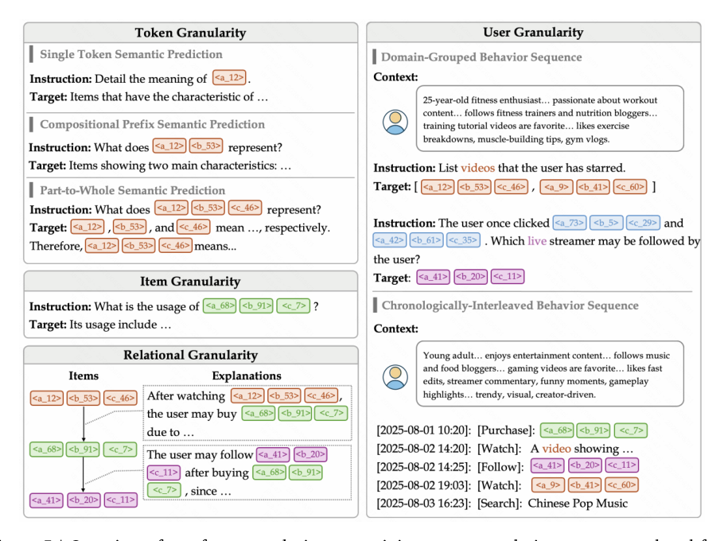
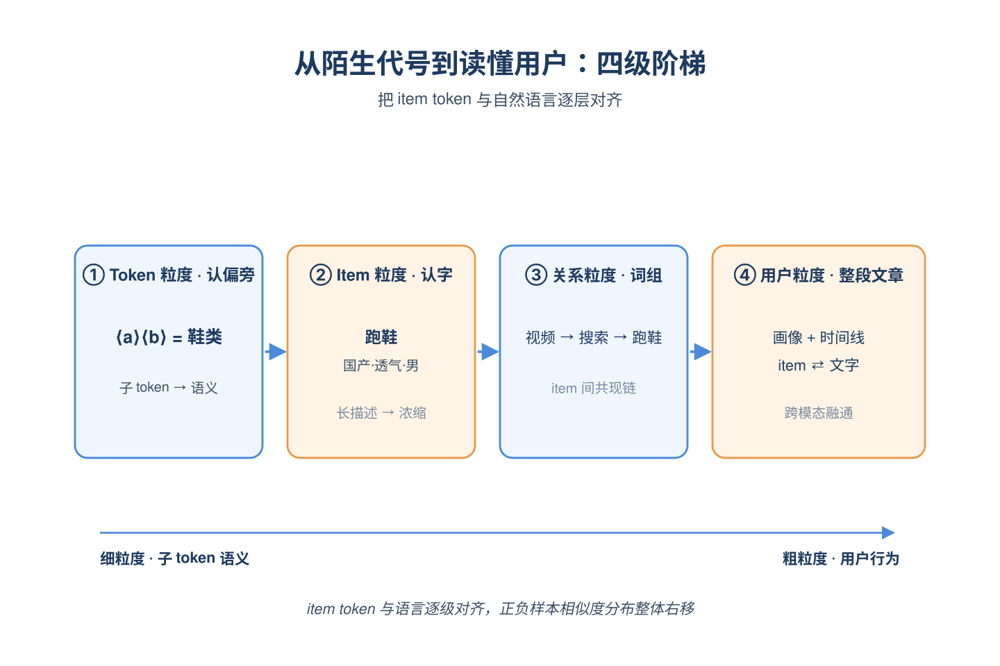
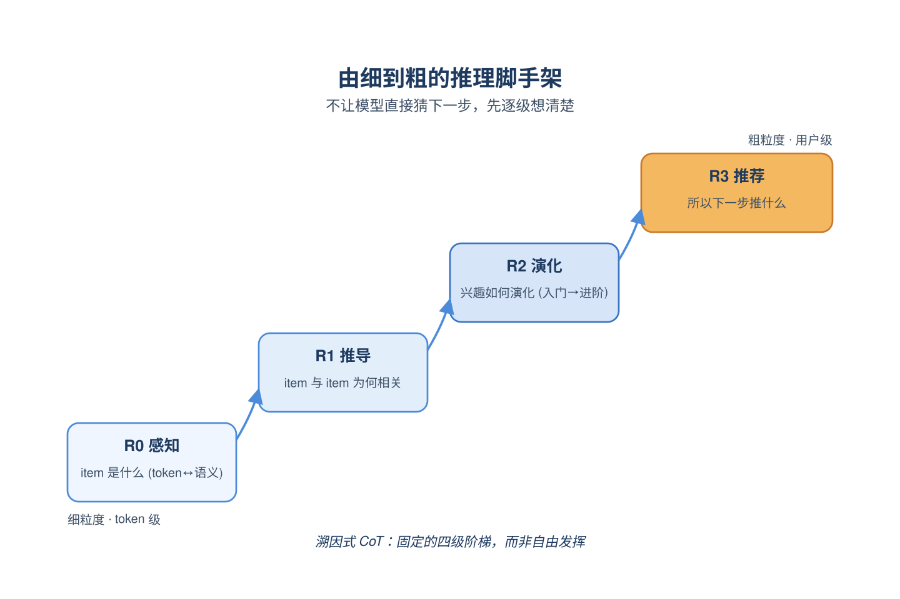
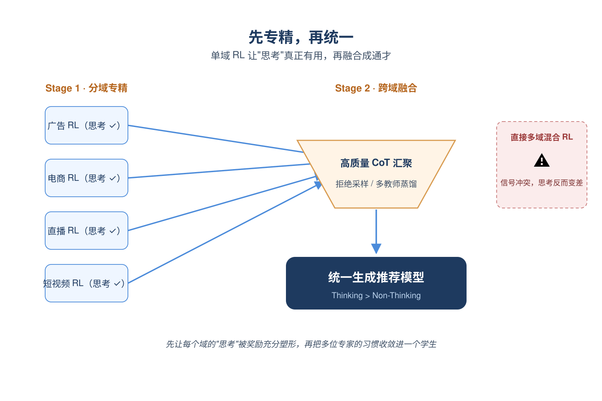
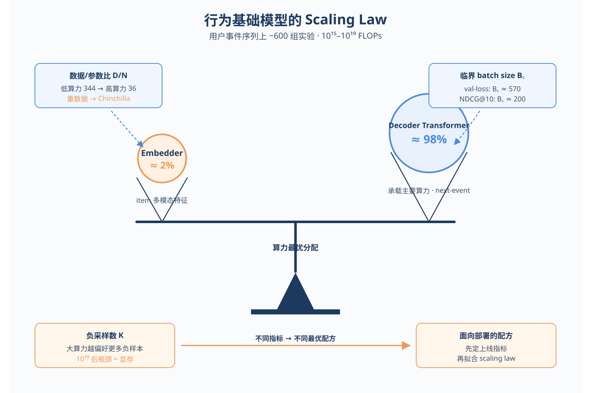
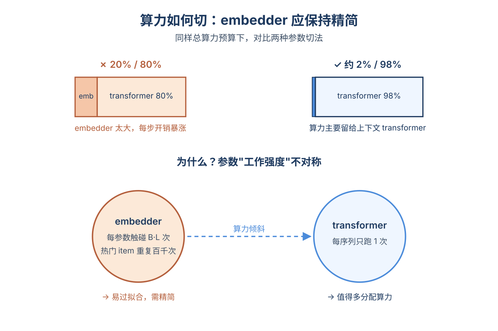
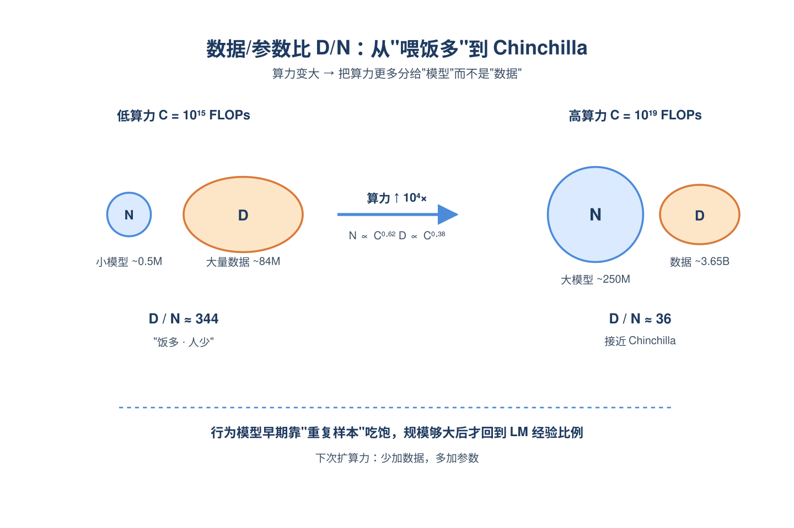
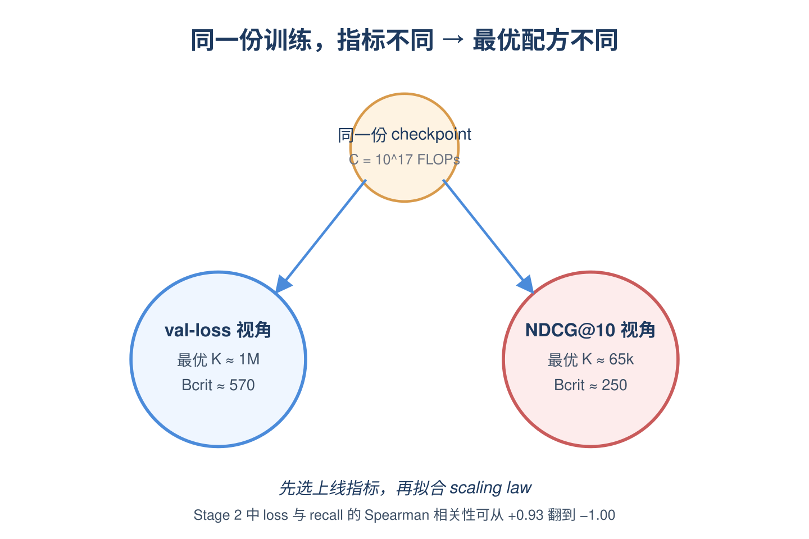
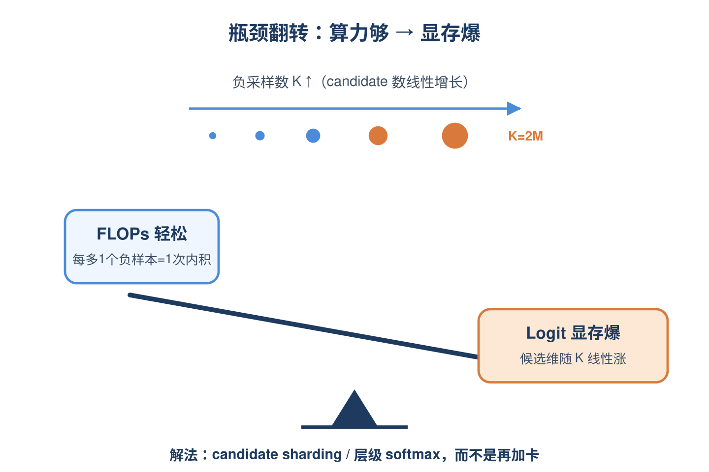

# 2026-06-05 论文日报

## 一、今日趋势与创新观察

### 1. 趋势概况

- 今日全量抓取433篇，cs.AI与cs.LG继续主导，cs.IR仅18篇但工业级冷启动召回与生成式推荐推理增强类论文密度仍可观。
- LLM与语言理解186篇为最大主题，研究重心从纯生成进一步向Agent长程记忆、RAG自适应编排、上下文压缩等系统化议题倾斜。
- 表示学习与检索排序135篇，今日明显聚焦图结构（超图、非对称图、曲率建模）与会话级记忆图，弱化了纯Embedding相似度范式。
- Agent与多智能体97篇显著抬升，出现Agent噪声生成去噪推荐、熵评测、反事实信用分配等将Agent方法回灌推荐与评测的尝试。

### 2. 推荐系统 / 排序相关创新点

- 快手OneReason尝试在已部署于广告与电商的OneRec生成式推荐家族上激活推理能力，把LLM式reasoning训练范式迁移到大规模商业化召排链路。
- Behavioral Foundation Model首次系统给出用户事件序列双塔架构（事件Embedder+序列骨干）的compute-scaling law，对推荐/支付/反欺诈等大规模行为建模提供算力标定方法。
- Tubi生产环境提出非对称图架构桥接语义与协同信号，专门处理新内容无交互历史的冷启动召回，并以Agentic噪声生成框架（ANCHOR）反向构造监督信号做隐式反馈去噪。

### 3. 全局创新点

- TokenMizer提出图结构会话记忆来管理超过最大有效上下文窗口的长程任务历史，把架构决策、任务切换等结构化信息以图节点形式组织，替代滑窗与摘要式压缩。
- Policy-Conditioned Counterfactual Credit针对长程语言Agent的虚假证据链与捷径行为，用策略条件反事实信用分配把过程奖励从相关性提升为可验证的因果信号。
- Google提出基于熵的轻量Agent评测框架，用行为熵刻画探索程度、重复刚性、工具使用效率与不确定性收敛速度，超越传统任务成功率/延迟/成本指标。

### 4. 跨论文综合观察

- OneReason、Behavioral Scaling Laws与冷启动非对称图三篇共同指向同一问题：把LLM/基础模型的scaling与reasoning范式系统化迁移到推荐召排，分别从推理能力、算力标定、图结构表征三个层面切入。
- ANCHOR（Agentic去噪推荐）、Entropy-Based Agent评测、Counterfactual Credit三篇共享一个方法论趋势——把Agent建模与评测工具反向用于推荐数据清洗与训练信号设计，而不只是端到端任务执行。
- TokenMizer的图结构会话记忆与冷启动非对称图、Edge-Aware Curvature图建模在表征层面形成共振：今日多篇工作不约而同放弃纯向量相似度，转向显式图/超图结构来承载长程或稀疏交互信息。

## 二、今日入选论文

### 1. OneReason Technical Report
- 挑选理由：快手OneRec家族生成式推荐模型已部署在广告、电商等场景，本文研究推理能力增强，对商业化生成式推荐链路有强参考价值

### 2. Scaling Laws for Behavioral Foundation Models over User Event Sequences
- 挑选理由：用户行为序列基础模型的scaling law研究，覆盖推荐/支付/欺诈/商业等场景，与广告排序大规模建模高度同构

## 三、补充关注

1. **Statistically Reliable LLM-Based Ranking Evaluation via Prediction-Powered Inference**
   - 理由：ESCI电商benchmark，A/B测试日销售提升，对排序系统评估方法学有借鉴意义，但非广告核心

## 四、重点论文精读

### 1. OneReason Technical Report
- **为什么值得看：** 快手OneRec家族继续放大招，把'思考再回答'范式真正落地到生成式推荐
- **背景：** OneRec这类生成式推荐模型已经在短视频、直播、广告、电商上线，享受到了规模化红利，但作者发现直接照搬LLM的'先思考再回答'范式并不work——加了思考链反而不如不思考。他们借鉴多模态LLM的经验，认为问题出在两点：item token和语言语义没对齐(感知差)，以及推荐CoT本身不像数学题那样有唯一推导路径(认知结构差)。这篇技术报告系统给出了感知+认知两条腿的训练方案，对想做生成式广告推荐的团队是难得的实战参考

*图示：该图是Figure 5，展示了OneReason的四粒度…*

**核心技术点：**

#### 技术点 1：四粒度预训练对齐item token
- 快速理解：把item token和文本语义按token-item-关系-用户四层逐步对齐，解决感知地基

*图示：可以理解成教模型认字的四步阶梯：先认偏旁(子token)…*

- 技术细节：item用RQ-KMeans量化成3层codebook共3个子token，加一个域开始token(video/prod/ad/living)。预训练语料按四个粒度组织：token粒度(让模型学会两个子token前缀合起来代表什么语义、再从子token拼到整item语义)、item粒度(把过长caption做容量感知的粗粒化，只留3个子token撑得住的类目品牌卖点，再加多视角QA)、关系粒度(用搜后买、TagNex协同对、行为窗口共现构造item→文字解释→item的interleave序列)、用户粒度(把用户画像LLM改写成自然语言，再以多轮QA或时间线交错形式接item序列)。作者用正负样本相似度margin证明这套语料让跨模态对齐分布整体右移。
- 通俗讲解：可以理解成教模型认字的四步阶梯：先认偏旁(子token)，再认完整字(item)，再学词组搭配(item间关系)，最后读整段文章(用户行为序列)。每一层都同时给item token和自然语言，让模型把a-5028 b-6733 c-2559这种代号慢慢和'年轻女性、运动鞋、国产品牌'这类语义挂钩。
- 例子：比如一个跑鞋商品被量化成\<\|prod-begin\|\>\<a-5028\>\<b-6733\>\<c-2559\>，token粒度任务会问'\<a-5028\>\<b-6733\>合起来表示什么'，让模型答'运动品类下的鞋类'；item粒度会把原本带价格、型号、OCR的长caption裁成'国产运动跑鞋, 年轻男性, 透气'；关系粒度会喂'看完某跑步视频→搜索→买这双鞋'的链路；用户粒度则把这个商品放进该用户跨域时间线里，并随机把部分item换成文字caption，逼模型在统一序列里融通两种模态。

#### 技术点 2：R0-R3认知增强CoT格式
- 快速理解：把推荐CoT拆成感知-推导-演化-推荐四级，避免乱想和过度思考

*图示：直觉上就是不让模型一上来就猜'下一个看什么'，而是先逼它…*

- 技术细节：作者强调推荐推理是abductive(溯因)而非deductive，没有唯一答案，所以要规定CoT结构。SFT阶段按四级组织：R0感知(给item生成描述、根据描述找item、item QA)、R1推导(item2item，根据一个item选出有常识关联的另一个item)、R2演化(给历史和兴趣主题，挑出相关行为/生成兴趣演化链)、R3推荐(给用户画像+跨域历史，预测下一个item)。每一级都有对应输入输出和评测指标(LLM-as-Judge、Accuracy、F1、Action-Logic Score、Pass@K/Recall@K)，构成OneReason-Bench。
- 通俗讲解：直觉上就是不让模型一上来就猜'下一个看什么'，而是先逼它说清'这个item是啥→这两个item为啥相关→这个用户的兴趣是怎么演化的→所以现在该推什么'。这样CoT就不是自由发挥，而是一条粗到细的固定推理脚手架，减少幻觉和瞎编。
- 例子：比如用户历史里有跑鞋、跑步手表、能量胶。R0先让模型把这些item token翻译成文字描述；R1让它说'跑鞋和能量胶都属于跑步装备'；R2让它输出兴趣演化链'最近三个月从入门跑步→开始关注配速→准备半马'；R3再基于这个推理链，输出下一步该推的压缩袜或半马报名课程的item token。

#### 技术点 3：specialize-then-unify强化学习
- 快速理解：先单域RL把思考模式喂强，再用拒采或多教师蒸馏统一跨域

*图示：可以类比成先让一个人专门练广告投放，练到广告里思考有用了…*

- 技术细节：作者发现一个反直觉现象：在多域混合RL下思考模式反而不如非思考，但限定单域RL时思考模式稳定胜出。于是采用先专精后统一的两阶段策略：第一阶段对短视频、广告、直播、电商等域分别做面向推荐的RL，让每个域的思考能力被充分释放；第二阶段再用拒绝采样微调(只保留高质量CoT样本)或多教师on-policy蒸馏(让一个学生模型同时模仿各域专家的思考行为)做跨域融合。最终8B模型在多个真实业务benchmark上让thinking模式首次稳定超过non-thinking。
- 通俗讲解：可以类比成先让一个人专门练广告投放，练到广告里思考有用了，再让他练电商；如果一开始就同时练四个域，思考反而被各种相互冲突的信号搞乱。专精阶段保证'思考真的有用'，统一阶段再把多个专家的好习惯合到一个通用模型里。
- 例子：比如广告域单独RL时，模型学到'先识别用户最近在看母婴内容→推断处于备孕/育儿阶段→选择奶粉广告'这种思考链能稳定带来奖励提升；然后从广告专家、电商专家、直播专家各采一批高分CoT轨迹，让统一模型在on-policy蒸馏中模仿它们，最终一个模型在四个域都能思考且不退化。报告还观察到：即便最后只用非思考模式推断，用CoT数据训练过的版本在若干域也比纯无CoT训练强，说明思考监督的信号会渗透进直接decoding。

- **对广告的启发：** 生成式广告召回可借鉴：先把creative ID和文案语义对齐，再用结构化CoT和单域RL释放思考收益
- **适用边界：** 方法依赖快手级别的多域行为数据和高质量caption改写，且思考模式上线主要靠监督信号迁移到非思考decoding，论文自己也指出现有证据是行为层面的，无法区分收益来自压缩、推理还是两者交互；在缺少跨域行为或item语义稀薄(如纯ID广告)的场景，感知对齐这一步可能直接失败。
- **实践建议：** 如果在做生成式广告召回，可以先小规模试一个事：把现有item语义ID训练语料按'token-item-关系-用户'四层重组，并构造一份R0-R3式的SFT评测集，用来量化感知和认知短板，再决定是否上CoT和单域RL。

### 2. Scaling Laws for Behavioral Foundation Models over User Event Sequences
- **为什么值得看：** 首个用户行为序列基础模型的scaling law系统研究，直接对应广告大模型选型
- **背景：** 推荐、支付、欺诈、电商等场景越来越多用基础模型建模用户行为序列，但和语言模型不同，没有对应的scaling law来指导算力怎么分。论文研究的是行业里常见的两段式结构：特征embedder把每个多模态商品打成向量，再喂给decoder-only transformer做next-event预测。作者跑了约600组实验、覆盖10^15到10^19 FLOPs，联合扫描embedder参数占比、临界batch size、模型/数据分配、frozen后负采样数四个部署相关的轴，回答的是‘已经在训这套架构的工程师下次该怎么配’。

*图示：这篇论文把语言模型的scaling law研究范式整体迁…*

**核心技术点：**

#### 技术点 1：embedder应该很小：约2%参数
- 快速理解：跨四个量级算力，最优embedder占比稳定在约2%，远小于直觉

*图示：直觉是：embedder每个参数的‘工作强度’远高于tr…*

- 技术细节：作者在固定D/N≈15的Chinchilla线上扫描embedder占比s从0%到50%，每个(C,s)单元用iso-FLOP两项拟合：一项是上下文器‘饿死’惩罚a·s α，一项是embedder‘饿死’惩罚b·s (-β)，闭式最优s\*=(bβ/aα) (1/(α+β))。四个算力档位拟合出来s\*都在1.1%-3.7%之间，几乎不随算力变。原因是两不对称：embedder每步要跑B·L个短序列（每参数被触碰次数远多于上下文器），且热门item在训练里被重复几百到几千次，embedder暴露在重度重复数据下，更容易过拟合。
- 通俗讲解：直觉是：embedder每个参数的‘工作强度’远高于transformer，因为它要给batch里每条序列的每个item都跑一遍，而transformer对一条256长度的序列只跑一次。把更多参数塞给embedder，每步开销暴涨且容易把热门item背下来，所以最优解是让embedder保持精简，把算力主要留给上下文transformer。
- 例子：比如总算力预算给定后，把网络分成2%参数的embedder + 98%参数的transformer，会比6%/94%或20%/80%的分法在validation loss、recall@10、NDCG@10上都更好；而把embedder压到0.5%以下又开始变差，因为item特征压不下去了。

#### 技术点 2：数据/参数比从重数据走向Chinchilla
- 快速理解：低算力时D/N≈340远比文本重数据，高算力时降到36接近Chinchilla

*图示：可以这么理解：行为数据里热门item被反复看到，模型小的…*

- 技术细节：作者用Hoffmann Approach 2，对每个算力档拟合关于log N的iso-FLOP抛物线，取顶点作为最优(N\*,D\*)。结果是N\*∝C 0.617，D\*∝C 0.383，D/N从10 15 FLOPs时的344单调降到10 19时的36。即低算力下行为模型应该‘多喂数据，模型小一点’，到大算力时才接近文本LM的D/N≈20经验。换不同评估指标（recall@10、NDCG@10、coverage@10）拟合出的N指数都在0.57-0.66之间，scaling law本身比较稳健。
- 通俗讲解：可以这么理解：行为数据里热门item被反复看到，模型小的时候吃更多样本能持续受益；模型一旦做大，单纯增加重复数据收益递减，就要把更多算力转去扩参数。所以早期是‘饭多人少’，到后期才回到‘人多饭多’的Chinchilla节奏。
- 例子：在C=10 15 FLOPs时建议训一个约0.5M参数、喂84M event token的模型；到C=10 19 FLOPs时则建议训约250M参数、喂3.65B token，参数侧暴涨7个量级而数据只涨40多倍，D/N从~340降到~15-36。

#### 技术点 3：评估指标也是scaling law的一部分
- 快速理解：训练用的sampled loss和上线排序指标在临界batch、最优负采样数上分歧明显

*图示：意思是：你拿哪个指标当目标，最优配方就不一样。同一份训练…*

- 技术细节：作者发现Bcrit在val-loss和recall@10上都接近570，但NDCG@10、MRR@10这种位置加权指标只有200-275就饱和了；frozen后负采样最优K，loss类指标偏好更多负样本（β≈1.2），ranking类指标则在K属于（125k, 870k）之间且β≈0.4-0.56。更微妙的是Stage 2里val-loss和recall@10的Spearman相关性会随算力从+0.93翻到-1.00。机制上：sampled softmax的最优解是p(y\|h)/q(y)，只有当负采样接近均匀（K足够大）才逼近真实条件分布，因此训练loss和全库排序指标天然有偏。
- 通俗讲解：意思是：你拿哪个指标当目标，最优配方就不一样。同一份训练曲线，看cross-entropy时2048的batch还有效率、看NDCG@10时1024就饱和了；同一份checkpoint，看loss觉得多采负样本更好，看NDCG又觉得够了就行。所以应该先决定上线指标，再去拟合scaling law，而不是反过来。
- 例子：在C=10 17 FLOPs下，按val-loss选最优负采样K是1M，按recall@10选只要65k；如果工程师按训练loss调参就会多花一个量级的candidate内存，但线上recall几乎没差别。

#### 技术点 4：大算力下负采样变成内存问题
- 快速理解：C=10^19时所有指标在K=2M仍在涨，瓶颈从FLOPs转成candidate内存

*图示：frozen embedder之后训练只更新transf…*

- 技术细节：Stage 2在embedder冻结后扫K属于(0,16k,...,2M)，用iso-FLOP的‘starvation+sampling-bias’模型拟合。低算力时拟合出最优K在低十万量级；但到10 19 FLOPs时，所有headline指标在K=2M边界都还在改善，最优点跑到扫描范围外，瓶颈变成softmax logit的candidate-axis显存占用而不是算力。
- 通俗讲解：frozen embedder之后训练只更新transformer，每多采一个负样本只是多算一个内积，FLOPs增长慢；但logit矩阵显存随K线性涨。当算力足够大、参数也大时，单步算力够用，反而是显存先爆。所以这时候要靠candidate sharding、checkpointing或层级softmax这类显存工程，而不是再加卡。
- 例子：在C=10 18时K封顶在大约10 6还能正常训；到10 19时K=2M时显存已经吃紧但指标还没饱和，再往上推就需要把candidate按shard切到不同卡上算logit。

- **对广告的启发：** 广告基础模型可直接借鉴：item塔做小、按上线指标定配方、负采样后期是显存问题
- **适用边界：** 结论建立在single-stack、单一零售序列数据、固定序列长度256、几乎无embedder正则的条件下；架构网格也没做完整的5D扫描（share×宽×深×embedder深×LR），且Stage 1评估是batch-local而非全库，绝对loss不可跨预算直接比较。
- **实践建议：** 下次训广告序列基础模型时，先固定上线指标（比如GAUC或topK recall），再按本文经验把item embedder压到约2%参数、用接近最大可承受的batch、低算力档多喂数据，并把frozen后负采样的candidate内存提前规划好。
