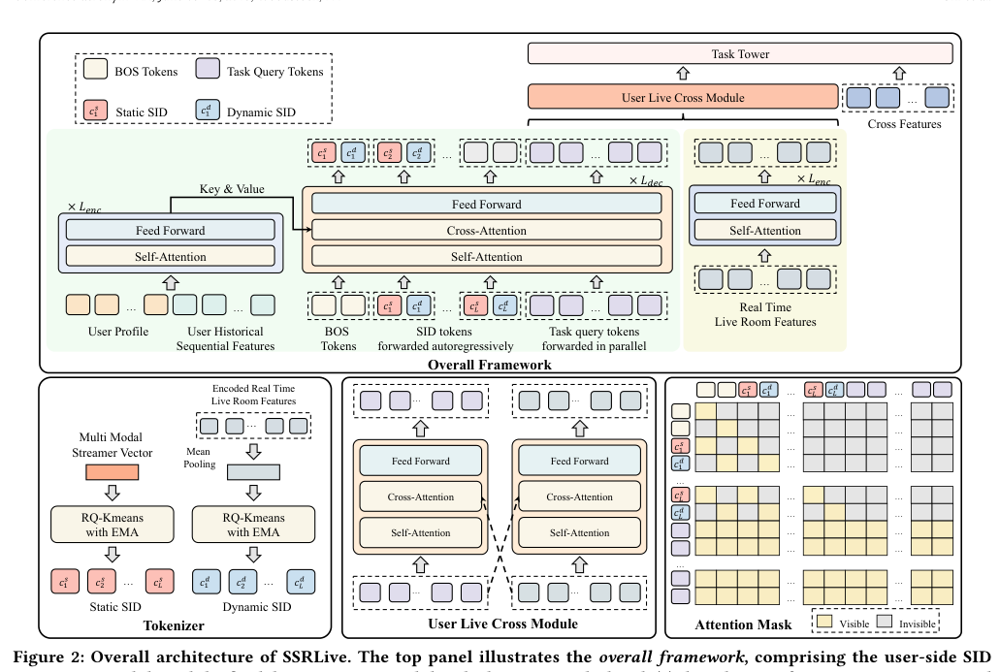
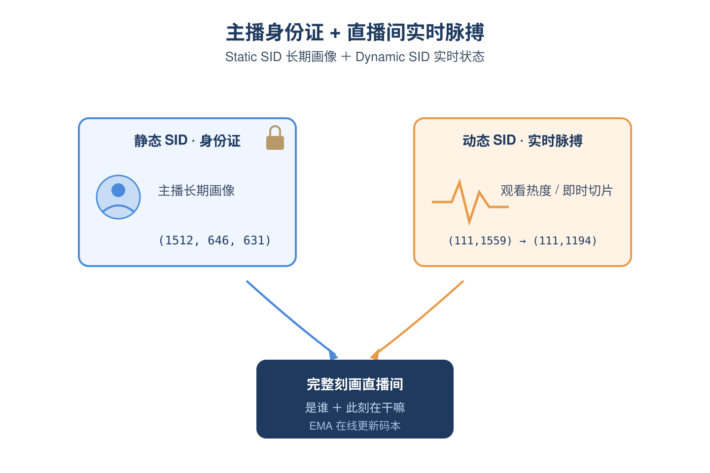
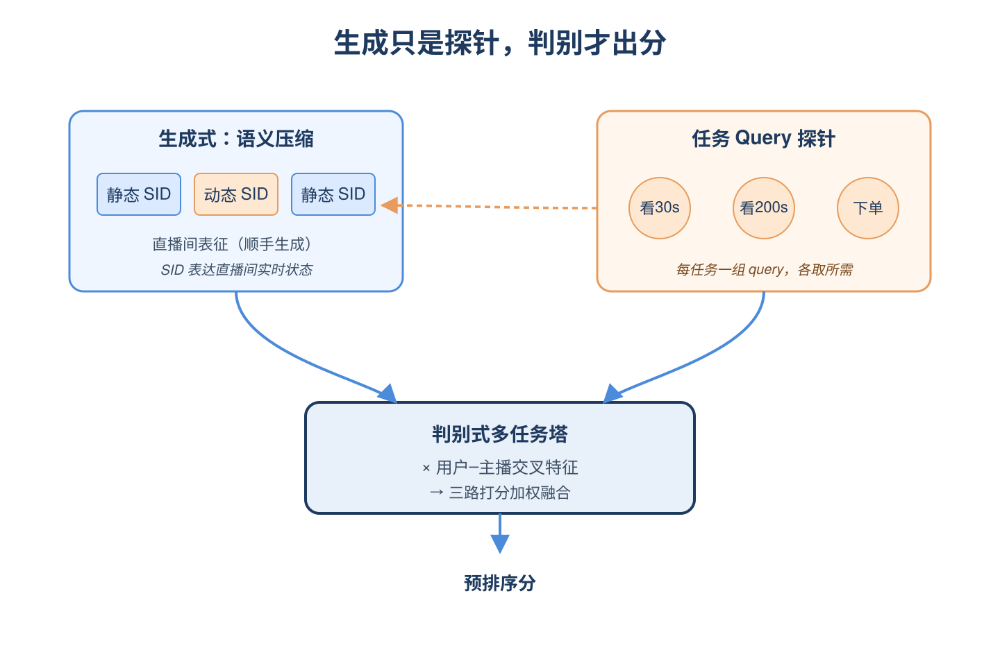
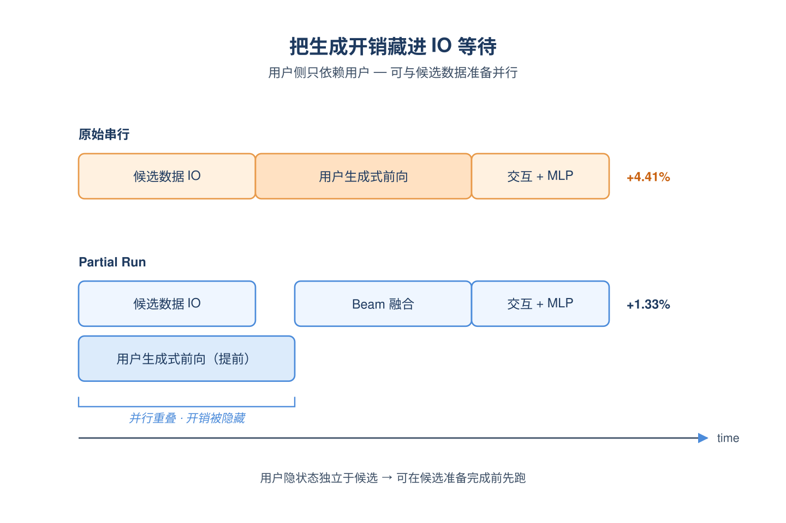
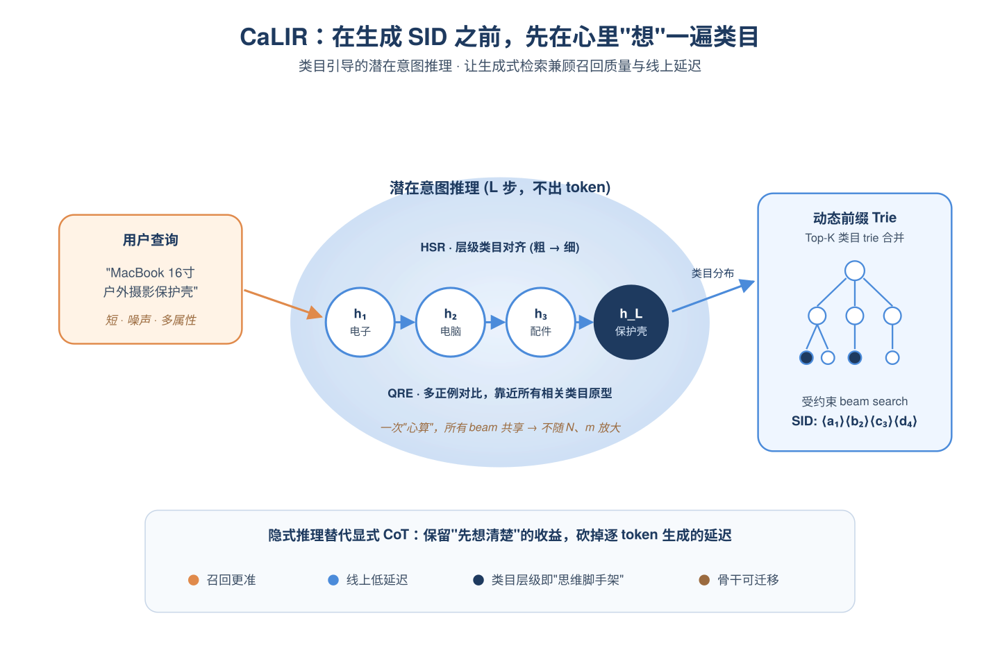
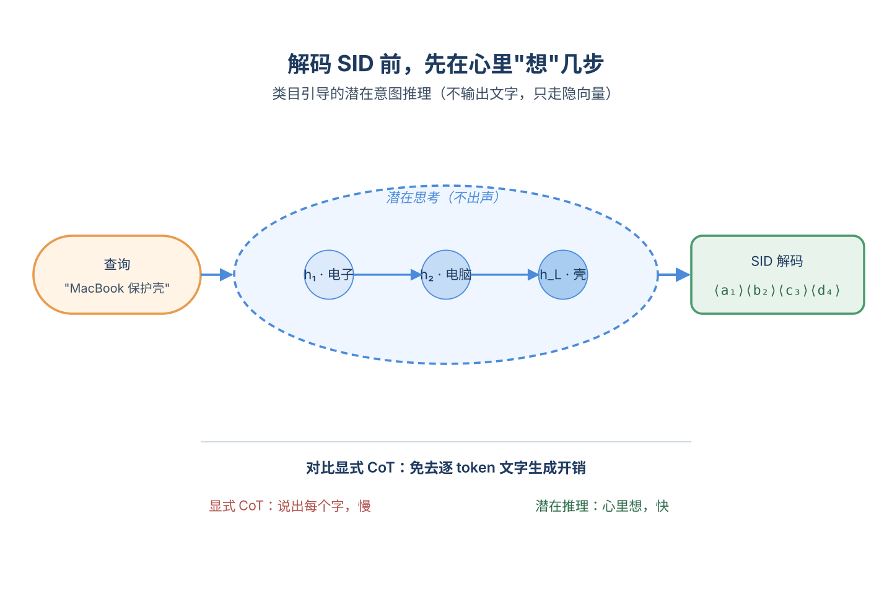
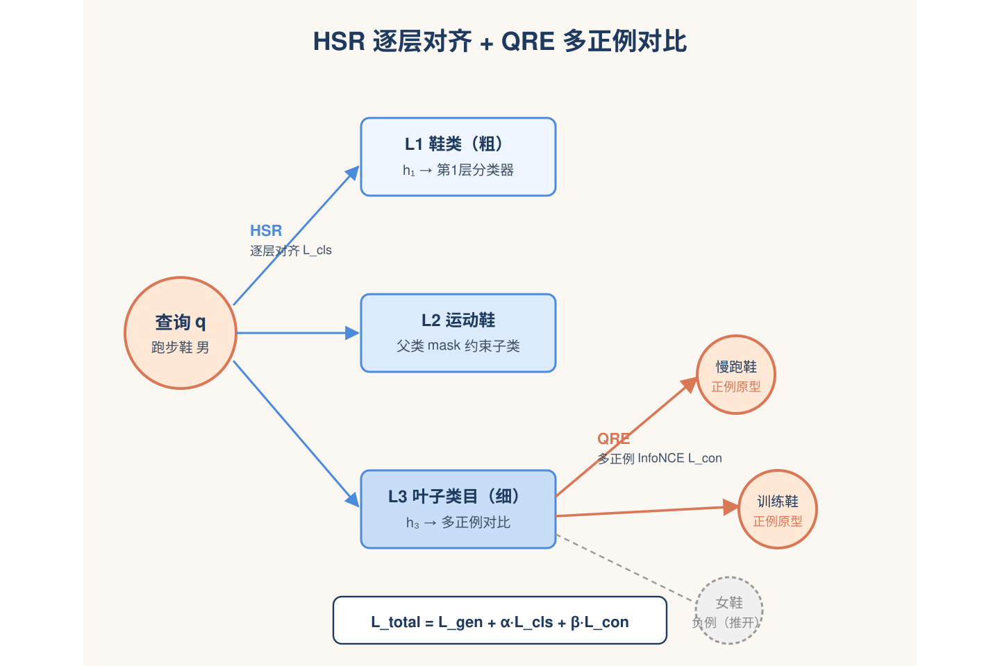
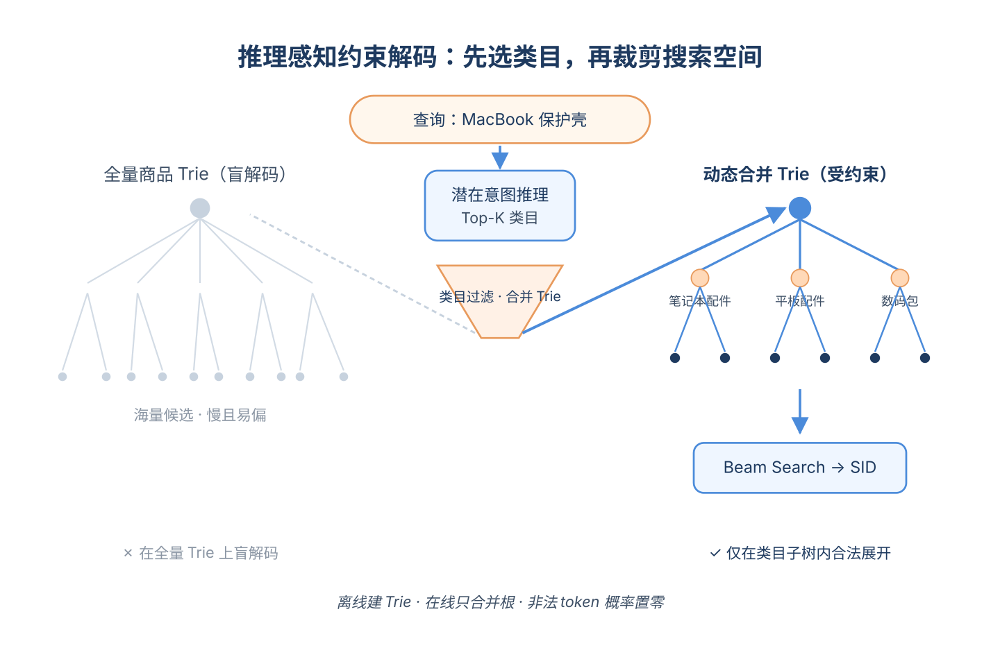
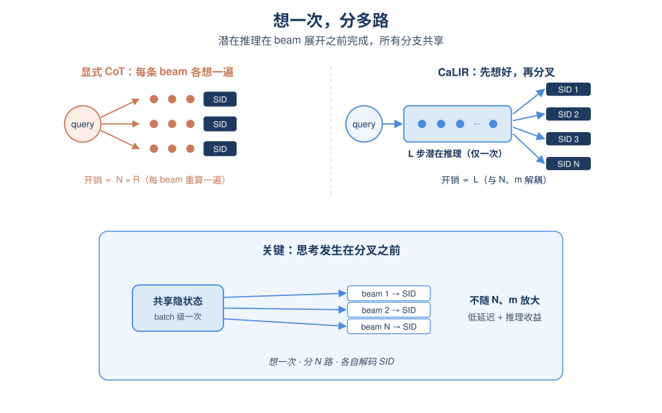

# 2026-06-08 论文日报

## 一、今日趋势与创新观察

### 1. 趋势概况

- 今日全量抓取291篇，cs.AI 161篇与cs.LG 113篇延续主导，cs.IR仅17篇但其中电商生成式检索、直播推荐与多业务线冷启动等工业级议题密度明显抬升。
- LLM与语言理解类109篇仍是最大主题，研究重心从单纯生成转向超图证据组织、多跳RAG、长上下文token压缩以及生成式检索的语义ID稳定性。
- Agent与多智能体类50篇明显抬头，议题集中在工具注册表压缩、过程性记忆、层次化图记忆以及拜占庭安全的多Agent协作原语。
- 迁移学习与跨域泛化47篇，工业侧关注多业务线（grocery/retail）行为孤岛桥接、类目引导的潜在意图迁移以及碳足迹这类稀疏标签下的Pareto重排。

### 2. 推荐系统 / 排序相关创新点

- SSRLive针对直播内容高度时变的特点提出动态Semantic ID机制，把生成式推荐的SID从静态离线分配改为随直播状态演化，并以GMV在线A/B验证商业化收益。
- Beyond Matching通过类目引导的潜在意图推理，把电商短query到产品SID的映射从纯匹配升级为类目一致性约束下的多候选意图推理，缓解生成式检索在噪声attribute-heavy查询上的表示鸿沟。
- DREAM指出当前SID生成式推荐普遍依赖一次性离线tokenization，提出在训练/服务过程中对早期SID分配做动态精化，对广告生成式召回的冷启动与长尾item更新有强参考。

### 3. 全局创新点

- NTILC提出对Agent工具注册表做神经学习式压缩，把工具规格从线性占用context改为可调用的压缩表示，是对长上下文Agent系统结构层面的优化思路。
- HKVM-RAG用Key-Value分离的超图来组织多跳证据，把RAG从平铺chunk检索升级为结构化证据组织，对复杂query的证据聚合范式有启发。
- Carbon-aware Re-ranking在大部分商品缺失碳足迹标签的现实约束下，做参与度与可持续性的Pareto重排，是稀疏side-label下多目标重排的一个新建模视角。

### 4. 跨论文综合观察

- SSRLive、Beyond Matching与DREAM三篇从不同角度共同攻击同一个问题——生成式推荐中Semantic ID的静态性与语义鸿沟：SSRLive让SID随时间演化、Beyond Matching用类目先验约束意图、DREAM在训练中动态精化分配，可以视作SID范式从'离线一次成型'走向'在线持续演化'的同向趋势。
- Mind the Gap与Beyond Matching都在处理跨域/跨类目的行为迁移，前者用LLM桥接DoorDash多业务线的冷启动行为孤岛，后者用类目引导桥接query-product语义孤岛，反映工业推荐对'跨silo知识迁移'的统一诉求。
- Gated Bidirectional Linear Attention（Yandex长用户史编码）与NTILC（工具注册表压缩）、Planning-aligned Token Compression（自动驾驶长上下文）虽场景不同，但方法论上殊途同归，都是在解决'输入序列随业务规模线性膨胀'下的延迟与算力约束，提示长上下文压缩正成为跨领域的系统级共性方向。

## 二、今日入选论文

### 1. SSRLive: Live Streaming Recommendation with Dynamic Semantic ID
- 挑选理由：直播推荐生成式建模，含GMV等商业化指标在线A/B，工业落地，强商业化属性

### 2. Beyond Matching: Category-Guided Latent Intent Reasoning for Generative Retrieval in E-Commerce
- 挑选理由：电商搜索生成式检索，类目引导潜在意图推理，直接服务于电商商业化流量分发

## 三、补充关注

1. **Gated Bidirectional Linear Attention for Generative Retrieval**
   - 理由：Yandex工业级生成式检索的长序列编码器优化，对推荐/排序系统延迟有参考意义但非广告核心

## 四、重点论文精读

### 1. SSRLive: Live Streaming Recommendation with Dynamic Semantic ID
- **为什么值得看：** 直播电商生成式预排序，动态语义ID落地淘宝，A/B显著提升GMV与互动
- **背景：** 直播推荐和短视频不同：直播间只在开播时存在、内容和热度随时间剧烈变化，还有用户对主播的点赞/下单等强交互信号。现有DLRM算力利用率低、提升空间小；而把短视频上的生成式推荐直接搬过来又有两个问题——静态语义ID无法表达直播间实时状态，纯生成式管线也很难融入用户-主播交互特征。SSRLive就是要在工业级预排序阶段同时解决这两件事，因此对做生成式推荐工业化的人很值得看。

*图示：该图为SSRLive整体架构图，清晰展示了Tokeniz…*

**核心技术点：**

#### 技术点 1：静态+动态语义ID
- 快速理解：给每个直播间同时分配静态ID和会随时间变的动态ID来表征实时状态

*图示：可以把静态SID理解成'这个主播长什么样、平时卖什么'的…*

- 技术细节：静态SID来自主播过去若干天的多模态切片（图像、音频）经Transformer编码并用Swing做对比学习，再用RQ-KMeans量化成多级码本索引；动态SID则从直播间当前的实时特征（观看人数、即时切片内容等）经过MLP+Transformer编码后再做RQ量化。由于直播内容变化快，动态码本用EMA在线滑动更新，让码字跟着实时分布走，而静态码本只在主播历史更新时才动。
- 通俗讲解：可以把静态SID理解成'这个主播长什么样、平时卖什么'的身份证，把动态SID理解成'这个直播间此刻在干嘛、热不热'的实时状态码。一次推断时，模型既能查到主播长期画像，也能拿到当下5分钟内的热度和内容信号，二者拼起来才能完整刻画一个正在直播的房间。
- 例子：论文展示同一个主播静态SID固定为(1512,646,631)，但在一天不同时刻，动态SID前缀会从(111,1559,\*)切到(111,1551,\*)再到(111,1194,\*)，对应5分钟观看从92涨到773、总观看时长从24分钟涨到725分钟，说明动态SID确实抓到了直播间热度的实时跃迁。

#### 技术点 2：生成-判别混合架构
- 快速理解：用编码-解码生成SID当辅助表征，再交给判别模块做多任务CTR/时长/下单预测

*图示：和OneRec那种直接生成item ID去检索不同，这里…*

- 技术细节：用户侧用Transformer编码用户profile和历史行为作为encoder输出；decoder的输入是两个BOS token + 交错排列的静态/动态SID token + 每个任务若干可学习query token。注意力mask限制静态SID只看静态历史、动态SID只看动态历史，而task query可以并行看到所有SID。decoder最后T×Q个隐状态被切成每个任务专属的用户表征，再和直播间侧表征做cross-attention融合，最后拼上用户-主播交叉特征喂给多任务MLP。
- 通俗讲解：和OneRec那种直接生成item ID去检索不同，这里生成SID只是'顺手做一个语义压缩'，真正出分的还是判别塔。每个下游任务（看30秒、看200秒、下单）都有自己的一组query，在decoder里像探针一样从SID和用户特征里抽取自己关心的信息，再和直播间实时表征交叉，避免一个塔包打所有任务。
- 例子：一次预排序请求中：用户编码器跑一遍得到HEnc；decoder自回归生成静态SID(1512,646,631)和动态SID(111,1551,xx)，同时并行前向T×Q个task query；watch200的query提取出'这个用户对长时长直播的兴趣'，order的query提取出'购物意图'，两组表征分别和直播间向量做cross-attention，再拼上该用户对该主播的历史点赞/下单交叉特征，输出三路打分，最后按加权乘积融合成预排序分。

#### 技术点 3：Beam融合与部分前置
- 快速理解：推断时对静态/动态SID各跑一束beam，按概率加权融合表征再算分

*图示：生成式模型最怕线上扛不住延迟。这里的小聪明是：用户那一遍…*

- 技术细节：推断阶段对静态和动态SID分别维护B条beam，得到每条候选序列的归一化概率，再用静动态概率的平均作为权重，对B套用户隐状态H-u做加权求和得到融合表征，再走cross-attention和多任务MLP。工程上还做了Partial Run：因为生成式模块只依赖用户侧、与候选直播间无关，可以在候选数据准备完成前就提前启动用户侧前向，把生成开销藏在数据IO里。
- 通俗讲解：生成式模型最怕线上扛不住延迟。这里的小聪明是：用户那一遍计算每次请求只跑一次，候选直播间侧只跑轻量交互；再加上提前启动用户侧前向，把0.04B参数、15T FLOPs的额外算力基本'白嫖'到了IO等待时间里。
- 例子：线上对比：DLRM约3M参数、0.9T FLOPs、延迟设为100%；SSRLive 0.04B参数、15T FLOPs，未优化延迟+4.41%，启用Partial Run后只剩+1.33%，几乎无感地把模型容量放大了一个数量级。

- **对广告的启发：** 广告里也可以给'实时变化的投放对象'设计动态语义ID，并把生成式SID当判别塔的辅助特征
- **适用边界：** 方法强依赖直播间实时多模态特征和大规模交互日志，参数放大到0.2B时在小数据下反而不如0.04B，说明需要足够训练数据才能吃到scaling红利；对没有持续实时内容流的广告位（如静态图文广告）动态SID意义有限。
- **实践建议：** 可以先在直播带货广告或活动商品广告的预排序阶段试点：保留现有判别塔，加一路'静态SID+动态SID+EMA码本'的生成式辅助塔，通过task query抽多任务表征再与现塔特征拼接，观察GMV和时长指标，再决定是否进一步扩参数。

### 2. Beyond Matching: Category-Guided Latent Intent Reasoning for Generative Retrieval in E-Commerce
- **为什么值得看：** 电商生成式检索的'隐式思维链'方案，类目引导潜在推理兼顾效果与时延
- **背景：** 生成式检索把搜索建模为'查询直接生成商品Semantic ID'，但电商查询短、属性多、SID又是人工编码的抽象token，模型很难一步到位地把口语化购物意图映射到这些'外语token'。显式Chain-of-Thought能补齐这一鸿沟却带来昂贵的逐token生成开销，无法满足线上低延迟。CaLIR提出在解码SID之前先做若干步'类目引导的潜在意图推理'，在连续向量空间里完成由粗到细的意图规划，对电商搜索这种延迟敏感场景很有针对性。

*图示：电商搜索的生成式检索面临查询与SID之间的语义鸿沟，显式…*

**核心技术点：**

#### 技术点 1：类目引导潜在推理
- 快速理解：在生成SID前插入L步连续隐状态，用商品类目层级做由粗到细的意图脚手架

*图示：可以把这L步想成模型在心里默念'这个查询大概是电子产品→…*

- 技术细节：扩展T5解码器，在生成SID token之前先执行固定L步的潜在推理：从（PAD）起始隐状态出发，每一步通过DecoderBlock结合encoder输出更新隐状态h-l，形成一条潜在意图路径R-q=(h1,...,hL)，再以这条路径作为额外上下文去自回归解码SID。关键是这些隐状态不输出文字token，只在内部承担'先想清楚要找哪一类商品'的规划角色，避免显式CoT逐token解码的开销。
- 通俗讲解：可以把这L步想成模型在心里默念'这个查询大概是电子产品→电脑→笔记本配件'，但不说出口，只在隐藏向量里走一遍。等心里走完这条粗到细的路径，再开始吐SID token，这时decoder已经被'校准'到正确的目录子空间，不容易在第一个SID token就拐错弯。
- 例子：查询是'给16寸MacBook Pro的耐用户外摄影保护壳'，模型在解码SID前先走L步潜在推理：h1偏向'电子'方向，h2偏向'电脑'，h3-h4进一步聚焦到'笔记本配件/保护壳'，最后以h-L作为上下文去解码\<a-1\>\<b-2\>\<c-3\>\<d-4\>这串SID，命中正确品类的商品。

#### 技术点 2：层级语义+多正例对齐
- 快速理解：用两个监督任务把潜在状态绑定到类目层级和同查询多正例上

*图示：HSR像给每一层潜在状态发一张'必须答对的类目题'，且只…*

- 技术细节：训练时设计两个损失：HSR(层级语义推理)对每一步隐状态h-l做投影后接一个第l层类目分类器，并用层级mask把不属于父类的子类logit置为-∞，强制第l步对齐第l层类目；QRE(查询级推理增强)把分类器权重当作类目原型，对同一查询的多个正例类目做多正例InfoNCE对比，让查询潜在状态在向量空间里同时靠近所有相关类目原型。两个损失再加上SID生成损失L-gen加权求和L-total=L-gen+α·L-cls+β·L-con。
- 通俗讲解：HSR像给每一层潜在状态发一张'必须答对的类目题'，且只能在父类允许的子类里选答案，这样L步隐状态自然形成由粗到细的类目路径。QRE则解决'一个查询对应多个合理类目'的问题：用对比学习把查询拉近所有相关类目原型，同时推开无关类目，让潜在表示在几何上变成所有正例类目的共同中心。
- 例子：查询'跑步鞋 男'可能既匹配'运动鞋/慢跑鞋'也匹配'运动鞋/训练鞋'。HSR要求每一层都答对各自的类目；QRE让查询的潜在向量同时靠近这两个叶子类目的原型，并远离'女鞋''童鞋'等batch内其他类目，从而在多正例情况下保持鲁棒。

#### 技术点 3：推理感知约束解码
- 快速理解：用Top-K预测类目从离线trie拼出查询专属前缀树，再做受限beam search

*图示：好处是搜索空间被类目预测显著裁剪：模型先用潜在推理判断'…*

- 技术细节：离线为每个类目c预先构建该类目下所有商品SID的前缀trie T-c。在线推理时取最后一步潜在状态对应的类目分布Top-K个类目C-topK，把这些预建trie做并集拼成查询专属动态trie T(只是激活和合并trie根，不重新插入SID)。Beam search时把潜在推理状态序列与encoder输出拼接成Hfull作为解码上下文，每步只允许在T中合法的下一token概率非零，其他mask为0。
- 通俗讲解：好处是搜索空间被类目预测显著裁剪：模型先用潜在推理判断'大概率是笔记本配件这一类'，然后beam search就只在该类目下的SID子树里展开，既快又准。又因为类目trie是离线构建的，线上只做一次轻量的trie根合并，不会引入大开销。
- 例子：对'MacBook保护壳'查询，潜在推理输出Top-K类目=(笔记本配件, 平板配件, 数码包)，系统把这3个预建trie合并成一棵动态trie，beam search在这棵小trie里生成SID序列，最终输出N个候选SID再映射回商品，避免在整个商品目录的全量trie上盲解码。

#### 技术点 4：推理一次复用全beam
- 快速理解：L步潜在推理在batch级算一次再复用，复杂度不被beam和SID长度放大

*图示：可以理解为'想'这个动作只发生一次，且发生在分叉之前。一…*

- 技术细节：复杂度分析显示，显式CoT需要为长度R的推理token逐步自回归，开销随beam和SID长度叠加；而CaLIR的L步潜在推理在beam展开前以batch级整批算一次，得到的隐状态被所有beam共享作为固定上下文。因此潜在推理项是O(B·L·C-dec(n))量级，不被beam size N和SID长度m乘上去，再叠加动态trie把beam search的有效分支数从全局平均扇出降到子集平均扇出。
- 通俗讲解：可以理解为'想'这个动作只发生一次，且发生在分叉之前。一旦L步隐状态算完，后面N条beam各自展开SID时都共享这份'想好的上下文'，不像显式CoT那样每条beam都得重新生成一遍推理文字，这是它能在低延迟下还保留推理收益的关键。
- 例子：如果beam size=20、SID长度=4，显式CoT每个beam都要先解出一段几十token的推理文本再解SID；CaLIR只在beam展开前做L=4步潜在推理(共4次decoder forward)，然后20条beam共享这4个隐状态做受限解码，线上时延接近无推理的TIGER但召回更准。

- **对广告的启发：** 广告生成式召回可借鉴'隐式类目推理+类目trie约束解码'，兼顾召回准确率与线上时延
- **适用边界：** 方法强依赖完备的多级商品类目体系和较干净的query-类目对齐标注，类目缺失或层级混乱时HSR/QRE的监督信号会变弱；同时离线类目级trie要求广告/商品库相对稳定，频繁上下架场景需要配套的trie增量更新机制。
- **实践建议：** 在现有生成式广告召回模型上，可先尝试在SID解码前加入2-4步类目引导的潜在推理头，用已有的广告行业/类目层级做HSR监督，并把同query多正例广告做InfoNCE对齐，线上配合预建类目trie做受限beam search，观察召回@K和RT的折中。
