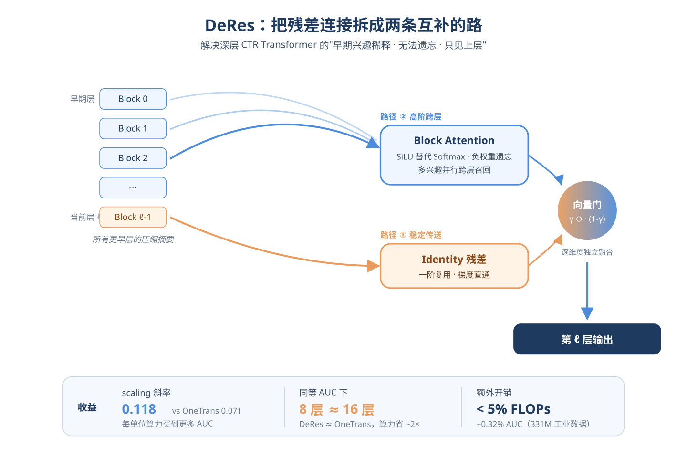
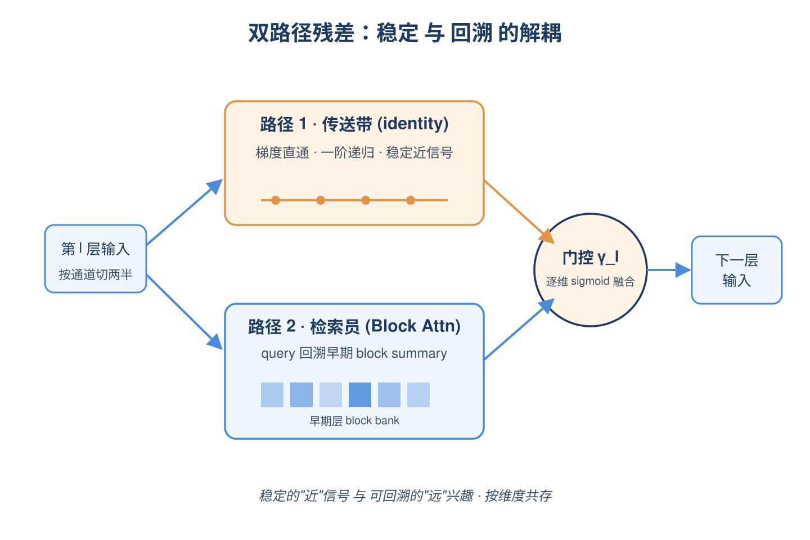
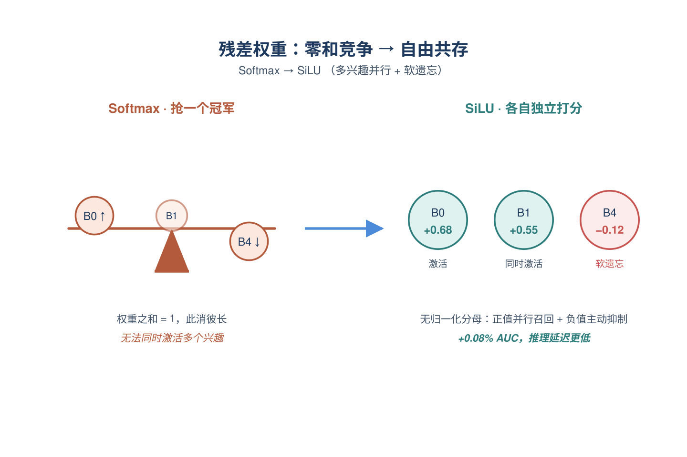
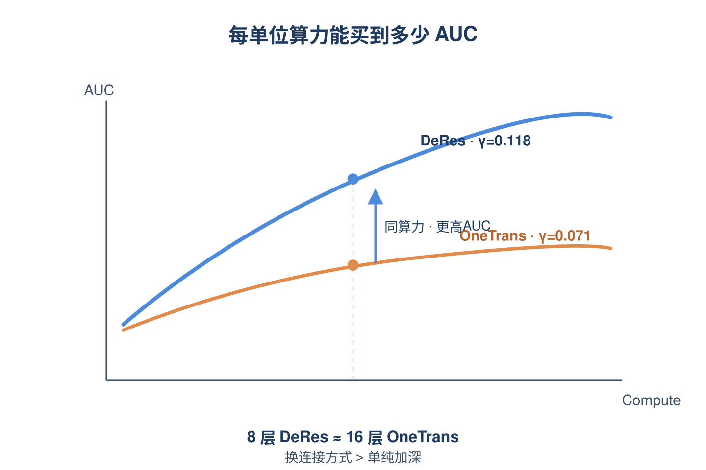
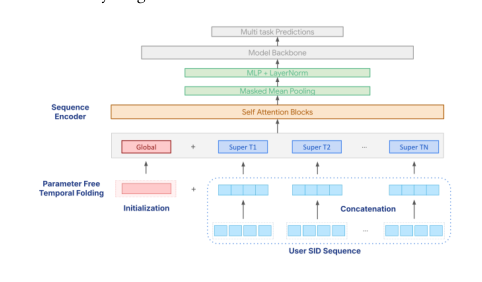
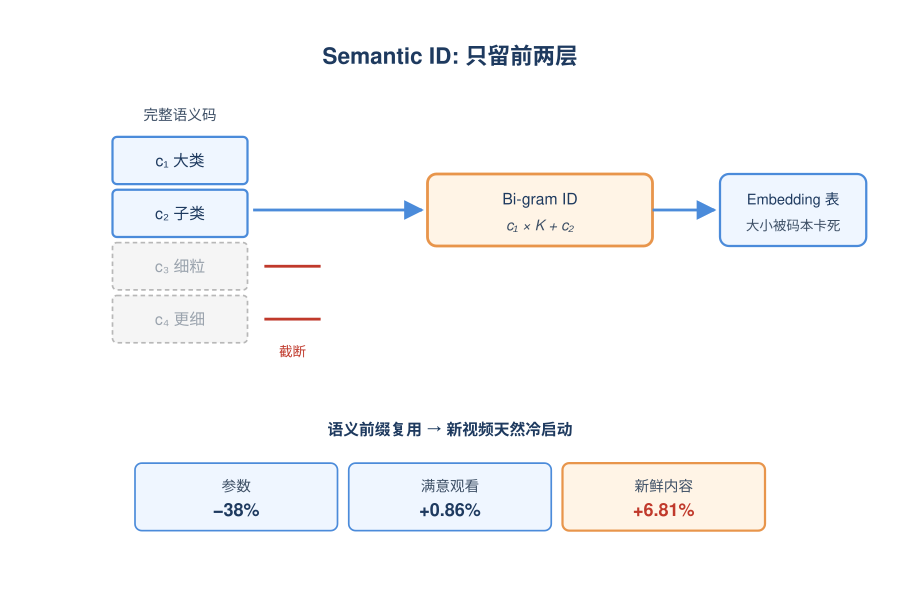
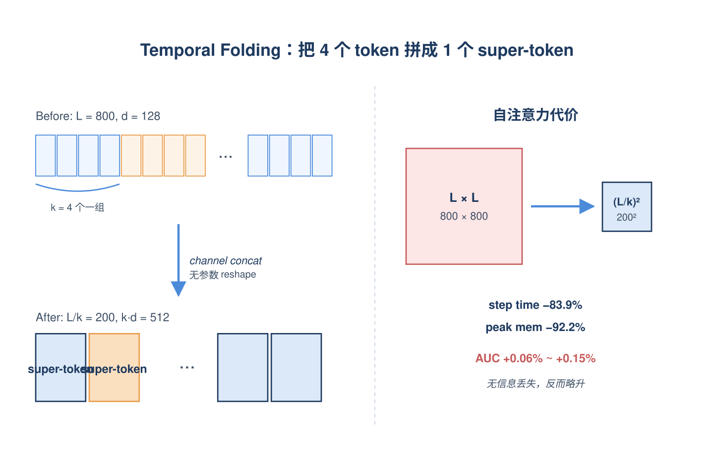
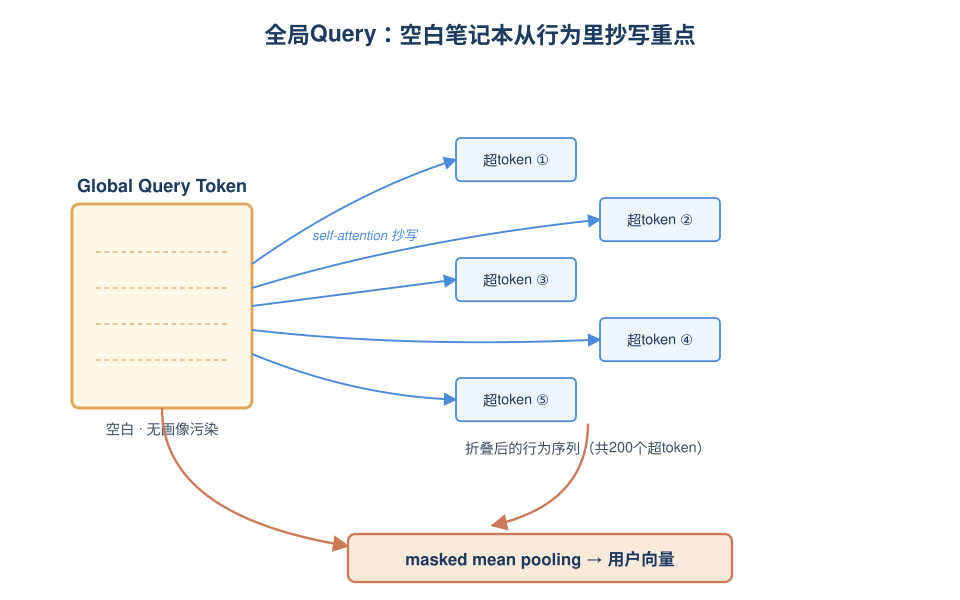

# 2026-06-09 论文日报

## 一、今日趋势与创新观察

### 1. 趋势概况

- 今日全量抓取783篇，cs.AI（499）与cs.LG（253）继续主导，cs.IR升至31篇且工业级生成式推荐、CTR残差结构、电商营销分配等议题密集出现。
- LLM与语言理解类335篇仍是最大主题，但内部重心从纯文本生成进一步偏向多模态推荐基准、生成式检索的索引-解码对齐以及长上下文压缩。
- Agent与多智能体140篇，工具检索、记忆压缩与多轮Agent服务化系统成为新焦点，开始与RAG、KV cache等系统优化议题深度耦合。
- 迁移学习与跨域泛化118篇规模可观，主题集中在跨模态语义对齐、知识图谱增强与领域适配，跨领域复用方法学比例上升。

### 2. 推荐系统 / 排序相关创新点

- DeRes针对Transformer-based CTR模型在Pre-Norm下早期兴趣信号被层层稀释、identity skip无法遗忘陈旧兴趣的问题，提出解耦稳定性与适应性的双路径残差结构，并在工业大规模数据集上验证scaling law。
- 短视频推荐工作Beyond Item IDs用Semantic ID替代正交Video ID缓解语义稀疏，并通过长序列压缩Transformer突破二次复杂度瓶颈，已在亿级用户场景部署。
- Gryphon在生成式召回中将Semantic ID生成与item级打分统一到同一架构，解决SID冲突与beam search仅优化token序列似然的问题，A/B替换超过15个传统召回源。

### 3. 全局创新点

- Adaptive Loss Balancing for Noise-Robust GRPO将奖励模型不可信样本的影响纳入损失加权，为生成式推荐的RL训练提供了对噪声奖励鲁棒的训练技巧。
- OneFeed用单一生成式框架同时建模Feed内容增强与查询生成，把传统分离的搜推架构在生成范式下统一，提供了搜推一体化的新建模视角。
- End-to-End Context Compression at Scale与OmniMem等工作把KV cache/上下文压缩从推理后处理推向训练阶段端到端协同，是长上下文系统结构上的共性新方向。

### 4. 跨论文综合观察

- DeRes、Beyond Item IDs与Gryphon共同指向同一趋势：工业排序/召回正在沿着'更深残差、更长序列、更统一的生成式架构'三个维度同时scale，且都通过Semantic ID或残差解耦解决信号稀释/冲突问题。
- Adaptive GRPO与OneFeed反映生成式推荐方法论上的两层互补——前者在训练信号层用自适应损失抗噪声奖励，后者在架构层把搜与推统一到生成框架下，共同推动RL+生成式推荐的工业落地。
- Agent侧的上下文压缩（CICL、End-to-End Context Compression、OmniMem、AgentServeSim）与推荐侧的长序列压缩（Beyond Item IDs）在方法论上趋同：都在用压缩+选择性记忆解决'输入过长但决策证据稀疏'的同一类问题，只是落在不同业务场景。

## 二、今日入选论文

### 1. DeRes: Decoupling Residual Stability and Adaptivity for Scalable CTR Prediction
- 挑选理由：直接面向CTR预估，提出双路径残差结构，工业大规模数据集验证scaling law，是广告排序核心模型工作

### 2. Beyond Item IDs: Scaling Short-Form-Video Recommendation via Semantic-Native Long Sequence Modeling
- 挑选理由：亿级用户短视频推荐生产部署，Semantic ID+长序列压缩Transformer，与商业化排序链路高度相关

## 三、补充关注

1. **ToolRec: Calibrated Preference Alignment for Query Recommendation in On-Device Assistants**
   - 理由：OPPO小布query推荐，CTR优化与点击噪声校准，与商业化推荐有部分相似性，但本质是工具调用query推荐
2. **TRACER: Token ReAssignment for Concept ERasure in Generative Recommendation**
   - 理由：生成式推荐中的概念遗忘，与商业化排序链路相关性弱，偏隐私/合规方向
3. **Evaluating AI Investment Strategies**
   - 理由：理论审计框架提及广告拍卖与平台机制设计中的福利偏差修正，但本质偏理论审计工具
4. **Optimality of Sequential Filtering Under Independent Cost and Selectivity Models**
   - 理由：级联过滤排序的最优顺序，与广告级联排序、粗排精排有同构性，但偏理论

## 四、重点论文精读

### 1. DeRes: Decoupling Residual Stability and Adaptivity for Scalable CTR Prediction
- **为什么值得看：** 把残差连接拆成稳定与自适应两条路，CTR上跑出更陡的scaling law
- **背景：** 工业CTR模型已经从浅层FM类走到OneTrans/TokenMixer-Large这种深层Transformer，但作者发现Pre-Norm下的标准残差有三个隐患：早期用户兴趣信号被逐层稀释、identity skip无法忘记过期兴趣、每层只能看到上一层。语言模型领域已经出现AttnRes、DenseFormer、HC等改造残差的方法，但它们都丢掉了identity保护路径，且没人在CTR上验证。CTR的特殊性（层数浅4-12、特征异构、用户多兴趣并行）让这个问题更突出，所以值得专门设计一套CTR友好的层间连接器。

*图示：这篇论文直击工业CTR Transformer里一个被忽…*

**核心技术点：**

#### 技术点 1：双路径残差解耦
- 快速理解：把identity保护路径和跨层注意力路径并行跑，再用向量门按维度融合

*图示：可以理解为给每层装了两条并行的'记忆通道'：一条是死板但…*

- 技术细节：每层把输入按通道切成两半（各d/2维）：路径1是固定的identity残差，保留一阶特征复用和梯度直通；路径2是Block Attention Residual，将所有更早的层输出按块压缩成B个block summary，用一个可学的query向量对它们做跨层注意力得到d-l。最后用一个向量化sigmoid门γ-l（对每个隐藏维度独立打分）把r-l和d-l按位融合：x-l = γ-l⊙r-l + (1-γ-l)⊙d-l。论文用HORNN框架解释：路径1是一阶递归，路径2是高阶递归，二者函数族严格大于单路径之并集。
- 通俗讲解：可以理解为给每层装了两条并行的'记忆通道'：一条是死板但稳的传送带，把上一层信息原样递过来保证梯度不衰减；另一条是聪明的检索员，可以回头翻所有早期层的摘要按需取用。然后每个隐藏维度自己投票：稳重的维度走传送带，需要长程信息的维度走检索员。一次前向时，先算两条路径各自的输出，再让门控按维度做加权混合，输出送入下一层。
- 例子：比如用户最近看了电子产品也看了运动鞋。第3层encode到运动鞋兴趣，到第7层时如果只走标准残差，电子产品信号已经被稀释。在DeRes里，第7层的query向量在block bank里翻到第2-3层的block summary（电子产品所在块）权重很高，从路径2拉回这个早期兴趣；同时路径1把第6层的最近信号原样送过来；门控对不同维度分别决定该听哪边，最终输出同时携带两类兴趣。

#### 技术点 2：Pointwise AttnRes用SiLU替Softmax
- 快速理解：跨层注意力去掉Softmax改用SiLU，让多兴趣可同时激活、无关层可被负权重抑制

*图示：Softmax像在所有历史块里只能选一个'冠军'，给一个…*

- 技术细节：标准AttnRes里α-(l,b) = softmax(w-l·RMSNorm(B-b))，所有block权重必须和为1，是零和竞争。作者改成α-(l,b) = SiLU(w-l·RMSNorm(B-b))，其中SiLU(x)=x·sigmoid(x)。这样多个早期block可以同时拿到大正权重；当点积为负时SiLU输出小负值，相当于'软遗忘'那块历史信息；而且没有归一化分母，推理延迟还更低一点。论文消融显示SiLU比Softmax高+0.08% AUC，比ReLU高+0.16%（ReLU硬截断丢掉了负值的抑制能力）。
- 通俗讲解：Softmax像在所有历史块里只能选一个'冠军'，给一个高了别的就得低，这对'用户同时关心电子产品和运动鞋'这种并行多兴趣是错配的。SiLU让每个块独立打分：相关的可以一起亮起来，无关的不仅是0而是负数（主动抑制）。注意力可视化显示深层会用-12%~-18%的负权重去压制早期不相关块，把这些负值清零会掉0.07% AUC，说明这种主动遗忘有用。
- 例子：假设当前层判断该不该激活第0块（最早的embedding信息）：若query点积得+0.85，SiLU≈0.68，正向召回；同时第1块得+0.72也能同时激活；第4块得-0.3，SiLU≈-0.12，相当于把这块历史信号反向减掉一点，避免它干扰当前预测。Softmax下这种'两个都激活+一个抑制'是不可能的。

#### 技术点 3：更陡的compute-AUC scaling law
- 快速理解：拟合出DeRes的scaling指数γ=0.118，是OneTrans的1.66倍，8层≈对手16层

*图示：scaling law斜率γ越大，意味着每加一倍算力能多…*

- 技术细节：在工业数据集上扫dept L属于(2,4,8,12,16)和宽度d属于(64,128)，用AUC(C)=α-β·C (-γ)拟合。结果OneTrans γ=0.071，DenseFormer γ=0.089，DeRes-P γ=0.118。理论侧基于FAT的Rademacher复杂度bound：泛化gap主要由特征field数F和有效交互阶K决定，DeRes把K从1（只看上一层）抬到\>=2（能attend全部B个block summary），按命题3每单位算力能买到更多AUC。实操上8层DeRes的AUC≈16层OneTrans，约2倍算力节省。
- 通俗讲解：scaling law斜率γ越大，意味着每加一倍算力能多赚到的AUC越多。OneTrans这种单路径残差堆深了之后边际收益迅速递减，DeRes因为路径2能跨层调用早期信息，深层不只是'再refine一次'而是'重新组合早期特征'，所以每加一层都还能榨出新收益。这对要不要继续加深排序模型这件事直接给了答案：换连接方式比加层数更划算。
- 例子：在2G FLOPs这个点上，OneTrans约0.802，DeRes-P约0.806，差0.4pp；继续加算力到4G，OneTrans基本走平，DeRes-P还能继续涨。一个工业团队如果原本计划把backbone从8层加到16层来追AUC，可以改成保持8层但换DeRes，达到同样AUC的同时算力省一半。

- **对广告的启发：** 工业CTR排序模型的残差连接可以直接换成DeRes，低成本提AUC并改善scaling
- **适用边界：** 方法假设CTR是浅层（4-12层）+异构特征+并行多兴趣的场景，这正是其相对LLM的优势来源；如果是非常浅（2-3层）或者用户兴趣高度单一的场景，路径2的高阶召回价值会缩水。另外block compression靠B≪d才划算，当隐藏维度很小或者层数极少时overhead占比会变高。
- **实践建议：** 如果你的精排模型已经是Transformer结构，先做一个最小改动实验：保留identity残差不动，并行加一条对所有过往层block summary做SiLU加权的路径，用向量门融合，看看能否复现+0.2~0.5% AUC，特别关注长尾item和高活用户切片。

### 2. Beyond Item IDs: Scaling Short-Form-Video Recommendation via Semantic-Native Long Sequence Modeling
- **为什么值得看：** Google生产级超长序列建模，Semantic ID+压缩Transformer双管齐下，对广告排序长序列直接可借鉴
- **背景：** 短视频推荐需要把用户上千条观看历史都喂进模型，才能同时抓住长期偏好和即时兴趣。但传统做法有两个瓶颈：一是把每个视频当成一个独立的Video ID，embedding表随库膨胀且冷启动差；二是Transformer自注意力是平方复杂度，长度一上去就扛不住工业延迟约束。论文给出一个已经在十亿用户产品上线的端到端方案，把表示和算力两件事一起解决，所以工业价值很高。

*图示：Figure 2 (Global-Aware Compr…*

**核心技术点：**

#### 技术点 1：深度截断的Semantic ID
- 快速理解：用RQ-VAE的前两层粗粒度码替代Video ID，做序列侧的紧凑语义表示

*图示：可以把它理解成给每个视频打一个'大类-子类'的标签，比如…*

- 技术细节：上游用RQ-VAE把视频内容embedding量化成一串由粗到细的离散码c1,c2,...,cD。论文采用非对称策略：候选侧和关键交互特征（如最近一次观看）保留完整深度的细粒度ID用于精准判别；而用户长序列侧只保留前两层做Bi-gram，用c1乘以码本大小再加c2拼成一个统一整数ID。这样embedding表大小被码本深度卡死，不再随视频库无限增长。
- 通俗讲解：可以把它理解成给每个视频打一个'大类-子类'的标签，比如'游戏-沙盒'、'游戏-射击'。序列里不再记每个视频的唯一编号，而是记它的两级类目码。模型查embedding时只查这个两级码对应的向量，新上传的视频只要语义前缀相同就能复用已有embedding，自然就解决冷启。
- 例子：线上A/B（序列长度160）显示，把Video ID换成Bi-gram SID后，满意观看+0.86%，新鲜内容（最近上传）满意观看+6.81%，同时embedding参数减38%、存储减39%，说明粗粒度语义码既保住了记忆能力又显著提升了对新内容的泛化。

#### 技术点 2：无参数时间折叠压缩
- 快速理解：把相邻k个token沿通道维拼接成超token，长度除以k、维度乘以k，零参数降复杂度

*图示：可以想成把视频流按4个一组打包，每组里的4个视频原来的向…*

- 技术细节：提出Global-Aware Compressed Transformer。核心操作是Temporal Folding：把长度L的输入按窗口大小k切段，每k个相邻token直接在通道维concat成一个super-token，序列形状从(L,d)变为(L/k, k·d)。这是无参数、无信息丢失的reshape，不是pooling。之后再做标准自注意力，复杂度从L平方降到(L/k)平方。论文实验k=4在L=800时训练步时降83.9%、峰值显存降92.2%，AUC还能小幅+0.06%~0.15%；k=6则开始掉点。
- 通俗讲解：可以想成把视频流按4个一组打包，每组里的4个视频原来的向量被首尾拼成一个更宽的向量，作为一个'超事件'喂给Transformer。注意力只在这些超事件之间算，数量少了但每个事件信息更密。维度变宽相当于给注意力更多通道去捕捉局部4个视频之间的关系，所以不仅没掉点，还因为局部去噪略有提升。
- 例子：原来一条800长度、每个token 128维的序列要算800x800的注意力矩阵，显存5758 MiB；折叠k=4后变成200长度、每token 512维，注意力矩阵只有200x200，显存448 MiB，训练step从41ms降到6.6ms，仍然能在AUC上小幅提升。

#### 技术点 3：全局Query Token聚合
- 快速理解：在压缩后序列前面加一个学习型的全局query token，做attention sink并最终pooling

*图示：这个全局token就像一个空白笔记本，模型在做self-…*

- 技术细节：在折叠后的序列前面prepend一个不依赖任何用户画像的learnable Global Query Token，让它纯粹通过注意力从动态行为里聚合信息，同时充当attention sink吸收低熵信号、稳定训练。最终用户表示用统一的masked mean pooling，把全局token输出和所有局部超token输出按有效mask求平均，得到既有全局意图又有局部细节、且对历史长度幅值不敏感的用户向量。
- 通俗讲解：这个全局token就像一个空白笔记本，模型在做self-attention时让它去抄写整段历史中最重要的东西。因为它一开始什么都不带，所以只能从真实交互里学，不会被静态画像污染。最后把这个'笔记本'和每个超事件输出一起平均，得到的用户向量既有总览又有细节。
- 例子：假设折叠后用户序列剩200个超token，前面再插1个global token共201个进Transformer；输出端global token对应位置1，再加上200个超token位置，做带mask的均值，得到最终用户表示送给排序塔。线上把序列从800 Video ID升到2000 SID后，活跃用户+0.52%，满意观看时长+1.42%。

- **对广告的启发：** 广告排序的超长用户行为可直接借鉴：语义码降表大小+时间折叠降算力
- **适用边界：** 方法依赖一个高质量的上游RQ-VAE能把内容embedding切出有判别力的层次码，没有这套基础设施时Bi-gram截断会丢信息；折叠窗口k存在最优点（论文k=4最佳，k=6掉点），需要按业务序列长度和时序敏感度调参。
- **实践建议：** 如果团队已有内容向量，可以先在用户长行为序列侧试点：把Video/Item ID换成RQ-VAE前两层拼成的Bi-gram ID，并对长序列做k=2~4的channel-wise折叠，观察embedding表规模、训练step时延和冷启指标的变化，再决定是否全量。
