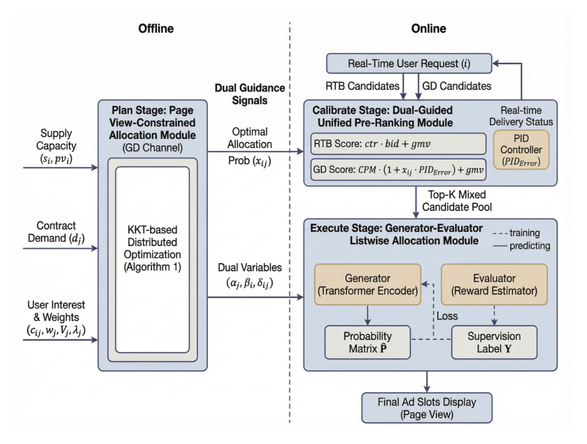
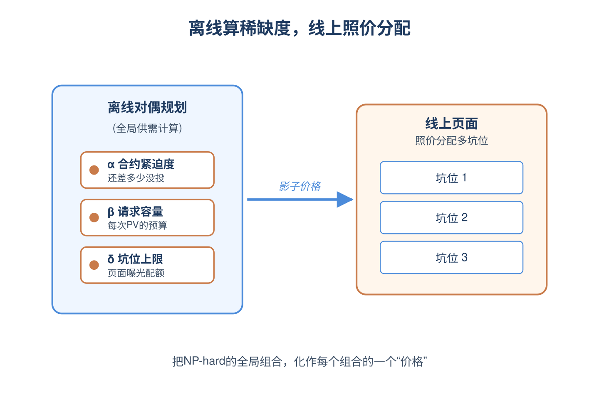
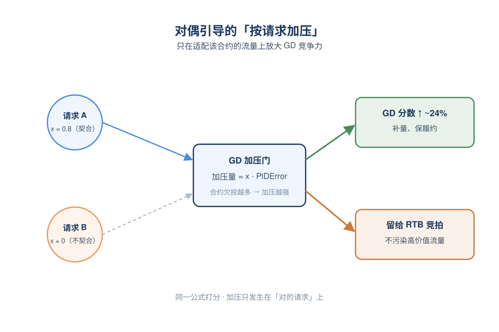
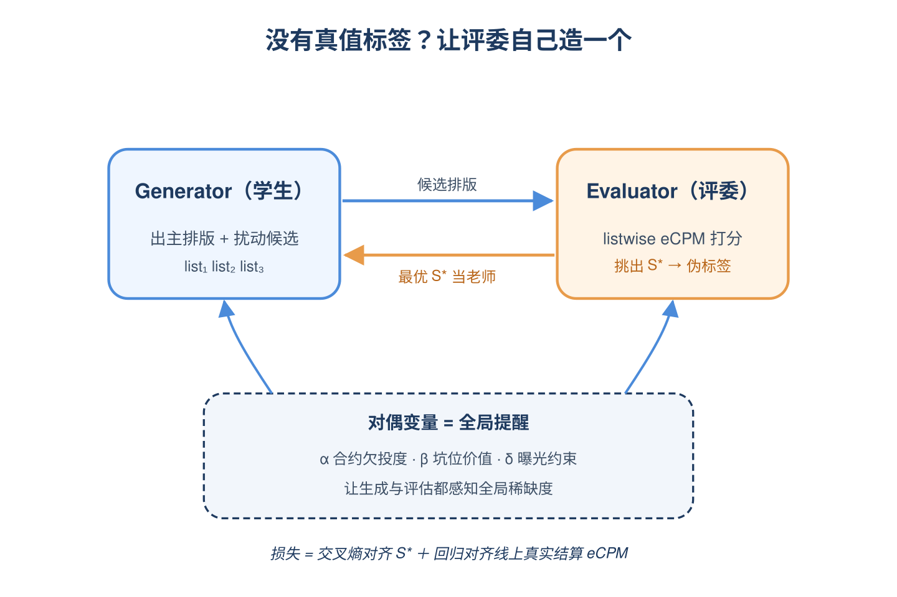
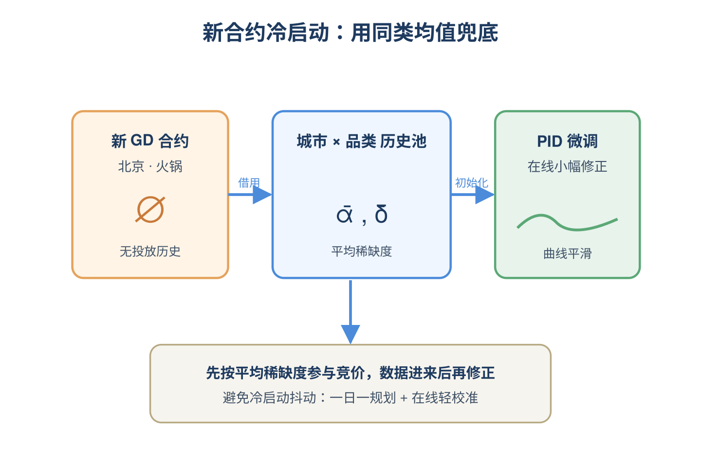
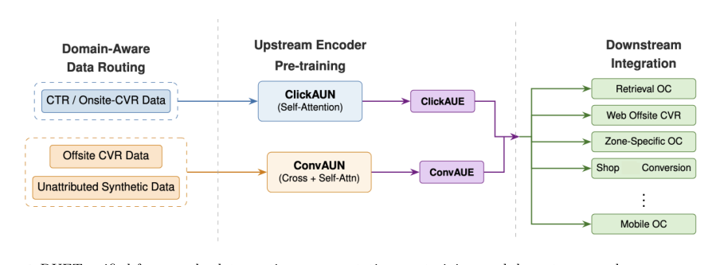
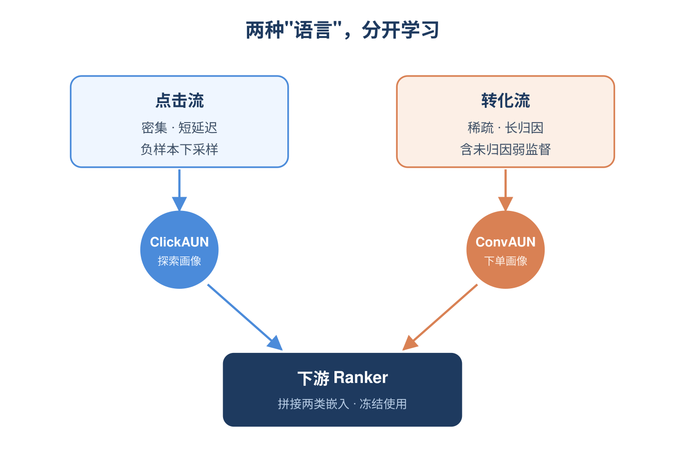
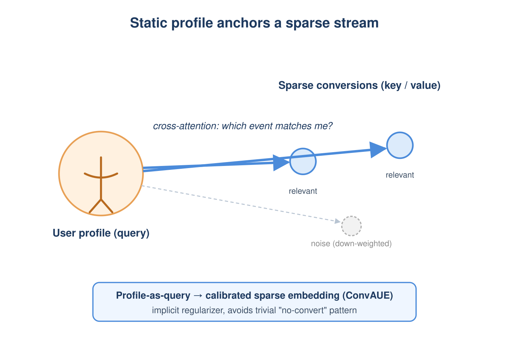
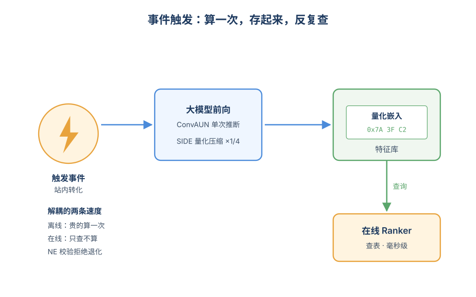
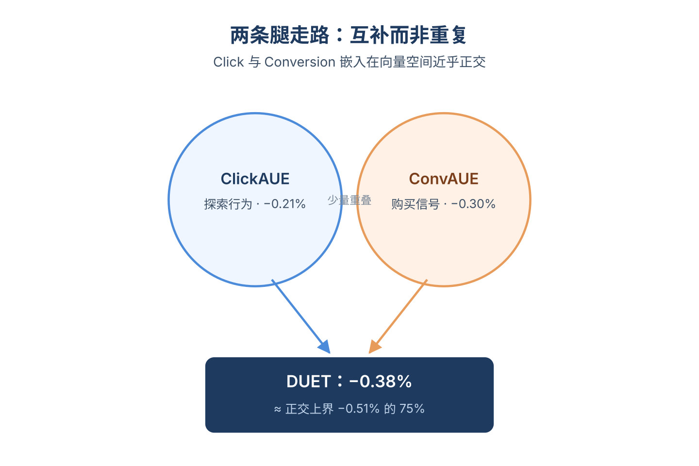

# 2026-06-10 论文日报

## 一、今日趋势与创新观察

### 1. 趋势概况

- 今日全量抓取439篇，cs.AI 278篇与cs.LG 141篇延续主导，LLM与语言理解187篇仍是最大主题，但研究重心明显从纯生成转向长程记忆保留、稀疏门控记忆和Agent技能歧义消解等系统化议题。
- Agent与多智能体类77篇较前几日继续抬升，出现τ-Rec可验证Agent推荐基准、SkillResolve-Bench技能检索歧义等评测向工作，反映社区开始正视Agent在排序/推荐场景的可度量性。
- cs.IR仅20篇但工业广告信号格外集中，美团HMAF的GD-RTB混排、流媒体广告pacing的conformal不确定性校准、双塔OCVR、Kuaishou跨域意图推理同日出现，密度高于近一周平均。
- 表示学习与检索排序119篇中，语义ID诊断工具、生成式archetype物品表征、长序列线性注意力的语义状态sink缓解等成为新焦点，方法论从堆叠Transformer转向显式可诊断与记忆结构化。

### 2. 推荐系统 / 排序相关创新点

- 美团HMAF提出层次化多坑位GD-RTB联合分配框架，把保量合约履约与实时竞价排序耦合在同一优化层级，避免传统启发式优先级带来的短期收入与长期履约失衡。
- Decision-Calibrated Conformal Uncertainty把conformal预测与pacing决策直接对齐，用最大下游决策误差而非通用残差来校准库存与增量响应的不确定性，给广告预算控制提供可证明的区间。
- SinkRec识别长序列推荐线性注意力中的"语义状态sink"现象，用记忆条件门控Delta网络让循环状态不被高频重复行为占据，对长行为序列广告排序有直接迁移价值。

### 3. 全局创新点

- SIDInspector首次把生成式推荐里被反复复用的语义ID tokenizer当成独立可诊断artifact，提出mapping-first的覆盖率、别名和行为一致性体检接口，是把语义ID从黑盒embedding变成可审计组件的方向性工作。
- Mult-DPO把直接偏好优化从pairwise扩展到multinomial set-wise形式，更贴近推荐和对话场景的多选反馈结构，为生成式排序的偏好对齐提供了一种比RankDPO更自然的目标函数。
- Learning What to Remember把长程Agent的记忆保留写成带可观测性约束的优化问题，跳出启发式打分和学习压缩的常见思路，给Agent"该忘什么"提供了带保证的资源分配视角。

### 4. 跨论文综合观察

- HMAF、Decision-Calibrated Pacing与DUET三篇广告侧论文从不同层面攻同一条链路：HMAF管多坑位分配，Pacing管预算与库存的不确定性，DUET管底层OCVR排序信号，串起来基本是一条完整的工业广告决策栈。
- SinkRec、SIDInspector与Atomic Intent Reasoning呈现出推荐系统对"表征是否真实可用"的三种诊断姿势：SinkRec诊断长序列状态被重复行为污染，SIDInspector诊断语义ID映射的覆盖与别名，Atomic Intent则用LLM语义补足跨域意图，方法论上都在质疑"压缩后的表征还能不能代表用户"。
- Mult-DPO、Representation Curriculum与Learning What to Remember看似不相关，但都把"训练目标/数据如何呈现给模型"当作一等问题：分别用set-wise偏好、阶段化课程和约束化记忆保留，反映出今日社区对训练信号结构化的共同偏好。

## 二、今日入选论文

### 1. HMAF: A Hierarchical Multi-Slot GD-RTB Allocation Framework
- 挑选理由：美团在线广告平台GD与RTB混合分配框架，多坑位实时排序与合约履约，直接命中广告分发核心链路。

### 2. DUET -- Dual User Embedding Transformers for Offsite Conversion Prediction
- 挑选理由：OCVR转化率预测，双用户Transformer建模点击与转化流，明确广告排序场景，含A/B测试

## 三、补充关注

1. **Data-Driven Dynamic Assortment in Online Platforms: Learning about Two Sides**
   - 理由：双边平台动态商品集选择问题，使用MNL选择模型与regret分析，与电商流量分发/排序展示有一定同构性，但偏理论并未直接对接广告系统。
2. **Stability in Competitive Search with Results Diversification**
   - 理由：搜索结果多样性下publisher的博弈分析，对商业化排序生态有一定参考但非广告核心

## 四、重点论文精读

### 1. HMAF: A Hierarchical Multi-Slot GD-RTB Allocation Framework
- **为什么值得看：** 美团真实落地的GD+RTB混合多坑位分配框架，覆盖离线规划到在线listwise排序
- **背景：** 在美团这种到店feed场景里，每个page view有多个广告坑位，GD合约（按保量价格预定流量）和RTB广告（实时竞拍）要混在一起出。以往要么把GD和RTB分开优化，要么用'GD优先'之类的硬规则，难以兼顾长期履约和短期收入；再加上多坑位之间还有曝光上限等约束，全局组合优化是NP-hard。论文要解决的就是这种工业场景下的混合多坑位分配，并已经在美团线上A/B验证有效，因此对做广告混合售卖的团队很有参考价值。

*图示：Figure 2 是 HMAF 的总览图，清晰展示了 P…*

**核心技术点：**

#### 技术点 1：页面级约束下的对偶规划
- 快速理解：把多坑位分配建成带页面曝光约束的优化问题，离线解出对偶变量当作'影子价格'

*图示：可以把α-j想成'这个合约现在多缺量'，δ-ij想成'这…*

- 技术细节：论文把GD分配写成一个目标函数：在让每个合约靠近其目标投放比例（通过一个二次平滑项），同时考虑合约权重和用户兴趣分的最大化，约束包括合约总量上下限、每个请求只能分一次、以及新引入的'页面曝光上限pv-i'。用拉格朗日对偶+KKT条件得到分配概率x-ij的闭式解，再用投影梯度迭代去更新三类对偶变量：合约紧迫度α-j（合约还差多少没投完）、请求容量β-i、坑位曝光约束δ-ij。这些对偶变量后面会作为信号喂给在线模块。
- 通俗讲解：可以把α-j想成'这个合约现在多缺量'，δ-ij想成'这个坑位还能不能再放这个合约'。离线先把全局供需算清楚，得到每个'合约-请求-坑位'组合的影子价格；线上不再现解大优化，只用这些价格当指挥棒。整个过程像是先在仓库里算好每种货的稀缺度，门店只要照着稀缺度调价就行。
- 例子：假设合约A今天要投1万次但只投了3千、且页面顶部坑位已经曝光快满，那α-A会被推高（着急投）、顶部坑的δ-iA也会变高（别再往那塞）。组合起来，离线就告诉线上：合约A该多投，但要换到下面的坑位去。

#### 技术点 2：对偶引导的统一打分
- 快速理解：在线把GD的eCPM乘上一个由对偶分配x\_ij和PID误差组成的修正系数，与RTB统一比价

*图示：传统PID会对该合约的所有流量统一加压，容易把不合适的流…*

- 技术细节：在线粗排打分把GD和RTB放进同一个公式：RTB广告分数 = ctr × CPC出价 + gmv项；GD广告分数 = CPM × (1 + x-ij × PIDError) + gmv项。其中x-ij是离线算好的分配置信度，PIDError是该合约当前实际投放率相对目标投放率的偏差（投得不够时会变大，投得够了就退到基线μ0）。两者相乘意味着：只在'这个请求确实适合该合约（x-ij高）'且'合约确实欠投（PIDError大）'时才放大GD的竞争力。
- 通俗讲解：传统PID会对该合约的所有流量统一加压，容易把不合适的流量也硬塞给GD。这里改成'按请求加压'：哪些请求是离线规划里就推荐给这个合约的，就在那些请求上放大它的竞争力，其他请求让它老老实实按原eCPM和RTB比。这样既能补量，又不会污染其他高价值流量。
- 例子：合约B欠投30%，传统做法会把它在所有请求上都加30%权重；HMAF则只在离线x-iB高（比如x=0.8）的请求上把分数推高约24%，在x=0的请求上几乎不动，这样高质量、适合RTB的曝光就能留给RTB去拍卖。

#### 技术点 3：Generator-Evaluator listwise排序
- 快速理解：用Transformer生成多坑位排版方案，再用Evaluator打分挑最优list作监督

*图示：list级排序没有现成的真值标签——你不知道什么叫'最优…*

- 技术细节：执行阶段是一个生成-评估网络：Generator用Transformer编码候选广告和坑位，输出'候选j放到坑位i的概率矩阵'，从中采样出主排版S-g，再用启发式扰动出若干候选list；Evaluator对每个list估计listwise eCPM（结合预测指标和投放约束）选出最优S\*，把S\*转成0/1矩阵Y作为伪标签。训练损失是两项：交叉熵让生成概率对齐Y，再加一个回归项让预测eCPM对齐线上真实结算eCPM。关键是把前面的对偶变量x-ij、α-j、β-j、δ-ij当作'全局状态特征'喂进网络，让模型在生成时就知道全局稀缺度和坑位约束。
- 通俗讲解：list级排序没有现成的真值标签——你不知道什么叫'最优排版'。论文的思路是让Evaluator自己造监督：枚举若干合理排版，用listwise eCPM打分挑最好的当老师。Generator则在对偶变量的'提醒'下学习，比如δ-ij高时它就知道别再往那个坑放该广告，α-j低（合约很急）时就倾向把它排进去。
- 例子：一次page view有4个坑、6个候选广告。Generator先生成一个排版（合约B占坑1、RTB广告占坑2-4），再扰动出几个版本；Evaluator算出'合约B放坑3、坑1留给高价RTB'的list eCPM最高，于是把这个list当标签训Generator。下次遇到类似请求，模型就学会主动把欠投合约挪到次要坑位。

#### 技术点 4：线上工程与冷启动
- 快速理解：离线两小时跑KKT、在线粗排\<5ms、GE推断\<50ms，并用城市×品类均值冷启新合约

*图示：这部分对工业部署很关键：对偶规划这种重计算放离线一天一跑…*

- 技术细节：离线在20台32核机器上跑约2小时处理1亿SKU，每天重新规划一次对偶变量；GE网络每天重训，但只有当离线Group-AUC波动在5%以内才允许上线（严格门控）。在线粗排每个广告\<5ms，GE listwise推断每个page view\<50ms，日基础设施成本约150美元。新建GD合约缺乏实时数据，用'城市×品类'历史均值初始化对偶变量，再交给PID做小幅微调。
- 通俗讲解：这部分对工业部署很关键：对偶规划这种重计算放离线一天一跑，在线只做轻量打分和listwise生成；新合约还没数据时就先用同城同品类的平均稀缺度兜底，避免冷启乱投。
- 例子：今天上午新签一个'北京·火锅'合约，没有任何投放历史。系统直接拿'北京×火锅'类目过去的平均α、δ初始化它的对偶变量，让它先按平均稀缺度参与竞价；几小时后真实投放数据进来，PID再做修正，曲线不会一开始就抖动。

- **对广告的启发：** 给做GD/RTB混合售卖和多坑位排序的团队提供了可直接借鉴的三段式工业落地范式
- **适用边界：** 适用于同时存在GD保量和RTB竞价、且页面有多个坑位需要协同的场景；如果平台只有RTB或合约结构很简单，引入对偶规划和GE的复杂度收益不明显。此外，方法依赖较准确的流量预测和pCTR/eCPM预估，预测漂移会通过伪标签放大误差。
- **实践建议：** 可以先把现有PID补量改造成'请求级对偶引导'：离线跑一版带页面曝光约束的分配优化，把x\_ij和α\_j作为特征塞进现有粗排打分公式做A/B，验证'按请求加压'相对'全局加压'的收益，再决定是否上完整的Generator-Evaluator listwise模块。

### 2. DUET -- Dual User Embedding Transformers for Offsite Conversion Prediction
- **为什么值得看：** 广告OCVR预测：双塔分流点击与转化序列，已上线A/B验证
- **背景：** 离站转化率(OCVR)预测对零售媒体网络和Cookie衰退后的广告投放越来越关键，但转化样本极稀疏(\<5%)、归因窗口长达数天且大量未归因，而点击样本则非常密集且时延短。以往做法是把点击和转化丢进同一个上游编码器统一预训练，导致密集的点击信号主导训练、稀疏的转化模式被淹没，且单一架构对两种统计特性差异巨大的序列不友好。论文提出按域分流、各训各的双编码器框架，并通过事件触发的异步服务嵌入下游ranker，工程性和可部署性都很强。

*图示：Figure 1是DUET的统一框架总览图，清晰展示了核…*

**核心技术点：**

#### 技术点 1：按域分流的双流数据路由
- 快速理解：把点击流和离站转化流分开，各自训练专用编码器

*图示：直觉是：点击和转化本来就是两种'语言'，强行用同一个编码…*

- 技术细节：上游训练数据被拆成两条流：CTR/站内转化流(密集、短归因窗口，对负样本下采样)和OCVR流(稀疏、长归因窗口，不下采样且加入未归因合成样本作为弱监督)。两条流各自训练一个上游模型ClickAUN和ConvAUN，分别产出ClickAUE和ConvAUE两类用户嵌入，下游ranker把两个嵌入都作为额外特征拼进去，且训练时冻结这两个嵌入。
- 通俗讲解：直觉是：点击和转化本来就是两种'语言'，强行用同一个编码器学，密集的点击会把稀疏的转化压过去。论文干脆分两套人马：一套专门看用户的点击/浏览习惯，一套专门看用户的下单/注册习惯，最后下游ranker再把两套'画像'拼起来用。冻结嵌入是为了让上下游可以各自按自己的节奏重训，不互相牵制。
- 例子：举个例子：用户A最近频繁点击多个商品但很少下单，ClickAUN会基于他过去几个月的点击/feed浏览/视频观看序列产出一个偏'探索型'的ClickAUE；同时ConvAUN基于他在外站偶尔的注册/购买事件(包括跨设备未归因的合成转化)产出ConvAUE。下游OCVR模型同时拿到这两个向量，再结合候选广告特征预测他这次会不会真的转化。

#### 技术点 2：针对稀疏流的交叉注意力设计
- 快速理解：稠密点击用堆叠自注意力，稀疏转化用交叉+自注意力交错

*图示：稀疏序列的麻烦在于正样本太少，纯self-attenti…*

- 技术细节：ClickAUN沿用LLaTTE范式，堆多层self-attention(2层、2头、维度256)处理1000长度的稠密点击序列。ConvAUN则把self-attention和cross-attention交错使用：cross-attention里query来自用户静态特征、key/value来自转化序列，让稳定的用户级属性去'锚定'稀疏序列，避免在大量负样本上过拟合，同时query长度只受静态特征数限制，计算更省。消融显示这两个架构各自对应自己的流是必需的，互换会掉点。
- 通俗讲解：稀疏序列的麻烦在于正样本太少，纯self-attention很容易学出'反正都不转化'这种平凡模式。Cross-attention相当于让用户的静态画像(年龄、兴趣偏好等)主动去问转化序列里'哪些事件跟我相关'，等于给稀疏序列加了一个稳定的参照系，起到隐式正则的作用。一次前向时，静态特征向量先做query，去attend转化事件序列，得到一个被静态画像'校准过'的序列表征，再过self-attention融合，产出最终ConvAUE。
- 例子：比如某用户静态画像显示她是母婴人群，转化序列里只有3条稀疏事件(2条母婴外站注册、1条无关游戏下载)。Cross-attention会让母婴画像的query对2条母婴事件给出更高权重，对游戏事件压低权重，避免那条噪声事件主导嵌入。最终ConvAUE就更准确地表达她的母婴转化倾向。

#### 技术点 3：事件触发异步推断与压缩服务
- 快速理解：用户触发事件时异步刷嵌入，量化4倍压缩后入特征库

*图示：核心思路是：复杂大模型不能放在请求路径上跑，但可以提前算…*

- 技术细节：嵌入生成与训练解耦：上游模型按各自数据节奏(ClickAUN频繁、ConvAUN较慢)持续预训练，专门的serving模型加载最近通过校验的checkpoint(校验靠NE阈值自动拒绝退化版本)。当用户发生站内转化等触发事件时，系统拉取最新的事件序列和静态特征，跑一次前向得到嵌入，再用SIDE方法做向量量化，相对FP16存储压缩4倍，写入特征库。下游serving时直接查表，再经一个可学习MLP对齐维度后送进overarch交互层，几乎不增加在线延迟。
- 通俗讲解：核心思路是：复杂大模型不能放在请求路径上跑，但可以提前算好结果存起来。触发式更新比定时刷新更聪明——只在用户行为'值得'更新时才重算嵌入，保证活跃用户拿到新鲜表征，又不浪费算力。Checkpoint校验防止某次训练崩了导致线上嵌入变烂，量化压缩则解决了存储成本问题。
- 例子：用户在网站上完成一次站内购买，这个事件触发ETI系统：从在线存储拉出他过去几个月的事件序列+静态特征，跑一次ConvAUN前向得到一个浮点ConvAUE向量，SIDE把它量化成紧凑的语义ID码写入特征库。下次广告请求到达时，ranker直接按用户ID查表拿到量化码，解码+MLP投影后并入特征，整个过程对在线延迟几乎无感。

#### 技术点 4：互补性验证与正交上界
- 快速理解：两类嵌入近似正交，组合NE提升达到理论上界的75%

*图示：这个结果有两层意义：一是证明分流确实让两个嵌入学到了不重…*

- 技术细节：论文用PCA可视化和余弦距离分布证明ClickAUE和ConvAUE在向量空间里基本占据不同区域、整体接近正交。下游训练NE收益：单用ClickAUE降0.21%，单用ConvAUE降0.30%，双用DUET降0.38%；如果两者完全正交且收益完全可加，理论上界是0.51%，DUET拿到了上界的约75%。在6个不同OCVR下游模型上一致正向，A/B测试在两个ranker上分别拿到+0.66%和+0.15%的CVR提升。
- 通俗讲解：这个结果有两层意义：一是证明分流确实让两个嵌入学到了不重叠的信息(否则加一起不会比单个高这么多)，二是说明虽然有少量信息重复(没到100%上界)，但整体上点击画像和转化画像是互补的两条腿。也间接验证了'按域分流'的假设是对的——如果一个统一编码器就够，单流嵌入应该已经接近双流上界。
- 例子：比如对Ranker 6，baseline特征里已经有较多转化相关信号，加ConvAUE收益有限，但加上ClickAUE额外贡献+0.21%，因为点击流带来了它原本缺失的探索行为信息；而Ranker 3的baseline特征对两类信号都覆盖不足，所以双嵌入叠加后A/B转化率直接拉到+0.66%。

- **对广告的启发：** 广告系统直接可用：分流预训练+异步服务+量化压缩的完整工业级范式
- **适用边界：** 适用前提是平台同时拥有大量点击和转化行为数据、且两类信号统计特性确实差异显著；如果转化样本极少(比如冷启动垂直行业)，即使有合成未归因样本也未必撑得起一个独立上游编码器。此外冻结嵌入在分布快速变化的场景下可能落后，需要补充适配机制。
- **实践建议：** 如果你的广告排序系统已经在用统一的上游用户表征模型，可以先做一个简单实验：把训练数据按点击vs转化分流，单独训一个轻量conversion-only编码器，把它的输出作为额外冻结特征拼到下游CVR模型，看离线NE是否有可加收益——这是验证DUET思路在自己业务里是否适用的最低成本方式。
