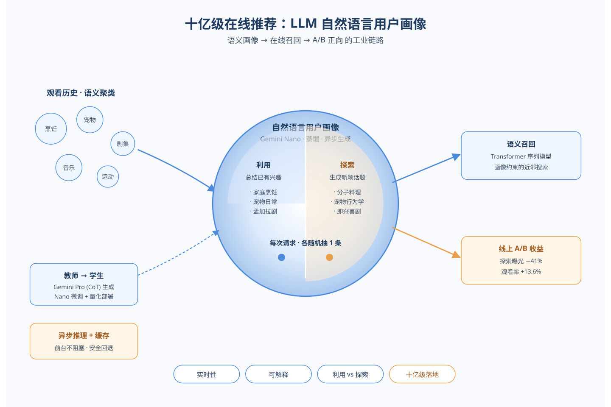
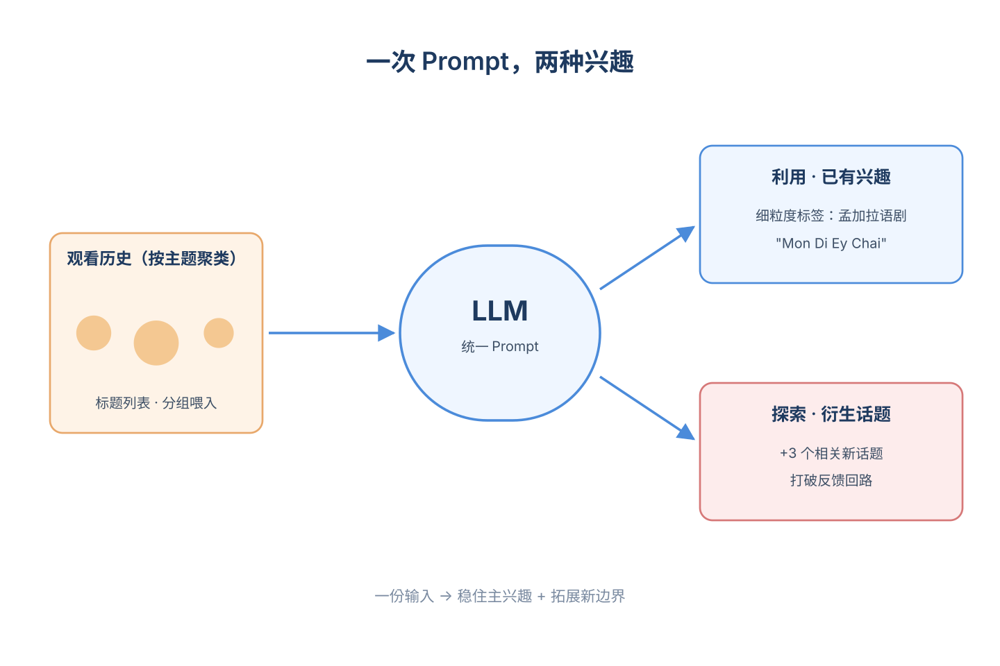
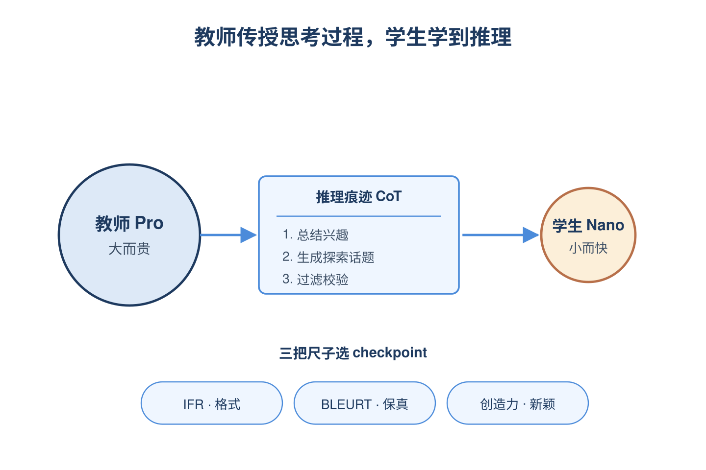
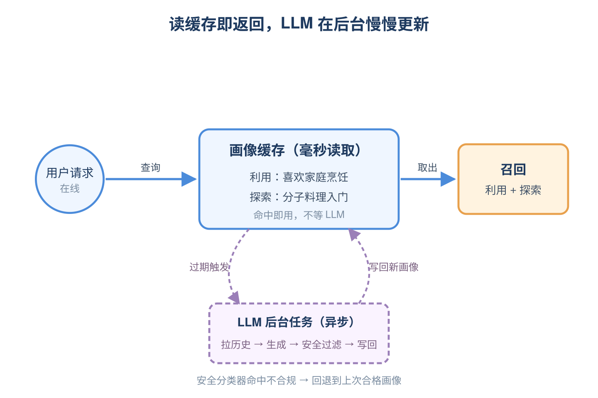
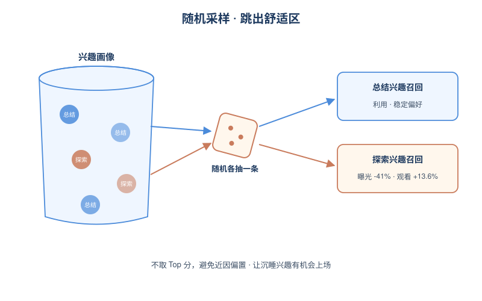
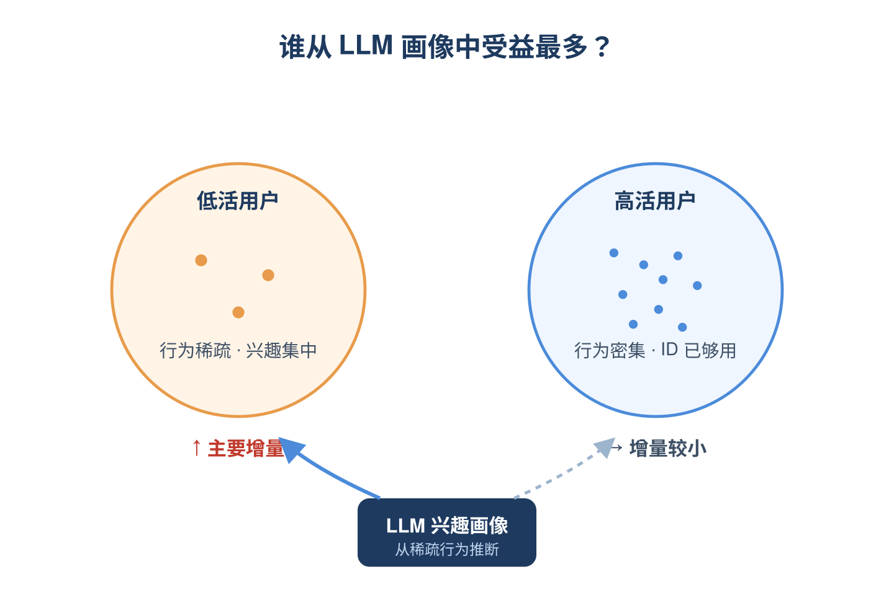

# 2026-06-11 论文日报

## 一、今日趋势与创新观察

### 1. 趋势概况

- 全量340篇中cs.AI 196与cs.LG 125继续主导，cs.IR降至19篇但工业级冷启动与LLM画像类论文质量较高。
- LLM与语言理解141篇仍是最大主题，但研究重心从纯生成进一步向RAG向量稀释、领域受限检索与解码无关重排等检索鲁棒性议题倾斜。
- Agent与多智能体69篇延续近几日抬升趋势，分层记忆导航、结构化多模态记忆、上下文压缩成为反复出现的子方向。
- 迁移学习50篇与冷启动主题交叉明显，扩散生成、LLM零样本图理解被用于缓解长尾与无交互场景。

### 2. 推荐系统 / 排序相关创新点

- Google提出大规模视频推荐的实时LLM用户画像方案，通过蒸馏+异步推理把语义画像注入分发链路并取得线上A/B提升，是LLM落地推荐的工业范本。
- DiffCold以扩散生成模型直接合成冷启动物品的协同表示，针对冷热物品的seesaw困境提出生成式解法，区别于传统内容映射路线。
- CompRank通过token级压缩与解码无关打分，将LLM重排成本压低到接近向量检索量级，给排序链路的LLM化提供了可部署路径。

### 3. 全局创新点

- 《When More Documents Hurt RAG》明确提出向量检索稀释现象，并给出领域受限、模型无关的检索范式，是对盲目扩库式RAG的系统性反思。
- Organize-then-Retrieve提出分层记忆导航替代线性增长的上下文，把Agent的working memory做成可检索结构，缓解长程任务的成本与质量退化。
- Task-Aware Structured Memory以任务自适应方式压缩多模态KV缓存，突破固定token预算的ICL扩展瓶颈，方法可外溢到长序列推荐与多模态排序场景。

### 4. 跨论文综合观察

- LLM-Based User Personas与CompRank分别从用户侧画像生成和物品侧重排打分切入，共同指向LLM在推荐链路从离线特征走向在线决策的工业化趋势。
- DiffCold的生成式冷启动与GraspLLM的零样本文本属性图理解，本质上都在用生成/语义先验填补交互稀疏，反映冷启动正在从判别式补全转向生成式与语义迁移路线。
- RAG稀释、分层记忆导航、结构化多模态记忆三篇看似各自独立，实则都在回答同一个问题：当检索/上下文规模上去之后如何避免质量塌陷，方法论共性是引入结构化组织替代扁平top-k。

## 二、今日入选论文

### 1. LLM-Based User Personas for Recommendations at Scale
- 挑选理由：Google大规模商业视频推荐平台的实时LLM用户画像生成，含蒸馏、异步推理、A/B在线提升，与商业化分发链路同构。

## 三、重点论文精读

### 1. LLM-Based User Personas for Recommendations at Scale
- **为什么值得看：** Google十亿级视频推荐里把LLM画像放到在线服务路径，蒸馏+异步推理打通工程链路
- **背景：** 现有把LLM用进推荐的做法要么把内容/用户编码成结构化ID丢失语义，要么只能离线批量跑画像，无法实时响应用户兴趣变化，也很难给用户看的可解释标签。论文要解决的是：在十亿用户量级的视频推荐里，让LLM在线生成自然语言用户兴趣画像，同时兼顾利用（总结已有兴趣）和探索（生成新颖相关话题），并且满足成本和延迟约束。这一套真正打通'语义画像 → 在线召回 → A/B正向'的工业链路，对推荐和广告都很有借鉴意义。

*图示：这是Google在十亿级商业视频推荐平台上把LLM生成的…*

**核心技术点：**

#### 技术点 1：双任务兴趣画像生成
- 快速理解：一次LLM调用同时输出兴趣总结和探索新话题，画像即利用即探索

*图示：可以把这个画像理解成给每个用户写一份结构化简历：先把他最…*

- 技术细节：论文用一个统一prompt让LLM对每个用户做两件事：任务1是基于观看历史归纳出若干条自然语言兴趣标签并给出推理（exploitation），任务2是针对每条兴趣再生成3个相关但有新意的探索性话题（exploration）。输入端不是把视频ID丢给LLM，而是先用语义聚类把用户最近观看历史按主题分组，每组用视频标题代表，再喂给LLM。作者还做了消融：标题比描述/salient term信号更干净，按聚类分组喂入比按时间序列喂入能拿到更细粒度的兴趣（例如能输出具体的孟加拉语剧名而不是泛泛的'孟加拉语电视节目'）。
- 通俗讲解：可以把这个画像理解成给每个用户写一份结构化简历：先把他最近看的视频按主题归堆，每堆挑几个标题给LLM看，LLM读完后写出'你喜欢A、B、C'，再顺手补一句'你可能还会喜欢A的衍生话题A1、A2、A3'。利用部分用来稳住主兴趣推荐，探索部分用来打破推荐系统的反馈回路。
- 例子：比如用户最近看了一堆孟加拉语电视剧片段，朴素地按时间顺序喂给LLM只能输出'bengali tv shows'这种粗标签；而把这些视频先聚类、再以标题列表形式分组喂入，LLM能输出具体到剧名的'bengali tv series "mon di ey chai"'之类的细粒度兴趣，再衍生出几个相关但用户没看过的剧或题材作为探索候选。

#### 技术点 2：教师-学生知识蒸馏
- 快速理解：用Gemini Pro当教师生成多步推理标签，把能力压到Nano级在线跑

*图示：直接上线Pro成本太高，直接用小模型又学不会这种复杂双任…*

- 技术细节：作者发现Pro/Ultra这种大模型在双任务上明显优于Flash，但Ultra相对Pro已经饱和，所以选Gemini 1.5 Pro作教师，用Chain-of-Thought把统一prompt拆成多步推理（先总结、再生成探索话题、再过滤），对教师输出做严格质量校验（条数、格式都要对）才进训练集。学生模型是Gemini Flash和Nano，用80/20切分的数据微调，按三个指标选epoch：指令遵循率IFR（格式和条数是否合规）、BLEURT（学生总结对教师总结的语义保真度）、Creativity（探索任务的新颖度，由LLM做side-by-side裁判）。最终上线选了Nano在epoch 26.20的checkpoint，并做了量化进一步压成本。
- 通俗讲解：直接上线Pro成本太高，直接用小模型又学不会这种复杂双任务（epoch 0时小模型几乎不能按格式输出）。所以让Pro先把每条样本的'怎么想出来的'步骤写明白，把教师的推理痕迹一起灌给小模型，小模型学的不只是答案还有推理套路。三个指标分别盯格式、盯总结质量、盯探索创造力，避免单看一项过拟合。
- 例子：训练样本会长成：输入是用户聚类后的视频标题，输出是Pro经过多步推理给出的'兴趣A：理由…；探索A1/A2/A3'。Nano在线推理时只跑一次统一prompt就能直接输出整套结构化结果，省掉教师的多步骤调用。

#### 技术点 3：异步在线推理架构
- 快速理解：用户请求不等LLM，命中就读缓存画像，过期就后台刷新

*图示：核心思路是把'生成画像'和'响应请求'解耦：画像像一份缓…*

- 技术细节：在线服务时，用户请求先查数据库里是否已有新鲜画像，命中就直接拿去做下游召回；如果缺失或过期，就触发一个异步后台任务去拉历史、跑LLM、写库，当前这次请求不阻塞等结果。画像更新频率和取用历史的窗口都是可调的，用来权衡新鲜度和成本。生成出来后还要过一道安全分类器，命中不安全话题就回退到上次合格画像。下游接入复用现有召回栈：一种是双塔（query塔编码画像文本，item塔编码视频）；论文实际用的是基于Transformer序列模型加'限制在与画像语义相关的视频集合内'的近邻搜索。线上每次请求随机各采样一条总结兴趣和一条探索兴趣去召回，强制保证探索曝光。
- 通俗讲解：核心思路是把'生成画像'和'响应请求'解耦：画像像一份缓存的用户档案，慢慢更新；前台请求只负责读缓存，所以LLM延迟基本不影响用户体验。再用安全过滤+回退兜底，保证即使某次LLM输出不合规，用户看到的仍是合格画像。
- 例子：用户A打开App：系统查到画像还在有效期，立刻取出'喜欢家庭烹饪'和'探索：分子料理入门'，分别送进序列召回模型，在与这两个文本语义相关的视频子集里做近邻搜索；与此同时如果画像过期了，会有个后台job悄悄拉新的观看历史去刷库，不影响这次返回。

#### 技术点 4：随机采样强制探索
- 快速理解：每次只随机抽一条总结+一条探索兴趣去召回，对抗推荐近因偏置

*图示：如果总是把分数最高的兴趣拿去召回，用户会越来越只看到自己…*

- 技术细节：线上召回时不按分数取Top兴趣，而是从画像里随机各采一条summarized和exploration兴趣，分别去驱动召回。作者解释这样做是为了避免在两次异步画像更新之间反复曝光同一个高分兴趣，并主动对抗生产系统的强近因偏置，把用户长期但近期没活跃的兴趣重新捞回来。线上数据显示：探索兴趣召回的物品曝光比总结兴趣低约41%（下游排序模型不爱给新内容流量），但一旦被展示出来，观看率反而高13.6%，并且能转化为长期参与的'新主题'。
- 通俗讲解：如果总是把分数最高的兴趣拿去召回，用户会越来越只看到自己最近的偏好，画像也会越用越窄。随机采样相当于强制每次都给系统一次跳出舒适区的机会，让长期沉睡的兴趣和探索话题有上场机会。
- 例子：一个用户画像里总结兴趣有（'家庭烹饪','宠物日常','搞笑短剧'），探索兴趣有（'分子料理','宠物行为学','即兴喜剧'）；这次请求随机抽到'宠物日常'+'即兴喜剧'去召回，下次可能抽到'家庭烹饪'+'分子料理'，从而在多次会话间自然铺开探索面，而不是反复推同一个最强兴趣。

#### 技术点 5：线上效果与用户分层
- 快速理解：casual用户收益最大，探索兴趣曝光少但点进去观看率更高

*图示：结论一是这种自然语言画像在工业级系统里能切出真实增量，且…*

- 技术细节：在十亿用户量级、30天以上的A/B中，处理组在观看时长上有统计显著的+0.04%、活跃用户数+0.03%提升，参与的话题数+0.04%，拥有多个长期参与话题的用户数+0.03%。按活跃度分层后发现，主要增益来自casual（低活跃）用户，作者归因为：LLM能从稀疏行为中推断兴趣，且低活用户兴趣更集中，画像覆盖度更好。用户问卷显示\>80%认为标签很贴切，71%表示愿意继续看相关内容；与基于知识图谱实体的传统兴趣抽取比，57%用户更喜欢LLM画像、20%打平。
- 通俗讲解：结论一是这种自然语言画像在工业级系统里能切出真实增量，且对ID模型最难刻画的低活用户帮助最大；结论二是探索兴趣是真有用，但下游排序天然不爱给新东西曝光，需要在召回侧主动塞流量。
- 例子：一个低活用户原本ID序列模型只能给推一些最近看过的同类型视频；接入LLM画像后，他的探索兴趣把一个早期看过但很久没碰的话题重新捞出来推荐，他点了、看完了、之后还回访更多次，从而推动整体观看时长提升。

- **对广告的启发：** 广告可借这套思路做'自然语言用户标签'，离线蒸馏+在线异步缓存接入定向和创意
- **适用边界：** 方法依赖用户有足够的历史观看/行为来做语义聚类，纯冷启动用户和强即时意图场景下异步画像会失效；同时需要大模型教师+蒸馏管道和在线LLM推理基建，资源门槛较高。
- **实践建议：** 可以先在广告用户理解侧做小规模PoC：用大模型对一批用户的行为聚类后离线生成'兴趣总结+探索话题'文本画像，灌入现有双塔召回作为新query来源，对比对长尾/低活用户的定向覆盖率和转化提升，再决定是否上蒸馏+异步缓存的在线版。
