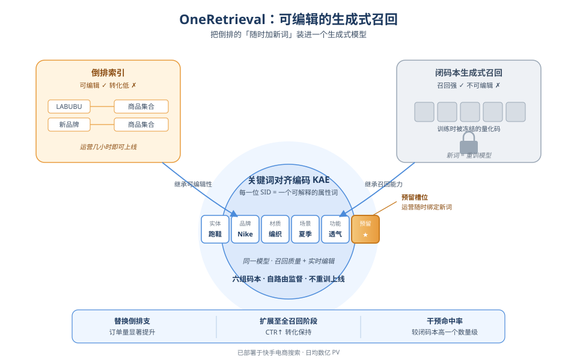
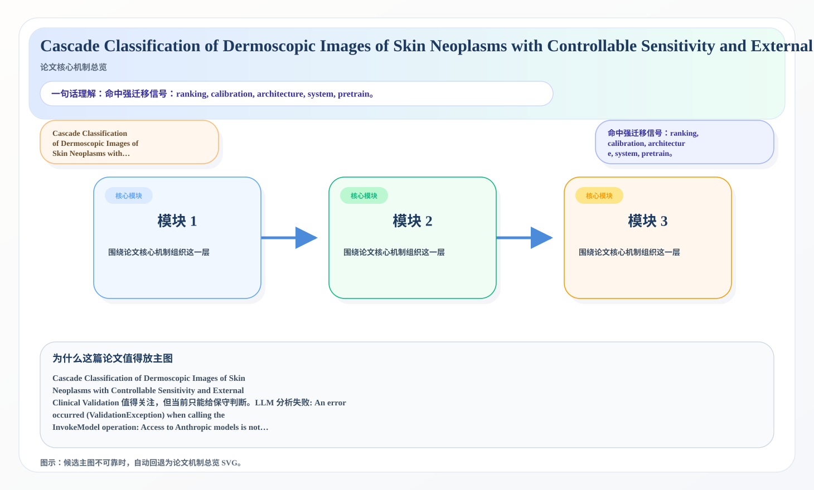

# 2026-06-12 论文日报

## 一、今日趋势与创新观察

### 1. 趋势概况

- 今天一共抓到 361 篇论文，趋势概况优先基于全量抓取结果而不是只看最后保留的候选。
- 从全量论文看，主题最集中的方向是：LLM 与语言理解、表示学习与检索排序、Agent 与多智能体。
- 进入候选池的工作里，直接广告 1 篇、强迁移 7 篇、大公司线索 3 篇，说明今天既有直接商业化问题，也有可迁移的方法论输入。

### 2. 推荐系统 / 排序相关创新点

- 《PRISMR: Overcoming Parse Collapse in Multimodal Listwise Ranking via Parameterized Representation Internalization》：亮点信号：dit, robust, semantic, context；主题：迁移学习与跨域泛化、LLM 与语言理解；候选属性：一般相关论文
- 《ERTS: Adversarial Robustness Testing of Ethical AI via Semantic Perturbation in a Bounded Consequence Space》：亮点信号：attack, dit, constraint, robust；主题：LLM 与语言理解；来自全量抓取的补充观察
- 《Learning What to Remember: A Cognitively Grounded Multi-Factor Value Model for Agentic Memory》：亮点信号：alignment, semantic, memory, context；主题：LLM 与语言理解、Agent 与多智能体；来自全量抓取的补充观察

### 3. 全局创新点

- 《TetherCache: Stabilizing Autoregressive Long-Form Video Generation with Gated Recall and Trusted Alignment》：亮点信号：diffusion, dit, cache, alignment；主题：商业化决策与资源优化；候选属性：一般相关论文

## 二、今日入选论文

### 1. OneRetrieval: Unifying Multi-Branch E-commerce Retrieval with an Editable Generative Model
- 挑选理由：快手电商搜索召回统一框架，工业部署影响订单量与CTR，直接作用于商业化流量分发链路。

### 2. Cascade Classification of Dermoscopic Images of Skin Neoplasms with Controllable Sensitivity and External Clinical Validation
- 挑选理由：命中强迁移信号：ranking, calibration, architecture, system, pretrain。

## 三、补充关注

1. **Real-Time Execution with Autoregressive Policies**
   - 理由：有一定相关信号，但不足以进入正式候选：matching。
2. **Decoding Insect Song: A Multitask Semisupervised Orthoptera Bioacoustic Classifier**
   - 理由：有一定相关信号，但不足以进入正式候选：multi-task。
3. **TetherCache: Stabilizing Autoregressive Long-Form Video Generation with Gated Recall and Trusted Alignment**
   - 理由：有一定相关信号，但不足以进入正式候选：recall。
4. **Diffusion Transformer World-Action Model for AV Scene Prediction**
   - 理由：有一定相关信号，但不足以进入正式候选：calibration。
5. **Improving Crash Frequency Prediction from Simulated Traffic Conflicts Using Machine Learning Based Microsimulation**
   - 理由：有一定相关信号，但不足以进入正式候选：calibration。
6. **AI-Automation Tooling in Computer Engineering Education: Mixed-Methods TAM/UTAUT Evidence for a General Acceptance Attitude**
   - 理由：有一定相关信号，但不足以进入正式候选：calibration。
7. **Simplex-Constrained Sparse Bagging: Transitioning from Uniform Priors to Sparse Posteriors in Ensemble Learning**
   - 理由：有一定相关信号，但不足以进入正式候选：calibration。
8. **The Geometry of Phase Transitions in Generative Dynamics via Projection Caustics**
   - 理由：有一定相关信号，但不足以进入正式候选：matching。
9. **A green solvent screening tool for emerging materials via uncertainty aware, transformer enhanced transfer learning**
   - 理由：有一定相关信号，但不足以进入正式候选：ranking。
10. **Detecting Functional Memorization in Code Language Models**
   - 理由：有一定相关信号，但不足以进入正式候选：counterfactual。

## 四、重点论文精读

### 1. OneRetrieval: Unifying Multi-Branch E-commerce Retrieval with an Editable Generative Model
- **为什么值得看：** 快手电商搜索召回统一框架，工业部署影响订单量与CTR，直接作用于商业化流量分发…
- **背景：** OneRetrieval: Unifying Multi-Branch E-commerce Retrieval with an Editable Generative Model 值得关注，但当前只能给保守判断。LLM 分析失败: An error occurred (ValidationException) when calling the InvokeModel operation: Access to Anthropic models is not allowed from unsupported countries, regions, or territories. Please refer to https://www.anthropic.com/supported-countries for more information on the countries and regions Anthropic currently supports.

*图示：快手电商搜索召回统一框架，工业部署影响订单量与CTR，直接作用于商业化流量分发链路。*

- **当前状态：** llm_failed（LLM 分析失败: An error occurred (ValidationException) when calling the InvokeModel operation: Access to Anthropic models is not allowed from unsupported countries, regions, or territories. Please refer to https://www.anthropic.com/supported-countries for more information on the countries and regions Anthropic currently supports.）
- **核心技术点：** 本次精读未成功，暂不展示结构化核心点，避免误导。
- **对广告的启发：** 暂时只保留候选判断，建议稍后重试精读。

### 2. Cascade Classification of Dermoscopic Images of Skin Neoplasms with Controllable Sensitivity and External Clinical Validation
- **为什么值得看：** 命中强迁移信号：ranking, calibration, architect…
- **背景：** Cascade Classification of Dermoscopic Images of Skin Neoplasms with Controllable Sensitivity and External Clinical Validation 值得关注，但当前只能给保守判断。LLM 分析失败: An error occurred (ValidationException) when calling the InvokeModel operation: Access to Anthropic models is not allowed from unsupported countries, regions, or territories. Please refer to https://www.anthropic.com/supported-countries for more information on the countries and regions Anthropic currently supports.

*图示：候选主图不可靠，已回退为论文核心机制总览 SVG。*

- **当前状态：** llm_failed（LLM 分析失败: An error occurred (ValidationException) when calling the InvokeModel operation: Access to Anthropic models is not allowed from unsupported countries, regions, or territories. Please refer to https://www.anthropic.com/supported-countries for more information on the countries and regions Anthropic currently supports.）
- **核心技术点：** 本次精读未成功，暂不展示结构化核心点，避免误导。
- **对广告的启发：** 暂时只保留候选判断，建议稍后重试精读。

## 五、候选但未完成深读的论文

- **OneRetrieval: Unifying Multi-Branch E-commerce Retrieval with an Editable Generative Model**
  - 状态：llm_failed
  - 原因：LLM 分析失败: An error occurred (ValidationException) when calling the InvokeModel operation: Access to Anthropic models is not allowed from unsupported countries, regions, or territories. Please refer to https://www.anthropic.com/supported-countries for more information on the countries and regions Anthropic currently supports.
- **Cascade Classification of Dermoscopic Images of Skin Neoplasms with Controllable Sensitivity and External Clinical Validation**
  - 状态：llm_failed
  - 原因：LLM 分析失败: An error occurred (ValidationException) when calling the InvokeModel operation: Access to Anthropic models is not allowed from unsupported countries, regions, or territories. Please refer to https://www.anthropic.com/supported-countries for more information on the countries and regions Anthropic currently supports.
