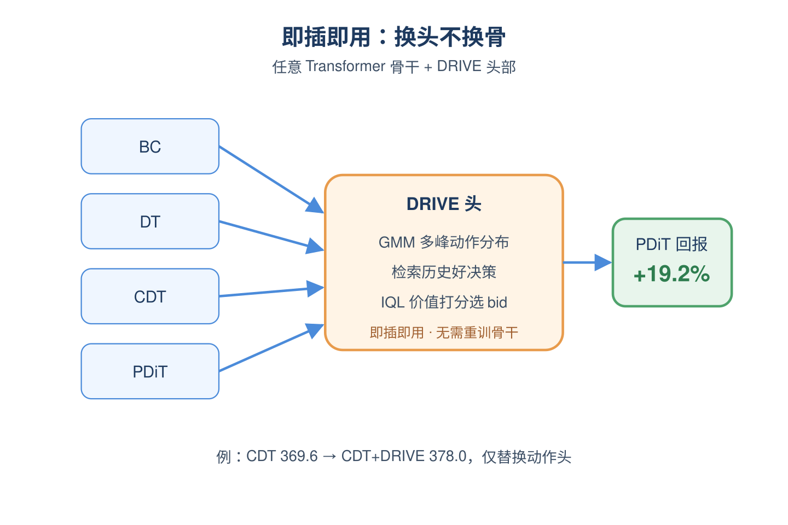

# 2026-06-15 论文日报

## 一、今日趋势与创新观察

### 1. 趋势概况

- 今日全量抓取278篇，cs.AI 148与cs.LG 117延续主导，cs.IR下滑至13篇但出现ChronoID、CoRe、生成式推荐去噪等高质量工业向工作。
- LLM与语言理解91篇仍是最大主题，但重心从纯文本生成进一步偏向可验证用户模拟、面向排序消费的查询改写与生成式推荐的语义ID设计。
- Agent与多智能体54篇继续抬升，研究焦点从能力提升转向长时运行runtime的静默失败分类、版本化推理记忆和技能条件信誉攻击等工程化议题。
- 迁移与跨域48篇、商业化决策21篇并行，电商定价、自动出价、跨域工作流抽象等真实业务系统占比上升。

### 2. 推荐系统 / 排序相关创新点

- DRIVE将分布式离线强化学习与检索增强相结合用于实时广告自动出价，在预算与成本约束下用Transformer序列建模规避在线探索风险，是少见的端到端工业出价方案。
- CoRe提出以下游多阶段ranker（recall/rawrank/finerank）的真实消费信号作为奖励、持续周级再训练的LLM查询改写器，把改写训练与排序链路真正闭环起来。
- ChronoID首次把显式时间信号注入生成式推荐的semantic ID编码，避免时间仅通过session构造或顺序隐式参与，对生成式排序的时序漂移建模有直接借鉴价值。

### 3. 全局创新点

- GitOfThoughts把LLM推理链和Agent记忆当成代码一样做版本控制，支持replay、diff和merge，为Agent可观测性与可审计性提供了新范式。
- Meta那篇long-lived Agent runtime的静默失败纵向研究，给出了真实生产环境下40+技能Agent的故障分类学，把Agent评测从能力榜单拉回到工程可靠性视角。
- HiLo-Token根据输入自适应地做高低频token压缩来加速DiT图像编辑，把频域先验引入token级压缩，对生成式系统的推理成本控制具有可迁移性。

### 4. 跨论文综合观察

- DRIVE、CoRe、High-Frequency Pricing三篇都在解决同一问题的不同层面：把序列建模或LLM能力下沉到真实商业化决策（出价、查询改写、定价），共同特征是离线训练+在线安全部署+与下游消费者对齐的奖励设计。
- ChronoID、生成式推荐隐式推理与去噪×流行度交互三篇围绕生成式/隐式反馈推荐展开，分别从ID表示、推理调用、数据偏置三个维度补齐生成式推荐的可靠性短板，方法论上共享对semantic ID与世界知识的再审视。
- GitOfThoughts、Meta静默失败研究和Skill-Conditional Reputation攻击共同反映出Agent研究正从'更强能力'转向'可观测、可信任、可回滚'的工程化阶段，与排序系统当年从模型精度走向链路稳定性的演进路径高度相似。

## 二、今日入选论文

### 1. DRIVE: Distributional and Retrieval-Augmented Bidding with Value Evaluation
- 挑选理由：明确为实时广告自动出价的离线RL+Transformer框架，直接命中广告核心链路

### 2. CoRe: A Continuously Reward-Finetuned LLM Query Rewriter for Multi-Stage Context-Aware Relevance in Web-Scale Video Search
- 挑选理由：工业短视频搜索的多阶段排序中查询改写，连接recall/rawrank/finerank整个排序链路，与商业化分发高度同构，已多次部署

## 三、补充关注

1. **ChronoID: Infusing Explicit Temporal Signals into Semantic IDs for Generative Recommendation**
   - 理由：生成式推荐的semantic ID时间感知，与商业化排序有同构参考价值但未直接涉及广告
2. **When Recommendation Denoising Meets Popularity Bias: Understanding and Mitigating Their Interaction**
   - 理由：推荐去噪与流行度偏置交互分析，对排序模型有参考但未直接对接广告链路

## 四、重点论文精读

### 1. DRIVE: Distributional and Retrieval-Augmented Bidding with Value Evaluation
- **为什么值得看：** 用GMM多模态+检索增强+价值评分解决自动出价的'平均动作陷阱'
- **背景：** 自动出价要在预算和CPA等约束下做长期最优决策，线上探索风险太大，所以业界普遍走离线RL+Transformer序列建模这条路。但作者指出现有DT类方法有两个硬伤：一是'平均动作陷阱'——同一市场状态下高价和低价两种策略可能都有效，单峰回归会把它们平均成一个既不够激进也不够保守的中间值；二是纯参数化模型缺少显式记住历史好决策的机制，在稀疏或长尾流量上容易给出不靠谱的出价。论文用工业级AuctionNet数据上的真实失败案例可视化了这两个问题，因此值得看。

*图示：这是一篇直接面向广告自动出价的离线强化学习论文，针对De…*

**核心技术点：**

#### 技术点 1：GMM多峰动作头
- 快速理解：把DT的回归头换成高斯混合，显式保留高价/低价等多种出价模式而不被平均掉。

*图示：直觉上原来DT输出一个数，相当于对所有合理出价做加权平均…*

- 技术细节：在Transformer骨干之上，用高斯混合模型作为动作头，针对当前轨迹上下文预测M个分量的混合权重、均值和方差，训练目标改为对历史动作的对数似然最大化（即用GMM负对数似然替代传统MSE）。推断时不再取单点输出，而是从该混合分布中采样L个候选出价，从而把'多种合理策略并存'这个事实显式建在分布里。
- 通俗讲解：直觉上原来DT输出一个数，相当于对所有合理出价做加权平均，结果就是个'谁也不像'的折中价。换成GMM后，模型输出的是'有30%概率应该出高价、70%概率应该出低价'这种带峰的分布，推断时就能采样出几个分别对应不同策略的候选动作，留待后面的critic挑选。论文还顺便和扩散动作头做了对比，发现GMM性能相当但单步推断只需11ms，扩散要223ms，所以更适合实时竞价。
- 例子：论文展示的真实例子里，某个市场状态下数据集中同时存在出价≈5和出价≈15两类成功决策，DT被训成输出≈10这个谁都吃亏的平均值；换成GMM后模型会预测出两个峰（一个均值5、一个均值15），采样得到一组候选动作，再交给critic决定这次到底走激进路线还是保守路线。

#### 技术点 2：检索增强候选生成
- 快速理解：用状态embedding在历史库里捞高RTG的相似决策做补充候选，缓解稀疏长尾不稳。

*图示：这一步的思想是：与其完全靠模型参数'想象'一个动作，不如…*

- 技术细节：用Transformer编码器把离线数据里每个时刻的(轨迹上下文, RTG, 状态)编成向量h，建成检索索引，key是h、value是该步的动作和RTG。推断时把当前决策上下文也编成h，先按余弦相似度取Top-Kpool近邻，再在这些近邻里按存储的RTG从高到低排序选Top-K个动作作为'检索候选'，与GMM采样的生成候选合并成统一候选池。
- 通俗讲解：这一步的思想是：与其完全靠模型参数'想象'一个动作，不如在历史日志里找'过去在类似状态下、回报很高的人是怎么出价的'，把这些真实成功案例直接抬出来当候选。这样在稀疏区或长尾流量上就不会让模型瞎编，而是有真实可参考的锚点。流程上就是状态先过编码器拿到向量，再去FAISS式索引里查相似项，按历史回报排序挑出最优秀的几个动作。
- 例子：假设当前是某长尾品类、剩余预算偏低的状态h-t，索引中找出余弦相似度最高的50个历史时刻，再按这些时刻当时的RTG排序，挑出回报最高的5个对应动作（比如分别是bid=6.2、6.5、7.0等），把它们直接塞进候选池，让最终决策有据可依而不是模型臆测。

#### 技术点 3：IQL critic统一打分选bid
- 快速理解：用IQL训练的Q函数对生成+检索的所有候选打分，取双Q最小值最大者作最终出价。

*图示：前两步只负责'多给几个靠谱选项'，真正的决策权交给一个保…*

- 技术细节：用Implicit Q-Learning范式离线训练两个Q网络和一个V网络：V用期望分位回归（参数η在0.5到1之间）去逼近Q分布的高分位，Q用r+γV(s')做Bellman目标，避免对OOD动作显式打分。对于带CPA约束的任务，把奖励r替换成约束感知的r' = r·min(1, (K/(C+ε)) β)（K为目标CPA，C为实际CPA，β=2），让价值函数自动倾向可行域。推断时把GMM采样的L个候选和检索得到的K个候选合并，挑选使min(Q1,Q2)最大的那个动作执行。
- 通俗讲解：前两步只负责'多给几个靠谱选项'，真正的决策权交给一个保守的价值评估器。IQL好处是它只在数据集支持的动作上学Q值，不会被OOD动作带偏，所以即使候选池里偶尔混入奇怪动作也不会被错误高估。CPA约束通过把超标时的奖励按比例衰减直接刻进Q值，让critic天然知道'超CPA是亏的'，自然会选回安全区。
- 例子：在某一步，GMM采出动作(4.8, 5.1, 14.7, 15.2)，检索补充(5.0, 14.9)，critic给它们的min双Q分别打出比如(8.2, 8.5, 7.1, 6.8, 8.6, 7.0)；如果当前实际CPA已经接近超标，约束塑形会把高价那几个动作的Q值压低，最终选中检索得到的5.0这个既符合多峰真实策略又满足CPA的动作。

#### 技术点 4：即插即用骨干通用性
- 快速理解：三件套可挂到BC/DT/CDT/PDiT等多种Transformer骨干上，普遍涨点。

*图示：也就是说这套方案不绑定特定骨干，本质是把'决策'从'生成…*

- 技术细节：论文把GMM动作头+检索模块+IQL critic作为通用组件，在BC、DT、CDT、PDiT四种Transformer策略骨干上分别替换掉原有的回归动作头并接入推断期检索与打分流程，在AuctionNet上各档预算下都能稳定提升平均价值，PDiT骨干上平均回报相对提升约19.2%。
- 通俗讲解：也就是说这套方案不绑定特定骨干，本质是把'决策'从'生成'里拆出来——任何能输出动作分布的Transformer都可以被改造成多峰输出，再外挂检索和价值评估。对工业团队意味着不用推翻现有DT类出价模型，只要替换头部、加挂索引和critic就能升级。
- 例子：原本线上跑的是CDT做约束出价（回报369.6），把动作头替换成GMM、加挂RTG检索索引、再训一个IQL critic做最终选bid，就升级成CDT+DRIVE版本，平均回报提升到378.0，整套改动不需要重训骨干。

- **对广告的启发：** 对DT/decision-transformer类自动出价系统是一套可直接落地的稳定性增强方案。
- **适用边界：** 方法依赖离线日志中存在足够多样且高回报的决策样本，否则检索环节没东西可捞；同时整套效果建立在critic能在分布内准确估值上，若市场环境快速漂移、历史Q估计与当前真实价值脱节，选bid可能反而被critic误导。
- **实践建议：** 如果你们的自动出价已经在用DT/CDT类离线RL，可优先尝试把回归动作头换成GMM并加一个IQL critic做候选打分，先在长尾/稀疏品类上小流量A/B验证'平均动作陷阱'是否被缓解，再决定是否再上检索索引这一层。

### 2. CoRe: A Continuously Reward-Finetuned LLM Query Rewriter for Multi-Stage Context-Aware Relevance in Web-Scale Video Search
- **为什么值得看：** 字节短视频搜索LLM改写器周更5个月落地，全链路工业经验密度极高
- **背景：** LLM查询改写在工业上有个核心矛盾：训练奖励要真正反映线上排序怎么用这个改写，否则离线提升上线无效；但奖励又要足够便宜，才能跟上数据漂移做周级再训练。已有方法要么用离线reranker做奖励代理，存在仿真-生产gap，要么用全在线GRPO代价过高。CoRe在TikTok短视频搜索连续部署5个月，给出了一套完整的工业级解法，对广告这种同构的多阶段排序+持续迭代场景有直接参考价值。

*图示：这是一篇字节TikTok短视频搜索的工业落地论文，把基于…*

**核心技术点：**

#### 技术点 1：奖励函数对齐生产融合代数
- 快速理解：奖励直接调用线上多模态相关性模型，用乘法比值形式镜像线上融合公式

*图示：核心思想是：线上排序用乘法把相关性融合进总分，那训练奖励…*

- 技术细节：奖励由三部分组成：正样本池（严格点击文档，按点击率加权）的相关性平均分Spos、硬负样本池（曝光未操作，按未操作率加权）的Sneg、随机文档池的Srand。基础奖励写成两段乘法比值：Spos的(1+γ)次方除以Sneg，再乘以Spos/Srand的α次方，分别对应精排级和召回级对比信号。打分函数s(q,d)直接调用线上部署的多模态相关性模型，即训练用的就是线上排序用的同一个打分器。后期还加了长度和截断惩罚，防止改写越写越长来刷奖励。
- 通俗讲解：核心思想是：线上排序用乘法把相关性融合进总分，那训练奖励也用同样的乘法结构，这样改写器优化的方向和上线后真正影响排序的方向是一致的。硬负样本对应精排要解决的难区分场景，随机负样本对应召回要解决的海选场景，所以一个奖励里同时塞了这两种比值，训练出来的改写既能在精排打分高，也能让召回阶段能捞回来。
- 例子：比如用户刚看完一个'露营装备测评'视频，紧接着搜'帐篷'。系统取这次会话里点了的几个帐篷视频做正样本池，曝光但没点的做硬负，再随机挑5个无关视频做易负。改写器采样N个候选改写如'户外露营帐篷推荐'，每个候选喂给线上多模态相关性模型给三个池子打分，按上面那个乘法比值算出标量奖励，奖励高的就是更靠近线上排序意图的改写。

#### 技术点 2：半在线MPO训练循环
- 快速理解：用阶段化采样+top-k/bottom-k配对，把GRPO级别的开销压到周更可承受

*图示：为什么不用全在线GRPO？因为改写很短，每步耗时主要在反…*

- 技术细节：训练分阶段进行：每个阶段开始时用上一阶段策略采样N个改写并打分，只取奖励最高k个和最低k个组成k×k对偏好对，并要求奖励差超过阈值才保留；如果原始query奖励本身就很高（超过所有改写加margin），则改成原query作正例和随机改写作负例。损失用MPO混合：DPO项做相对排序、BCO项做绝对校准（防止DPO常见的正负联合下沉）、SFT项做分布锚定。阶段边界做余弦warm restart，参数同步从per-step降到per-phase，奖励调用也能错峰批量。
- 通俗讲解：为什么不用全在线GRPO？因为改写很短，每步耗时主要在反向传播而不是rollout，GRPO对所有N条轨迹都算梯度太浪费。半在线方案是：一个阶段内只rollout一次、只用top-k vs bottom-k那几对最有区分度的样本反复训一个epoch，参数同步也只在阶段切换时做一次。混合损失是为长跨度持续训练的稳定性服务的——纯DPO会让正负样本log概率一起塌，BCO拉住绝对值，SFT拉住分布。
- 例子：周一拿上周日志做训练实例，每个query采样N=8个改写，奖励排序后取top2和bottom2，凑出4个偏好对，奖励差小于阈值的丢掉。这一批偏好对在一个MPO epoch里被反复用，期间不重新采样、不同步线上推理服务。一个阶段结束后再用新参数重新rollout下一阶段。

#### 技术点 3：双族指标自动晋级闸门
- 快速理解：奖励类3指标+稳定性类4指标全部通过才上线，抓到过真实的奖励作弊

*图示：为什么需要稳定性这一族？因为奖励函数对自己的漏洞是看不见…*

- 技术细节：每周再训练后产生候选模型θ'，和当前线上θ\*在下一周hold-out日志上对比。奖励类指标包括完整奖励rmain、正样本池均分Spos、易负比rrand三个分项；稳定性类包括top-10 token熵、平均surprisal、改写平均长度、长度截断率四个。晋级规则是合取式：3个奖励类必须全部严格提升，4个稳定性类必须全部落在配置区间内，任何一项不满足就拒绝。5个月20次再训练晋级了16次（80%），其中3次是被稳定性指标拦下的。
- 通俗讲解：为什么需要稳定性这一族？因为奖励函数对自己的漏洞是看不见的——pilot期间就出过一次：改写越写越长去堆正样本相关性，奖励还在涨，但token长度和截断率明显异常，只有结构性指标能抓到这种'奖励中性的漂移'。所以晋级闸门不是只看奖励涨没涨，还要看模型行为有没有发生病态变化。
- 例子：某周候选模型rmain提升了0.02，Spos和rrand也都微涨，看起来该上。但avg-token-length从22涨到27，stop-rate从0.4涨到0.8（一半多的改写都被长度cap截断），稳定性闸门直接拒绝晋级，保留上周模型，把候选打入log排查。下一周用新数据重训通常就不会再触发这个模式。

#### 技术点 4：近线缓存+并行加性消费
- 快速理解：改写器输出在召回/粗排/精排三处都作为新增信号叠加而非替换原信号

*图示：关键设计是'加性'而不是'替换'：原相关性信号永远保留…*

- 技术细节：7B改写器不在线上请求路径上同步生成，而是异步触发：(q,d-last)事件到达后改写器近线生成，结果写进以(q,d-last,id)为key的内存KV缓存。在线请求来时查缓存：命中就在召回加一路上下文相关性检索器、在粗排把s(改写,d)作为L0/L1融合因子相乘、在精排把它喂进full-relevance乘法因子；未命中或改写器宕机就回退到原排序链路。生产中缓存命中率超过90%。
- 通俗讲解：关键设计是'加性'而不是'替换'：原相关性信号永远保留，改写器的信号是在它之上再叠一层。这样最坏情况——缓存miss、改写器超时、甚至完全宕机——排序质量退化到baseline，而不是把整个pipeline打挂。消融实验证实如果改成替换式，虽然部分指标更高，但内容安全和长尾相关性会出现兜底缺失。
- 例子：用户搜'帐篷'，系统查(q,d-last)缓存拿到改写'户外露营帐篷推荐'。召回阶段除了原来按'帐篷'走的几路检索，还多加一路按改写query检索；粗排在原打分公式上乘一个改写相关性因子；精排在full-rel乘法分里多塞一个上下文相关性节点。如果缓存没命中，整个流程就当改写器不存在，按老逻辑走。

- **对广告的启发：** 广告多阶段排序的query改写/扩展可直接套这套奖励-训练-晋级-消费四件套
- **适用边界：** 方法依赖近线缓存高命中率（论文报90%+）和明确的'last viewed document'类窄上下文信号；如果广告场景上下文更稀疏或query更长尾，缓存收益和奖励信号密度都会下降。另外奖励完全锚在线上相关性模型，长期可能强化已有偏差，论文也提到未来要补engagement-aware项。
- **实践建议：** 如果团队在做广告侧LLM改写或创意生成，先别急着调prompt和模型大小——优先把'奖励代数和线上融合公式对齐'+'稳定性指标进晋级闸门'这两件事落下来，能直接避免大半的上线翻车和奖励作弊。
